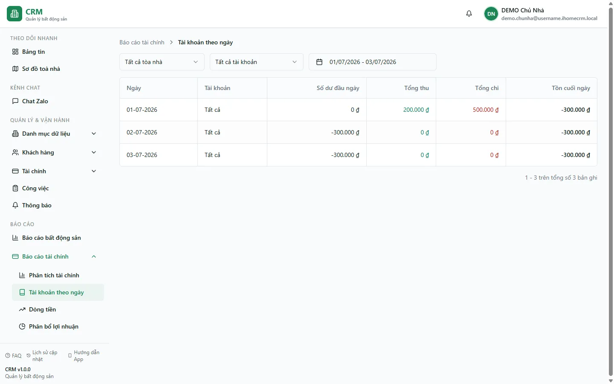

# Báo cáo: Sổ quỹ theo ngày

Báo cáo cần quyền `reports_finance.daily_cashbook` và tổng hợp movement của từng sổ theo ngày.

## Cách đọc số

| Chỉ số | Ý nghĩa |
| --- | --- |
| Số dư đầu ngày | Balance trước các movement của ngày. |
| Thu trong ngày | Tổng signed movement vào từ POSTING/REVERSAL phù hợp. |
| Chi trong ngày | Tổng signed movement ra. |
| Tồn cuối ngày | Số dư sau các movement trong ngày. |

RPC `cashflow_by_day` chuyển sang phép tổng hợp Finance V2 posting-aware. Vì vậy báo cáo không đơn giản cộng mọi phiếu có nhãn `APPROVED`; phiếu chỉ duyệt nhưng chưa post không làm thay đổi số.

## Bộ lọc và phạm vi

- Lọc đúng khoảng ngày, tòa và sổ quỹ trước khi so sánh.
- Khi không lọc, chuyển nội bộ và movement của sổ ảo có thể xuất hiện.
- Nhãn **Thu/Chi** ở đây mô tả chuyển động tiền của sổ, không khẳng định đó là doanh thu/chi phí kinh doanh.

::: info Đối chiếu với màn Sổ quỹ
Màn `/finance/cashbooks` vẫn đọc balance legacy, còn báo cáo này đọc dữ liệu posting-aware. Trong giai đoạn dual-run, nếu số khác nhau hãy kiểm tra posting/reversal và phạm vi lọc; không giả định hai màn dùng cùng một nguồn.
:::

## Đối soát theo ngày

Dùng số as-of ở đây để hỗ trợ kiểm đếm. Phiên [Bàn giao & đối soát](/03-quan-ly-van-hanh/ban-giao-doi-soat/) chỉ ghi snapshot so sánh và không khóa sổ. Đóng sổ vĩnh viễn là thao tác khác tại [Sổ quỹ](/03-quan-ly-van-hanh/so-quy/).

## Quy trình liên quan

- [Sổ quỹ](/03-quan-ly-van-hanh/so-quy/)
- [Bàn giao tiền & đối soát](/03-quan-ly-van-hanh/ban-giao-doi-soat/)
- [Dòng tiền](/04-bao-cao/dong-tien/)
- [Thu chi](/03-quan-ly-van-hanh/thu-chi/)
