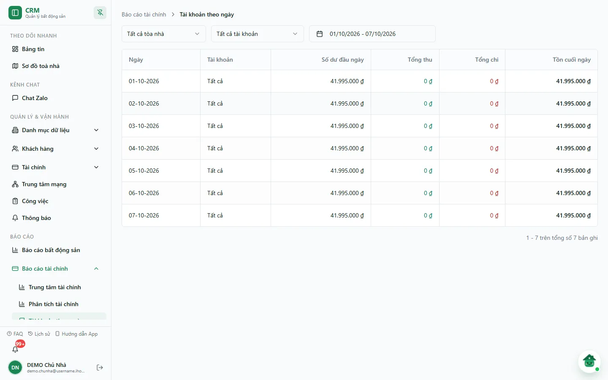
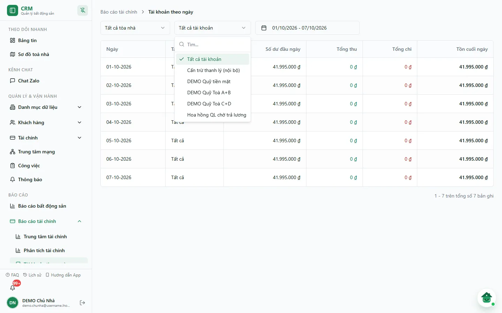

# Báo cáo: Sổ quỹ theo ngày

Báo cáo liệt kê từng ngày trong khoảng chọn với **số dư đầu ngày**, **tổng thu**, **tổng chi** và **tồn cuối ngày** của sổ quỹ. Chỉ các bút toán đã ghi sổ (phiếu ở trạng thái **Đã Thu/Đã Chi**) mới làm thay đổi số; phiếu mới được duyệt nhưng chưa ghi sổ không được tính.

::: info Điều kiện tiên quyết
- Tài khoản có quyền **Báo cáo Sổ quỹ ngày** (`reports_finance.daily_cashbook`).
- Số chỉ cộng các sổ quỹ mà tài khoản được phép xem số dư.
:::

::: tip Tên trên menu khác tên trên thẻ
Trên thanh bên trái, báo cáo này mang tên **Tài khoản theo ngày**, và dòng điều hướng đầu trang cũng ghi **Báo cáo tài chính › Tài khoản theo ngày**. Trên trang [Báo cáo tài chính](/04-bao-cao/hub-tai-chinh/) thì thẻ vẫn ghi **Sổ quỹ theo ngày**. Hai tên là cùng một báo cáo.
:::

## Hướng dẫn từng bước

**Bước 1**: Tại thanh bên trái, ấn **Báo cáo tài chính** => **Tài khoản theo ngày** (hoặc thẻ **Sổ quỹ theo ngày** trên trang tổng hợp). Mặc định báo cáo lấy **Tất cả tòa nhà**, **Tất cả tài khoản**, từ ngày 1 của tháng hiện tại đến hôm nay.

**Bước 2**: Thu hẹp phạm vi bằng ba bộ lọc trên cùng:

- Ô toà nhà: **Tất cả tòa nhà** hoặc một toà (chỉ chọn được một toà; có cả toà ảo dùng cho chi phí chung).
- Ô tài khoản: **Tất cả tài khoản** hoặc một sổ quỹ cụ thể. Cột **Tài khoản** của bảng hiện tên sổ đang chọn, hoặc **Tất cả**.
- Ô khoảng ngày: chọn ngày bắt đầu và kết thúc.

Cuối bảng có dòng đếm dạng *"1 - 7 trên tổng số 7 bản ghi"* — mỗi ngày trong khoảng là một bản ghi, kể cả ngày không phát sinh.

## Cách đọc số

| Cột | Ý nghĩa |
| --- | --- |
| Số dư đầu ngày | Ngày đầu tiên: tổng bút toán đã ghi sổ **trước** ngày bắt đầu. Các ngày sau: bằng tồn cuối ngày hôm trước. |
| Tổng thu | Tổng bút toán làm tăng sổ trong ngày (gồm cả bút toán đảo chiều mang dấu tăng). |
| Tổng chi | Tổng bút toán làm giảm sổ trong ngày. |
| Tồn cuối ngày | Số dư đầu ngày + Tổng thu − Tổng chi. |

Ảnh chụp ngày 07/10/2026 (DEMO): từ 01/10 đến 07/10/2026 không có phát sinh, số dư giữ nguyên 41.995.000 ₫ — khớp với chênh lệch tháng 9/2026 trên báo cáo [Dòng tiền](/04-bao-cao/dong-tien/).

::: warning Số dư đầu ngày không gồm số dư ban đầu của sổ
Số dư đầu ngày chỉ cộng các bút toán đã ghi sổ trước ngày bắt đầu; nó **không** cộng số dư ban đầu khai khi tạo sổ quỹ. Nếu sổ có số dư ban đầu, số ở đây có thể thấp hơn **Tồn quỹ** trên màn [Sổ quỹ](/03-quan-ly-van-hanh/so-quy/) đúng bằng khoản đó. Đối chiếu hai màn bằng phần phát sinh, không bằng số dư tuyệt đối.
:::

## Bộ lọc và phạm vi

- Lọc đúng khoảng ngày, toà và sổ quỹ trước khi so sánh.
- Khi chọn **Tất cả tài khoản**, chuyển tiền nội bộ giữa hai sổ hiện ở cả hai phía (một bên thu, một bên chi), và các sổ nội bộ (ví dụ sổ cấn trừ, sổ chờ trả) cũng được cộng vào.
- Nhãn **Tổng thu/Tổng chi** mô tả tiền vào/ra sổ, không khẳng định đó là doanh thu/chi phí kinh doanh.
- Bộ lọc được nhớ trên trình duyệt; lần sau mở lại vẫn giữ toà, sổ và khoảng ngày cũ.

## Đối soát theo ngày

Dùng số tồn cuối ngày ở đây để hỗ trợ kiểm đếm. Phiên [Bàn giao & đối soát](/03-quan-ly-van-hanh/ban-giao-doi-soat/) chỉ ghi lại một lần so sánh và không khoá sổ. Đóng sổ vĩnh viễn là thao tác riêng tại [Sổ quỹ](/03-quan-ly-van-hanh/so-quy/).

## Tình huống & lỗi thường gặp

| Tình huống | Nguyên nhân & cách xử lý |
|---|---|
| Phiếu đã duyệt nhưng không thấy trong ngày | Phiếu chưa được ghi sổ (chưa **Đã Thu/Đã Chi**), hoặc ngày ghi sổ khác ngày trên phiếu. Kiểm tra phiếu ở [Thu chi](/03-quan-ly-van-hanh/thu-chi/). |
| Chọn một sổ thì báo lỗi, không hiện số | Tài khoản không được phép xem số dư của sổ đó. Chọn **Tất cả tài khoản** hoặc nhờ người giữ sổ xem. |
| Số khác Tồn quỹ ở màn Sổ quỹ | Xem cảnh báo về số dư ban đầu ở trên; kiểm tra thêm phạm vi toà/sổ và bút toán đảo chiều. |

## Quy trình liên quan

- [Sổ quỹ](/03-quan-ly-van-hanh/so-quy/)
- [Bàn giao tiền & đối soát](/03-quan-ly-van-hanh/ban-giao-doi-soat/)
- [Dòng tiền](/04-bao-cao/dong-tien/)
- [Thu chi](/03-quan-ly-van-hanh/thu-chi/)
