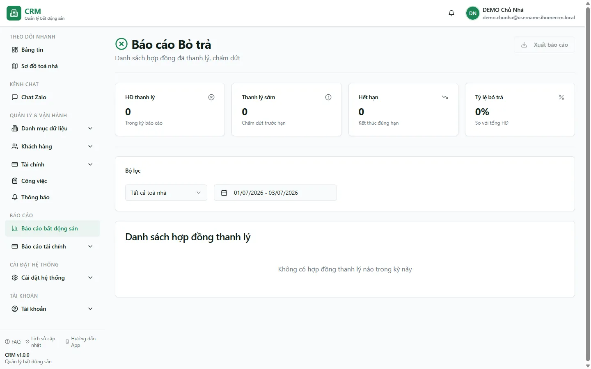

# Báo cáo: Thanh lý / bỏ trả

Route cần `reports_real_estate.terminations`. Mặc định report xem từ đầu tháng hiện tại đến hôm nay.

## Danh sách và mốc ngày

Hook tải mọi hợp đồng chưa xóa có status `TERMINATED` hoặc `EXPIRED`, rồi lọc client-side:

- Tòa theo quan hệ phòng → tòa.
- Ngày hiệu lực = `actual_end_date ?? end_date`.
- Khoảng ngày áp trên ngày hiệu lực đó.

Hook tải thêm `contract_terminations` cho các contract id để lấy `notes` và `termination_type`. Nếu không có chi tiết:

- EXPIRED hiển thị **Hết hạn**.
- TERMINATED fallback **Thanh lý**.

## Bốn thẻ số

- **HĐ thanh lý**: tổng dòng TERMINATED + EXPIRED trong bộ lọc.
- **Thanh lý sớm**: đếm status TERMINATED; tên thẻ không kiểm tra thực tế `actual_end_date < end_date`.
- **Hết hạn**: đếm EXPIRED.
- **Tỷ lệ bỏ trả** = số dòng đã lọc / tổng mọi HĐ chưa xóa có status khác DRAFT trên toàn phạm vi RLS.

::: warning Mẫu số không theo cùng bộ lọc
Mẫu số của tỷ lệ không lọc theo tòa hoặc khoảng ngày, trong khi tử số có lọc. Vì vậy tỷ lệ khi chọn một tòa/kỳ là số kết thúc của phần lọc chia cho tổng HĐ vận hành toàn phạm vi, không phải tỷ lệ nội bộ của riêng tòa/kỳ đó.
:::

## Kiểm tra hoàn cọc

Cột **Tiền cọc** là `contracts.total_deposit`, không tự chứng minh tiền thật còn giữ. Nút **Kiểm tra** mở preview so sánh số hoàn trên hồ sơ với cọc thật:

- Nếu khách còn nợ hoặc số hoàn bằng 0, không tạo phiếu chi.
- Nếu hợp lệ, tạo phiếu hoàn ở trạng thái **CHỜ DUYỆT**; tiền chưa ra khỏi két ngay.
- Trường hợp cảnh báo cần lý do ép và chỉ chủ tổ chức có thể ép theo luồng hiện hành.

Do đó không dùng cột tiền cọc làm số hoàn trực tiếp và không mô tả nút này là chi tiền ngay.

## Xuất và giới hạn

File `bao-cao-bo-tra` không chứa cột/nội dung kiểm tra hoàn cọc. Các query hợp đồng và termination details không phân trang rõ ràng; dữ liệu lớn có thể chịu cap API. Nếu truy vấn chi tiết termination lỗi, hook hiện không throw lỗi đó và có thể chỉ hiển thị fallback lý do.

## Quy trình liên quan

- [Thanh lý — Khách rời phòng](/03-quan-ly-van-hanh/thanh-ly-move-out/)
- [Thanh lý — Khách bỏ cọc](/03-quan-ly-van-hanh/thanh-ly-forfeit/)
- [Hoàn/bỏ cọc](/03-quan-ly-van-hanh/hoan-bo-coc/)
- [Chờ duyệt](/03-quan-ly-van-hanh/cho-duyet/)
