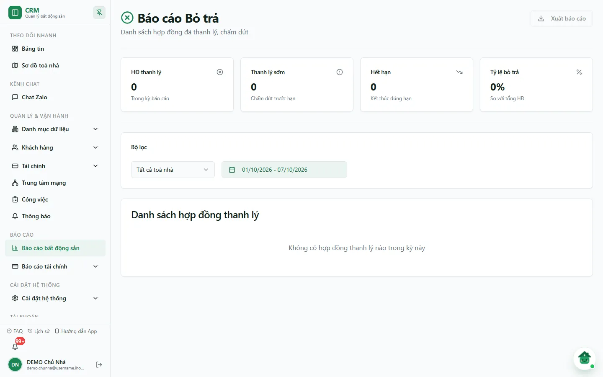
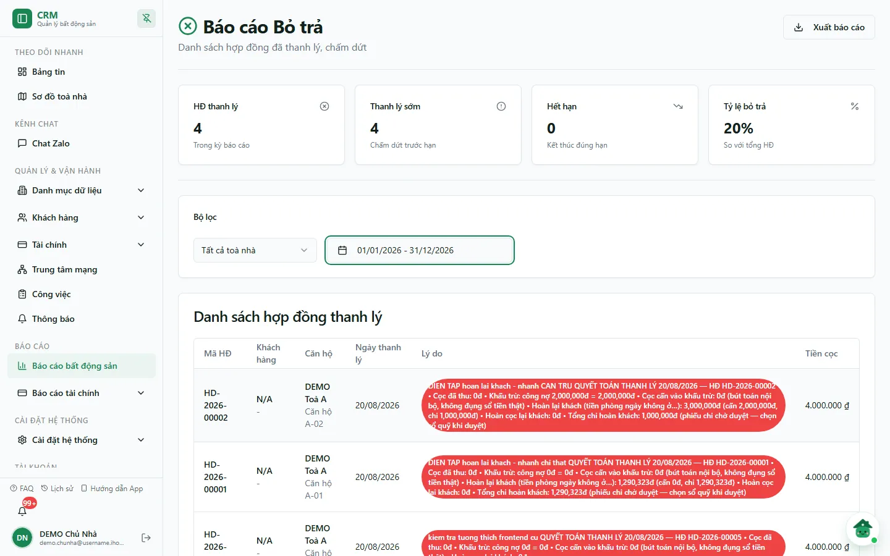

# Báo cáo: Thanh lý / bỏ trả

Màn **Báo cáo Bỏ trả** liệt kê các hợp đồng đã kết thúc (thanh lý hoặc hết hạn) trong kỳ, kèm lý do và tiền cọc ghi trên hợp đồng. Đây là màn **chỉ xem**: không còn nút tạo phiếu hoàn cọc trên báo cáo; việc hoàn cọc làm trong luồng [thanh lý](/03-quan-ly-van-hanh/thanh-ly-move-out/).

::: info Điều kiện tiên quyết
- Quyền **Báo cáo Bỏ trả / thanh lý** (`reports_real_estate.terminations`).
:::

## Hướng dẫn từng bước

**Bước 1**: Tại menu bên trái, ấn **Báo cáo bất động sản** => thẻ **Báo cáo bỏ trả** => **Xem báo cáo →**. Mặc định báo cáo xem **từ đầu tháng hiện tại đến hôm nay**.

**Bước 2**: Ấn ô khoảng ngày để đổi kỳ (nút nhanh **Hôm nay**, **7 ngày**, **30 ngày**, **90 ngày**, **Tháng này**, **Năm nay** hoặc chọn trên lịch); nếu cần, chọn một toà ở ô **Tất cả toà nhà**.

**Bước 3**: Ấn **Xuất báo cáo** để lấy file `bao-cao-bo-tra` (Excel/CSV) gồm mã HĐ, khách hàng, căn hộ, ngày thanh lý, lý do và tiền cọc.

Snapshot DEMO ngày 07/10/2026: kỳ mặc định (01/10–07/10) trống; chọn **Năm nay** ra **4 hợp đồng** đều kết thúc ngày 20/08/2026, **Thanh lý sớm** 4, **Hết hạn** 0, **Tỷ lệ bỏ trả** 20%.

## Danh sách và mốc ngày

Báo cáo tải mọi hợp đồng chưa xoá ở trạng thái **TERMINATED** hoặc **EXPIRED**, rồi lọc trên trình duyệt:

- Ngày dùng để lọc và hiển thị ở cột **Ngày thanh lý** = ngày trả phòng thực tế (`actual_end_date`), nếu trống thì ngày kết thúc theo hợp đồng.
- Toà lọc theo phòng của hợp đồng.

Cột **Lý do** hiển thị theo thứ tự: ghi chú trong biên bản thanh lý → mã loại thanh lý → nếu không có biên bản thì **Hết hạn** (EXPIRED) hoặc **Thanh lý** (TERMINATED). Nhãn đỏ cho TERMINATED, xám cho EXPIRED. Với hợp đồng thanh lý qua luồng quyết toán, ghi chú thường là cả đoạn tóm tắt quyết toán dài.

## Bốn thẻ số

| Thẻ | Cách tính |
|---|---|
| **HĐ thanh lý** | Tổng dòng TERMINATED + EXPIRED trong bộ lọc. |
| **Thanh lý sớm** | Số dòng trạng thái TERMINATED — không kiểm tra ngày trả phòng có thật sự sớm hơn hạn hay không. |
| **Hết hạn** | Số dòng trạng thái EXPIRED. |
| **Tỷ lệ bỏ trả** | Số dòng đã lọc / tổng mọi hợp đồng chưa xoá khác **nháp** trong phạm vi bạn được xem. |

::: warning Mẫu số không theo bộ lọc
Mẫu số của **Tỷ lệ bỏ trả** không lọc theo toà hay khoảng ngày, còn tử số thì có. Khi chọn một toà/kỳ, tỷ lệ là số hợp đồng kết thúc của phần đã lọc chia cho tổng hợp đồng toàn phạm vi, không phải tỷ lệ riêng của toà/kỳ đó.
:::

## Cột Tiền cọc không phải số hoàn

Cột **Tiền cọc** là tổng cọc ghi trên hợp đồng, không cho biết cọc đã thu thật, đã hoàn hay đã bị trừ bao nhiêu. Muốn biết tiền cọc thật và phiếu hoàn, xem [Hoàn/bỏ cọc](/03-quan-ly-van-hanh/hoan-bo-coc/) và [Danh sách cọc](/04-bao-cao/danh-sach-coc/). Phiếu hoàn cọc tạo trong luồng thanh lý chỉ là tiền ra thật khi đã **Đã Chi** (posting_status = POSTED), không phải khi mới duyệt.

## Tình huống & lỗi thường gặp

| Tình huống | Nguyên nhân & cách xử lý |
|---|---|
| Không thấy nút **Kiểm tra** hoàn cọc như tài liệu cũ | Nút đã được gỡ khỏi báo cáo (09/2026). Hoàn cọc làm trong luồng [thanh lý](/03-quan-ly-van-hanh/thanh-ly-move-out/). |
| Ô **Lý do** quá dài, chữ tràn khỏi nhãn | Ghi chú biên bản thanh lý được hiển thị nguyên văn. Xem đầy đủ ở [chi tiết hợp đồng](/03-quan-ly-van-hanh/hop-dong-chi-tiet/). |
| Cột **Khách hàng** hiện “N/A” | Báo cáo lấy khách từ trường khách chính (`tenant_id`) của hợp đồng; hợp đồng không có giá trị này sẽ hiện N/A. |
| Báo cáo hiện lỗi tải | Cả truy vấn hợp đồng lẫn truy vấn biên bản thanh lý lỗi đều làm cả báo cáo lỗi; tải lại trang. |

Giới hạn kỹ thuật: các truy vấn không phân trang, có thể chạm giới hạn số dòng của API khi dữ liệu rất lớn.

## Quy trình liên quan

- [Thanh lý — Khách rời phòng](/03-quan-ly-van-hanh/thanh-ly-move-out/)
- [Thanh lý — Khách bỏ cọc](/03-quan-ly-van-hanh/thanh-ly-forfeit/)
- [Hoàn/bỏ cọc](/03-quan-ly-van-hanh/hoan-bo-coc/)
- [Cho thuê mới](/04-bao-cao/cho-thue-moi/)
