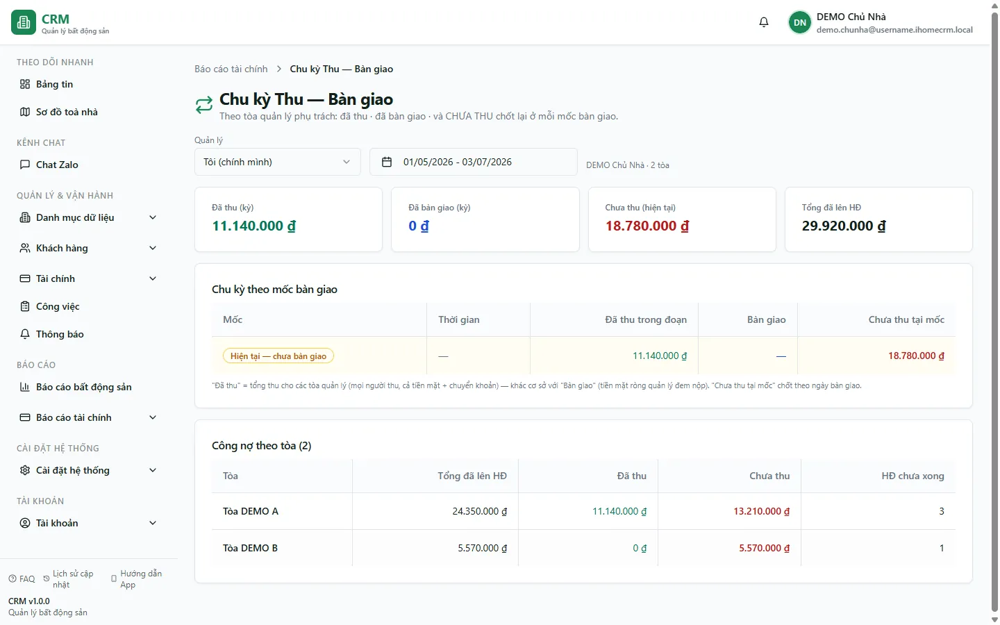

# Báo cáo: Chu kỳ Thu → Bàn giao

Báo cáo **Chu kỳ Thu → Bàn giao** trả lời một câu hỏi rất thực tế của người đi thu tiền: *"Tiền tôi thu về đã nộp cho chủ đủ chưa, và các tòa tôi quản lý còn nợ bao nhiêu?"*. Báo cáo gắn số tiền **đã thu** vào từng **mốc bàn giao** (mỗi lần bạn nộp tiền về cho chủ) và tại mỗi mốc, nó **chốt lại số Chưa thu point-in-time** — tức tổng còn nợ trên **toàn bộ hóa đơn** của các tòa bạn phụ trách **đúng vào thời điểm** bàn giao đó. Nhờ vậy bạn nhìn được cả một **chu kỳ**: thu về → nộp chủ → còn nợ giảm dần theo từng mốc, thay vì chỉ một con số tổng.

Ai nên xem: **quản lý tòa / người đi thu** (ví dụ Nathan, Joey) muốn tự soi chu kỳ thu → nộp của mình; **kế toán** cần đối chiếu "đã thu so với đã bàn giao" trong kỳ; **chủ nhà** muốn theo dõi tiến độ thu nợ và nộp tiền của từng người phụ trách, từng tòa. Đây là màn **chỉ để xem** — bạn không ghi thu tiền hay tạo phiếu bàn giao ở đây.

::: info Điều kiện tiên quyết
- Quyền **Báo cáo tài chính => Xem** (module `reports_finance`, action `view`; báo cáo này là feature key `collection_cycle`) để mở màn hình.
- **Dự phòng cho người đi thu**: nếu bạn được quyền **thu tiền hóa đơn** (`invoices.record_payment`) thì vẫn **xem được chu kỳ của CHÍNH MÌNH** dù chủ đã tắt quyền `reports_finance.view` — bạn có thể vào thẳng từ trang **Thu tiền** (biểu tượng ↻ *Repeat*).
- **Phạm vi tòa** tính theo phân công của bạn (`staff_assignments` ∪ khu vực `area_buildings` đang hiệu lực); người có **toàn quyền** hoặc **super admin** thấy tất cả các tòa.
- **Xem của người khác**: chỉ **admin / super admin** mới chọn được người quản lý khác; người thường luôn chỉ thấy chu kỳ của chính mình.
:::

## Cách mở

**Bước**: Vào menu **Báo cáo** => nhóm **Tài chính** => **Chu kỳ Thu → Bàn giao**. Ngoài ra, khi đang ở trang **Thu tiền** (`/thu-tien`), bạn bấm biểu tượng **↻ (Repeat)** để vào thẳng chu kỳ của mình. Màn hình mở ra với **bộ lọc khoảng thời gian** (và ô **Người quản lý** nếu bạn là admin), bốn **thẻ tổng** ở đầu, một **bảng theo tòa** và một **dòng thời gian các mốc bàn giao**.

## Bộ lọc & cách đọc số

Báo cáo gồm ba khối: **bốn thẻ tổng** (số toàn kỳ), **bảng theo từng tòa**, và **dòng thời gian mốc bàn giao**. Đơn vị tiền là đồng (đ).

| Cột / Chỉ số | Ý nghĩa |
| --- | --- |
| Bộ lọc **Khoảng thời gian** | Chọn **từ ngày — đến ngày**. Toàn bộ "đã thu trong kỳ", "đã bàn giao trong kỳ" và các mốc bàn giao đều nằm trong khoảng này. |
| Bộ lọc **Người quản lý** | Người đang được soi chu kỳ. Mặc định là **chính bạn**. **Chỉ admin / super admin** đổi được sang người khác; người thường để trống = chính mình. |
| Thẻ **Đã thu trong kỳ** | Tổng tiền bạn (người quản lý) **thu về** từ hóa đơn của các tòa phụ trách, trong khoảng thời gian đã chọn. |
| Thẻ **Đã bàn giao trong kỳ** | Tổng tiền bạn đã **nộp về cho chủ** (qua các phiếu bàn giao) trong kỳ. So với **Đã thu trong kỳ** để biết còn giữ bao nhiêu chưa nộp. |
| Thẻ **Chưa thu hiện tại** | Tổng **còn nợ tính tới lúc này** trên toàn bộ hóa đơn của các tòa bạn quản lý (điểm chốt *point-in-time* mới nhất). Ví dụ nếu hóa đơn phòng **A102** còn nợ **2.570.000đ** và **A105** quá hạn **6.070.000đ** thì hai khoản này góp vào con số này. |
| Thẻ **Tổng đã lên HĐ** | Tổng giá trị **đã xuất hóa đơn** của các tòa phụ trách — mẫu số để so với đã thu / chưa thu. |
| Bảng theo tòa — cột **Tòa** | Tên tòa bạn phụ trách (ví dụ **Tòa DEMO A**, **Tòa DEMO B**). |
| Bảng theo tòa — cột **Tổng HĐ** | Tổng đã lên hóa đơn của riêng tòa đó. |
| Bảng theo tòa — cột **Đã thu** | Đã thu được của tòa đó. |
| Bảng theo tòa — cột **Chưa thu** | Còn nợ của tòa đó tính tới hiện tại (Tổng HĐ − Đã thu). |
| Bảng theo tòa — cột **Số HĐ chưa xong** | Số **hóa đơn chưa thu đủ** của tòa (còn nợ một phần hoặc toàn bộ). Ví dụ một tòa đang có A102 và A105 chưa thu đủ thì cột này là **2**. |
| Dòng thời gian — mốc **Bàn giao** | Mỗi lần bạn nộp tiền về chủ là một **mốc**, xếp theo thời gian. |
| Dòng thời gian — **Thu trong đoạn** | Số tiền thu được trong **đoạn giữa hai mốc bàn giao** liền nhau (thu bao nhiêu rồi mới nộp). |
| Dòng thời gian — **Net** | Số **bàn giao ròng** ghi nhận tại mốc đó (số thực nộp về chủ ở lần bàn giao ấy). |
| Dòng thời gian — **Chưa thu tại mốc** | Con số cốt lõi: tổng **còn nợ point-in-time** trên toàn bộ hóa đơn các tòa **đúng tại thời điểm** bàn giao. Theo dõi cột này giảm dần qua các mốc để biết công nợ đang được thu về. |
| Dòng thời gian — dòng **HIỆN TẠI (CURRENT)** | Dòng cuối cùng, chốt số **Chưa thu tính đến bây giờ** (khớp với thẻ **Chưa thu hiện tại**) — mốc "giả" đại diện cho thời điểm bạn đang xem. |

::: tip Cách đọc cho đúng
- **Đã thu vs Đã bàn giao**: hai thẻ này *khác nhau*. "Đã thu" là tiền bạn nhận từ khách; "Đã bàn giao" là tiền bạn đã nộp về chủ. Chênh lệch = phần **bạn đang giữ, chưa nộp** — đối chiếu thêm với [Bàn giao & đối soát](/03-quan-ly-van-hanh/ban-giao-doi-soat/) để biết *còn phải nộp*.
- **"Chưa thu" là point-in-time, không phải cộng dồn trong kỳ**: mỗi mốc chốt lại tổng nợ *tại thời điểm đó* trên **mọi** hóa đơn của tòa (kể cả hóa đơn tháng cũ), nên con số phản ánh **bức tranh nợ thực tế** ở mốc ấy, không phải "nợ phát sinh trong đoạn".
- **Phạm vi theo tòa bạn quản lý**: nếu bạn chỉ phụ trách Tòa DEMO A thì mọi con số chỉ tính hóa đơn của DEMO A; đổi phân công tòa sẽ làm báo cáo đổi theo.
:::

## Nguồn số liệu

Báo cáo được tính hoàn toàn ở máy chủ bằng một hàm chuyên dụng (RPC) `manager_collection_cycle_report(người_quản_lý, từ_ngày, đến_ngày)`, chạy dưới quyền hệ thống và **tự kiểm tra phạm vi tòa** của bạn — không lọc theo người tạo phiếu, nên tính đủ cả phiếu do nhân viên tạo.

- **Số đã thu** lấy từ các lần **thu tiền hóa đơn** (đã ghi vào sổ cái thu chi) của các tòa bạn phụ trách trong kỳ.
- **Số đã bàn giao / các mốc bàn giao** lấy từ các **phiếu bàn giao tiền** (nghiệp vụ gốc xem [Bàn giao tiền & đối soát chốt sổ](/03-quan-ly-van-hanh/ban-giao-doi-soat/)).
- **Số chưa thu** = tổng `còn nợ` (giá trị hóa đơn trừ đã thu) trên **toàn bộ hóa đơn** của các tòa, được **chốt lại tại từng mốc** thời điểm bàn giao và tại thời điểm hiện tại.
- **Phạm vi tòa** = các tòa trong `staff_assignments` cộng khu vực `area_buildings` đang hiệu lực; người **toàn quyền / super admin** thấy tất cả. Muốn xem chu kỳ của **người khác** phải là **admin / super admin** (hàm tự chặn nếu không đủ quyền).

Vì mọi con số bám vào hóa đơn và phiếu bàn giao thật, báo cáo này **khớp với sổ quỹ** và các báo cáo công nợ khác — không phải số nhanh ước lượng.

## Xuất & mẹo

- Màn hình **chưa có nút xuất file** riêng. Muốn lưu lại, bạn **in / lưu PDF** từ trình duyệt (Ctrl / Cmd + P) hoặc chụp màn hình.
- **Vào nhanh khi đang thu tiền**: ở trang **Thu tiền** bấm biểu tượng **↻ (Repeat)** để mở ngay chu kỳ của mình — tiện kiểm tra "mình còn giữ bao nhiêu chưa nộp" ngay trong lúc đi thu.
- **Người đi thu không cần quyền báo cáo đầy đủ**: chỉ cần quyền **thu tiền hóa đơn** là xem được chu kỳ **của chính mình** (không mở được các báo cáo tài chính khác).
- **Muốn biết chính xác "còn phải nộp" và chốt số theo ngày**: dùng [Bàn giao & đối soát](/03-quan-ly-van-hanh/ban-giao-doi-soat/). **Muốn xem tồn quỹ từng ngày**: dùng [Sổ quỹ theo ngày](/04-bao-cao/so-quy-ngay/). **Muốn xem các hóa đơn còn phải thu**: dùng [Quy trình thu tiền](/01-bat-dau/quy-trinh-thu-tien/).

## Thử trực tiếp trên sandbox

<SandboxTry account="demo.chunha" app-path="/reports/finance/thu-ban-giao" view-only>

Bài này **chỉ xem** — bạn quan sát chu kỳ Thu → Bàn giao, không ghi tiền:

1. Chọn **Khoảng thời gian** phủ tháng 7/2026 (từ 01/07 đến hôm nay).
2. **Hãy nhìn thấy** bốn thẻ tổng ở đầu: **Đã thu trong kỳ**, **Đã bàn giao trong kỳ**, **Chưa thu hiện tại** và **Tổng đã lên HĐ**. So **Đã thu** với **Đã bàn giao** để thấy phần còn giữ chưa nộp.
3. **Hãy nhìn thấy** thẻ **Chưa thu hiện tại** phản ánh các khoản còn nợ: hóa đơn phòng **A102** (**2.570.000đ**) và **A105** quá hạn (**6.070.000đ**) đều góp vào con số này.
4. Ở **bảng theo tòa**, **hãy nhìn thấy** **Tòa DEMO A** và **Tòa DEMO B** tách riêng: mỗi tòa có **Tổng HĐ**, **Đã thu**, **Chưa thu** và **Số HĐ chưa xong** (tòa còn A102 và A105 chưa thu đủ hiện **Số HĐ chưa xong = 2**).
5. Ở **dòng thời gian**, **hãy nhìn thấy** mỗi **mốc bàn giao** kèm **Thu trong đoạn**, **Net** và **Chưa thu tại mốc**; dòng cuối **HIỆN TẠI** khớp đúng với thẻ **Chưa thu hiện tại**. Tìm lần thu **1.000.000đ** của khách **Nguyễn Văn A** rơi vào đoạn giữa hai mốc và cộng vào **Thu trong đoạn**.

Kết quả mong đợi: bạn hiểu **chu kỳ thu → nộp chủ** — đã thu bao nhiêu, đã nộp bao nhiêu, còn nợ bao nhiêu — và đọc được số **Chưa thu point-in-time** giảm dần qua từng mốc bàn giao.

</SandboxTry>

## Quy trình liên quan

- [Bàn giao tiền & đối soát chốt sổ](/03-quan-ly-van-hanh/ban-giao-doi-soat/) — tạo phiếu bàn giao, xem *còn phải nộp* và chốt số dư sổ theo ngày; nguồn của các mốc bàn giao trong báo cáo này.
- [Thu tiền hóa đơn](/03-quan-ly-van-hanh/thu-tien-hoa-don/) — ghi nhận thu tiền (TM/TK/TT) sinh ra số "đã thu" và nút ↻ vào thẳng chu kỳ.
- [Sổ quỹ theo ngày](/04-bao-cao/so-quy-ngay/) — tồn quỹ từng sổ theo ngày (as-of), đối chiếu với tiền đã thu/đã nộp.
- [Quy trình thu tiền](/01-bat-dau/quy-trinh-thu-tien/) — xem các hóa đơn còn phải thu, bổ trợ cho con số "Chưa thu".
- [Sổ quỹ](/03-quan-ly-van-hanh/so-quy/) — quản lý từng sổ quỹ, số dư và khóa sổ.
- [Quy trình bàn giao](/01-bat-dau/quy-trinh-ban-giao/) — thu → bàn giao → chốt sổ.
- [Quy trình chốt tháng](/01-bat-dau/quy-trinh-chot-thang/) — chu kỳ vận hành cuối tháng liên quan tới thu và bàn giao.
