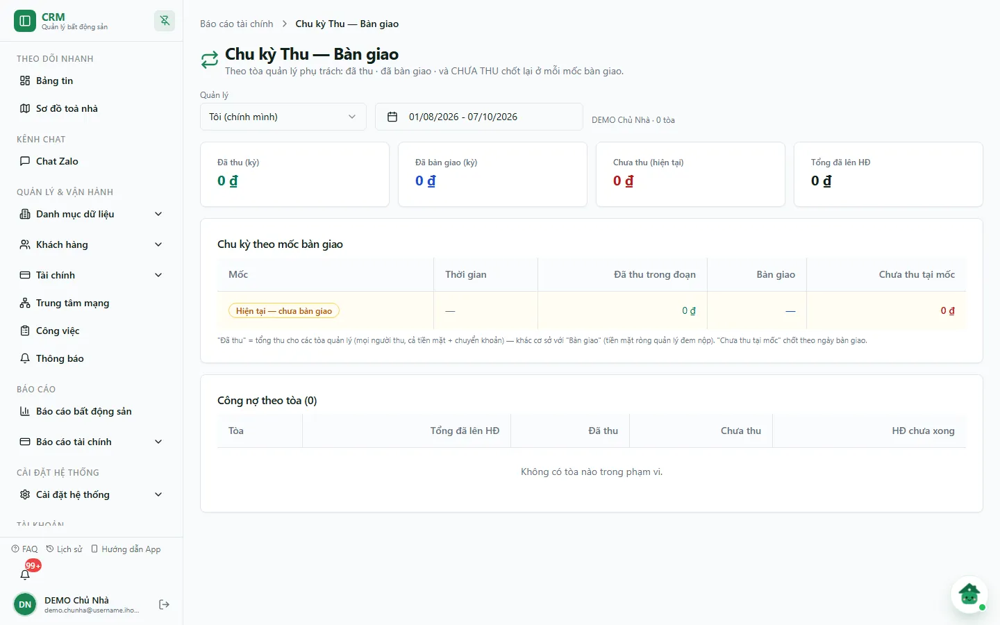

# Báo cáo: Chu kỳ Thu — Bàn giao

Báo cáo **Chu kỳ Thu — Bàn giao** tổng hợp, theo các toà mà một quản lý phụ trách: đã thu bao nhiêu trong kỳ, đã bàn giao bao nhiêu, và tiền **chưa thu** còn lại tại mỗi mốc bàn giao. Quản lý dùng để tự xem chu kỳ của mình; chủ nhà dùng để rà từng quản lý.

::: info Điều kiện tiên quyết
- Tài khoản có đúng quyền **Báo cáo Chu kỳ Thu — Bàn giao (theo tòa QL)** (`reports_finance.collection_cycle`). Quyền thu tiền (`thu_tien.collect`) không thay cho quyền này.
- Báo cáo chỉ có số khi người được xem có phân công phụ trách toà (theo toà hoặc theo cụm).
:::

## Hướng dẫn từng bước

**Bước 1**: Mở báo cáo theo một trong hai lối:

- Trang [Báo cáo tài chính](/04-bao-cao/hub-tai-chinh/) => thẻ **Chu kỳ Thu — Bàn giao**. Báo cáo này **không** có mục riêng trên thanh bên trái.
- Màn [Thu tiền](/03-quan-ly-van-hanh/thu-tien-mobile/) => nút biểu tượng hai mũi tên vòng (gợi ý *"Chu kỳ Thu → Bàn giao (công nợ tòa của tôi)"*) trên thanh công cụ của khung thu tiền. Nút chỉ hiện khi có quyền `collection_cycle`.

**Bước 2**: Chọn **Quản lý** và khoảng ngày. Mặc định là **Tôi (chính mình)** và khoảng từ ngày 1 của hai tháng trước đến hôm nay. Bên phải bộ lọc hiện tên người đang xem và số toà trong phạm vi (ví dụ *"DEMO Chủ Nhà · 0 tòa"*).

Danh sách **Quản lý** lấy từ những người dùng mà tài khoản được phép thấy. Chỉ quản trị viên mới xem được báo cáo của người khác; người khác chọn một quản lý khác sẽ bị báo *"Bạn không có quyền xem báo cáo của người khác"*.

Ảnh chụp ngày 07/10/2026: `demo.chunha` không được phân công toà nào nên báo cáo hiện **0 tòa**, mọi thẻ bằng 0 ₫ và danh sách **Quản lý** chỉ có **Tôi (chính mình)**.

## Cách đọc

| Khối | Ý nghĩa |
| --- | --- |
| **Đã thu (kỳ)** | Tổng tiền thu trên hoá đơn của các toà phụ trách trong khoảng ngày — của mọi người thu, cả tiền mặt lẫn chuyển khoản, không tính cấn trừ. |
| **Đã bàn giao (kỳ)** | Tổng các phiên bàn giao đã xác nhận mà quản lý là người giao, trong khoảng ngày. |
| **Chưa thu (hiện tại)** | Tiền còn phải thu trên hoá đơn đã chốt của các toà phụ trách, tính đến hiện tại. |
| **Tổng đã lên HĐ** | Tổng tiền các hoá đơn đã chốt của các toà phụ trách. |
| **Chu kỳ theo mốc bàn giao** | Mỗi dòng là một phiên bàn giao (mã, sổ nguồn, thời gian) với **Đã thu trong đoạn**, **Bàn giao** và **Chưa thu tại mốc**. Dòng cuối **Hiện tại — chưa bàn giao** là đoạn từ mốc gần nhất đến nay. |
| **Công nợ theo tòa** | Từng toà: **Tổng đã lên HĐ**, **Đã thu**, **Chưa thu**, **HĐ chưa xong**. |

Hoá đơn nháp, chờ duyệt hoặc đã huỷ không được tính.

## Không dùng chênh lệch làm tồn quỹ chính xác

::: warning “Đã thu − Đã bàn giao” chỉ là chỉ báo chu kỳ
Hai số khác cơ sở: **Đã thu** gồm tiền mọi người thu cho các toà (cả chuyển khoản), còn **Bàn giao** là tiền mặt ròng quản lý đem nộp. Chênh lệch vì vậy không bằng tiền người thu đang giữ. **Đã thu** ở đây cũng chưa khẳng định tiền đã ghi sổ (**Đã Thu**). Muốn biết số dư chính xác của sổ, dùng [Sổ quỹ theo ngày](/04-bao-cao/so-quy-ngay/).
:::

Tương tự, **Chưa thu tại mốc** là ảnh chụp công nợ hoá đơn tại ngày bàn giao, không phải tiền di chuyển trong riêng đoạn đó.

## Đối chiếu

1. Chọn đúng quản lý và khoảng ngày.
2. Kiểm tra các mốc bàn giao và số thu trong từng đoạn.
3. Mở [Bàn giao & đối soát](/03-quan-ly-van-hanh/ban-giao-doi-soat/) để xem phiên bàn giao nguồn.
4. Mở [Sổ quỹ theo ngày](/04-bao-cao/so-quy-ngay/) để xác nhận số dư sổ.
5. Mở danh sách hoá đơn hoặc màn Thu tiền để truy các khoản còn nợ.

## Tình huống & lỗi thường gặp

| Tình huống | Nguyên nhân & cách xử lý |
|---|---|
| Hiện **0 tòa**, mọi số bằng 0 ₫ | Người được xem chưa được phân công toà/cụm nào. Kiểm tra phân công nhân viên. |
| Chọn quản lý khác thì báo không có quyền | Chỉ quản trị viên xem được báo cáo của người khác. Chọn lại **Tôi (chính mình)**. |
| Mở báo cáo bị đưa về trang chủ | Tài khoản thiếu quyền `reports_finance.collection_cycle`. |

## Quy trình liên quan

- [Thu tiền tại phòng](/03-quan-ly-van-hanh/thu-tien-mobile/)
- [Bàn giao tiền & đối soát](/03-quan-ly-van-hanh/ban-giao-doi-soat/)
- [Sổ quỹ theo ngày](/04-bao-cao/so-quy-ngay/)
- [Hoá đơn](/03-quan-ly-van-hanh/hoa-don/)
