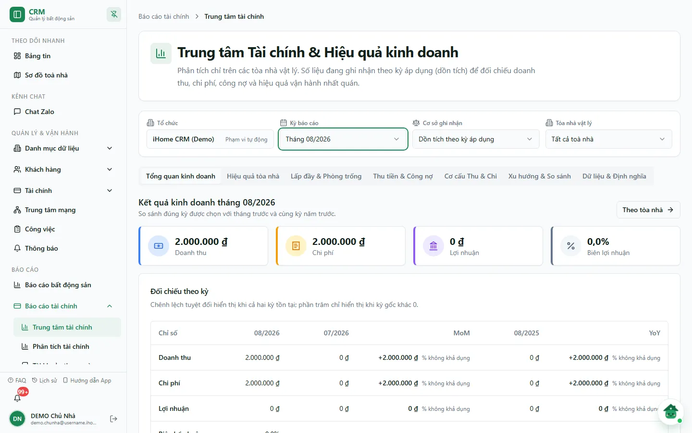
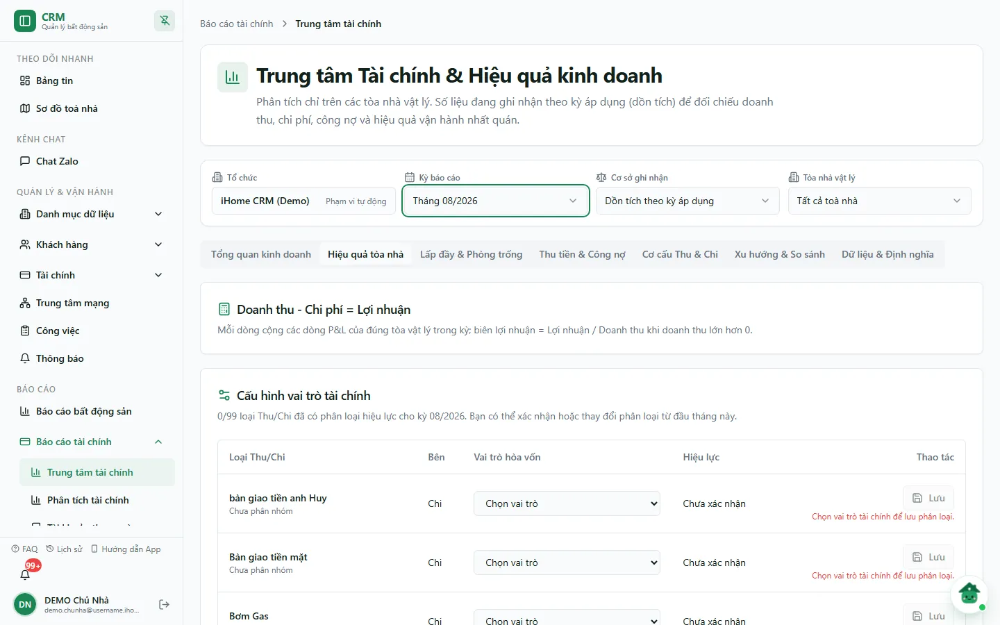
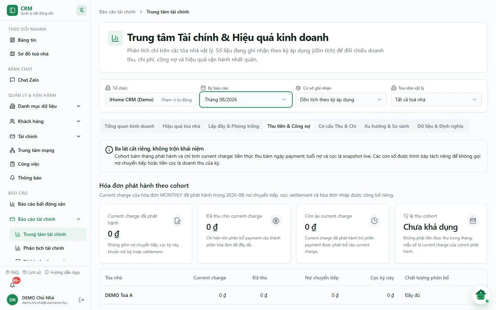
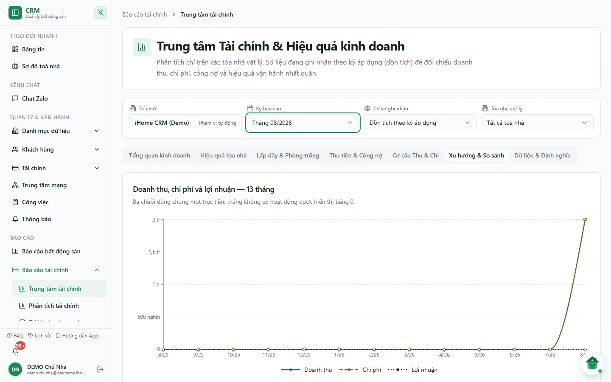
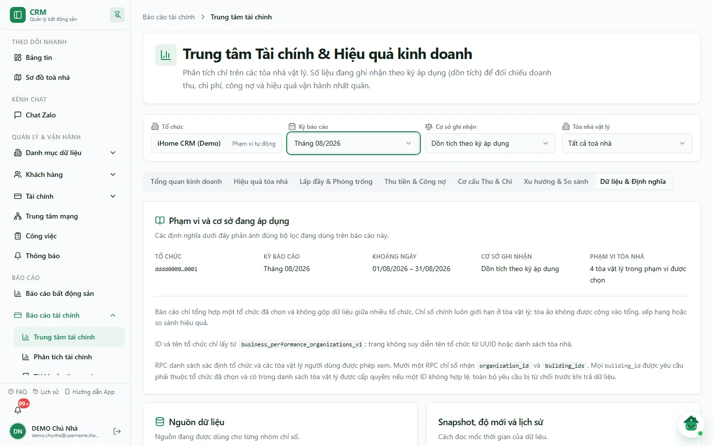

# Trung tâm tài chính

**Trung tâm Tài chính & Hiệu quả kinh doanh** gom trên một màn các câu hỏi chủ nhà hay hỏi
mỗi tháng: tháng này lãi hay lỗ, toà nào kéo lợi nhuận xuống, còn bao nhiêu phòng trống,
khách đang nợ bao nhiêu và xu hướng 13 tháng ra sao. Màn chỉ tính **toà nhà vật lý** (toà ảo
"Chung" không cộng vào tổng) và chỉ tổng hợp **một công ty** mỗi lần xem.

Dùng màn này để nhìn nhanh toàn cảnh. Khi cần đào sâu một khía cạnh, dùng màn chuyên biệt:

| Màn | Dùng khi |
|---|---|
| **Trung tâm tài chính** (trang này) | Xem tổng quan KQKD + lấp đầy + công nợ + xu hướng theo từng toà vật lý, có MoM/YoY và hoà vốn. |
| [Phân tích tài chính](/04-bao-cao/phan-tich-tai-chinh/) (`/reports/finance/analysis`) | Phân tích sâu doanh thu, chi phí, lợi nhuận theo nhóm/hạng mục với 5 tab riêng. |
| [Báo cáo Lợi Nhuận](/03-quan-ly-van-hanh/chia-loi-nhuan/) (`/reports/finance/profit-distribution`) | Chốt và chia lợi nhuận cho cổ đông — đây là nghiệp vụ chốt sổ, không phải màn xem số. |
| [Dòng tiền](/04-bao-cao/dong-tien/), [Tài khoản theo ngày](/04-bao-cao/so-quy-ngay/) | Truy tiền thật đã vào/ra sổ quỹ. |

::: info Điều kiện tiên quyết
- Mục menu **Trung tâm tài chính** chỉ hiện khi hệ thống trả về ít nhất một công ty có toà vật lý
  bạn được xem. Route không có chặn quyền riêng ở giao diện; việc kiểm quyền nằm ở máy chủ:
  với từng toà, tài khoản phải có quyền **BC Phân tích tài chính** (`reports_finance.analysis`;
  nếu quyền này chưa được khai báo thì xét quyền xem báo cáo tài chính `reports_finance.view`)
  và được truy cập toà đó.
- Năm góc nhìn có số tiền (**Tổng quan kinh doanh**, **Hiệu quả tòa nhà**, **Thu tiền & Công nợ**,
  **Cơ cấu Thu & Chi**, **Xu hướng & So sánh**) còn đòi quyền **Xem & sửa phiếu hạng mục HẠN CHẾ**
  (`income_expenses.restricted_view`) trên **mọi** toà đang chọn. Thiếu quyền này, màn chỉ còn
  **Lấp đầy & Phòng trống** và **Dữ liệu & Định nghĩa**, kèm thông báo *Phạm vi xem được giới hạn theo quyền*.
- Cần có phiếu thu chi đã duyệt, hoá đơn và hợp đồng trong kỳ thì các ô số mới có giá trị.
:::

## Hướng dẫn từng bước

**Bước 1**: Tại màn hình chính, ấn chọn **Báo cáo tài chính** => **Trung tâm tài chính**. Màn mở góc
nhìn **Tổng quan kinh doanh**. Trên cùng là bốn bộ lọc:

- **Tổ chức**: nếu tài khoản chỉ thuộc một công ty, ô hiện tên công ty kèm chữ *Phạm vi tự động*.
  Nếu thuộc nhiều công ty, chọn một công ty trước (báo cáo không cộng gộp chéo công ty).
- **Kỳ báo cáo**: chọn tháng (mặc định tháng hiện tại, có ô tìm tháng).
- **Cơ sở ghi nhận**: **Dồn tích theo kỳ áp dụng** (mặc định) hoặc **Theo ngày phiếu — đối chiếu**.
- **Tòa nhà vật lý**: để **Tất cả toà nhà** hoặc chọn một/vài toà.

Góc nhìn **Tổng quan kinh doanh** có bốn ô **Doanh thu**, **Chi phí**, **Lợi nhuận**, **Biên lợi nhuận**
của tháng đã chọn, bảng **Đối chiếu theo kỳ** (so với tháng trước — MoM và cùng kỳ năm trước — YoY),
khối **Lấp đầy hiện tại**, **Phải thu và tiền cọc** và **Quan sát thực tế**. Nút **Theo tòa nhà**,
**Xem lấp đầy & phòng trống**, **Xem thu tiền & công nợ**, **Xem cơ cấu Thu & Chi** chuyển nhanh sang
góc nhìn tương ứng.

**Bước 2**: Ấn **Hiệu quả tòa nhà** để xem từng toà. Đầu trang là công thức **Doanh thu - Chi phí = Lợi nhuận**,
tiếp theo là **Cấu hình vai trò tài chính** (phân loại từng loại Thu/Chi để tính hoà vốn), **Hòa vốn theo tòa**
(tháng đã chọn và bình quân 3 tháng) và cuối cùng là bảng theo toà với cột **Doanh thu**, **Chi phí**, **LN**,
**Margin**, **MoM net**, **YoY net**.

::: warning Nút Lưu trong Cấu hình vai trò tài chính là thao tác ghi
Tài khoản có quyền sửa danh mục (`categories.edit`) thấy ô **Vai trò hòa vốn** và nút **Lưu** trên từng dòng.
Lưu sẽ ghi phân loại có hiệu lực **từ đầu tháng đang chọn** cho cả công ty, làm thay đổi số hoà vốn. Người
không có quyền chỉ thấy chế độ chỉ đọc. Danh sách loại Thu/Chi có thể dài (DEMO có 99 dòng), nên bảng theo
toà nằm ở cuối trang — cuộn xuống để xem.
:::

**Bước 3**: Ấn **Thu tiền & Công nợ**. Góc nhìn này cố ý tách ba lát cắt để không trộn khái niệm:

- **Hóa đơn phát hành theo cohort**: chỉ tính *current charge* của hoá đơn tháng phát hành trong kỳ —
  **Current charge đã phát hành**, **Đã thu cho current charge**, **Còn lại current charge**, **Tỷ lệ thu cohort**
  (không gồm nợ chuyển tiếp, cọc, settlement). Tỷ lệ chỉ hiện khi phân bổ tiền vào thành phần hoá đơn đã đầy đủ.
- **Tiền thực thu trong tháng**: tổng khoản thanh toán còn hiệu lực theo ngày thanh toán, đã loại các lần hoàn tác.
- **Công nợ phải thu hiện tại**: **Tổng phải thu hiện tại**, **Cọc đang giữ**, **Hợp đồng có trạng thái ACTIVE**
  và **Phân bổ tuổi nợ hiện tại** — đây là ảnh chụp lúc xem, không phải số cuối tháng đã chọn.

**Bước 4**: Ấn **Xu hướng & So sánh** để xem biểu đồ **Doanh thu, chi phí và lợi nhuận — 13 tháng**,
**Biên lợi nhuận và tỷ lệ chi phí — 13 tháng**, bảng **So sánh kỳ báo cáo** và **Bảng dữ liệu thay thế cho biểu đồ**
(cùng số liệu dạng bảng). Tháng không có hoạt động hiển thị bằng 0.

**Bước 5**: Khi số liệu khó hiểu, ấn **Dữ liệu & Định nghĩa**. Tab ghi lại đúng bộ lọc đang áp dụng
(**Tổ chức**, **Kỳ báo cáo**, **Khoảng ngày**, **Cơ sở ghi nhận**, **Phạm vi tòa nhà**), nguồn của từng nhóm
chỉ số, cách đọc snapshot và giới hạn khi diễn giải.

## Số liệu được tính thế nào

::: danger Lợi nhuận trên màn này không phải tiền thật trong sổ quỹ
- **Doanh thu / Chi phí / Lợi nhuận (KQKD)** cộng các phiếu thu chi **đã duyệt** (trạng thái duyệt `APPROVED`),
  chưa xoá, và chỉ phần dòng thuộc kết quả kinh doanh. **Dòng tiền cọc và khoản không thuộc KQKD bị loại**: cọc là
  nghĩa vụ phải hoàn, không phải doanh thu.
- *Đã duyệt* chỉ là trạng thái quy trình. Tiền thật vào/ra sổ chỉ khi phiếu **Đã Thu/Đã Chi**
  (`posting_status = POSTED`). Muốn đối chiếu tiền thật, dùng [Dòng tiền](/04-bao-cao/dong-tien/) hoặc
  [Tài khoản theo ngày](/04-bao-cao/so-quy-ngay/); ô **Tiền thực thu trong tháng** ở góc nhìn Thu tiền & Công nợ
  đọc theo ngày thanh toán, tách khỏi KQKD.
:::

| Cơ sở ghi nhận | Quy tắc |
|---|---|
| **Dồn tích theo kỳ áp dụng** | Phiếu gắn hoá đơn ghi nhận trọn vào **tháng kỳ hoá đơn**, không theo ngày thu tiền. Phiếu không gắn hoá đơn có kỳ áp dụng (từ ngày – đến ngày) được **chia đều theo tháng** trong kỳ. Không có kỳ áp dụng thì ghi trọn vào tháng của ngày phiếu. |
| **Theo ngày phiếu — đối chiếu** | Ghi trọn giá trị vào tháng của **ngày phiếu**. Đây là mốc hạch toán để đối chiếu, không xác nhận thời điểm thực nhận/thực chi. |

Đổi cơ sở ghi nhận có thể làm số theo tháng khác nhau mà không phải lỗi. Cùng một cơ sở, số KQKD của màn này dùng
cùng nguồn với [Phân tích tài chính](/04-bao-cao/phan-tich-tai-chinh/), nhưng chỉ cộng **toà vật lý**.

Các chỉ số còn lại:

- **Lấp đầy hiện tại**, **Phải thu**, **Tiền cọc đang giữ**, tuổi nợ: là ảnh chụp **lúc xem**, không phải số tại cuối tháng đã chọn.
- **Giá trị cho thuê niêm yết của phòng đang available/tháng**: tổng giá niêm yết hiện tại của phòng trống — giá trị cơ hội, không phải doanh thu đã mất.
- **Lịch sử snapshot cuối tháng** (góc nhìn Lấp đầy & Phòng trống) chỉ có từ khi hệ thống bắt đầu ghi nhận; tháng trước đó hiện *Chưa có snapshot*.
- **Hoà vốn** chỉ trả tỷ lệ khi đủ phân loại vai trò tài chính, tiền thuê chủ nhà, tỷ lệ đóng góp và công suất; thiếu thì bảng ghi lý do.
- Tháng hiện tại là **kỳ đang mở**: số liệu còn thay đổi khi có phiếu, hợp đồng, công nợ mới.

## Thử trực tiếp trên sandbox

<SandboxTry account="demo.chunha" app-path="/reports/finance/business-performance" app-label="Mở Trung tâm tài chính" fixtures="Snapshot 07/10/2026: công ty iHome CRM (Demo), 4 toà vật lý DEMO Toà A–D, 44 phòng (16 đang thuê, 4 giữ chỗ, 20 available); tháng 08/2026 có doanh thu 2.000.000 đ và chi phí 2.000.000 đ, tháng 09/2026 chi phí 5.000 đ; phải thu hiện tại 500.000 đ" view-only>

**Bài tập chỉ xem**

1. Mở màn, chọn **Kỳ báo cáo** = Tháng 08/2026, đối chiếu bốn ô Doanh thu / Chi phí / Lợi nhuận / Biên lợi nhuận.
2. Lần lượt mở các góc nhìn **Hiệu quả tòa nhà**, **Lấp đầy & Phòng trống**, **Thu tiền & Công nợ**, **Xu hướng & So sánh**, **Dữ liệu & Định nghĩa**.
3. Đổi **Cơ sở ghi nhận** sang **Theo ngày phiếu — đối chiếu** rồi đổi lại, quan sát số có thể khác nhau.
4. Ở **Cấu hình vai trò tài chính**, chỉ xem — **không** chọn vai trò rồi bấm **Lưu**.

**Kết quả mong đợi**

- Giao diện và snapshot hiện tại khớp nội dung hướng dẫn.
- Không có dữ liệu DEMO nào bị tạo, sửa, xoá hoặc post vào sổ.

</SandboxTry>

## Các tính năng khác trên màn hình

| Nút / Bộ lọc | Công dụng |
|---|---|
| **Tổ chức** | Chọn công ty khi tài khoản thuộc nhiều công ty; đổi công ty sẽ xoá lựa chọn toà. |
| **Kỳ báo cáo** | Chọn tháng; MoM so với tháng trước, YoY so với cùng tháng năm trước. |
| **Cơ sở ghi nhận** | Dồn tích theo kỳ áp dụng / Theo ngày phiếu — đối chiếu. |
| **Tòa nhà vật lý** | Lọc một hoặc nhiều toà; để trống = mọi toà vật lý được cấp quyền. |
| Thanh góc nhìn | 7 góc nhìn: Tổng quan kinh doanh, Hiệu quả tòa nhà, Lấp đầy & Phòng trống, Thu tiền & Công nợ, Cơ cấu Thu & Chi, Xu hướng & So sánh, Dữ liệu & Định nghĩa. Trên điện thoại là ô chọn **Chọn góc nhìn tài chính**. |
| **Cơ cấu Thu & Chi** | Hai tab **Thu** / **Chi**: tám hạng mục lớn nhất và bảng **Chi tiết theo hạng mục**, cùng cơ sở ghi nhận và phạm vi toà. |
| **Lấp đầy & Phòng trống** | **Hiện trạng lấp đầy** (Tổng phòng, Đang thuê, Đã giữ chỗ, Available, Bảo trì, Không khai thác), **Hiện trạng theo tòa**, **Lịch sử snapshot cuối tháng**, ước tính 12 tháng và **Phòng có hợp đồng sắp kết thúc hiệu lực trong 60 ngày**. |
| Đường dẫn | Góc nhìn và công ty được ghi lên đường dẫn (`?tab=…&org=…`), nên có thể gửi link mở đúng góc nhìn. Tháng, cơ sở và toà được nhớ trên trình duyệt. |

## Tình huống & lỗi thường gặp

| Tình huống | Nguyên nhân & cách xử lý |
|---|---|
| Không thấy mục **Trung tâm tài chính** trong menu | Hệ thống không trả về công ty nào có toà vật lý bạn được xem. Nhờ chủ công ty cấp quyền **BC Phân tích tài chính** và phạm vi toà. |
| **Không có phạm vi báo cáo được cấp** | Mở thẳng đường dẫn khi tài khoản chưa có công ty/toà hợp lệ. Trang không tải dữ liệu tài chính nào. |
| Chỉ thấy 2 góc nhìn và thông báo **Phạm vi xem được giới hạn theo quyền** | Thiếu quyền xem hạng mục hạn chế trên ít nhất một toà đang chọn. Chọn toà mà bạn có đủ quyền, hoặc xin cấp quyền. |
| **Chọn tổ chức để tiếp tục** | Tài khoản thuộc nhiều công ty; chọn một công ty ở ô **Tổ chức**. |
| **Liên kết tổ chức không hợp lệ** | Link chứa công ty không thuộc phạm vi của bạn. Chọn lại công ty hợp lệ ở bộ lọc. |
| **Lựa chọn tòa nhà không còn hiệu lực** | Bộ lọc toà đã lưu không còn khớp quyền hiện tại. Chọn lại toà hoặc để **Tất cả toà nhà**. |
| **Không thể xác minh quyền truy cập** | Mạng chập chờn khi kiểm quyền; trang dừng tải để bảo vệ số liệu. Ấn **Thử xác minh lại**. |
| Lợi nhuận khác số tiền trong sổ quỹ | KQKD tính phiếu đã duyệt theo kỳ và loại cọc; sổ quỹ tính tiền đã post. Xem mục *Số liệu được tính thế nào*. |
| **Tỷ lệ thu cohort** hiện *Chưa khả dụng* | Phân bổ tiền vào thành phần hoá đơn chưa đầy đủ hoặc chưa có hoá đơn tháng phát hành trong kỳ; báo cáo không đoán số. |

## Quy trình liên quan

- [Phân tích tài chính](/04-bao-cao/phan-tich-tai-chinh/)
- [Chia lợi nhuận cổ đông (Báo cáo Lợi Nhuận)](/03-quan-ly-van-hanh/chia-loi-nhuan/)
- [Dòng tiền](/04-bao-cao/dong-tien/)
- [Tài khoản theo ngày](/04-bao-cao/so-quy-ngay/)
- [Thu chi](/03-quan-ly-van-hanh/thu-chi/)
- [Thuật ngữ](/07-thong-tin-khac/thuat-ngu/)
