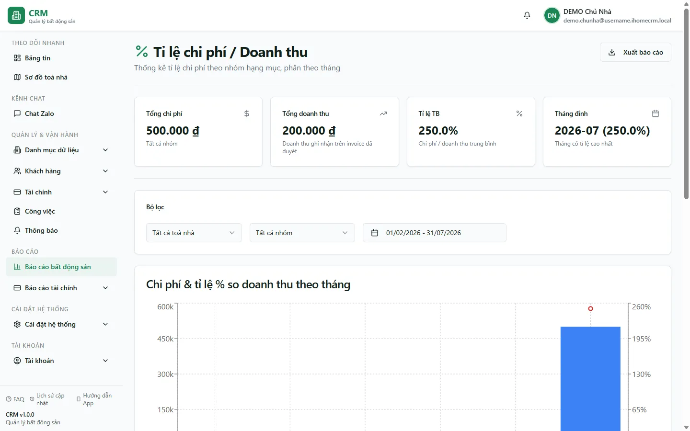

# Báo cáo: Tỷ lệ chi phí

Báo cáo này trả lời một câu hỏi rất thực tế của chủ nhà và kế toán: *"Mỗi tháng tôi tiêu bao nhiêu tiền so với số tôi thu về, và tiền chảy vào những nhóm chi phí nào?"*. Với mỗi tháng, hệ thống lấy **tổng chi** (theo từng **nhóm hạng mục** chi) chia cho **tổng thu** để ra một con số phần trăm — tỷ lệ càng thấp thì toà càng "nhẹ chi phí", càng cao thì càng bào mòn lợi nhuận. Trang chủ yếu để **xem và đối chiếu**: bạn chọn toà, nhóm hạng mục và khoảng thời gian, rồi đọc biểu đồ, bảng chi tiết và bốn thẻ tổng.

Đây là **báo cáo chỉ-xem** — nó không tạo hay sửa phiếu nào. Mọi con số đều được cộng lại từ các **phiếu thu/chi đã duyệt** mà bạn nhập ở màn Thu chi; muốn số đúng thì phiếu phải đủ và đã duyệt. Người đọc thường là chủ nhà, kế toán và quản lý toà cần theo dõi "sức khoẻ chi phí" của từng toà theo thời gian.

::: info Điều kiện tiên quyết
- Tài khoản có **quyền xem báo cáo** thuộc nhóm **Báo cáo Bất động sản** (mục **Tỉ lệ chi phí / Doanh thu**). Nếu hệ thống của bạn vẫn dùng ma trận quyền cũ, quyền **Xem báo cáo** chung là đủ.
- Trong khoảng thời gian bạn xem cần đã có **phiếu thu (INCOME)** và **phiếu chi (EXPENSE)** ở trạng thái **Đã duyệt** — xem [Thu chi](/03-quan-ly-van-hanh/thu-chi/). Phiếu nháp, phiếu đã huỷ hoặc đã xoá **không** được tính.
- Muốn biểu đồ tách chi phí ra thành từng cột đẹp, các **loại chi** cần được gán **Nhóm (category)** — xem [Sổ quỹ & loại thu chi](/01-bat-dau/so-quy-loai-thu-chi/). Loại chi chưa gán nhóm sẽ gộp vào cột **(Chưa phân nhóm)**.
:::

## Cách mở

**Bước 1**: Vào **Báo cáo** => **Báo cáo Bất động sản** => thẻ **Tỉ lệ chi phí / Doanh thu**. Màn báo cáo mở ra với hàng bộ lọc ở trên, bốn thẻ tổng, hai biểu đồ và một bảng chi tiết theo tháng.

## Bộ lọc & cách đọc số

Ba bộ lọc ở đầu trang đều **giữ nguyên khi bạn F5** (lưu theo phiên). Bảng dưới giải thích từng bộ lọc và từng con số bạn nhìn thấy.

| Cột / Chỉ số | Ý nghĩa |
| --- | --- |
| Bộ lọc **Chọn toà nhà** | Lọc theo đúng một toà (lọc thẳng ở máy chủ). Danh sách gồm cả **toà ảo "Chung"** để soi các chi phí không gắn toà cụ thể (ví dụ chi phí chung, chia lợi nhuận). Chọn **Tất cả toà nhà** để cộng gộp mọi toà. |
| Bộ lọc **Chọn nhóm hạng mục** | Chỉ giữ lại một **nhóm chi phí** (category) để soi riêng nhóm đó trên cả biểu đồ lẫn bảng và thẻ **Tổng chi phí**. Để **Tất cả nhóm** thì mọi nhóm cùng hiển thị (mỗi nhóm một màu). |
| Bộ lọc **Khoảng ngày** | Chọn khoảng thời gian; hệ thống tự **kéo tròn về đầu tháng đến cuối tháng**. Mặc định là **6 tháng gần nhất**. Mỗi tháng trong khoảng là một điểm trên biểu đồ và một dòng trong bảng. |
| Thẻ **Tổng chi phí** | Tổng tiền **chi** (đã duyệt) trong toàn khoảng, đã áp bộ lọc toà + nhóm. Dòng mô tả ghi rõ đang xem "Tất cả nhóm" hay một nhóm cụ thể. |
| Thẻ **Tổng doanh thu** | Tổng tiền **thu** (đã duyệt) trong toàn khoảng. *Lưu ý:* dòng mô tả trên thẻ ghi "trên invoice đã duyệt" là **nhãn nhầm** — số thật lấy từ **phiếu thu đã duyệt**, không phải từ hoá đơn (xem mục Nguồn số liệu). |
| Thẻ **Tỉ lệ TB** | Trung bình các tỷ lệ % của những tháng **có doanh thu** (tháng doanh thu bằng 0 bị bỏ khỏi phép trung bình để khỏi méo số). |
| Thẻ **Tháng đỉnh** | Tháng có **tỷ lệ chi phí cao nhất** trong khoảng, kèm luôn con số % của tháng đó — điểm cần soi kỹ đầu tiên. |
| Biểu đồ **Chi phí & tỉ lệ % so doanh thu theo tháng** | Cột chồng = chi phí từng nhóm mỗi tháng (trục trái, tiền); đường **đỏ** = tỷ lệ % (trục phải). Tháng nào **không có doanh thu** thì đường đỏ **đứt quãng** (không nối) vì không tính được tỷ lệ. |
| Biểu đồ **Phân bổ theo loại hạng mục** | Xếp hạng từng **loại chi** (tên hạng mục cụ thể) theo tổng tiền trong khoảng — để biết đích danh khoản nào ngốn nhiều nhất, không chỉ theo nhóm. |
| Cột **Tỉ lệ %** (bảng chi tiết) | Chi ÷ thu của riêng tháng đó. **Xanh** khi dưới 25% (nhẹ), **vàng** từ 25% đến dưới 50% (cần chú ý), **đỏ** từ 50% trở lên (chi phí cao). Dấu **"—"** nghĩa là tháng đó **chưa ghi nhận doanh thu** nên không tính được tỷ lệ. |
| Các cột **nhóm** trong bảng | Mỗi nhóm chi phí một cột; ô trống hiển thị **"—"**. Cột **Tổng chi** là tổng các nhóm trong tháng. |

## Nguồn số liệu

Hiểu đúng nguồn số giúp bạn không hiểu nhầm khi tỷ lệ "trông lạ":

- **Doanh thu (mẫu số)** = tổng **`total_amount` của các phiếu thu (INCOME) đã duyệt**, gom theo **ngày phiếu** (voucher_date) của từng tháng. Đây là **tiền thực thu ghi trên sổ quỹ**, *không* phải hoá đơn đã phát hành. Vì vậy một tháng bạn phát nhiều hoá đơn nhưng khách **chưa trả** sẽ hiện doanh thu thấp và tỷ lệ chi phí bị đẩy cao — đúng bản chất "đã tiêu nhưng chưa thu về". (Thẻ **Tổng doanh thu** ghi mô tả "trên invoice đã duyệt" là mô tả cũ bị nhầm; con số vẫn lấy từ phiếu thu.)
- **Chi phí (tử số)** = tổng tiền của các **hạng mục thuộc phiếu chi (EXPENSE) đã duyệt**, gom theo **Nhóm (category)** của từng loại chi và theo tháng ngày phiếu. Chỉ những hạng mục có **loại là "chi"** mới được cộng; hạng mục chưa gán nhóm rơi vào **(Chưa phân nhóm)**.
- Chỉ phiếu **đã duyệt** và **chưa xoá** mới đi vào báo cáo (giống mọi báo cáo dòng tiền). Phiếu nháp/huỷ không tính.
- Doanh thu ở đây dùng **tổng thực thu** (bao gồm cả các khoản như thu cọc nếu bạn ghi bằng phiếu thu), **khác** với doanh thu ở báo cáo [Phân tích tài chính](/04-bao-cao/phan-tich-tai-chinh/) và trang Chia lợi nhuận vốn đã loại phần cọc khỏi kết quả kinh doanh. Nên nếu cần đối chiếu lãi/lỗ "thuần", hãy đọc thêm hai trang đó — con số doanh thu có thể lệch nhau là điều bình thường.

Chi tiết cách phiếu thu/chi được hạch toán và loại cọc được xử lý ra sao: xem tài liệu hệ thống **Thu chi & Sổ quỹ**.

## Xuất & mẹo

- Nút **Xuất** (góc phải tiêu đề) cho tải bảng chi tiết theo tháng (Tháng, Doanh thu, từng cột nhóm, Tổng chi, Tỉ lệ %), tên tệp gợi ý **`ti-le-chi-phi-doanh-thu`** — tiện dán vào Excel để lập biểu đồ hoặc gửi báo cáo.
- Muốn **so hai toà**, mở hai lần với **Chọn toà nhà** khác nhau (bộ lọc giữ qua F5 nên chuyển tab thoải mái). Chọn **Tất cả toà nhà** để nhìn bức tranh toàn hệ thống.
- Thấy tháng nào tỷ lệ **đỏ**, đọc ngay cột nhóm nào phình to trong tháng đó, rồi mở biểu đồ **Phân bổ theo loại hạng mục** để truy đích danh khoản chi — sau đó quay về [Thu chi](/03-quan-ly-van-hanh/thu-chi/) soi từng phiếu.
- Nếu biểu đồ dồn hết vào cột **(Chưa phân nhóm)**, nghĩa là các loại chi chưa được gán **Nhóm** — vào [Sổ quỹ & loại thu chi](/01-bat-dau/so-quy-loai-thu-chi/) gán nhóm cho gọn rồi mở lại báo cáo.
- Số chỉ đáng tin khi thu/chi của tháng đã đủ và đã duyệt — nên **chốt số vận hành trước** rồi hãy đọc báo cáo, xem [Quy trình chốt tháng](/01-bat-dau/quy-trinh-chot-thang/).

## Thử trực tiếp trên sandbox

<SandboxTry account="demo.chunha" app-path="/reports/real-estate/expense-ratio" app-label="Mở báo cáo Tỉ lệ chi phí" view-only>

1. Để bộ lọc **Chọn toà nhà** ở **Tất cả toà nhà** và **Khoảng ngày** ở mặc định (6 tháng gần nhất). Đọc bốn thẻ tổng: **Tổng chi phí**, **Tổng doanh thu**, **Tỉ lệ TB**, **Tháng đỉnh**.
2. Nhìn biểu đồ trên cùng: các **cột màu** là chi phí từng nhóm theo tháng, đường **đỏ** là tỷ lệ %. Tìm tháng đường đỏ nhô cao nhất — so với **Tháng đỉnh** trên thẻ.
3. Chuyển **Chọn toà nhà** sang **Tòa DEMO A**, rồi sang **Tòa DEMO B**: thấy biểu đồ và bảng đổi số theo từng toà.
4. Kéo xuống bảng **Chi tiết theo tháng**: đọc cột **Tỉ lệ %** đổi màu **xanh / vàng / đỏ**, và để ý dòng nào hiện **"—"** (tháng chưa có doanh thu).

Kết quả mong đợi: bạn nhìn thấy tỷ lệ chi phí trên doanh thu của **Tòa DEMO A** và **Tòa DEMO B** theo từng tháng, hiểu được đường đỏ (tỷ lệ %) so với các cột chi phí, và biết tháng nào chi phí cao nhất để soi tiếp.

</SandboxTry>

## Quy trình liên quan

- [Hub Báo cáo Bất động sản](/04-bao-cao/hub-bds/) — nơi mở báo cáo này cùng 7 báo cáo vận hành BĐS khác.
- [Thu chi](/03-quan-ly-van-hanh/thu-chi/) — nguồn của mọi con số: phiếu thu (doanh thu) và phiếu chi (chi phí) đã duyệt.
- [Sổ quỹ & loại thu chi](/01-bat-dau/so-quy-loai-thu-chi/) — gán **Nhóm (category)** cho loại chi để báo cáo tách cột đúng.
- [Báo cáo: Phân tích tài chính](/04-bao-cao/phan-tich-tai-chinh/) — lãi/lỗ "thuần" đã loại cọc; đối chiếu khi doanh thu ở đây trông khác.
- [Báo cáo: Dòng tiền](/04-bao-cao/dong-tien/) — nhìn tiền vào/ra theo tháng và quý, bổ trợ cho tỷ lệ chi phí.
- [Quy trình chốt tháng](/01-bat-dau/quy-trinh-chot-thang/) — chốt số vận hành cho đủ trước khi đọc báo cáo.
