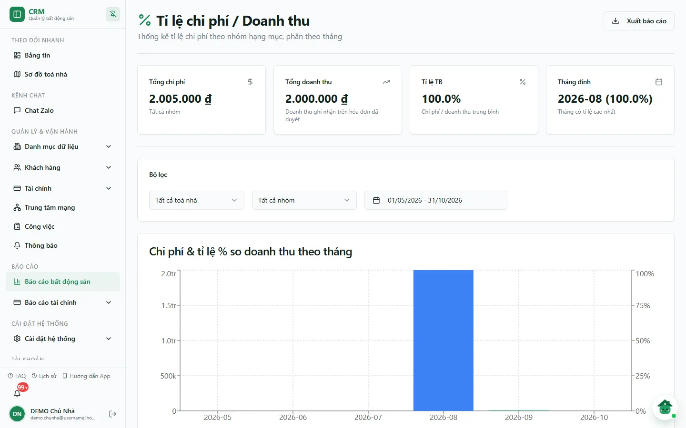
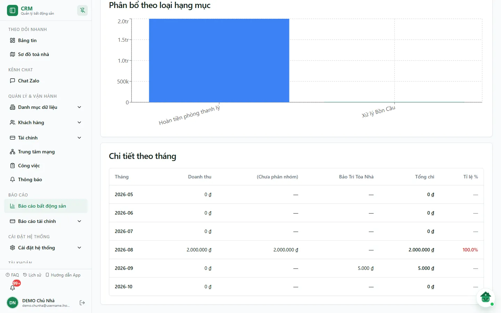

# Báo cáo: Tỷ lệ chi phí

Màn **Tỉ lệ chi phí / Doanh thu** so chi phí theo nhóm hạng mục với tổng thu, theo từng tháng. Cả tử số lẫn mẫu số đều lấy từ phiếu thu chi **đã duyệt** (`approval_status = APPROVED`); báo cáo **không** xét phiếu đã ghi sổ quỹ hay chưa. Vì vậy đây là tỷ lệ *chi đã duyệt / thu đã duyệt*, không phải tỷ lệ tiền **Đã Chi / Đã Thu** thật và không phải biên lợi nhuận.

::: info Điều kiện tiên quyết
- Quyền **Báo cáo Tỉ lệ chi phí** (`reports_real_estate.expense_ratio`).
:::

## Hướng dẫn từng bước

**Bước 1**: Tại menu bên trái, ấn **Báo cáo bất động sản** => thẻ **Tỉ lệ chi phí / Doanh thu** => **Xem báo cáo →**. Mặc định báo cáo xem **6 tháng** (từ đầu tháng cách đây 5 tháng đến cuối tháng hiện tại).

**Bước 2**: Dùng khung **Bộ lọc**: chọn toà ở **Tất cả toà nhà** (có cả toà ảo gom thu chi chung), nhóm hạng mục chi ở **Tất cả nhóm**, và khoảng ngày. Dù chọn ngày giữa tháng, báo cáo luôn kéo về trọn tháng (đầu tháng đến cuối tháng).

**Bước 3**: Kéo xuống để xem biểu đồ **Phân bổ theo loại hạng mục** và bảng **Chi tiết theo tháng**.

**Bước 4**: Ấn **Xuất báo cáo** để lấy file `ti-le-chi-phi-doanh-thu` (Excel/CSV): mỗi tháng một dòng với doanh thu, tổng chi, tỉ lệ % và từng nhóm hạng mục.

Snapshot DEMO ngày 07/10/2026 (05/2026–10/2026, tất cả toà, tất cả nhóm): **Tổng chi phí** 2.005.000 đ, **Tổng doanh thu** 2.000.000 đ, **Tỉ lệ TB** 100,0%, **Tháng đỉnh** 2026-08 (100,0%). Tháng 08 có 2.000.000 đ phiếu thu đã duyệt và 2.000.000 đ chi hạng mục “Hoàn tiền phòng thanh lý” (nhóm **(Chưa phân nhóm)**); tháng 09 có 5.000 đ chi nhóm **Bảo Trì Tòa Nhà** nhưng không có thu nên tỉ lệ hiện “—”.

## Mẫu số: “Doanh thu” = tổng phiếu thu đã duyệt

Báo cáo tải đầy đủ (có phân trang) các phiếu:

- Loại **thu** (`INCOME`), **đã duyệt** (`APPROVED`), chưa xoá.
- **Ngày phiếu** trong khoảng; đúng toà nếu đã chọn toà.

Mỗi tháng cộng **tổng tiền phiếu**. Đây là tổng phiếu thu đã duyệt theo ngày phiếu: không đọc hoá đơn, không cần phiếu đã ghi sổ quỹ (POSTED), và có thể gồm cả tiền cọc hoặc khoản thu không phải doanh thu kinh doanh.

::: warning Mô tả trên thẻ “Tổng doanh thu” chưa đúng
Thẻ **Tổng doanh thu** ghi “Doanh thu ghi nhận trên hóa đơn đã duyệt”, nhưng số thực tế là tổng **phiếu thu đã duyệt**, không lấy từ hoá đơn. Phiếu đã duyệt mà chưa ghi sổ quỹ vẫn được cộng, nên con số này chưa phải tiền **Đã Thu**.
:::

## Tử số: chi theo hạng mục của phiếu chi đã duyệt

Báo cáo tải đầy đủ phiếu loại **chi** (`EXPENSE`), **đã duyệt**, chưa xoá, trong khoảng ngày/toà, rồi duyệt từng dòng hạng mục:

- Chỉ dòng có loại thu chi kiểu **chi**; số tiền lấy từ **từng dòng hạng mục**, không lấy tổng phiếu.
- Nhóm = nhóm (category) của loại thu chi; loại không có nhóm vào **(Chưa phân nhóm)**.
- Mọi loại chi đều được tính, kể cả khoản hoàn tiền cho khách (như ví dụ DEMO tháng 08).
- Chọn một nhóm hạng mục chỉ lọc phần chi; mẫu số tổng thu giữ nguyên.

::: danger Đã duyệt chưa phải Đã Chi
Báo cáo không xét trạng thái ghi sổ. Phiếu chi **đã duyệt** nhưng chưa **Đã Chi** (posting_status = POSTED, tiền thật ra khỏi sổ quỹ) vẫn nằm trong tử số. Khi cần số tiền thật đã ra/vào sổ quỹ, dùng [Dòng tiền](/04-bao-cao/dong-tien/) hoặc [Sổ quỹ ngày](/04-bao-cao/so-quy-ngay/).
:::

## Cách tính và hiển thị

| Thành phần | Ý nghĩa |
|---|---|
| **Tổng chi phí** | Tổng chi của khoảng ngày (dòng phụ ghi nhóm đang lọc hoặc “Tất cả nhóm”). |
| **Tổng doanh thu** | Tổng phiếu thu đã duyệt của khoảng ngày. |
| **Tỉ lệ TB** | Trung bình cộng tỉ lệ của các tháng có thu > 0 — không phải tổng chi / tổng thu cả kỳ. |
| **Tháng đỉnh** | Tháng có tỉ lệ cao nhất, kèm %. |
| Biểu đồ **Chi phí & tỉ lệ % so doanh thu theo tháng** | Cột chồng chi theo nhóm (trục trái) + đường **Tỉ lệ %** (trục phải); tháng thu = 0 không nối đường. |
| Biểu đồ **Phân bổ theo loại hạng mục** | Tổng chi theo từng loại hạng mục trong cả khoảng. |
| Bảng **Chi tiết theo tháng** | **Tháng**, **Doanh thu**, từng nhóm hạng mục, **Tổng chi**, **Tỉ lệ %**. |

Tỉ lệ tháng = tổng chi tháng / tổng thu tháng × 100; tháng không có thu hiện “—”. Màu cột **Tỉ lệ %**: dưới 25% xanh, 25% đến dưới 50% vàng, từ 50% đỏ — chỉ là ngưỡng hiển thị.

## Tình huống & lỗi thường gặp

| Tình huống | Nguyên nhân & cách xử lý |
|---|---|
| Số khác [Dòng tiền](/04-bao-cao/dong-tien/) | Dòng tiền tính theo tiền đã ghi sổ; báo cáo này tính theo phiếu đã duyệt. |
| Số khác [Phân tích tài chính](/04-bao-cao/phan-tich-tai-chinh/) | Phiếu thu có cọc làm mẫu số tăng, trong khi báo cáo lợi nhuận loại cọc; hoàn tiền khách được tính là chi ở đây. |
| Phiếu vừa lập không vào báo cáo | Phiếu còn chờ duyệt; chỉ phiếu **đã duyệt** được tính. |
| Tỉ lệ hiện “—” | Tháng đó không có phiếu thu đã duyệt. |

## Quy trình liên quan

- [Thu chi](/03-quan-ly-van-hanh/thu-chi/)
- [Sổ quỹ & loại thu chi](/01-bat-dau/so-quy-loai-thu-chi/)
- [Dòng tiền](/04-bao-cao/dong-tien/)
- [Phân tích tài chính](/04-bao-cao/phan-tich-tai-chinh/)
