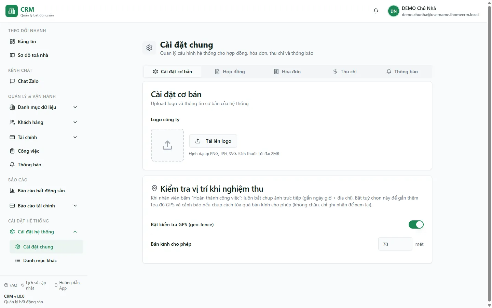

# Cài đặt chung

Trang **Cài đặt chung** là bảng điều khiển hành vi mặc định của toàn hệ thống: thông tin cơ bản của đơn vị (logo), quy tắc cho hợp đồng, cách tính và duyệt hoá đơn, cách duyệt phiếu thu chi, ngưỡng tự duyệt phiếu chi và các thông báo tự động. Bạn gom mọi tuỳ chọn này vào **5 thẻ (tab)** trên cùng một màn hình; thay đổi công tắc được ghi ngay, còn ngưỡng phiếu chi có nút lưu riêng.

Điểm cần nắm trước tiên: đây là cấu hình **theo tổ chức**. Chủ sở hữu đặt một lần, hệ thống dùng ở các luồng thuộc tổ chức. Quy tắc `force_approval` và ngưỡng phiếu chi của tổ chức có thể yêu cầu duyệt dù công tắc tự động duyệt đang bật.

::: info Điều kiện tiên quyết
- Quyền **Cấu hình hệ thống** (`settings.view`) — thường là **chủ nhà**, hoặc quản lý toà được cấp quyền cài đặt.
- Đã đăng nhập vào phần mềm. Trang nằm ở nhóm **Cài đặt hệ thống** trên thanh menu bên trái.
- Nếu định dùng **Kiểm tra vị trí khi nghiệm thu** (geo-fence), toà nhà cần đã khai **toạ độ (kinh độ/vĩ độ)** thì cảnh báo khoảng cách mới có ý nghĩa.
:::

## Hướng dẫn từng bước

**Bước 1**: Vào **Cài đặt hệ thống** => **Cài đặt chung** (địa chỉ `/settings/general`). Màn hình hiện tiêu đề **Cài đặt chung** cùng 5 thẻ: **Cài đặt cơ bản**, **Hợp đồng**, **Hóa đơn**, **Thu chi**, **Thông báo**. Mỗi dòng cấu hình có một công tắc (Switch), ô chọn (Select) hoặc ô nhập số, kèm biểu tượng **(i)** — rê chuột vào để đọc mô tả chi tiết. Mọi thay đổi được **lưu ngay lập tức** khi bạn gạt/chọn/nhập, kèm thông báo *"Dữ liệu đã được CẬP NHẬT thành công"*; không cần bấm Lưu.

**Bước 2**: Mở thẻ **Cài đặt cơ bản**. Thẻ này gồm hai thẻ con:
- **Logo công ty**: bấm **Tải lên logo** để chọn ảnh (PNG, JPG, SVG, tối đa 2MB). Ảnh hiển thị trong ô xem trước bên cạnh.
- **Kiểm tra vị trí khi nghiệm thu**: gạt **Bật kiểm tra GPS (geo-fence)** và đặt **Bán kính cho phép** (mặc định **70 mét**, khoảng cho phép 10–2000 mét). Khi bật, lúc nhân viên bấm *Hoàn thành công việc* hệ thống gắn thêm toạ độ GPS của ảnh chụp và cảnh báo nếu chụp cách toà quá bán kính này. Đây là kiểm tra **chỉ để ghi nhận, KHÔNG chặn** việc hoàn thành — mốc so sánh là toạ độ khai trong hồ sơ toà nhà (ví dụ **Toà DEMO A** / **Toà DEMO B**).

::: warning Logo hiện mới chỉ là ảnh xem trước — chưa lưu lên máy chủ
Tính năng tải logo hiện tạo bản xem trước tạm thời trong phiên làm việc. Sau khi bạn tải lại trang hoặc mở trên máy khác, ảnh có thể mất dù trước đó đã báo "cập nhật thành công". Đừng phụ thuộc vào logo này cho việc in ấn quan trọng cho tới khi tính năng lưu ảnh thật hoàn thiện.
:::

**Bước 3**: Mở thẻ **Hợp đồng** (tiêu đề *Cấu hình hợp đồng*) để bật/tắt các quy tắc cho hợp đồng thuê:
- **Tự cài số người dùng DV** — tự điền số người dùng dịch vụ khi tạo hợp đồng mới.
- **Kiểm kê tài sản khi ký/thanh lý** — yêu cầu kiểm kê tài sản lúc ký hoặc thanh lý.
- **Tự động lập HĐ mới khi gia hạn** — tự tạo hợp đồng mới mỗi khi gia hạn.
- **Ký HĐ online** — cho phép gửi link cho khách ký hợp đồng điện tử.
- **Cài đặt ngày thanh toán** — cho phép đặt ngày thanh toán cố định hằng tháng.
- **Hiển thị trạng thái sắp hết hạn** — hiện cảnh báo hợp đồng sắp hết hạn trên danh sách và bảng tin.
- **Nhận thông báo quá hạn HĐ** — nhắc khi hợp đồng quá hạn chưa gia hạn/thanh lý.

**Bước 4**: Mở thẻ **Hóa đơn** (tiêu đề *Cấu hình hóa đơn*). Ngoài các công tắc, thẻ này có hai ô chọn và một ô số:
- Công tắc: **Tự động duyệt chỉ số**, **Tự động duyệt hóa đơn**, **Sử dụng hệ số**, **Tự động tính hệ số theo ngày**, **Tự lập hóa đơn đặt cọc**, **Tự động sinh hóa đơn kỳ tiếp**, **Cho phép cư dân chốt điện nước**.
- **Chu kỳ tính dịch vụ** (ô chọn): *Theo chu kỳ trong tháng* / *Theo ngày bắt đầu tính tiền* / *Theo ngày chốt tiền*.
- **Chia tỷ lệ lẻ ngày** (ô chọn): *Theo số ngày trong tháng* / *Chia cố định 30 ngày*.
- **Hạn thanh toán** (ô nhập số, 1–90 **ngày**): số ngày từ ngày phát hành hoá đơn tới hạn thanh toán.

**Bước 5**: Mở thẻ **Thu chi** (tiêu đề *Cấu hình thu chi*). Thẻ có công tắc **Tự động duyệt thu chi** và thẻ **Ngưỡng tự duyệt phiếu chi**. Phiếu chi thường dưới ngưỡng có thể tự duyệt; phiếu chi từ ngưỡng trở lên và mọi hạng mục đặc biệt (hoàn cọc, thanh lý, lương, lợi nhuận, hoa hồng, thưởng…) phải đi qua hàng chờ. Phiếu thu không áp dụng ngưỡng này.

::: danger Tự động duyệt thu chi ảnh hưởng trực tiếp tới số dư sổ quỹ
Phiếu **đã duyệt** cộng/trừ ngay vào tồn quỹ của sổ. Khi bật **Tự động duyệt thu chi**, mọi phiếu thu/chi vừa lập sẽ lập tức tính vào dòng tiền mà không có bước rà soát. Chỉ bật khi quy trình của bạn thật sự cho phép ghi tiền không cần duyệt lại; nếu muốn kiểm soát từng phiếu, hãy để tắt và duyệt thủ công. Công tắc này quyết định theo tài khoản của **người lập phiếu** — xem lưu ý về phạm vi ở dưới.
:::

**Bước 6**: Mở thẻ **Thông báo** (tiêu đề *Cấu hình thông báo*) để bật/tắt hai nhắc việc tự động: **Nhắc ngày lập hóa đơn** và **Nhắc hạn thanh toán**.

::: info Phạm vi cấu hình & những tuỳ chọn đang triển khai dần
- **Cấu hình theo từng tài khoản**: mỗi công tắc bạn gạt được lưu cho **chính tài khoản đang đăng nhập**. Nhân viên tự gạt công tắc chỉ tạo cấu hình riêng cho họ, không ghi đè lên cài đặt của chủ nhà. **Ngoại lệ**: **Kiểm tra vị trí khi nghiệm thu** (geo-fence) do chủ nhà đặt sẽ có hiệu lực cho toàn đội.
- **Đang hoàn thiện**: một số tuỳ chọn đã có sẵn ô bật/tắt nhưng phần xử lý còn đang được triển khai dần. Hai mục đã có hiệu lực chắc chắn hiện nay là **Bật kiểm tra GPS (geo-fence)** và **Tự động duyệt thu chi**. Bạn vẫn nên đặt trước các tuỳ chọn khác theo ý muốn; hệ thống sẽ áp dụng khi tính năng tương ứng hoàn thiện.
:::

## Các tính năng khác trên màn hình

| Thẻ / Điều khiển | Công dụng |
| --- | --- |
| Thẻ **Cài đặt cơ bản** | Logo đơn vị và bật/tắt kiểm tra vị trí GPS khi nghiệm thu công việc. |
| Thẻ **Hợp đồng** | 7 tuỳ chọn cho quản lý hợp đồng thuê (kiểm kê tài sản, ký online, cảnh báo hết hạn…). |
| Thẻ **Hóa đơn** | Cách tự động duyệt, tính hệ số, chu kỳ dịch vụ, chia lẻ ngày và hạn thanh toán. |
| Thẻ **Thu chi** | Cấu hình mặc định tự duyệt và ngưỡng phiếu chi; hạng mục đặc biệt vẫn phải duyệt. |
| Thẻ **Thông báo** | Nhắc ngày lập hoá đơn và nhắc hạn thanh toán. |
| Công tắc (Switch) | Bật/tắt một tuỳ chọn; lưu ngay khi gạt. |
| Ô chọn (Select) | Chọn một giá trị trong danh sách (chu kỳ dịch vụ, cách chia lẻ ngày). |
| Ô nhập số | Nhập giá trị số có giới hạn (hạn thanh toán 1–90 ngày; bán kính 10–2000 mét). |
| Biểu tượng **(i)** | Rê chuột để xem mô tả chi tiết của từng tuỳ chọn. |
| **Tải lên logo** | Chọn ảnh logo (PNG/JPG/SVG, tối đa 2MB) để xem trước. |

## Tình huống & lỗi thường gặp

| Tình huống | Cách xử lý |
| --- | --- |
| Gạt công tắc nhưng hành vi hệ thống chưa đổi | Một số tuỳ chọn đang được triển khai dần. Hiện chỉ **Bật kiểm tra GPS (geo-fence)** và **Tự động duyệt thu chi** áp dụng chắc chắn; các mục khác cứ đặt trước, hệ thống sẽ dùng khi hoàn thiện. |
| Nhân viên đổi cài đặt nhưng chủ nhà không thấy áp dụng | Cấu hình lưu **theo từng tài khoản**; nhân viên gạt công tắc chỉ tạo cấu hình cho chính họ. Muốn áp cho cả đội, chủ nhà tự đặt (riêng geo-fence do chủ nhà đặt là có hiệu lực toàn đội). |
| Logo biến mất sau khi tải lại trang | Tính năng logo hiện chỉ tạo ảnh xem trước, chưa lưu lên máy chủ — đừng phụ thuộc vào nó cho bản in. |
| Bật geo-fence nhưng không thấy cảnh báo khoảng cách | Cần khai **toạ độ (kinh độ/vĩ độ)** cho toà nhà trước; geo-fence chỉ **ghi nhận**, không chặn việc hoàn thành. |
| Muốn kiểm soát lại từng phiếu sau khi đã bật tự động duyệt | Tắt công tắc hoặc đặt ngưỡng phù hợp; kiểm tra thêm cột **Trạng thái duyệt** và màn [Chờ duyệt](/03-quan-ly-van-hanh/cho-duyet/). Hạng mục đặc biệt không thể bỏ qua hàng chờ bằng công tắc. |
| Trang Cài đặt báo lỗi khi mở bằng tài khoản quản trị nhiều đơn vị | Trường hợp hiếm do trùng khoá cấu hình giữa nhiều tài khoản — liên hệ hỗ trợ kỹ thuật để rà soát. |

## Thử trực tiếp trên sandbox

<SandboxTry account="demo.chunha" app-path="/settings/general" app-label="Mở màn Cài đặt chung" view-only>

1. Ở màn **Cài đặt chung**, mở lần lượt 5 thẻ: **Cài đặt cơ bản**, **Hợp đồng**, **Hóa đơn**, **Thu chi**, **Thông báo** để xem các nhóm cấu hình.
2. Trong thẻ **Cài đặt cơ bản**, quan sát hai thẻ con: **Logo công ty** và **Kiểm tra vị trí khi nghiệm thu** (công tắc **Bật kiểm tra GPS (geo-fence)** + ô **Bán kính cho phép** đang để **70 mét**).
3. Rê chuột vào biểu tượng **(i)** cạnh vài dòng ở thẻ **Hóa đơn** để đọc mô tả từng tuỳ chọn.
4. Để ý thẻ **Thu chi** có công tắc tự duyệt và thẻ ngưỡng phiếu chi; chỉ Chủ sở hữu mới đổi ngưỡng.

Kết quả mong đợi: bạn nắm được **Cài đặt chung** gồm những nhóm nào và mỗi nhóm điều khiển phần việc gì, mà không thay đổi dữ liệu (đây là bài **chỉ xem**).

</SandboxTry>

## Quy trình liên quan

- [Mẫu biểu](/05-cai-dat/mau-bieu/) — quản lý mẫu in hợp đồng, hoá đơn, biên bản mà cấu hình hợp đồng/hoá đơn tham chiếu tới.
- [Danh mục khác](/05-cai-dat/danh-muc-khac/) — cổng vào mọi danh mục con (sổ quỹ, loại thu chi, hotline, tầng…).
- [Nhân viên & đội ngũ](/05-cai-dat/nhan-vien-doi-ngu/) — hiểu vì sao cấu hình theo từng tài khoản và ai chịu ảnh hưởng.
- [Thu chi](/03-quan-ly-van-hanh/thu-chi/) — nơi kiểm tra trạng thái phiếu và xử lý chứng từ.
- [Chờ duyệt](/03-quan-ly-van-hanh/cho-duyet/) — hộp thư quyết định các request được giao.
- [Việc của tôi](/02-theo-doi-nhanh/viec-cua-toi/) — luồng hoàn thành công việc chịu ảnh hưởng của geo-fence nghiệm thu.
