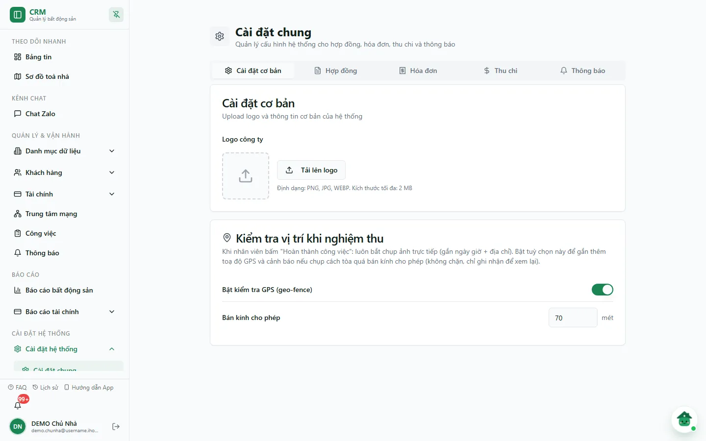
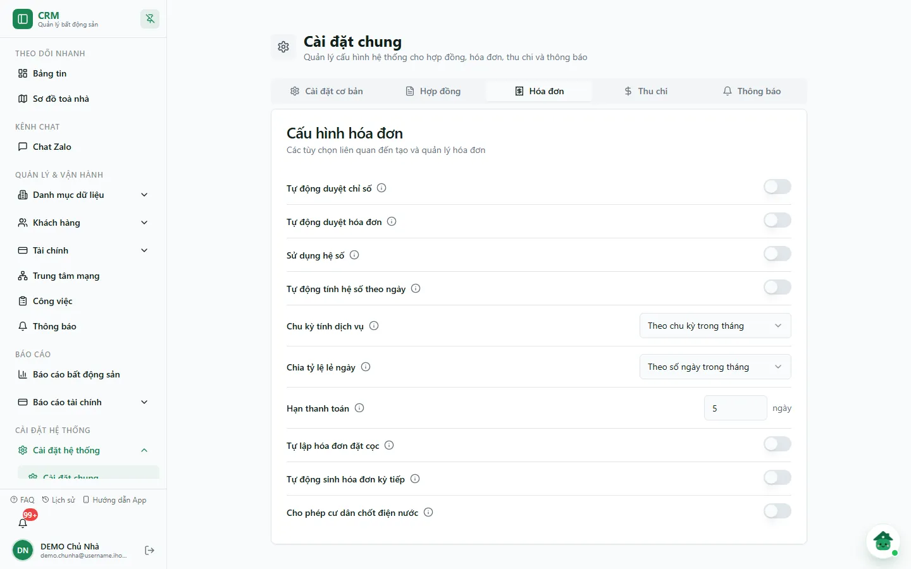
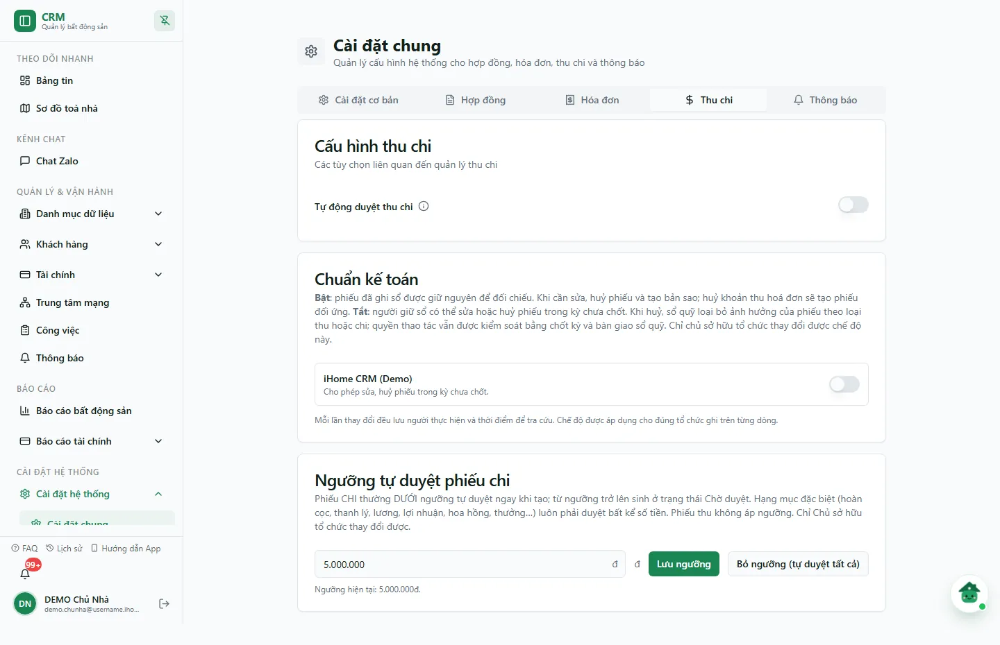
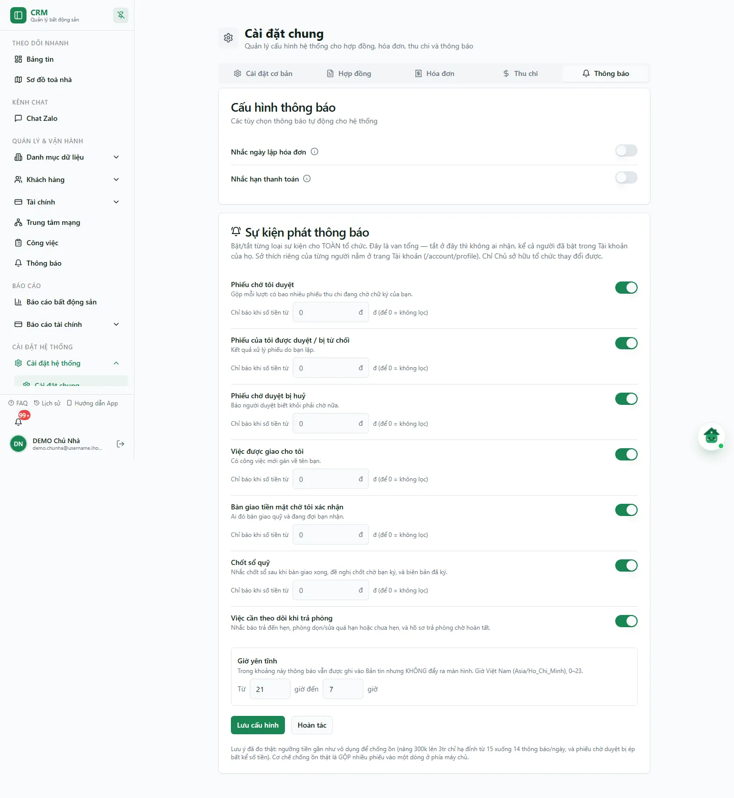

# Cài đặt chung

Trang **Cài đặt chung** gom các cấu hình hành vi của hệ thống vào **5 thẻ**: **Cài đặt cơ bản**, **Hợp đồng**, **Hóa đơn**, **Thu chi**, **Thông báo**. Trên cùng một trang có hai loại cấu hình khác nhau về phạm vi và hiệu lực, nên hãy đọc kỹ mục [Phạm vi và hiệu lực](#pham-vi-va-hieu-luc) trước khi gạt công tắc.

- **Cấu hình của tổ chức** (có hiệu lực thật, chỉ **Chủ sở hữu tổ chức** đổi được): **Chuẩn kế toán**, **Ngưỡng tự duyệt phiếu chi**, **Sự kiện phát thông báo**. Kiểm tra vị trí khi nghiệm thu do chủ đặt cũng áp cho cả đội.
- **Tuỳ chọn theo tài khoản**: các công tắc trong thẻ Hợp đồng, Hóa đơn, công tắc **Tự động duyệt thu chi** và hai công tắc nhắc trong thẻ Thông báo. Chúng được lưu cho **riêng tài khoản đang đăng nhập** và hiện chưa làm thay đổi hành vi hệ thống.

::: info Điều kiện tiên quyết
- Quyền **Cài đặt chung** (module `settings`, hành động `view` để mở trang; `edit` để lưu cấu hình thông báo của tổ chức).
- Muốn đổi **Chuẩn kế toán**, **Ngưỡng tự duyệt phiếu chi** hoặc **Sự kiện phát thông báo**: phải là **Chủ sở hữu tổ chức**. Người khác vẫn xem được nhưng ô bị khoá hoặc lưu bị từ chối.
- Muốn dùng **Kiểm tra vị trí khi nghiệm thu**: toà nhà cần có **toạ độ (kinh độ/vĩ độ)** trong hồ sơ toà thì cảnh báo khoảng cách mới có ý nghĩa.
:::

## Hướng dẫn từng bước

**Bước 1**: Ở thanh bên trái, mở **Cài đặt hệ thống** => **Cài đặt chung** (đường dẫn `/settings/general`). Màn hình hiện tiêu đề **Cài đặt chung** và 5 thẻ. Thẻ đang mở được ghi lên địa chỉ trang (`?tab=basic`, `contract`, `invoice`, `payment`, `notification`), nên bạn có thể gửi link mở thẳng một thẻ.

**Bước 2**: Thẻ **Cài đặt cơ bản** có hai khối:
- **Logo công ty**: bấm **Tải lên logo**, chọn ảnh **PNG, JPG hoặc WEBP, tối đa 2 MB**. Ảnh được tải lên kho lưu trữ và lưu vào thông tin công ty của tài khoản; thành công sẽ báo *"Đã cập nhật logo công ty."* và ảnh hiện trong ô xem trước. Chọn sai định dạng hoặc quá 2 MB sẽ báo *"Chọn ảnh PNG, JPG hoặc WEBP không quá 2 MB."*
- **Kiểm tra vị trí khi nghiệm thu**: công tắc **Bật kiểm tra GPS (geo-fence)** (mặc định bật) và ô **Bán kính cho phép** (mặc định **70** mét, nhập từ 10 đến 2000). Khi nhân viên bấm *Hoàn thành công việc*, hệ thống luôn bắt chụp ảnh trực tiếp; bật tuỳ chọn này để gắn thêm toạ độ GPS và **cảnh báo** nếu chụp cách toà quá bán kính. Đây chỉ là ghi nhận để xem lại, **không chặn** việc hoàn thành.

**Bước 3**: Mở thẻ **Hợp đồng** (khối *Cấu hình hợp đồng*). Có 7 công tắc: **Tự cài số người dùng DV**, **Kiểm kê tài sản khi ký/thanh lý**, **Tự động lập HĐ mới khi gia hạn**, **Ký HĐ online**, **Cài đặt ngày thanh toán**, **Hiển thị trạng thái sắp hết hạn**, **Nhận thông báo quá hạn HĐ**. Rê chuột vào biểu tượng **(i)** để đọc mô tả từng dòng.

**Bước 4**: Mở thẻ **Hóa đơn** (khối *Cấu hình hóa đơn*). Gồm các công tắc **Tự động duyệt chỉ số**, **Tự động duyệt hóa đơn**, **Sử dụng hệ số**, **Tự động tính hệ số theo ngày**, **Tự lập hóa đơn đặt cọc**, **Tự động sinh hóa đơn kỳ tiếp**, **Cho phép cư dân chốt điện nước**; hai ô chọn **Chu kỳ tính dịch vụ** (*Theo chu kỳ trong tháng* / *Theo ngày bắt đầu tính tiền* / *Theo ngày chốt tiền*) và **Chia tỷ lệ lẻ ngày** (*Theo số ngày trong tháng* / *Chia cố định 30 ngày*); ô số **Hạn thanh toán** (1–90 ngày, mặc định 5).

Mỗi lần gạt công tắc, đổi ô chọn hoặc ô số ở thẻ Hợp đồng/Hóa đơn, hệ thống lưu ngay và báo *Đã lưu cài đặt “<tên tuỳ chọn>”.* — không có nút Lưu.

**Bước 5**: Mở thẻ **Thu chi**. Thẻ có ba khối:
- **Cấu hình thu chi**: công tắc **Tự động duyệt thu chi** (tuỳ chọn theo tài khoản, xem lưu ý ở dưới).
- **Chuẩn kế toán**: mỗi tổ chức bạn thuộc về là một dòng có công tắc. **Bật** — phiếu đã ghi sổ được giữ nguyên để đối chiếu; muốn sửa thì huỷ phiếu và tạo bản sao, huỷ khoản thu hoá đơn sẽ tạo phiếu đối ứng. **Tắt** — người giữ sổ có thể sửa hoặc huỷ phiếu trong kỳ chưa chốt. Mỗi lần đổi đều lưu người thực hiện và thời điểm.
- **Ngưỡng tự duyệt phiếu chi**: nhập số tiền rồi bấm **Lưu ngưỡng**, hoặc bấm **Bỏ ngưỡng (tự duyệt tất cả)**. Dòng chữ bên dưới cho biết *Ngưỡng hiện tại: …đ* hoặc *Hiện chưa đặt ngưỡng — mọi phiếu chi thường đang tự duyệt.*

Cách ngưỡng hoạt động: phiếu **chi thường dưới ngưỡng** được tự duyệt ngay khi tạo; phiếu từ ngưỡng trở lên sinh ở trạng thái **Chờ duyệt**. Hạng mục đặc biệt (hoàn cọc, thanh lý, lương, lợi nhuận, hoa hồng, thưởng…) luôn phải duyệt bất kể số tiền. **Phiếu thu không áp ngưỡng.** Hạng mục chi có luật riêng (theo cam kết, theo trần) được xét ở màn [Cam kết chi](/05-cai-dat/cam-ket-chi/).

::: danger Đã duyệt chưa phải là tiền đã ra khỏi quỹ
Tự duyệt chỉ đưa phiếu qua bước **duyệt** (workflow). Tiền chỉ thật sự trừ vào sổ quỹ khi phiếu được ghi sổ (**Đã Chi**, trạng thái ghi sổ `POSTED`). Hạ ngưỡng quá thấp làm hàng chờ duyệt dày lên; nâng ngưỡng quá cao hoặc **Bỏ ngưỡng** thì phần lớn phiếu chi thường sẽ đi thẳng qua bước duyệt mà không ai rà soát. Hãy đặt ngưỡng theo đúng mức bạn chấp nhận cho nhân viên tự chi.
:::

**Bước 6**: Mở thẻ **Thông báo**. Thẻ có hai khối:
- **Cấu hình thông báo**: công tắc **Nhắc ngày lập hóa đơn** và **Nhắc hạn thanh toán** (tuỳ chọn theo tài khoản).
- **Sự kiện phát thông báo**: van tổng cho **toàn tổ chức**. Mỗi sự kiện có công tắc riêng — **Phiếu chờ tôi duyệt**, **Phiếu của tôi được duyệt / bị từ chối**, **Phiếu chờ duyệt bị huỷ**, **Việc được giao cho tôi**, **Bàn giao tiền mặt chờ tôi xác nhận**, **Chốt sổ quỹ**, **Việc cần theo dõi khi trả phòng**. Sự kiện đang bật (trừ "Việc cần theo dõi khi trả phòng") có ô **Chỉ báo khi số tiền từ … đ** (để 0 = không lọc). Khối **Giờ yên tĩnh** đặt khoảng giờ (mặc định 21h–7h, giờ Việt Nam) mà thông báo vẫn ghi vào Bản tin nhưng không đẩy ra màn hình. Khối này **không tự lưu**: chỉnh xong bấm **Lưu cấu hình**, hoặc **Hoàn tác** để quay về trạng thái đã lưu.

::: tip Tắt ở van tổng là không ai nhận
Tắt một sự kiện trong **Sự kiện phát thông báo** thì không ai trong tổ chức nhận thông báo đó, kể cả người đã bật trong trang tài khoản của họ. Sở thích riêng từng người đặt ở [Thông tin cá nhân](/06-tai-khoan/thong-tin-ca-nhan/).
:::

## Phạm vi và hiệu lực

| Khối / tuỳ chọn | Phạm vi | Ai đổi được | Hiệu lực hiện tại |
| --- | --- | --- | --- |
| **Logo công ty** | Thông tin công ty của tài khoản đang đăng nhập | Người có quyền vào trang | Ảnh được lưu và hiện lại khi mở trang; hiện chưa được chèn tự động vào bản in. |
| **Kiểm tra vị trí khi nghiệm thu** | Chủ đặt, nhân viên dùng cấu hình của chủ | Chủ nhà | Có hiệu lực: gắn GPS và cảnh báo khoảng cách khi hoàn thành công việc. |
| Công tắc thẻ **Hợp đồng**, **Hóa đơn**, **Tự động duyệt thu chi**, hai công tắc nhắc ở thẻ **Thông báo** | Riêng tài khoản đang đăng nhập | Từng người tự gạt cho mình | Được lưu nhưng chưa luồng nào đọc tới — gạt công tắc **chưa làm đổi hành vi**. Riêng tự duyệt phiếu chi do **Ngưỡng tự duyệt phiếu chi** quyết định. |
| **Chuẩn kế toán** | Theo từng tổ chức | Chủ sở hữu tổ chức | Có hiệu lực ngay cho tổ chức ghi trên dòng. |
| **Ngưỡng tự duyệt phiếu chi** | Toàn tổ chức | Chủ sở hữu tổ chức | Có hiệu lực cho phiếu chi tạo sau khi lưu. |
| **Sự kiện phát thông báo** | Toàn tổ chức | Chủ sở hữu tổ chức (cần quyền `settings.edit`) | Có hiệu lực sau khi bấm **Lưu cấu hình**. |

## Các tính năng khác trên màn hình

| Thẻ / Điều khiển | Công dụng |
| --- | --- |
| Thẻ **Cài đặt cơ bản** | Logo công ty; bật/tắt kiểm tra GPS và bán kính cho phép khi nghiệm thu. |
| Thẻ **Hợp đồng** | 7 công tắc tuỳ chọn hợp đồng (lưu theo tài khoản). |
| Thẻ **Hóa đơn** | 7 công tắc, 2 ô chọn và ô **Hạn thanh toán** (lưu theo tài khoản). |
| Thẻ **Thu chi** | **Tự động duyệt thu chi**, **Chuẩn kế toán**, **Ngưỡng tự duyệt phiếu chi**. |
| Thẻ **Thông báo** | Hai công tắc nhắc và khối **Sự kiện phát thông báo** + **Giờ yên tĩnh** của tổ chức. |
| Biểu tượng **(i)** | Rê chuột để đọc mô tả từng tuỳ chọn ở các thẻ Hợp đồng, Hóa đơn, Thu chi, Thông báo. |
| **Lưu ngưỡng** / **Bỏ ngưỡng (tự duyệt tất cả)** | Lưu hoặc gỡ ngưỡng tự duyệt phiếu chi. Ô ngưỡng phải lớn hơn 0 mới bấm được Lưu ngưỡng. |
| **Lưu cấu hình** / **Hoàn tác** | Lưu hoặc huỷ chỉnh sửa trong khối Sự kiện phát thông báo. |

## Tình huống & lỗi thường gặp

| Tình huống | Cách xử lý |
| --- | --- |
| Gạt **Tự động duyệt thu chi** nhưng phiếu chi vẫn vào hàng chờ (hoặc vẫn tự duyệt) | Công tắc này hiện không quyết định việc tự duyệt. Hãy xem **Ngưỡng tự duyệt phiếu chi** ở cùng thẻ và luật hạng mục ở [Cam kết chi](/05-cai-dat/cam-ket-chi/). |
| Gạt công tắc ở thẻ Hợp đồng / Hóa đơn nhưng hệ thống không đổi gì | Đúng với bản hiện hành: các công tắc này chỉ lưu tuỳ chọn cho tài khoản của bạn, chưa có luồng nào áp dụng. |
| Nhân viên đổi công tắc nhưng chủ nhà không thấy | Tuỳ chọn ở thẻ Hợp đồng/Hóa đơn/Thông báo (phần công tắc nhắc) lưu theo **từng tài khoản**; mỗi người chỉ thấy lựa chọn của chính mình. |
| Ô ngưỡng, công tắc Chuẩn kế toán hoặc khối Sự kiện phát thông báo bị mờ / báo không đủ quyền | Chỉ **Chủ sở hữu tổ chức** đổi được các cấu hình này. Khối thông báo còn ghi *"Bạn chỉ có quyền xem. Cần quyền "Cài đặt · sửa" để thay đổi."* khi thiếu quyền `settings.edit`. |
| Báo *"Chưa xác nhận được cấu hình thông báo đã lưu…"* | Mạng chập chờn khiến chưa biết đã lưu hay chưa. Bấm **Đọc lại trạng thái** trước khi chỉnh tiếp. |
| Tải logo báo *"Ảnh đã tải lên nhưng chưa xác nhận được đã lưu vào cài đặt công ty…"* | Ảnh đã lên kho nhưng chưa ghi được vào cài đặt. Tải lại trang để kiểm tra trước khi chọn lại ảnh. |
| Bật geo-fence nhưng không thấy cảnh báo khoảng cách | Toà nhà chưa có toạ độ. Bổ sung kinh độ/vĩ độ trong hồ sơ [Toà nhà](/03-quan-ly-van-hanh/toa-nha/). Geo-fence chỉ ghi nhận, không chặn. |

## Thử trực tiếp trên sandbox

<SandboxTry account="demo.chunha" app-path="/settings/general" app-label="Mở màn Cài đặt chung" fixtures="Snapshot 07/10/2026: geo-fence bật, bán kính 70 mét; Chuẩn kế toán của iHome CRM (Demo) đang tắt; ngưỡng tự duyệt phiếu chi 5.000.000đ; 7 sự kiện thông báo đang bật, giờ yên tĩnh 21h–7h" view-only>

**Bài tập chỉ xem**

1. Mở lần lượt 5 thẻ **Cài đặt cơ bản**, **Hợp đồng**, **Hóa đơn**, **Thu chi**, **Thông báo**; để ý địa chỉ trang đổi theo `?tab=…`.
2. Ở thẻ **Thu chi**, đọc **Ngưỡng hiện tại** và trạng thái công tắc **Chuẩn kế toán** của tổ chức DEMO.
3. Ở thẻ **Thông báo**, xem danh sách sự kiện và **Giờ yên tĩnh**. Không bấm **Lưu cấu hình**, **Lưu ngưỡng** hay gạt công tắc.

**Kết quả mong đợi**

- Bạn phân biệt được cấu hình của tổ chức (Chuẩn kế toán, ngưỡng, sự kiện thông báo) với tuỳ chọn theo tài khoản.
- Không có cấu hình DEMO nào bị thay đổi.

</SandboxTry>

## Quy trình liên quan

- [Cam kết chi](/05-cai-dat/cam-ket-chi/) — luật duyệt chi theo hạng mục (theo cam kết, theo trần, từng phiếu).
- [Thu chi](/03-quan-ly-van-hanh/thu-chi/) — nơi lập phiếu và theo dõi trạng thái duyệt, ghi sổ.
- [Chờ duyệt](/03-quan-ly-van-hanh/cho-duyet/) — hàng chờ của phiếu chi từ ngưỡng trở lên.
- [Thông tin cá nhân](/06-tai-khoan/thong-tin-ca-nhan/) — sở thích nhận thông báo của từng người.
- [Mẫu biểu](/05-cai-dat/mau-bieu/) — mẫu in hợp đồng, hoá đơn.
- [Việc của tôi](/02-theo-doi-nhanh/viec-cua-toi/) — luồng hoàn thành công việc chịu ảnh hưởng của geo-fence.
