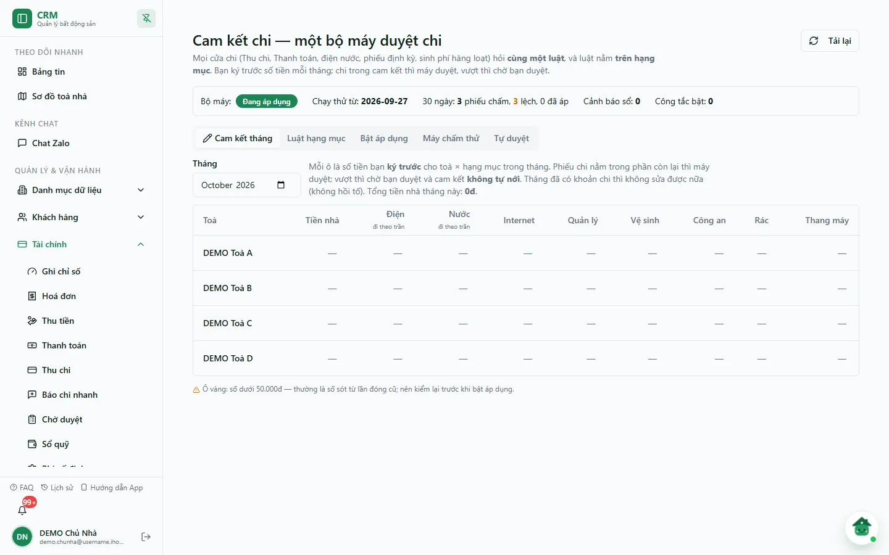
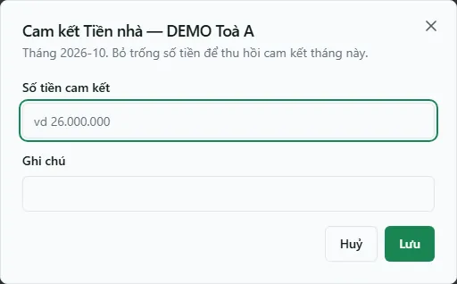
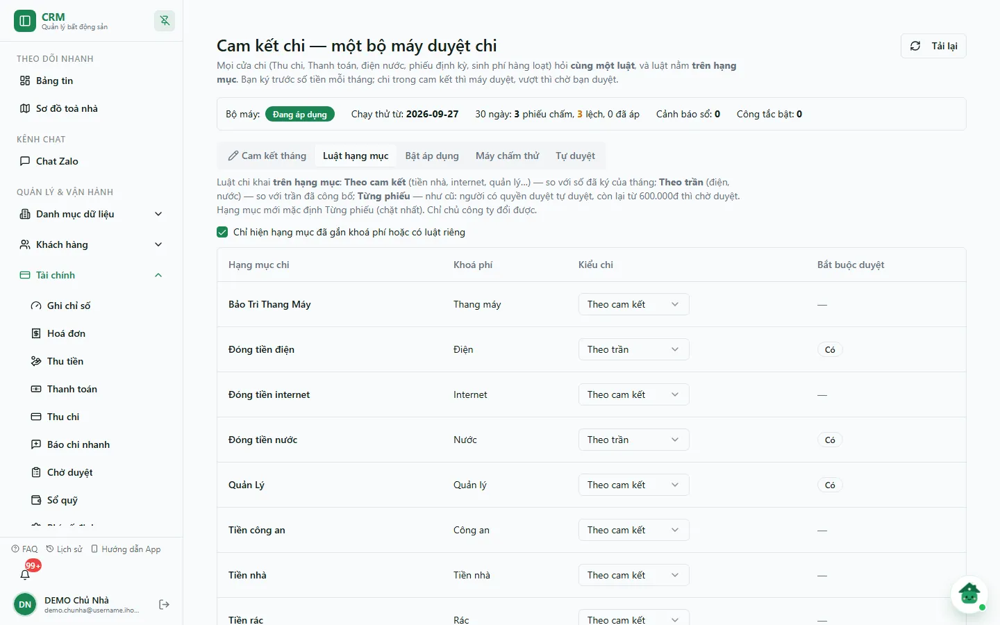
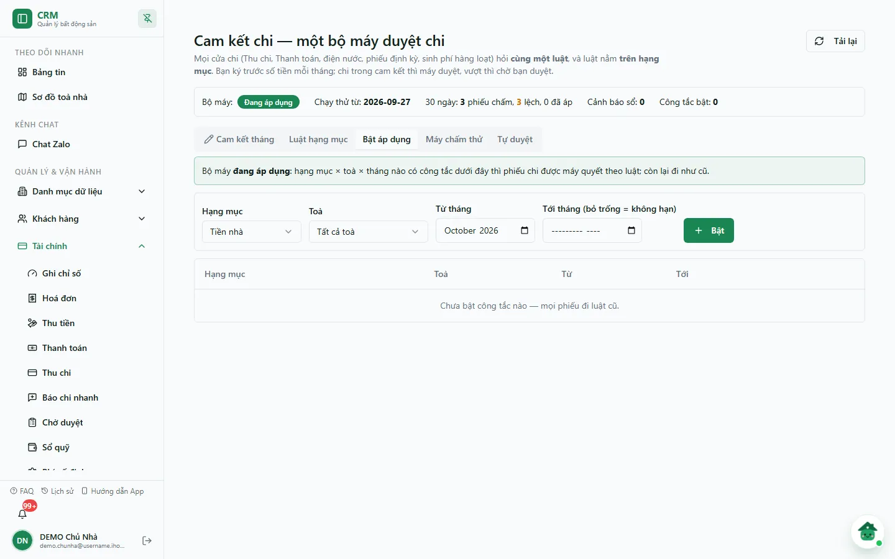
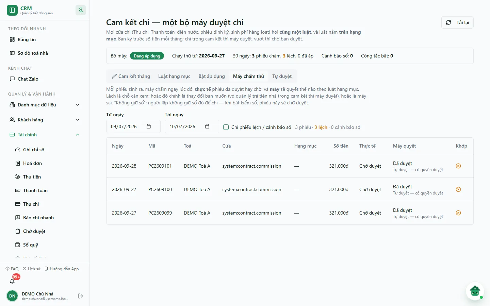
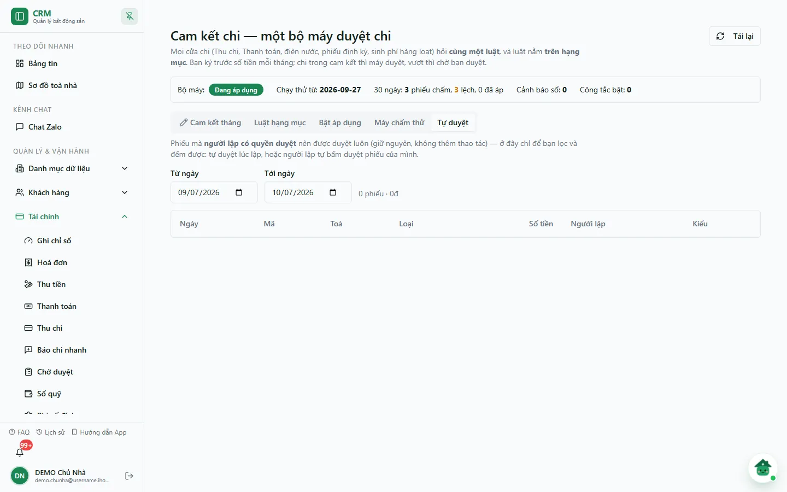

# Cam kết chi

Màn **Cam kết chi** là nơi chủ công ty điều khiển **một bộ máy duyệt chi** dùng chung cho mọi cửa chi: phiếu lập ở **Thu chi**, đóng phí ở **Thanh toán**, điện nước, phiếu định kỳ và sinh phí hàng loạt đều hỏi cùng một luật. Luật nằm **trên hạng mục chi**: bạn ký trước số tiền mỗi tháng cho từng toà × hạng mục; phiếu chi nằm trong phần cam kết còn lại thì máy duyệt, vượt thì phiếu nằm chờ bạn duyệt.

Bộ máy đang ở trạng thái **Đang áp dụng** từ 27/09/2026, nhưng chỉ quyết thay luật cũ ở những phạm vi (hạng mục × toà × tháng) đã được **bật áp dụng**. Phạm vi chưa bật thì phiếu vẫn đi luật cũ (người lập có quyền duyệt thì tự duyệt; hạng mục bắt buộc duyệt hoặc từ ngưỡng tự duyệt thì chờ duyệt).

::: info Điều kiện tiên quyết
- Mục menu **Cam kết chi** hiện với tài khoản có quyền **Thu đủ / thu một phần · vào trang Thanh toán** (`thu_tien.collect`). Tuy vậy chỉ **chủ công ty** (hoặc quản trị hệ thống) mới đọc và sửa được dữ liệu ở màn này; người khác mở vào sẽ bị máy chủ từ chối.
- Khi bộ máy ra đời, cam kết ban đầu (12 tháng từ 10/2026) được khởi tạo theo mức phí cố định đã khai, vì vậy nên rà [Phí cố định](/05-cai-dat/phi-co-dinh/) song song. Điện, nước không ký cam kết mà đi theo **trần chi** điện nước đã cấu hình cho từng toà; màn này không sửa trần.
- Hạng mục chi cần gắn đúng khoá phí (tiền nhà, internet, quản lý…) trong danh mục [Loại thu chi](/01-bat-dau/so-quy-loai-thu-chi/).
:::

::: warning Máy duyệt chưa phải là tiền đã chi
Bộ máy chỉ quyết **trạng thái duyệt** của phiếu (duyệt ngay hay chờ duyệt). Tiền chỉ thật sự ra khỏi sổ quỹ khi phiếu ở trạng thái **Đã Chi** — tức đã ghi sổ (`posting_status = POSTED`). Tuỳ cửa chi, bước ghi sổ có thể chạy ngay sau khi duyệt (vd đóng phí ở **Thanh toán**) hoặc vẫn chờ người giữ sổ bấm chi ở [Thu chi](/03-quan-ly-van-hanh/thu-chi/) / [Chờ duyệt](/03-quan-ly-van-hanh/cho-duyet/).
:::

## Hướng dẫn từng bước

**Bước 1**: Vào **Tài chính** => **Cam kết chi**. Đầu màn có dòng trạng thái bộ máy:

- **Bộ máy**: *Đang áp dụng*, *Đang chạy thử — chưa đổi cách duyệt*, *Tạm đóng băng — đi luật cũ* hoặc *Đang tắt*.
- **Chạy thử từ**: ngày bộ máy bắt đầu chấm phiếu.
- **30 ngày**: số phiếu đã chấm, số phiếu **lệch** (máy quyết khác thực tế) và số phiếu **đã áp** (máy thật sự quyết).
- **Cảnh báo sổ**: số phiếu do người không giữ sổ đó lập.
- **Công tắc bật**: số phạm vi đang bật áp dụng. Nếu máy gặp lỗi trong 7 ngày, dòng **Lỗi máy 7 ngày** hiện màu đỏ.

Bấm **Tải lại** để đọc lại trạng thái. Nếu bạn là chủ của nhiều công ty, ô **Chọn công ty** hiện cạnh nút này.

**Bước 2**: Thẻ **Cam kết tháng**. Chọn **Tháng**, bảng hiện mỗi toà một dòng và 9 cột hạng mục: **Tiền nhà**, **Điện**, **Nước** (hai cột này ghi chú *đi theo trần*), **Internet**, **Quản lý**, **Vệ sinh**, **Công an**, **Rác**, **Thang máy**. Mỗi ô là số đã cam kết kèm dòng **còn …** (số còn lại sau khi trừ phiếu đã duyệt và phiếu đang chờ); số còn lại âm hiện màu đỏ. Ô **vàng** có biểu tượng cảnh báo là cam kết dưới 50.000đ — thường là số sót từ lần đóng cũ, nên kiểm lại trước khi bật áp dụng. Phía trên bảng ghi **Tổng tiền nhà tháng này**.

**Bước 3**: Bấm vào một ô để mở hộp **Cam kết** *tên hạng mục* **—** *tên toà* (vd **Cam kết Tiền nhà — DEMO Toà A**). Nhập **Số tiền cam kết** (vd 26.000.000) và **Ghi chú** nếu cần, rồi **Lưu**. Bỏ trống số tiền rồi Lưu để **thu hồi** cam kết tháng đó.

::: warning Không hồi tố
Tháng đã có khoản chi thì cam kết của tháng đó **không sửa được nữa**. Cam kết cũng **không tự nới**: phiếu vượt phần còn lại luôn phải chờ bạn duyệt, kể cả khi người lập có quyền duyệt.
:::

**Bước 4**: Thẻ **Luật hạng mục** liệt kê hạng mục chi với các cột **Hạng mục chi**, **Khoá phí**, **Kiểu chi**, **Bắt buộc duyệt**. Ô **Kiểu chi** có ba lựa chọn:

- **Theo cam kết** — so với số đã ký của tháng (tiền nhà, internet, quản lý…).
- **Theo trần** — so với trần đã công bố (điện, nước).
- **Từng phiếu** — như cũ: người có quyền duyệt tự duyệt, còn lại từ 600.000đ thì chờ duyệt. Hạng mục mới mặc định là Từng phiếu (chặt nhất).

Đổi lựa chọn trong ô là **lưu ngay**. Mặc định bảng chỉ hiện hạng mục đã gắn khoá phí hoặc có luật riêng; bỏ chọn **Chỉ hiện hạng mục đã gắn khoá phí hoặc có luật riêng** để xem tất cả.

**Bước 5**: Thẻ **Bật áp dụng** quyết phạm vi nào máy được quyết thay luật cũ. Chọn **Hạng mục**, **Toà** (hoặc *Tất cả toà*), **Từ tháng**, **Tới tháng (bỏ trống = không hạn)** rồi bấm **Bật**. Nếu có toà trong phạm vi chưa ký cam kết, hệ thống báo số toà thiếu — phiếu thuộc phạm vi thiếu cam kết sẽ chờ duyệt. Danh sách bên dưới liệt kê các phạm vi đang bật (**Hạng mục**, **Toà**, **Từ**, **Tới**); bấm **Tắt** ở một dòng để trả phạm vi đó về luật cũ.

**Bước 6**: Thẻ **Máy chấm thử** cho xem lại cách máy chấm từng phiếu chi lúc sinh ra. Chọn **Từ ngày** / **Tới ngày** (mặc định 30 ngày gần nhất); dòng tóm tắt ghi số phiếu, số **lệch** và số **cảnh báo sổ**. Các cột: **Ngày**, **Mã**, **Toà**, **Cửa** (nơi sinh phiếu: Thu chi lập tay, Thanh toán — phí cố định, Thanh toán — điện nước, Sinh phí hàng loạt, Phiếu định kỳ…), **Hạng mục**, **Số tiền**, **Thực tế** (Đã duyệt / Chờ duyệt / Đã huỷ), **Máy quyết** (kèm lý do như *Trong cam kết*, *Vượt cam kết*, *Tháng chưa ký cam kết*, *Dưới trần*, *Tự duyệt — có quyền duyệt*…; nhãn **Không giữ sổ** và **Đã áp** nếu có) và **Khớp**. Tích **Chỉ phiếu lệch / cảnh báo sổ** để lọc chỗ cần xem.

**Bước 7**: Thẻ **Tự duyệt** liệt kê phiếu mà **người lập có quyền duyệt** đã được duyệt luôn (tự duyệt lúc lập, hoặc người lập tự bấm duyệt phiếu của mình) — chỉ để bạn lọc và đếm, không thêm thao tác. Chọn khoảng ngày; bảng có **Ngày**, **Mã**, **Toà**, **Loại** (Thu/Chi), **Số tiền**, **Người lập**, **Kiểu**, kèm tổng số phiếu và tổng tiền.

## Thử trực tiếp trên sandbox

<SandboxTry account="demo.chunha" app-path="/settings/finance/cam-ket-chi" app-label="Mở màn Cam kết chi" fixtures="DEMO 07/10/2026: bộ máy Đang áp dụng, 0 công tắc bật, chưa có cam kết tháng 10/2026; Máy chấm thử có 3 phiếu chi hoa hồng DEMO Toà A lệch" view-only>

**Bài tập chỉ xem**

1. Đọc dòng trạng thái bộ máy và đối chiếu số phiếu chấm, lệch, công tắc bật.
2. Mở lần lượt 5 thẻ **Cam kết tháng**, **Luật hạng mục**, **Bật áp dụng**, **Máy chấm thử**, **Tự duyệt**.
3. Có thể bấm một ô ở **Cam kết tháng** để xem hộp sửa rồi bấm **Huỷ**. Không bấm **Lưu**, **Bật**, **Tắt** và không đổi ô **Kiểu chi** (đổi là lưu ngay).

**Kết quả mong đợi**

- Giao diện khớp mô tả; không có cam kết, luật hay công tắc nào của DEMO bị đổi.

</SandboxTry>

## Các tính năng khác trên màn hình

| Nút / Bộ lọc | Công dụng |
|---|---|
| **Tải lại** | Đọc lại trạng thái bộ máy. |
| **Chọn công ty** | Chỉ hiện khi bạn là chủ của nhiều công ty; đổi công ty đang cấu hình. |
| **Tháng** (thẻ Cam kết tháng) | Chọn tháng cần xem/ký cam kết. |
| **Chỉ hiện hạng mục đã gắn khoá phí hoặc có luật riêng** | Thu gọn bảng Luật hạng mục. |
| **Chỉ phiếu lệch / cảnh báo sổ** | Lọc thẻ Máy chấm thử về các phiếu cần xem. |

## Tình huống & lỗi thường gặp

| Tình huống | Nguyên nhân & cách xử lý |
|---|---|
| Thấy mục menu nhưng mở ra báo không có quyền / không có dữ liệu | Menu hiện theo quyền `thu_tien.collect`, còn dữ liệu chỉ mở cho **chủ công ty**. Nhờ chủ công ty thao tác. |
| Không sửa được cam kết của một tháng | Tháng đó đã có khoản chi — cam kết không hồi tố. Điều chỉnh từ tháng sau. |
| Quản lý chi tiền nhà nhưng phiếu vẫn chờ duyệt | Kiểm phạm vi đã **Bật áp dụng** chưa, tháng đã ký cam kết chưa, và số phiếu có vượt phần **còn …** không. Xem lý do ở thẻ **Máy chấm thử**. |
| Bật áp dụng nhưng có cảnh báo "… tòa chưa ký cam kết" | Ký cam kết cho các toà đó ở thẻ **Cam kết tháng**; trước khi ký, phiếu thuộc phạm vi đó sẽ chờ duyệt. |
| Phiếu bị nhãn **Không giữ sổ** | Người lập không được giao giữ sổ quỹ dùng để chi; phiếu này sẽ chờ duyệt. Kiểm phân công sổ quỹ ở [Sổ quỹ](/03-quan-ly-van-hanh/so-quy/). |
| Cột **Cửa** hiện mã kỹ thuật (vd `system:contract.commission`) | Đó là phiếu sinh tự động từ luồng hệ thống chưa có nhãn tiếng Việt (ví dụ hoa hồng hợp đồng); nội dung phiếu vẫn đúng. |

## Quy trình liên quan

- [Phí cố định](/05-cai-dat/phi-co-dinh/) — công bố giá phí cố định theo toà.
- [Thu chi](/03-quan-ly-van-hanh/thu-chi/) — lập và theo dõi phiếu chi.
- [Chờ duyệt](/03-quan-ly-van-hanh/cho-duyet/) — duyệt các phiếu vượt cam kết.
- [Báo chi nhanh](/03-quan-ly-van-hanh/bao-chi-nhanh/) — báo chi theo hạng mục chuẩn.
- [Cài đặt chung](/05-cai-dat/cai-dat-chung/) — ngưỡng tự duyệt phiếu chi theo luật cũ.
