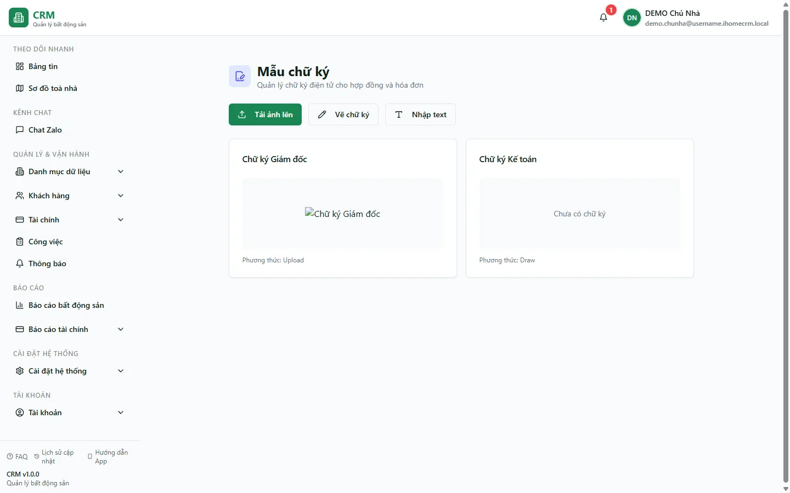

# Chữ ký

Trang `/settings/signatures` hiện hiển thị giao diện mẫu với hai chữ ký minh hoạ và ba nút **Tải ảnh lên**, **Vẽ chữ ký**, **Nhập text**. Các nút chưa nối với form hay mutation lưu dữ liệu, vì vậy đây chưa phải màn CRUD chữ ký hoàn chỉnh.

::: info Điều kiện tiên quyết
Bạn cần quyền **Mẫu biểu** (xem) để mở trang này — cùng nhóm quyền với kho **Mẫu biểu**, vì chữ ký được coi là một loại tài liệu mẫu dùng chung cho cả tổ chức (không phân theo tòa nhà bạn được giao). Trang này **không có sẵn trong menu sidebar** — bạn truy cập bằng đường dẫn trực tiếp `/settings/signatures`. Chữ ký cấu hình xong sẽ được dùng khi in hợp đồng và hóa đơn thông qua mẫu biểu tương ứng.
:::

## Hướng dẫn từng bước

**Bước 1**: Mở trang bằng đường dẫn trực tiếp `/settings/signatures` trên trình duyệt (trang này chưa được gắn link trong menu **Cài đặt**, nên bạn cần gõ hoặc dán đường dẫn để vào).

**Bước 2**: Xem các thẻ minh hoạ hiện có. Dữ liệu đang được khai báo trực tiếp trong giao diện, không phải danh sách chữ ký đã lưu theo tổ chức.

**Bước 3**: Quan sát ba cách dự kiến ở đầu trang:
- **Tải ảnh** — tải lên một tệp ảnh chữ ký hoặc con dấu đã có sẵn (ví dụ ảnh scan chữ ký, con dấu tròn của công ty).
- **Vẽ** — vẽ chữ ký trực tiếp bằng chuột hoặc cảm ứng.
- **Nhập text** — gõ tên và chọn kiểu chữ (font) để tạo chữ ký dạng chữ.

**Bước 4**: Để dùng chữ ký trong chứng từ hiện tại, chèn ảnh/chữ ký trực tiếp vào file `.docx` trước khi tải lên **Mẫu biểu**. Không giả định chữ ký ở trang này tự được chèn vào hợp đồng hoặc hoá đơn.

## Các tính năng khác trên màn hình

| Tính năng | Mô tả |
|-----------|-------|
| **Tải ảnh** | Tạo chữ ký bằng cách tải lên tệp ảnh chữ ký hoặc con dấu có sẵn. |
| **Vẽ** | Tạo chữ ký bằng cách vẽ tay trực tiếp trên màn hình. |
| **Nhập text** | Tạo chữ ký dạng chữ: nhập nội dung và chọn kiểu chữ. |
| Danh sách chữ ký | Liệt kê các mẫu chữ ký đã cấu hình để bạn xem lại và chọn chèn vào mẫu biểu. |

## Tình huống & lỗi thường gặp

| Tình huống | Cách xử lý |
|------------|------------|
| Không thấy trang **Chữ ký** trong menu **Cài đặt** | Trang này chưa được gắn link trong sidebar. Bạn truy cập bằng đường dẫn trực tiếp `/settings/signatures`. |
| Không mở được trang, hiện trống hoặc báo lỗi khi thao tác | Tài khoản của bạn chưa có quyền **Mẫu biểu** (xem). Nhờ chủ nhà cấp quyền trong phần phân quyền nhân viên. |
| Bấm **Tải ảnh** / **Vẽ** / **Nhập text** nhưng chưa lưu được chữ ký mới | Phần lưu chữ ký đang được hoàn thiện. Trong lúc chờ, bạn có thể chèn chữ ký/con dấu trực tiếp vào tệp mẫu `.docx` ở kho **Mẫu biểu** trước khi tải mẫu lên. |
| Chữ ký không xuất hiện trên bản in hợp đồng / hóa đơn | Kiểm tra lại mẫu biểu đang dùng để in ở kho **Mẫu biểu** — chữ ký được chèn qua mẫu biểu, nên mẫu phải có sẵn vị trí dành cho chữ ký. |

## Thử trực tiếp trên sandbox

<SandboxTry account="demo.chunha" app-path="/settings/signatures" view-only>
Mở trang **Chữ ký** và xem các mẫu chữ ký đã cấu hình. Quan sát ba cách tạo chữ ký (**Tải ảnh** / **Vẽ** / **Nhập text**) và hình dung chữ ký này sẽ được chèn vào bản in hợp đồng, hóa đơn thông qua mẫu biểu tương ứng.
</SandboxTry>

## Quy trình liên quan

- [Mẫu biểu](/05-cai-dat/mau-bieu/) — kho mẫu hợp đồng, hóa đơn, biên bản mà chữ ký được chèn vào khi in
- [Cài đặt chung](/05-cai-dat/cai-dat-chung/) — các cấu hình hành vi hệ thống dùng chung
