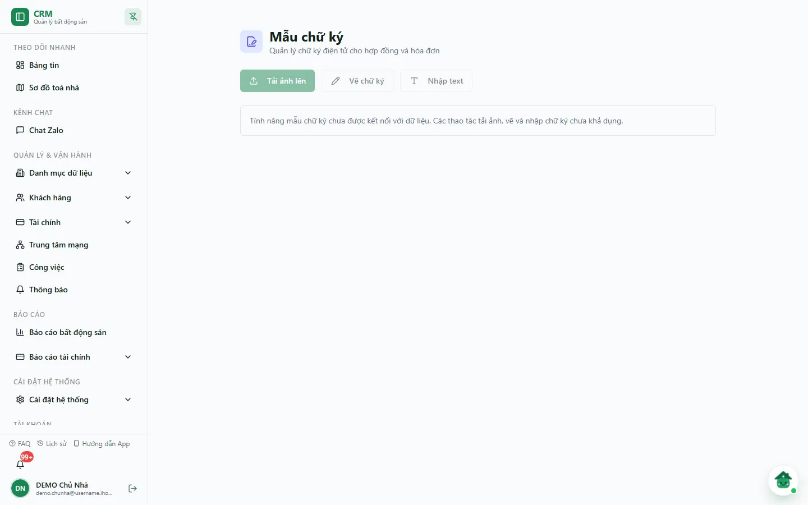

# Chữ ký

Trang **Mẫu chữ ký** (đường dẫn `/settings/signatures`) hiện **chưa dùng được**: ba nút **Tải ảnh lên**, **Vẽ chữ ký**, **Nhập text** đều bị khoá và trang ghi rõ *"Tính năng mẫu chữ ký chưa được kết nối với dữ liệu. Các thao tác tải ảnh, vẽ và nhập chữ ký chưa khả dụng."* Trang không có danh sách chữ ký nào. Muốn chữ ký hoặc con dấu xuất hiện trên chứng từ, hãy chèn thẳng vào file mẫu `.docx` ở [Mẫu biểu](/05-cai-dat/mau-bieu/).

::: info Điều kiện tiên quyết
- Quyền **Biểu mẫu / Chữ ký** (module `templates`, hành động `view`) — cùng quyền với trang [Mẫu biểu](/05-cai-dat/mau-bieu/).
- Trang **không có trong menu** bên trái; chỉ mở được bằng đường dẫn trực tiếp `/settings/signatures`.
:::

## Hướng dẫn từng bước

**Bước 1**: Gõ hoặc dán đường dẫn `/settings/signatures` vào trình duyệt. Màn hình hiện tiêu đề **Mẫu chữ ký**, dòng phụ *"Quản lý chữ ký điện tử cho hợp đồng và hóa đơn"*, ba nút bị mờ và khung thông báo chưa kết nối dữ liệu.

**Bước 2**: Để có chữ ký trên hợp đồng hoặc hoá đơn in ra, mở file Word mẫu của bạn, chèn ảnh chữ ký/con dấu vào đúng vị trí, lưu lại dạng `.docx` rồi tải lên tại [Mẫu biểu](/05-cai-dat/mau-bieu/) (**Thêm mẫu** hoặc **Sửa** mẫu đang dùng).

**Bước 3**: Kiểm tra bằng cách in thử một hợp đồng hoặc hoá đơn với mẫu vừa tải lên.

## Các tính năng khác trên màn hình

| Thành phần | Trạng thái hiện tại |
| --- | --- |
| **Tải ảnh lên** | Bị khoá — chưa tải được ảnh chữ ký. |
| **Vẽ chữ ký** | Bị khoá — chưa có khung vẽ. |
| **Nhập text** | Bị khoá — chưa tạo được chữ ký dạng chữ. |
| Khung thông báo | Cho biết tính năng chưa được kết nối với dữ liệu. |

## Tình huống & lỗi thường gặp

| Tình huống | Cách xử lý |
| --- | --- |
| Không thấy **Chữ ký** trong menu **Cài đặt hệ thống** | Trang không được gắn vào menu. Mở bằng đường dẫn `/settings/signatures`. |
| Bấm các nút nhưng không có gì xảy ra | Ba nút đang khoá vì tính năng chưa kết nối dữ liệu. Chèn chữ ký vào file `.docx` ở [Mẫu biểu](/05-cai-dat/mau-bieu/). |
| Mở đường dẫn nhưng bị đưa về **Bảng tin** | Tài khoản chưa có quyền **Biểu mẫu / Chữ ký** (xem). Nhờ chủ nhà cấp trong [Phân quyền](/05-cai-dat/phan-quyen/). |
| Tab **Mẫu chữ ký** ở trang Mẫu biểu trống | Hộp **Thêm mẫu** không có lựa chọn đưa mẫu vào tab này; xem giải thích ở [Mẫu biểu](/05-cai-dat/mau-bieu/). |

## Thử trực tiếp trên sandbox

<SandboxTry account="demo.chunha" app-path="/settings/signatures" app-label="Mở trang Mẫu chữ ký" fixtures="Snapshot 07/10/2026: ba nút khoá, không có chữ ký nào" view-only>

**Bài tập chỉ xem**

1. Mở trang và xác nhận ba nút **Tải ảnh lên**, **Vẽ chữ ký**, **Nhập text** đang mờ.
2. Đọc khung thông báo chưa kết nối dữ liệu.

**Kết quả mong đợi**

- Bạn biết chữ ký trên chứng từ phải được chèn sẵn trong file mẫu `.docx`.
- Không có dữ liệu DEMO nào thay đổi.

</SandboxTry>

## Quy trình liên quan

- [Mẫu biểu](/05-cai-dat/mau-bieu/) — nơi tải file mẫu `.docx` đã chèn chữ ký/con dấu.
- [Cài đặt chung](/05-cai-dat/cai-dat-chung/) — logo công ty và các cấu hình hệ thống.
