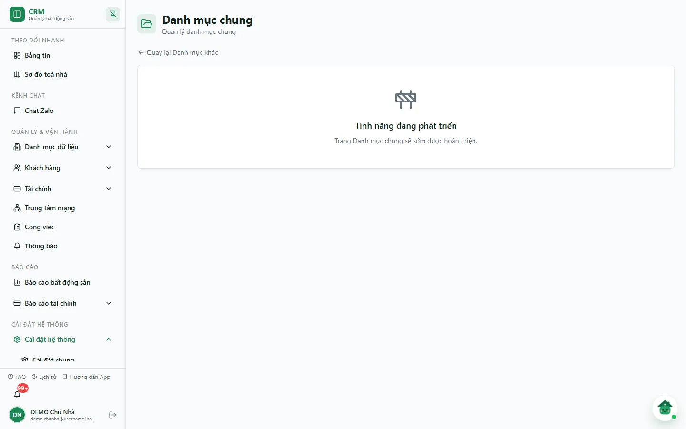

# Danh mục chung

Trang **Danh mục chung** (`/settings/categories/general`) hiện là **trang giữ chỗ**: chỉ có khung *"Tính năng đang phát triển — Trang Danh mục chung sẽ sớm được hoàn thiện."* và liên kết quay lại. Trang chưa có danh sách, chưa có nút **Thêm mới**, chưa sửa hay xoá được gì. Các danh mục dùng chung đang chạy thật nằm ở những thẻ khác của [Danh mục khác](/05-cai-dat/danh-muc-khac/).

::: info Điều kiện tiên quyết
- Quyền **Danh mục khác** (module `categories`, hành động `view`).
- Lối vào: **Cài đặt hệ thống** => **Danh mục khác** => nhóm **Khác** => thẻ **Danh mục chung**.
:::

## Hướng dẫn từng bước

**Bước 1**: Vào **Cài đặt hệ thống** => **Danh mục khác**, ở nhóm **Khác** bấm thẻ **Danh mục chung**. Trang mở ra với tiêu đề **Danh mục chung** và khung *Tính năng đang phát triển*.

**Bước 2**: Bấm **Quay lại Danh mục khác** để chọn đúng danh mục cần làm việc, ví dụ [Quản lý Hotline](/05-cai-dat/hotline/), [Danh sách tầng](/05-cai-dat/danh-sach-tang/) hoặc [Loại công việc](/05-cai-dat/loai-cong-viec/).

## Các tính năng khác trên màn hình

| Thành phần | Công dụng |
| --- | --- |
| **Quay lại Danh mục khác** | Trở về trang tổng hợp danh mục. |
| Khung **Tính năng đang phát triển** | Báo trang chưa có nội dung. |

## Tình huống & lỗi thường gặp

| Tình huống | Cách xử lý |
| --- | --- |
| Trang không có danh sách hay nút thêm | Đúng hiện trạng: đây là trang giữ chỗ. Dùng các danh mục khác trong [Danh mục khác](/05-cai-dat/danh-muc-khac/). |
| Không thấy mục **Danh mục khác** trong menu | Tài khoản chưa có quyền **Danh mục khác** (xem). Nhờ chủ nhà cấp trong [Phân quyền](/05-cai-dat/phan-quyen/). |

## Thử trực tiếp trên sandbox

<SandboxTry account="demo.chunha" app-path="/settings/categories/general" app-label="Mở trang Danh mục chung" fixtures="Snapshot 07/10/2026: trang giữ chỗ, không có dữ liệu" view-only>

**Bài tập chỉ xem**

1. Mở trang và đọc khung **Tính năng đang phát triển**.
2. Bấm **Quay lại Danh mục khác** để về trang tổng hợp.

**Kết quả mong đợi**

- Bạn biết trang này chưa dùng để quản lý danh mục nào.
- Không có dữ liệu DEMO nào thay đổi.

</SandboxTry>

## Quy trình liên quan

- [Danh mục khác](/05-cai-dat/danh-muc-khac/) — trang tổng hợp điều hướng sang mọi danh mục con.
- [Danh sách tầng](/05-cai-dat/danh-sach-tang/)
- [Loại công việc](/05-cai-dat/loai-cong-viec/)
- [Hotline](/05-cai-dat/hotline/)
