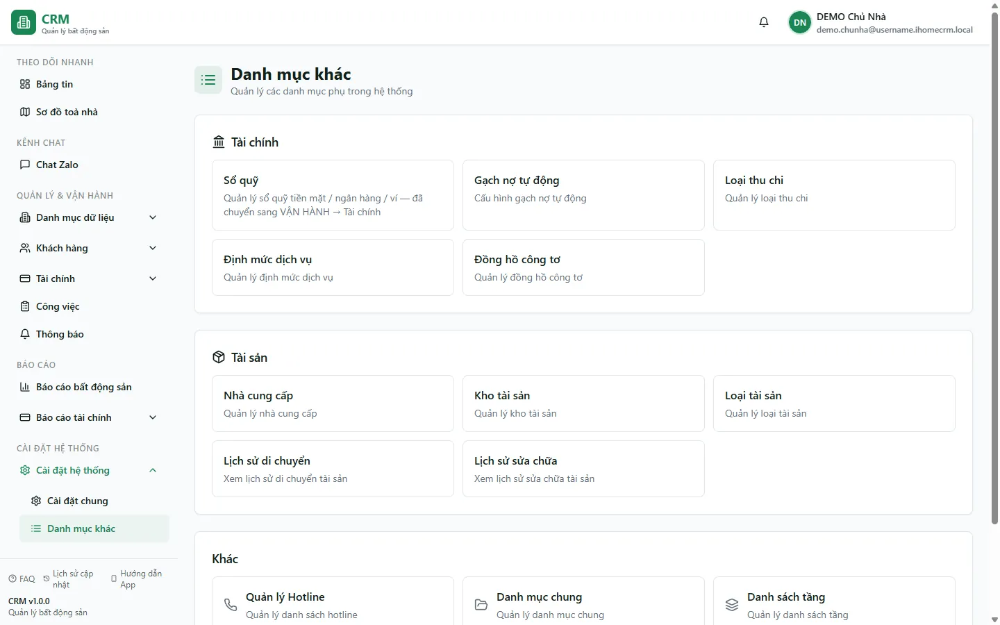

# Danh mục khác (tổng quan)

Trang **Danh mục khác** là "bản đồ" gom các lối vào cấu hình phụ trợ. Bản thân trang không nhập liệu; nó chỉ chia thẻ thành **Tài chính**, **Tài sản** và **Khác**, rồi điều hướng sang route tương ứng. Danh sách hiện hành không có thẻ Tài khoản ngân hàng riêng; quản lý sổ tiền mặt/ngân hàng tại `/finance/cashbooks`.

::: info Điều kiện tiên quyết
- Bạn cần quyền **Danh mục** (module `categories`, hành động `view`) để mở trang tổng hợp này.
- Mỗi thẻ danh mục con dẫn sang một trang riêng; quyền vào trang đích do phân quyền của đúng nghiệp vụ đó quyết định. Nếu bạn bấm vào một danh mục mà thấy danh sách trống hoặc báo lỗi khi thao tác, rất có thể bạn chưa được cấp quyền cho danh mục đó — hãy nhờ chủ nhà mở quyền trong [Phân quyền](/05-cai-dat/phan-quyen/).
:::

## Hướng dẫn từng bước

**Bước 1**: Từ thanh bên trái, mở nhóm **Cài đặt hệ thống** => **Danh mục khác**. (Trong nhóm này còn có **Cài đặt chung**, **Mẫu biểu** và **Nhân viên**.)

**Bước 2**: Màn hình hiện các danh mục được xếp theo ba nhóm: **Tài chính**, **Tài sản** và nhóm **Khác**. Mỗi ô là một thẻ bấm được, kèm mô tả ngắn công dụng.

**Bước 3**: Bấm vào thẻ danh mục bạn muốn chỉnh — ví dụ **Nhà cung cấp** hoặc **Danh sách tầng** — để mở trang quản lý riêng của danh mục đó.

**Bước 4**: Chỉ thao tác thêm/sửa/xoá nếu trang đích thực sự có form và bạn có quyền tương ứng. Phạm vi dữ liệu phụ thuộc RLS và scope của từng module; không mặc định mọi danh mục đều áp dụng cho mọi toà.

## Các tính năng khác trên màn hình

Bảng dưới liệt kê đầy đủ các thẻ danh mục trên trang tổng quan, công dụng và tài liệu chi tiết (nếu đã có).

| Nhóm | Thẻ danh mục | Dùng để làm gì | Xem hướng dẫn |
|------|--------------|----------------|----------------|
| Tài chính | **Sổ quỹ** | Quản lý các sổ quỹ tiền mặt / ngân hàng để ghi nhận tiền vào — ra | [Sổ quỹ](/03-quan-ly-van-hanh/so-quy/) · [Khởi tạo sổ quỹ](/01-bat-dau/so-quy-loai-thu-chi/) |
| Tài chính | **Gạch nợ tự động** | Cấu hình quy tắc tự động khớp tiền chuyển khoản vào công nợ khách | — |
| Tài chính | **Loại thu chi** | Danh mục hạng mục thu / chi dùng khi lập phiếu quỹ | [Sổ quỹ & loại thu chi](/01-bat-dau/so-quy-loai-thu-chi/) |
| Tài chính | **Định mức dịch vụ** | Đơn giá điện, nước và các dịch vụ áp cho hợp đồng | [Dịch vụ & định mức](/01-bat-dau/dich-vu-dinh-muc/) · [Dịch vụ](/03-quan-ly-van-hanh/dich-vu/) |
| Tài chính | **Đồng hồ công tơ** | Khai báo công tơ điện / nước cho từng phòng để ghi chỉ số | [Công tơ](/01-bat-dau/cong-to/) · [Ghi chỉ số](/03-quan-ly-van-hanh/ghi-chi-so/) |
| Tài sản | **Nhà cung cấp** | Danh bạ đối tác cung cấp vật tư / dịch vụ | [Nhà cung cấp](/05-cai-dat/nha-cung-cap/) |
| Tài sản | **Kho tài sản** | Quản lý kho vật tư và tài sản của tòa nhà | — |
| Tài sản | **Loại tài sản** | Phân nhóm tài sản (máy lạnh, tủ lạnh, giường…) | — |
| Tài sản | **Lịch sử di chuyển / sửa chữa** | Theo dõi các lần luân chuyển và sửa chữa tài sản | — |
| Khác | **Quản lý Hotline** | Danh bạ số hotline hiển thị cho khách / cư dân | — |
| Khác | **Danh mục chung** | Khu vực danh mục dùng chung (đang phát triển) | — |
| Khác | **Danh sách tầng** | Khai báo danh sách tầng dùng khi tạo phòng | [Danh sách tầng](/05-cai-dat/danh-sach-tang/) |
| Khác | **Loại công việc** | Phân loại công việc / sự cố cho đội bảo trì | [Loại công việc](/05-cai-dat/loai-cong-viec/) |

::: warning
Một vài trang danh mục con (ví dụ **Quản lý Hotline**, **Danh sách tầng**) **xoá vĩnh viễn** khi bạn bấm xoá — không có thùng rác để khôi phục. Hãy chắc chắn hạng mục không còn được dùng trước khi xoá.
:::

## Tình huống & lỗi thường gặp

| Tình huống | Nguyên nhân | Cách xử lý |
|-----------|-------------|-----------|
| Bấm một thẻ danh mục nhưng danh sách trống hoặc báo lỗi khi lưu | Bạn chưa được cấp quyền cho đúng nghiệp vụ đó | Nhờ chủ nhà mở quyền trong [Phân quyền](/05-cai-dat/phan-quyen/); trang tổng quan không tự chặn nên vẫn mở được, chỉ danh mục con mới hiện đúng theo quyền |
| Là nhân viên chỉ quản vài tòa nhưng vẫn thấy toàn bộ hotline / mẫu biểu | Đây là chủ ý: hotline và mẫu biểu dùng chung cho cả tổ chức, không tách theo tòa | Không cần xử lý — các danh mục này vốn dùng chung |
| Bấm **Danh mục chung** thấy trang trống | Danh mục chung đang trong quá trình phát triển, chưa có nội dung | Bỏ qua, dùng các danh mục con khác |
| Sửa danh mục trên máy này nhưng máy khác chưa thấy đổi | Trang đích đang giữ dữ liệu cũ trong phiên trước | Tải lại (F5) trang danh mục để lấy dữ liệu mới nhất |
| Lỡ tay xoá một hotline / tầng | Các trang này xoá vĩnh viễn, không hoàn tác được | Nhập lại thủ công hạng mục vừa xoá |

## Thử trực tiếp trên sandbox

<SandboxTry account="demo.chunha" app-path="/settings/categories" view-only>
Dạo qua các nhóm danh mục con.

Bạn đang xem trang **Danh mục khác** của tài khoản demo (Tòa **DEMO A** và **DEMO B**). Hãy làm quen với bố cục:

1. Nhìn nhóm **Tài chính**: tìm các thẻ **Sổ quỹ**, **Gạch nợ tự động**, **Loại thu chi**, **Định mức dịch vụ**, **Đồng hồ công tơ**.
2. Nhìn cột **Tài sản**: **Nhà cung cấp**, **Kho tài sản**, **Loại tài sản**, **Lịch sử di chuyển / sửa chữa**. Snapshot hiện tại của Tài sản đang rỗng; **Loại tài sản** và **Nhà cung cấp** đều là bề mặt đang phát triển.
3. Nhìn nhóm **Khác**: **Quản lý Hotline**, **Danh mục chung**, **Danh sách tầng**, **Loại công việc**.
4. Rê chuột qua từng thẻ để đọc mô tả ngắn, hình dung mỗi danh mục dùng cho việc gì trước khi bấm vào chỉnh thật.
</SandboxTry>

## Quy trình liên quan

- [Cài đặt chung](/05-cai-dat/cai-dat-chung/) — bật/tắt hành vi mặc định của hệ thống
- [Mẫu biểu](/05-cai-dat/mau-bieu/) — mẫu in hợp đồng, hoá đơn, biên bản
- [Chữ ký](/05-cai-dat/chu-ky/) — chữ ký điện tử chèn vào tài liệu
- [Tài khoản ngân hàng](/05-cai-dat/tai-khoan-ngan-hang/)
- [Nhà cung cấp](/05-cai-dat/nha-cung-cap/)
- [Danh sách tầng](/05-cai-dat/danh-sach-tang/)
- [Loại công việc](/05-cai-dat/loai-cong-viec/)
- [Thành viên tổ chức](/05-cai-dat/nhan-vien-doi-ngu/)
- [Phân quyền](/05-cai-dat/phan-quyen/)
