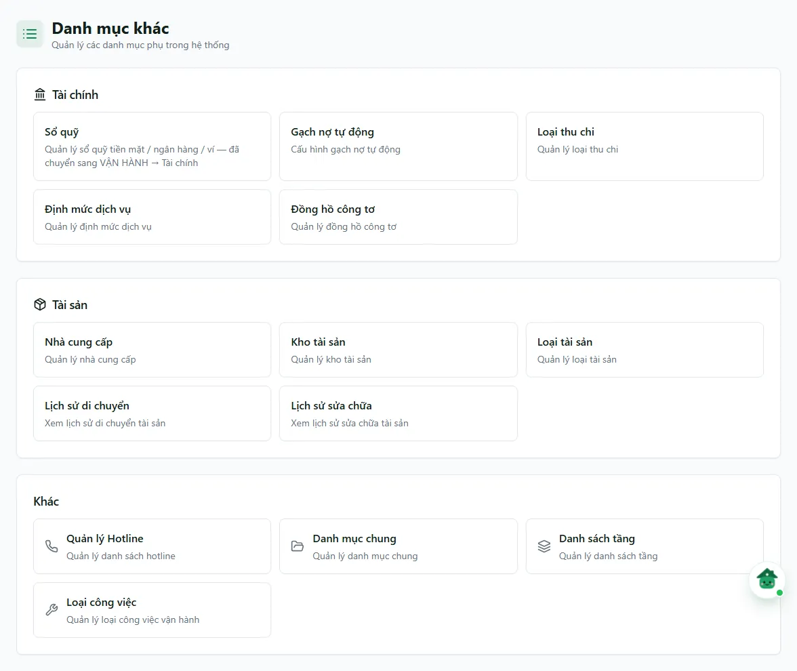

# Danh mục khác (tổng quan)

Trang **Danh mục khác** (`/settings/categories`, dòng phụ *"Quản lý các danh mục phụ trong hệ thống"*) là trang cổng: bản thân nó không nhập liệu, chỉ xếp **14 thẻ** thành ba nhóm **Tài chính**, **Tài sản** và **Khác**. Bấm một thẻ để sang trang quản lý riêng của danh mục đó. Một vài thẻ dẫn sang route nằm ngoài phần Cài đặt (ví dụ **Sổ quỹ** mở `/finance/cashbooks`).

::: info Điều kiện tiên quyết
- Quyền **Danh mục khác** (module `categories`, hành động `view`) để mở trang cổng.
- Mỗi trang đích có quyền riêng (ví dụ `cashbooks`, `auto_debt`, `service_quotas`, `meters`, `suppliers`, `warehouses`, `asset_types`, `assets`, `hotline`, `task_types`). Thiếu quyền trang đích thì bấm thẻ sẽ bị đưa về **Bảng tin**.
:::

## Hướng dẫn từng bước

**Bước 1**: Ở thanh bên trái, mở **Cài đặt hệ thống** => **Danh mục khác**. (Cùng nhóm còn có **Cài đặt chung**, **Mẫu biểu**, **Tổ chức**, **Thành viên**, **Mẫu vai trò**, **Trợ lý AI**, **Quay số may mắn** — tuỳ quyền của bạn.)

**Bước 2**: Màn hình hiện ba khối thẻ. Mỗi thẻ có tên và một dòng mô tả ngắn.

**Bước 3**: Bấm thẻ cần làm việc để sang trang quản lý riêng. Các trang danh mục con đều có liên kết **Quay lại Danh mục khác** ở góc trên trái.

**Bước 4**: Chỉ thêm/sửa/xoá khi trang đích có form và bạn có quyền tương ứng. Ba thẻ **Danh mục chung**, **Lịch sử di chuyển**, **Lịch sử sửa chữa** hiện mới là trang *"Tính năng đang phát triển"*.

## Các tính năng khác trên màn hình

| Nhóm | Thẻ | Mở tới | Xem hướng dẫn |
| --- | --- | --- | --- |
| Tài chính | **Sổ quỹ** | `/finance/cashbooks` (đã chuyển sang **Tài chính** ở nhóm Quản lý & vận hành) | [Sổ quỹ](/03-quan-ly-van-hanh/so-quy/) |
| Tài chính | **Gạch nợ tự động** | `/settings/categories/auto-debt` | [Gạch nợ tự động](/05-cai-dat/gach-no-tu-dong/) |
| Tài chính | **Loại thu chi** | Chuyển hướng sang `/settings/income-expense-types` | [Sổ quỹ & loại thu chi](/01-bat-dau/so-quy-loai-thu-chi/) |
| Tài chính | **Định mức dịch vụ** | `/settings/categories/service-quotas` | [Định mức dịch vụ](/05-cai-dat/dinh-muc-dich-vu/) |
| Tài chính | **Đồng hồ công tơ** | `/settings/meters` | [Công tơ](/01-bat-dau/cong-to/) |
| Tài sản | **Nhà cung cấp** | `/settings/categories/suppliers` | [Nhà cung cấp](/05-cai-dat/nha-cung-cap/) |
| Tài sản | **Kho tài sản** | `/settings/categories/warehouses` | [Kho (địa điểm lưu)](/05-cai-dat/kho-cai-dat/) |
| Tài sản | **Loại tài sản** | `/settings/categories/asset-types` | [Loại tài sản](/05-cai-dat/loai-tai-san/) |
| Tài sản | **Lịch sử di chuyển** | `/settings/categories/asset-movements` — trang giữ chỗ | [Loại tài sản](/05-cai-dat/loai-tai-san/) |
| Tài sản | **Lịch sử sửa chữa** | `/settings/categories/asset-maintenance` — trang giữ chỗ | [Loại tài sản](/05-cai-dat/loai-tai-san/) |
| Khác | **Quản lý Hotline** | `/settings/categories/hotlines` | [Hotline](/05-cai-dat/hotline/) |
| Khác | **Danh mục chung** | `/settings/categories/general` — trang giữ chỗ | [Danh mục chung](/05-cai-dat/danh-muc-chung/) |
| Khác | **Danh sách tầng** | `/settings/categories/floors` | [Danh sách tầng](/05-cai-dat/danh-sach-tang/) |
| Khác | **Loại công việc** | `/settings/categories/task-types` | [Loại công việc](/05-cai-dat/loai-cong-viec/) |

::: warning Xoá ở trang danh mục con là xoá hẳn
Các trang như **Quản lý Hotline** và **Danh sách tầng** hỏi *"Bạn có chắc chắn muốn xóa không? Hành động này không thể hoàn tác."* trước khi xoá; đã xoá thì không có thùng rác để khôi phục.
:::

## Tình huống & lỗi thường gặp

| Tình huống | Nguyên nhân & cách xử lý |
| --- | --- |
| Bấm một thẻ nhưng bị đưa về **Bảng tin** | Bạn có quyền vào trang cổng nhưng chưa có quyền của trang đích. Nhờ chủ nhà mở quyền trong [Phân quyền](/05-cai-dat/phan-quyen/). |
| Bấm **Danh mục chung**, **Lịch sử di chuyển** hoặc **Lịch sử sửa chữa** thấy *Tính năng đang phát triển* | Đúng hiện trạng: ba trang này chưa có nội dung. |
| Không thấy thẻ **Tài khoản ngân hàng** | Trang cổng không còn thẻ này; sổ tiền mặt/ngân hàng/ví quản lý ở **Sổ quỹ** (`/finance/cashbooks`). Xem [Tài khoản ngân hàng](/05-cai-dat/tai-khoan-ngan-hang/). |
| Mở link cũ `/settings/categories/meters` hoặc `/settings/categories/income-expense-types` | Hai đường dẫn cũ tự chuyển sang `/settings/meters` và `/settings/income-expense-types`. |

## Thử trực tiếp trên sandbox

<SandboxTry account="demo.chunha" app-path="/settings/categories" app-label="Mở trang Danh mục khác" fixtures="Snapshot 07/10/2026: 14 thẻ, ba nhóm Tài chính, Tài sản, Khác" view-only>

**Bài tập chỉ xem**

1. Đếm thẻ trong từng nhóm: **Tài chính** (Sổ quỹ, Gạch nợ tự động, Loại thu chi, Định mức dịch vụ, Đồng hồ công tơ), **Tài sản** (Nhà cung cấp, Kho tài sản, Loại tài sản, Lịch sử di chuyển, Lịch sử sửa chữa), **Khác** (Quản lý Hotline, Danh mục chung, Danh sách tầng, Loại công việc).
2. Bấm **Lịch sử sửa chữa** để thấy trang giữ chỗ, rồi bấm **Quay lại Danh mục khác**.

**Kết quả mong đợi**

- Bạn biết mỗi danh mục nằm ở thẻ nào và thẻ nào chưa có nội dung.
- Không có dữ liệu DEMO nào thay đổi.

</SandboxTry>

## Quy trình liên quan

- [Cài đặt chung](/05-cai-dat/cai-dat-chung/) — cấu hình hành vi hệ thống.
- [Mẫu biểu](/05-cai-dat/mau-bieu/) — mẫu in hợp đồng, hoá đơn, biên bản.
- [Chữ ký](/05-cai-dat/chu-ky/) — trang mẫu chữ ký (chưa kết nối dữ liệu).
- [Phân quyền](/05-cai-dat/phan-quyen/) — cấp quyền cho từng trang danh mục.
- [Thành viên tổ chức](/05-cai-dat/nhan-vien-doi-ngu/)
