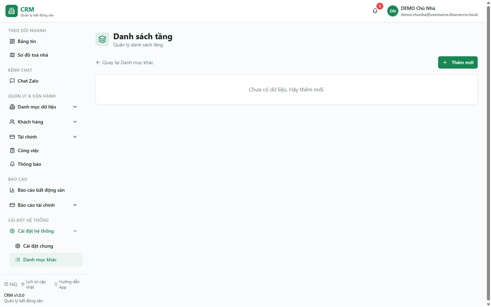

# Danh sách tầng

Trang **Danh sách tầng** là một **danh mục phụ** trong Cài đặt. Nó chỉ dùng để **đặt tên và lọc** tầng khi bạn xem sơ đồ toà nhà hay lọc phòng theo tầng. Đây **không phải** nơi quyết định một phòng nằm ở tầng mấy: số tầng thật của mỗi phòng nằm ngay trong hồ sơ phòng (ô **Tầng** của từng phòng), độc lập với danh mục này. Vì vậy trang này chủ yếu để **xem lại** các tầng đã có; việc tạo tầng nên làm ngay trong form thêm phòng để tầng được gắn đúng toà.

::: info Điều kiện tiên quyết

- Quyền xem mục **Cài đặt => Danh mục khác** (`categories.view`).
- Đã có ít nhất **1 toà nhà** và một vài **phòng** để tầng có ý nghĩa khi lọc/hiển thị.
- Nắm rằng tầng thật của phòng được khai ngay trong hồ sơ phòng, không phải ở trang này (xem [Tạo tầng & phòng](/01-bat-dau/tao-tang-phong/)).

:::

## Hướng dẫn từng bước

**Bước 1**: Ở menu bên trái, vào **Cài đặt** => **Danh mục khác**. Trong nhóm **Khác**, ấn thẻ **Danh sách tầng**.

**Bước 2**: Màn hình hiện bảng danh mục tầng với 4 cột: **Số tầng**, **Tên tầng**, **Mô tả** và **Trạng thái** (nhãn **Hoạt động** / **Ngừng**). Bảng liệt kê tầng của **tất cả các toà** gộp chung, sắp xếp theo số tầng tăng dần.

**Bước 3**: Dùng bảng này để **rà soát**: kiểm tra xem đã có đủ các tầng cần thiết chưa, tên tầng đã dễ đọc chưa (ví dụ **Tầng trệt**, **Lửng**). Vì bảng gộp chung nhiều toà, bạn có thể thấy nhiều dòng cùng **Số tầng** (mỗi toà một dòng) — đây là điều bình thường.

**Bước 4**: Muốn sửa tên/mô tả một tầng, ấn biểu tượng **bút chì** ở cột **Thao tác**, chỉnh **Tên tầng** hoặc **Mô tả** rồi ấn **Cập nhật**.

**Bước 5**: Muốn **thêm một tầng mới**, hãy làm trong **form thêm phòng** (**Căn hộ / Phòng** => **Thêm** => ô **Tầng** => **+ Thêm tầng**) chứ **không** dùng nút **Thêm mới** ở trang này. Lý do: nút **Thêm mới** ở đây không có ô chọn toà nhà nên tầng không gắn được vào toà và hệ thống sẽ báo **"Không thể tạo tầng"** (xem mục Tình huống & lỗi thường gặp).

::: tip Vì sao "Danh sách tầng" không phải nguồn tầng thật
Mỗi phòng đã tự mang **số tầng riêng** trong hồ sơ phòng. Bảng **Danh sách tầng** chỉ là **nhãn đặt tên** giúp sơ đồ toà và bộ lọc hiển thị đẹp hơn. Xoá hay đổi một dòng ở đây **không** làm phòng đổi tầng, cũng không xoá phòng nào.
:::

## Các tính năng khác trên màn hình

| Nút / Thành phần | Công dụng |
| --- | --- |
| Cột **Số tầng** | Số thứ tự tầng (bắt buộc khi tạo). Bảng sắp theo cột này tăng dần. |
| Cột **Tên tầng** | Tên gợi nhớ, ví dụ **Tầng trệt**, **Lửng**, **Sân thượng**. |
| Cột **Mô tả** | Ghi chú tuỳ ý cho tầng. |
| Cột **Trạng thái** | Nhãn **Hoạt động** / **Ngừng** của dòng tầng. |
| Biểu tượng **bút chì** | Mở hộp thoại sửa để chỉnh Tên tầng / Mô tả của một tầng đã có. |
| Biểu tượng **thùng rác** | Xoá vĩnh viễn một dòng tầng khỏi danh mục (xem cảnh báo bên dưới). |
| Nút **Thêm mới** | Có mặt trên trang nhưng **không gắn được toà** — nên tạo tầng qua form thêm phòng. |
| **Quay lại Danh mục khác** | Liên kết trở về trang Danh mục khác. |

::: warning Xoá tầng là vĩnh viễn, không hoàn tác được
Biểu tượng **thùng rác** xoá **cứng** dòng tầng khỏi danh mục (không có thùng rác khôi phục). Việc này chỉ gỡ **nhãn tầng**, **không** ảnh hưởng tới phòng hay số tầng của phòng — nhưng nhãn đã xoá thì phải nhập tay lại nếu cần. Hãy chắc chắn trước khi xoá.
:::

## Tình huống & lỗi thường gặp

| Tình huống | Cách xử lý |
| --- | --- |
| Ấn **Thêm mới** ở trang này rồi lưu thì báo **"Không thể tạo tầng"** | Đúng như thiết kế: form ở đây không có ô chọn toà nên tầng không gắn được vào toà nào. Hãy tạo tầng qua **Căn hộ / Phòng => Thêm => ô Tầng => + Thêm tầng**. |
| Thấy nhiều dòng trùng **Số tầng** | Bảng gộp tầng của **mọi toà**, mỗi toà có thể có cùng số tầng. Đây là hành vi bình thường, không phải lỗi trùng. |
| Sửa tên tầng nhưng phòng vẫn không đổi tầng | Đúng: tầng thật của phòng nằm trong hồ sơ phòng, không lấy từ danh mục này. Muốn đổi tầng của phòng, sửa ngay trong hồ sơ phòng. |
| Trang hiện **"Chưa có dữ liệu. Hãy thêm mới."** | Chưa có tầng nào được tạo (hoặc bạn không có quyền xem). Tạo tầng qua form thêm phòng; nếu vẫn trống, kiểm tra lại quyền **categories.view**. |
| Lỡ xoá nhầm một tầng | Không khôi phục được. Tạo lại tầng qua form thêm phòng (chọn đúng toà, nhập lại số tầng và tên). |

## Thử trực tiếp trên sandbox

<SandboxTry account="demo.quanly" app-path="/settings/categories/floors" app-label="Mở màn Danh sách tầng" view-only>

**Hãy nhìn thấy**

1. Mở màn **Cài đặt => Danh mục khác => Danh sách tầng** của toà demo (**Tòa DEMO A** / **Tòa DEMO B**).
2. Quan sát 4 cột **Số tầng**, **Tên tầng**, **Mô tả**, **Trạng thái**; để ý bảng gộp chung tầng của các toà và sắp theo số tầng tăng dần.
3. Ấn biểu tượng **bút chì** ở một dòng để xem hộp thoại sửa chỉ gồm **Số tầng**, **Tên tầng**, **Mô tả** — không có ô chọn toà nhà.

**Kết quả mong đợi**: bạn hiểu đây là danh mục **chỉ để đặt tên và lọc** tầng, không phải nơi quyết định phòng thuộc tầng nào, và việc thêm tầng nên làm trong form thêm phòng.

</SandboxTry>

## Quy trình liên quan

- [Tạo tầng & phòng](/01-bat-dau/tao-tang-phong/) — cách tạo tầng đúng (qua **+ Thêm tầng** trong form phòng) và khai số tầng thật cho từng phòng.
- [Căn hộ / Phòng](/03-quan-ly-van-hanh/can-ho-phong/) — quản lý phòng và tầng của phòng trong vận hành hằng ngày.
- [Sơ đồ toà nhà](/02-theo-doi-nhanh/so-do-toa-nha/) — nơi nhãn tầng được dùng để nhóm và hiển thị phòng theo tầng.
