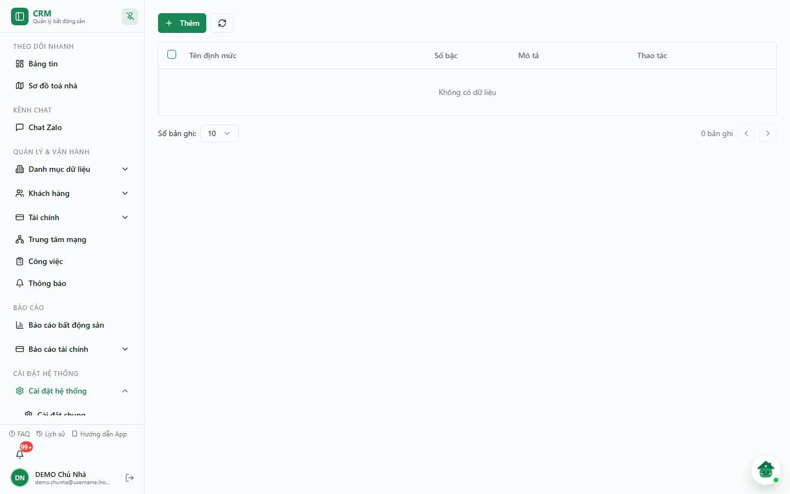
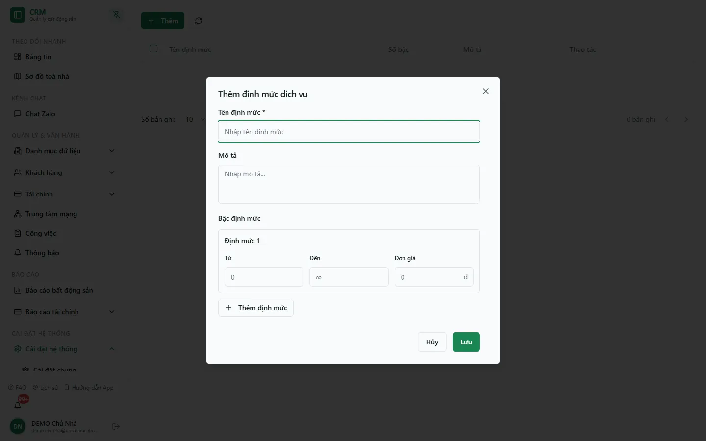

# Định mức dịch vụ

Định mức dịch vụ là **bảng giá bậc thang (luỹ tiến)**: mỗi định mức gồm nhiều **bậc**, mỗi bậc là một khoảng sản lượng **Từ – Đến** kèm **Đơn giá** áp trong khoảng đó — điển hình là điện luỹ tiến (dùng càng nhiều, đơn giá bậc sau càng cao). Bạn khai định mức một lần ở màn này, rồi chọn nó cho một hoặc nhiều dịch vụ ở ô **Chọn định mức** trong form dịch vụ.

::: warning Hoá đơn hiện chưa tự áp bậc thang
Ở phiên bản hiện tại, khi lập hoá đơn, tiền dịch vụ vẫn tính theo **đơn giá của dịch vụ** (hoặc giá riêng của toà nếu có) nhân sản lượng/số lượng — hệ thống **chưa tự chiếu sản lượng vào các bậc** của định mức. Định mức hiện là bảng giá tham chiếu được lưu và gắn với dịch vụ; với điện/nước luỹ tiến, hãy kiểm tra và chỉnh số tiền trên hoá đơn trước khi phát hành.
:::

::: info Điều kiện tiên quyết
- Quyền **Định mức dịch vụ => Xem** (module `service_quotas`, action `view`) để mở màn hình.
- Quyền **Thêm / Sửa / Xoá** định mức (`service_quotas.create` / `edit` / `delete`) để lưu thay đổi. Các nút vẫn hiện với mọi người vào được màn; nếu thiếu quyền, máy chủ từ chối khi lưu và hộp thoại báo lỗi.
:::

## Hướng dẫn từng bước

**Bước 1**: Vào **Cài đặt hệ thống** => **Danh mục khác**, trong nhóm **Tài chính** chọn thẻ **Định mức dịch vụ**. Màn hình mở thẳng vào bảng danh sách (không có dòng tiêu đề riêng) với các cột **Tên định mức**, **Số bậc**, **Mô tả**, **Thao tác**. Snapshot DEMO ngày 07/10/2026 chưa có định mức nào nên bảng hiện **"Không có dữ liệu"**.

**Bước 2**: Ấn nút **Thêm**. Hộp thoại **Thêm định mức dịch vụ** hiện ra với ô **Tên định mức \*** (bắt buộc), ô **Mô tả** và khối **Bậc định mức** có sẵn một bậc **Định mức 1**.

**Bước 3**: Khai các bậc. Mỗi bậc gồm ba ô:

| Ô nhập | Ý nghĩa |
| --- | --- |
| **Từ** | Mốc đầu của khoảng sản lượng. Bậc đầu tiên mặc định là **0**. Bắt buộc. |
| **Đến** | Mốc cuối của khoảng. Để trống (ô hiện **∞**) nghĩa là vô cực — dùng cho **bậc cuối cùng**. |
| **Đơn giá** | Giá cho mỗi đơn vị (kWh, m³…) trong khoảng của bậc. Bắt buộc và phải lớn hơn 0. |

Ấn **Thêm định mức** để thêm bậc mới; ấn dấu **X** ở góc bậc để bỏ bậc đó (chỉ hiện khi có từ hai bậc trở lên). Các khoảng **Từ – Đến** nên nối liền nhau (mốc **Đến** của bậc trước bằng mốc **Từ** của bậc sau). Ví dụ định mức "Điện luỹ tiến":

| Bậc | Từ | Đến | Đơn giá |
| --- | --- | --- | --- |
| 1 | 0 | 50 | 3.000đ / kWh |
| 2 | 50 | 100 | 3.500đ / kWh |
| 3 | 100 | *(để trống)* | 4.000đ / kWh |

**Bước 4**: Ấn **Lưu**. Khi lưu xong, thông báo *"Đã tạo định mức … và các bậc giá."* hiện ra và định mức xuất hiện trong bảng, cột **Số bậc** cho biết đã lưu bao nhiêu bậc.

**Bước 5**: Gắn định mức vào dịch vụ. Sang trang [Dịch vụ](/03-quan-ly-van-hanh/dich-vu/), mở form tạo hoặc sửa dịch vụ, chọn định mức ở ô **Chọn định mức** (chọn **Không chọn** để gỡ), rồi lưu dịch vụ. Một định mức có thể dùng cho nhiều dịch vụ.

**Bước 6**: Muốn chỉnh, ấn biểu tượng **bút chì** (**Cập nhật**) trên dòng định mức để mở hộp thoại **Cập nhật định mức dịch vụ**, sửa tên/mô tả/các bậc rồi ấn **Cập nhật**. Muốn bỏ, ấn biểu tượng **thùng rác** (**Xóa**): hộp thoại **Xác nhận xóa định mức** hiện tên, số bậc, mô tả — ấn **Xóa** để xác nhận hoặc **Hủy**.

::: warning Cập nhật thay toàn bộ các bậc
Khi ấn **Cập nhật**, hệ thống thay **toàn bộ** danh sách bậc cũ bằng các bậc đang có trong hộp thoại. Kiểm tra đủ số bậc, các khoảng nối liền và bậc cuối để trống **Đến** trước khi lưu. Xoá định mức là xoá mềm: định mức biến khỏi danh sách và ô **Chọn định mức**, không đụng tới hoá đơn đã lập.
:::

## Các tính năng khác trên màn hình

| Nút / Thành phần | Công dụng |
| --- | --- |
| Nút **Thêm** | Mở hộp thoại **Thêm định mức dịch vụ**. |
| Nút **làm mới** (mũi tên vòng) | Tải lại danh sách định mức. |
| Ô chọn đầu dòng / đầu bảng | Đánh dấu dòng; hiện chưa có thao tác hàng loạt đi kèm. |
| Biểu tượng **bút chì** (**Cập nhật**) | Mở hộp thoại **Cập nhật định mức dịch vụ**. |
| Biểu tượng **thùng rác** (**Xóa**) | Mở hộp thoại **Xác nhận xóa định mức**. |
| **Số bản ghi** (10 / 25 / 50) và nút trang | Đổi số dòng mỗi trang và chuyển trang; dòng chữ *"x-y trên tổng số n bản ghi"* cho biết vị trí. |

## Tình huống & lỗi thường gặp

| Tình huống | Cách xử lý |
| --- | --- |
| Báo **"Tên định mức là bắt buộc"** hoặc **"Bắt buộc"** dưới ô bậc | Điền tên định mức; mỗi bậc phải có **Từ** và **Đơn giá**. Đơn giá để 0 cũng bị coi là trống. |
| Hộp thoại báo *"Định mức … đã lưu, nhưng các bậc giá chưa hoàn tất…"* | Phần tên đã lưu nhưng các bậc chưa xác nhận xong. **Không tạo lại**: đóng hộp thoại, tải lại danh sách, mở định mức đó bằng **bút chì** để kiểm tra và khai lại bậc. |
| Cột **Số bậc** ít hơn số bậc đã khai | Mở **Cập nhật**, khai lại đủ bậc rồi lưu. |
| Đã gắn định mức nhưng hoá đơn vẫn tính theo một đơn giá | Đúng với phiên bản hiện tại — hoá đơn chưa tự áp bậc thang (xem khung cảnh báo đầu trang). Chỉnh số tiền trên hoá đơn khi cần. |
| Không thấy định mức trong ô **Chọn định mức** của dịch vụ | Định mức đã bị xoá, hoặc danh sách định mức chưa tải được — form dịch vụ báo *"Chưa tải đủ tòa hoặc định mức"*, ấn **Tải lại dữ liệu**. |
| Danh sách trống dù chắc chắn đã tạo | Kiểm tra quyền **Định mức dịch vụ => Xem** và công ty đang chọn. |

## Thử trực tiếp trên sandbox

<SandboxTry account="demo.chunha" app-path="/settings/categories/service-quotas" app-label="Mở màn Định mức dịch vụ" fixtures="Snapshot 07/10/2026: DEMO chưa có định mức nào (bảng hiện Không có dữ liệu)." view-only>

**Bài tập chỉ xem**

1. Mở màn **Định mức dịch vụ**, đối chiếu các cột **Tên định mức**, **Số bậc**, **Mô tả**, **Thao tác**.
2. Ấn **Thêm** để xem hộp thoại **Thêm định mức dịch vụ**: ô **Tên định mức**, **Mô tả**, bậc **Định mức 1** với ba ô **Từ / Đến / Đơn giá**. Có thể ấn **Thêm định mức** để thấy bậc thứ hai, rồi ấn **Hủy** — không bấm **Lưu**.

**Kết quả mong đợi**

- Giao diện khớp hướng dẫn; ô **Đến** để trống hiện **∞**.
- Không có định mức nào bị tạo, sửa hoặc xoá trên DEMO.

</SandboxTry>

## Quy trình liên quan

- [Dịch vụ](/03-quan-ly-van-hanh/dich-vu/) — nơi chọn định mức cho dịch vụ ở ô **Chọn định mức**.
- [Dịch vụ & định mức](/01-bat-dau/dich-vu-dinh-muc/) — khai lần đầu dịch vụ và định mức khi khởi tạo hệ thống.
- [Công tơ điện nước](/01-bat-dau/cong-to/) — tạo công tơ cho phòng.
- [Ghi chỉ số](/03-quan-ly-van-hanh/ghi-chi-so/) — nhập chỉ số công tơ hằng tháng.
