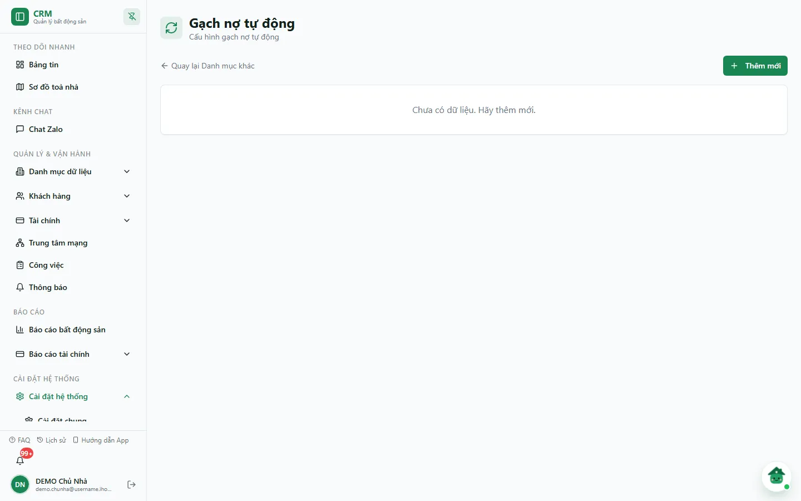
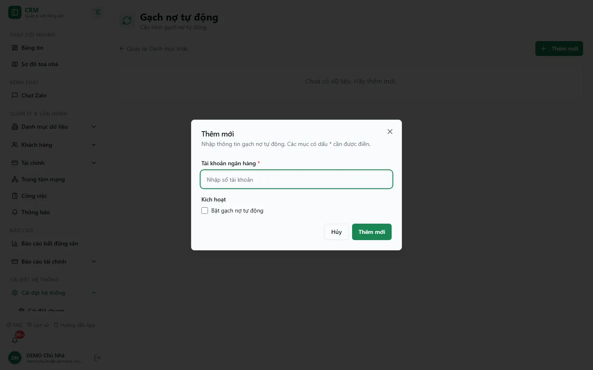

# Gạch nợ tự động

Màn hình này lưu **cấu hình gạch nợ tự động**: số **tài khoản ngân hàng** nhận tiền của khách và trạng thái **Đang bật / Đã tắt** của cấu hình đó. Đây là nơi khai báo trước cho tính năng đối soát chuyển khoản.

::: warning Hiện màn này chỉ lưu cấu hình
Ở phiên bản hiện tại, hệ thống **chưa tự đọc giao dịch ngân hàng, chưa tự cấn trừ công nợ và chưa tự tạo phiếu thu** từ cấu hình này — kể cả khi tích **Bật gạch nợ tự động**. Tiền khách chuyển khoản vẫn phải ghi nhận bằng thao tác thu tiền hoá đơn (xem [Thu tiền hoá đơn](/03-quan-ly-van-hanh/thu-tien-hoa-don/)); chỉ khi phiếu thu ở trạng thái **Đã Thu** (đã ghi sổ) thì tiền mới vào sổ quỹ.
:::

::: info Điều kiện tiên quyết
- Quyền **Gạch nợ tự động => Xem** (module `auto_debt`, action `view`) để mở màn hình.
- Quyền **Thêm / Sửa / Xoá** (`auto_debt.create` / `edit` / `delete`) để lưu thay đổi. Nút vẫn hiện với mọi người vào được màn; thiếu quyền thì máy chủ từ chối khi lưu và hộp thoại báo lỗi.
:::

## Hướng dẫn từng bước

**Bước 1**: Vào **Cài đặt hệ thống** => **Danh mục khác**, trong nhóm **Tài chính** chọn thẻ **Gạch nợ tự động**. Màn hình có tiêu đề **Gạch nợ tự động** ("Cấu hình gạch nợ tự động"), liên kết **Quay lại Danh mục khác** và nút **Thêm mới**. Khi đã có cấu hình, bảng gồm cột **Tài khoản ngân hàng**, **Trạng thái** (**Đang bật** / **Đã tắt**) và **Thao tác**. Snapshot DEMO ngày 07/10/2026 chưa có cấu hình nào nên màn hiện *"Chưa có dữ liệu. Hãy thêm mới."*

**Bước 2**: Ấn **Thêm mới**. Hộp thoại **Thêm mới** hiện ra với dòng hướng dẫn *"Nhập thông tin gạch nợ tự động. Các mục có dấu \* cần được điền."*

**Bước 3**: Nhập **Tài khoản ngân hàng \*** — số tài khoản nhận tiền của khách (bắt buộc).

**Bước 4**: Ở mục **Kích hoạt**, tích **Bật gạch nợ tự động** nếu muốn đánh dấu cấu hình là **Đang bật**; bỏ trống thì cấu hình lưu ở trạng thái **Đã tắt**.

**Bước 5**: Ấn **Thêm mới** để lưu (hoặc **Hủy** để đóng). Lưu xong, thông báo *"Đã tạo cấu hình gạch nợ <số tài khoản>."* hiện ra và dòng mới xuất hiện trong bảng.

**Bước 6**: Muốn sửa, ấn biểu tượng **bút chì** trên dòng — hộp thoại **Cập nhật** mở sẵn số tài khoản và trạng thái; sửa rồi ấn **Cập nhật**. Muốn xoá, ấn biểu tượng **thùng rác** — hộp thoại **Xác nhận xóa** báo *"Bạn có chắc chắn muốn xóa không? Hành động này không thể hoàn tác."*; ấn **Xóa** để xác nhận hoặc **Hủy**.

::: warning Xoá là xoá hẳn
Nút **Xóa** xoá vĩnh viễn dòng cấu hình, không khôi phục được. Muốn tạm ngừng, hãy bỏ tích **Bật gạch nợ tự động** thay vì xoá.
:::

## Các tính năng khác trên màn hình

| Nút / Thành phần | Công dụng |
|---|---|
| **Thêm mới** | Mở hộp thoại tạo một cấu hình mới. |
| Ô **Tài khoản ngân hàng** | Số tài khoản nhận tiền (bắt buộc). |
| Ô tích **Bật gạch nợ tự động** (mục **Kích hoạt**) | Đặt trạng thái cấu hình là **Đang bật** hoặc **Đã tắt**. |
| Cột **Trạng thái** | Nhãn **Đang bật** / **Đã tắt** của từng cấu hình. |
| Biểu tượng **bút chì** | Mở hộp thoại **Cập nhật**. |
| Biểu tượng **thùng rác** | Mở hộp thoại **Xác nhận xóa**. |
| **Quay lại Danh mục khác** | Trở về trang **Danh mục khác**. |

## Tình huống & lỗi thường gặp

| Tình huống | Nguyên nhân & cách xử lý |
|---|---|
| Đã bật cấu hình nhưng hoá đơn không tự chuyển **Đã thanh toán** | Đúng với phiên bản hiện tại — hệ thống chưa tự đối soát chuyển khoản. Ghi nhận tiền bằng [Thu tiền hoá đơn](/03-quan-ly-van-hanh/thu-tien-hoa-don/). |
| Ấn **Thêm mới** trong hộp thoại nhưng không lưu, ô báo *"Nhập tài khoản ngân hàng."* | Ô **Tài khoản ngân hàng** bắt buộc. Nhập số tài khoản rồi lưu lại. |
| Hộp thoại báo *"Chưa lưu được gạch nợ tự động…"* | Thiếu quyền `auto_debt.create`/`edit` hoặc mất kết nối. Đọc phần mô tả trong thông báo, kiểm tra quyền rồi thử lại. |
| Màn báo *"Chưa tải được gạch nợ tự động."* | Ấn **Tải lại**. Nút **Thêm mới** bị khoá cho tới khi tải được danh sách. |
| Có hai dòng cùng một số tài khoản | Xoá dòng thừa để danh sách rõ ràng. |

## Thử trực tiếp trên sandbox

<SandboxTry account="demo.chunha" app-path="/settings/categories/auto-debt" app-label="Mở màn Gạch nợ tự động" fixtures="Snapshot 07/10/2026: DEMO chưa có cấu hình gạch nợ nào." view-only>

**Bài tập chỉ xem**

1. Mở màn **Gạch nợ tự động**, xác nhận màn đang trống (*"Chưa có dữ liệu. Hãy thêm mới."*).
2. Ấn **Thêm mới** để xem hai trường **Tài khoản ngân hàng** và **Kích hoạt** (**Bật gạch nợ tự động**), rồi ấn **Hủy** — không lưu.

**Kết quả mong đợi**

- Giao diện khớp hướng dẫn.
- Không có cấu hình nào bị tạo, sửa hoặc xoá trên DEMO.

</SandboxTry>

## Quy trình liên quan

- [Thu tiền hoá đơn](/03-quan-ly-van-hanh/thu-tien-hoa-don/)
- [Quy trình thu tiền](/01-bat-dau/quy-trinh-thu-tien/)
- [Sổ quỹ](/03-quan-ly-van-hanh/so-quy/)
