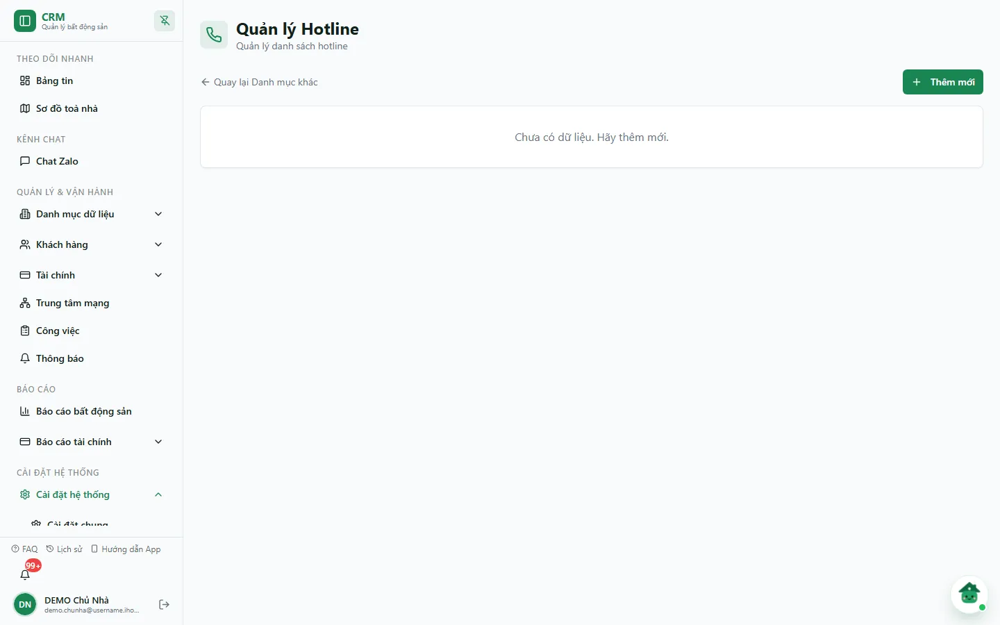
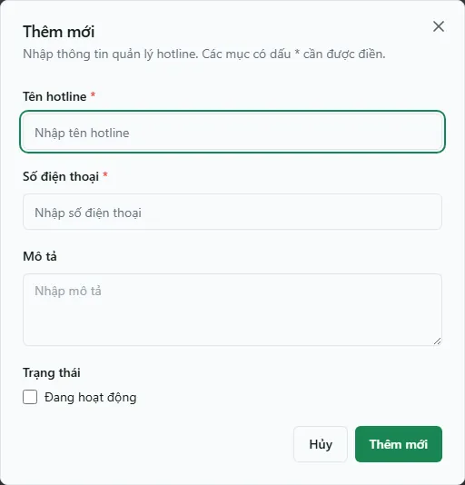

# Hotline

Hotline là danh bạ **số điện thoại/đường dây nóng** mà bạn muốn khách nhìn thấy để liên hệ. Khi khách mở **trang Phòng trống công khai** (link chia sẻ bạn gửi cho sale/khách), số hotline là nơi khách bấm **Gọi** hoặc **Zalo** để hỏi thuê phòng. Trang **Quản lý Hotline** giúp bạn **tạo, sửa, bật/tắt và xoá** hotline; còn việc *chọn hotline nào hiện ra* thì làm ở tab **Cài đặt hiển thị** của [Sale Phòng](/03-quan-ly-van-hanh/sale-phong/). Đây chỉ là một danh mục cấu hình, không liên quan tới tiền.

Nguyên tắc cần nhớ: nếu bạn **không chọn** hotline cụ thể ở Cài đặt hiển thị, trang công khai tự lấy **hotline đang hoạt động đầu tiên**. Vì vậy chỉ cần đánh dấu đúng **Trạng thái** ở đây là khách đã có số để gọi.

::: info Điều kiện tiên quyết
- Quyền **Hotline** (module `hotline`): `view` để mở trang; `create`/`edit`/`delete` để thêm, sửa, xoá.
- Không cần dữ liệu nào có trước: đây là danh mục độc lập.
- Muốn hotline thật sự hiển thị cho khách, bạn cần dùng trang **Phòng trống công khai** qua [Sale Phòng](/03-quan-ly-van-hanh/sale-phong/).
:::

## Hướng dẫn từng bước

**Bước 1**: Vào **Cài đặt hệ thống** => **Danh mục khác**, rồi mở thẻ **Quản lý Hotline** (đường dẫn `/settings/categories/hotlines`). Bảng có các cột **Tên**, **Số điện thoại**, **Mô tả**, **Trạng thái** (nhãn **Hoạt động** hoặc **Ngừng**) và **Thao tác**. Nếu chưa có hotline nào, màn hình hiện *"Chưa có dữ liệu. Hãy thêm mới."* — DEMO hiện ở trạng thái này.

**Bước 2**: Ấn **Thêm mới** ở góc trên bên phải. Hộp **Thêm mới** mở ra.

**Bước 3**: Điền thông tin:
- **Tên hotline** (bắt buộc): tên gợi nhớ, ví dụ `Hotline CSKH` hoặc `Zalo thuê phòng Tòa A`.
- **Số điện thoại** (bắt buộc): số khách sẽ bấm gọi.
- **Mô tả** (tuỳ chọn): ghi chú nội bộ, ví dụ "Trực từ 8h–20h".
- **Trạng thái**: tích ô **Đang hoạt động**. Ô này **mặc định chưa tích** khi thêm mới — nhớ tích nếu muốn hotline được dùng ngay.

**Bước 4**: Ấn **Thêm mới** trong hộp để lưu. Hệ thống báo *"Đã tạo hotline <tên>."* và dòng mới xuất hiện trong bảng. Thiếu ô bắt buộc thì hộp báo ngay dưới ô đó (*Nhập tên hotline.*, *Nhập số điện thoại.*).

**Bước 5**: (Tuỳ chọn) Chọn hotline này để hiển thị cho khách. Sang **Sale Phòng** => tab **Cài đặt hiển thị**, ở ô **Hotline hiển thị** chọn hotline vừa tạo rồi ấn **Lưu cài đặt**. Để nguyên **Mặc định (hotline đầu tiên)** thì trang tự lấy hotline hoạt động đầu tiên.

**Bước 6**: Sửa hoặc xoá khi cần. Trên mỗi dòng, ấn **bút chì** để mở hộp **Cập nhật**, hoặc **thùng rác** để mở hộp **Xác nhận xóa**.

::: tip Số nào thật sự hiện ra cho khách — thứ tự ưu tiên
Trên trang Phòng trống công khai, số liên hệ của một phòng được ưu tiên theo thứ tự: **Liên hệ quản lý toà** (nếu toà đã điền ở **Sale Phòng** => tab **Thông tin sale**) => **Hotline hiển thị** chọn ở **Cài đặt hiển thị** => **hotline hoạt động đầu tiên**. Riêng phòng dạng **Khách nhờ sale**, trang có thể dùng số của khách hoặc số quản lý tuỳ cách khách chọn. Nếu đã cấu hình hotline mà khách vẫn thấy số khác, hãy kiểm tra **Liên hệ quản lý toà** của toà đó.
:::

::: warning Xoá hotline không hoàn tác được
Hộp **Xác nhận xóa** ghi *"Bạn có chắc chắn muốn xóa không? Hành động này không thể hoàn tác."* Nếu xoá đúng hotline đang chọn ở **Cài đặt hiển thị**, trang công khai sẽ rơi về hotline hoạt động đầu tiên (hoặc không còn số nào nếu xoá hết). Muốn tạm ẩn mà vẫn giữ lại, hãy **bỏ tích Đang hoạt động** (chuyển sang **Ngừng**) thay vì xoá.
:::

## Các tính năng khác trên màn hình

| Nút / Cột | Công dụng |
| --- | --- |
| **Thêm mới** | Mở hộp tạo hotline mới. |
| **Tên** (cột) | Tên gợi nhớ của hotline. |
| **Số điện thoại** (cột) | Số khách sẽ bấm **Gọi** / **Zalo** trên trang công khai. |
| **Mô tả** (cột) | Ghi chú nội bộ, không hiển thị cho khách. |
| **Trạng thái** (cột) | **Hoạt động** / **Ngừng** — chỉ hotline **Hoạt động** mới được chọn hiển thị và dùng làm hotline mặc định. |
| **Bút chì** | Mở hộp **Cập nhật** để đổi tên, số, mô tả hoặc trạng thái. |
| **Thùng rác** | Xoá hotline (có xác nhận, không hoàn tác). |
| **Quay lại Danh mục khác** | Liên kết góc trên trái để về trang **Danh mục khác**. |

## Tình huống & lỗi thường gặp

| Tình huống | Cách xử lý |
| --- | --- |
| Khách mở trang Phòng trống mà không thấy số nào để gọi | Chưa có hotline nào **Hoạt động** và toà chưa có liên hệ quản lý. Tạo hotline và tích **Đang hoạt động**, hoặc bật lại một hotline đang **Ngừng**. |
| Vừa thêm hotline nhưng nhãn hiện **Ngừng** | Lúc thêm chưa tích **Đang hoạt động**. Mở **bút chì**, tích ô rồi bấm **Cập nhật**. |
| Trang công khai hiện **sai số** | Có nhiều hotline nên hệ thống lấy hotline hoạt động đầu tiên. Vào **Sale Phòng** => **Cài đặt hiển thị**, chọn đúng **Hotline hiển thị** rồi **Lưu cài đặt**. |
| Đã chọn hotline nhưng khách vẫn thấy số khác | Toà đó đã điền **Liên hệ quản lý toà** ở tab **Thông tin sale**, số này được ưu tiên hơn hotline chung. |
| Hiện *"Chưa tải được quản lý hotline."* | Lỗi mạng hoặc máy chủ khi đọc dữ liệu. Bấm **Tải lại**. |
| Mở trang bị đưa về **Bảng tin** | Thiếu quyền **Hotline** (xem). Nhờ chủ nhà cấp ở [Phân quyền](/05-cai-dat/phan-quyen/). |

## Thử trực tiếp trên sandbox

<SandboxTry account="demo.chunha" app-path="/settings/categories/hotlines" app-label="Mở màn Quản lý Hotline" fixtures="Snapshot 07/10/2026: DEMO chưa có hotline nào" view-only>

**Bài tập chỉ xem**

1. Mở **Cài đặt hệ thống** => **Danh mục khác** => **Quản lý Hotline**; DEMO đang hiện *"Chưa có dữ liệu. Hãy thêm mới."*
2. Bấm **Thêm mới** để xem các ô **Tên hotline**, **Số điện thoại**, **Mô tả**, **Đang hoạt động**, rồi bấm **Hủy** — không bấm **Thêm mới** trong hộp.

**Kết quả mong đợi**

- Bạn hiểu hotline chỉ là danh bạ số liên hệ cho trang Phòng trống công khai.
- Không có dữ liệu DEMO nào bị tạo, sửa hoặc xoá.

</SandboxTry>

## Quy trình liên quan

- [Danh mục khác](/05-cai-dat/danh-muc-khac/) — trang chứa lối vào **Quản lý Hotline**.
- [Sale Phòng](/03-quan-ly-van-hanh/sale-phong/) — chọn **Hotline hiển thị** và điền **Liên hệ quản lý toà**.
- [Phân quyền](/05-cai-dat/phan-quyen/) — cấp quyền **Hotline** cho nhân viên.
