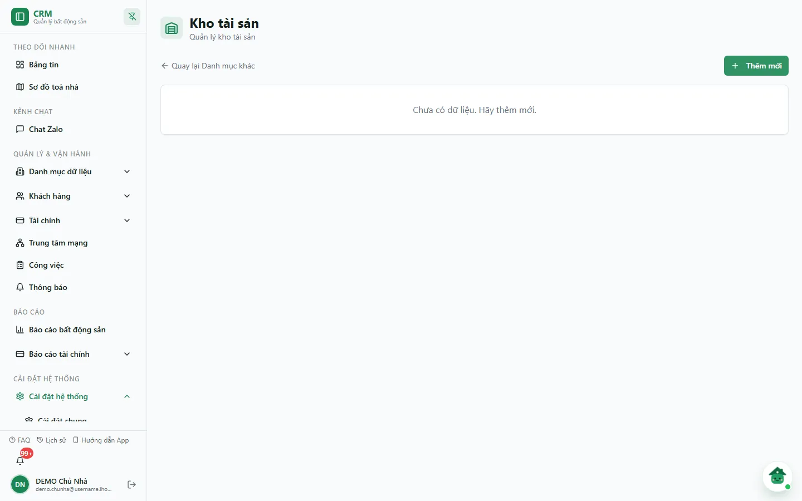
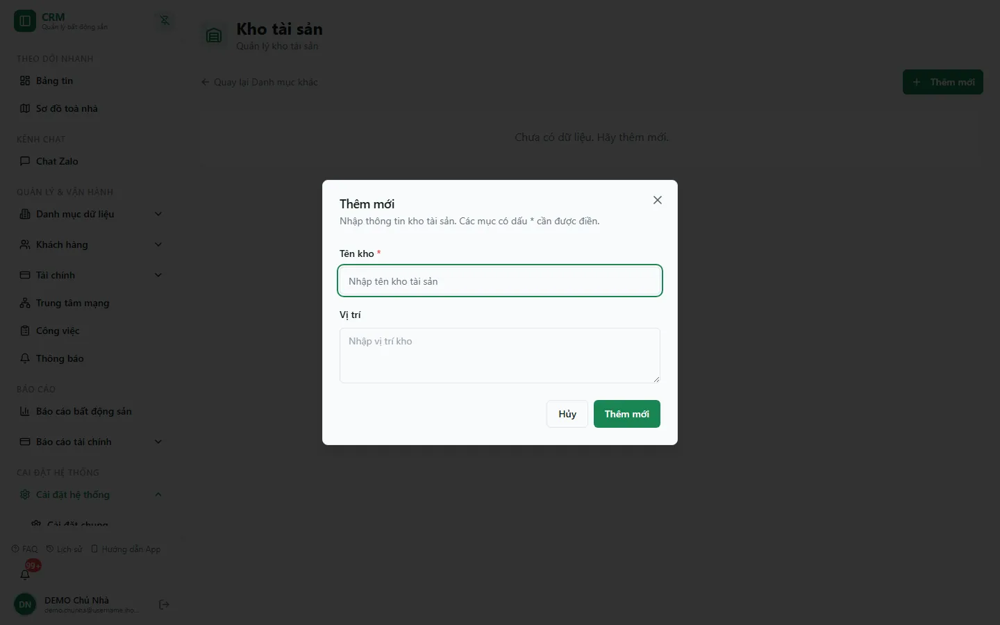

# Kho (địa điểm lưu)

Màn **Kho tài sản** là nơi khai báo danh sách các **địa điểm cất giữ** tài sản, nội thất và đồ dự phòng — kho tầng hầm, phòng kỹ thuật, kho tổng… Mỗi kho chỉ có hai thông tin: **Tên kho** và **Vị trí**. Danh mục dùng chung cho cả công ty, không tách theo toà nhà.

Hiện kho là **danh mục khai báo để tra cứu**: màn [Tài sản](/03-quan-ly-van-hanh/tai-san/) chưa có ô chọn kho, nên tài sản vẫn được gắn theo toà/phòng ở màn đó. Kho tài sản ở đây cũng **khác** với [Kho vật tư](/03-quan-ly-van-hanh/kho-vat-tu/) (tồn vật tư tiêu hao, phiếu nhập/xuất).

::: info Điều kiện tiên quyết
- Quyền **Kho => Xem** (module `warehouses`, action `view`) để mở màn hình.
- Quyền **Thêm / Sửa / Xoá** (`warehouses.create` / `edit` / `delete`) để lưu thay đổi. Nút vẫn hiện với mọi người vào được màn; thiếu quyền thì máy chủ từ chối khi lưu và hộp thoại báo lỗi.
:::

## Hướng dẫn từng bước

**Bước 1**: Vào **Cài đặt hệ thống** => **Danh mục khác**, trong nhóm **Tài sản** chọn thẻ **Kho tài sản**. Màn hình có tiêu đề **Kho tài sản** ("Quản lý kho tài sản"), liên kết **Quay lại Danh mục khác** và nút **Thêm mới**. Khi đã có kho, bảng gồm cột **Tên kho**, **Vị trí** và **Thao tác**. Snapshot DEMO ngày 07/10/2026 chưa có kho nào nên màn hiện *"Chưa có dữ liệu. Hãy thêm mới."*

**Bước 2**: Ấn **Thêm mới**. Trong hộp thoại **Thêm mới**:
- Nhập **Tên kho \*** (bắt buộc) — ví dụ "Kho tầng hầm Toà A".
- Nhập **Vị trí** (tuỳ chọn, ô nhiều dòng) — mô tả nơi đặt kho, ví dụ "Tầng hầm, cạnh chỗ để xe".
- Ấn **Thêm mới** để lưu, hoặc **Hủy** để đóng. Lưu xong, thông báo *"Đã tạo kho tài sản <tên kho>."* hiện ra và kho xuất hiện trong bảng.

**Bước 3**: Muốn sửa, ấn biểu tượng **bút chì** trên dòng kho. Hộp thoại **Cập nhật** mở sẵn tên và vị trí hiện tại; sửa xong ấn **Cập nhật**.

**Bước 4**: Muốn xoá, ấn biểu tượng **thùng rác**. Hộp thoại **Xác nhận xóa** báo *"Bạn có chắc chắn muốn xóa không? Hành động này không thể hoàn tác."* — ấn **Xóa** để xác nhận, hoặc **Hủy** để giữ lại.

::: warning Xoá kho là xoá vĩnh viễn
Nút **Xóa** xoá hẳn bản ghi kho, không khôi phục được. Nếu chỉ tạm ngừng dùng, cân nhắc đổi tên (ví dụ thêm "(ngừng dùng)") thay vì xoá.
:::

**Bước 5**: Ấn **Quay lại Danh mục khác** để trở về trang danh mục tổng hợp.

## Các tính năng khác trên màn hình

| Nút / Thành phần | Công dụng |
| --- | --- |
| Nút **Thêm mới** | Mở hộp thoại tạo kho mới (Tên kho + Vị trí). |
| Biểu tượng **bút chì** | Mở hộp thoại **Cập nhật** của dòng đang chọn. |
| Biểu tượng **thùng rác** | Mở hộp thoại **Xác nhận xóa**. |
| Liên kết **Quay lại Danh mục khác** | Trở về `/settings/categories`. |
| Trường **Tên kho** | Bắt buộc; để trống sẽ báo *"Nhập tên kho."* |
| Trường **Vị trí** | Ghi chú tuỳ chọn, nhiều dòng. |

## Tình huống & lỗi thường gặp

| Tình huống | Cách xử lý |
| --- | --- |
| Không thấy thẻ **Kho tài sản** hoặc bị chuyển về Bảng tin | Tài khoản chưa có quyền **Kho => Xem** (module `warehouses`) hoặc **Danh mục khác**. Nhờ chủ nhà cấp quyền. |
| Ấn lưu nhưng ô báo *"Nhập tên kho."* | Nhập **Tên kho** rồi lưu lại. |
| Hộp thoại báo *"Chưa lưu được kho tài sản…"* hoặc *"Chưa xóa được kho tài sản…"* | Thiếu quyền tương ứng hoặc mất kết nối. Đọc phần mô tả trong thông báo, kiểm tra quyền rồi thử lại. |
| Màn báo *"Chưa tải được kho tài sản."* | Ấn **Tải lại**; nút **Thêm mới** bị khoá cho tới khi tải được danh sách. |
| Lỡ xoá nhầm một kho | Không khôi phục được; tạo lại kho bằng tay. |
| Không có ô lọc theo toà nhà | Đúng thiết kế: kho là danh mục chung của công ty. |

## Thử trực tiếp trên sandbox

<SandboxTry account="demo.chunha" app-path="/settings/categories/warehouses" app-label="Mở màn Kho tài sản" fixtures="Snapshot 07/10/2026: DEMO chưa có kho tài sản nào." view-only>

**Bài tập chỉ xem**

1. Mở màn **Kho tài sản**, xác nhận màn đang trống.
2. Ấn **Thêm mới** để xem hai trường **Tên kho** và **Vị trí**, rồi ấn **Hủy** — không lưu.

**Kết quả mong đợi**

- Giao diện khớp hướng dẫn.
- Không có kho nào bị tạo, sửa hoặc xoá trên DEMO.

</SandboxTry>

## Quy trình liên quan

- [Danh mục khác](/05-cai-dat/danh-muc-khac/) — trang tổng hợp các danh mục, trong đó có nhóm **Tài sản**.
- [Tài sản](/03-quan-ly-van-hanh/tai-san/) — khai báo và theo dõi từng món tài sản theo toà/phòng.
- [Kho vật tư](/03-quan-ly-van-hanh/kho-vat-tu/) — tồn kho vật tư tiêu hao, phiếu nhập/xuất.
