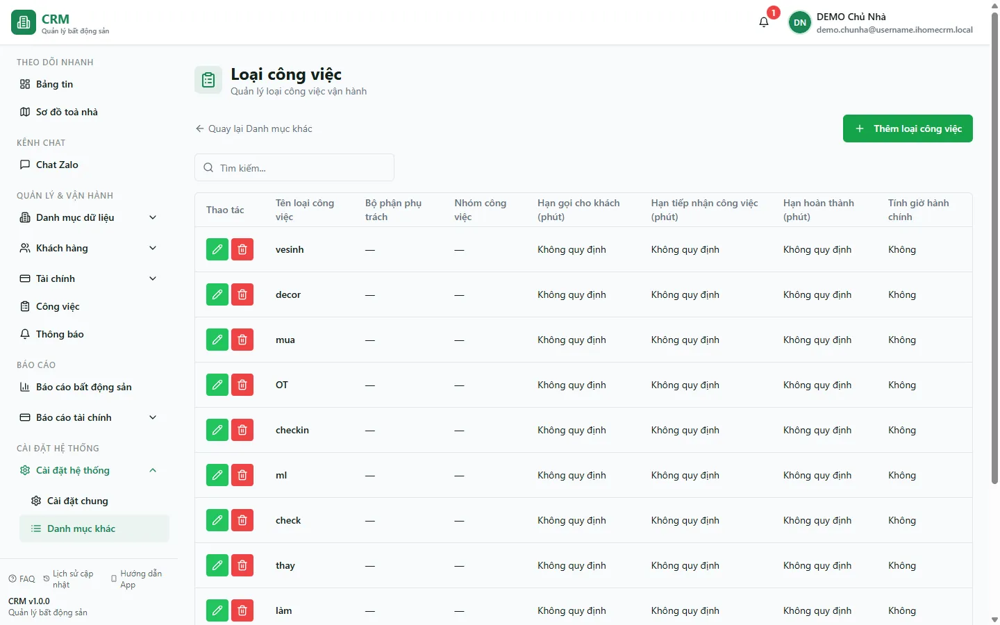

# Loại công việc

Trang **Loại công việc** là nơi bạn khai báo các "khuôn" công việc vận hành (ví dụ: sửa điện, sửa nước, ký hợp đồng, kiểm tra nhà). Mỗi loại việc mang sẵn **mức độ ưu tiên**, các **deadline** (phút), **bộ phận thực hiện**, và — quan trọng cho lương — **mức thưởng khi hoàn thành**, **cờ việc sửa chữa** và **cờ việc ký hợp đồng**. Khi nhân viên **tạo một công việc**, họ chọn loại việc ở đây; lúc việc **hoàn thành**, hệ thống dựa vào cấu hình thưởng của loại việc để cộng vào **Bảng lương quản lý**. Vì vậy đây là nơi bạn thiết lập một lần "loại việc nào có thưởng, thưởng bao nhiêu".

::: info Điều kiện tiên quyết
- Bạn cần quyền **Loại công việc => Xem** (module `task_types`, action `view`) để mở trang; cần quyền **Thêm / Sửa / Xoá** tương ứng để chỉnh danh mục.
- Trang nằm trong nhóm **Cài đặt hệ thống**, truy cập qua **Cài đặt** => **Danh mục khác** => **Loại công việc**.
- Đây là danh mục **dùng chung theo tài khoản** (không phân theo tòa nhà) — sửa một chỗ áp dụng cho mọi tòa.
- Muốn mức thưởng chảy vào lương thật, cần đã cấu hình người hưởng lương ở [Bảng lương quản lý](/03-quan-ly-van-hanh/bang-luong/).
:::

## Hướng dẫn từng bước

**Bước 1**: Vào **Cài đặt** => **Danh mục khác**, rồi chọn **Loại công việc**. Màn danh sách mở ra tại đường dẫn `/settings/categories/task-types`, hiển thị bảng các loại việc kèm cột **Tên loại công việc**, **Bộ phận phụ trách**, **Nhóm công việc**, các **Hạn** (phút) và **Tính giờ hành chính**. Dùng ô **Tìm kiếm...** để lọc nhanh theo tên.

**Bước 2**: Ấn nút **Thêm loại công việc** (nút xanh góc trên phải). Hộp thoại **THÊM LOẠI CÔNG VIỆC** mở ra. Điền phần thông tin chung:
- **Tên loại công việc** (bắt buộc) — ví dụ "Sửa điện", "Ký hợp đồng".
- **Nhóm công việc** (bắt buộc) — chọn nhóm sẵn có, hoặc chọn **+ Thêm nhóm mới** để tạo ngay.
- **Mức độ ưu tiên** — mặc định là mức trung bình.
- **Deadline liên hệ KH / tiếp nhận / hoàn thành** — tính theo **phút**, để **0** nếu không áp dụng.
- **Tính giờ hành chính (9h - 18h)** — bật nếu deadline chỉ đếm trong giờ làm việc.
- **Bộ phận thực hiện** (bắt buộc) — bộ phận mặc định nhận việc loại này.

**Bước 3**: Cuộn xuống khối **Bảng lương quản lý** trong hộp thoại — đây là phần quyết định thưởng. Cấu hình 4 mục:
- **Tiền thưởng khi hoàn thành (đ)** — số tiền cộng cho nhân viên **mỗi lần hoàn thành** một việc thuộc loại này (ví dụ **1.000.000đ**). Để **0** nếu loại việc không thưởng.
- **Là việc sửa chữa** — bật cho các việc sửa chữa. Cờ này dùng cho **phụ cấp Chủ nhật/Lễ** (mỗi ngày CN/Lễ có ít nhất một việc sửa chữa được cộng phụ cấp), và thưởng theo việc của loại này **luôn được tính**.
- **Là việc ký hợp đồng** — bật cho việc ký hợp đồng (loại "checkin"). Thưởng của cờ này **chỉ được cộng khi việc hoàn thành sau 18h hoặc vào Chủ nhật/Lễ** (thưởng ký hợp đồng ngoài giờ, mặc định **+50.000đ**).
- **Tính vào lương** — công tắc tổng: bật thì loại việc này góp vào bảng kê/lương; tắt thì dù có nhập tiền thưởng, việc loại này **không** cộng vào lương.

**Bước 4**: Ấn **Lưu**. Loại việc mới xuất hiện trong danh sách và sẵn sàng để nhân viên chọn khi **tạo công việc**. Từ nay mỗi việc thuộc loại này khi **hoàn thành** sẽ tự chảy thưởng vào [Bảng lương quản lý](/03-quan-ly-van-hanh/bang-luong/) theo cấu hình vừa đặt.

**Bước 5**: Để chỉnh sửa hoặc gỡ một loại việc, dùng nút **bút chì** (Sửa) hoặc **thùng rác** (Xoá) ở cột **Thao tác** đầu mỗi dòng.

::: warning Đổi mức thưởng ảnh hưởng lương các tháng chưa chốt
Thay đổi **Tiền thưởng khi hoàn thành** hay các cờ ở đây sẽ tính lại thưởng cho những việc thuộc **tháng lương chưa chốt**. Các **tháng đã chốt** đã đóng băng con số nên **không** bị đổi. Vì vậy hãy đặt mức thưởng cho đúng **trước** khi nhân viên hoàn thành hàng loạt việc, tránh phải giải thích chênh lệch về sau.
:::

::: warning Xoá loại việc là thao tác khó hoàn tác
Xoá một loại công việc bỏ nó khỏi danh sách chọn khi tạo việc mới. Nếu loại việc đang được dùng, hãy cân nhắc chỉ **sửa** (ví dụ tắt **Tính vào lương**) thay vì xoá, để không mất lịch sử tham chiếu của các công việc cũ.
:::

## Các tính năng khác trên màn hình

| Nút / Khu vực | Công dụng |
| --- | --- |
| **Thêm loại công việc** | Mở hộp thoại tạo loại việc mới. |
| Ô **Tìm kiếm...** | Lọc nhanh danh sách theo tên loại việc. |
| Cột **Thao tác** (bút chì / thùng rác) | Sửa hoặc xoá một loại việc. |
| **Nhóm công việc** (trong form) | Gom các loại việc vào nhóm; có tuỳ chọn **+ Thêm nhóm mới** ngay tại chỗ. |
| **Deadline** liên hệ / tiếp nhận / hoàn thành | Mốc thời gian (phút) áp cho việc thuộc loại này; để 0 là không quy định. |
| **Tính giờ hành chính (9h - 18h)** | Chỉ đếm deadline trong giờ làm việc. |
| **Bộ phận thực hiện** | Bộ phận mặc định nhận việc loại này. |
| Khối **Bảng lương quản lý** | Nơi đặt **Tiền thưởng**, **Là việc sửa chữa**, **Là việc ký hợp đồng**, **Tính vào lương**. |
| **Quay lại Danh mục khác** | Liên kết về trang tổng hợp danh mục. |

## Tình huống & lỗi thường gặp

| Tình huống | Cách xử lý |
| --- | --- |
| Nhân viên hoàn thành việc nhưng **không được thưởng** | Kiểm tra loại việc: **Tính vào lương** phải bật, và có **Tiền thưởng > 0** hoặc bật **Là việc sửa chữa**. Nếu Bảng lương đang bật "yêu cầu ảnh" mà việc thiếu ảnh thì cũng không thưởng. |
| Việc **ký hợp đồng** hoàn thành trong giờ hành chính mà không có **+50.000đ** | Đúng thiết kế: thưởng ký hợp đồng chỉ cộng khi hoàn thành **sau 18h hoặc CN/Lễ**. Trong giờ ngày thường sẽ không có khoản này. |
| Bật **Tiền thưởng** nhưng lương vẫn không cộng | Công tắc **Tính vào lương** đang tắt — đây là công tắc tổng, phải bật thì mức thưởng mới có hiệu lực. |
| Không thấy **phụ cấp Chủ nhật/Lễ** cho việc sửa | Việc đó phải bật cờ **Là việc sửa chữa** (hoặc là việc ký hợp đồng), và ngày hoàn thành phải rơi vào **Chủ nhật/Lễ** theo danh sách ngày lễ trong Bảng lương. |
| Sửa mức thưởng mà **tháng cũ không đổi** | Tháng lương đã **chốt** đóng băng số, không tính lại. Chỉ tháng chưa chốt mới áp mức mới. |
| Không thấy mục **Loại công việc** trong menu | Tài khoản chưa có quyền **Loại công việc** (xem). Nhờ chủ nhà cấp quyền ở phần phân quyền. |

## Thử trực tiếp trên sandbox

<SandboxTry account="demo.chunha" app-path="/settings/categories/task-types" app-label="Mở màn Loại công việc" view-only>

Bài này **chỉ xem** — bạn quan sát cấu hình, không lưu thay đổi:

1. Mở màn **Loại công việc** và xem danh sách các loại việc mẫu (tên, bộ phận, nhóm, các deadline).
2. Ấn **bút chì** ở một dòng để mở form, cuộn xuống khối **Bảng lương quản lý** để thấy 4 mục thưởng: **Tiền thưởng khi hoàn thành**, **Là việc sửa chữa**, **Là việc ký hợp đồng**, **Tính vào lương**.
3. So sánh vài loại việc: loại nào có **mức thưởng > 0**, loại nào bật cờ **sửa chữa** hay **ký hợp đồng**.

Kết quả mong đợi: bạn hình dung được mỗi loại việc mang theo một quy tắc thưởng riêng, và chính cấu hình này quyết định số tiền cộng vào lương khi việc hoàn thành. Đóng form bằng **Huỷ** (bài chỉ xem, không lưu).

</SandboxTry>

## Quy trình liên quan

- [Danh mục khác](/05-cai-dat/danh-muc-khac/) — trang tổng hợp điều hướng sang mọi danh mục con.
- [Danh mục chung](/05-cai-dat/danh-muc-chung/) — nơi gom các danh mục dùng chung của hệ thống.
- [Bảng lương quản lý](/03-quan-ly-van-hanh/bang-luong/) — nơi mức thưởng của loại việc chảy vào lương nhân viên.
- [Việc của tôi](/02-theo-doi-nhanh/viec-cua-toi/) — việc hoàn thành theo loại việc là nguồn thưởng.
