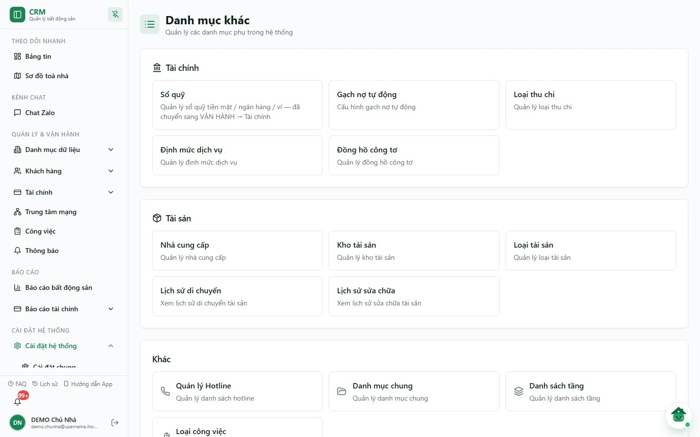
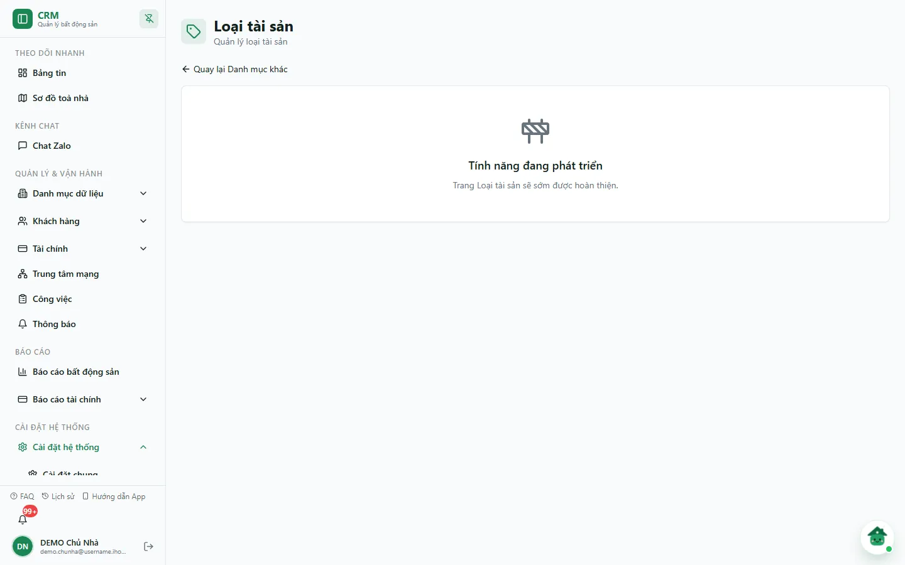
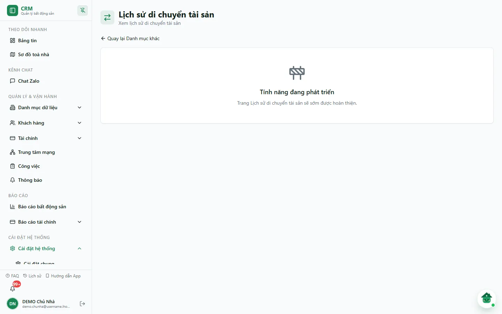

# Loại tài sản

**Loại tài sản** dùng để gom các món tài sản/nội thất thành từng nhóm — ví dụ *Điện lạnh*, *Nội thất* — giúp lọc và đếm tài sản theo nhóm.

Cần nắm ngay: màn **Loại tài sản** trong **Danh mục khác** hiện là **trang giữ chỗ** — chỉ hiện thông báo *"Tính năng đang phát triển"*, chưa có bảng hay nút thêm/sửa/xoá. Danh sách loại tài sản thực tế xuất hiện dưới dạng **ô chọn** ở màn [Tài sản](/03-quan-ly-van-hanh/tai-san/): ô lọc **Loại tài sản** đầu trang và trường **Loại tài sản \*** trong hộp thoại **Tạo tài sản mới** / **Chỉnh sửa tài sản**.

::: info Điều kiện tiên quyết
- Mở màn **Loại tài sản** cần quyền `asset_types.view`. Hai màn **Lịch sử di chuyển** và **Lịch sử sửa chữa** cần quyền `assets.view`.
- Muốn xem/dùng loại tài sản ở màn **Tài sản** cần quyền **Tài sản => Xem** (`assets.view`), thêm quyền tạo/sửa tài sản nếu muốn chọn loại khi khai báo.
:::

## Hướng dẫn từng bước

**Bước 1**: Vào **Cài đặt hệ thống** => **Danh mục khác**. Nhóm **Tài sản** có năm thẻ: **Nhà cung cấp**, **Kho tài sản**, **Loại tài sản**, **Lịch sử di chuyển**, **Lịch sử sửa chữa**.

**Bước 2**: Chọn thẻ **Loại tài sản**. Màn hình có tiêu đề **Loại tài sản** ("Quản lý loại tài sản"), liên kết **Quay lại Danh mục khác** và khung *"Tính năng đang phát triển — Trang Loại tài sản sẽ sớm được hoàn thiện."* Chưa có thao tác nào khác tại đây.

**Bước 3**: Để xem các loại đang có, mở **Danh mục dữ liệu** => **Tài sản** rồi bấm ô lọc **Loại tài sản** ở đầu trang. Danh sách xổ xuống liệt kê các loại đã được khai trong hệ thống; chọn một loại để lọc bảng tài sản.

**Bước 4**: Khi khai một tài sản mới, ở màn **Tài sản** ấn **Tạo tài sản**. Trong hộp thoại **Tạo tài sản mới**, trường **Loại tài sản \*** là bắt buộc (ô chọn hiện *"Chọn loại"*). Muốn đổi loại của một món đã khai, mở **Sửa** ở dòng tài sản đó, chọn lại **Loại tài sản** trong hộp thoại **Chỉnh sửa tài sản** rồi lưu — chỉ đổi loại của món đó, không đổi danh mục.

::: warning Chưa thêm được loại mới trên giao diện
Vì màn **Loại tài sản** chưa có nút thêm, danh sách loại chỉ gồm những loại đã có sẵn trong dữ liệu của công ty. Nếu ô chọn **Loại tài sản** trống, bạn chưa tạo được tài sản (trường bắt buộc) — hãy nhờ quản trị hệ thống bổ sung loại.
:::

## Lịch sử di chuyển và Lịch sử sửa chữa

Hai thẻ còn lại trong nhóm **Tài sản** cũng đang là trang giữ chỗ:

| Thẻ | Đường dẫn | Hiện trạng |
| --- | --- | --- |
| **Lịch sử di chuyển** | `/settings/categories/asset-movements` | Tiêu đề **Lịch sử di chuyển tài sản**, chỉ hiện *"Tính năng đang phát triển"*. |
| **Lịch sử sửa chữa** | `/settings/categories/asset-maintenance` | Tiêu đề **Lịch sử sửa chữa tài sản**, chỉ hiện *"Tính năng đang phát triển"*. |

**Bước 5**: Chọn thẻ **Lịch sử di chuyển** (hoặc **Lịch sử sửa chữa**) để xác nhận trạng thái hiện tại; ấn **Quay lại Danh mục khác** để trở về.

## Các tính năng khác trên màn hình

| Vị trí trong hệ thống | Vai trò của Loại tài sản |
| --- | --- |
| Ô lọc **Loại tài sản** (màn **Tài sản**) | Lọc bảng tài sản về đúng một loại. |
| Trường **Loại tài sản \*** (hộp thoại **Tạo tài sản mới** / **Chỉnh sửa tài sản**) | Bắt buộc khi khai báo; quyết định món đồ thuộc nhóm nào. |
| Liên kết **Quay lại Danh mục khác** (màn giữ chỗ) | Trở về trang **Danh mục khác**. |

## Tình huống & lỗi thường gặp

| Tình huống | Nguyên nhân & cách xử lý |
| --- | --- |
| Mở **Loại tài sản** chỉ thấy *"Tính năng đang phát triển"* | Đúng hiện trạng. Xem và dùng loại tài sản ở màn **Tài sản**. |
| Ô chọn **Loại tài sản** ở màn Tài sản trống | Công ty chưa có loại nào, hoặc tài khoản chưa có quyền xem. Nhờ quản trị bổ sung loại / kiểm tra quyền nhóm **Tài sản & Kho**. |
| Muốn đổi tên một loại | Chưa có thao tác trên giao diện; nhờ quản trị hệ thống. |
| Gán nhầm loại cho một tài sản | Mở **Sửa** dòng tài sản đó => chọn lại **Loại tài sản** => lưu. |
| Mở **Lịch sử di chuyển** / **Lịch sử sửa chữa** không thấy dữ liệu | Hai màn này đang là trang giữ chỗ, chưa hiển thị lịch sử. |

## Thử trực tiếp trên sandbox

<SandboxTry account="demo.chunha" app-path="/settings/categories/asset-types" app-label="Mở trang Loại tài sản" fixtures="Snapshot 07/10/2026: Loại tài sản, Lịch sử di chuyển và Lịch sử sửa chữa đều hiển thị Tính năng đang phát triển." view-only>

**Bài tập chỉ xem**

1. Mở trang **Loại tài sản**, xác nhận thông báo **Tính năng đang phát triển**.
2. Ấn **Quay lại Danh mục khác**, lần lượt mở **Lịch sử di chuyển** và **Lịch sử sửa chữa** để xác nhận cùng trạng thái.
3. Sang màn **Tài sản**, mở ô lọc **Loại tài sản** để xem các loại đang có; không mở form tạo mới.

**Kết quả mong đợi**

- Ba màn giữ chỗ khớp mô tả; loại tài sản được xem qua màn **Tài sản**.
- Không có dữ liệu DEMO nào bị tạo, sửa hoặc xoá.

</SandboxTry>

## Quy trình liên quan

- [Tài sản](/03-quan-ly-van-hanh/tai-san/) — nơi loại tài sản được dùng khi lọc và khai báo tài sản.
- [Nhà cung cấp](/05-cai-dat/nha-cung-cap/) — danh mục nơi mua tài sản (mua *từ ai*), đi cùng loại tài sản (*là gì*).
- [Kho (địa điểm lưu)](/05-cai-dat/kho-cai-dat/) — danh mục địa điểm cất tài sản.
- [Phân quyền](/05-cai-dat/phan-quyen/) — cấp quyền nhóm **Tài sản & Kho**.
