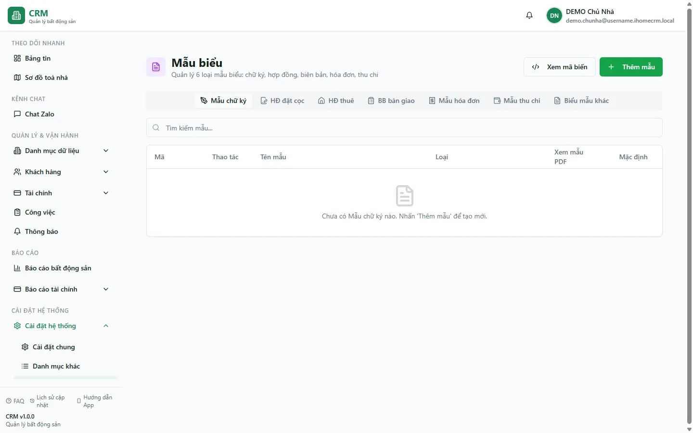

# Mẫu biểu (hợp đồng, hoá đơn, biên bản)

Trang **Mẫu biểu** là nơi bạn lưu sẵn các mẫu in dùng chung cho toàn bộ tài khoản: hợp đồng đặt cọc, hợp đồng thuê, biên bản bàn giao, mẫu hoá đơn và mẫu thu chi. Mỗi mẫu là một file Word (`.docx`) mà bạn thiết kế theo ý mình, chèn các **mã biến** (ví dụ tên khách, số hợp đồng, giá thuê) — khi in, hệ thống tự điền dữ liệu thật vào mã biến rồi tạo ra file để bạn tải về, không cần soạn lại từng bản. Các mẫu ở đây được dùng lại ở nhiều nơi: khi in hợp đồng từ màn hình **Hợp đồng**, khi in hoá đơn từ màn hình **Hoá đơn**. Mẫu biểu dùng chung cho mọi tòa nhà trong tài khoản, không phân theo từng tòa.

::: info Điều kiện tiên quyết
Bạn cần quyền **Mẫu biểu** (xem) để mở trang này; muốn thêm/sửa/xóa mẫu cần thêm quyền tương ứng. Trang nằm trong nhóm **Cài đặt hệ thống**, truy cập qua **Cài đặt** => **Mẫu biểu**. Đây là dữ liệu dùng chung của chủ tài khoản — nhân viên được phân quyền **Mẫu biểu** sẽ thấy và dùng chung toàn bộ mẫu, không phân theo tòa nhà được giao.
:::

## Hướng dẫn từng bước

**Bước 1**: Vào **Cài đặt** => **Mẫu biểu**. Trang mở ra tại đường dẫn `/settings/templates`.

**Bước 2**: Chọn tab loại mẫu bạn muốn xem hoặc quản lý. Trang chia thành các tab theo loại mẫu: **Mẫu chữ ký**, **HĐ đặt cọc**, **HĐ thuê**, **Biên bản bàn giao**, **Mẫu hoá đơn**, **Mẫu thu chi** và **Biểu mẫu khác**. Mỗi tab chỉ liệt kê các mẫu thuộc đúng loại đó. Ô tìm kiếm phía trên giúp bạn lọc nhanh theo tên hoặc mã mẫu.

**Bước 3**: Thêm một mẫu mới. Bấm nút **Thêm mẫu**, rồi khai báo:
- **Tên** mẫu (ví dụ "HĐ thuê Tòa DEMO A").
- **Danh mục** — loại mẫu, quyết định mẫu nằm ở tab nào.
- **Mô tả** (tùy chọn).
- Gạt Switch **Mặc định** nếu muốn đây là mẫu được chọn sẵn khi in.
- Chọn **file** mẫu: **chỉ chấp nhận file Word `.docx`, dung lượng tối đa 5MB**. Không tải lên được file PDF.

Bấm lưu. Hệ thống tự sinh **mã mẫu** (dạng `MHD000001`) và tải file lên kho lưu trữ riêng tư của bạn.

**Bước 4**: Đặt mẫu mặc định. Gạt Switch **Mặc định** ngay trên dòng của mẫu. Mỗi loại mẫu chỉ có **một mẫu mặc định** — khi bạn bật mẫu này làm mặc định, mẫu mặc định cũ cùng loại sẽ tự động bị tắt. Mẫu mặc định là mẫu được chọn sẵn khi bạn in hợp đồng hoặc hoá đơn.

**Bước 5**: Xem, tải, sửa hoặc xóa mẫu bằng các nút trên mỗi dòng:
- Nút **Xem** (biểu tượng con mắt): mở nhanh file mẫu trong tab mới.
- Nút **Tải** (biểu tượng tải xuống): tải file `.docx` gốc về máy để chỉnh sửa.
- Nút **Sửa**: đổi tên, mô tả, danh mục, hoặc thay file mẫu khác.
- Nút **Xóa**: gỡ mẫu khỏi danh sách.

**Bước 6**: Tra cứu mã biến để thiết kế mẫu. Bấm nút **Xem mã biến** để mở danh sách toàn bộ mã biến mà hệ thống hỗ trợ (khoảng 97 mã, chia theo 9 nhóm: thông tin hợp đồng, khách đại diện, phòng, tòa nhà, danh sách khách thuê, tài sản, phí dịch vụ, phương tiện...). Bạn có thể tìm kiếm và **sao chép** từng mã, rồi dán vào file `.docx` của mình. Cú pháp mã biến:
- `{TÊN_MÃ}` — điền một giá trị đơn (ví dụ `{CONTRACT_NUMBER}` là số hợp đồng, `{RENT_PRICE}` là giá thuê).
- `{#TÊN}...{/TÊN}` — vùng lặp cho bảng nhiều dòng (ví dụ bảng danh sách khách thuê, bảng phí dịch vụ).

**Bước 7**: Dùng mẫu khi in. Sau khi đã có mẫu, bạn không in trên trang này. Mẫu được dùng ở nơi phát sinh chứng từ:
- **In hợp đồng thuê**: mở màn hình **Hợp đồng** => chọn hợp đồng => in. Hệ thống chọn sẵn mẫu **HĐ thuê** đang đặt mặc định, điền dữ liệu thật vào mã biến và tạo file `.docx` để bạn tải về.
- **In hoá đơn**: mở màn hình **Hoá đơn** => chọn hoá đơn => in. Hệ thống dùng mẫu hoá đơn đã gắn cho hoá đơn đó, hoặc mẫu hoá đơn mặc định.

## Các tính năng khác trên màn hình

| Tính năng | Mô tả |
|-----------|-------|
| **Tab loại mẫu** | 7 tab: Mẫu chữ ký, HĐ đặt cọc, HĐ thuê, Biên bản bàn giao, Mẫu hoá đơn, Mẫu thu chi, Biểu mẫu khác. Mỗi tab lọc theo đúng loại mẫu. |
| Ô **tìm kiếm** | Lọc nhanh danh sách mẫu theo tên hoặc mã mẫu (lọc ngay trên trang). |
| Switch **Mặc định** | Đặt mẫu được chọn sẵn khi in. Mỗi loại chỉ một mẫu mặc định; bật mẫu này thì mẫu cũ tự tắt. |
| Nút **Xem mã biến** | Tra cứu và sao chép toàn bộ mã biến để chèn vào file mẫu `.docx`. |
| Nút **Xem** / **Tải** | Mở nhanh hoặc tải file mẫu gốc về máy. |

## Tình huống & lỗi thường gặp

| Tình huống | Cách xử lý |
|------------|------------|
| Tải file mẫu lên báo lỗi, không nhận file | Chỉ chấp nhận file Word **`.docx`** và dung lượng **tối đa 5MB**. File PDF, `.doc` cũ hoặc file quá lớn sẽ bị từ chối. Hãy lưu lại dưới định dạng `.docx`. |
| In hợp đồng ra nhưng có ô để trống | Trong file mẫu bạn đã gõ sai tên mã biến (ví dụ thiếu dấu ngoặc nhọn, sai chữ). Mã lạ hoặc không có dữ liệu sẽ để trống. Mở **Xem mã biến**, sao chép đúng mã rồi dán lại. |
| In ra không đúng mẫu mình muốn | Kiểm tra lại mẫu nào đang đặt **Mặc định** cho loại đó — khi in, hệ thống ưu tiên mẫu mặc định. Bật đúng mẫu bạn muốn làm mặc định. |
| Không thấy mục **Mẫu biểu** trong menu **Cài đặt** | Tài khoản của bạn chưa có quyền **Mẫu biểu** (xem). Nhờ chủ nhà cấp quyền trong phần phân quyền nhân viên. |
| Sửa một mẫu nhưng thấy đổi ở mọi tòa nhà | Đúng như thiết kế: mẫu biểu dùng chung cho toàn tài khoản, không phân theo tòa. Đổi một mẫu sẽ áp dụng cho mọi tòa nhà. |

::: warning Cẩn thận khi đổi hoặc xóa mẫu mặc định
Việc thay đổi mẫu **Mặc định** hoặc xóa một mẫu đang được dùng để in sẽ ảnh hưởng ngay tới các lần in hợp đồng/hoá đơn sau đó. Trước khi xóa, hãy chắc chắn đã có mẫu thay thế được đặt mặc định cho loại đó, để việc in không bị nhảy sang mẫu khác ngoài ý muốn.
:::

## Thử trực tiếp trên sandbox

<SandboxTry account="demo.chunha" app-path="/settings/templates" view-only>
Xem các mẫu biểu có sẵn trong tài khoản demo. Lần lượt mở từng tab (HĐ đặt cọc, HĐ thuê, Biên bản bàn giao, Mẫu hoá đơn, Mẫu thu chi) để thấy các loại mẫu khác nhau. Bấm **Xem mã biến** để xem danh sách mã biến dùng khi thiết kế mẫu hợp đồng. Các mẫu này chính là bản dùng khi in hợp đồng và hoá đơn.
</SandboxTry>

## Quy trình liên quan

- [Hợp đồng](/03-quan-ly-van-hanh/hop-dong/) — nơi in hợp đồng thuê từ mẫu đã tạo
- [Hoá đơn](/03-quan-ly-van-hanh/hoa-don/) — nơi in hoá đơn từ mẫu hoá đơn
- [Chữ ký](/05-cai-dat/chu-ky/) — mẫu chữ ký điện tử chèn vào chứng từ
- [Cài đặt chung](/05-cai-dat/cai-dat-chung/) — bật/tắt các hành vi hệ thống liên quan hợp đồng, hoá đơn
- [Danh mục khác](/05-cai-dat/danh-muc-khac/) — trang tổng hợp điều hướng sang mọi danh mục
