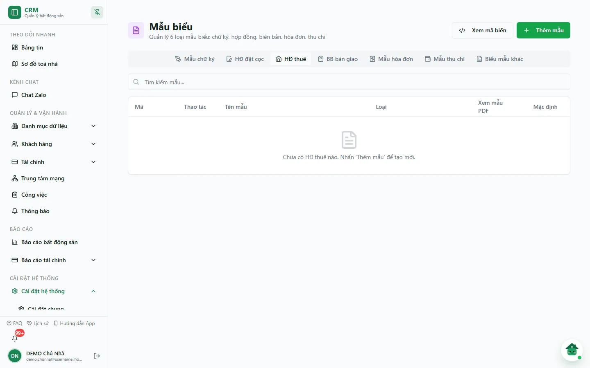
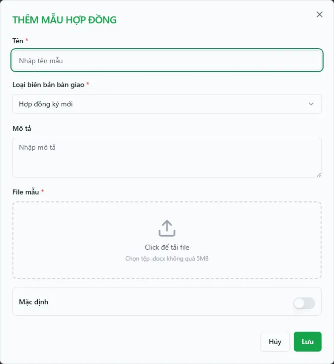
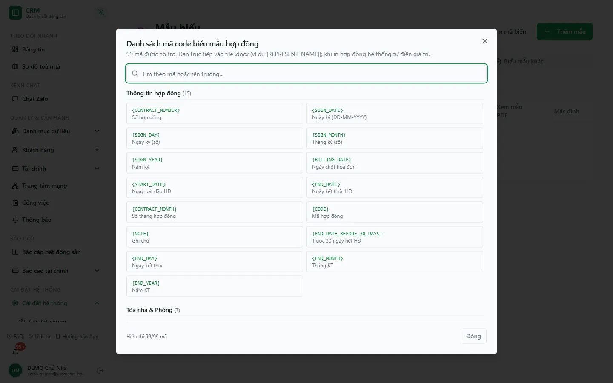

# Mẫu biểu (hợp đồng, hoá đơn, biên bản)

Trang **Mẫu biểu** là nơi bạn lưu các mẫu in dùng chung: hợp đồng thuê, biên bản bàn giao, mẫu hoá đơn, mẫu thu chi và các biên bản khác. Mỗi mẫu là một file Word (`.docx`) bạn tự thiết kế, chèn các **mã biến** (ví dụ `{CONTRACT_NUMBER}` là số hợp đồng). Khi in, hệ thống điền dữ liệu thật vào mã biến và tạo file để bạn tải về. Mẫu ở đây được dùng khi in hợp đồng từ màn **Hợp đồng**, in hoá đơn từ màn **Hoá đơn**, và có thể gắn sẵn cho từng toà nhà hoặc phòng.

::: info Điều kiện tiên quyết
- Quyền **Biểu mẫu / Chữ ký** (module `templates`): `view` để mở trang; `create`/`edit`/`delete` để thêm, sửa, xoá mẫu.
- Lối vào: **Cài đặt hệ thống** => **Mẫu biểu** (đường dẫn `/settings/templates`).
- Một file Word `.docx` không quá 5MB đã chèn sẵn mã biến.
:::

## Hướng dẫn từng bước

**Bước 1**: Vào **Cài đặt hệ thống** => **Mẫu biểu**. Đầu trang có tiêu đề **Mẫu biểu**, hai nút **Xem mã biến** và **Thêm mẫu**.

**Bước 2**: Chọn tab loại mẫu. Trang có 7 tab: **Mẫu chữ ký**, **HĐ đặt cọc**, **HĐ thuê**, **BB bàn giao**, **Mẫu hóa đơn**, **Mẫu thu chi**, **Biểu mẫu khác** (mở sẵn tab **Mẫu chữ ký**). Mỗi tab có ô **Tìm kiếm mẫu...** (lọc theo tên hoặc mã) và bảng các cột **Mã**, **Thao tác**, **Tên mẫu**, **Loại**, **Xem mẫu PDF**, **Mặc định**. Tab chưa có mẫu sẽ ghi *"Chưa có … nào. Nhấn 'Thêm mẫu' để tạo mới."* — tab **HĐ thuê** của DEMO hiện đang như vậy.

**Bước 3**: Bấm **Thêm mẫu**. Hộp **THÊM MẪU HỢP ĐỒNG** mở ra, khai báo:
- **Tên** (bắt buộc).
- **Loại biên bản bàn giao** (bắt buộc) — thực chất là loại mẫu, quyết định mẫu nằm ở tab nào (xem bảng dưới).
- **Mô tả** (tuỳ chọn).
- **File mẫu** (bắt buộc): bấm vùng *Click để tải file* và chọn **tệp `.docx` không quá 5MB**.
- Công tắc **Mặc định** nếu muốn đây là mẫu được chọn sẵn khi in.

Bấm **Lưu**. Hệ thống tự sinh **mã mẫu** dạng `MHD000001` và tải file lên kho lưu trữ.

| Giá trị ô **Loại biên bản bàn giao** | Mẫu hiện ở tab |
| --- | --- |
| Hợp đồng ký mới | **HĐ thuê** |
| Biên bản thanh lý hợp đồng / Biên bản gia hạn hợp đồng / Biên bản chuyển nhượng hợp đồng | **Biểu mẫu khác** |
| Hóa đơn | **Mẫu hóa đơn** |
| Biên lai | **Mẫu thu chi** |
| Biên bản bàn giao tài sản | **BB bàn giao** |

::: warning Tab Mẫu chữ ký và HĐ đặt cọc chưa nhận mẫu mới
Hộp **Thêm mẫu** không có lựa chọn nào đưa mẫu vào tab **Mẫu chữ ký** hoặc **HĐ đặt cọc**, nên hai tab này chỉ hiện mẫu đã có từ trước. Chữ ký/con dấu hãy chèn thẳng vào file `.docx` (xem [Chữ ký](/05-cai-dat/chu-ky/)).
:::

**Bước 4**: Đặt mẫu mặc định bằng công tắc ở cột **Mặc định** của dòng. Mỗi loại mẫu chỉ có **một mẫu mặc định**: bật mẫu này thì mẫu mặc định cũ cùng loại tự tắt.

**Bước 5**: Thao tác trên từng dòng:
- Cột **Thao tác**: **bút chì** để sửa tên, mô tả, loại hoặc thay file; **thùng rác** để xoá mẫu.
- Cột **Xem mẫu PDF**: **Xem** mở nhanh file mẫu, **Tải** tải file `.docx` gốc về máy.

**Bước 6**: Bấm **Xem mã biến** để mở hộp **Danh sách mã code biểu mẫu hợp đồng** — **99 mã** chia 9 nhóm: *Thông tin hợp đồng*, *Tòa nhà & Phòng*, *Giá thuê & Thanh toán*, *Tiền cọc & Khuyến mãi*, *Khách thuê*, *Chủ nhà*, *Thống kê & Dịch vụ*, *Thanh lý*, *Bảng dữ liệu*. Gõ vào ô **Tìm theo mã hoặc tên trường...** để lọc, bấm một mã để sao chép rồi dán vào file `.docx`. Cú pháp:
- `{TÊN_MÃ}` — điền một giá trị (ví dụ `{CONTRACT_NUMBER}`, `{SIGN_DATE}`).
- `{#TÊN}...{/TÊN}` — vùng lặp cho bảng nhiều dòng (danh sách khách thuê, phí dịch vụ…).

**Bước 7**: Dùng mẫu khi in — bạn không in trên trang này:
- **In hợp đồng thuê**: ở màn **Hợp đồng**, chọn hợp đồng rồi in. Hộp in liệt kê các mẫu tab **HĐ thuê**, chọn sẵn mẫu **Mặc định** (hoặc mẫu đầu tiên).
- **In hoá đơn**: ở màn **Hoá đơn**, hộp in dùng mẫu đã gắn cho hoá đơn; nếu chưa gắn thì chọn mẫu loại **Hóa đơn** đang mặc định (hoặc mẫu đầu tiên); chưa có mẫu nào thì in theo khổ A4 dựng sẵn.
- Form **Toà nhà** và **Phòng** có ô chọn sẵn mẫu hợp đồng/hoá đơn riêng.

## Các tính năng khác trên màn hình

| Tính năng | Mô tả |
| --- | --- |
| **7 tab loại mẫu** | Mẫu chữ ký, HĐ đặt cọc, HĐ thuê, BB bàn giao, Mẫu hóa đơn, Mẫu thu chi, Biểu mẫu khác. |
| Ô **Tìm kiếm mẫu...** | Lọc mẫu trong tab theo tên hoặc mã. |
| Công tắc **Mặc định** | Mẫu được chọn sẵn khi in; mỗi loại một mẫu. |
| **Xem mã biến** | Tra cứu và sao chép 99 mã biến. |
| **Xem** / **Tải** | Mở nhanh hoặc tải file mẫu gốc. |
| Dòng đếm cuối bảng | *1 - n trên tổng số n bản ghi*. |

## Tình huống & lỗi thường gặp

| Tình huống | Cách xử lý |
| --- | --- |
| Chọn file bị báo *"Chỉ chấp nhận file .docx"* hoặc *"File không được vượt quá 5MB"* | Lưu lại file dưới dạng Word `.docx` và giảm dung lượng (nén ảnh trong file). PDF và `.doc` cũ không được nhận. |
| In hợp đồng ra có ô để trống | Mã biến gõ sai (thiếu ngoặc nhọn, sai chữ) hoặc hợp đồng không có dữ liệu đó. Mở **Xem mã biến**, sao chép đúng mã rồi dán lại. |
| In ra không đúng mẫu mong muốn | Kiểm tra mẫu nào đang **Mặc định** ở loại đó, và mẫu gắn riêng cho toà/phòng/hoá đơn. |
| Vừa thêm mẫu nhưng không thấy trong tab đang mở | Mẫu nằm ở tab theo **Loại biên bản bàn giao** đã chọn (xem bảng ở Bước 3). |
| Mở trang bị đưa về **Bảng tin** | Thiếu quyền **Biểu mẫu / Chữ ký** (xem). Nhờ chủ nhà cấp ở [Phân quyền](/05-cai-dat/phan-quyen/). |

::: warning Cẩn thận khi đổi hoặc xoá mẫu mặc định
Đổi mẫu **Mặc định** hoặc xoá mẫu đang dùng ảnh hưởng ngay tới các lần in sau. Trước khi xoá, hãy đặt mẫu thay thế làm mặc định cho loại đó.
:::

## Thử trực tiếp trên sandbox

<SandboxTry account="demo.chunha" app-path="/settings/templates" app-label="Mở trang Mẫu biểu" fixtures="Snapshot 07/10/2026: tab HĐ thuê của DEMO chưa có mẫu" view-only>

**Bài tập chỉ xem**

1. Bấm lần lượt 7 tab và xem mỗi tab đang có mẫu nào (tab **HĐ thuê** của DEMO đang trống).
2. Bấm **Thêm mẫu**, mở ô **Loại biên bản bàn giao** để xem 7 lựa chọn, rồi **Hủy** — không bấm **Lưu**.
3. Bấm **Xem mã biến**, gõ `DATE` vào ô tìm để lọc các mã ngày, rồi **Đóng**.

**Kết quả mong đợi**

- Bạn biết mẫu thêm mới rơi vào tab nào và cách tra mã biến.
- Không có mẫu DEMO nào bị tạo, sửa hoặc xoá.

</SandboxTry>

## Quy trình liên quan

- [Hợp đồng](/03-quan-ly-van-hanh/hop-dong/) — in hợp đồng thuê từ mẫu.
- [Hoá đơn](/03-quan-ly-van-hanh/hoa-don/) — in hoá đơn từ mẫu.
- [Toà nhà](/03-quan-ly-van-hanh/toa-nha/) — gắn mẫu hợp đồng/hoá đơn mặc định cho từng toà.
- [Chữ ký](/05-cai-dat/chu-ky/) — trang mẫu chữ ký (chưa kết nối dữ liệu).
- [Danh mục khác](/05-cai-dat/danh-muc-khac/) — trang tổng hợp danh mục.
