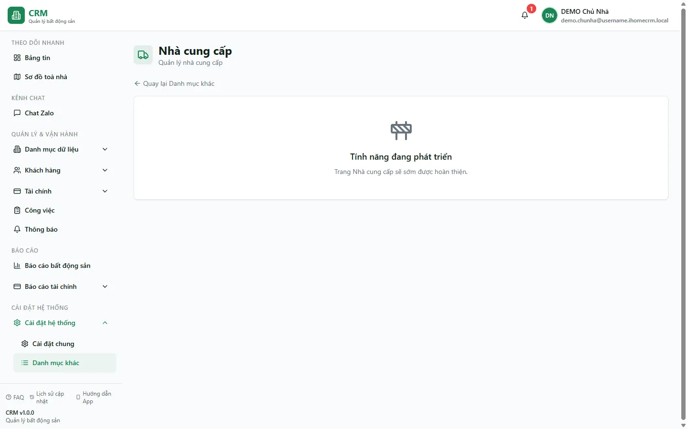

# Nhà cung cấp

Nhà cung cấp là **danh mục lưu thông tin liên hệ** của những đơn vị bán vật tư (bóng đèn, vòi nước, sơn...) và tài sản (máy lạnh, tủ lạnh, giường...) cho bạn: **tên, số điện thoại, email, địa chỉ**. Danh mục này **dùng chung** cho cả hai nơi trong phần mềm — khi bạn **lập phiếu nhập kho** ở [Kho vật tư] và khi bạn **khai một tài sản mới** — để bạn chọn đúng nguồn nhập, tiện gọi lại đặt hàng và đối chiếu sau này.

Trang này nằm ở **Cài đặt hệ thống** => **Danh mục khác** => **Nhà cung cấp**. Ở thời điểm hiện tại, màn hình quản lý danh mục nhà cung cấp **đang được hoàn thiện** (hiện thông báo *"Tính năng đang phát triển"*): bạn **chưa thêm/sửa nhà cung cấp trực tiếp tại đây**. Khi tổ chức đã được khởi tạo danh mục, các ô *Nhà cung cấp* trong phiếu nhập kho và form tài sản sẽ đọc từ nguồn đó.

::: info Điều kiện tiên quyết
- Quyền xem **Nhà cung cấp** (`suppliers.view`) — thường là chủ nhà hoặc quản lý toà.
- Danh mục nhà cung cấp dùng chung giữa **Kho vật tư** và **Tài sản**: mọi thay đổi (khi tính năng quản lý hoàn thiện) sẽ ảnh hưởng cả hai nơi.
- Snapshot DEMO ngày 13/08/2026 chưa có vật tư, phiếu nhập hoặc tài sản; không dùng dữ liệu khởi tạo cũ để suy ra danh sách nhà cung cấp hiện tại.
:::

## Hướng dẫn từng bước

**Bước 1**: Vào **Cài đặt hệ thống** => **Danh mục khác** => chọn thẻ **Nhà cung cấp**. Màn hình mở ra với tiêu đề **Nhà cung cấp** ("Quản lý nhà cung cấp") và một liên kết **Quay lại Danh mục khác** ở phía trên.

**Bước 2**: Đọc trạng thái hiện tại. Vùng nội dung hiển thị thông báo **"Tính năng đang phát triển"** kèm dòng *"Trang Nhà cung cấp sẽ sớm được hoàn thiện."* Điều này nghĩa là: màn hình **thêm / sửa / xoá** nhà cung cấp **chưa mở** tại đây. Các nhà cung cấp hiện có trong hệ thống được đưa vào từ **dữ liệu khởi tạo**, và bạn vẫn dùng chúng bình thường ở những nơi khác (xem Bước 3).

**Bước 3**: Xem nhà cung cấp *đang được dùng ở đâu*. Mở **Kho vật tư** => thẻ **Phiếu nhập** => **Tạo phiếu nhập**. Trong form phiếu nhập có ô **Nhà cung cấp** — đây là nơi bạn **chọn** một nhà cung cấp từ danh mục để ghi *nguồn nhập* cho lô vật tư. Nhà cung cấp được chọn sẽ hiển thị trên dòng phiếu nhập và giúp bạn biết đã mua hàng từ đâu. Tương tự, khi khai một **tài sản** mới, form tài sản cũng có ô **Nhà cung cấp** chọn từ cùng danh mục này.

**Bước 4**: Nếu cần thêm một nhà cung cấp mới, liên hệ quản trị viên phụ trách dữ liệu. Không khẳng định form hay trường tương lai cho tới khi trang runtime được triển khai.

::: tip Một danh mục dùng chung cho cả Kho vật tư và Tài sản
Nhà cung cấp **không tách riêng** theo từng nghiệp vụ — chỉ có **một danh sách duy nhất** dùng chung. Cùng một đơn vị (ví dụ "Cửa hàng điện nước DEMO A") có thể vừa xuất hiện trong ô chọn của phiếu nhập kho, vừa trong form khai tài sản. Vì vậy khi tính năng sửa/xoá được mở, hãy nhớ: chỉnh sửa một nhà cung cấp sẽ ảnh hưởng **mọi phiếu nhập và mọi tài sản** đang trỏ tới đơn vị đó.
:::

## Các tính năng khác trên màn hình

| Thành phần | Công dụng |
| --- | --- |
| Thông báo **"Tính năng đang phát triển"** | Cho biết màn hình quản lý danh mục nhà cung cấp đang được hoàn thiện; chưa có thao tác thêm/sửa/xoá tại đây. |
| **Quay lại Danh mục khác** | Liên kết trở về trang **Danh mục khác** để chọn danh mục cấu hình khác. |
| Ô **Nhà cung cấp** trong **Phiếu nhập** (Kho vật tư) | Nơi *chọn* nhà cung cấp cho lô nhập — điểm dùng thực tế của danh mục này hiện nay. |
| Ô **Nhà cung cấp** trong form **Tài sản** | Chọn nhà cung cấp cho một tài sản mới, từ cùng danh mục dùng chung. |

## Tình huống & lỗi thường gặp

| Tình huống | Cách xử lý |
| --- | --- |
| Không thấy nút **Thêm nhà cung cấp** trên trang này | Đúng như hiện trạng — trang đang được hoàn thiện. Việc thêm mới hiện thực hiện ở khâu khởi tạo dữ liệu; nhờ chủ nhà / quản trị bổ sung. Bạn vẫn **chọn** được các nhà cung cấp có sẵn ở phiếu nhập / form tài sản. |
| Ô **Nhà cung cấp** trong phiếu nhập trống, không có lựa chọn nào | Hệ thống chưa có nhà cung cấp nào trong danh mục. Cần khởi tạo dữ liệu nhà cung cấp trước; phiếu nhập vẫn lập được nhưng để trống nguồn nhập. |
| Xoá / bỏ một nhà cung cấp có làm mất phiếu nhập cũ không? | Không. Trên phiếu nhập, tham chiếu tới nhà cung cấp được **gỡ về trống** (hiển thị "—") chứ phiếu nhập và số liệu tồn kho **giữ nguyên**. |
| Nhà cung cấp đã bỏ vẫn hiện trong form **Tài sản** | Đây là điểm lệch đã biết giữa hai nơi: form phiếu nhập kho lọc bỏ nhà cung cấp đã xoá mềm, còn form tài sản thì chưa lọc nên vẫn liệt kê. Chọn đúng đơn vị còn hiệu lực khi khai tài sản. |
| Mua vật tư từ nhà cung cấp thì có tự trừ tiền quỹ không? | Không. Phiếu nhập kho **chỉ cập nhật tồn và giá vốn**, không tự sinh phiếu chi. Muốn ghi nhận khoản tiền đã trả cho nhà cung cấp vào sổ quỹ / báo cáo, hãy lập **phiếu chi** thủ công ở [Thu chi](/03-quan-ly-van-hanh/thu-chi/). |

## Thử trực tiếp trên sandbox

<SandboxTry account="demo.kythuat" app-path="/settings/categories/suppliers" app-label="Mở trang Nhà cung cấp" view-only>

1. Vào **Cài đặt hệ thống** => **Danh mục khác** => **Nhà cung cấp**. Quan sát màn hình: hiện thông báo **"Tính năng đang phát triển"** — đây là trạng thái hiện tại của trang quản lý danh mục.
2. Hiểu ý nghĩa: bạn **chưa thêm/sửa** nhà cung cấp trực tiếp tại đây; danh mục chỉ xuất hiện ở nơi khác sau khi được quản trị khởi tạo.
3. Bấm **Quay lại Danh mục khác**. Không mở form nhập kho trong snapshot rỗng; chỉ ghi nhớ ô **Nhà cung cấp** là nơi danh mục này được dùng khi có phiếu thật.

Kết quả mong đợi: bạn nắm được **nhà cung cấp là gì, dùng chung ở đâu** (phiếu nhập kho và tài sản), và biết rằng màn hình quản lý danh mục đang được hoàn thiện — hiện thời nhà cung cấp được chọn từ danh sách có sẵn chứ chưa thêm/sửa tại trang này.

</SandboxTry>

## Quy trình liên quan

- [Thu chi](/03-quan-ly-van-hanh/thu-chi/) — lập phiếu chi thủ công để ghi nhận tiền đã trả cho nhà cung cấp (phiếu nhập kho không tự sinh phiếu chi).
