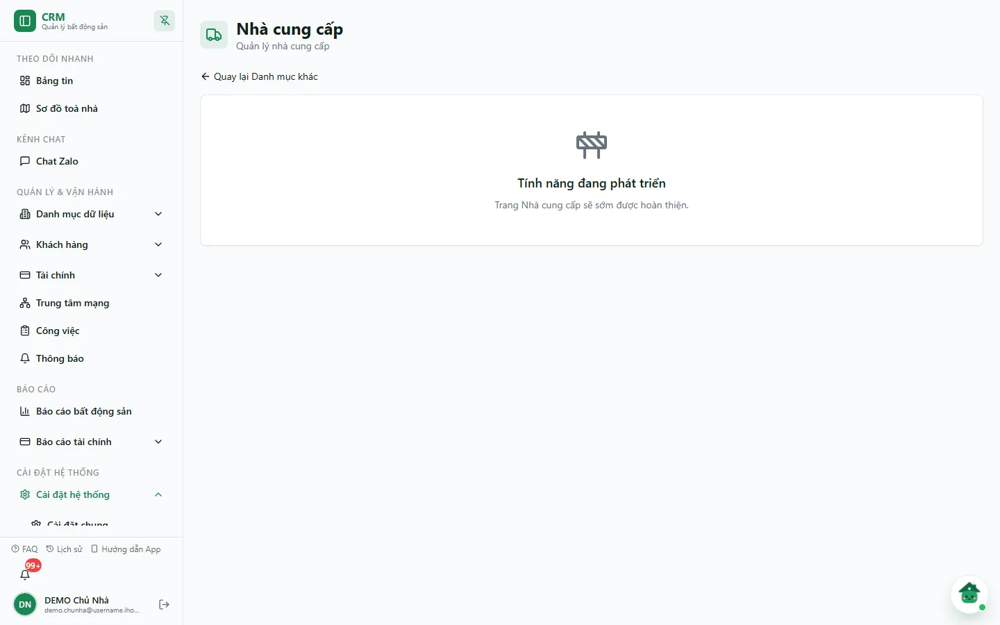
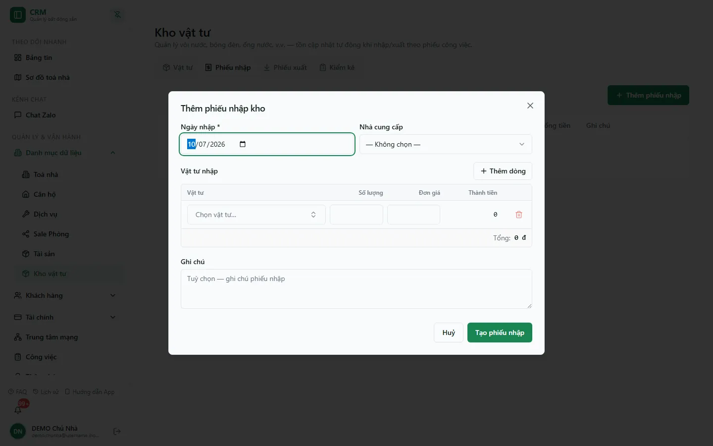

# Nhà cung cấp

Nhà cung cấp là danh mục những đơn vị bán **vật tư** (bóng đèn, vòi nước, sơn…) và **tài sản** (máy lạnh, tủ lạnh, giường…) cho bạn. Một danh sách duy nhất được **dùng chung** ở hai nơi: ô **Nhà cung cấp** trong phiếu nhập [Kho vật tư](/03-quan-ly-van-hanh/kho-vat-tu/) và trong form [Tài sản](/03-quan-ly-van-hanh/tai-san/), để ghi lại nguồn mua.

Màn **Nhà cung cấp** trong **Cài đặt hệ thống** => **Danh mục khác** hiện là **trang giữ chỗ** — chỉ hiện thông báo *"Tính năng đang phát triển"*, chưa thêm/sửa/xoá nhà cung cấp tại đây được.

::: info Điều kiện tiên quyết
- Quyền **Nhà cung cấp => Xem** (module `suppliers`, action `view`) để mở màn hình.
- Muốn chọn nhà cung cấp khi lập phiếu nhập cần quyền **Kho vật tư** (`materials`); khi khai tài sản cần quyền **Tài sản** (`assets`).
- Snapshot DEMO ngày 07/10/2026: ô **Nhà cung cấp** trong phiếu nhập chỉ có lựa chọn **— Không chọn —** (DEMO chưa có nhà cung cấp).
:::

## Hướng dẫn từng bước

**Bước 1**: Vào **Cài đặt hệ thống** => **Danh mục khác**, trong nhóm **Tài sản** chọn thẻ **Nhà cung cấp**. Màn hình có tiêu đề **Nhà cung cấp** ("Quản lý nhà cung cấp"), liên kết **Quay lại Danh mục khác** và khung *"Tính năng đang phát triển — Trang Nhà cung cấp sẽ sớm được hoàn thiện."*

**Bước 2**: Hiểu trạng thái hiện tại: chưa có nút thêm/sửa/xoá nhà cung cấp trên giao diện. Các nhà cung cấp đã có trong dữ liệu của công ty vẫn được chọn bình thường ở những nơi dùng (Bước 3).

**Bước 3**: Xem nơi nhà cung cấp được dùng. Mở **Danh mục dữ liệu** => **Kho vật tư** => thẻ **Phiếu nhập** => ấn **Thêm phiếu nhập**. Hộp thoại **Thêm phiếu nhập kho** có ô **Nhà cung cấp** (mặc định **— Không chọn —**) để ghi nguồn nhập của lô vật tư. Tương tự, hộp thoại **Tạo tài sản mới** ở màn **Tài sản** có ô **Nhà cung cấp** (hiện *"Chọn NCC"*) lấy từ cùng danh mục.

**Bước 4**: Nếu cần thêm nhà cung cấp mới, liên hệ quản trị viên phụ trách dữ liệu. Phiếu nhập vẫn lập được khi để **— Không chọn —**.

::: tip Một danh mục dùng chung
Cùng một nhà cung cấp có thể xuất hiện ở cả phiếu nhập kho vật tư và form tài sản. Khi tính năng quản lý được mở, chỉnh một nhà cung cấp sẽ ảnh hưởng mọi phiếu nhập và tài sản đang trỏ tới đơn vị đó.
:::

## Các tính năng khác trên màn hình

| Thành phần | Công dụng |
| --- | --- |
| Thông báo **"Tính năng đang phát triển"** | Cho biết trang quản lý nhà cung cấp chưa hoàn thiện; chưa có thao tác tại đây. |
| **Quay lại Danh mục khác** | Trở về trang **Danh mục khác**. |
| Ô **Nhà cung cấp** trong hộp thoại **Thêm phiếu nhập kho** | Chọn nguồn nhập cho lô vật tư; có lựa chọn **— Không chọn —**. |
| Ô **Nhà cung cấp** trong hộp thoại **Tạo tài sản mới** / **Chỉnh sửa tài sản** | Chọn nơi mua tài sản từ cùng danh mục. |

## Tình huống & lỗi thường gặp

| Tình huống | Cách xử lý |
| --- | --- |
| Không thấy nút thêm nhà cung cấp trên trang này | Đúng hiện trạng — trang đang giữ chỗ. Nhờ quản trị bổ sung dữ liệu. |
| Ô **Nhà cung cấp** trong phiếu nhập chỉ có **— Không chọn —** | Công ty chưa có nhà cung cấp nào. Phiếu nhập vẫn lập được với nguồn nhập để trống. |
| Phiếu nhập báo *"Chưa tải được nhà cung cấp. Tải lại trước khi lưu phiếu nhập."* | Ấn **Tải lại nhà cung cấp** trong hộp thoại rồi lưu lại. |
| Nhà cung cấp đã ngừng dùng vẫn hiện trong form **Tài sản** | Điểm lệch đã biết: phiếu nhập kho lọc bỏ nhà cung cấp đã xoá mềm, form tài sản thì chưa lọc. Chọn đúng đơn vị còn hiệu lực. |
| Nhập vật tư từ nhà cung cấp có tự trừ tiền quỹ không? | Không. Phiếu nhập kho chỉ cập nhật tồn và giá vốn, không tự sinh phiếu chi. Muốn ghi khoản đã trả, lập **phiếu chi** ở [Thu chi](/03-quan-ly-van-hanh/thu-chi/); tiền chỉ ra khỏi sổ quỹ khi phiếu ở trạng thái **Đã Chi** (đã ghi sổ). |

## Thử trực tiếp trên sandbox

<SandboxTry account="demo.chunha" app-path="/settings/categories/suppliers" app-label="Mở trang Nhà cung cấp" fixtures="Snapshot 07/10/2026: trang hiển thị Tính năng đang phát triển; ô Nhà cung cấp trong phiếu nhập chỉ có — Không chọn —." view-only>

**Bài tập chỉ xem**

1. Mở trang **Nhà cung cấp**, xác nhận thông báo **Tính năng đang phát triển**.
2. Sang **Kho vật tư** => **Phiếu nhập** => **Thêm phiếu nhập**, mở ô **Nhà cung cấp** để xem danh sách, rồi ấn **Huỷ** — không bấm **Tạo phiếu nhập**.

**Kết quả mong đợi**

- Giao diện khớp hướng dẫn.
- Không có phiếu nhập hay nhà cung cấp nào bị tạo trên DEMO.

</SandboxTry>

## Quy trình liên quan

- [Kho vật tư](/03-quan-ly-van-hanh/kho-vat-tu/) — lập phiếu nhập và chọn nhà cung cấp.
- [Tài sản](/03-quan-ly-van-hanh/tai-san/) — khai tài sản kèm nhà cung cấp.
- [Thu chi](/03-quan-ly-van-hanh/thu-chi/) — lập phiếu chi để ghi khoản đã trả cho nhà cung cấp.
