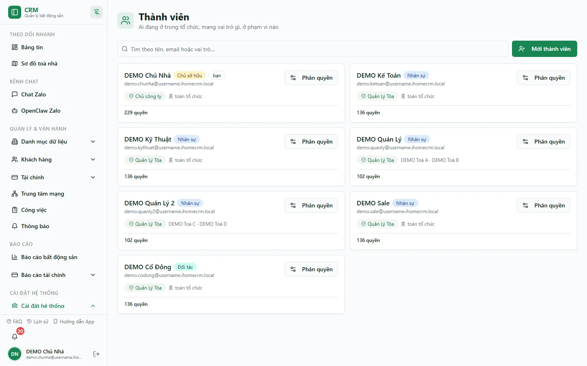

# Nhân viên & Đội ngũ

Màn hình **Phân quyền nhân viên** là nơi bạn quản lý toàn bộ đội của mình: thêm tài khoản cho từng người, quyết định họ **làm được gì** (mẫu quyền) và **thấy được toà nào** (phạm vi), gom họ thành **đội ngũ** để bàn giao tiền cho nhau, và tự tạo **mẫu phân quyền** riêng khi 4 mẫu có sẵn chưa đủ. Bạn dùng màn này mỗi khi tuyển người mới, đổi vai trò, chỉnh phạm vi, hoặc thu hồi quyền của người nghỉ việc. Ba tab **Nhân viên**, **Đội ngũ**, **Mẫu phân quyền** nằm gọn trên cùng một trang.

::: info Điều kiện tiên quyết
- Bạn đăng nhập bằng tài khoản **chủ nhà** hoặc tài khoản có quyền **Phân quyền nhân viên** (module `users` — hành động xem). Thao tác thêm/sửa/xoá nhân viên cần thêm các quyền tương ứng, và tab **Mẫu phân quyền** cần quyền quản lý mẫu.
- Đã tạo trước ít nhất một [khu vực & toà nhà](/01-bat-dau/tao-toa-nha/) — cần có toà thì mới gán được phạm vi cho nhân viên quản lý theo toà.
- Chuẩn bị sẵn **tên đăng nhập** và **mật khẩu** cho từng nhân viên (họ đăng nhập bằng tên đăng nhập, không phải email).
:::

## Hướng dẫn từng bước

**Bước 1**: Tại menu bên trái, mở **Cài đặt** => **Phân quyền nhân viên** (đường dẫn `/settings/staff`). Trang mở ra với 3 tab **Nhân viên**, **Đội ngũ**, **Mẫu phân quyền**. Tab **Nhân viên** liệt kê những người đang có, mỗi thẻ hiện mẫu quyền, badge phạm vi toà và trạng thái quyền.

**Bước 2**: Ở tab **Nhân viên**, ấn chọn **Thêm nhân viên**. Một bảng nhập trượt ra bên phải, gồm các phần điền lần lượt từ trên xuống: **Thông tin nhân viên**, **Cài đặt nhanh** (mẫu quyền), **Phạm vi toà** và **Tinh chỉnh từng quyền**.

**Bước 3**: Điền phần **Thông tin nhân viên**: **Tên đăng nhập**, **Mật khẩu** (tối thiểu 6 ký tự) và ô xác nhận, rồi **Họ tên**, **Số điện thoại**, **Email**, **Chức danh**. Nhân viên đăng nhập bằng đúng **tên đăng nhập** này; hệ thống tự sinh một email nội bộ để lưu, bạn không cần nhập email thật.

**Bước 4**: Ở phần **Cài đặt nhanh**, chọn **một mẫu phân quyền** làm điểm khởi đầu — **Super Admin** (toàn quyền), **Quản Lý Tòa** (vận hành đầy đủ 1 hoặc nhiều toà), **Partner** (cộng tác viên: xem bất động sản, quản khách hẹn/cọc), hoặc **Viewer** (chỉ xem). Khi chọn mẫu, toàn bộ quyền của mẫu được **sao chép** vào riêng nhân viên này; chỉnh sửa sau đó không đụng đến mẫu gốc hay người khác.

**Bước 5**: Ở phần **Phạm vi toà**, chọn nhân viên được thấy những toà nào theo một hoặc kết hợp các cách sau:

- **Tất cả toà nhà** — tích để nhân viên quản lý **mọi toà** hiện có và cả toà tạo sau này.
- **Theo khu vực (tự cập nhật)** — chọn một hoặc nhiều khu; nhân viên có quyền trên **mọi toà thuộc khu đó ngay tại thời điểm làm việc**. Thêm toà mới vào khu, toà đó **tự động** nằm trong phạm vi, không cần gán lại.
- **Toà lẻ bổ sung (cố định)** — tích từng toà cụ thể (ví dụ **Tòa DEMO A**, **Tòa DEMO B**). Phạm vi này cố định theo đúng toà đã tích.

Phạm vi toà **độc lập** với quyền: một nhân viên có quyền sửa hợp đồng vẫn chỉ sửa được hợp đồng ở các toà mình được giao.

::: tip Theo-toà hay mọi-toà
Chọn **theo khu vực** hoặc **toà lẻ** khi bạn muốn nhân viên chỉ nhìn thấy phần việc của họ (giao diện gọn, bảo mật dữ liệu toà khác). Chỉ mở **Tất cả toà nhà** cho kế toán tổng, quản lý cấp cao hoặc chính bạn.
:::

**Bước 6**: (Tuỳ chọn) Mở phần **Tinh chỉnh từng quyền** để bật/tắt quyền theo **từng trang** của hệ thống. Cột trái liệt kê các trang theo nhóm; chọn một trang, khung bên phải hiện từng chức năng kèm mô tả. Chức năng gắn nhãn **Nhạy cảm** là thao tác cần cân nhắc. Nếu mẫu đã đủ dùng, bỏ qua bước này.

**Bước 7**: Ấn **Lưu**. Hệ thống tạo tài khoản, gắn mẫu quyền và phạm vi vừa chọn; nhân viên mới xuất hiện thành một thẻ trong danh sách và có thể đăng nhập ngay.

**Bước 8**: Chuyển sang tab **Đội ngũ** để gom nhân viên thành đội. Ấn tạo đội, đặt **tên đội**, rồi thêm các thành viên. Người **cùng đội** sẽ **thấy tên nhau** (cần cho ô "Người nhận" khi bàn giao tiền mặt) và chỉ bàn giao tiền được cho người cùng đội — hoặc cho chủ nhà. Đội này **không** thấy đội kia.

**Bước 9**: Chuyển sang tab **Mẫu phân quyền** để xem 4 mẫu hệ thống. Bạn không sửa/xoá được mẫu hệ thống, nhưng có thể ấn **Tạo bản sao** để có một mẫu riêng rồi chỉnh theo ý mình; mẫu tự tạo có thể sửa/xoá (trừ khi đang có nhân viên dùng).

## Các tính năng khác trên màn hình

| Nút / Bộ lọc | Công dụng |
|---|---|
| **Sửa** / **Sửa quyền** (trên thẻ nhân viên) | Mở lại bảng nhập để đổi thông tin, mẫu quyền, phạm vi toà hoặc tinh chỉnh từng quyền của nhân viên đó |
| **Xoá** (trên thẻ nhân viên) | Xoá hẳn tài khoản nhân viên và dữ liệu do người đó tạo (dây chuyền) — xem cảnh báo bên dưới |
| Tab **Đội ngũ** | Gom nhân viên thành đội để họ **thấy tên nhau** và chỉ bàn giao tiền mặt cho người **cùng đội** (hoặc cho chủ nhà); đội này không thấy đội kia |
| Tab **Mẫu phân quyền** | Xem 4 mẫu hệ thống, **Tạo bản sao** để tự chỉnh, sửa/xoá mẫu tự tạo (không xoá được mẫu đang có người dùng) |
| Badge phạm vi trên thẻ ("Tất cả toà" / "N toà" / tên khu) | Cho biết nhanh nhân viên đang quản lý phạm vi nào |
| Badge trạng thái quyền ("Khớp mẫu" / "N thay đổi so với mẫu" / "Bypass toàn quyền") | Cho biết quyền hiện tại còn giống mẫu gốc hay đã được tinh chỉnh riêng |

::: warning Xoá nhân viên là thao tác khó hoàn tác
Nút **Xoá** xoá luôn tài khoản đăng nhập và dữ liệu người đó sở hữu (dây chuyền), không khôi phục được. Chỉ **chủ trực tiếp** đã gán nhân viên mới xoá được — nếu bạn là quản trị phụ, nút vẫn hiện nhưng thao tác sẽ bị từ chối. Nếu chỉ muốn ngừng cho đăng nhập tạm thời, cân nhắc tắt trạng thái hoạt động thay vì xoá.
:::

## Tình huống & lỗi thường gặp

| Tình huống | Cách xử lý |
|---|---|
| Báo **"Nhân viên đã được gán cho toà nhà này"** | Nhân viên đó đã có phạm vi ở toà bạn vừa chọn. Bỏ tích toà trùng, hoặc mở **Sửa** để chỉnh phạm vi thay vì thêm mới |
| Tạo lại báo **tên đăng nhập đã được sử dụng** | Lần tạo trước có thể lỗi giữa chừng, để lại tài khoản treo chiếm tên. Dùng **Xoá** để dọn tài khoản treo rồi tạo lại, hoặc chọn tên đăng nhập khác |
| Ấn **Xoá** nhưng bị từ chối | Bạn không phải chủ trực tiếp đã gán nhân viên này. Nhờ chủ nhà thực hiện |
| Thẻ vẫn hiện **"N thay đổi so với mẫu"** dù đã chỉnh quyền về đúng mẫu | Điểm cần lưu ý của hệ thống: chỉnh quyền về khớp mẫu rồi lưu có thể không xoá hết dấu vết tinh chỉnh cũ. Muốn nhân viên "sạch" theo mẫu, đổi sang mẫu khác rồi đổi lại, hoặc tạo lại theo mẫu |
| Nhân viên đăng nhập được nhưng **không thấy toà nào** | Phạm vi chưa được gán hoặc gán sai. Mở **Sửa** => **Phạm vi toà**, kiểm tra đã tích **Tất cả toà**, một **khu vực**, hoặc ít nhất một **toà lẻ** |
| Khi bàn giao tiền, nhân viên **không thấy tên đồng nghiệp** để chọn người nhận | Hai người chưa cùng đội. Vào tab **Đội ngũ**, tạo đội và thêm cả hai vào. Nộp tiền cho **chủ nhà** thì luôn được, không cần cùng đội |
| Không xoá được mẫu ở tab **Mẫu phân quyền** | Mẫu hệ thống không xoá được (chỉ **Tạo bản sao**); mẫu tự tạo đang có nhân viên dùng cũng bị chặn xoá. Đổi nhân viên sang mẫu khác trước rồi mới xoá |

## Thử trực tiếp trên sandbox

<SandboxTry account="demo.chunha" app-path="/settings/staff" app-label="Mở màn Phân quyền nhân viên" fixtures="6 nhân viên demo scoped 2 tòa" view-only>

**Quan sát trên sandbox**

1. Mở tab **Nhân viên** và nhìn danh sách 6 nhân viên demo — mỗi thẻ đều gắn **một mẫu quyền** kèm **badge phạm vi toà**.
2. Trên một nhân viên bất kỳ, ấn **Sửa quyền** và mở phần **Tinh chỉnh từng quyền**: xem **ma trận quyền** được liệt kê theo **từng trang** của hệ thống, mỗi chức năng có mô tả và nhãn mức độ.
3. Chuyển sang tab **Mẫu phân quyền** và xem 4 mẫu hệ thống **Super Admin / Quản Lý Tòa / Partner / Viewer**.

**Bạn sẽ nhận ra**

- Mỗi nhân viên = **1 mẫu quyền** (làm được gì) **+ phạm vi toà** (thấy toà nào), và hai chiều này độc lập nhau.
- Tài khoản `demo.chunha` chỉ thao tác trong phạm vi **2 toà DEMO**, nên khi xem/gán phạm vi bạn chỉ thấy **Tòa DEMO A** và **Tòa DEMO B**.

</SandboxTry>

## Quy trình liên quan

- [Bước 6: Thêm nhân viên & phân quyền](/01-bat-dau/them-nhan-vien/) — hướng dẫn tạo nhân viên đầu tiên khi mới khởi tạo hệ thống.
- [Bước 2: Tạo khu vực & toà nhà](/01-bat-dau/tao-toa-nha/) — cần có toà trước để gán phạm vi cho nhân viên.
- [Phân quyền](/05-cai-dat/phan-quyen/) — chi tiết bộ quyền theo từng trang khi tinh chỉnh.
- [Bàn giao & đối soát](/03-quan-ly-van-hanh/ban-giao-doi-soat/) — nơi việc lập đội ngũ phát huy tác dụng khi bàn giao tiền mặt.
