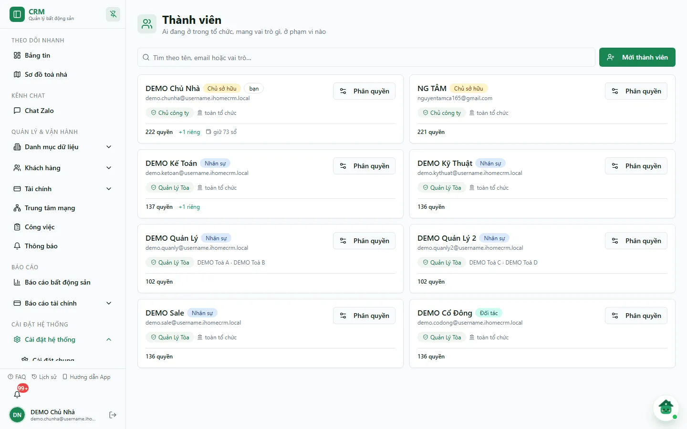
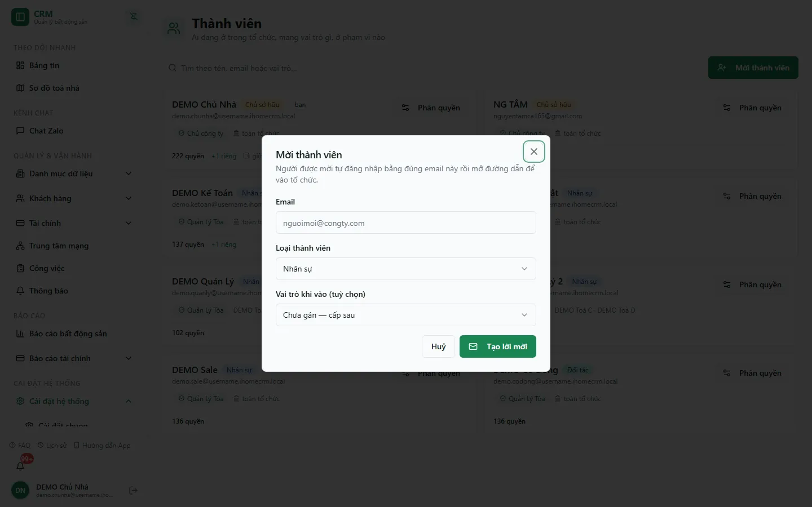
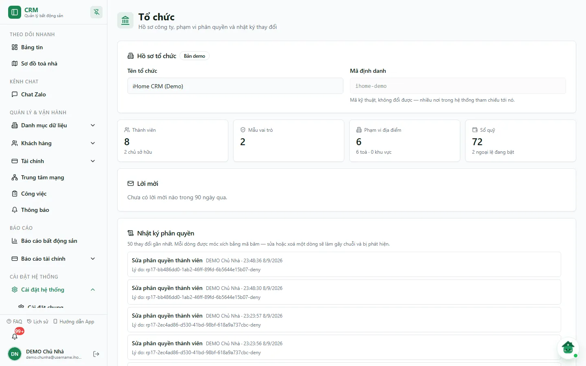

# Thành viên tổ chức

Ba màn trong menu **Cài đặt hệ thống** cùng lo chuyện "ai làm việc trong công ty, được làm gì, ở đâu":

- **Tổ chức** (`/settings/organization`): hồ sơ công ty, số liệu tổng quát, lời mời và nhật ký phân quyền.
- **Thành viên** (`/settings/members`): danh sách người trong tổ chức, mời người mới và mở hộp thoại **Phân quyền** của từng người.
- **Mẫu vai trò** (`/settings/roles`): các gói quyền dùng lại — xem chi tiết ở [Mẫu vai trò và phân quyền](/05-cai-dat/phan-quyen/).

Route cũ `/settings/staff` **chỉ chuyển hướng** đến `/settings/members`.

::: info Điều kiện tiên quyết
- `users.view` để mở cả ba màn (route và mục menu đều gác bằng quyền này).
- Đổi **Tên tổ chức** cần quyền sửa cài đặt chung; thiếu quyền thì ô tên bị khoá kèm dòng *"Cần quyền "Sửa cài đặt chung" để đổi tên."*.
- Mời, sửa phân quyền, thu hồi lời mời: máy chủ kiểm lại quyền quản trị thành viên của bạn ở từng thao tác.
- Bạn **không thể sửa phân quyền của chính mình**.
:::

## Hướng dẫn từng bước

**Bước 1**: Tại menu bên trái, mở **Cài đặt hệ thống** => **Thành viên**. Mỗi người là một thẻ gồm tên, nhãn loại thành viên (**Chủ sở hữu**, **Nhân sự**, **Đối tác**, **Cổ đông**, **Tài khoản dịch vụ**), nhãn **bạn** nếu là chính bạn, email, các vai trò kèm phạm vi (*toàn tổ chức* hoặc tên toà/sổ), và dòng cuối là **số quyền** đang có, số ngoại lệ (**+N riêng** / **−N bị cấm**) và số sổ quỹ đang giữ (**giữ N sổ**). Ô **Tìm theo tên, email hoặc vai trò…** lọc nhanh danh sách.

Snapshot DEMO ngày 07/10/2026: 8 thành viên, 2 chủ sở hữu (vai trò **Chủ công ty**, *toàn tổ chức*); các tài khoản DEMO còn lại mang vai trò **Quản Lý Tòa** — người áp *toàn tổ chức* có 136 quyền, còn **DEMO Quản Lý** và **DEMO Quản Lý 2** chỉ áp ở hai toà mỗi người nên thẻ hiện 102 quyền. Cùng một vai trò nhưng phạm vi hẹp hơn có thể cho số quyền thấp hơn, vì có những quyền chỉ áp được ở phạm vi toàn tổ chức.

::: warning Thẻ ghi "chưa gán phạm vi — không có tác dụng"
Vai trò không kèm phạm vi nào thì không cấp được quyền gì. Mở **Phân quyền** của người đó và chọn ít nhất một phạm vi.
:::

**Bước 2**: Bấm **Mời thành viên** để mời người mới. Hộp thoại có:

- **Email**: email thật của người được mời (ví dụ `nguoimoi@congty.com`).
- **Loại thành viên**: **Nhân sự** (mặc định), **Đối tác**, **Cổ đông** hoặc **Chủ sở hữu**. Chọn **Chủ sở hữu** sẽ hiện cảnh báo *"Chủ sở hữu có toàn quyền, kể cả sửa phân quyền người khác."*
- **Vai trò khi vào (tuỳ chọn)**: mặc định **Chưa gán — cấp sau**; mỗi vai trò hiện kèm số quyền. Nếu chọn vai trò thì phải chọn tiếp **Áp vai trò ở đâu** (ít nhất một phạm vi).

**Bước 3**: Bấm **Tạo lời mời**. Hệ thống **không tự gửi email**: hộp thoại hiện đường dẫn mời kèm hạn dùng, và đường dẫn chỉ hiện **một lần duy nhất** — đóng hộp thoại là không xem lại được. Bấm nút sao chép rồi gửi đường dẫn cho người nhận, sau đó bấm **Xong**.

**Bước 4**: Người nhận đăng nhập bằng **đúng email đã được mời** rồi mở đường dẫn `/invite/:token` để vào tổ chức. Lời mời đang chờ hiện ở màn **Tổ chức** (bước 5).

**Bước 5**: Mở **Cài đặt hệ thống** => **Tổ chức** để xem tổng quan:

- **Hồ sơ tổ chức**: **Tên tổ chức** (sửa được nếu đủ quyền; sửa xong bấm nút dấu tích bên cạnh để lưu) và **Mã định danh** (mã kỹ thuật, không đổi được). Tổ chức demo có nhãn **Bản demo**.
- Bốn ô số: **Thành viên** (kèm số chủ sở hữu), **Mẫu vai trò**, **Phạm vi địa điểm** (số toà · số khu vực), **Sổ quỹ** (kèm số ngoại lệ đang bật).
- **Lời mời**: các lời mời trong 90 ngày qua với trạng thái *đang chờ*, *đã vào*, *đã thu hồi* hoặc *hết hạn*. Lời mời đang chờ có nút **Thu hồi**.
- **Nhật ký phân quyền**: 50 thay đổi gần nhất (sửa phân quyền thành viên, tạo/sửa vai trò, mời, chấp nhận/thu hồi lời mời, sửa thông tin tổ chức), mỗi dòng có người làm, thời điểm, lý do và số quyền được thêm/bị mất. Các dòng được móc xích bằng mã băm — sửa hoặc xoá một dòng sẽ làm gãy chuỗi và bị phát hiện.

## Vai trò, phạm vi và ngoại lệ

Mỗi thành viên có thể mang nhiều vai trò; mỗi vai trò gắn cho người đó phải kèm ít nhất một phạm vi:

| Phạm vi (nhãn trên màn) | Ý nghĩa |
|---|---|
| **Toàn tổ chức** | Mọi toà nhà và sổ quỹ, gồm cả những cái tạo sau này; không kết hợp phạm vi khác trong cùng một vai trò |
| **Khu vực** | Một khu vực và dữ liệu thuộc khu vực đó |
| **Toà nhà** | Một toà nhà cụ thể |
| **Sổ quỹ** | Một sổ quỹ cụ thể |

Vai trò chỉ chứa gói quyền, **không chứa phạm vi**. Bấm **Phân quyền** trên thẻ thành viên để mở hộp thoại ba tab **Vai trò & phạm vi**, **Ngoại lệ**, **Quyền hiệu lực**; mọi lần lưu đều phải ghi **Lý do thay đổi** vào nhật ký. Cách dùng chi tiết ở [Mẫu vai trò và phân quyền](/05-cai-dat/phan-quyen/).

::: warning Sửa vai trò ảnh hưởng ngay nhiều người
Vai trò là gói quyền dùng chung, không phải bản sao chép vào từng thành viên. Sửa một vai trò ở **Mẫu vai trò** làm thay đổi quyền của **mọi thành viên đang mang vai trò đó ngay lập tức**. Chỉ muốn chỉnh một người thì dùng tab **Ngoại lệ**.
:::

## Thử trực tiếp trên sandbox

<SandboxTry account="demo.chunha" app-path="/settings/members" app-label="Mở màn Thành viên" fixtures="Snapshot 07/10/2026: 8 thành viên, 2 vai trò (Chủ công ty, Quản Lý Tòa)" view-only>

**Bài tập chỉ xem**

1. Đối chiếu các thẻ thành viên: loại thành viên, vai trò, phạm vi và số quyền.
2. Bấm **Mời thành viên** để xem các trường rồi bấm **Huỷ** — không bấm **Tạo lời mời**.
3. Mở **Cài đặt hệ thống** => **Tổ chức** để xem bốn ô số liệu và nhật ký phân quyền.

**Kết quả mong đợi**

- Giao diện khớp nội dung hướng dẫn.
- Không có lời mời hay thay đổi phân quyền nào được tạo.

</SandboxTry>

## Tình huống thường gặp

| Tình huống | Cách xử lý |
|---|---|
| Không bấm được **Tạo lời mời** sau khi chọn vai trò | Chọn ít nhất một phạm vi ở **Áp vai trò ở đâu** |
| Người nhận không vào được tổ chức | Đăng nhập đúng email được mời rồi mở lại link `/invite/:token`; nếu lời mời *hết hạn* hoặc *đã thu hồi*, tạo lời mời mới |
| Không nhận được email mời | Hệ thống không tự gửi; người mời phải sao chép và gửi đường dẫn thủ công |
| Lỡ đóng hộp thoại trước khi sao chép đường dẫn | Đường dẫn không xem lại được. Thu hồi lời mời đang chờ ở màn **Tổ chức** rồi mời lại |
| Có quyền nhưng không thao tác được ở một toà/sổ | Kiểm tra phạm vi của vai trò và ngoại lệ **Cấm** của người đó |
| Ô **Tên tổ chức** bị khoá | Cần quyền sửa cài đặt chung |
| Muốn sửa quyền của chính mình | Hộp thoại báo *"Không thể tự sửa quyền của chính mình."* — nhờ một chủ sở hữu khác thực hiện |

## Quy trình liên quan

- [Thêm nhân viên](/01-bat-dau/them-nhan-vien/)
- [Mẫu vai trò và phân quyền](/05-cai-dat/phan-quyen/)
- [Tạo khu vực và toà nhà](/01-bat-dau/tao-toa-nha/)
- [Quản trị người dùng (super admin)](/05-cai-dat/admin-users/)
