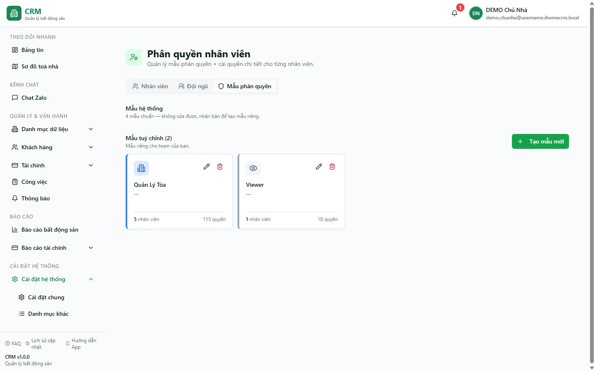
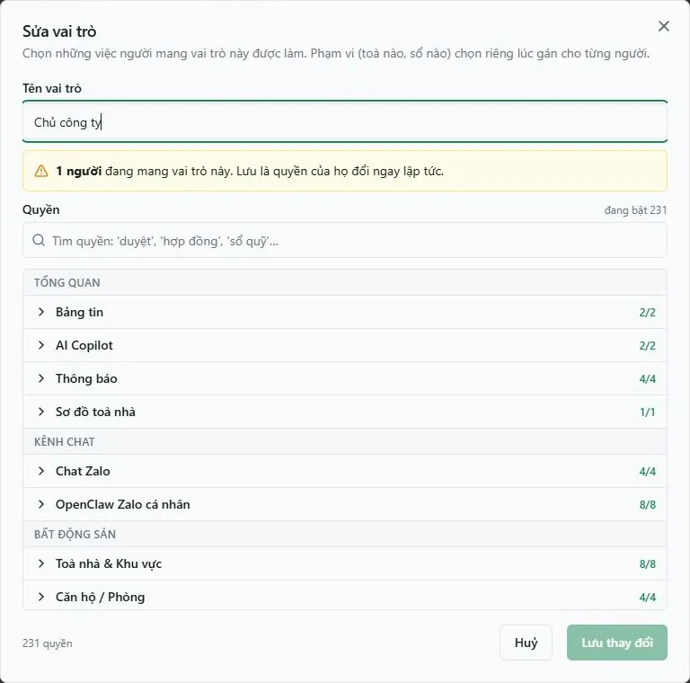
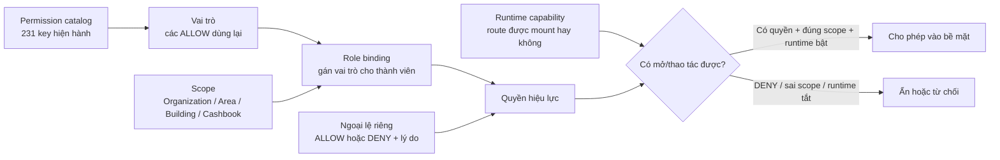
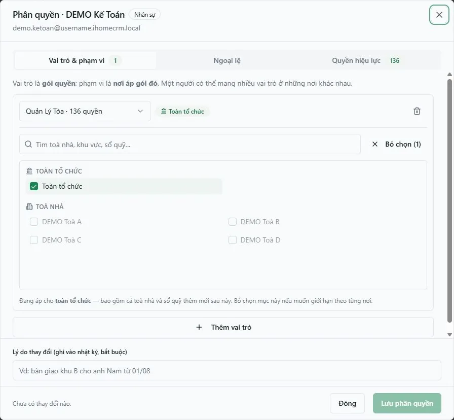

# Mẫu vai trò và phân quyền RBAC V3

`/settings/roles` hiển thị **Mẫu vai trò**: các gói quyền có thể dùng lại cho nhiều thành viên. `/settings/members` là nơi gán những vai trò đó cho từng người và chọn phạm vi áp dụng.

::: warning Vai trò là cấu hình sống
Sửa một vai trò làm thay đổi quyền của **tất cả thành viên đang mang vai trò đó ngay lập tức**. Nếu chỉ muốn điều chỉnh một người, dùng tab **Ngoại lệ** của thành viên thay vì sửa vai trò chung.
:::

## Mô hình quyền

- `organization_roles`: vai trò thuộc tổ chức.
- `role_permissions`: các quyền `ALLOW` của vai trò.
- `role_bindings`: gán vai trò cho thành viên.
- `role_binding_scopes`: phạm vi `ORGANIZATION`, `AREA`, `BUILDING` hoặc `CASHBOOK` của binding.
- `member_permission_overrides`: ngoại lệ `ALLOW`/`DENY` cho riêng thành viên.
- `permission_definitions`: danh mục quyền hợp lệ phía máy chủ.

Một vai trò **không chứa scope**. Mỗi role binding phải có ít nhất một scope; một thành viên có thể mang nhiều vai trò ở nhiều phạm vi. `ORGANIZATION` bao phủ cả tài nguyên tạo trong tương lai và là scope độc quyền trong binding đó. Khi quyền xung đột, `DENY` luôn thắng.

## Tạo hoặc sửa vai trò

1. Mở `/settings/roles`.
2. Bấm **Tạo vai trò**, đặt tên và chọn quyền theo từng trang/chức năng.
3. Dùng các mức hiển thị **Xem**, **Quản lý** và **Nhạy cảm** để đánh giá rủi ro; mức này chỉ hỗ trợ trình bày, quyền thật vẫn là từng key `module.action`.
4. Lưu vai trò, sau đó sang `/settings/members` để gán vai trò cùng scope.

Catalog hiện có **231 permission feature**. Ảnh production ngày 13/08/2026 cho thấy vai trò **Chủ công ty** mang đủ 231 quyền và sidebar đang hiển thị **OpenClaw Zalo**; vì vậy không còn đúng nếu mô tả deployment hiện tại là runtime-off hoặc khẳng định tám key OpenClaw luôn bị ẩn. Bộ chọn quyền phụ thuộc runtime của chính deployment đang phục vụ. Không dùng bốn mẫu legacy như nguồn thẩm quyền hiện hành.

## Sơ đồ tính quyền hiệu lực

## Quyền hiệu lực của thành viên

Trong hộp thoại thành viên:

1. **Vai trò & phạm vi** — quản lý role binding và scope.
2. **Ngoại lệ** — cấp hoặc cấm một quyền lẻ cho riêng người đó; mọi thay đổi cần lý do.
3. **Quyền hiệu lực** — đối chiếu kết quả cuối cùng trước và sau khi lưu.

Ảnh production xác nhận thành viên **DEMO Kế Toán** đang có một vai trò **Quản Lý Tòa — 136 quyền**, phạm vi **Toàn tổ chức**, và tab **Quyền hiệu lực** hiển thị 136. Tài khoản chủ DEMO có **229 quyền hiệu lực** nhưng không thể tự sửa authorization của chính mình; muốn xem đầy đủ hộp thoại chỉnh sửa, mở một thành viên khác.

Ví dụ: vai trò cho phép `cashbooks.view` ở một `CASHBOOK`, nhưng ngoại lệ `DENY cashbooks.view` cùng phạm vi sẽ chặn quyền đó. Ngược lại, một ngoại lệ `ALLOW` không thể vượt qua một `DENY` phù hợp.

## Quyền quản trị cần có

| Quyền | Công dụng |
|---|---|
| `users.view` | Mở trang thành viên/vai trò |
| `users.edit` | Sửa vai trò, phạm vi hoặc ngoại lệ của thành viên |
| `users.manage_templates` | Tạo, sửa và quản lý Mẫu vai trò |

Chỉ cấp các quyền quản trị này cho người chịu trách nhiệm phân quyền. Người dùng không thể tự sửa authorization của chính mình.

## Quy trình liên quan

- [Thành viên tổ chức](/05-cai-dat/nhan-vien-doi-ngu/)
- [Thêm nhân viên](/01-bat-dau/them-nhan-vien/)
- [Danh mục khác](/05-cai-dat/danh-muc-khac/)
