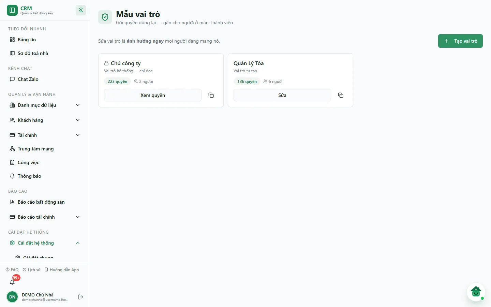
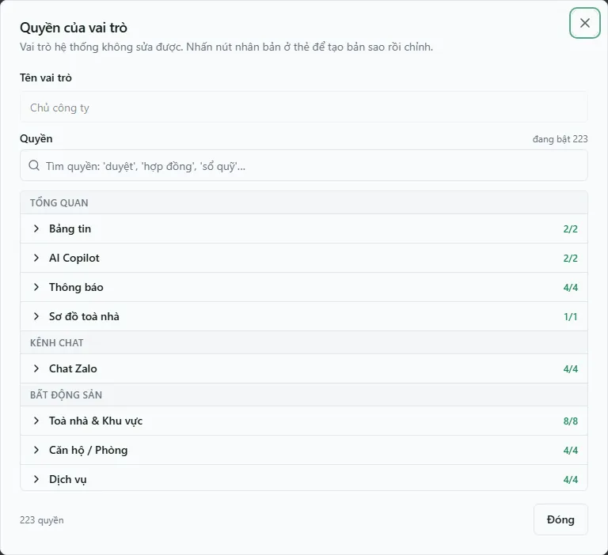
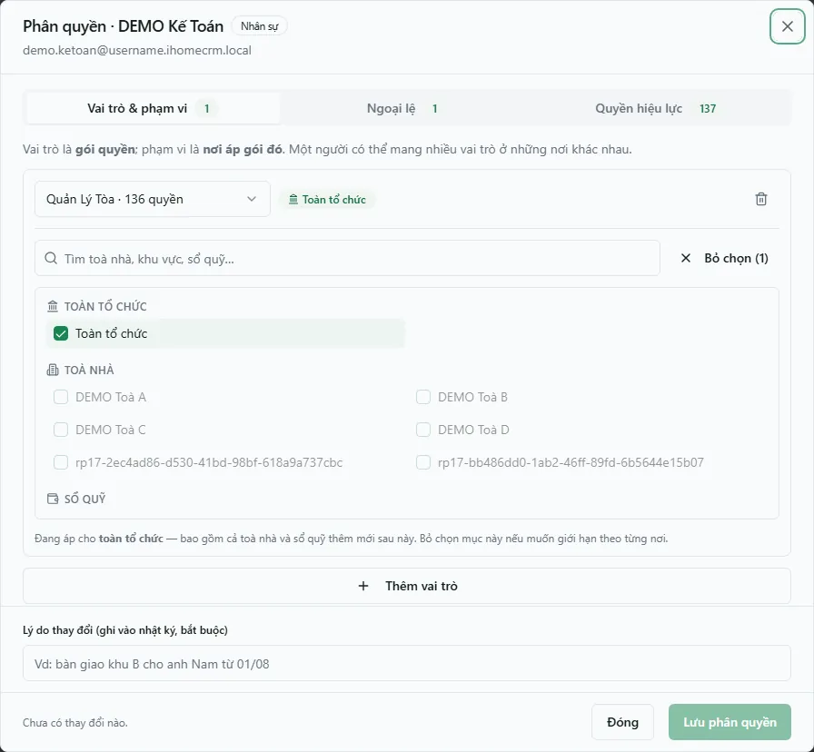
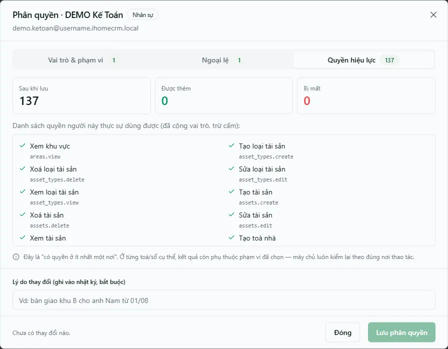
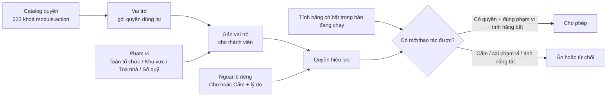

# Mẫu vai trò và phân quyền RBAC V3

**Mẫu vai trò** (`/settings/roles`) là các gói quyền dùng lại cho nhiều người. **Thành viên** (`/settings/members`) là nơi gán những vai trò đó cho từng người, chọn phạm vi áp dụng và thêm ngoại lệ riêng.

::: info Điều kiện tiên quyết
- `users.view` để mở hai màn (mục **Mẫu vai trò** và **Thành viên** trong **Cài đặt hệ thống**).
- `users.manage_templates` để tạo/sửa vai trò; `users.edit` để sửa vai trò, phạm vi, ngoại lệ của thành viên. Máy chủ kiểm lại ở mỗi lần lưu.
- Không ai tự sửa được phân quyền của chính mình.
:::

::: warning Vai trò là cấu hình sống
Sửa một vai trò làm thay đổi quyền của **tất cả thành viên đang mang vai trò đó ngay lập tức**. Nếu chỉ muốn điều chỉnh một người, dùng tab **Ngoại lệ** của thành viên thay vì sửa vai trò chung.
:::

## Hướng dẫn từng bước

**Bước 1**: Tại menu bên trái, mở **Cài đặt hệ thống** => **Mẫu vai trò**. Mỗi vai trò là một thẻ: tên, dòng **Vai trò hệ thống — chỉ đọc** (có biểu tượng khoá) hoặc **Vai trò tự tạo**, số **quyền**, số **cấm** (nếu có) và số **người** đang mang vai trò.

Snapshot DEMO ngày 07/10/2026: **Chủ công ty** (vai trò hệ thống) **223 quyền · 2 người**; **Quản Lý Tòa** (tự tạo) **136 quyền · 6 người**.

**Bước 2**: Xem hoặc tạo vai trò:

- Vai trò hệ thống: bấm **Xem quyền** để mở hộp thoại **Quyền của vai trò** (chỉ đọc). Muốn chỉnh, bấm nút nhân bản (biểu tượng hai trang giấy) trên thẻ để tạo **bản sao** rồi sửa bản sao.
- Vai trò tự tạo: bấm **Sửa**. Nếu đang có người mang vai trò, hộp thoại cảnh báo *"N người đang mang vai trò này. Lưu là quyền của họ đổi ngay lập tức."*
- Vai trò mới: bấm **Tạo vai trò**, đặt **Tên vai trò** (ví dụ *Kế toán khu B*).

Trong bộ chọn **Quyền**, quyền được nhóm theo **nhóm màn hình** (Tổng quan, Kênh chat, Bất động sản, Khách hàng, Tài chính…) rồi theo **từng trang**; mỗi trang hiện số quyền đang bật / tổng. Bấm vào trang để mở danh sách chức năng, dùng nhanh **Bật hết**, **Chỉ xem** hoặc **Tắt hết**, hoặc gõ vào ô **Tìm quyền: 'duyệt', 'hợp đồng', 'sổ quỹ'…**. Chức năng nhạy cảm (duyệt, thanh lý, chốt lợi nhuận, phân quyền…) có nhãn **Nhạy cảm**. Bấm **Tạo vai trò** hoặc **Lưu thay đổi** để lưu; **Huỷ**/**Đóng** để thoát.

::: info Catalog hiện có 223 khoá quyền
Đếm ngày 07/10/2026 từ catalog giao diện `src/lib/permissionPages.ts` tại commit đầu trang: **223 khoá `module.action`** khác nhau, chia vào **41 trang** thuộc **10 nhóm** (61 khoá mức xem, 130 khoá thao tác thường ngày, 33 khoá nhạy cảm). Con số này khớp registry quyền `src/lib/permissions.ts` (223) và catalog máy chủ `permission_definitions` — lần thay đổi gần nhất của catalog máy chủ là migration `20260830085316_xoa_toan_bo_openclaw.sql` (gỡ 8 khoá OpenClaw Zalo, 231 → 223). Trên production, vai trò **Chủ công ty** của DEMO hiện đúng **223 quyền**.

Quyền nào không có trong catalog máy chủ sẽ hiện mờ kèm dòng *"Quyền này chưa được khai báo trên máy chủ."* và không bật được.
:::

**Bước 3**: Gán vai trò cho người: mở **Thành viên**, bấm **Phân quyền** trên thẻ của người đó. Tab **Vai trò & phạm vi** liệt kê từng vai trò (ô chọn hiện *tên · số quyền*) cùng bộ chọn phạm vi **Toàn tổ chức / Toà nhà / Khu vực / Sổ quỹ** (có ô **Tìm toà nhà, khu vực, sổ quỹ…**). Bấm **Thêm vai trò** để gán thêm; biểu tượng thùng rác để gỡ.

**Bước 4**: (Khi cần) Thêm ngoại lệ ở tab **Ngoại lệ**: bấm **Thêm ngoại lệ**, tích quyền trong hộp **Chọn quyền cần thêm ngoại lệ** rồi bấm **Xong**. Mỗi ngoại lệ là **Cho** hoặc **Cấm** (đổi bằng nút **Đổi thành Cấm/Cho**), phải chọn **Áp ở đâu** (nút nhanh **Toà đang phụ trách** hoặc **Tất cả toà nhà**, hoặc chọn tay) và ghi **Lý do (bắt buộc)**. Ngoại lệ **Cho** trùng quyền vai trò đã có được gắn nhãn **thừa**.

**Bước 5**: Mở tab **Quyền hiệu lực** để đối chiếu trước khi lưu: ba ô **Sau khi lưu**, **Được thêm**, **Bị mất**, danh sách **Sẽ MẤT / Sẽ ĐƯỢC THÊM** (nếu có) và toàn bộ quyền người này thực sự dùng được (đã cộng vai trò, trừ cấm). Đây là "có quyền ở ít nhất một nơi" — ở từng toà/sổ, máy chủ còn kiểm theo đúng phạm vi.

**Bước 6**: Ghi **Lý do thay đổi (ghi vào nhật ký, bắt buộc)** rồi bấm **Lưu phân quyền**. Chân hộp thoại tóm tắt *"N quyền sau khi lưu · mất X · thêm Y"* hoặc báo lỗi đầu tiên cần sửa (thiếu phạm vi, thiếu lý do, vai trò trùng). Bấm **Đóng** để thoát không lưu.

Snapshot DEMO: **DEMO Kế Toán** mang một vai trò **Quản Lý Tòa** (136 quyền) ở **Toàn tổ chức** cộng một ngoại lệ, nên tab **Quyền hiệu lực** hiện **137**.

## Mô hình quyền

```mermaid
flowchart LR
    A["Catalog quyền<br/>223 khoá module.action"] --> B["Vai trò<br/>gói quyền dùng lại"]
    B --> C["Gán vai trò<br/>cho thành viên"]
    S["Phạm vi<br/>Toàn tổ chức / Khu vực / Toà nhà / Sổ quỹ"] --> C
    C --> E["Quyền hiệu lực"]
    O["Ngoại lệ riêng<br/>Cho hoặc Cấm + lý do"] --> E
    R["Tính năng có bật trong bản đang chạy"] --> G{"Có mở/thao tác được?"}
    E --> G
    G -->|"Có quyền + đúng phạm vi + tính năng bật"| Y["Cho phép"]
    G -->|"Cấm / sai phạm vi / tính năng tắt"| N["Ẩn hoặc từ chối"]
```

- Vai trò **không chứa phạm vi**; mỗi lần gán vai trò cho một người phải có ít nhất một phạm vi. **Toàn tổ chức** bao phủ cả toà nhà và sổ quỹ tạo sau này và không đi cùng phạm vi khác.
- Khi xung đột, **Cấm luôn thắng** — kể cả khi vai trò khác có cho. Ví dụ vai trò cho `cashbooks.view` ở một sổ quỹ, nhưng ngoại lệ **Cấm** `cashbooks.view` cùng phạm vi sẽ chặn quyền đó.
- Một số quyền (ví dụ ghi sổ quỹ) chỉ có tác dụng khi người đó đang **giữ sổ quỹ** tương ứng; cấp quyền không tự trao sổ.
- Không còn cơ chế suy diễn quyền: người dùng chỉ có đúng các khoá mà vai trò/ngoại lệ cho phép.

## Quyền quản trị cần có

| Quyền | Công dụng |
|---|---|
| `users.view` | Mở màn Tổ chức, Thành viên, Mẫu vai trò |
| `users.edit` | Sửa vai trò, phạm vi hoặc ngoại lệ của thành viên |
| `users.manage_templates` | Tạo, sửa và quản lý Mẫu vai trò |

Chỉ cấp các quyền quản trị này cho người chịu trách nhiệm phân quyền.

## Thử trực tiếp trên sandbox

<SandboxTry account="demo.chunha" app-path="/settings/roles" app-label="Mở màn Mẫu vai trò" fixtures="Snapshot 07/10/2026: Chủ công ty 223 quyền, Quản Lý Tòa 136 quyền" view-only>

**Bài tập chỉ xem**

1. Bấm **Xem quyền** trên thẻ **Chủ công ty**, mở vài trang trong bộ chọn để xem chức năng và nhãn **Nhạy cảm**, rồi bấm **Đóng**.
2. Sang **Thành viên**, bấm **Phân quyền** trên thẻ **DEMO Kế Toán**, xem ba tab rồi bấm **Đóng** — không bấm **Lưu phân quyền**.

**Kết quả mong đợi**

- Số quyền và tab khớp nội dung hướng dẫn.
- Không có vai trò hay phân quyền nào bị thay đổi.

</SandboxTry>

## Tình huống thường gặp

| Tình huống | Cách xử lý |
|---|---|
| Nút **Sửa** không có, chỉ có **Xem quyền** | Vai trò hệ thống chỉ đọc; nhân bản rồi sửa bản sao |
| Hộp thoại báo *"Vai trò không có quyền nào…"* | Vai trò đang trống; người mang nó sẽ không mở được màn hình nào |
| Không bấm được **Lưu phân quyền** | Chưa có thay đổi, hoặc thiếu phạm vi/lý do — đọc dòng lỗi ở chân hộp thoại |
| Báo lỗi lưu và nút **Tải bản mới và bỏ các thay đổi đang nhập** | Có người khác vừa sửa phân quyền; tải bản mới rồi làm lại |
| Mở **Phân quyền** của chính mình | Hộp thoại chỉ báo *"Không thể tự sửa quyền của chính mình."* |

## Quy trình liên quan

- [Thành viên tổ chức](/05-cai-dat/nhan-vien-doi-ngu/)
- [Thêm nhân viên](/01-bat-dau/them-nhan-vien/)
- [Danh mục khác](/05-cai-dat/danh-muc-khac/)
