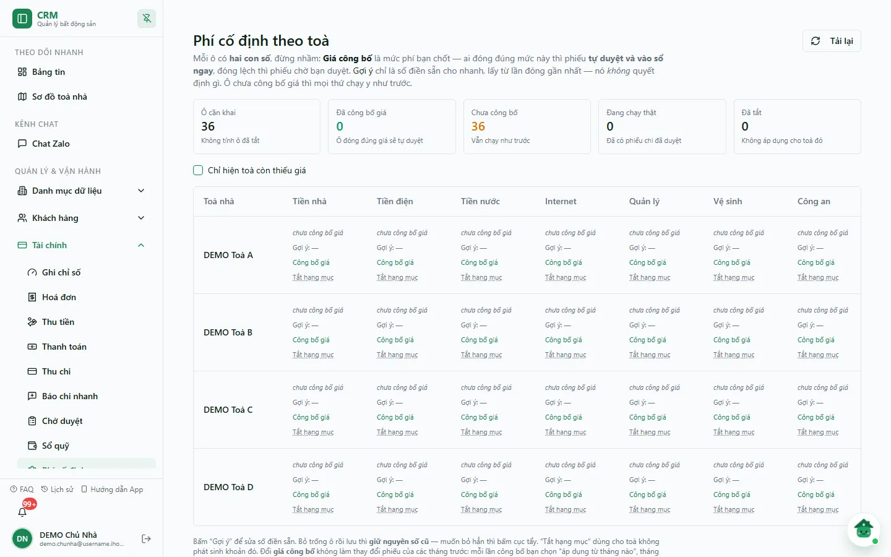
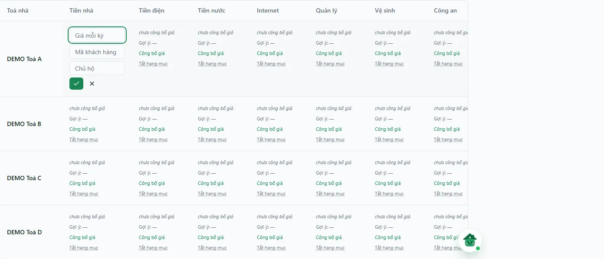
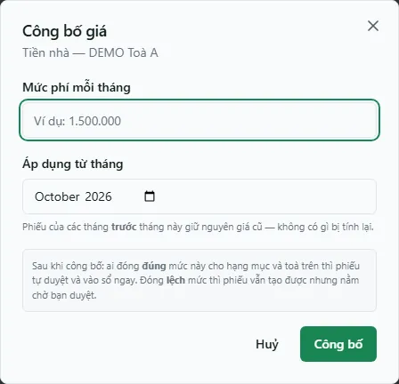

# Phí cố định theo toà

Màn **Phí cố định** là bảng cấu hình các khoản chi cố định mỗi kỳ của từng toà: tiền nhà trả chủ, điện, nước, internet, quản lý, vệ sinh, công an, rác, thang máy. Đây là nguồn số tiền điền sẵn khi đóng phí ở màn **Thanh toán** (`/thanh-toan`), và là nơi chủ **công bố giá** để hệ thống biết phiếu đóng phí nào được tự duyệt.

Mỗi ô trong bảng có **hai con số**, đừng nhầm:

- **Giá công bố** — mức phí chủ chốt. Ai đóng **đúng** mức này thì phiếu được duyệt và ghi sổ ngay; đóng **lệch** thì phiếu vẫn tạo được nhưng nằm chờ duyệt.
- **Gợi ý** — chỉ là số điền sẵn cho nhanh (lấy từ lần đóng gần nhất hoặc do bạn sửa); nó **không quyết định** gì.

Ô chưa công bố giá thì mọi thứ chạy như trước (phiếu đóng phí vẫn được duyệt và ghi sổ như cũ).

::: info Điều kiện tiên quyết
- Quyền **Thu đủ / thu một phần · vào trang Thanh toán** (`thu_tien.collect`) — cùng quyền vào màn Thanh toán, để ai đóng được phí thì cấu hình được số gợi ý. Máy chủ vẫn kiểm từng toà bạn được giao khi lưu.
- **Công bố / đổi giá** chỉ dành cho **chủ tổ chức**. Người khác xem được giá công bố nhưng không đổi được.
- Đã có toà nhà ([Toà nhà](/03-quan-ly-van-hanh/toa-nha/)).
:::

## Hướng dẫn từng bước

**Bước 1**: Vào **Tài chính** => **Phí cố định**. Đầu màn có 5 ô số: **Ô cần khai** (không tính ô đã tắt), **Đã công bố giá** (ô đóng đúng giá sẽ tự duyệt), **Chưa công bố** (vẫn chạy như trước), **Đang chạy thật** (đã có phiếu chi đã duyệt), **Đã tắt** (không áp dụng cho toà đó). Bên dưới là bảng mỗi toà một dòng, các cột **Tiền nhà**, **Tiền điện**, **Tiền nước**, **Internet**, **Quản lý**, **Vệ sinh**, **Công an**, **Rác**, **Thang máy**.

Mỗi ô hiển thị: giá công bố (dấu tích xanh kèm **từ MM/YYYY**) hoặc dòng *chưa công bố giá*; dòng **Gợi ý: …**; liên kết **Công bố giá** / **Đổi giá** (chỉ chủ tổ chức thấy); mã khách hàng nhà cung cấp nếu có; số phiếu đã chi kèm ngày gần nhất; và liên kết **Tắt hạng mục** / **Bật lại**.

**Bước 2**: Sửa số gợi ý — bấm dòng **Gợi ý: …** của ô cần sửa. Ô chuyển thành ba ô nhập: **Giá mỗi kỳ**, **Mã khách hàng**, **Chủ hộ**. Bấm nút tích (hoặc Enter) để lưu, nút **X** (hoặc Escape) để huỷ. Bỏ trống ô giá rồi lưu thì **giữ nguyên số cũ**; muốn bỏ hẳn số gợi ý thì bấm biểu tượng cục tẩy (**Xoá giá mặc định**).

**Bước 3**: Công bố giá (chủ tổ chức) — bấm **Công bố giá** (hoặc **Đổi giá** nếu ô đã có giá). Hộp **Công bố giá** / **Đổi giá công bố** hiện tên hạng mục và toà. Nhập **Mức phí mỗi tháng** (số nguyên theo đồng, lớn hơn 0) và chọn **Áp dụng từ tháng**, rồi bấm **Công bố**. Phiếu của các tháng **trước** tháng này giữ nguyên giá cũ — không có gì bị tính lại.

::: warning Giá công bố quyết định phiếu nào được tự duyệt
Sau khi công bố, phiếu đóng phí ở **Thanh toán** đúng mức giá cho đúng hạng mục, toà và các tháng của kỳ sẽ được duyệt và ghi sổ ngay (thành **Đã Chi**); đóng lệch thì phiếu ở trạng thái **Chờ duyệt**, chưa có tiền nào ra khỏi sổ quỹ cho tới khi được duyệt và ghi sổ. Nếu hạng mục × toà × tháng đó đã được bật trong [Cam kết chi](/05-cai-dat/cam-ket-chi/), bộ máy chi theo cam kết sẽ quyết thay cho luật giá công bố.
:::

**Bước 4**: Toà không phát sinh một khoản nào đó (vd không có thang máy) thì bấm **Tắt hạng mục** ở ô đó; ô chuyển thành nhãn **Không áp dụng** và không còn tính vào **Ô cần khai**. Bấm **Bật lại** để mở lại.

## Thử trực tiếp trên sandbox

<SandboxTry account="demo.chunha" app-path="/settings/finance/fixed-fees" app-label="Mở màn Phí cố định" fixtures="DEMO 07/10/2026: 4 toà, 36 ô cần khai, chưa ô nào công bố giá hay có số gợi ý" view-only>

**Bài tập chỉ xem**

1. Đối chiếu 5 ô số đầu màn và 9 cột hạng mục.
2. Tích **Chỉ hiện toà còn thiếu giá** để xem bộ lọc, rồi bỏ tích.
3. Có thể bấm **Công bố giá** ở một ô để xem hộp thoại rồi bấm **Huỷ**. Không bấm **Công bố**, nút lưu gợi ý, **Tắt hạng mục** hay **Bật lại** (các thao tác này ghi ngay).

**Kết quả mong đợi**

- Giao diện khớp mô tả; không có giá, gợi ý hay trạng thái hạng mục nào của DEMO bị đổi.

</SandboxTry>

## Các tính năng khác trên màn hình

| Nút / Bộ lọc | Công dụng |
|---|---|
| **Tải lại** | Đọc lại cấu hình và giá công bố. |
| **Chỉ hiện toà còn thiếu giá** | Chỉ giữ các toà còn ô (chưa tắt) chưa có số gợi ý. |
| **Gợi ý: …** | Mở chế độ sửa số gợi ý, mã khách hàng, chủ hộ của ô. |
| Cục tẩy **Xoá giá mặc định** | Bỏ hẳn số gợi ý (chỉ hiện khi ô đang có gợi ý). |
| **Công bố giá** / **Đổi giá** | Công bố mức phí chính thức từ một tháng (chỉ chủ tổ chức). |
| **Tắt hạng mục** / **Bật lại** | Đánh dấu toà không phát sinh khoản đó / mở lại. |

## Tình huống & lỗi thường gặp

| Tình huống | Nguyên nhân & cách xử lý |
|---|---|
| Không thấy liên kết **Công bố giá**, có dòng "Bạn xem được giá công bố nhưng không đổi được" | Chỉ **chủ tổ chức** công bố giá. Nhờ chủ tổ chức thao tác. |
| Báo "Nhập số tiền nguyên theo đồng; không nhập số âm, chữ hoặc số lẻ." | Ô giá gợi ý chỉ nhận số nguyên dương theo đồng. |
| Báo "Nhập giá công bố nguyên theo đồng và lớn hơn 0" / "Chọn tháng bắt đầu áp dụng giá" | Hộp công bố bắt buộc có mức phí > 0 và tháng áp dụng. |
| Khung đỏ **Không đọc được cấu hình** | Dữ liệu cấu hình chưa tải đủ; bấm **Tải lại** trước khi sửa hoặc công bố giá. |
| Bảng ghi "Chưa có toà nào bạn được cấu hình." | Tài khoản chưa được giao toà nào trong phạm vi quyền. |
| Đóng phí đúng số mà phiếu vẫn chờ duyệt | Kiểm giá công bố có áp từ đúng tháng của kỳ không; nếu hạng mục đã bật trong **Cam kết chi**, xem lý do ở thẻ **Máy chấm thử** của màn đó. |

## Quy trình liên quan

- [Cam kết chi](/05-cai-dat/cam-ket-chi/) — bộ máy duyệt chi theo cam kết tháng.
- [Thu chi](/03-quan-ly-van-hanh/thu-chi/) — theo dõi phiếu chi đã sinh.
- [Chờ duyệt](/03-quan-ly-van-hanh/cho-duyet/) — duyệt phiếu đóng lệch giá.
- [Sổ quỹ](/03-quan-ly-van-hanh/so-quy/) — kiểm tiền đã ra khỏi quỹ.
