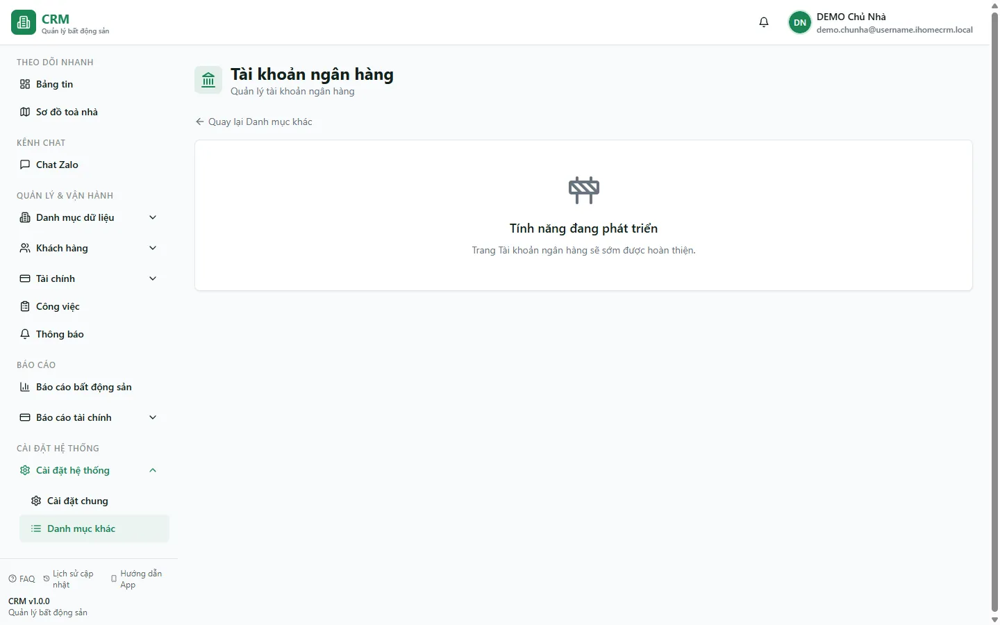

# Tài khoản ngân hàng và sổ quỹ

Route `/settings/categories/bank-accounts` hiện chỉ hiển thị trang **Tính năng đang phát triển**; chưa có form CRUD tài khoản ngân hàng tại đây. Màn runtime để quản lý tiền mặt, ngân hàng hoặc ví là **Sổ quỹ** tại route chính thức `/finance/cashbooks`.

::: info Route chính thức
Luôn dùng `/finance/cashbooks`. Các đường dẫn cũ `/setting/finance/cashbooks`, `/settings/finance/cashbooks` và `/cashbooks` chỉ chuyển hướng về route này.
:::

## Cách thao tác hiện tại

1. Mở **Tài chính → Sổ quỹ** hoặc truy cập `/finance/cashbooks`.
2. Dùng quyền `cashbooks.view` để xem danh sách và số dư sổ trong phạm vi được cấp.
3. Muốn tạo, sửa hoặc xoá sổ cần lần lượt `cashbooks.create`, `cashbooks.edit`, `cashbooks.delete`.
4. Các thao tác chia sẻ, bàn giao người giữ sổ, ghi sổ hoặc chốt kỳ còn có quyền riêng và điều kiện nghiệp vụ riêng.

Không dựa vào trang placeholder để kết luận hệ thống hiện hỗ trợ các trường tên ngân hàng, số tài khoản, chủ tài khoản, chi nhánh, số dư đầu kỳ hay sổ mặc định. Chỉ nhập dữ liệu mà form `/finance/cashbooks` thực tế cung cấp và kiểm tra quyền hiệu lực theo scope `CASHBOOK`.

::: warning Sổ quỹ là dữ liệu tiền
Tạo hoặc thay đổi sổ có thể ảnh hưởng nơi ghi nhận phiếu và phạm vi người dùng nhìn thấy dòng tiền. Rà lại quyền, người giữ sổ và scope trước khi lưu.
:::

## Tình huống thường gặp

| Tình huống | Cách xử lý |
|---|---|
| Trang tài khoản ngân hàng báo đang phát triển | Đây là trạng thái hiện hành; chuyển sang `/finance/cashbooks` |
| Mở đường dẫn Sổ quỹ cũ | Hệ thống chuyển hướng về `/finance/cashbooks` |
| Không thấy hoặc không sửa được một sổ | Kiểm tra quyền `cashbooks.*`, role binding và scope `CASHBOOK` |

## Quy trình liên quan

- [Sổ quỹ vận hành](/03-quan-ly-van-hanh/so-quy/)
- [Sổ quỹ và loại thu chi](/01-bat-dau/so-quy-loai-thu-chi/)
- [Thu chi](/03-quan-ly-van-hanh/thu-chi/)
