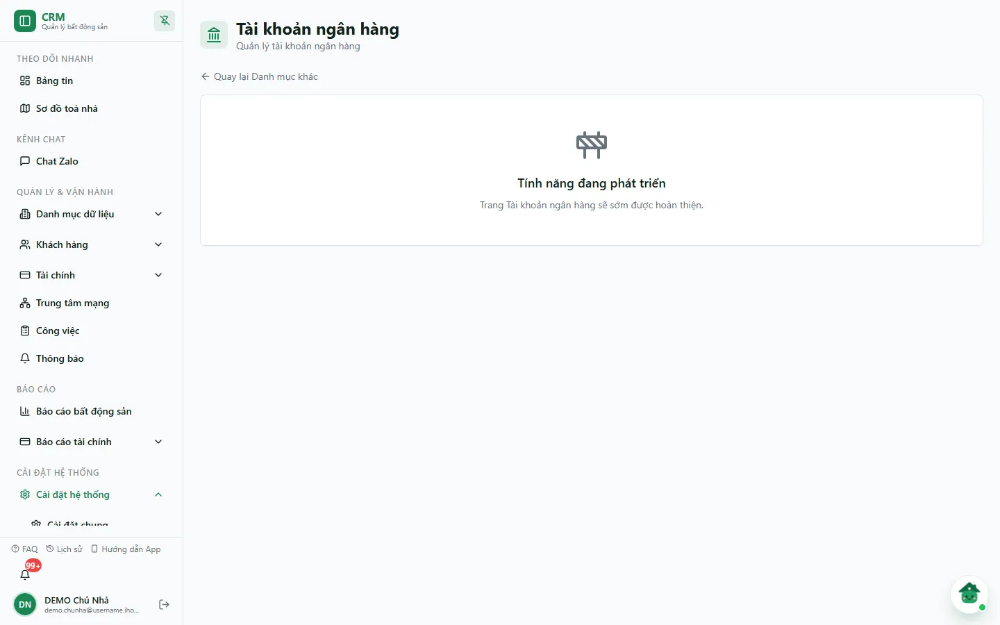
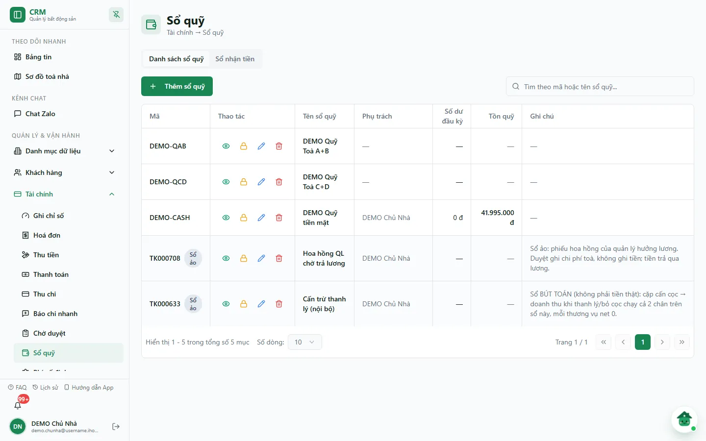

# Tài khoản ngân hàng và sổ quỹ

Đường dẫn `/settings/categories/bank-accounts` hiện chỉ hiển thị trang **Tài khoản ngân hàng** với thông báo *"Tính năng đang phát triển"*; chưa có form thêm/sửa tài khoản ngân hàng tại đây, và trang **Danh mục khác** cũng không còn thẻ dẫn tới nó. Tiền mặt, tài khoản ngân hàng hay ví đều được quản lý dưới dạng **sổ quỹ** ở màn **Sổ quỹ** — đường dẫn chính thức `/finance/cashbooks`.

::: info Điều kiện tiên quyết
- Trang giữ chỗ `/settings/categories/bank-accounts` cần quyền **Danh mục khác => Xem** (`categories.view`).
- Màn **Sổ quỹ** cần `cashbooks.view`; tạo, sửa, xoá sổ cần lần lượt `cashbooks.create`, `cashbooks.edit`, `cashbooks.delete`.
:::

## Hướng dẫn từng bước

**Bước 1**: Nếu mở `/settings/categories/bank-accounts`, bạn sẽ thấy tiêu đề **Tài khoản ngân hàng** ("Quản lý tài khoản ngân hàng"), liên kết **Quay lại Danh mục khác** và khung *"Tính năng đang phát triển — Trang Tài khoản ngân hàng sẽ sớm được hoàn thiện."* Không có thao tác nào khác.

**Bước 2**: Để quản lý tài khoản ngân hàng thực tế, mở **Tài chính** => **Sổ quỹ** ở thanh bên (hoặc thẻ **Sổ quỹ** trong nhóm **Tài chính** của **Danh mục khác**). Màn **Sổ quỹ** ("Tài chính → Sổ quỹ") có nút **Thêm sổ quỹ**, ô tìm *"Tìm theo mã hoặc tên sổ quỹ..."* và bảng với các cột **Mã**, **Thao tác**, **Tên sổ quỹ**, **Phụ trách**, **Số dư đầu kỳ**, **Tồn quỹ**, **Ghi chú**. Chủ công ty còn thấy tab **Sổ nhận tiền** bên cạnh **Danh sách sổ quỹ**.

**Bước 3**: Ấn **Thêm sổ quỹ** để tạo một sổ cho tài khoản ngân hàng. Hộp thoại **Thêm sổ quỹ** gồm **Tên sổ quỹ \***, **Người phụ trách**, **Số dư đầu kỳ**, **Ngày chốt số dư đầu kỳ**, **Mô tả**, **Tòa nhà mặc định khi tạo phiếu nhanh** và phần phân quyền người dùng sổ. Form **không có** ô riêng cho tên ngân hàng, số tài khoản hay chủ tài khoản — nếu cần, ghi các thông tin này trong **Tên sổ quỹ** hoặc **Mô tả**. Chi tiết từng trường xem [Sổ quỹ vận hành](/03-quan-ly-van-hanh/so-quy/).

::: info Đường dẫn chính thức
Luôn dùng `/finance/cashbooks`. Các đường dẫn cũ `/setting/finance/cashbooks`, `/settings/finance/cashbooks` và `/cashbooks` chỉ chuyển hướng về đây.
:::

::: warning Sổ quỹ là dữ liệu tiền
Tạo hoặc thay đổi sổ ảnh hưởng nơi ghi nhận phiếu thu chi và phạm vi người dùng nhìn thấy dòng tiền. Phiếu được duyệt chưa có nghĩa là tiền đã vào/ra sổ — chỉ phiếu ở trạng thái **Đã Thu / Đã Chi** (đã ghi sổ) mới là tiền thật. Rà lại người phụ trách và quyền trước khi lưu.
:::

## Tình huống thường gặp

| Tình huống | Cách xử lý |
|---|---|
| Trang **Tài khoản ngân hàng** báo đang phát triển | Đúng hiện trạng; chuyển sang **Sổ quỹ** (`/finance/cashbooks`). |
| Không tìm thấy thẻ **Tài khoản ngân hàng** trong **Danh mục khác** | Thẻ đã bỏ; nhóm **Tài chính** chỉ còn thẻ **Sổ quỹ** dẫn sang `/finance/cashbooks`. |
| Mở đường dẫn Sổ quỹ cũ | Hệ thống chuyển hướng về `/finance/cashbooks`. |
| Không thấy hoặc không sửa được một sổ | Kiểm tra quyền `cashbooks.*` và phạm vi sổ được cấp cho tài khoản. |

## Quy trình liên quan

- [Sổ quỹ vận hành](/03-quan-ly-van-hanh/so-quy/)
- [Sổ quỹ và loại thu chi](/01-bat-dau/so-quy-loai-thu-chi/)
- [Thu chi](/03-quan-ly-van-hanh/thu-chi/)
