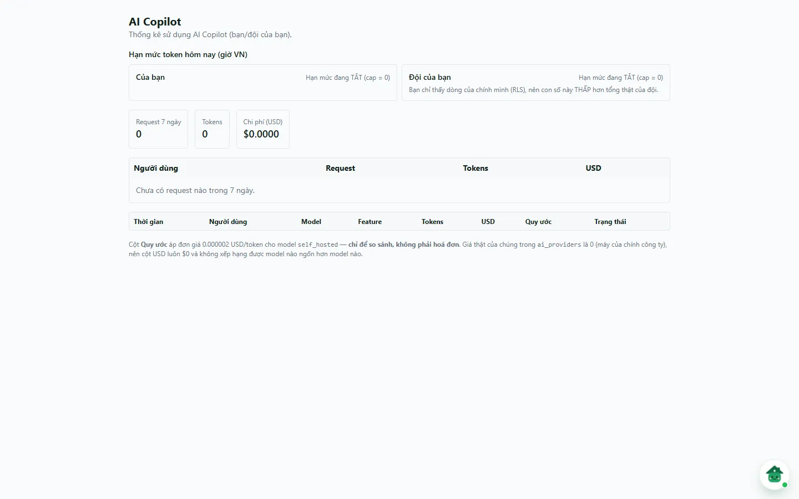

# Trợ lý AI

AI Copilot có hai bề mặt:

- **Nút chat nổi** (linh vật **Bé Chiu**, di chuột vào hiện *"Chat với Bé Chiu"*) ở góc dưới màn hình, dùng để hỏi đáp dữ liệu.
- Trang **Trợ lý AI** (`/settings/ai-copilot`, tiêu đề **AI Copilot**) trong menu **Cài đặt hệ thống**: xem thống kê sử dụng và hạn mức; phần quản trị đầy đủ chỉ dành cho super admin nền tảng.

::: info Trạng thái hiện hành (07/10/2026)
Việc **phát triển** Zalo và AI Copilot đang **tạm ngưng** từ 06/10/2026. Tạm ngưng không tắt tính năng đang chạy: trên production, `demo.chunha` vẫn thấy nút chat nổi và trang **Trợ lý AI** ở dạng thống kê. Trang này chỉ mô tả những gì đang có, không hứa tính năng mới.
:::

::: info Điều kiện tiên quyết
- Nút chat nổi chỉ hiện khi đã đăng nhập, tài khoản được cấp quyền chat Copilot (do super admin cấp) **và** có quyền `ai_copilot.view`.
- Trang `/settings/ai-copilot` chỉ yêu cầu đăng nhập; nội dung thay đổi theo vai trò (xem bên dưới). Mục menu **Trợ lý AI** hiện theo quyền module `ai_copilot`.
:::

## Dùng nút chat nổi

1. Bấm linh vật **Bé Chiu** ở góc màn hình (trên máy tính ở góc phải dưới; trên điện thoại ở sát mép trái dưới để không đè cột thao tác).
2. Viết yêu cầu có phạm vi rõ: toà nhà, kỳ, trạng thái hoặc đối tượng cần tra cứu.
3. Kiểm tra nguồn và số liệu trả về trước khi làm thao tác nghiệp vụ.

Copilot làm việc trong **công ty đang chọn** ở trang [Thông tin cá nhân](/06-tai-khoan/thong-tin-ca-nhan/) (thẻ **Công ty làm việc**). Nút không hiện ở các màn đăng nhập, trang công khai, **Trung tâm mạng**, **Báo chi nhanh** (`/chi-tieu`), **Việc của tôi** và **Ví cá nhân** — các màn này có ô nhập/AI riêng.

`ai_copilot.ui_control` là quyền thử nghiệm riêng cho chế độ điều khiển giao diện; nó không cho AI vượt quyền hiệu lực, phạm vi dữ liệu hay kiểm tra của máy chủ.

::: warning Giới hạn an toàn
Không cung cấp mật khẩu, token hoặc dữ liệu nhạy cảm không cần thiết. AI không thay thế người duyệt; mọi kết quả và hành động cần được người có trách nhiệm kiểm tra.
:::

## Trang Trợ lý AI — người dùng thường

**Bước 1**: Tại menu bên trái, mở **Cài đặt hệ thống** => **Trợ lý AI**. Tài khoản không phải super admin (kể cả chủ công ty) chỉ thấy phần thống kê với dòng mô tả *"Thống kê sử dụng AI Copilot (bạn/đội của bạn)."*:

- **Hạn mức token hôm nay (giờ VN)**: hai ô **Của bạn** và **Đội của bạn**. Khi có hạn mức, ô hiện *đã dùng / hạn mức token · %*, thanh chuyển đỏ và có cảnh báo khi dùng từ 80% trở lên (chạm trần thì Copilot trả lỗi `daily_token_quota` đến hết ngày). Khi hạn mức bằng 0, ô ghi **Hạn mức đang TẮT (cap = 0)** — nghĩa là không đặt trần, không phải "còn nguyên".
- Ba ô **Request 7 ngày**, **Tokens**, **Chi phí (USD)**.
- Bảng theo **Người dùng** (Request, Tokens, USD) và bảng chi tiết 50 lượt gần nhất (**Thời gian**, **Người dùng**, **Model**, **Feature**, **Tokens**, **USD**, **Quy ước**, **Trạng thái**).

Bạn chỉ thấy các lượt gọi của chính mình (hoặc của đội nếu bạn là chủ tài khoản) — ô **Đội của bạn** ghi rõ khi con số thấp hơn tổng thật của đội. Cột **Quy ước** gán đơn giá tượng trưng cho model tự host (giá thật bằng 0) để so sánh mức tiêu thụ, **không phải hoá đơn**.

Snapshot DEMO 07/10/2026 (`demo.chunha`): cả hai hạn mức đang **TẮT (cap = 0)**, **0** request trong 7 ngày, chi phí **$0.0000**.

## Trang Trợ lý AI — super admin

Super admin nền tảng thấy dòng mô tả *"Quản trị toàn hệ thống: kill switch, hạn mức, người dùng, providers, chi phí."* và sáu tab:

| Tab | Nội dung |
|---|---|
| **Cài đặt** | Công tắc **Chat (kill switch toàn hệ thống)** và **Điều khiển UI (experimental)**; rate limit (request/phút/user); các cap USD/ngày (user, tenant, toàn hệ thống) và cap TOKEN/ngày (user, tenant), đặt 0 = tắt; nút **Lưu cài đặt**. Trang tự nhắc cap USD hiện không có tác dụng vì các provider đang bật báo giá 0, hàng rào thật là cap TOKEN |
| **Rollout** | Chuyển trạng thái từng contract trang/hành động của Copilot theo tổ chức, bắt buộc ghi lý do, liên kết bằng chứng và tham chiếu rollback |
| **Hành động** | Chính sách và sổ nhật ký các hành động AI |
| **Người dùng** | Cấp quyền chat cho tài khoản theo email (**Cấp quyền**), bật/tắt **Chat**, **Điều khiển UI**, **Thu hồi** (hiệu lực ngay) |
| **Providers** | Bật/tắt nhà cung cấp AI, **Sửa models**, **Test key**; khoá API nằm ở secrets máy chủ, không nhập ở đây |
| **Sử dụng** | Cùng nội dung thống kê như người dùng thường, nhưng thấy toàn hệ thống |

Quyền ghi các bảng cấu hình chỉ dành cho super admin và được máy chủ kiểm; mở được URL không có nghĩa là có quyền quản trị.

::: info Kế hoạch không phải runtime
Trang [Kế hoạch phát triển AI Copilot](/08-ke-hoach-phat-trien/ai-copilot/) là **PROPOSAL**, dùng để thảo luận lộ trình. Không dùng nội dung đó để xác nhận tính năng production hiện hành.
:::

## Thử trực tiếp trên sandbox

<SandboxTry account="demo.chunha" app-path="/settings/ai-copilot" app-label="Mở trang Trợ lý AI" fixtures="Snapshot 07/10/2026: hạn mức TẮT (cap = 0), 0 request trong 7 ngày" view-only>

**Bài tập chỉ xem**

1. Mở **Cài đặt hệ thống** => **Trợ lý AI** và đối chiếu hai ô hạn mức, ba ô số liệu và hai bảng.
2. Quan sát nút **Bé Chiu** ở góc dưới; không cần gửi câu hỏi để hoàn thành bài.

**Kết quả mong đợi**

- Tài khoản demo chỉ thấy phần thống kê, không thấy các tab quản trị.
- Không có cấu hình nào bị thay đổi.

</SandboxTry>

## Tình huống thường gặp

| Tình huống | Cách xử lý |
|---|---|
| Không thấy nút chat nổi | Tài khoản chưa được super admin cấp quyền chat, thiếu `ai_copilot.view`, hoặc đang ở màn ẩn nút (Báo chi nhanh, Ví cá nhân, Việc của tôi, Trung tâm mạng) |
| Copilot nhắc chọn tổ chức | Bấm **Mở Tài khoản để chọn công ty** trong khung chat, chọn ở thẻ **Công ty làm việc** |
| Copilot báo hết hạn mức `daily_token_quota` | Đã chạm trần token trong ngày; chờ sang ngày mới (giờ VN) hoặc nhờ super admin điều chỉnh |
| Trang chỉ có thống kê, không có tab Cài đặt | Đúng thiết kế: tab quản trị chỉ dành cho super admin nền tảng |

## Quy trình liên quan

- [Thông tin cá nhân](/06-tai-khoan/thong-tin-ca-nhan/) — chọn công ty làm việc cho Copilot.
- [Mẫu vai trò và phân quyền](/05-cai-dat/phan-quyen/) — quyền `ai_copilot.view`, `ai_copilot.ui_control`.
- [Kế hoạch phát triển AI Copilot](/08-ke-hoach-phat-trien/ai-copilot/)
