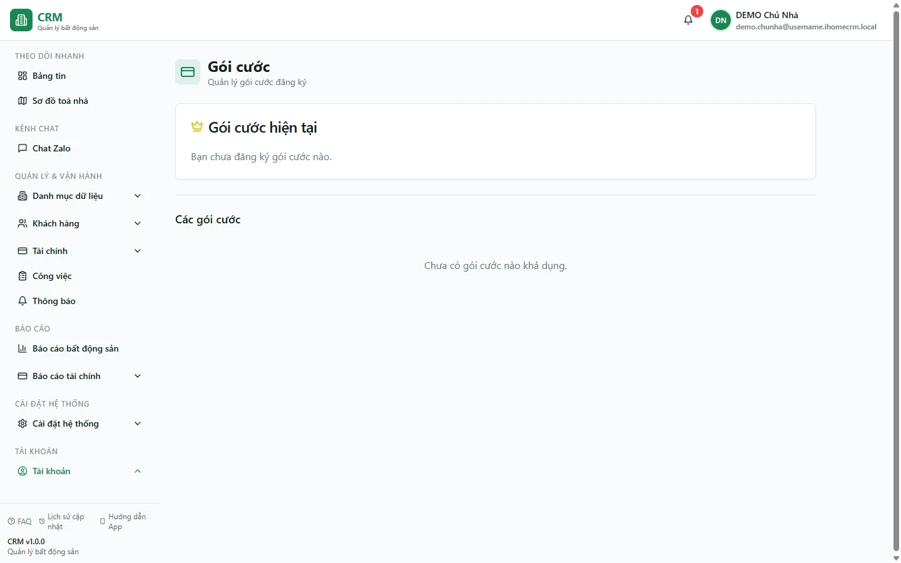

# Gói cước

Trang **Gói cước** là nơi bạn xem tài khoản của mình đang dùng **gói thuê bao nào**, **hạn sử dụng đến khi nào** và **giới hạn tài nguyên** kèm theo (số phòng, số toà nhà tối đa). Bên dưới là danh sách **các gói khả dụng** để bạn đối chiếu và **đăng ký / nâng cấp** khi cần. Đây là trang thuộc **tài khoản của chính bạn** — mỗi tài khoản chủ nhà có gói cước riêng, không liên quan tới dữ liệu vận hành (hợp đồng, hoá đơn, thu chi).

Trang này **không ghi tiền vào sổ quỹ** và **không tính vào Kết quả kinh doanh**. Việc đăng ký gói ở đây chỉ ghi nhận bạn đang ở gói nào; phần thanh toán/nâng cấp thực tế hiện được xử lý qua **kênh hỗ trợ** (xem mục cuối trang).

::: info Điều kiện tiên quyết
- Bạn đã **đăng nhập** vào tài khoản của mình. Route này không yêu cầu `settings.view`.
- Gói cước gắn với **chủ tài khoản** (owner). Nhân viên đăng nhập bằng tài khoản được cấp sẽ thấy gói theo tài khoản đang dùng, không phải gói của chủ nhà.
:::

## Hướng dẫn từng bước

**Bước 1**: Từ menu bên trái, mở nhóm **Tài khoản** => chọn **Gói cước** (hoặc mở thẳng đường dẫn `/account/subscription`). Màn hình hiện tiêu đề **Gói cước** với dòng mô tả **Quản lý gói cước đăng ký**.

**Bước 2**: Xem thẻ **Gói cước hiện tại** (có biểu tượng vương miện) ở phần trên. Đây là nơi cho biết bạn đang dùng gói nào:
- Nếu **chưa đăng ký gói nào**, thẻ hiện đúng dòng **"Bạn chưa đăng ký gói cước nào."** (như tài khoản demo trong ảnh).
- Nếu **đã có gói**, thẻ hiển thị **tên gói**, **giá**, **thời hạn** (`start_date` → `end_date`) và **giới hạn tài nguyên** (số phòng tối đa, số toà nhà tối đa). Gói còn hiệu lực hay đã **hết hạn** được xác định bằng cách so **ngày kết thúc** với hôm nay.

**Bước 3**: Kéo xuống mục **Các gói cước** để xem danh sách gói **đang mở bán**, sắp xếp theo **giá tăng dần**. Mỗi gói cho biết tên, mô tả, giá, thời hạn (số tháng) và các giới hạn/tính năng đi kèm. Nếu hệ thống chưa mở gói nào, mục này hiện **"Chưa có gói cước nào khả dụng."** (đúng như trạng thái tài khoản demo trong ảnh).

**Bước 4**: Khi có gói khả dụng, đối chiếu giới hạn với quy mô của bạn:
- **Số phòng tối đa / Số toà nhà tối đa**: nếu để trống nghĩa là **không giới hạn** (dòng đó được ẩn đi).
- Chọn gói phù hợp rồi bấm **Đăng ký** trên gói đó. Gói bạn **đang dùng** sẽ hiện là gói hiện tại và **không bấm đăng ký lại được** (nút bị khoá).

**Bước 5**: Sau khi đăng ký, quay lại thẻ **Gói cước hiện tại** để kiểm tra tên gói và **hạn sử dụng** đã cập nhật đúng. Thời hạn được tính từ **hôm nay** cộng thêm **số tháng** của gói.

::: warning Đăng ký gói hiện là bước ghi nhận, chưa có thanh toán tự động
Nút **Đăng ký** hiện chỉ **ghi nhận** bạn chọn gói nào (không qua cổng thanh toán, không kiểm tra tự động), nên hãy coi đây là bước **đánh dấu gói**, không phải giao dịch mua bán hoàn chỉnh. Nếu bạn muốn **mua mới / gia hạn / nâng cấp thật**, hãy liên hệ **kênh hỗ trợ** để được chốt gói và thanh toán đúng quy trình. Đừng bấm **Đăng ký** nhiều lần liên tiếp — mỗi lần bấm tạo một bản ghi mới và trang chỉ hiển thị bản **mới nhất**.
:::

## Các tính năng khác

| Khu vực / Nút | Công dụng |
| --- | --- |
| **Gói cước hiện tại** (thẻ vương miện) | Cho biết gói đang dùng: tên gói, giá, **thời hạn** (từ ngày – đến ngày) và **giới hạn tài nguyên**. Khi chưa có gói, hiện "Bạn chưa đăng ký gói cước nào." |
| **Các gói cước** (lưới bên dưới) | Danh sách gói **đang mở bán**, sắp theo **giá tăng dần**; mỗi thẻ có tên, mô tả, giá, thời hạn (tháng) và các giới hạn/tính năng. |
| **Đăng ký** (trên mỗi gói) | Chọn gói đó cho tài khoản; gói **đang dùng** bị khoá nút. |
| **Giới hạn phòng / toà nhà** | Số phòng và số toà tối đa của gói; **để trống = không giới hạn** (dòng được ẩn). |
| **Hạn sử dụng** | So **ngày kết thúc** với hôm nay để biết gói **còn hiệu lực** hay **đã hết hạn**. |

## Tình huống & lỗi thường gặp

| Tình huống | Cách xử lý |
| --- | --- |
| Thẻ **Gói cước hiện tại** ghi "Bạn chưa đăng ký gói cước nào." | Tài khoản chưa gắn gói nào. Nếu cần dùng gói có tính phí, hãy đăng ký ở mục **Các gói cước** hoặc liên hệ **kênh hỗ trợ** để được chốt gói. |
| Mục **Các gói cước** ghi "Chưa có gói cước nào khả dụng." | Hệ thống chưa mở gói nào để bán (đúng với tài khoản demo). Liên hệ **kênh hỗ trợ** để biết gói phù hợp. |
| Bấm **Đăng ký** nhiều lần, sợ bị tính trùng | Trang chỉ hiển thị **bản ghi mới nhất**; các lần bấm trước không hiện ra nhưng vẫn được lưu. Tránh bấm lặp; nếu lỡ, báo **kênh hỗ trợ** để dọn dữ liệu. |
| Gói ghi **đã hết hạn** nhưng vẫn dùng được tính năng | Hạn sử dụng ở đây chỉ là **cờ hiển thị** (so ngày kết thúc với hôm nay); hệ thống **không tự khoá** tính năng theo hạn. Muốn gia hạn thật, liên hệ **kênh hỗ trợ**. |
| Đã đăng ký gói giới hạn N phòng nhưng vẫn tạo được nhiều hơn | Giới hạn **số phòng / số toà** hiện **chưa được chặn cứng** khi tạo phòng/toà — con số trên gói chỉ để tham khảo. |
| Nhân viên không thấy đúng gói của chủ nhà | Gói gắn theo **tài khoản đang đăng nhập**. Trang này phản ánh gói của tài khoản đó, không phải của chủ nhà. |

## Thử trực tiếp trên sandbox

<SandboxTry account="demo.chunha" app-path="/account/subscription" view-only>

Bài xem: **Xem gói cước hiện tại của tài khoản demo.**

1. Từ menu, mở **Tài khoản** => **Gói cước** (hoặc mở thẳng đường dẫn trên).
2. Đọc thẻ **Gói cước hiện tại**: tài khoản demo hiện dòng **"Bạn chưa đăng ký gói cước nào."** — nghĩa là chưa gắn gói nào.
3. Kéo xuống mục **Các gói cước**: tài khoản demo hiện **"Chưa có gói cước nào khả dụng."** — nghĩa là chưa có gói nào đang mở bán để đăng ký.

Kết quả mong đợi: bạn nắm được **bố cục trang** — phần trên là **gói đang dùng + hạn sử dụng**, phần dưới là **danh sách gói để đăng ký/nâng cấp** — và hiểu rằng khi có gói, đây là nơi kiểm tra nhanh **giới hạn tài nguyên** và **thời hạn** của tài khoản.

</SandboxTry>

## Quy trình liên quan

- [Thông tin cá nhân](/06-tai-khoan/thong-tin-ca-nhan/) — trang tài khoản còn lại: xem/sửa hồ sơ của chính bạn.
- [Căn hộ / Phòng](/03-quan-ly-van-hanh/can-ho-phong/) — nơi tạo phòng; giới hạn số phòng/toà của gói liên quan tới quy mô này.
- [Kênh hỗ trợ](/07-thong-tin-khac/kenh-ho-tro/) — liên hệ để mua mới, gia hạn hoặc nâng cấp gói cước thật sự.
