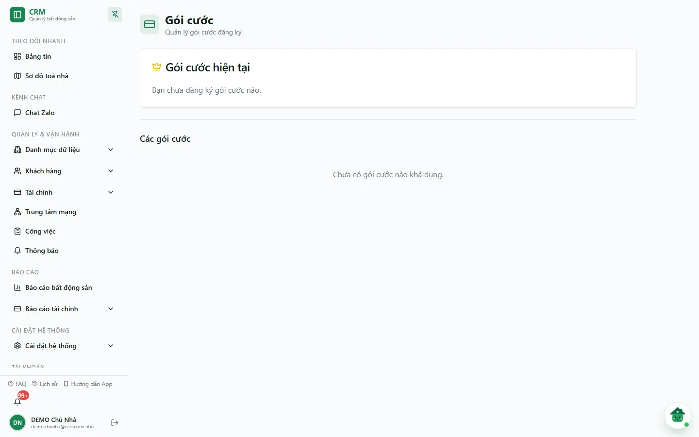

# Gói cước

Trang **Gói cước** cho biết tài khoản của bạn đang dùng **gói thuê bao nào**, **hạn sử dụng đến khi nào** và **giới hạn tài nguyên** kèm theo (số toà nhà, số căn hộ tối đa). Bên dưới là danh sách **các gói khả dụng** để đối chiếu và **đăng ký** khi cần. Đây là trang thuộc **tài khoản của chính bạn**, không liên quan tới dữ liệu vận hành (hợp đồng, hoá đơn, thu chi).

Trang này **không ghi tiền vào sổ quỹ** và **không tính vào Kết quả kinh doanh**. Đăng ký gói ở đây chỉ ghi nhận bạn chọn gói nào; thanh toán/nâng cấp thực tế được xử lý qua **kênh hỗ trợ** (xem mục cuối trang).

::: info Điều kiện tiên quyết
- Chỉ cần **đã đăng nhập**. Route không yêu cầu quyền nghiệp vụ nào.
- Gói cước gắn với **tài khoản đang đăng nhập**. Nhân viên đăng nhập bằng tài khoản được cấp sẽ thấy gói của chính tài khoản đó, không phải gói của chủ nhà.
:::

## Hướng dẫn từng bước

**Bước 1**: Tại menu bên trái, mở nhóm **Tài khoản** => **Gói cước** (hoặc mở thẳng `/account/subscription`). Màn hình hiện tiêu đề **Gói cước** với dòng mô tả **Quản lý gói cước đăng ký**.

**Bước 2**: Xem thẻ **Gói cước hiện tại** (biểu tượng vương miện):

- **Chưa đăng ký gói nào**: thẻ hiện **"Bạn chưa đăng ký gói cước nào."** (như tài khoản demo trong ảnh).
- **Đã có gói**: thẻ hiện **tên gói**, mô tả, **Hạn sử dụng: dd/mm/yyyy**, giới hạn **N toà nhà** / **N căn hộ** (nếu gói có giới hạn) và nhãn **Đang hoạt động** hoặc **Đã hết hạn** (so ngày kết thúc với hôm nay).

**Bước 3**: Xem mục **Các gói cước**: các gói **đang mở bán**, xếp theo **giá tăng dần**. Mỗi thẻ có tên, mô tả, giá **/N tháng**, **Tối đa N toà nhà**, **Tối đa N căn hộ** và danh sách tính năng. Gói đang dùng có viền nổi bật và nhãn **Đang dùng**. Nếu chưa mở gói nào, mục này hiện **"Chưa có gói cước nào khả dụng."** (đúng như tài khoản demo).

**Bước 4**: Khi có gói phù hợp, bấm **Đăng ký** trên gói đó. Gói đang dùng hiện nút **Gói hiện tại** bị khoá. Thời hạn được tính từ **hôm nay** cộng **số tháng** của gói; sau khi đăng ký, quay lại thẻ **Gói cước hiện tại** để kiểm tra tên gói và hạn sử dụng.

::: warning Đăng ký gói hiện là bước ghi nhận, chưa có thanh toán tự động
Nút **Đăng ký** chỉ **ghi nhận** gói bạn chọn (không qua cổng thanh toán, không kiểm tra tự động). Muốn **mua mới / gia hạn / nâng cấp thật**, hãy liên hệ **kênh hỗ trợ**. Đừng bấm **Đăng ký** nhiều lần liên tiếp — mỗi lần bấm tạo một bản ghi mới và trang chỉ hiển thị bản **mới nhất**.
:::

## Các tính năng khác trên màn hình

| Khu vực / Nút | Công dụng |
| --- | --- |
| **Gói cước hiện tại** | Tên gói, mô tả, **Hạn sử dụng**, giới hạn toà nhà/căn hộ và nhãn **Đang hoạt động** / **Đã hết hạn** |
| **Các gói cước** | Danh sách gói đang mở bán, xếp theo giá tăng dần |
| **Đăng ký** / **Gói hiện tại** | Chọn gói cho tài khoản; gói đang dùng bị khoá nút |
| **Tối đa N toà nhà / căn hộ** | Giới hạn của gói; gói không giới hạn thì dòng này không hiện |

Trên điện thoại, màn **Tài khoản** có thêm dòng **Gói dịch vụ** (ví dụ *Gói cơ bản*, kèm số ngày còn lại nếu có) — đây là thông tin xem nhanh lấy từ hồ sơ tài khoản; trang **Gói cước** này mới là nơi xem đầy đủ gói đã đăng ký.

## Tình huống & lỗi thường gặp

| Tình huống | Cách xử lý |
| --- | --- |
| Thẻ **Gói cước hiện tại** ghi "Bạn chưa đăng ký gói cước nào." | Tài khoản chưa gắn gói nào. Đăng ký ở mục **Các gói cước** hoặc liên hệ **kênh hỗ trợ** |
| Mục **Các gói cước** ghi "Chưa có gói cước nào khả dụng." | Hệ thống chưa mở gói nào để bán (đúng với tài khoản demo). Liên hệ **kênh hỗ trợ** |
| Bấm **Đăng ký** nhiều lần, sợ bị tính trùng | Trang chỉ hiển thị bản ghi mới nhất; các lần bấm trước vẫn được lưu. Tránh bấm lặp; nếu lỡ, báo **kênh hỗ trợ** để dọn dữ liệu |
| Gói ghi **Đã hết hạn** nhưng vẫn dùng được tính năng | Hạn sử dụng ở đây chỉ là nhãn hiển thị; hệ thống không tự khoá tính năng theo hạn. Muốn gia hạn thật, liên hệ **kênh hỗ trợ** |
| Gói giới hạn N căn hộ nhưng vẫn tạo được nhiều hơn | Giới hạn số căn hộ/toà nhà của gói hiện **chưa được chặn cứng** khi tạo — con số chỉ để tham khảo |
| Nhân viên không thấy đúng gói của chủ nhà | Gói gắn theo tài khoản đang đăng nhập, không phải của chủ nhà |

## Thử trực tiếp trên sandbox

<SandboxTry account="demo.chunha" app-path="/account/subscription" fixtures="Snapshot 07/10/2026: chưa đăng ký gói nào, chưa có gói khả dụng" view-only>

**Bài tập chỉ xem**

1. Từ menu, mở **Tài khoản** => **Gói cước**.
2. Đọc thẻ **Gói cước hiện tại**: tài khoản demo hiện **"Bạn chưa đăng ký gói cước nào."**
3. Xem mục **Các gói cước**: tài khoản demo hiện **"Chưa có gói cước nào khả dụng."**

**Kết quả mong đợi**

- Bạn nắm được bố cục: phần trên là gói đang dùng + hạn sử dụng, phần dưới là danh sách gói để đăng ký.
- Không có gói nào được đăng ký.

</SandboxTry>

## Quy trình liên quan

- [Thông tin cá nhân](/06-tai-khoan/thong-tin-ca-nhan/) — trang tài khoản còn lại: hồ sơ, mật khẩu, thông báo.
- [Căn hộ / Phòng](/03-quan-ly-van-hanh/can-ho-phong/) — nơi tạo căn hộ; giới hạn của gói liên quan tới quy mô này.
- [Kênh hỗ trợ](/07-thong-tin-khac/kenh-ho-tro/) — liên hệ để mua mới, gia hạn hoặc nâng cấp gói cước thật sự.
