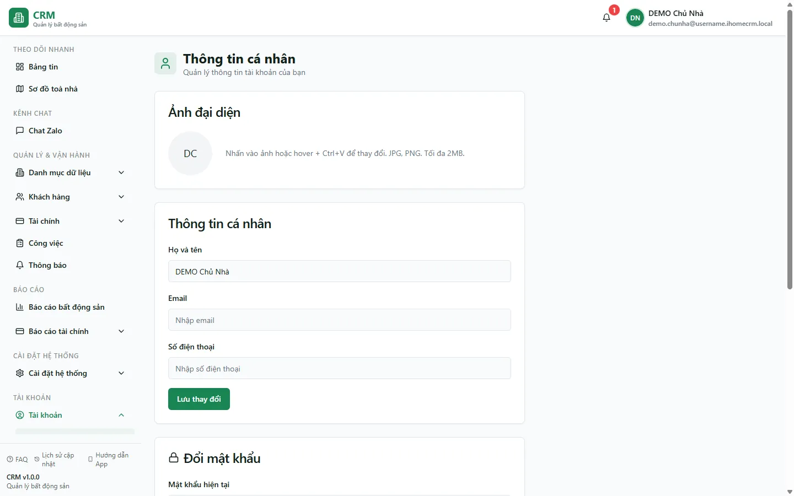

# Thông tin cá nhân

Trang **Thông tin cá nhân** là hồ sơ của chính bạn trong hệ thống: nơi bạn xem và sửa **họ tên**, **email**, **số điện thoại**, đổi **ảnh đại diện**, đổi **mật khẩu đăng nhập** và bật/tắt **thông báo đẩy (Push)** cho từng thiết bị. Đây không phải nơi cấu hình cả tổ chức hay ghi tiền — mọi thay đổi ở đây chỉ áp dụng cho **tài khoản của riêng bạn**. Tên và ảnh bạn đặt ở đây chính là những gì đồng nghiệp nhìn thấy khi bạn tạo hợp đồng, lập phiếu thu chi hay nhận việc.

Nguyên tắc cần nhớ: **email trong trang này là email hiển thị trong hồ sơ**, khác với việc đổi mật khẩu đăng nhập; còn **thông báo đẩy bật riêng cho từng thiết bị** — bật trên máy tính không tự bật trên điện thoại và ngược lại.

::: info Điều kiện tiên quyết
- Chỉ cần **đã đăng nhập** — route này không yêu cầu `settings.view` hay quyền nghiệp vụ đặc biệt.
- Để bật **thông báo đẩy**, trình duyệt phải hỗ trợ (Chrome/Edge/Firefox bản mới; hoặc Safari trên iOS 16.4+ sau khi "Thêm vào màn hình chính").
- Để đổi **ảnh đại diện**, chuẩn bị một ảnh **JPG hoặc PNG, tối đa 2MB**.
:::

## Hướng dẫn từng bước

**Bước 1**: Mở trang. Bấm vào **ảnh đại diện/tên của bạn** ở góc trên (hoặc menu tài khoản) => **Thông tin cá nhân**, hoặc vào thẳng đường dẫn `/account/profile`. Màn hình chia thành các thẻ: **Ảnh đại diện**, **Thông tin cá nhân**, **Đổi mật khẩu** và **Thông báo đẩy (Push)**.

**Bước 2**: Đổi **ảnh đại diện** (tuỳ chọn). Ở thẻ **Ảnh đại diện**, nhấn vào vòng tròn ảnh để chọn file, hoặc rê chuột lên ảnh rồi bấm **Ctrl+V** để dán ảnh đang copy. Chấp nhận **JPG, PNG, tối đa 2MB**. Tải xong hệ thống báo "Ảnh đại diện đã được CẬP NHẬT thành công".

**Bước 3**: Cập nhật **thông tin cá nhân**. Ở thẻ **Thông tin cá nhân**, chỉnh ba ô:
- **Họ và tên**: tên hiển thị của bạn khắp hệ thống (trên hợp đồng, phiếu thu chi, danh sách nhân viên…).
- **Email**: email hiển thị trong hồ sơ (dùng để liên hệ). Lưu ý: sửa ô này **không** đổi email đăng nhập của bạn.
- **Số điện thoại**: số liên hệ của bạn.

**Bước 4**: Ấn **Lưu thay đổi**. Hệ thống báo "Dữ liệu đã được CẬP NHẬT thành công" và tên/ảnh mới sẽ xuất hiện ở những nơi hiển thị bạn.

**Bước 5**: (Khi cần) Đổi **mật khẩu đăng nhập**. Ở thẻ **Đổi mật khẩu**, nhập **Mật khẩu hiện tại**, rồi **Mật khẩu mới** (ít nhất **6 ký tự**) và **Xác nhận mật khẩu mới** (gõ lại đúng như trên). Ấn **Đổi mật khẩu** — hệ thống báo "Mật khẩu đã được đổi thành công". Lần đăng nhập sau bạn dùng mật khẩu mới.

**Bước 6**: (Tuỳ chọn) Bật **thông báo đẩy** cho thiết bị đang dùng. Ở thẻ **Thông báo đẩy (Push)**, gạt **Bật trên thiết bị này** để cấp quyền và nhận thông báo trên thanh trạng thái (ví dụ có tin nhắn Zalo mới) kể cả khi không mở web. Badge đổi thành **Đang bật**. Bấm **Gửi thông báo thử** để kiểm tra thiết bị đã nhận được chưa.

## Các tính năng khác trên màn hình

| Nút / Ô | Công dụng |
| --- | --- |
| **Ảnh đại diện** (vòng tròn) | Nhấn để chọn file, hoặc rê chuột lên rồi **Ctrl+V** để dán ảnh. JPG/PNG, tối đa 2MB. |
| **Họ và tên** | Tên hiển thị của bạn trên toàn hệ thống. |
| **Email** | Email hiển thị trong hồ sơ (không phải email đăng nhập). |
| **Số điện thoại** | Số liên hệ cá nhân. |
| **Lưu thay đổi** | Ghi lại họ tên / email / SĐT vừa sửa. |
| **Mật khẩu hiện tại** | Ô nhập trong thẻ Đổi mật khẩu (điền để chắc chắn đúng người). |
| **Mật khẩu mới** / **Xác nhận mật khẩu mới** | Mật khẩu đăng nhập mới (≥ 6 ký tự) và ô gõ lại để tránh gõ nhầm. |
| **Đổi mật khẩu** | Áp dụng mật khẩu mới cho lần đăng nhập sau. |
| **Bật trên thiết bị này** (gạt) | Bật/tắt thông báo đẩy cho **riêng thiết bị** đang dùng. Badge **Đang bật** / **Đang tắt**. |
| **Gửi thông báo thử** | Bắn một thông báo thử để kiểm tra thiết bị đã nhận được chưa (chỉ dùng khi đã bật). |

::: tip Email hồ sơ khác email đăng nhập
Ô **Email** ở thẻ Thông tin cá nhân chỉ đổi **email hiển thị trong hồ sơ**, dùng để liên hệ và hiển thị — nó **không** thay đổi địa chỉ email bạn dùng để đăng nhập. Nếu cần đổi email đăng nhập thật, hãy liên hệ quản trị/kênh hỗ trợ.
:::

::: warning Đổi mật khẩu áp dụng ngay và khó "hoàn tác"
Nút **Đổi mật khẩu** đổi **mật khẩu đăng nhập thật** của tài khoản. Sau khi đổi, mật khẩu cũ hết hiệu lực — hãy chắc bạn nhớ mật khẩu mới trước khi rời trang. Nếu là tài khoản dùng chung, đổi mật khẩu sẽ khiến người khác không đăng nhập được.
:::

## Tình huống & lỗi thường gặp

| Tình huống | Cách xử lý |
| --- | --- |
| Tải ảnh đại diện báo lỗi kích thước | Ảnh vượt **2MB**. Chọn ảnh nhỏ hơn hoặc nén lại rồi tải lại (chỉ nhận **JPG/PNG**). |
| Bấm **Đổi mật khẩu** không được | Thiếu ô hoặc sai điều kiện: phải nhập cả **Mật khẩu mới** và **Xác nhận**, mật khẩu mới **≥ 6 ký tự**, và hai ô phải **khớp nhau**. |
| Đổi mật khẩu xong không đăng nhập lại được | Bạn đang dùng mật khẩu cũ. Dùng mật khẩu mới vừa đặt; nếu quên, dùng chức năng **Quên mật khẩu** ở màn đăng nhập. |
| Đổi email trong hồ sơ nhưng đăng nhập vẫn dùng email cũ | Đúng như thiết kế: ô Email ở đây chỉ là **email hiển thị**, không đổi email đăng nhập. |
| Gạt **Bật trên thiết bị này** không được (mờ đi) | Trình duyệt không hỗ trợ, hoặc quyền thông báo đang bị **chặn**. Mở cài đặt trang web trong trình duyệt => cho phép **Thông báo** rồi thử lại. |
| Trên iPhone/iPad không bật được thông báo | Mở bằng **Safari** => nút **Chia sẻ** => **Thêm vào MH chính**, rồi mở app từ màn hình chính mới bật được (yêu cầu iOS 16.4+). |
| Bật thông báo ở máy tính nhưng điện thoại không nhận | Thông báo đẩy **bật riêng từng thiết bị** — vào trang này trên điện thoại và bật lại **Bật trên thiết bị này**. |
| Đổi tên/ảnh nhưng đồng nghiệp vẫn thấy tên cũ | Nhờ họ tải lại trang; dữ liệu hồ sơ được làm mới sau khi lưu. |

## Thử trực tiếp trên sandbox

<SandboxTry account="demo.chunha" app-path="/account/profile" view-only>

Bài xem: **Xem thông tin tài khoản của bạn (đừng đổi mật khẩu tài khoản demo dùng chung).**

1. Mở đường dẫn trên (hoặc menu tài khoản => **Thông tin cá nhân**).
2. Đọc thẻ **Thông tin cá nhân**: xem **Họ và tên**, **Email**, **Số điện thoại** đang có. Đây là những gì hiển thị cho đồng nghiệp trong Tòa DEMO A/B.
3. Xem thẻ **Ảnh đại diện** và ghi nhận cách đổi (nhấn ảnh hoặc rê chuột + **Ctrl+V**), giới hạn **JPG/PNG, 2MB**.
4. Ngó qua thẻ **Đổi mật khẩu** để biết các ô cần điền — **nhưng đừng bấm Đổi mật khẩu**, vì đây là tài khoản demo dùng chung, đổi sẽ làm người khác không đăng nhập được.
5. Xem thẻ **Thông báo đẩy (Push)**: quan sát badge **Đang bật/Đang tắt** và nút **Gửi thông báo thử**.

Kết quả mong đợi: bạn hiểu trang này gom **hồ sơ cá nhân + đổi mật khẩu + thông báo đẩy theo thiết bị**, mọi thay đổi chỉ áp dụng cho tài khoản của bạn, và email ở đây là **email hiển thị** chứ không phải email đăng nhập.

</SandboxTry>

## Quy trình liên quan

- [Gói cước](/06-tai-khoan/goi-cuoc/) — xem gói thuê bao và hạn sử dụng của tài khoản.
- [Chat Zalo](/03-quan-ly-van-hanh/chat-zalo/) — nguồn phát nhiều thông báo đẩy (tin nhắn Zalo mới) mà bạn bật ở thẻ **Thông báo đẩy**.
- [Thành viên tổ chức](/05-cai-dat/nhan-vien-doi-ngu/) — nơi quản trị viên quản lý membership, vai trò và phạm vi.
- [Phân quyền](/05-cai-dat/phan-quyen/) — quyết định mỗi tài khoản làm được gì (khác với thông tin cá nhân của riêng bạn).
