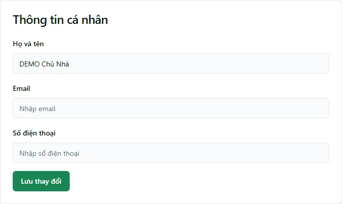
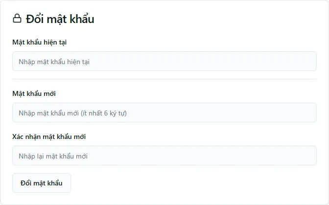
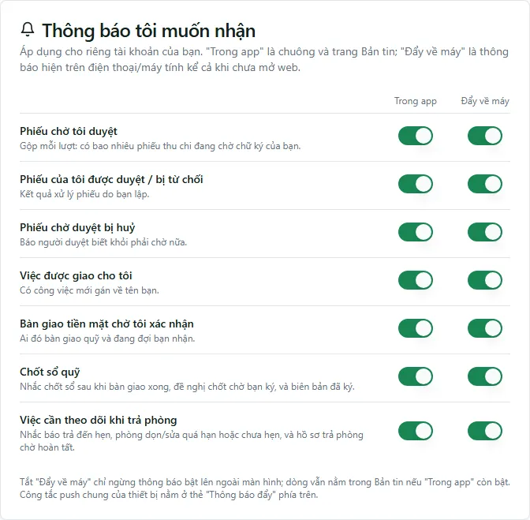

# Thông tin cá nhân

Trang **Thông tin cá nhân** là hồ sơ của chính bạn: sửa **họ tên**, **email**, **số điện thoại**, đổi **ảnh đại diện**, chọn **công ty làm việc**, đổi **mật khẩu đăng nhập**, bật **thông báo đẩy (Push)** cho thiết bị đang dùng và chọn **loại thông báo muốn nhận**. Mọi thay đổi ở đây chỉ áp dụng cho **tài khoản của riêng bạn** — không cấu hình cả tổ chức, không ghi tiền. Tên và ảnh đặt ở đây là những gì đồng nghiệp thấy khi bạn lập hợp đồng, phiếu thu chi hay nhận việc.

::: info Điều kiện tiên quyết
- Chỉ cần **đã đăng nhập** — route không yêu cầu `settings.view` hay quyền nghiệp vụ nào, nên mọi tài khoản đều mở được, cả trên máy tính lẫn điện thoại.
- Để bật **thông báo đẩy**, trình duyệt phải hỗ trợ (Chrome/Edge/Firefox bản mới; hoặc Safari trên iOS 16.4+ sau khi "Thêm vào màn hình chính").
- Để đổi **ảnh đại diện**, chuẩn bị ảnh **JPG hoặc PNG, tối đa 2MB**.
:::

## Hướng dẫn từng bước

**Bước 1**: Mở trang: menu bên trái => nhóm **Tài khoản** => **Thông tin cá nhân**, hoặc bấm tên/ảnh của bạn ở chân menu, hoặc vào thẳng `/account/profile`. Trên máy tính, trang gồm các thẻ theo thứ tự: **Ảnh đại diện**, **Công ty làm việc**, **Thông tin cá nhân**, **Đổi mật khẩu**, **Thông báo đẩy (Push)**, **Thông báo tôi muốn nhận**.

**Bước 2**: (Tuỳ chọn) Đổi **ảnh đại diện**: ở thẻ **Ảnh đại diện**, nhấn vào vòng tròn ảnh để chọn file, hoặc rê chuột lên ảnh rồi bấm **Ctrl+V** để dán ảnh đang sao chép. Ảnh quá 2MB bị từ chối với dòng *"Chọn ảnh không quá 2MB."*; tải xong hệ thống báo *"Ảnh đại diện đã được CẬP NHẬT thành công"*.

**Bước 3**: Cập nhật thẻ **Thông tin cá nhân**:

- **Họ và tên**: tên hiển thị của bạn khắp hệ thống.
- **Email**: email hiển thị trong hồ sơ (để liên hệ). Sửa ô này **không** đổi email/tên đăng nhập.
- **Số điện thoại**: số liên hệ của bạn.

Bấm **Lưu thay đổi**; hệ thống báo *"Đã cập nhật thông tin cá nhân."*

**Bước 4**: (Khi cần) Đổi **mật khẩu đăng nhập** ở thẻ **Đổi mật khẩu**: nhập **Mật khẩu mới** (ít nhất **6 ký tự**) và **Xác nhận mật khẩu mới** (gõ lại đúng như trên), rồi bấm **Đổi mật khẩu**. Hệ thống báo *"Mật khẩu đã được đổi thành công"*; lần đăng nhập sau dùng mật khẩu mới.

::: warning Ô "Mật khẩu hiện tại" chưa được kiểm tra
Theo mã nguồn hiện hành, hệ thống đổi mật khẩu cho **phiên đang đăng nhập** mà **không đối chiếu** ô **Mật khẩu hiện tại**. Vì vậy đừng để máy đang đăng nhập cho người khác dùng, và đăng xuất khi dùng máy chung.
:::

**Bước 5**: (Tuỳ chọn) Bật **thông báo đẩy** cho thiết bị đang dùng ở thẻ **Thông báo đẩy (Push)**: gạt **Bật trên thiết bị này** để cấp quyền và đăng ký. Badge cạnh tiêu đề đổi từ **Đang tắt** sang **Đang bật** (hoặc **Chưa xác định** nếu chưa đọc được trạng thái — bấm **Kiểm tra lại**). Bấm **Gửi thông báo thử** để kiểm tra thiết bị đã nhận được chưa; nếu gửi thử lỗi, thẻ hiện khung **Kết quả gửi thử gần nhất**.

**Bước 6**: (Tuỳ chọn) Chọn loại thông báo ở thẻ **Thông báo tôi muốn nhận**. Mỗi loại có hai công tắc: **Trong app** (chuông và trang Bản tin) và **Đẩy về máy** (thông báo bật lên trên điện thoại/máy tính kể cả khi chưa mở web). Bảy loại hiện có:

| Loại | Khi nào có thông báo |
|---|---|
| **Phiếu chờ tôi duyệt** | Gộp mỗi lượt: có bao nhiêu phiếu thu chi đang chờ chữ ký của bạn |
| **Phiếu của tôi được duyệt / bị từ chối** | Kết quả xử lý phiếu do bạn lập |
| **Phiếu chờ duyệt bị huỷ** | Báo người duyệt biết khỏi phải chờ nữa |
| **Việc được giao cho tôi** | Có công việc mới gán về tên bạn |
| **Bàn giao tiền mặt chờ tôi xác nhận** | Ai đó bàn giao quỹ và đang đợi bạn nhận |
| **Chốt sổ quỹ** | Nhắc chốt sổ sau khi bàn giao, đề nghị chốt chờ bạn ký, biên bản đã ký |
| **Việc cần theo dõi khi trả phòng** | Nhắc báo trả đến hẹn, phòng dọn/sửa quá hạn hoặc chưa hẹn, hồ sơ trả phòng chờ hoàn tất |

Gạt công tắc là **tự lưu ngay**, không có nút Lưu. Nếu bạn thuộc nhiều tổ chức, chọn **Tổ chức** trước khi gạt — tuỳ chọn lưu riêng cho từng tổ chức. Tắt **Đẩy về máy** chỉ ngừng thông báo bật lên; dòng thông báo vẫn nằm trong Bản tin nếu **Trong app** còn bật.

::: tip Hai lớp công tắc thông báo
Công tắc **Bật trên thiết bị này** (thẻ Thông báo đẩy) quyết định thiết bị có nhận push hay không. Các công tắc **Đẩy về máy** (thẻ Thông báo tôi muốn nhận) quyết định loại nào được đẩy. Muốn nhận push một loại trên điện thoại thì cần bật cả hai.
:::

## Các tính năng khác trên màn hình

### Chọn công ty làm việc

Thẻ **Công ty làm việc** (ngay dưới ảnh đại diện) có ô **Công ty đang chọn**. Copilot và ô ghi nhanh có AI dùng công ty này để xác định phạm vi dữ liệu.

Lựa chọn **tự lưu theo tài khoản**, không cần bấm **Lưu thay đổi**: đăng xuất rồi đăng nhập lại, đóng mở web, mở ứng dụng đã ghim hoặc đăng nhập trên trình duyệt khác đều khôi phục công ty đã chọn, cho đến khi bạn đổi. Nếu chưa đồng bộ được (ví dụ mất mạng), thẻ báo *"Chưa lưu được lựa chọn công ty lên tài khoản. Lựa chọn trên thiết bị vẫn được giữ; hãy thử lại."* kèm nút **Thử lại**. Nếu tải danh sách lỗi, bấm **Thử lại**; lựa chọn đã lưu không bị xoá. Tài khoản chưa có công ty nào thấy dòng *"Tài khoản chưa có công ty khả dụng. Liên hệ quản trị viên để được cấp quyền."* Nếu công ty không còn khả dụng, hệ thống yêu cầu chọn lại (chỉ còn một công ty thì tự chọn).

Nếu Copilot nhắc chọn tổ chức, bấm **Mở Tài khoản để chọn công ty** ngay trong khung chat. Ở **Ví cá nhân** hoặc **Báo chi nhanh**, nếu chưa có công ty đã chọn, ô ghi nhanh cho chọn công ty ngay để dùng AI đọc ảnh và giọng nói; nội dung đang soạn vẫn được giữ, và bạn vẫn dùng được **Nhập tay** khi chưa có công ty.

### Trên điện thoại

Mở `/account/profile` trên điện thoại hiện màn **Tài khoản** dạng ứng dụng: phần đầu có ảnh, tên, email và nhãn **Quản trị viên** (tài khoản có quyền xem thành viên) hoặc **Nhân viên**; nút máy ảnh để đổi ảnh. Bên dưới là các thẻ **Công ty làm việc**, **Thông tin cá nhân**, **Đổi mật khẩu**; mục **Tùy chọn** có công tắc **Thông báo đẩy** và thẻ **Thông báo tôi muốn nhận**; tiếp theo là dòng **Gói dịch vụ**, **Cài CRM lên máy** (hướng dẫn thêm vào màn hình chính), nút **Đăng xuất** và số phiên bản.

### Bảng nút / ô

| Nút / Ô | Công dụng |
| --- | --- |
| **Ảnh đại diện** (vòng tròn) | Nhấn để chọn file, hoặc rê chuột lên rồi **Ctrl+V**. JPG/PNG, tối đa 2MB |
| **Công ty đang chọn** | Công ty làm việc của bạn; tự lưu theo tài khoản |
| **Họ và tên** / **Email** / **Số điện thoại** | Thông tin hồ sơ; **Email** là email hiển thị, không phải email đăng nhập |
| **Lưu thay đổi** | Lưu họ tên / email / SĐT vừa sửa |
| **Mật khẩu mới** / **Xác nhận mật khẩu mới** | Mật khẩu đăng nhập mới (≥ 6 ký tự) và ô gõ lại |
| **Đổi mật khẩu** | Áp dụng mật khẩu mới ngay cho tài khoản |
| **Bật trên thiết bị này** | Bật/tắt thông báo đẩy cho riêng thiết bị đang dùng |
| **Gửi thông báo thử** | Gửi một thông báo thử (chỉ bấm được khi đã bật) |
| Công tắc **Trong app** / **Đẩy về máy** | Chọn loại thông báo muốn nhận; tự lưu |

::: warning Đổi mật khẩu áp dụng ngay
Nút **Đổi mật khẩu** đổi **mật khẩu đăng nhập thật**. Sau khi đổi, mật khẩu cũ hết hiệu lực. Nếu là tài khoản dùng chung (như tài khoản demo), đổi mật khẩu sẽ khiến người khác không đăng nhập được.
:::

## Tình huống & lỗi thường gặp

| Tình huống | Cách xử lý |
| --- | --- |
| Tải ảnh đại diện báo *"Chọn ảnh không quá 2MB."* | Ảnh vượt 2MB. Chọn ảnh nhỏ hơn hoặc nén lại |
| Bấm **Đổi mật khẩu** báo lỗi dưới ô | *"Nhập mật khẩu mới."*, *"Mật khẩu mới phải có ít nhất 6 ký tự."*, *"Nhập lại mật khẩu mới."* hoặc *"Mật khẩu xác nhận không khớp."* — sửa đúng ô được chỉ |
| Đổi mật khẩu xong không đăng nhập được | Dùng mật khẩu mới; nếu quên, dùng **Quên mật khẩu** ở màn đăng nhập |
| Đổi email trong hồ sơ nhưng vẫn đăng nhập bằng email cũ | Đúng thiết kế: ô Email ở đây chỉ là email hiển thị |
| Thẻ Thông báo đẩy báo *"Quyền thông báo đang bị chặn…"*, công tắc mờ | Mở cài đặt trang web trong trình duyệt → cho phép **Thông báo** rồi thử lại |
| Trên iPhone/iPad không bật được thông báo | Mở bằng **Safari** → nút **Chia sẻ** → **Thêm vào MH chính**, rồi mở app từ màn hình chính (iOS 16.4+) |
| Bật thông báo ở máy tính nhưng điện thoại không nhận | Thông báo đẩy bật riêng từng thiết bị — vào trang này trên điện thoại và bật lại |
| Thẻ Thông báo tôi muốn nhận báo *"Tuỳ chọn cá nhân chưa bật trên máy chủ…"* | Đang hiển thị mặc định (nhận tất cả) và tạm chưa lưu được; liên hệ quản trị |
| Thẻ báo *"Chưa xác nhận được cấu hình thông báo đã lưu…"* | Bấm **Đọc lại trạng thái** trước khi gạt tiếp |
| Thẻ ghi *"Bạn chưa thuộc tổ chức nào…"* | Tài khoản chưa được mời vào tổ chức nào nên chưa có tuỳ chọn để đặt |

## Thử trực tiếp trên sandbox

<SandboxTry account="demo.chunha" app-path="/account/profile" view-only>

**Bài tập chỉ xem** — đừng đổi mật khẩu hay hồ sơ của tài khoản demo dùng chung.

1. Mở **Tài khoản** => **Thông tin cá nhân** và đối chiếu thứ tự các thẻ.
2. Xem thẻ **Công ty làm việc**: công ty đang chọn của demo là **iHome CRM (Demo)**.
3. Xem thẻ **Đổi mật khẩu** để biết các ô cần điền — **không bấm Đổi mật khẩu**.
4. Xem thẻ **Thông báo tôi muốn nhận**: bảy loại, hai cột công tắc — không gạt công tắc (gạt là lưu ngay).

**Kết quả mong đợi**

- Giao diện khớp nội dung hướng dẫn.
- Không có thông tin, mật khẩu hay tuỳ chọn thông báo nào của tài khoản demo bị thay đổi.

</SandboxTry>

## Quy trình liên quan

- [Gói cước](/06-tai-khoan/goi-cuoc/) — gói thuê bao và hạn sử dụng của tài khoản.
- [Trợ lý AI](/05-cai-dat/tro-ly-ai/) — Copilot dùng công ty bạn chọn ở đây.
- [Chat Zalo](/03-quan-ly-van-hanh/chat-zalo/) — nguồn phát nhiều thông báo đẩy.
- [Thành viên tổ chức](/05-cai-dat/nhan-vien-doi-ngu/) — nơi quản trị viên quản lý thành viên, vai trò và phạm vi.
- [Mẫu vai trò và phân quyền](/05-cai-dat/phan-quyen/) — quyết định mỗi tài khoản làm được gì.
