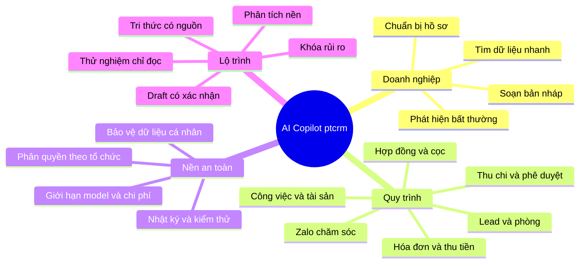
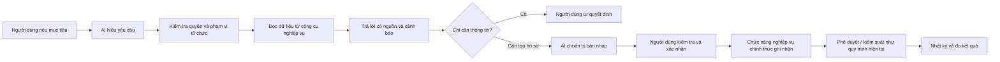
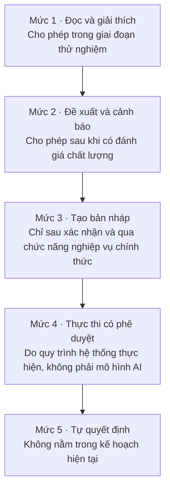
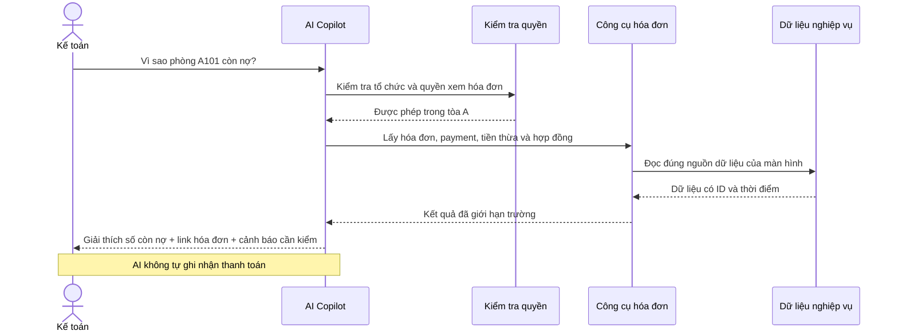
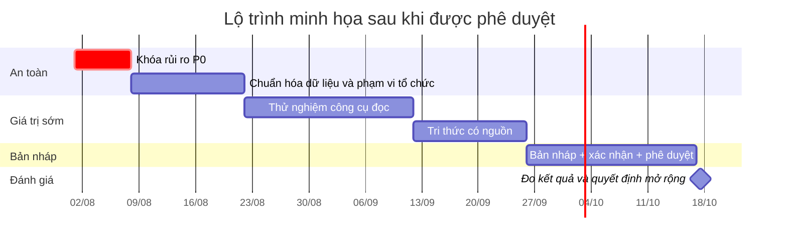
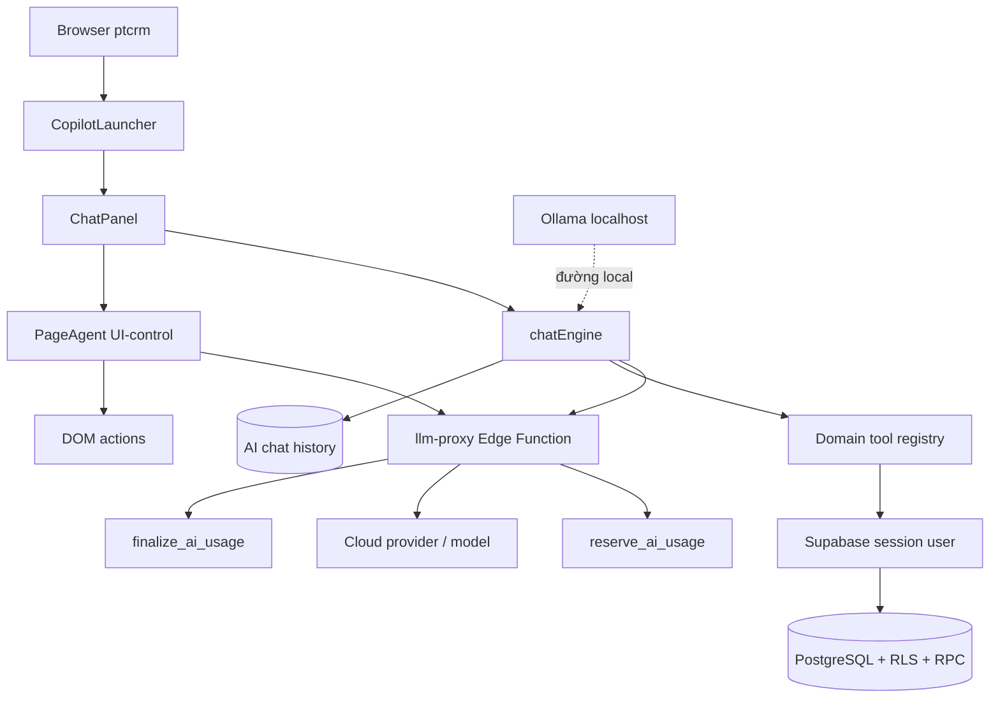
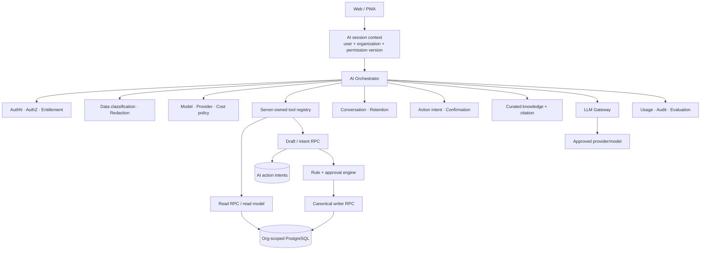
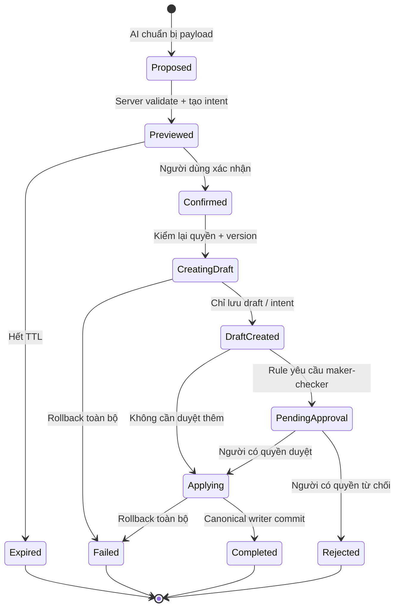
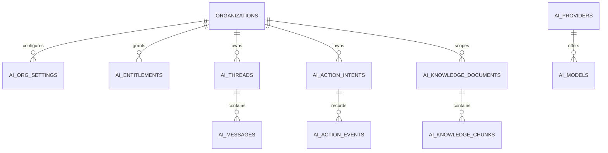
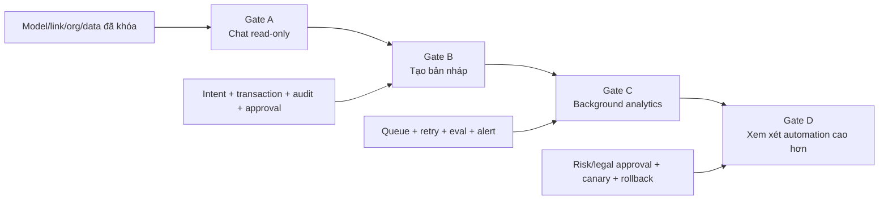

<div class="plan-hero">
  <div class="plan-eyebrow">KẾ HOẠCH PHÁT TRIỂN SẢN PHẨM</div>
  <h1>AI Copilot bám sát nghiệp vụ ptcrm</h1>
  <p class="plan-lead">Biến AI từ một ô chat thử nghiệm thành trợ lý giúp tìm thông tin, chuẩn bị hồ sơ và tạo bản nháp có kiểm soát — trong khi quyền quyết định về tiền, hợp đồng, phòng và phê duyệt vẫn thuộc về con người.</p>
  <div class="plan-actions">
    <a class="plan-action plan-action-primary" href="#phan-1-goc-nhin-doanh-nghiep">Xem phần doanh nghiệp</a>
    <a class="plan-action" href="#phan-2-phu-luc-ky-thuat">Mở phần kỹ thuật</a>
  </div>
  <div class="plan-meta">
    <span><strong>Trạng thái:</strong> đề xuất sau audit codebase</span>
    <span><strong>Đối tượng:</strong> lãnh đạo, vận hành, kế toán, kỹ thuật</span>
    <span><strong>Nguyên tắc:</strong> đọc trước, tạo bản nháp sau, người thật quyết định</span>
  </div>
</div>

::: danger Kết luận cần chốt trước
AI hiện tại phù hợp với giai đoạn thử nghiệm hỏi đáp có giới hạn, nhưng **chưa nên mở rộng quyền tự thao tác hoặc tự ghi dữ liệu**. Kế hoạch này bắt đầu bằng việc khóa các rủi ro nền tảng, sau đó mới mở rộng từng nhóm nghiệp vụ.
:::

## Tóm tắt trong một phút

<div class="plan-grid plan-grid-3">
  <div class="plan-kpi">
    <div class="plan-kpi-value">6</div>
    <div class="plan-kpi-label">công cụ đọc/hướng dẫn đang có</div>
  </div>
  <div class="plan-kpi">
    <div class="plan-kpi-value">1</div>
    <div class="plan-kpi-label">công cụ tạo phiếu nháp cần thiết kế lại</div>
  </div>
  <div class="plan-kpi">
    <div class="plan-kpi-value">3 tầng</div>
    <div class="plan-kpi-label">đọc dữ liệu → tạo bản nháp → tự động có kiểm soát</div>
  </div>
</div>

<div class="plan-grid plan-grid-3">
  <section class="plan-card">
    <h3>Giá trị gần nhất</h3>
    <p>Giảm thời gian tìm dữ liệu, giải thích số liệu, chuẩn bị checklist và tổng hợp hồ sơ cho người duyệt.</p>
  </section>
  <section class="plan-card">
    <h3>Ranh giới an toàn</h3>
    <p>AI không tự thu/hoàn tiền, đổi trạng thái phòng, ký/thanh lý hợp đồng, duyệt phiếu hoặc gửi tin khách hàng.</p>
  </section>
  <section class="plan-card">
    <h3>Điều kiện thành công</h3>
    <p>Mọi số liệu có nguồn, mọi quyền được kiểm ở server và mọi bản nháp ghi dữ liệu đi qua quy trình nghiệp vụ hiện hành.</p>
  </section>
</div>

## Bản đồ toàn kế hoạch



<hr class="plan-divider" />

## Phần 1. Góc nhìn doanh nghiệp

### 1. Vấn đề cần giải quyết

ptcrm đã có nhiều module và quy trình nối tiếp nhau: phòng, khách hàng, cọc, hợp đồng, chỉ số, hóa đơn, thu tiền, thu chi, bàn giao, lương, lợi nhuận và Zalo. Người dùng thường mất thời gian vì:

- Phải mở nhiều màn hình mới ghép đủ thông tin cho một quyết định.
- Cùng một câu hỏi nhưng kế toán, quản lý tòa và chủ doanh nghiệp cần cách giải thích khác nhau.
- Hồ sơ cần duyệt nằm rải ở phiếu, hóa đơn, hợp đồng, chứng từ và lịch sử thao tác.
- Một số lỗi chỉ được phát hiện sau khi đã nhập dữ liệu hoặc đối soát cuối kỳ.
- Tài liệu hướng dẫn kỹ thuật khó dùng trong cuộc họp nghiệp vụ.

AI phù hợp nhất khi làm **lớp hỗ trợ hiểu và chuẩn bị quyết định**, không phải lớp tự quyết định thay doanh nghiệp.

### 2. Hình ảnh tương lai



#### Điều thay đổi lớn nhất

| Trước đây | Sau khi triển khai đúng kế hoạch |
|---|---|
| Người dùng tự tìm dữ liệu qua nhiều trang | AI gom dữ liệu được quyền và đưa link nguồn |
| Người duyệt tự đọc toàn bộ hồ sơ | AI chuẩn bị bản tóm tắt, cảnh báo và checklist |
| Câu hỏi hướng dẫn phải nhớ tên màn hình | AI trả lời theo ngôn ngữ nghiệp vụ và dẫn tới đúng trang |
| Nhập liệu nháp bằng tay từ đầu | AI điền bản nháp có cấu trúc để người dùng kiểm tra |
| Phát hiện bất thường cuối kỳ | AI gợi ý kiểm tra sớm dựa trên quy tắc và lịch sử |
| AI có nguy cơ tạo luồng riêng | AI bắt buộc dùng cùng quyền, chức năng ghi nhận chính thức và quy trình phê duyệt của hệ thống |

### 3. Ai được lợi và được hỗ trợ thế nào?

<div class="plan-grid plan-grid-2">
  <section class="plan-card">
    <div class="plan-audience-label">CHỦ DOANH NGHIỆP</div>
    <h3>Nhìn nhanh tình hình và điểm cần quyết định</h3>
    <p>Hỏi tình trạng phòng, công nợ, doanh thu, hợp đồng sắp hết hạn hoặc các hồ sơ đang chờ duyệt; nhận câu trả lời kèm nguồn.</p>
  </section>
  <section class="plan-card">
    <div class="plan-audience-label">QUẢN LÝ TÒA</div>
    <h3>Giảm thời gian tổng hợp vận hành</h3>
    <p>Tìm khách/phòng/hợp đồng, chuẩn bị lịch xử lý phòng sắp trống, triage sự cố và kiểm tra hồ sơ thiếu.</p>
  </section>
  <section class="plan-card">
    <div class="plan-audience-label">KẾ TOÁN / THU NGÂN</div>
    <h3>Giải thích và đối chiếu trước khi ghi nhận</h3>
    <p>Giải thích hóa đơn, phát hiện thanh toán trùng và chuẩn bị hồ sơ chờ duyệt mà không tự ghi sổ.</p>
  </section>
  <section class="plan-card">
    <div class="plan-audience-label">SALE / CHĂM SÓC KHÁCH</div>
    <h3>Hiểu nhu cầu và soạn phản hồi nhanh</h3>
    <p>Gợi ý phòng phù hợp, tóm tắt lead, soạn tin Zalo và đề xuất bước tiếp theo để nhân viên quyết định.</p>
  </section>
</div>

### 4. Các tình huống ứng dụng theo quy trình nghiệp vụ

| Quy trình | AI nên hỗ trợ | Kết quả người dùng nhận | AI không được tự làm |
|---|---|---|---|
| Khách tiềm năng và tìm phòng | Tóm tắt nhu cầu, phát hiện khách trùng, gợi ý phòng | Danh sách phòng có lý do và link nguồn | Chuyển khách tiềm năng, giữ phòng, thu cọc |
| Cọc và hợp đồng | Danh sách kiểm tra dữ liệu, cảnh báo cọc thiếu/phòng xung đột | Hồ sơ kiểm tra trước khi ký | Tạo/kích hoạt/thanh lý hợp đồng |
| Chỉ số và hóa đơn | Phát hiện số bất thường, giải thích cấu thành hóa đơn | Danh sách cần kiểm và giải thích theo nguồn | Duyệt chỉ số, sửa tiền, phát hành hóa đơn |
| Thu tiền | Đề xuất đối chiếu, cảnh báo thanh toán trùng | Bản xem trước cách phân bổ giữa hóa đơn và thanh toán | Thu, hoàn hoặc hoàn tác tiền |
| Thu chi và phê duyệt | Phân loại hạng mục, chuẩn bị hồ sơ chờ duyệt | Bản nháp và danh sách kiểm tra cho người lập - người duyệt | Duyệt, từ chối, ghi sổ |
| Bàn giao và đối soát | Tóm tắt chênh lệch và chứng từ thiếu | Danh sách nguyên nhân cần kiểm | Xác nhận hoặc hủy bàn giao |
| Công việc và tài sản | Phân loại sự cố, gợi ý thời hạn xử lý và người phù hợp | Bản nháp công việc và cảnh báo bảo trì | Hoàn thành công việc có thưởng, xóa tài sản |
| Lương và lợi nhuận | Giải thích công thức, phát hiện số bất thường | Bảng giải thích theo sổ dữ liệu đã khóa | Khóa kỳ, chi lương, chia lợi nhuận |
| Zalo | Phân loại ý định, tóm tắt, soạn phản hồi | Tin nháp để nhân viên duyệt | Gửi tin hoặc cam kết với khách |

### 5. Mức tự động hóa được phép



<div class="plan-risk is-high">
  <strong>Ranh giới đỏ:</strong> AI không tự đổi trạng thái tiền, hợp đồng, phòng, quyền truy cập, phê duyệt, bàn giao hoặc tin nhắn đã gửi. Những hành động này chỉ xảy ra khi người có trách nhiệm thao tác và hệ thống kiểm tra lại đầy đủ quyền cùng điều kiện nghiệp vụ.
</div>

### 6. Ví dụ trải nghiệm người dùng

#### Tình huống: kế toán hỏi về một hóa đơn chưa thu đủ



#### Ví dụ phản hồi dùng trong buổi demo

<section class="plan-card">
  <div class="plan-audience-label">MINH HỌA · KHÔNG DÙNG DỮ LIỆU THẬT</div>
  <p><strong>Người dùng hỏi:</strong> “Vì sao phòng A101 còn nợ trong tháng này?”</p>
  <h4>AI trả lời theo cấu trúc có thể kiểm tra</h4>
  <ul>
    <li><strong>Kết luận ngắn:</strong> hóa đơn còn thiếu 1.200.000 đồng sau lần thu gần nhất.</li>
    <li><strong>Giải thích:</strong> hiển thị từng khoản phải thu, đã thu và khoản chưa được đối chiếu.</li>
    <li><strong>Nguồn:</strong> link tới hóa đơn, hợp đồng và lịch sử thanh toán mà người dùng có quyền xem.</li>
    <li><strong>Bước tiếp theo:</strong> đề nghị kế toán kiểm tra giao dịch chưa đối chiếu; AI không tự ghi nhận tiền.</li>
  </ul>
</section>

#### Tình huống: quản lý muốn tạo một phiếu chi

1. Quản lý mô tả mục đích, số tiền, tòa và hạng mục.
2. AI kiểm tra dữ liệu bắt buộc và rule/ngưỡng phê duyệt.
3. Hệ thống tạo **preview có cấu trúc**, chưa ghi dữ liệu.
4. Quản lý kiểm tra và bấm xác nhận thật.
5. Hệ thống chỉ lưu khi toàn bộ dữ liệu hợp lệ; nếu có lỗi thì không để lại hồ sơ dở dang, đồng thời mở yêu cầu duyệt khi cần.
6. Người duyệt xem tại [Chờ duyệt](/03-quan-ly-van-hanh/cho-duyet/).

### 7. Lộ trình đề xuất

<div class="plan-phase-strip">
  <div class="plan-phase"><strong>0 · Khóa rủi ro</strong><br />Tắt chế độ AI tự thao tác giao diện, chặn mô hình lạ và khóa đường ghi dữ liệu.</div>
  <div class="plan-phase"><strong>1 · Nền an toàn</strong><br />Quyền theo tổ chức, dữ liệu, nhà cung cấp AI, nhật ký và nguồn dữ liệu chuẩn.</div>
  <div class="plan-phase"><strong>2 · Chỉ đọc</strong><br />Mở rộng công cụ đọc theo từng quy trình.</div>
  <div class="plan-phase"><strong>3 · Tri thức có nguồn</strong><br />Tài liệu có phiên bản, phạm vi người đọc và nguồn trích dẫn.</div>
  <div class="plan-phase"><strong>4 · Bản nháp</strong><br />Xác nhận rõ ràng, ghi nhận qua chức năng chính thức và chuyển duyệt.</div>
</div>



::: info
Lộ trình trên là mô hình trình bày theo thứ tự phụ thuộc, không phải ngày cam kết. Ngày thật được chốt sau khi xác nhận nguồn lực và hoàn tất kiểm tra dữ liệu nền.
:::

### 8. Kết quả cần đo

| Mục tiêu | Cách đo | Nguồn đo |
|---|---|---|
| Tìm thông tin nhanh hơn | Thời gian từ câu hỏi đến khi mở đúng hồ sơ | Nhật ký sử dụng và lượt mở hồ sơ |
| Số liệu trả lời đúng | Tỷ lệ khớp 100% với báo cáo nguồn | Bộ câu hỏi kiểm tra chuẩn |
| Giảm hồ sơ thiếu | Tỷ lệ bản nháp bị trả lại vì thiếu thông tin | Nhật ký kiểm tra bản nháp |
| Không vượt quyền | Số lần AI trả dữ liệu ngoài phạm vi người dùng | Bắt buộc bằng 0 |
| Không ghi nhầm | Số lần lưu dở dang hoặc tự thực hiện hành động bị cấm | Bắt buộc bằng 0 |
| Kiểm soát chi phí | Chi phí dự kiến so với hóa đơn nhà cung cấp AI | Đối chiếu theo tháng |
| Người dùng tin tưởng | Tỷ lệ câu trả lời có nguồn và phản hồi hữu ích | Thống kê nguồn và phản hồi |

### 9. Quyết định doanh nghiệp cần chốt

1. Tổ chức và nhóm người dùng nào được tham gia thử nghiệm đầu tiên?
2. Dữ liệu nào được phép gửi tới dịch vụ AI bên ngoài: tên, điện thoại, địa chỉ, hợp đồng, tài chính, ảnh?
3. Lưu lịch sử chat bao lâu và ai được xóa/xuất dữ liệu?
4. AI có được tạo phiếu nháp ở mọi hạng mục hay chỉ hạng mục thường?
5. Tin Zalo nháp nào cần thêm người kiểm tra thứ hai?
6. Mục tiêu thời gian, chất lượng và chi phí cho từng nhóm nhu cầu sử dụng là bao nhiêu?
7. Có cho phép mô hình AI chạy nội bộ trong môi trường thật hay không?

#### Bảng chốt trước khi bắt đầu

| Nhóm quyết định | Vai trò chịu trách nhiệm chốt | Thời điểm cần chốt | Trạng thái mẫu |
|---|---|---|---|
| Phạm vi đơn vị và người dùng thử nghiệm | Chủ doanh nghiệp / Product Owner | Trước giai đoạn 0 | Chờ chốt |
| Dữ liệu được gửi tới dịch vụ AI | Chủ dữ liệu / phụ trách bảo mật | Trước giai đoạn 1 | Chờ chốt |
| Chỉ số thành công và ngân sách | Chủ doanh nghiệp / tài chính | Trước khi mở thử nghiệm | Chờ chốt |
| Quyền tạo bản nháp và quy trình duyệt | Chủ quy trình / quản lý vận hành | Trước giai đoạn 4 | Chờ chốt |
| Link môi trường demo và kịch bản trình bày | Quản lý dự án | Trước buổi duyệt kế hoạch | Chưa gắn link |

<hr class="plan-divider" />

## Phần 2. Phụ lục kỹ thuật

Phần này dành cho đội phát triển, bảo mật và vận hành. Người đọc nghiệp vụ có thể dừng ở phần trên mà vẫn hiểu đầy đủ kế hoạch.

### 10. Hiện trạng kỹ thuật



#### Thành phần đang có

| Thành phần | Vai trò hiện tại | Ghi chú |
|---|---|---|
| `src/copilot/ChatPanel.tsx` | UI chat, model selector, voice, UI-control toggle | Render Markdown tối giản |
| `src/copilot/chatEngine.ts` | Tool loop, context, persistence | Tối đa 6 vòng tool |
| `src/copilot/tools/registry.ts` | 6 read/help tool + navigation + write tool | Lọc theo permission client |
| `src/copilot/createAgent.ts` | PageAgent điều khiển DOM | Experimental |
| `supabase/functions/llm-proxy` | JWT, provider routing, quota, usage | OpenAI-compatible gateway |
| Bảng `ai_*` | setting, entitlement, provider, usage, chat, audit | Org rollout chưa hoàn chỉnh |
| `worker/index.js` | Zalo transport + watchdog | Hiện giữ service-role và session Zalo |

### 11. Năm điểm phải xử lý trước

#### 11.1 UI-control chưa deny-by-default

Guard hiện tìm nút nguy hiểm bằng text/ARIA. Một switch hoặc nút icon không có nhãn có thể lọt qua và ghi dữ liệu ngay. Thiết kế mới:

- Tắt UI-control production trong giai đoạn đầu.
- Mặc định không index bất kỳ interactive element nào.
- Chỉ element gắn capability rõ như `data-ai-allow="filter"` mới được tương tác.
- PageAgent không được nhận write tools.

#### 11.2 Proxy chưa khóa model theo allowlist

Provider được kiểm, nhưng model ID chưa bắt buộc phải có trong registry. Model lạ có thể bị tính giá 0. Cần reject unknown model trước khi reserve và forward.

#### 11.3 Link do model sinh chưa được sanitize

`MiniMarkdown` phải chỉ cho route nội bộ hoặc HTTPS domain đã duyệt; chặn `javascript:`, `data:`, protocol-relative và URL giả mạo.

#### 11.4 Write tool đi direct DML

AI đang insert audit, voucher và item bằng nhiều request. Cần thay bằng một canonical RPC transaction, không để partial commit và không bypass birth policy/approval engine.

#### 11.5 Database source of truth bị chia đôi

Một số writer mới sống trong prepared SQL/prod snapshot nhưng chưa nằm trọn trong migration chain. Trước khi xây tool mới phải baseline schema và chứng minh restore từ DB trắng.

### 12. Kiến trúc mục tiêu



#### Nguyên tắc phân lớp

- Browser trình bày và nhận input; không giữ authority nghiệp vụ.
- Orchestrator quyết model/tool/data policy và gắn organization context.
- Read tools lấy live facts qua RPC/query giống UI.
- Draft tools chỉ tạo intent hoặc bản nháp, chưa tạo tác động được bảo vệ.
- Rule/approval engine, không phải model, quyết định có cần người duyệt và khi nào được phép áp dụng.
- Canonical writer chỉ commit sau khi rule cho phép hoặc người có quyền đã duyệt.
- Knowledge chỉ phục vụ SOP/chính sách; số vận hành luôn lấy từ tool.

### 13. Vòng đời một hành động AI



`DraftCreated` chỉ được lưu bản nháp hoặc ý định hành động; chưa được ghi sổ, đổi trạng thái hợp đồng/phòng hay tạo tác động tài chính. Trạng thái `Completed` chỉ xuất hiện sau khi rule cho phép hoặc người có quyền đã duyệt và writer chính thức commit thành công.

#### Dữ liệu intent tối thiểu

```text
organization_id
user_id
tool_name + version
canonical_payload
payload_hash
status + expires_at
confirmation_method
writer_operation_id
entity_type + entity_id
```

### 14. Contract chuẩn cho tool

| Thuộc tính | Mục đích |
|---|---|
| `mode: READ | DRAFT | COMMAND` | Xác định mức tác động |
| `risk` | Cho phép hoặc cấm model tự gọi |
| `requiredPermission` | Đồng bộ module/action hiện có |
| `requiredScopes` | Organization, building, account, entity |
| `allowedFeatures` | Chat hay UI-control |
| Input/output schema | Không parse prose để ghi DB |
| Data classes | Quyết định redaction/provider |
| Writer RPC | Command nghiệp vụ duy nhất được phép |
| Confirmation/approval flags | Ép đúng workflow người thật |
| Row/timeout limits | Chống query quá rộng và treo request |

### 15. Thiết kế dữ liệu cần bổ sung



#### Khác biệt so với schema hiện tại

- Entitlement chuyển từ chỉ `user_id` sang `(organization_id, user_id)`.
- Thread/message/usage/audit bắt buộc có organization.
- Model tách thành registry có capability, price và data policy.
- Audit action là append-only, không cho client update.
- Knowledge có audience, sensitivity, revision và effective date.

### 16. Kế hoạch triển khai theo module

| Giai đoạn | Module chính | Thay đổi |
|---|---|---|
| P0 | `ChatPanel`, `createAgent`, `registry`, `llm-proxy` | Tắt UI-control, sanitize link, allowlist model, bỏ write khỏi PageAgent |
| P1 | AI migrations, proxy, chat context | Organization bắt buộc, settings/entitlement/quota theo org |
| P1 | Migration/release workflow | Hợp nhất source of truth và restore test |
| P1 | Orchestrator/tool runtime | Capability manifest, request limits, data classification |
| P2 | Domain tools | Lead, room, contract, invoice, payment, approval, task, Zalo read tools |
| P3 | Knowledge | Corpus đã duyệt, FTS/embedding, citation và freshness |
| P4 | Intent/writer | Preview, confirmation, canonical RPC, approval integration |
| P5 | Background jobs | Anomaly queue, retention, usage reconciliation, eval runs |

### 17. Ma trận kiểm thử bắt buộc

| Nhóm test | Trường hợp chính | Điều kiện pass |
|---|---|---|
| Quyền và tổ chức | User org A hỏi dữ liệu org B | Không trả bất kỳ row nào |
| Model/provider | Model không có trong registry | Bị reject trước upstream |
| Chi phí | Provider không trả usage | Giữ reserved cost, không ghi 0 |
| UI-control | Click switch/nút icon mutation | Agent không nhìn thấy hoặc không click được |
| Link | `javascript:`/`data:`/external giả | Không render thành link có thể chạy |
| Draft write | Item/audit/writer lỗi giữa chừng | Rollback toàn bộ |
| Idempotency | Retry cùng intent | Trả cùng entity, không tạo trùng |
| Confirmation | Model tự gửi `confirmed=true` | Server từ chối nếu thiếu user proof |
| Numeric parity | Doanh thu/công nợ/phòng trống | Khớp 100% RPC/report nguồn |
| Prompt injection | Chỉ thị độc hại trong tên/ghi chú | Không đổi tool/permission/action |

### 18. Gate để chuyển giai đoạn



#### Gate A — mở rộng chat read-only

- Unknown model và unsafe link đã bị chặn.
- UI-control đang tắt.
- Cross-org negative tests pass.
- Công cụ số liệu khớp report nguồn.
- Có retention và xóa lịch sử tối thiểu.

#### Gate B — cho tạo bản nháp

- Không còn direct DML từ AI.
- Intent và confirmation server-side.
- Writer transaction, idempotency và rollback pass.
- Audit append-only.
- Approval engine nhận đúng rule/hạng mục/ngưỡng.

#### Gate C — cho job nền

- Queue có lease, retry, dead-letter.
- Model/tool/prompt version được pin.
- Có dashboard, alert và eval định kỳ.

### 19. Risk register

| Mức | Rủi ro | Ảnh hưởng | Hướng xử lý |
|---|---|---|---|
| P0 | UI-control mutation ngoài guard | Đổi dữ liệu vận hành | Tắt và chuyển sang allowlist |
| P0 | Model ngoài allowlist | Mất kiểm soát chi phí/chất lượng | Validate server-side |
| P0 | Link model độc hại | XSS/phishing/session risk | URL sanitizer + CSP |
| P0 | AI write không transaction | Partial commit/sai audit | Canonical RPC |
| P0 | DB source of truth phân mảnh | Môi trường lệch production | Baseline + restore test |
| P1 | Org context thiếu | Lẫn lịch sử/phạm vi tenant | Org bắt buộc end-to-end |
| P1 | PII/data policy hẹp | Dữ liệu không cần thiết ra cloud | Classification + minimization |
| P1 | Confirmation chỉ bằng prompt | Model tự xác nhận | Action intent server-side |
| P1 | Worker Zalo giữ service-role | Blast radius lớn | Least privilege + RPC |
| P2 | Eval/observability mỏng | Khó biết AI đúng hoặc sai | Golden cases + telemetry |

### 20. Kịch bản demo thuyết trình 10 phút

1. **1 phút — Bối cảnh:** ptcrm có nhiều quy trình liên thông, người dùng mất thời gian ghép dữ liệu.
2. **2 phút — Tầm nhìn:** AI đọc dữ liệu được quyền, đưa nguồn và chuẩn bị quyết định.
3. **2 phút — Tình huống ứng dụng:** lead/phòng, hóa đơn/thu tiền, phê duyệt và tin Zalo nháp.
4. **1 phút — Ranh giới:** AI không tự chạm tiền, hợp đồng, phòng, quyền hoặc phê duyệt.
5. **2 phút — Kiến trúc:** lớp điều phối, công cụ nghiệp vụ, chức năng ghi nhận và quy trình duyệt.
6. **1 phút — Lộ trình:** khóa rủi ro → chỉ đọc → tri thức có nguồn → bản nháp.
7. **1 phút — Quyết định cần chốt:** đơn vị thử nghiệm, dữ liệu được gửi ra ngoài, chỉ số đo và nguồn lực.

### 21. Tài liệu liên quan trên site

- [Hướng dẫn sử dụng Trợ lý AI](/05-cai-dat/tro-ly-ai/)
- [Quy trình Chờ duyệt](/03-quan-ly-van-hanh/cho-duyet/)
- [Quy trình Thu chi](/03-quan-ly-van-hanh/thu-chi/)
- [Quy trình Thu tiền tại hóa đơn](/03-quan-ly-van-hanh/thu-tien-hoa-don/)
- [Chat Zalo](/03-quan-ly-van-hanh/chat-zalo/)
- [Mẫu kế hoạch phát triển khác](/08-ke-hoach-phat-trien/mau-plan/)

<div class="plan-callout">
  <strong>Thông điệp cuối:</strong> AI chỉ tạo giá trị bền vững khi nó dùng đúng dữ liệu, đúng quyền và đúng quy trình của doanh nghiệp. Mục tiêu của kế hoạch không phải làm AI “tự động hơn” nhanh nhất, mà là làm AI “hữu ích hơn và kiểm soát được” ở từng bước.
</div>
