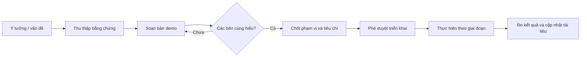

  
PHÒNG TRÌNH BÀY KẾ HOẠCH

  <h1>Demo kế hoạch phát triển</h1>
  
Nơi mở một kế hoạch để thuyết trình ngay hoặc in thành báo cáo: mục tiêu kinh doanh, quy trình tương lai, kiến trúc hệ thống, lộ trình triển khai, rủi ro và tiêu chí nghiệm thu.

  

    <a class="plan-action plan-action-primary" href="/08-ke-hoach-phat-trien/quy-trinh-chi-phi/">Xem quy trình chi phí</a>
    <a class="plan-action" href="/08-ke-hoach-phat-trien/ai-copilot/">Xem kế hoạch AI Copilot</a>
  

::: info Đây là khu demo, không phải cam kết triển khai
Mỗi trang thể hiện một phương án để lãnh đạo, nghiệp vụ và kỹ thuật cùng xem trước. Phạm vi, ngân sách và ngày triển khai chỉ trở thành cam kết sau khi được phê duyệt chính thức.
:::

## Cách đọc một kế hoạch

  <section class="plan-card">
    
01

    <h3>Góc nhìn doanh nghiệp</h3>
    
Vấn đề hiện tại, quy trình sẽ thay đổi thế nào, ai được lợi và điều gì vẫn cần con người quyết định.

  </section>
  <section class="plan-card">
    
02

    <h3>Mô hình trực quan</h3>
    
Sơ đồ luồng, kiến trúc, trạng thái, timeline và ma trận rủi ro để dùng trực tiếp khi họp hoặc thuyết trình.

  </section>
  <section class="plan-card">
    
03

    <h3>Phụ lục kỹ thuật</h3>
    
Module bị ảnh hưởng, nguyên tắc dữ liệu, bảo mật, kiểm thử và điều kiện để chuyển sang giai đoạn tiếp theo.

  </section>

## Kế hoạch đang có

  <a class="plan-card plan-card-link" href="/08-ke-hoach-phat-trien/quy-trinh-chi-phi/">
    
TÀI CHÍNH · PHÊ DUYỆT · SỔ QUỸ

    <h3>Ghi nhận chi phí đúng kỳ, duyệt trước khi xuất tiền</h3>
    
Tách rõ chi phí trên báo cáo lợi nhuận, quyền duyệt thanh toán, tiền thực tế rời sổ quỹ và điều kiện chốt kỳ.

    Mở artifact nghiệp vụ →
  </a>
  <a class="plan-card plan-card-link" href="/08-ke-hoach-phat-trien/ai-copilot/">
    
AI · VẬN HÀNH · TÀI CHÍNH

    <h3>AI Copilot bám sát nghiệp vụ ptcrm</h3>
    
Đưa AI từ công cụ hỏi đáp thử nghiệm thành trợ lý đọc dữ liệu, chuẩn bị hồ sơ và tạo bản nháp an toàn, không vượt quyền người dùng.

    Mở bản trình bày →
  </a>
  <a class="plan-card plan-card-link" href="/08-ke-hoach-phat-trien/mau-plan/">
    
MẪU TÁI SỬ DỤNG

    <h3>Khung kế hoạch dự án mới</h3>
    
Mẫu nội dung chuẩn để thêm kế hoạch mới mà vẫn giữ cùng cấu trúc trình bày, biểu đồ, phần nghiệp vụ và phần kỹ thuật.

    Xem cấu trúc mẫu →
  </a>

## Vòng đời một bản kế hoạch

## Khi tạo một plan mới

1. Sao chép cấu trúc tại [Mẫu kế hoạch mới](/08-ke-hoach-phat-trien/mau-plan/).
2. Viết phần **nghiệp vụ** trước: vấn đề, người tham gia, quy trình hiện tại và quy trình mong muốn.
3. Chỉ thêm biểu đồ khi biểu đồ giúp người xem hiểu nhanh hơn phần chữ.
4. Tách phần **kỹ thuật** thành mục riêng để người không làm kỹ thuật vẫn đọc được toàn bộ phần chính.
5. Ghi rõ đâu là hiện trạng đã kiểm chứng, đâu là đề xuất và đâu là quyết định còn chờ.
6. Thêm trang vào sidebar để người dùng có thể truy cập trực tiếp trên site tài liệu.

## Bộ biểu đồ nên có

| Câu hỏi cần trả lời | Biểu đồ phù hợp |
|---|---|
| Hệ thống hiện tại hoạt động ra sao? | Sơ đồ kiến trúc hoặc luồng dữ liệu |
| Quy trình doanh nghiệp sẽ thay đổi thế nào? | Swimlane hoặc flowchart trước/sau |
| Giao diện hoặc trải nghiệm dự kiến trông ra sao? | Ảnh chụp, wireframe hoặc mockup trước/sau |
| Ai quyết định ở mỗi bước? | Sequence diagram hoặc ma trận trách nhiệm |
| Dự án triển khai theo thứ tự nào? | Timeline/Gantt theo giai đoạn |
| Hành động nào AI được hoặc không được làm? | Ma trận mức tự động hóa |
| Khi nào được chuyển sang giai đoạn tiếp theo? | State diagram và checklist gate |

  <strong>Nguyên tắc trình bày:</strong> một sơ đồ tốt phải giúp người xem ra quyết định. Nếu sơ đồ chỉ lặp lại phần chữ, hãy bỏ sơ đồ đó.

