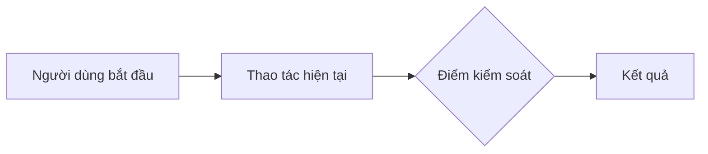
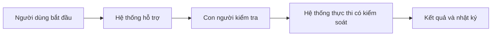
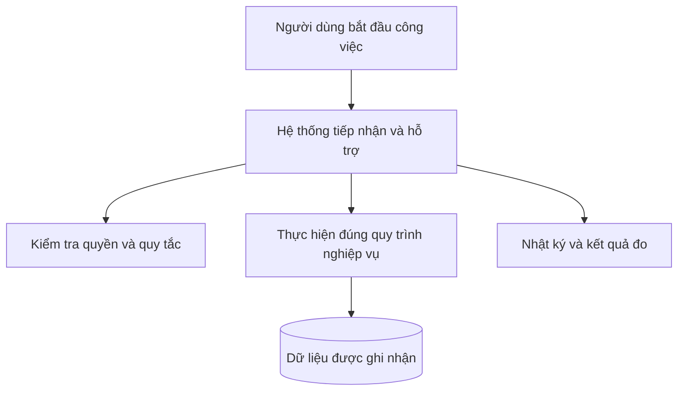
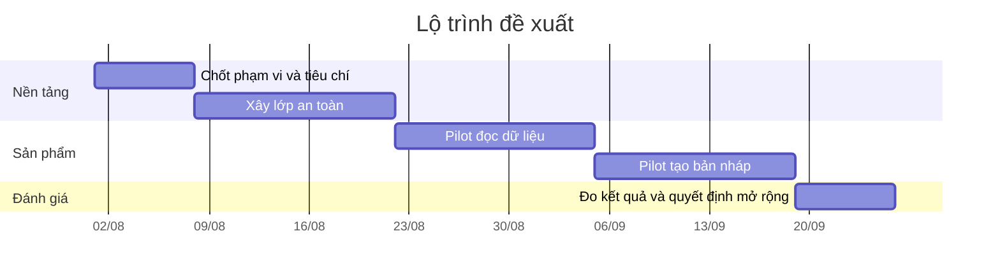

<div class="plan-hero plan-hero-compact">
  <div class="plan-eyebrow">MẪU TÁI SỬ DỤNG</div>
  <h1>Kế hoạch phát triển: [Tên dự án]</h1>
  <p class="plan-lead">Dùng cấu trúc này để biến một Markdown kỹ thuật thành bản trình bày mà lãnh đạo, nghiệp vụ và đội phát triển có thể cùng đọc.</p>
</div>

::: warning Cách dùng mẫu
Tạo thư mục mới dưới `docs/huong-dan-su-dung/08-ke-hoach-phat-trien/<ten-plan>/index.md`, sao chép các mục cần thiết và thêm link vào `docs-site/.vitepress/sidebar.mts`.
:::

## 1. Tóm tắt một trang

<div class="plan-grid plan-grid-3">
  <div class="plan-kpi">
    <div class="plan-kpi-label">Vấn đề cần giải quyết</div>
    <div class="plan-kpi-value">[1 câu]</div>
  </div>
  <div class="plan-kpi">
    <div class="plan-kpi-label">Kết quả mong muốn</div>
    <div class="plan-kpi-value">[1 câu]</div>
  </div>
  <div class="plan-kpi">
    <div class="plan-kpi-label">Quyết định cần chốt</div>
    <div class="plan-kpi-value">[1 câu]</div>
  </div>
</div>

### Nội dung cần viết

- Vì sao dự án cần được làm lúc này?
- Ai đang gặp vấn đề?
- Nếu không làm thì rủi ro gì?
- Thành công được đo bằng chỉ số nào?
- Ai có quyền chốt, cần chốt trước thời điểm nào và link demo nằm ở đâu?

## 2. Quy trình doanh nghiệp

### Hiện tại



### Tương lai



### Bảng thay đổi

| Vai trò | Hiện tại | Sau dự án | Quyết định vẫn thuộc con người |
|---|---|---|---|
| [Vai trò 1] | [Mô tả] | [Mô tả] | [Mô tả] |
| [Vai trò 2] | [Mô tả] | [Mô tả] | [Mô tả] |

## 3. Phạm vi

<div class="plan-grid plan-grid-2">
  <section class="plan-card plan-card-positive">
    <h3>Trong phạm vi</h3>
    <ul>
      <li>[Use case 1]</li>
      <li>[Use case 2]</li>
      <li>[Use case 3]</li>
    </ul>
  </section>
  <section class="plan-card plan-card-negative">
    <h3>Chưa làm trong giai đoạn này</h3>
    <ul>
      <li>[Ngoài phạm vi 1]</li>
      <li>[Ngoài phạm vi 2]</li>
      <li>[Ngoài phạm vi 3]</li>
    </ul>
  </section>
</div>

## 4. Hình ảnh, mockup và bản đồ màn hình

Chỉ dùng phần này khi hình ảnh giúp người xem hiểu nhanh hơn phần chữ. Ưu tiên cặp **hiện tại / đề xuất**, có chú thích rõ điều cần quan sát.

<div class="plan-grid plan-grid-2">
  <section class="plan-card">
    <div class="plan-card-icon">01</div>
    <h3>Hình ảnh hiện trạng</h3>
    <p>[Thay bằng ảnh chụp màn hình, bản đồ hành trình hoặc sơ đồ bố cục đang có. Ghi rõ điểm gây chậm, sai hoặc khó kiểm soát.]</p>
  </section>
  <section class="plan-card">
    <div class="plan-card-icon">02</div>
    <h3>Mockup đề xuất</h3>
    <p>[Thay bằng wireframe hoặc hình minh họa trải nghiệm mới. Ghi rõ quyết định nào người xem cần góp ý.]</p>
  </section>
</div>

Ảnh dùng trên site đặt trong thư mục `images/` cạnh file plan, ưu tiên WebP và luôn có mô tả thay thế:

```md
Đường dẫn ảnh: ./images/ten-hinh.webp
Mô tả thay thế: [Điều người xem cần quan sát]
```

## 5. Mô hình giải pháp ở mức doanh nghiệp

Trong phần chính, chỉ mô tả các khối mà người làm nghiệp vụ cần hiểu: ai sử dụng, hệ thống hỗ trợ bước nào, điểm kiểm soát nằm ở đâu và dữ liệu nào được tạo ra. Component, API, migration và chi tiết database đặt tại **Phụ lục kỹ thuật**.



Giải thích sơ đồ bằng 3–5 gạch đầu dòng, không lặp lại tên các node.

## 6. Lộ trình



::: info
Ngày trong biểu đồ mẫu chỉ để minh họa. Khi dùng thật, thay bằng mốc đã được chủ dự án xác nhận.
:::

## 7. Rủi ro và cách kiểm soát

| Rủi ro | Ảnh hưởng | Cách kiểm soát | Dấu hiệu đã an toàn |
|---|---|---|---|
| [Rủi ro 1] | Cao | [Biện pháp] | [Test/KPI] |
| [Rủi ro 2] | Trung bình | [Biện pháp] | [Test/KPI] |

## 8. Điều kiện nghiệm thu

- [ ] Quy trình nghiệp vụ đã được chủ quy trình xác nhận.
- [ ] Phân quyền và dữ liệu nhạy cảm đã được kiểm thử âm bản.
- [ ] Có cách tắt/rollback khi phát hiện lỗi.
- [ ] KPI trước và sau triển khai được đo cùng nguồn dữ liệu.
- [ ] Tài liệu hướng dẫn và runbook đã cập nhật.

## 9. Phụ lục kỹ thuật

Đặt chi tiết file, module, migration, API, schema, test và deployment ở đây. Người đọc nghiệp vụ có thể dừng trước mục này mà vẫn hiểu đầy đủ kế hoạch.

| Thành phần | Hiện trạng | Thay đổi dự kiến | Cách kiểm thử |
|---|---|---|---|
| Frontend | [Mô tả] | [Mô tả] | [Test] |
| Backend/RPC | [Mô tả] | [Mô tả] | [Test] |
| Database | [Mô tả] | [Mô tả] | [Test] |
| Vận hành | [Mô tả] | [Mô tả] | [Test] |

## 10. Kịch bản thuyết trình

1. **1 phút:** vấn đề và tác động kinh doanh.
2. **2 phút:** quy trình hiện tại so với tương lai.
3. **2 phút:** phạm vi và lộ trình.
4. **1 phút:** rủi ro lớn nhất và cách khóa.
5. **1 phút:** quyết định cần người xem chốt.
