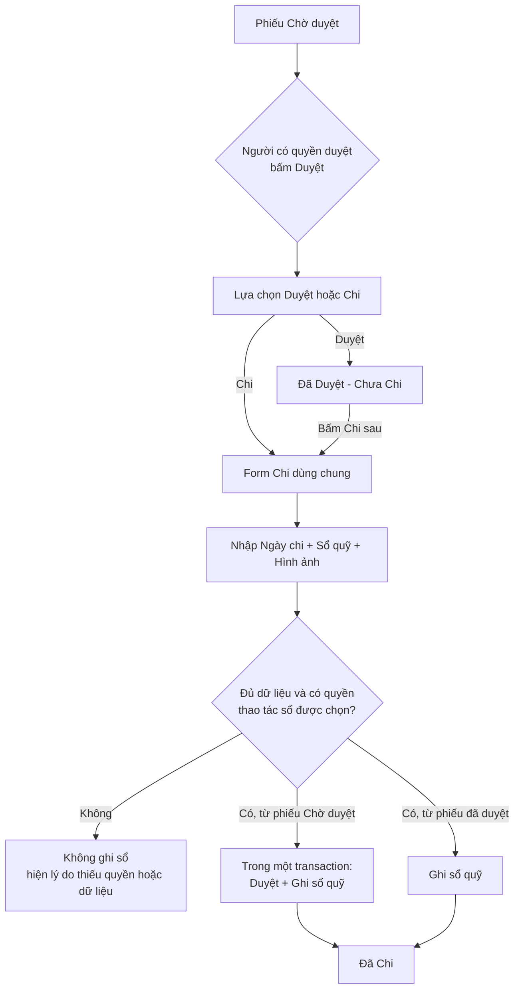
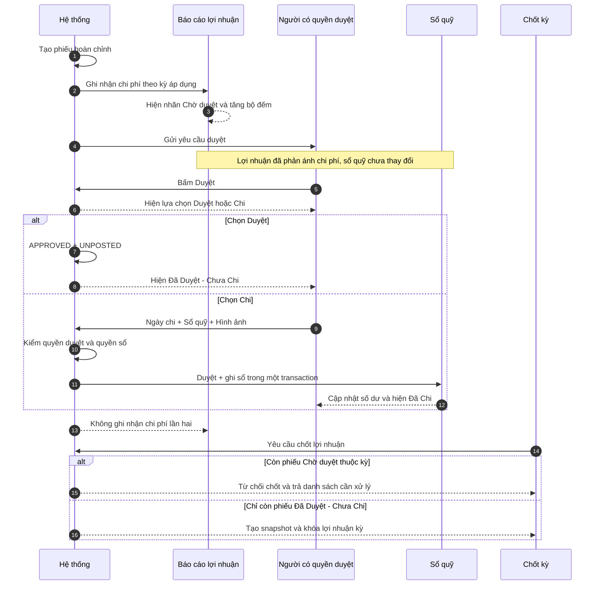
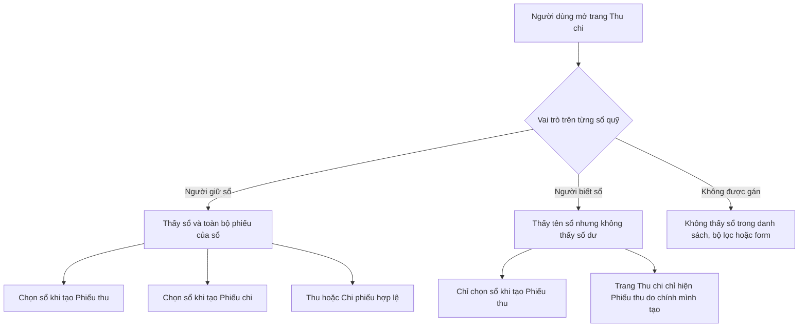
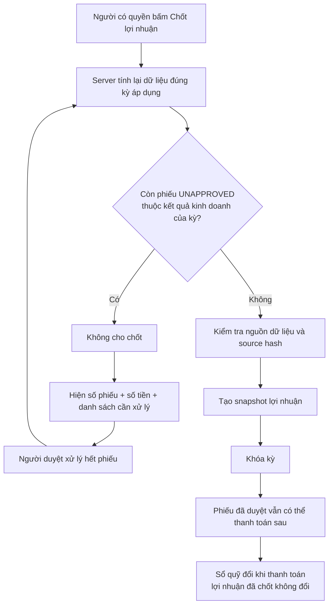
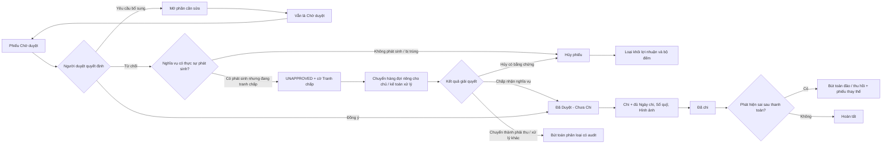

  
ARTIFACT NGHIỆP VỤ TÀI CHÍNH

  <h1>Ghi nhận đúng kỳ, duyệt đúng quyền, chỉ lộ đúng sổ quỹ</h1>
  
Quy trình mục tiêu tách bốn việc đang bị gộp hoặc mở quá rộng: khoản thu chi thuộc kỳ nào, ai được duyệt, khi nào tiền thực tế vào/ra quỹ và mỗi người được nhìn thấy sổ cùng giao dịch nào.

  

    <a class="plan-action plan-action-primary" href="#flow-duyet-va-chi">Xem flow duyệt và chi</a>
    <a class="plan-action" href="#phan-quyen-so-quy-va-trang-thu-chi">Xem quyền sổ quỹ</a>
  

  

    <strong>Đã chốt:</strong> bỏ khái niệm Nháp
    <strong>Đã chốt:</strong> Đã Duyệt - Chưa Chi không chặn kỳ
    <strong>Đã chốt:</strong> quyền sổ quỹ được cấp theo từng người
  

::: warning Trạng thái tài liệu
Flow chính và phạm vi giai đoạn đầu đã được chốt là chỉ chi đủ một lần. Phạm vi người duyệt và cách phân loại quyền dữ liệu cũ vẫn cần quyết định trước migration. Tài liệu chưa khẳng định hệ thống hiện tại đã vận hành theo flow này.
:::

## Tóm tắt trong một phút

  

    
0 phiếu

    
Chờ duyệt thuộc kỳ là điều kiện để được chốt lợi nhuận

  

  

    
2 lựa chọn

    
Duyệt hoặc Chi ngay trong cùng điểm phê duyệt

  

  

    
2 vai trò

    
Người giữ sổ · Người biết sổ, cấp riêng trên từng sổ quỹ

  

  <section class="plan-card">
    
LN

    <h3>Báo cáo lợi nhuận</h3>
    
Ghi nhận chi phí khi nghĩa vụ đã phát sinh và phân bổ vào đúng kỳ áp dụng, không chờ tới ngày trả tiền.

  </section>
  <section class="plan-card">
    
D

    <h3>Phê duyệt</h3>
    
Chủ hoặc người có thẩm quyền quyết định quản lý có được phép thanh toán khoản chi hay không.

  </section>
  <section class="plan-card">
    
Q

    <h3>Sổ quỹ</h3>
    
Chỉ giảm khi người được giao xác nhận tiền đã thực sự được chi từ một sổ quỹ cụ thể.

  </section>

## Quyết định nghiệp vụ đã chốt

  <strong>Không còn trạng thái Nháp.</strong> Mọi phiếu được tạo phải đủ thông tin tối thiểu để xử lý. <code>UNAPPROVED</code> luôn được gọi và hiển thị là <strong>Chờ duyệt</strong>.

- Phiếu chờ duyệt chưa làm thay đổi số dư sổ quỹ.
- Phiếu chờ duyệt **được hệ thống xác định là nghĩa vụ đã phát sinh** được đưa vào báo cáo lợi nhuận theo kỳ áp dụng.
- Riêng trạng thái `UNAPPROVED` không đủ để kết luận một phiếu thuộc lợi nhuận; quy tắc ghi nhận KQKD phải do server xác định độc lập.
- Báo cáo phải cho biết rõ số phiếu và số tiền đang chờ duyệt.
- Còn phiếu chờ duyệt thuộc kết quả kinh doanh của kỳ thì không được chốt lợi nhuận.
- Phiếu đã duyệt nhưng chưa thanh toán hiển thị đúng nhãn **Đã Duyệt - Chưa Chi** và **không chặn chốt kỳ** vì nghĩa vụ đã được xác nhận đầy đủ trong lợi nhuận.
- Bấm **Duyệt** chỉ phê duyệt khoản chi; bấm **Chi** trong bảng lựa chọn sẽ thực hiện **Duyệt và Chi** trong cùng một giao dịch nguyên tử.
- Mọi lần Chi đều bắt buộc có đủ **Ngày chi · Sổ quỹ · Hình ảnh chứng từ**.
- Chỉ bước Chi thành công mới làm giảm sổ quỹ; nếu ghi sổ thất bại thì nhánh Duyệt và Chi cũng phải thất bại toàn bộ.
- Quyền duyệt, quyền thao tác sổ quỹ và quyền nhìn thấy giao dịch được kiểm tra độc lập.

### Hiện trạng và mục tiêu

| Nội dung | Hệ thống hiện tại | Quy trình mục tiêu |
|---|---|---|
| Tên `UNAPPROVED` | Có nơi gọi Nháp, có nơi gọi Chờ duyệt | Chỉ gọi **Chờ duyệt** |
| Báo cáo lợi nhuận | Loại phiếu chưa duyệt khỏi tổng | Tính khoản phải chi đã phát sinh và gắn nhãn chờ duyệt |
| Thao tác Duyệt | Đang đồng thời bị coi như đã ghi sổ | Hiện lựa chọn **Duyệt** hoặc **Chi**; nhánh Chi nghĩa là duyệt và chi ngay |
| Dữ liệu thanh toán | Chưa có ngày chi riêng; ảnh chưa bắt buộc | Ngày chi, sổ quỹ và hình ảnh đều bắt buộc cho mọi lần Chi |
| Sổ quỹ | Đang giảm khi phiếu chuyển sang `APPROVED` | Chỉ giảm khi có sự kiện ghi sổ `POSTED` thành công |
| Chốt lợi nhuận | Chưa chặn đầy đủ theo phiếu chờ duyệt | Server từ chối chốt nếu kỳ còn phiếu chờ duyệt thuộc KQKD |
| Phạm vi sổ quỹ | Người được chia sẻ đang có thể thấy toàn bộ giao dịch và tạo cả Thu/Chi | Tách **Người giữ sổ** và **Người biết sổ**, lọc từ database đến giao diện |

## Flow duyệt và chi

  <strong>Hai điểm vào, một form Chi.</strong> Với phiếu Chờ duyệt, chỉ người có quyền duyệt mới mở được bảng chọn <strong>Duyệt</strong> hoặc <strong>Chi</strong>; nút Chi chỉ bật nếu người đó đồng thời là Người giữ sổ và đã nhập đủ ba trường. Sau khi phiếu đã duyệt, bất kỳ Người giữ sổ phù hợp nào cũng có thể bấm Chi bằng cùng form, không cần có thêm quyền duyệt.

  <section class="expense-state-card is-pending">
    

      01
      <code>UNAPPROVED + UNPOSTED</code>
    

    <h3>Chờ duyệt</h3>
    
Phiếu hoàn chỉnh đã được hệ thống hoặc người dùng gửi vào quy trình kiểm soát.

    <dl class="expense-impact-list">
      
<dt>Lợi nhuận</dt><dd>Tính theo kỳ nếu là chi phí đã phát sinh</dd>

      
<dt>Sổ quỹ</dt><dd>Chưa trừ</dd>

      
<dt>Chốt kỳ</dt><dd>Bị chặn nếu thuộc KQKD</dd>

    </dl>
  </section>

  
→

  <section class="expense-state-card is-approved">
    

      02
      <code>APPROVED + UNPOSTED</code>
    

    <h3>Đã Duyệt - Chưa Chi</h3>
    
Khoản phải trả đã được xác nhận nhưng chưa có tiền thực tế rời khỏi sổ quỹ.

    <dl class="expense-impact-list">
      
<dt>Lợi nhuận</dt><dd>Giữ nguyên</dd>

      
<dt>Sổ quỹ</dt><dd>Chưa trừ</dd>

      
<dt>Chốt kỳ</dt><dd>Được phép</dd>

    </dl>
  </section>

  
→

  <section class="expense-state-card is-action">
    

      03
      HÀNH ĐỘNG
    

    <h3>Form Chi dùng chung</h3>
    
Dùng cho cả nhánh Chi ngay khi duyệt và thao tác Chi sau khi phiếu đã được duyệt.

    <dl class="expense-impact-list">
      
<dt>Người thực hiện</dt><dd>Người giữ sổ; chỉ nhánh Chi ngay cần thêm quyền duyệt</dd>

      
<dt>Dữ liệu bắt buộc</dt><dd>Ngày chi · Sổ quỹ · Hình ảnh</dd>

      
<dt>Kiểm soát</dt><dd>Nhánh Chi từ Chờ duyệt phải duyệt và ghi sổ nguyên tử</dd>

    </dl>
  </section>

  
→

  <section class="expense-state-card is-paid">
    

      04
      <code>POSTING_STATUS = POSTED</code>
    

    <h3>Đã chi</h3>
    
Tiền thực tế đã rời khỏi quỹ và vết thanh toán được lưu đầy đủ để đối soát.

    <dl class="expense-impact-list">
      
<dt>Lợi nhuận</dt><dd>Không tính lại lần hai</dd>

      
<dt>Sổ quỹ</dt><dd>Trừ theo ngày chi thực tế</dd>

      
<dt>Nhật ký</dt><dd>Lưu người chi, thời điểm và chứng từ</dd>

    </dl>
  </section>

### Cách đọc flow

1. **Chi phí** có thể thuộc tháng 07 dù tiền được thanh toán trong tháng 08.
2. **Duyệt** chỉ là quyết định cho phép chi; chưa phải giao dịch tiền mặt.
3. **Chi** là hành động ghi tiền thật vào sổ quỹ và luôn yêu cầu đủ ba thông tin bắt buộc.
4. **Chi ngay khi duyệt** là một thao tác nguyên tử: hoặc duyệt và ghi sổ cùng thành công, hoặc không thay đổi gì.
5. Khi chuyển từ Chờ duyệt sang Đã Duyệt - Chưa Chi, tổng lợi nhuận không được nhảy số lần nữa và kỳ không còn bị chặn bởi phiếu đó.

## Ai làm gì trong toàn bộ quy trình?

## Phân quyền sổ quỹ và trang Thu chi

::: danger Lỗi bảo mật cần ưu tiên cao nhất
Hiện tại phạm vi đọc sổ và giao dịch đang bị mở rộng bởi nhiều policy cộng dồn: người dùng có thể nhìn thấy sổ của đồng nghiệp cùng phạm vi tòa nhà, còn người được chia sẻ sổ có thể thấy toàn bộ phiếu và tạo cả Thu lẫn Chi. Không thể sửa lỗi này chỉ bằng cách ẩn dropdown ở giao diện; database, RPC, thống kê, export và trang chi tiết đều phải dùng cùng một luật truy cập.
:::

### Hai cài đặt trên từng sổ quỹ

  <section class="plan-card plan-card-positive">
    <h3>1 · Người giữ sổ quỹ</h3>
    
Là người trực tiếp vận hành sổ. Sổ xuất hiện trong form tạo Phiếu thu và Phiếu chi; trang Thu chi hiển thị toàn bộ phiếu ảnh hưởng tới sổ đó.

    <ul>
      <li>Tạo giao dịch Thu và Chi vào đúng sổ được giao.</li>
      <li>Thu hoặc Chi các phiếu đã được duyệt.</li>
      <li>Xem số dư và toàn bộ lịch sử giao dịch của sổ.</li>
      <li>Không tự có quyền duyệt; quyền duyệt vẫn được cấp riêng.</li>
    </ul>
  </section>
  <section class="plan-card">
    <h3>2 · Người biết sổ</h3>
    
Là người được biết tên sổ để nộp tiền vào, không phải người vận hành hay kiểm soát toàn bộ sổ.

    <ul>
      <li>Chỉ thấy sổ trong form tạo Phiếu thu và bộ lọc liên quan.</li>
      <li>Chỉ tạo được Phiếu thu vào sổ đó.</li>
      <li>Chỉ thấy Phiếu thu do chính mình tạo trên trang Thu chi.</li>
      <li>Không thấy số dư, phiếu của người khác, Phiếu chi, thống kê hay export toàn sổ.</li>
    </ul>
  </section>

### Ma trận quyền hiển thị và thao tác

| Hành động | Người giữ sổ | Người biết sổ | Không được gán |
|---|---:|---:|---:|
| Thấy sổ trong form Phiếu thu | Có | Có | Không |
| Thấy sổ trong form Phiếu chi | Có | Không | Không |
| Tạo Phiếu thu | Có | Có | Không |
| Tạo Phiếu chi | Có | Không | Không |
| Xem số dư sổ | Có | Không | Không |
| Xem giao dịch trên trang Thu chi | Toàn bộ phiếu của sổ | Chỉ Phiếu thu do mình tạo | Không |
| Thu/Chi một phiếu đã duyệt | Có | Không | Không |
| Duyệt phiếu | Chỉ khi có thêm quyền duyệt | Chỉ khi có quyền duyệt và qua hàng đợi duyệt riêng | Chỉ theo quyền duyệt riêng |
| Duyệt và Chi trong một lần | Có quyền duyệt + giữ sổ + đủ 3 trường | Không | Không |

  <strong>Quy tắc cộng quyền theo từng sổ.</strong> Nếu một người vừa là Người biết sổ vừa là Người giữ sổ trên cùng sổ thì quyền Người giữ sổ được áp dụng. Nếu họ giữ sổ A nhưng chỉ biết sổ B, trang Thu chi hiển thị toàn bộ phiếu sổ A và chỉ các Phiếu thu do họ tạo ở sổ B.

### Luật bắt buộc phải nằm ở server

- `Người giữ sổ`: được đọc mọi phiếu có liên quan tới đúng sổ đã được giao và được tạo/ghi giao dịch Thu, Chi theo quyền nghiệp vụ.
- `Người biết sổ`: chỉ được đọc khi đồng thời đúng sổ được biết, `Loại = Thu` và `Người tạo = người đang đăng nhập`.
- Người không được gán không được đọc tên sổ, số dư, phiếu, ảnh chứng từ, tổng thống kê hay số lượng giao dịch bằng cách gọi API trực tiếp.
- Quyền duyệt không tự mở toàn bộ lịch sử sổ. Hàng đợi duyệt chỉ trả dữ liệu tối thiểu thuộc phạm vi phê duyệt; trang Thu chi vẫn theo luật Người giữ sổ/Người biết sổ.
- Nút **Duyệt và Chi** yêu cầu đồng thời quyền duyệt và quyền Người giữ sổ trên chính sổ được chọn. Thiếu một quyền phải rollback toàn bộ.
- Chỉ người có quyền `cashbooks.share` trên đúng sổ và đúng tổ chức mới được thêm, đổi hoặc thu hồi Người giữ sổ/Người biết sổ. RPC phải chống tự cấp quyền, giả tổ chức hoặc gọi trực tiếp để nâng mình thành Người giữ sổ.
- Màn hình Cài đặt sổ quỹ lưu hai danh sách vai trò riêng trong một lần cập nhật; thay đổi phải có hiệu lực nguyên tử, thu hồi ngay trên request kế tiếp và được ghi audit đầy đủ actor/trước/sau.
- Trường “Người phụ trách” chỉ phục vụ hiển thị nếu còn giữ lại; quyền thật phải lấy từ binding Người giữ sổ/Người biết sổ, tránh trường hợp đổi người phụ trách nhưng quyền cũ vẫn tồn tại.
- Không thêm một policy mới rồi giữ nguyên các policy rộng cũ, vì policy cho phép đang được cộng theo phép OR. Phải thay thế bằng một predicate canonical cho sổ, phiếu con, thống kê và tệp đính kèm.
- Bộ lọc, tổng Thu/Chi, số dư, tìm kiếm, phân trang, export và dialog chi tiết phải chạy trên cùng tập dữ liệu server đã giới hạn; không tải tất cả rồi lọc ở trình duyệt.

## Ví dụ trực tiếp từ báo cáo tháng 07/2026

::: info Điều kiện của ví dụ
Ví dụ dưới đây giả định toàn bộ `3.150.000đ` chờ duyệt đều thuộc kết quả kinh doanh và được phân bổ trọn vào tháng 07/2026.
:::

  

    Doanh thu
    <strong>30.743.500đ</strong>
  

  

    Chi phí đã hiển thị
    <strong>570.000đ</strong>
  

  

    Chi phí chờ duyệt
    <strong>3.150.000đ</strong>
  

  

    Chi phí tạm tính mới
    <strong>3.720.000đ</strong>
  

  

    Lợi nhuận tạm tính mới
    <strong>27.023.500đ</strong>
  

Trên giao diện, hai phiếu phải xuất hiện trực tiếp trong cột **Khoản chi**, có nhãn **Chờ duyệt**. Phần đầu báo cáo hiển thị thông báo: **“2 phiếu chờ duyệt · 3.150.000đ”** thay vì ghi chúng là phiếu nháp nằm ngoài tổng.

## Gate chốt lợi nhuận

### Quy tắc đếm phiếu của kỳ

- Đếm theo **kỳ áp dụng của hạng mục**, không chỉ theo ngày tạo phiếu.
- Phiếu trải nhiều tháng được phân bổ vào từng tháng theo cùng công thức của báo cáo.
- Bộ đếm là số phiếu khác nhau; số tiền cảnh báo là phần chi phí thuộc riêng kỳ đang xem.
- Cùng một quy tắc server-side phải quyết định phiếu nào là nghĩa vụ đã phát sinh cho cả dòng chi tiết, tổng báo cáo và gate chốt kỳ.
- Phiếu ngoài kết quả kinh doanh không được dùng để chặn chốt lợi nhuận.
- Phiếu **Đã Duyệt - Chưa Chi** không chặn chốt vì nó là khoản phải trả, không phải thiếu dữ liệu lợi nhuận.
- Màn hình chốt kỳ vẫn hiển thị riêng số phiếu và tổng tiền **Đã Duyệt - Chưa Chi** để theo dõi công nợ, nhưng đây là cảnh báo thông tin chứ không phải lỗi chặn.

## Ma trận trạng thái

Trạng thái phê duyệt và trạng thái ghi sổ là hai chiều độc lập. Trong giai đoạn đầu, một phiếu chỉ có thể chưa chi hoặc đã chi đủ một lần; thanh toán một phần chưa nằm trong flow triển khai.

### Trạng thái kết hợp

| Phê duyệt | Ghi sổ | Tên hiển thị | Báo cáo lợi nhuận | Sổ quỹ | Chặn chốt kỳ |
|---|---|---|---|---|---|
| `UNAPPROVED` | `UNPOSTED` | Chờ duyệt | Có nếu là nghĩa vụ KQKD | Chưa trừ | Có nếu thuộc KQKD |
| `APPROVED` | `UNPOSTED` | Đã Duyệt - Chưa Chi | Giữ nguyên | Chưa trừ | Không |
| `APPROVED` | `POSTED` | Đã Chi | Không tính lại | Đã trừ theo ngày chi | Không |
| `APPROVED` | `REVERSED` | Đã hoàn tác | Chỉ đổi qua điều chỉnh KQKD | Có bút toán đảo | Không |
| `CANCELLED` | `UNPOSTED` | Đã hủy | Loại khỏi báo cáo nếu chưa chốt | Không trừ | Không |

### Dữ liệu thanh toán cần tách riêng

| Dữ liệu | Ý nghĩa |
|---|---|
| Ngày nghiệp vụ / kỳ áp dụng | Quyết định khoản thu chi thuộc kỳ lợi nhuận nào |
| `posting_status` | Cho biết tiền đã thực sự được ghi sổ hay chưa |
| Ngày chi | Ngày tiền thực tế rời khỏi quỹ; bắt buộc khi Chi |
| Sổ quỹ | Sổ bị thay đổi số dư; người thao tác phải có quyền giữ sổ |
| Hình ảnh chứng từ | Bằng chứng bắt buộc của lần Chi |
| Số tiền chi | Giai đoạn đầu tự lấy toàn bộ số tiền đã duyệt, không phải trường nhập thứ tư |
| Người và thời điểm ghi sổ | Dữ liệu audit do server tự ghi, không nhận tùy ý từ client |

### Trạng thái ghi sổ tổng hợp

| Trạng thái ghi sổ | Ý nghĩa | Ảnh hưởng sổ quỹ | Ảnh hưởng lợi nhuận |
|---|---|---|---|
| `UNPOSTED` | Chưa chi | Không đổi | Không đổi |
| `POSTED` | Đã chi toàn bộ số tiền được duyệt | Đã trừ đủ | Không đổi |
| `REVERSED` | Lần chi đã được đảo/thu hồi | Ghi bút toán đảo tương ứng | Chỉ đổi nếu có quy trình điều chỉnh KQKD riêng |

Flow đã chốt cho giai đoạn đầu chỉ hỗ trợ **chi đủ một lần**. Một phiếu có tối đa một posting đang hiệu lực; `POSTED` ở đây kết luận toàn bộ số tiền được duyệt đã được ghi sổ, nhưng vẫn độc lập với trạng thái phê duyệt.

## Trả lại, hủy và sửa sai

  <strong>Không sửa trực tiếp phiếu đã chi.</strong> Nếu tiền đã rời khỏi quỹ, việc sửa hoặc xóa số tiền sẽ làm mất dấu đối soát. Phải dùng bút toán đảo, thu hồi hoặc phiếu thay thế có liên kết và nhật ký.

  <strong>Từ chối thanh toán không tự động xóa chi phí.</strong> Nếu hàng hóa hoặc dịch vụ đã được cung cấp, doanh nghiệp vẫn có thể đang mang nghĩa vụ phải trả. Chỉ trường hợp chứng minh khoản chi không phát sinh, bị trùng hoặc không thuộc doanh nghiệp mới được hủy và loại khỏi lợi nhuận.

Phiếu tranh chấp không quay lại hàng chờ duyệt thông thường. Nó phải có người chịu trách nhiệm, lý do, hạn xử lý và một trong ba kết quả rõ ràng: chấp nhận nghĩa vụ, hủy có bằng chứng hoặc phân loại sang khoản phải thu/xử lý khác. Kỳ tiếp tục bị chặn cho tới khi có kết quả.

### Sau khi kỳ đã khóa

- Phiếu đã duyệt nhưng chưa trả vẫn được thanh toán sau, nhưng số tiền, kỳ áp dụng và phân loại KQKD của phiếu phải được giữ nguyên.
- Ngày chi phải thuộc một kỳ sổ quỹ đang mở; không được nhập lùi ngày vào kỳ đã khóa chỉ vì chi phí thuộc kỳ cũ.
- Nếu cần đổi dữ liệu ảnh hưởng lợi nhuận của kỳ đã khóa, phải đi qua **mở/chốt lại kỳ** hoặc một bút toán điều chỉnh có liên kết; không cập nhật âm thầm snapshot cũ.
- Nếu chỉ bổ sung thông tin thanh toán như ngày chi, sổ quỹ và chứng từ thì không làm thay đổi lợi nhuận đã chốt.

### Thanh toán một phần hoặc nhiều sổ quỹ — chưa thuộc giai đoạn đầu

Cho tới khi có quyết định khác, nút Chi luôn chi đủ số tiền đã duyệt từ một sổ quỹ. Nếu sau này cho phép trả nhiều lần hoặc chia qua nhiều sổ, form phải bổ sung **Số tiền lần chi** và mô hình phải tách trạng thái của từng posting event khỏi trạng thái thanh toán tổng hợp của phiếu:

| Tình huống | Trạng thái thanh toán | Ảnh hưởng lợi nhuận | Ảnh hưởng sổ quỹ |
|---|---|---|---|
| Chưa trả | Chưa thanh toán | Giữ nguyên chi phí đã ghi nhận | Không đổi |
| Trả một phần | Thanh toán một phần | Không đổi | Trừ đúng số tiền từng lần |
| Trả đủ | Đã thanh toán | Không đổi | Tổng các lần chi bằng số được duyệt |
| Trả vượt hoặc đổi số tiền nghĩa vụ | Cần duyệt lại/điều chỉnh | Chỉ đổi qua quy trình điều chỉnh | Không cho ghi vượt âm thầm |

Không được triển khai `PARTIALLY_POSTED` chỉ bằng cách cộng nhiều row `POSTED`; cần constraint tổng số tiền, idempotency từng event và quy tắc hoàn tác rõ ràng trước khi mở tính năng này.

## Phạm vi nghiệp vụ đề xuất

  <section class="plan-card plan-card-positive">
    <h3>Tính vào lợi nhuận ngay khi chờ duyệt</h3>
    <ul>
      <li>Tiền nhà phải trả theo kỳ.</li>
      <li>Điện, nước, Internet, rác, vệ sinh và phí quản lý đã có nghĩa vụ thanh toán.</li>
      <li>Bảo trì thang máy hoặc dịch vụ định kỳ đã hoàn thành.</li>
      <li>Hoa hồng đã đủ điều kiện phát sinh theo hợp đồng.</li>
      <li>Các khoản hệ thống sinh có số tiền và kỳ áp dụng rõ ràng.</li>
    </ul>
  </section>
  <section class="plan-card plan-card-negative">
    <h3>Không tự động tính chỉ vì đang chờ duyệt</h3>
    <ul>
      <li>Đề nghị mua sắm mới, chưa phát sinh nghĩa vụ.</li>
      <li>Khoản ước tính chưa có số tiền đủ tin cậy.</li>
      <li>Chia lợi nhuận, hoàn cọc hoặc bút toán ngoài kết quả kinh doanh.</li>
      <li>Phiếu hệ thống lỗi, trùng hoặc thiếu tòa/kỳ/hạng mục.</li>
    </ul>
  </section>

## Vì sao đây không phải thay đổi một nút bấm

Qua đối chiếu hệ thống hiện tại, `APPROVED` đang được dùng đồng thời với hai nghĩa **đã duyệt** và **đã vào sổ**. Số dư sổ quỹ, thống kê tiền thật, badge giao diện và nhiều luồng tạo phiếu đều dựa vào giả định này. Vì vậy chỉ đổi nút Duyệt sẽ làm báo cáo và tồn quỹ lệch nhau.

Các đường ghi bắt buộc phải chuyển cùng một đợt:

- Tạo phiếu lẻ đang có trường hợp tự sinh trạng thái đã duyệt.
- Phiếu hệ thống, phiếu lặp lại, import và tạo hàng loạt có đường ghi riêng.
- Hộp thư duyệt hiện có thể duyệt và ghi sổ ngay trong engine cũ.
- Form hiện dùng ngày nghiệp vụ như ngày thực chi và chưa bắt buộc hình ảnh.
- Query số dư, báo cáo, thống kê và badge đang coi phiếu đã duyệt là tiền thật.
- Policy đọc/ghi theo tòa nhà và danh sách chia sẻ đang rộng hơn quyền theo từng sổ.

Do đó cần inventory toàn bộ nơi đọc/ghi `APPROVED`, phân loại lại thành **workflow phê duyệt** hoặc **giao dịch tiền thật**, rồi mới cutover.

::: warning Điều kiện trước khi cutover phân quyền
Không tự chuyển toàn bộ danh sách “được phép sử dụng” cũ thành Người giữ sổ vì sẽ nâng quyền hàng loạt. Mỗi binding cũ phải được phân loại rõ; bản ghi chưa xác định phải nằm trong danh sách cần rà soát và chặn cutover, không được mặc định cấp quyền rộng.
:::

## Lộ trình triển khai đề xuất

  
<strong>1 · Chặn rò dữ liệu</strong> Tạo quyền Người giữ sổ/Người biết sổ, phân loại người dùng cũ và thay policy đọc/ghi rộng.

  
<strong>2 · Tách trạng thái</strong> Bổ sung trạng thái ghi sổ và ngày chi riêng; không còn dùng APPROVED thay cho tiền thật.

  
<strong>3 · Duyệt và Chi</strong> Dùng một form ba trường và RPC nguyên tử cho Duyệt, Duyệt & Chi, Chi sau duyệt.

  
<strong>4 · Báo cáo và chốt kỳ</strong> Tính Chờ duyệt vào lợi nhuận, chỉ chặn phiếu Chờ duyệt; theo dõi riêng khoản chưa chi.

  
<strong>5 · Chuyển toàn bộ luồng phụ</strong> Sửa phiếu hệ thống, recurring, batch, import và hộp thư duyệt để không bypass flow mới.

  
<strong>6 · Đối chiếu và cutover</strong> Chạy song song số dư cũ/mới, xử lý ngoại lệ rồi mới khóa đường ghi legacy.

### Nguyên tắc triển khai kỹ thuật

- Báo cáo và chức năng chốt kỳ phải dùng cùng một nguồn phân bổ server-side.
- Quy tắc/cờ ghi nhận KQKD là dữ liệu server-owned, độc lập với `UNAPPROVED`; mọi writer phải gán hoặc suy ra theo cùng policy.
- Không chỉ đổi bộ lọc từ `APPROVED` sang tất cả trạng thái vì sẽ đưa cả đề nghị chưa phát sinh và phiếu ngoài KQKD vào lợi nhuận.
- Trạng thái duyệt không được dùng làm trạng thái thanh toán.
- Mọi nơi đang dùng `APPROVED` phải được phân loại lại: workflow đọc trạng thái duyệt, còn tồn quỹ/dòng tiền chỉ đọc giao dịch `POSTED` theo ngày chi.
- Quyền duyệt, quyền giữ sổ và phạm vi xem giao dịch được kiểm tra độc lập ở server.
- Thao tác Chi độc lập chỉ nhận phiếu **Đã Duyệt - Chưa Chi**; ngoại lệ duy nhất từ Chờ duyệt là RPC **Duyệt và Chi** nguyên tử dành cho người có đủ hai quyền.
- Server tự lấy người đăng nhập làm người duyệt/người chi; không tin `created_by`, `approved_by` hay `posted_by` do client gửi lên.
- Không giữ các policy rộng cũ rồi thêm policy hẹp mới; phải dọn các nhánh OR gây lộ sổ và giao dịch.
- Gate chốt kỳ phải khóa/recheck nguồn trong cùng transaction hoặc dùng source hash/CAS để không lọt phiếu chờ duyệt phát sinh đồng thời.
- Dữ liệu ảnh hưởng kỳ đã khóa không được sửa trực tiếp; ngày chi mới phải thuộc kỳ sổ quỹ đang mở.
- Chuyển trạng thái và ghi nhật ký phải nằm trong transaction, có idempotency và chống bấm lặp.
- Thu hồi quyền giữa lúc thao tác phải có hiệu lực: RPC kiểm tra lại membership ngay trước khi ghi sổ.
- Sau thay đổi phải đối chiếu tổng SQL thật, tổng báo cáo, số dư sổ quỹ và snapshot lợi nhuận.

## Tiêu chí nghiệm thu

- [ ] Toàn bộ giao diện không còn chữ **Nháp** cho `UNAPPROVED`.
- [ ] Phiếu `UNAPPROVED` được server đánh dấu là nghĩa vụ KQKD xuất hiện trong đúng kỳ; đề nghị chưa phát sinh và phiếu ngoài KQKD không bị đưa nhầm vào tổng.
- [ ] Tổng chi phí và lợi nhuận tạm tính gồm phần chờ duyệt, không cộng hai lần khi duyệt hoặc thanh toán.
- [ ] Báo cáo hiển thị số phiếu và số tiền chờ duyệt, có đường dẫn tới danh sách xử lý.
- [ ] Bấm Duyệt mở đúng hai lựa chọn **Duyệt** và **Chi** cho người có quyền duyệt; người không có quyền không gọi được action bằng API.
- [ ] Nhánh Duyệt tạo trạng thái **Đã Duyệt - Chưa Chi**, không thay đổi sổ quỹ và không chặn chốt kỳ.
- [ ] Nhánh Chi từ Chờ duyệt chỉ chạy qua RPC Duyệt và Chi nguyên tử; nếu ghi sổ lỗi thì phiếu vẫn Chờ duyệt.
- [ ] Phiếu Đã Duyệt - Chưa Chi bấm Chi mở cùng form gồm Ngày chi, Sổ quỹ và Hình ảnh.
- [ ] Người A chỉ có quyền duyệt có thể đưa phiếu về Đã Duyệt - Chưa Chi nhưng không được Chi; người B chỉ giữ đúng sổ có thể Chi phiếu đó nhưng không được Duyệt hoặc Duyệt và Chi từ Chờ duyệt.
- [ ] Server từ chối xác nhận thanh toán dùng approval version cũ; retry hoặc bấm lặp cùng idempotency key không tạo thêm posting hay trừ quỹ lần hai.
- [ ] Chỉ Người giữ sổ mới Thu/Chi; nhánh Duyệt và Chi còn yêu cầu thêm quyền duyệt. Thiếu ngày chi, sổ quỹ hoặc hình ảnh thì server từ chối.
- [ ] Người giữ sổ thấy sổ trong cả form Thu/Chi và thấy toàn bộ phiếu của đúng sổ được giao, không thấy sổ khác.
- [ ] Người biết sổ chỉ thấy sổ trong form Phiếu thu; trang Thu chi chỉ trả Phiếu thu do chính họ tạo, không lộ số dư, Phiếu chi, phiếu người khác, ảnh, stats hoặc export.
- [ ] User không được gán sổ không thể lấy tên sổ hay giao dịch bằng REST, RPC, view, search, count, pagination hoặc ID đoán được.
- [ ] Người vừa giữ sổ A vừa biết sổ B nhận đúng hợp của hai phạm vi, không bị nâng quyền trên sổ B.
- [ ] Chỉ actor có `cashbooks.share` đúng scope mới thay đổi hai danh sách; user thường không thể tự thêm mình, đổi tổ chức, replay request cũ hay gọi RPC trực tiếp để thành Người giữ sổ.
- [ ] Thu hồi vai trò có hiệu lực ngay với request mới và với request đang chờ lock; audit ghi đủ người thao tác, vai trò cũ/mới, sổ và thời điểm.
- [ ] Báo cáo migration liệt kê 100% quyền cũ đã map sang Người giữ sổ/Người biết sổ; không có bản ghi mơ hồ được tự nâng thành Người giữ sổ và cutover bị chặn nếu còn binding chưa phân loại.
- [ ] Chốt lợi nhuận bị từ chối tại server nếu còn phiếu chờ duyệt thuộc kỳ; kiểm tra và ghi snapshot chống được tình huống phát sinh phiếu đồng thời.
- [ ] Màn hình chốt kỳ ghi chú số phiếu/tổng tiền Đã Duyệt - Chưa Chi nhưng vẫn cho chốt.
- [ ] Phiếu đã duyệt nhưng thanh toán sau khi chốt không làm snapshot lợi nhuận bị lệch.
- [ ] Không cho nhập ngày chi vào kỳ sổ quỹ đã khóa; hệ thống yêu cầu chọn ngày thuộc kỳ mở.
- [ ] Từ chối một nghĩa vụ đã phát sinh không tự loại chi phí; chỉ Hủy vì không phát sinh/trùng mới loại khỏi lợi nhuận.
- [ ] Thay đổi số tiền/kỳ/KQKD sau khi khóa phải qua mở/chốt lại hoặc bút toán điều chỉnh có audit.
- [ ] Nếu hỗ trợ thanh toán một phần, tổng các lần ghi sổ không được vượt số đã duyệt và không làm ghi nhận chi phí lần hai.
- [ ] Phiếu đã chi không sửa trực tiếp; luồng đảo/thu hồi có nhật ký đầy đủ.
- [ ] Desktop và mobile đều đọc được flow, bảng trạng thái và cảnh báo mà không mất nội dung.

## Quyết định còn cần chốt

1. Dòng **“chưa có phiếu”** của hạng mục định kỳ có chặn chốt hay chỉ dùng để nhắc việc?
2. Nguồn phiếu hệ thống nào được mặc định coi là nghĩa vụ đã phát sinh và đưa vào lợi nhuận?
3. Khi người duyệt yêu cầu bổ sung, phiếu được sửa toàn bộ hay chỉ các trường chưa bị khóa?
4. Nếu số tiền thực trả khác số tiền đã duyệt, cho phép sai số bao nhiêu trước khi phải duyệt lại?
5. Ở giai đoạn sau, khi nào mới cần mở thanh toán một phần/nhiều sổ và bộ kiểm soát nào phải hoàn tất trước khi mở?
6. Phiếu đã duyệt nhưng chưa trả có cần một báo cáo **Khoản phải trả** riêng theo tuổi nợ không?
7. Người có quyền duyệt nhưng không giữ sổ được xem những trường nào trong hàng đợi duyệt, và phạm vi duyệt được giao theo tòa nhà hay theo sổ?
8. Ai chịu trách nhiệm phân loại danh sách “được phép sử dụng” cũ, hạn hoàn tất là khi nào và xử lý thế nào với binding chưa xác định để không phải cấp quyền mặc định?

## Tài liệu vận hành liên quan

- [Thu chi — tạo và quản lý phiếu](/03-quan-ly-van-hanh/thu-chi/)
- [Danh sách Chờ duyệt](/03-quan-ly-van-hanh/cho-duyet/)
- [Sổ quỹ](/03-quan-ly-van-hanh/so-quy/)
- [Phân tích tài chính](/04-bao-cao/phan-tich-tai-chinh/)
- [Quy trình chốt tháng tài chính](/01-bat-dau/quy-trinh-chot-thang/)
- [Chia lợi nhuận cổ đông](/03-quan-ly-van-hanh/chia-loi-nhuan/)

  <strong>Thông điệp cuối:</strong> lợi nhuận trả lời “khoản thu chi thuộc kỳ nào”; phê duyệt trả lời “có được phép chi không”; ghi sổ trả lời “tiền đã thực sự di chuyển chưa”; phân quyền trả lời “ai được nhìn và thao tác sổ nào”. Bốn câu hỏi này phải được lưu và kiểm soát độc lập.

