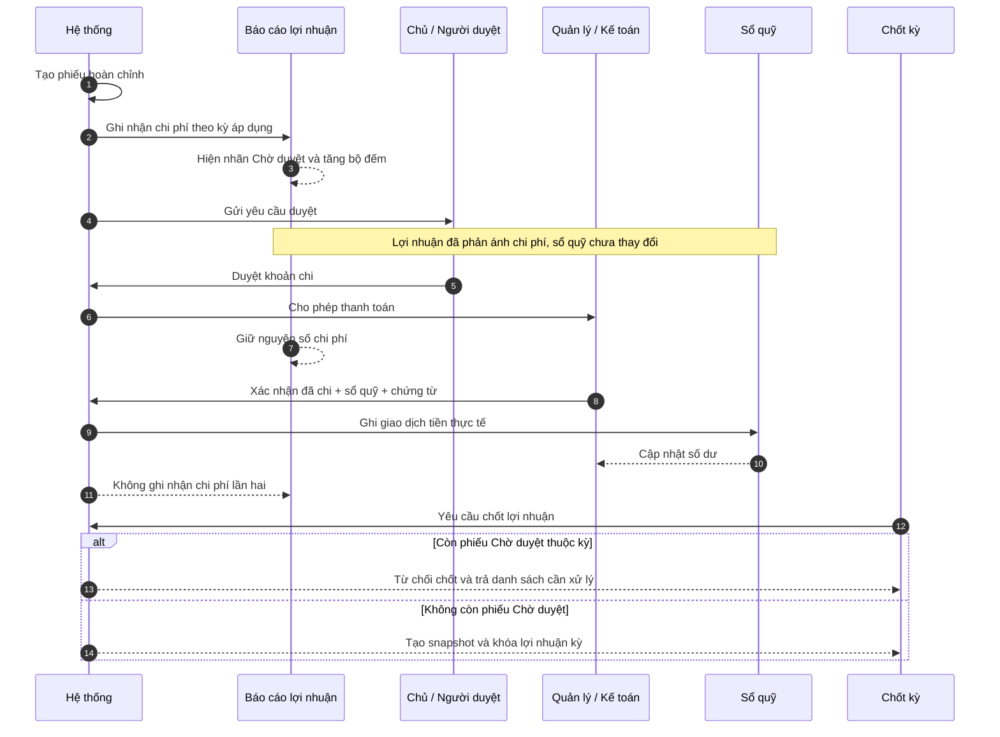
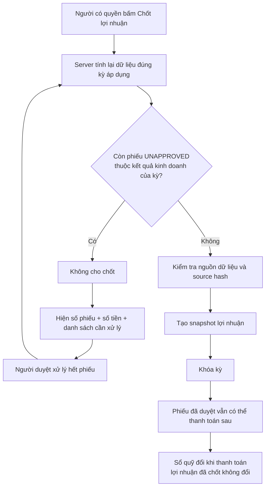
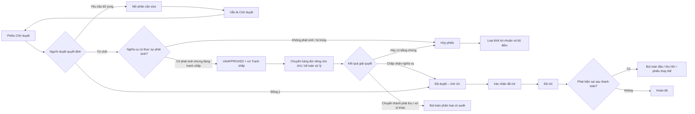

  
ARTIFACT NGHIỆP VỤ TÀI CHÍNH

  <h1>Ghi nhận chi phí đúng kỳ, duyệt trước khi xuất tiền</h1>
  
Quy trình mục tiêu tách ba việc vốn đang bị gộp chung: chi phí thuộc tháng nào, ai được phép duyệt khoản chi và khi nào tiền thực tế rời khỏi sổ quỹ.

  

    <a class="plan-action plan-action-primary" href="#flow-chinh-bon-buoc">Xem flow chính</a>
    <a class="plan-action" href="#quyet-dinh-con-can-chot">Xem điểm còn cần chốt</a>
  

  

    <strong>Đã chốt:</strong> bỏ khái niệm Nháp
    <strong>Quy ước:</strong> <code>UNAPPROVED</code> = Chờ duyệt
    <strong>Mục tiêu:</strong> lợi nhuận đúng kỳ, sổ quỹ đúng tiền thật
  

::: warning Trạng thái tài liệu
Đây là bản mô tả nghiệp vụ đã thống nhất một phần để tiếp tục chốt phạm vi triển khai. Nó chưa khẳng định hệ thống hiện tại đã vận hành theo flow này.
:::

## Tóm tắt trong một phút

  

    
3 lớp

    
Báo cáo lợi nhuận · Phê duyệt · Sổ quỹ

  

  

    
0 phiếu

    
Chờ duyệt thuộc kỳ là điều kiện để được chốt lợi nhuận

  

  

    
1 lần

    
Chi phí chỉ được ghi nhận một lần, dù thanh toán sau

  

  <section class="plan-card">
    
LN

    <h3>Báo cáo lợi nhuận</h3>
    
Ghi nhận chi phí khi nghĩa vụ đã phát sinh và phân bổ vào đúng kỳ áp dụng, không chờ tới ngày trả tiền.

  </section>
  <section class="plan-card">
    
D

    <h3>Phê duyệt</h3>
    
Chủ hoặc người có thẩm quyền quyết định quản lý có được phép thanh toán khoản chi hay không.

  </section>
  <section class="plan-card">
    
Q

    <h3>Sổ quỹ</h3>
    
Chỉ giảm khi người được giao xác nhận tiền đã thực sự được chi từ một sổ quỹ cụ thể.

  </section>

## Quyết định nghiệp vụ đã chốt

  <strong>Không còn trạng thái Nháp.</strong> Mọi phiếu được tạo phải đủ thông tin tối thiểu để xử lý. <code>UNAPPROVED</code> luôn được gọi và hiển thị là <strong>Chờ duyệt</strong>.

- Phiếu chờ duyệt chưa làm thay đổi số dư sổ quỹ.
- Phiếu chờ duyệt **được hệ thống xác định là nghĩa vụ đã phát sinh** được đưa vào báo cáo lợi nhuận theo kỳ áp dụng.
- Riêng trạng thái `UNAPPROVED` không đủ để kết luận một phiếu thuộc lợi nhuận; quy tắc ghi nhận KQKD phải do server xác định độc lập.
- Báo cáo phải cho biết rõ số phiếu và số tiền đang chờ duyệt.
- Còn phiếu chờ duyệt thuộc kết quả kinh doanh của kỳ thì không được chốt lợi nhuận.
- Duyệt khoản chi không đồng nghĩa tiền đã được thanh toán.
- Chỉ bước **Xác nhận đã chi** mới làm giảm sổ quỹ.

### Hiện trạng và mục tiêu

| Nội dung | Hệ thống hiện tại | Quy trình mục tiêu |
|---|---|---|
| Tên `UNAPPROVED` | Có nơi gọi Nháp, có nơi gọi Chờ duyệt | Chỉ gọi **Chờ duyệt** |
| Báo cáo lợi nhuận | Loại phiếu chưa duyệt khỏi tổng | Tính khoản phải chi đã phát sinh và gắn nhãn chờ duyệt |
| Thao tác Duyệt | Đồng thời coi như đã ghi sổ | Chỉ cấp quyền cho quản lý/kế toán thanh toán |
| Sổ quỹ | Giảm khi phiếu chuyển sang `APPROVED` | Giảm khi người được giao **Xác nhận đã chi** |
| Chốt lợi nhuận | Chưa chặn đầy đủ theo phiếu chờ duyệt | Server từ chối chốt nếu kỳ còn phiếu chờ duyệt thuộc KQKD |

## Flow chính bốn bước

  <section class="expense-state-card is-pending">
    

      01
      <code>UNAPPROVED</code>
    

    <h3>Chờ duyệt</h3>
    
Phiếu hoàn chỉnh đã được hệ thống hoặc người dùng gửi vào quy trình kiểm soát.

    <dl class="expense-impact-list">
      
<dt>Lợi nhuận</dt><dd>Tính theo kỳ nếu là chi phí đã phát sinh</dd>

      
<dt>Sổ quỹ</dt><dd>Chưa trừ</dd>

      
<dt>Chốt kỳ</dt><dd>Bị chặn</dd>

    </dl>
  </section>

  
→

  <section class="expense-state-card is-approved">
    

      02
      <code>APPROVED_TO_PAY</code>
    

    <h3>Đã duyệt – chờ chi</h3>
    
Chủ đã đồng ý khoản chi; quản lý hoặc kế toán được phép tiến hành thanh toán.

    <dl class="expense-impact-list">
      
<dt>Lợi nhuận</dt><dd>Giữ nguyên</dd>

      
<dt>Sổ quỹ</dt><dd>Chưa trừ</dd>

      
<dt>Chốt kỳ</dt><dd>Được phép</dd>

    </dl>
  </section>

  
→

  <section class="expense-state-card is-action">
    

      03
      HÀNH ĐỘNG
    

    <h3>Xác nhận đã chi</h3>
    
Người thanh toán chọn sổ quỹ, ngày chi, đính chứng từ và xác nhận số tiền thực tế.

    <dl class="expense-impact-list">
      
<dt>Người thực hiện</dt><dd>Quản lý hoặc kế toán được giao</dd>

      
<dt>Dữ liệu bắt buộc</dt><dd>Sổ quỹ · ngày chi · chứng từ</dd>

      
<dt>Kiểm soát</dt><dd>Không được chi trước khi duyệt</dd>

    </dl>
  </section>

  
→

  <section class="expense-state-card is-paid">
    

      04
      <code>PAYMENT_STATUS = PAID</code>
    

    <h3>Đã chi</h3>
    
Tiền thực tế đã rời khỏi quỹ và vết thanh toán được lưu đầy đủ để đối soát.

    <dl class="expense-impact-list">
      
<dt>Lợi nhuận</dt><dd>Không tính lại lần hai</dd>

      
<dt>Sổ quỹ</dt><dd>Trừ theo ngày chi thực tế</dd>

      
<dt>Nhật ký</dt><dd>Lưu người chi, thời điểm và chứng từ</dd>

    </dl>
  </section>

### Cách đọc flow

1. **Chi phí** có thể thuộc tháng 07 dù tiền được thanh toán trong tháng 08.
2. **Duyệt** chỉ là quyết định cho phép chi; chưa phải giao dịch tiền mặt.
3. **Xác nhận đã chi** mới là mốc sổ quỹ thay đổi.
4. Khi chuyển từ Chờ duyệt sang Đã duyệt – chờ chi, tổng lợi nhuận không được nhảy số lần nữa.

## Ai làm gì trong toàn bộ quy trình?

## Ví dụ trực tiếp từ báo cáo tháng 07/2026

::: info Điều kiện của ví dụ
Ví dụ dưới đây giả định toàn bộ `3.150.000đ` chờ duyệt đều thuộc kết quả kinh doanh và được phân bổ trọn vào tháng 07/2026.
:::

  

    Doanh thu
    <strong>30.743.500đ</strong>
  

  

    Chi phí đã hiển thị
    <strong>570.000đ</strong>
  

  

    Chi phí chờ duyệt
    <strong>3.150.000đ</strong>
  

  

    Chi phí tạm tính mới
    <strong>3.720.000đ</strong>
  

  

    Lợi nhuận tạm tính mới
    <strong>27.023.500đ</strong>
  

Trên giao diện, hai phiếu phải xuất hiện trực tiếp trong cột **Khoản chi**, có nhãn **Chờ duyệt**. Phần đầu báo cáo hiển thị thông báo: **“2 phiếu chờ duyệt · 3.150.000đ”** thay vì ghi chúng là phiếu nháp nằm ngoài tổng.

## Gate chốt lợi nhuận

### Quy tắc đếm phiếu của kỳ

- Đếm theo **kỳ áp dụng của hạng mục**, không chỉ theo ngày tạo phiếu.
- Phiếu trải nhiều tháng được phân bổ vào từng tháng theo cùng công thức của báo cáo.
- Bộ đếm là số phiếu khác nhau; số tiền cảnh báo là phần chi phí thuộc riêng kỳ đang xem.
- Cùng một quy tắc server-side phải quyết định phiếu nào là nghĩa vụ đã phát sinh cho cả dòng chi tiết, tổng báo cáo và gate chốt kỳ.
- Phiếu ngoài kết quả kinh doanh không được dùng để chặn chốt lợi nhuận.
- Phiếu đã duyệt nhưng chưa thanh toán không chặn chốt vì nó là khoản phải trả, không phải thiếu dữ liệu lợi nhuận.

## Ma trận trạng thái

Trạng thái phê duyệt và trạng thái thanh toán là hai chiều độc lập. Một phiếu có thể đã được duyệt nhưng chưa trả, hoặc đã trả một phần qua nhiều lần ghi sổ.

### Trạng thái phê duyệt

| Trạng thái | Tên hiển thị | Báo cáo lợi nhuận | Sổ quỹ | Chặn chốt kỳ |
|---|---|---|---|---|
| `UNAPPROVED` và thuộc KQKD | Chờ duyệt | Có, mang nhãn chờ duyệt | Chưa trừ | Có |
| `UNAPPROVED` ngoài KQKD | Chờ duyệt | Không | Chưa trừ | Không |
| `APPROVED_TO_PAY` | Đã duyệt – chờ chi | Giữ nguyên | Chưa trừ | Không |
| `CANCELLED` | Đã hủy | Loại khỏi báo cáo nếu chưa chốt | Không trừ | Không |

### Trạng thái thanh toán tổng hợp

| Trạng thái thanh toán | Ý nghĩa | Ảnh hưởng sổ quỹ | Ảnh hưởng lợi nhuận |
|---|---|---|---|
| `UNPAID` | Chưa có lần chi nào | Không đổi | Không đổi |
| `PARTIALLY_PAID` | Tổng các lần chi nhỏ hơn số được duyệt | Trừ từng lần chi | Không đổi |
| `PAID` | Tổng các lần chi bằng số được duyệt | Đã trừ đủ | Không đổi |
| `REVERSED` | Một hoặc nhiều lần chi đã được đảo/thu hồi | Ghi bút toán đảo tương ứng | Chỉ đổi nếu có quy trình điều chỉnh KQKD riêng |

Mỗi lần thanh toán tạo một **posting event** riêng. `POSTED` mô tả sự kiện ghi sổ, không được dùng thay cho trạng thái phê duyệt hoặc kết luận cả phiếu đã thanh toán đủ.

## Trả lại, hủy và sửa sai

  <strong>Không sửa trực tiếp phiếu đã chi.</strong> Nếu tiền đã rời khỏi quỹ, việc sửa hoặc xóa số tiền sẽ làm mất dấu đối soát. Phải dùng bút toán đảo, thu hồi hoặc phiếu thay thế có liên kết và nhật ký.

  <strong>Từ chối thanh toán không tự động xóa chi phí.</strong> Nếu hàng hóa hoặc dịch vụ đã được cung cấp, doanh nghiệp vẫn có thể đang mang nghĩa vụ phải trả. Chỉ trường hợp chứng minh khoản chi không phát sinh, bị trùng hoặc không thuộc doanh nghiệp mới được hủy và loại khỏi lợi nhuận.

Phiếu tranh chấp không quay lại hàng chờ duyệt thông thường. Nó phải có người chịu trách nhiệm, lý do, hạn xử lý và một trong ba kết quả rõ ràng: chấp nhận nghĩa vụ, hủy có bằng chứng hoặc phân loại sang khoản phải thu/xử lý khác. Kỳ tiếp tục bị chặn cho tới khi có kết quả.

### Sau khi kỳ đã khóa

- Phiếu đã duyệt nhưng chưa trả vẫn được thanh toán sau, nhưng số tiền, kỳ áp dụng và phân loại KQKD của phiếu phải được giữ nguyên.
- Nếu cần đổi dữ liệu ảnh hưởng lợi nhuận của kỳ đã khóa, phải đi qua **mở/chốt lại kỳ** hoặc một bút toán điều chỉnh có liên kết; không cập nhật âm thầm snapshot cũ.
- Nếu chỉ bổ sung thông tin thanh toán như ngày chi, sổ quỹ và chứng từ thì không làm thay đổi lợi nhuận đã chốt.

### Thanh toán một phần hoặc nhiều sổ quỹ

Flow bốn bước phía trên minh họa trường hợp thanh toán đủ một lần. Nếu doanh nghiệp cho phép trả nhiều lần hoặc chia qua nhiều sổ, mô hình phải lưu từng lần thanh toán riêng:

| Tình huống | Trạng thái thanh toán | Ảnh hưởng lợi nhuận | Ảnh hưởng sổ quỹ |
|---|---|---|---|
| Chưa trả | Chưa thanh toán | Giữ nguyên chi phí đã ghi nhận | Không đổi |
| Trả một phần | Thanh toán một phần | Không đổi | Trừ đúng số tiền từng lần |
| Trả đủ | Đã thanh toán | Không đổi | Tổng các lần chi bằng số được duyệt |
| Trả vượt hoặc đổi số tiền nghĩa vụ | Cần duyệt lại/điều chỉnh | Chỉ đổi qua quy trình điều chỉnh | Không cho ghi vượt âm thầm |

## Phạm vi nghiệp vụ đề xuất

  <section class="plan-card plan-card-positive">
    <h3>Tính vào lợi nhuận ngay khi chờ duyệt</h3>
    <ul>
      <li>Tiền nhà phải trả theo kỳ.</li>
      <li>Điện, nước, Internet, rác, vệ sinh và phí quản lý đã có nghĩa vụ thanh toán.</li>
      <li>Bảo trì thang máy hoặc dịch vụ định kỳ đã hoàn thành.</li>
      <li>Hoa hồng đã đủ điều kiện phát sinh theo hợp đồng.</li>
      <li>Các khoản hệ thống sinh có số tiền và kỳ áp dụng rõ ràng.</li>
    </ul>
  </section>
  <section class="plan-card plan-card-negative">
    <h3>Không tự động tính chỉ vì đang chờ duyệt</h3>
    <ul>
      <li>Đề nghị mua sắm mới, chưa phát sinh nghĩa vụ.</li>
      <li>Khoản ước tính chưa có số tiền đủ tin cậy.</li>
      <li>Chia lợi nhuận, hoàn cọc hoặc bút toán ngoài kết quả kinh doanh.</li>
      <li>Phiếu hệ thống lỗi, trùng hoặc thiếu tòa/kỳ/hạng mục.</li>
    </ul>
  </section>

## Lộ trình triển khai đề xuất

  
<strong>1 · Chốt dữ liệu</strong> Tách trạng thái phê duyệt, thanh toán và quy tắc ghi nhận lợi nhuận.

  
<strong>2 · Báo cáo</strong> Đưa phiếu chờ duyệt hợp lệ vào dòng chi phí, tổng và cảnh báo theo kỳ.

  
<strong>3 · Duyệt và chi</strong> Duyệt chỉ cấp quyền; thêm bước Xác nhận đã chi để ghi sổ quỹ.

  
<strong>4 · Chốt kỳ</strong> Server từ chối chốt khi còn phiếu chờ duyệt thuộc KQKD.

  
<strong>5 · Chuyển đổi</strong> Phân loại phiếu cũ, xử lý phiếu hệ thống mồ côi và đối chiếu số tiền.

### Nguyên tắc triển khai kỹ thuật

- Báo cáo và chức năng chốt kỳ phải dùng cùng một nguồn phân bổ server-side.
- Quy tắc/cờ ghi nhận KQKD là dữ liệu server-owned, độc lập với `UNAPPROVED`; mọi writer phải gán hoặc suy ra theo cùng policy.
- Không chỉ đổi bộ lọc từ `APPROVED` sang tất cả trạng thái vì sẽ đưa cả đề nghị chưa phát sinh và phiếu ngoài KQKD vào lợi nhuận.
- Trạng thái duyệt không được dùng làm trạng thái thanh toán.
- Quyền duyệt và quyền ghi sổ quỹ được kiểm tra độc lập.
- Server phải từ chối Xác nhận đã chi nếu phiếu chưa ở trạng thái Đã duyệt – chờ chi hoặc approval version đã thay đổi.
- Gate chốt kỳ phải khóa/recheck nguồn trong cùng transaction hoặc dùng source hash/CAS để không lọt phiếu chờ duyệt phát sinh đồng thời.
- Dữ liệu ảnh hưởng kỳ đã khóa không được sửa trực tiếp; chỉ payment metadata được bổ sung mà không làm stale snapshot.
- Chuyển trạng thái và ghi nhật ký phải nằm trong transaction, có idempotency và chống bấm lặp.
- Sau thay đổi phải đối chiếu tổng SQL thật, tổng báo cáo, số dư sổ quỹ và snapshot lợi nhuận.

## Tiêu chí nghiệm thu

- [ ] Toàn bộ giao diện không còn chữ **Nháp** cho `UNAPPROVED`.
- [ ] Phiếu `UNAPPROVED` được server đánh dấu là nghĩa vụ KQKD xuất hiện trong đúng kỳ; đề nghị chưa phát sinh và phiếu ngoài KQKD không bị đưa nhầm vào tổng.
- [ ] Tổng chi phí và lợi nhuận tạm tính gồm phần chờ duyệt, không cộng hai lần khi duyệt hoặc thanh toán.
- [ ] Báo cáo hiển thị số phiếu và số tiền chờ duyệt, có đường dẫn tới danh sách xử lý.
- [ ] Duyệt phiếu không làm thay đổi sổ quỹ.
- [ ] Server từ chối Xác nhận đã chi trực tiếp từ `UNAPPROVED`, kể cả khi gọi RPC/API mà không đi qua giao diện.
- [ ] Server từ chối xác nhận thanh toán dùng approval version cũ; retry hoặc bấm lặp cùng idempotency key không tạo thêm posting hay trừ quỹ lần hai.
- [ ] Chỉ người có quyền và quyền sử dụng sổ quỹ mới xác nhận đã chi; thiếu sổ quỹ, ngày chi hoặc chứng từ bắt buộc thì server từ chối.
- [ ] Chốt lợi nhuận bị từ chối tại server nếu còn phiếu chờ duyệt thuộc kỳ; kiểm tra và ghi snapshot chống được tình huống phát sinh phiếu đồng thời.
- [ ] Phiếu đã duyệt nhưng thanh toán sau khi chốt không làm snapshot lợi nhuận bị lệch.
- [ ] Từ chối một nghĩa vụ đã phát sinh không tự loại chi phí; chỉ Hủy vì không phát sinh/trùng mới loại khỏi lợi nhuận.
- [ ] Thay đổi số tiền/kỳ/KQKD sau khi khóa phải qua mở/chốt lại hoặc bút toán điều chỉnh có audit.
- [ ] Nếu hỗ trợ thanh toán một phần, tổng các lần ghi sổ không được vượt số đã duyệt và không làm ghi nhận chi phí lần hai.
- [ ] Phiếu đã chi không sửa trực tiếp; luồng đảo/thu hồi có nhật ký đầy đủ.
- [ ] Desktop và mobile đều đọc được flow, bảng trạng thái và cảnh báo mà không mất nội dung.

## Quyết định còn cần chốt

1. Dòng **“chưa có phiếu”** của hạng mục định kỳ có chặn chốt hay chỉ dùng để nhắc việc?
2. Nguồn phiếu hệ thống nào được mặc định coi là nghĩa vụ đã phát sinh và đưa vào lợi nhuận?
3. Khi người duyệt yêu cầu bổ sung, phiếu được sửa toàn bộ hay chỉ các trường chưa bị khóa?
4. Nếu số tiền thực trả khác số tiền đã duyệt, cho phép sai số bao nhiêu trước khi phải duyệt lại?
5. Có cho phép thanh toán một phần, nhiều lần hoặc chia qua nhiều sổ quỹ ngay trong giai đoạn đầu không?
6. Phiếu đã duyệt nhưng chưa trả có cần một báo cáo **Khoản phải trả** riêng theo tuổi nợ không?

## Tài liệu vận hành liên quan

- [Thu chi — tạo và quản lý phiếu](/03-quan-ly-van-hanh/thu-chi/)
- [Danh sách Chờ duyệt](/03-quan-ly-van-hanh/cho-duyet/)
- [Sổ quỹ](/03-quan-ly-van-hanh/so-quy/)
- [Phân tích tài chính](/04-bao-cao/phan-tich-tai-chinh/)
- [Quy trình chốt tháng tài chính](/01-bat-dau/quy-trinh-chot-thang/)
- [Chia lợi nhuận cổ đông](/03-quan-ly-van-hanh/chia-loi-nhuan/)

  <strong>Thông điệp cuối:</strong> lợi nhuận trả lời “chi phí thuộc kỳ nào”; phê duyệt trả lời “có được phép chi không”; sổ quỹ trả lời “tiền đã thực sự rời khỏi quỹ chưa”. Ba câu hỏi này phải được lưu và kiểm soát độc lập.

