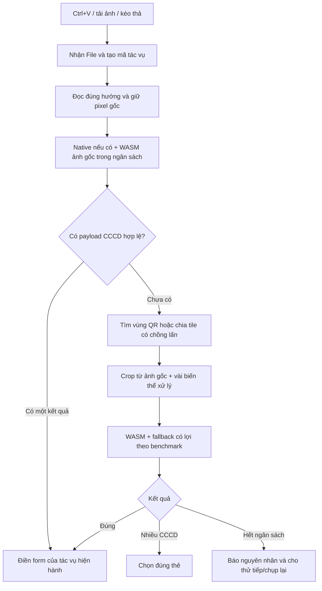

# CCCD QR Reliability Implementation Plan

> **Bổ sung theo yêu cầu mới:** cửa sổ `CreateCustomerDialog` mở từ bộ chọn khách hàng trong Hợp đồng phải có cùng ô dán/kéo thả/tải ảnh CCCD và nút camera như trang Khách hàng. Đây là một điểm tích hợp của cùng bộ đọc, không tạo bộ giải mã riêng. Quét chỉ điền form; không tự lưu khách hàng hoặc xác nhận hợp đồng. Giữ callback `onCreated` hiện có sau khi người dùng lưu. Đóng dialog/đổi sang tổ chức phải vô hiệu hoá kết quả cũ. Giới tính của dialog dùng enum `MALE/FEMALE/OTHER`, khác chuỗi hiển thị ở `CustomerForm`, nên cần mapping đúng.

### Bằng chứng trình duyệt và hướng triển khai hiện tại (07/09/2026)

- Chrome đọc được **7/9 QR** bằng WeChat 4.5.5 (`qr-scanner-wechat@0.1.3`) cùng DNN định vị của OpenCV.js 4.12. Lượt toàn ảnh đọc5ca; tối đa3vùng và6biến thể mỗi vùng thêm2ca. Cấu hình giới hạn đọc ảnh3/9 trong khoảng0.6–1.4giây ở các lượt đo gần nhất. Hai ảnh ghép hai mặt và thẻ xoay dọc vẫn chuyển OCR. Đây là tập development, chưa phải tỷ lệ production hay holdout.
- Các artifact nguyên bản bị CSP production chặn ở wrapper Emscripten sinh hàm từ chuỗi. Spike closure thông thường giữ7/9 dưới CSP không có `unsafe-eval`; bước tích hợp phải kiểm hash, ngữ nghĩa wrapper, bộ nhớ và module-worker thực tế. Không dùng nguyên wrapper `scan` của package vì thiếu xử lý nhiều mã và giải phóng đầy đủ.
- OCR toàn bộ trong Chrome dùng PaddleDB/Latin nhận nhãn và số, tự xoay/cắt dòng, rồi VietOCR cho tên/địa chỉ. Model cộng đồng `vemines/vietocr-onnx` ghim revision có modelcardMIT; bản quantized45MB được tạo bằng12dòng chữ giả và fontNotoSansSILOFL. Hồ sơ hash/nguồn/license và script tái lập nằm trong phần bổ sung cuối kế hoạch, sẽ chuyển thành asset manifest khi triển khai. Không dùng model mirror cũ thiếu license để phát hành.
- Hai ảnh khó OCR đủ5trường trong4.4–5.7giây khi tải máy thấp,11.8–11.9giây trong lượt CSP máy chạy đồng thời nhiều việc. SốCCCD/tên/ngày sinh/giới tính khớp ảnh gốc; một địa chỉ còn khác vị trí dấuHoà/Hòa. Không dùng đáp án để sửa model, không khẳng định10/10trường nguyên văn hay9/9QR.
- Phải giữ token khoảng trắng của vocabulary, không `trimEnd()` toàn vocabulary. OpenCV4.12 có thenable trả chính Module: khởi tạo qua object bao Module, không `await cv` trực tiếp. Ảnh/thông tin nhận dạng chỉ ở RAM, nguồnmodel tải riêng và self-host, không gửi CCCD ra ngoài.
- Đã tích hợp P0, scanner trong cửa sổ khách hàng của hợp đồng, worker, pipeline WeChat, chính sách lưu ảnh CCCD gốc và clipboard/parser vào worktree tính năng. Các module mới đã đăng ký strict; kiểm TypeScript, test liên quan, build và kiểm worker thật trên Chrome/Edge đã qua. Rà soát độc lập đã đóng lỗi bỏ sót QR thứ hai và lỗi camera khởi động lại khi callback thay đổi sau một kết quả. Lưu ảnh gốc đã kiểm upload/download bằng dữ liệu giả thuộc DEMO; Ctrl+V đã kiểm ở cả hai form. Chưa push hay promote production; đang tích hợp OCR, sau đó hoàn thiện vòng đời camera.

> **Bổ sung theo yêu cầu ngày 07/09/2026:** mục tiêu là lấy được dữ liệu khách hàng từ ảnh/camera; QR thất bại được phép chuyển sang OCR trực tiếp 5 trường. Không dùng thời gian thử QR kéo dài hàng chục giây trong giao diện. Bộ 9 ảnh người dùng gửi hiện có 7 QR đọc được bằng quy trình nghiên cứu WeChat + tự tìm vùng + biến thể; hai QR còn thất bại là ảnh ghép hai mặt và ảnh thẻ xoay dọc. Không coi đây là bản web đã đạt 9/9.

### Quy tắc điền form cho nguồn OCR — yêu cầu trực tiếp của người dùng

| Trường form | Nguồn / quy tắc |
|---|---|
| `id_number` | Số CCCD đọc trên mặt thẻ, giữ đủ 12 chữ số và số 0 đầu; không suy từ MRZ nếu chưa xác minh riêng |
| Họ tên, ngày sinh, giới tính | Đọc đúng dòng được gắn nhãn trên thẻ; giữ dấu tiếng Việt, kiểm ngày thực và giá trị giới tính |
| `id_issue_place` | Mặc định chính xác chuỗi **`Cục Cảnh sát`** theo yêu cầu của người dùng; provenance là `default`, không gắn nhãn đã OCR được |
| `permanent_address` | Nguyên văn nội dung **nơi thường trú** đọc trên CCCD |
| `detailed_address` | Cùng nguyên văn nơi thường trú như `permanent_address`; không cắt chỉ còn số nhà/đường |
| Ngày cấp | Không tự suy từ ngày sinh/ngày hết hạn; để trống nếu ảnh/QR không cung cấp |

Ở bản gốc, `CustomerForm.handleCccdParsed` gọi `lookupAddressFromText` rồi ghi `res.detailedAddress` vào `detailed_address`. Nhánh OCR phải bỏ việc ghi đè đó; nếu vẫn tra cứu mã tỉnh/xã phục vụ các ô lựa chọn, kết quả bất đồng bộ không được thay nguyên văn hai trường địa chỉ, không được tự đổi địa giới và không được áp dụng sang phiên quét tiếp theo. Mỗi kết quả cần `source: qr | ocr`, trạng thái tin cậy theo trường, và `scanId`.

### Nhánh OCR trong phạm vi triển khai

1. Chuẩn hoá ảnh gốc, tự xoay thẻ, xác định mặt trước và vùng chữ. Giữ vị trí nhãn: họ tên, ngày sinh, giới tính, nơi thường trú. Phân biệt quê quán, ngày cấp và ngày hết hạn; không ghép dữ liệu từ nhiều thẻ.
2. QR được thử trong một ngân sách ngắn; khi thất bại chuyển OCR bằng một phiên tác vụ có thể huỷ. Camera chỉ đưa một frame đủ rõ sang OCR; không chạy OCR nặng trên mọi frame.
3. Benchmark OCR riêng theo **đúng toàn bộ giá trị từng trường**, gồm dấu tiếng Việt; không tính việc có chuỗi kết quả hoặc ghép các biến thể theo đáp án chuẩn là một lần thành công của thuật toán. Điểm tự tin của model không phải xác suất đúng đã hiệu chuẩn.
4. So sánh bộ OCR đa ngôn ngữ, bộ nhận dạng chuyên tiếng Việt và Tesseract `vie` trên cùng vùng chữ. Giữ lựa chọn model mở cho đến khi có kết quả đúng/nhanh; bản native/Node nghiên cứu không chứng minh tốc độ trình duyệt.
5. Field chưa đọc chắc chắn giữ trạng thái cần kiểm tra trong bản xem trước; người dùng sửa trực tiếp được. Không đoán dấu, số hay địa chỉ bằng từ điển để biến kết quả sai thành “đã xác minh”.
6. Asset model nặng cần spike `onnxruntime-web`/WASM/WebGPU hoặc dịch vụ OCR do dự án tự vận hành. Chưa tự thêm dịch vụ cloud ngoài hệ thống, chưa gửi ảnh CCCD tới Gemini/API bên ngoài trong nghiên cứu này. Các model ONNX bản mirror chỉ dùng thử; bản phát hành phải có nguồn, hash, license và build/export tái lập.

Các mục QR bên dưới vẫn là kế hoạch triển khai phần giải mã; nhánh OCR này mở rộng đầu ra thành dữ liệu định danh có provenance và được ưu tiên cho hai ca QR chưa đọc được.

> **For agentic workers:** REQUIRED SUB-SKILL: Use superpowers:subagent-driven-development (recommended) or superpowers:executing-plans to implement this plan task-by-task. Steps use checkbox (`- [ ]`) syntax for tracking.

**Goal:** Dán ảnh CCCD toàn thẻ, ảnh QR đã cắt và ảnh hơi mờ để tự điền khách hàng ổn định trên máy tính; camera dùng cùng lõi giải mã, tự phục hồi và không làm treo giao diện.

**Architecture:** Dùng ZXing-C++ WebAssembly cho lượt nhanh, bổ sung tầng định vị/giải mã chuyên sâu theo WeChatQRCode vì thử ảnh Supabase đã chứng minh giá trị; tích hợp tầng này lên web cần spike riêng trước khi chốt phát hành. Native BarcodeDetector là đường tăng tốc khi hỗ trợ thật; worker và bộ điều phối quản lý ảnh gốc, vùng QR, số ít biến thể, thời hạn, huỷ và khởi tạo lại. Đọc QR và kiểm tra payload CCCD là hai bước riêng.

**Tech Stack:** React/Vite/TypeScript hiện có; ứng viên `zxing-wasm@3.1.3` đã thử riêng; Web Worker, ImageBitmap/Canvas; Vitest và Playwright headless. Khóa phiên bản bằng lockfile khi triển khai, không tự nâng toàn bộ dependency.

## Global Constraints

- Kế hoạch lập ngày 06/09/2026; P0 và điểm tích hợp cửa sổ khách hàng trong hợp đồng đã có code/test trong worktree. Các tầng decoder mới và OCR đang triển khai; chưa phát hành.
- Ưu tiên người dùng xác nhận: copy ảnh rồi Ctrl+V trên trình duyệt máy tính; đồng thời cải thiện quét trực tiếp.
- Tuân thủ `docs/engineering/PROJECT_CONTRACT.md` và `AGENTS.md`; tài liệu này không thay thế hoặc sao chép quy trình phát hành của repo.
- Thực hiện trong worktree riêng. Bản nghiên cứu dùng HEAD `1d6523fb`; trước triển khai lấy main mới và đối chiếu lại những file thay đổi.
- E2E headless, dữ liệu giả, chỉ org DEMO nếu cần tương tác form có ghi. Không tự lưu khách hàng khi QR được đọc.
- Ảnh và chuỗi QR ở bộ nhớ trình duyệt; không gửi sang dịch vụ OCR/AI hay lưu vào telemetry. Hoạt động lưu ảnh CCCD hiện có là chức năng khác.
- Không biến kết quả giải mã thành khẳng định căn cước hợp pháp. Không tự tạo lại những ký tự decoder chưa đọc được.
- Số đo dưới đây là thử nghiệm hẹp; mục tiêu nghiệm thu bên dưới là đề xuất, không phải hiệu năng đã đạt trên production.

## 1. Kết luận điều tra và mức chắc chắn

### Đã xác nhận từ code và phép chạy

| Phát hiện | Bằng chứng | Tác động |
|---|---|---|
| Cấu hình ZXing bị xoá trước khi giải mã | `src/lib/qrDecoder.ts:193-197`: `setHints(hints)` rồi `decode(bitmap)`; `MultiFormatReader.decode` của bản cài 0.22.0 gọi `setHints(hints)` với đối số thiếu | Mất cả `TRY_HARDER` và giới hạn chỉ QR; thực nghiệm state từ 1 reader có hints thành 6 reader không hints |
| Các scale chỉ thu nhỏ, không phóng lớn | `qrDecoder.ts:94`: `Math.min(1, ...)`; các scale 800/1200/1600/2000 | Với ảnh 256px, bốn lượt thực ra cùng kích thước; với QR nhỏ trong ảnh lớn, thu toàn ảnh làm giảm pixel trên mỗi ô QR |
| Tự crop chỉ quanh tâm | `qrDecoder.ts:283-294`, tỉ lệ 90/75/60/45% | Không phải tự định vị QR; QR sát góc có thể bị cắt mất. Đã tái hiện trường hợp thất bại bằng ảnh giả lập |
| Lượt ZXing bị lỗi tải sẽ bị nhớ lỗi cả phiên module | `qrDecoder.ts:181-184`, khác nhánh jsQR đã xoá rejected promise | Có cơ chế gây tình trạng sau một lần tải lỗi thì mọi lần sau đều thiếu fallback; chưa xác nhận đã xảy ra trên máy người dùng |
| Camera chỉ chạy native/jsQR trong ROI giữa | `qrDecoder.ts:303-307`; `CCCDQrCameraScanner.tsx:109-119` | Không có lượt giải mã mạnh định kỳ và không tìm toàn frame khi QR ngoài ROI |
| Xử lý jsQR/ZXing/canvas chạy trên main thread | `qrDecoder.ts:98-105,123-177,187-202` | `async` không biến tính toán đồng bộ thành xử lý nền; nhiều lượt thất bại làm chậm UI |
| Nhận Ctrl+V phụ thuộc hover | `src/hooks/useClipboardImagePaste.ts:24` | Cần phân biệt không nhận ảnh với đã nhận ảnh nhưng không đọc được; hook chỉ lấy File, không nén ảnh |
| Không huỷ kết quả upload cũ | `CCCDQrUpload.tsx:24-60,87-101` | Reset, unmount hoặc ảnh mới có thể vẫn nhận kết quả từ tác vụ trước; object URL cũ không được thu hồi ở mọi nhánh |
| Parser chỉ kiểm số trường | `cccdQrParser.ts:53-83` | Không xác minh 12 số, tên, ngày lịch thật; thêm decoder mạnh phải tránh nhận QR khác rồi tự điền nhầm |

**Phân biệt điều chưa biết:** ảnh đính kèm ban đầu là screenshot giao diện, không chứa QR để tái hiện. Sau đó người dùng cho phép đọc ảnh khách hàng sẵn có từ Supabase; kết quả kiểm ảnh thật được bổ sung bên dưới. Chưa biết ảnh nào chính là ảnh người dùng đã so với Zalo. Chưa biết phiên bản trình duyệt người dùng và SHA frontend đang triển khai có trùng checkout không. Chưa đo luồng clipboard hệ điều hành của người dùng, camera, lấy nét, phản sáng hoặc Zalo. Không suy đoán Zalo dùng engine nào.

**Graph:** gate freshness cho `medium-risk` trả GitNexus FRESH theo chính sách dù chỉ mục lùi 16 commit; UA STALE nên không dùng làm căn cứ. `impact(decodeQr)` trả 5 symbol upstream, kiểm lại bằng source. Hook clipboard có 9 caller gồm cả thu tiền/hoá đơn; đề xuất sửa cách nhận dán riêng của QR, không thay hành vi chung của hook trong hạng mục này.

### Thử nghiệm đã thực hiện

Windows, Chrome headless 152 trên localhost secure context: `BarcodeDetector` không tồn tại ở môi trường đo. Điều này không có nghĩa mọi Chrome đều thiếu API; cần kiểm capability, không suy từ tên trình duyệt. MDN cũng ghi API chưa hỗ trợ rộng khắp. [Nguồn](https://developer.mozilla.org/en-US/docs/Web/API/BarcodeDetector)

Tạo QR payload giả, 45×45 module, ECC M, có quiet zone; so sánh code hiện tại, bản chỉ sửa hints trong bộ nhớ và `zxing-wasm@3.1.3` đọc ảnh gốc. Không sửa source ứng dụng. 18 biến thể tổng hợp, không phải 18 ảnh chụp thực độc lập. Đã nạp WASM trước; có hiệu ứng JIT/lượt đầu, chưa kiểm soát cold start/chunk download, mỗi case chạy một lần. Vì vậy thời gian chỉ dùng để định hướng, không dùng làm SLA hoặc công bố tăng tốc toàn hệ thống.

| Trường hợp | Hiện tại | Chỉ sửa hints | WASM đọc ảnh gốc |
|---|---:|---:|---:|
| QR 200px ở góc ảnh 4000×3000 | Không đọc, 3457ms | Không đọc, 3066ms | Đọc đúng, 136ms |
| QR 200px giữa ảnh 4000×3000 | Đúng, 1034ms | Đúng, 939ms | Đúng, 143ms |
| QR 256px ở góc ảnh 4000×3000 | Đúng, 155ms | Đúng, 140ms | Đúng, 435ms |
| QR đã cắt 256px, blur tổng hợp 2.2px | Đúng, 174ms | Đúng, 120ms | Đúng, 3ms |
| QR đã cắt 96px, blur tổng hợp 0.8px | Không đọc | Không đọc | Không đọc |
| QR đã cắt 256px, blur tổng hợp 2.6px và 3.0px | Không đọc | Không đọc | Không đọc |

Tổng trong phép thử: hiện tại 14/18, sửa hints 14/18, WASM 15/18; không thấy trả payload sai. Phóng ảnh 2× riêng lẻ không cứu được ba ca mờ thất bại. Không kết luận WASM luôn nhanh hơn: ca góc 256px cho kết quả ngược lại. Không gọi mức blur CSS là tương đương “hơi mờ” của ảnh người dùng.

Unit hiện có `npx vitest run src/lib/__tests__/cccdQrParser.test.ts`: 6/6 pass. Chưa có test trực tiếp cho decoder/QR upload/camera trong các file test được tìm; parser xanh không chứng minh đọc ảnh tốt.

Artifact tái lập, nằm ngoài source repo:

- `C:/Users/Nguyen Tam/.codex/visualizations/2026/09/06/01a07775-314f-77a3-be94-a5719ab6f0a9/qr-research/benchmark.cjs`
- Cùng thư mục có `results.json`, `results-extra.json`, package/lockfile cài riêng. Chạy `node benchmark.cjs` và `node benchmark.cjs --extra`; script đọc source từ checkout chính theo biến `repo`.

### Kiểm trực tiếp ảnh Supabase theo yêu cầu bổ sung

Đã kiểm 57 ảnh mặt trước/mặt sau của 30 khách hàng đang hoạt động trong org THẬT. Chọn mẫu tất định bằng `md5(id || 'cccd-qr-20260906')`, không chọn theo engine nào đọc được; chỉ SELECT và tải ảnh bằng phiên đăng nhập được phép. Ảnh, URL, số căn cước và payload chỉ ở bộ nhớ của các process cục bộ, không ghi vào repo hay báo cáo. Mã `sample-NN-front/back` chỉ là thứ tự mẫu trong phép thử.

| Phương pháp | Ảnh có payload cấu trúc CCCD | Số CCCD khớp hồ sơ |
|---|---:|---:|
| Pipeline hiện tại | 4 | 4 |
| Pipeline chỉ sửa lỗi hints | 4 | 4 |
| ZXing-C++ WASM trên ảnh gốc | 8 | 8 |
| WASM + lượt xử lý thử nghiệm | 12 | 12 |
| OpenCV WeChatQRCode native CPU | 17 | 16 |

Lượt xử lý thử nghiệm gồm ảnh gốc/2×/contrast, tile chồng lấn và thử denoise ở một nhánh; chưa phải pipeline production có worker, watchdog và toàn bộ kỹ thuật của kế hoạch. Bốn ca bổ sung thành công ở lượt phóng 2× toàn ảnh; không gán công cho tile hay denoise khi chúng chưa tạo ca thắng. WeChat native đọc được toàn bộ 12 ca WASM+rescue và thêm 5 ca.

**Một trường hợp không khớp hồ sơ:** `sample-01-front`. Đã lấy vùng QR do WeChat định vị, thêm viền và phóng 3× bằng nội suy cubic, sau đó ZXing-C++ WASM đọc được **chuỗi đầy đủ giống hệt WeChat**, vẫn khác số ở hồ sơ. Đây là bằng chứng hai decoder đồng thuận với nội dung QR, không đủ để tự kết luận trường dữ liệu nào đúng hay sửa hồ sơ. Không thay đổi dữ liệu.

**Không lấy 57 làm mẫu số độ chính xác QR:** tập có cả hai mặt giấy tờ và chưa được gán nhãn độc lập cho sự hiện diện/chất lượng QR. 40 ảnh chưa có decoder nào đọc không đồng nghĩa 40 QR thất bại. Có ít nhất 17 ảnh chứng minh chứa payload CCCD có thể giải mã; 16 khớp số đang lưu, 1 đã đối chứng chéo như trên. Chưa xác minh toàn bộ họ tên/ngày/địa chỉ hoặc so với Zalo.

Pipeline hiện tại có lượt mất 19,046 giây rồi thất bại; một ảnh đọc được mất 8,908 giây. Ví dụ `sample-07-front`: hiện tại thất bại sau 7584ms, WASM đọc đúng số hồ sơ trong 14ms. Các phép đo chỉ chạy một lần/engine, thứ tự cố định. Baseline gồm `FileReader`/decode file; WASM đo từ raster sẵn có; các thời gian **không tương đương end-to-end** và không dùng để hứa tốc độ UI. Native WeChat cũng loại thời gian mở Python/nạp model, không đại diện hiệu năng web.

Chi tiết, giới hạn và artifact nằm ở [báo cáo kiểm thử](../../audits/cccd-qr-benchmark-2026-09-06.md). Kết quả thực tế thay đổi quyết định: tầng learned detection phải được kiểm khả thi cho bản mạnh, không chỉ là ý tưởng tùy chọn sau cùng.

## 2. Phương án đề xuất

Chọn **WASM lượt nhanh + tầng WeChat/learned detection cho ảnh khó + xử lý ảnh thích ứng + quản lý phiên quét**, ưu tiên hoàn thiện cho Ctrl+V trước rồi dùng lại cho camera. Tầng chuyên sâu đã có bằng chứng native; bản web phải kiểm khả thi và benchmark trước khi tuyên bố tương đương. Sửa lỗi tích hợp hiện tại là việc đầu tiên, nhưng không coi việc đó là toàn bộ giải pháp.

| Lựa chọn | Giá trị | Quyết định |
|---|---|---|
| Chỉ chỉnh jsQR/ZXing JS và tăng số lần thử | Ít thay đổi, sửa được lỗi cấu hình | Bước P0; không đủ cơ sở giải quyết ảnh toàn thẻ và mờ |
| ZXing-C++ qua `zxing-wasm`, native khi có, worker và xử lý ROI | Chạy ngay trong web; đã có tín hiệu tốt ở phép thử riêng | Hướng triển khai chính |
| SDK thương mại, ví dụ Dynamsoft | Có web SDK, có thể đưa vào đối chứng trên corpus | Chỉ chọn khi benchmark thực tế cho lợi ích rõ vượt phương án chính; cần đánh giá license, vận hành offline và dữ liệu trước khi tích hợp |
| WeChatQRCode/OpenCV detector và super-resolution | Native đã đọc 17 ảnh, trong đó thêm 5 ảnh so với WASM+rescue | Bắt buộc spike khả thi cho bản mạnh; kiểm asset/latency/RAM trên web, không coi native là bằng chứng chạy sẵn trên trình duyệt |

`zxing-wasm` cung cấp lõi ZXing-C++ và đường reader riêng. Tài liệu hướng dẫn tự phục vụ file WASM, cần cấu hình vì mặc định tải từ CDN. [Nguồn](https://github.com/Sec-ant/zxing-wasm)

ZXing JS hiện công bố maintenance mode. `qr-scanner` có worker và native fallback hữu ích về tổ chức luồng, nhưng đổi wrapper không tự chứng minh sẽ giải quyết bộ ảnh khó hơn. [ZXing JS](https://github.com/zxing-js/library) · [qr-scanner](https://github.com/nimiq/qr-scanner)

WeChatQRCode dùng mô hình phát hiện và super-resolution khi có model tương ứng; đã đo bản OpenCV 4.10.0 native, chi phí trên web của dự án chưa đo. [OpenCV](https://docs.opencv.org/4.13.0/d5/d04/classcv_1_1wechat__qrcode_1_1WeChatQRCode.html) · [Dynamsoft Web SDK](https://www.dynamsoft.com/barcode-reader/docs/web/programming/javascript/user-guide/)

### Luồng ảnh



- **Giữ ảnh gốc:** không ép mọi ảnh xuống 800/1600/2000px. Đọc kích thước thực bằng `naturalWidth/naturalHeight` hoặc bitmap; xác minh EXIF bằng fixture, tránh xoay hai lần. Dùng Blob/object URL thay base64 để giảm bản sao.
- **Định vị:** lượt toàn ảnh trước; lấy candidate từ decoder nếu API bản ghim trả được vị trí lỗi, nhưng không phụ thuộc khả năng đó. Fallback tile 1024–1536px chồng lấn 25%, quét cả các góc; lấy ROI từ ảnh gốc, không từ thumbnail. Trước một nhóm tile chạy lượt toàn ảnh để tránh QR lớn bị mọi tile cắt ngang.
- **Bộ xử lý có chọn lọc:** ảnh gốc luôn là biến thể đầu; sau đó tăng tương phản cục bộ, local/adaptive threshold, scale 2× cho QR nhỏ; thử nearest-neighbor và nội suy mượt theo kiểu ảnh. Unsharp nhẹ chỉ là candidate cho mờ nhẹ; không hứa phục hồi chi tiết đã mất. Không chạy hàng chục bộ lọc nối tiếp lên một ảnh đã biến đổi.
- **Viền và phối cảnh:** giữ quiet zone thực tế, thêm padding ngoài candidate khi cần; chỉ warp khi có bốn góc đáng tin và luôn thử bản chưa warp. Crop thêm viền không thể chữa module đã bị cắt mất. Không tự viết decoder QR hay phép Reed–Solomon riêng.
- **Ngân sách:** một worker xử lý một lượt; tạo candidate lười, dừng sớm khi đọc đúng. Thời hạn do thread chính canh để terminate được lời gọi WASM đồng bộ bị kẹt. Không dùng riêng `Promise.race` rồi để tác vụ cũ tiếp tục chạy ngầm.

Adaptive threshold có thể hữu ích khi ánh sáng không đều; không phải bộ lọc chữa mọi dạng mờ. Các engine hiện tại đã có binarization bên trong, nên chỉ giữ bước ngoài nào cứu được case độc lập khi đo ablation. [OpenCV thresholding](https://docs.opencv.org/4.13.0/d7/d4d/tutorial_py_thresholding.html)

### Luồng camera

- Chụp đúng frame một lần rồi gửi worker; không liên tục đọc video đang thay đổi giữa các lượt scale.
- Ưu tiên camera sau, xin 1920×1080 dạng ideal rồi đọc `getSettings()` để biết độ phân giải thực. Chọn thiết bị nếu có nhiều camera; không giả định camera sau được chọn là ống kính lấy nét gần tốt nhất.
- Đọc capabilities rồi mới bật focus/zoom/torch. Thiết bị không hỗ trợ vẫn quét bình thường.
- Dùng frame callback nếu có, fallback timer; một frame đang xử lý thì bỏ frame cũ, không xếp hàng. Khoảng 5–10 lượt nhanh/giây là mức khởi đầu, điều chỉnh theo độ trễ thực.
- Sau khoảng 0.7–1 giây chưa đọc được, chọn frame nét tốt trong một cửa sổ nhỏ để chạy lượt sâu; xen kẽ ROI với toàn frame. Chỉ tăng zoom khi capability cho phép và có căn cứ QR quá nhỏ; có điều khiển tay để không dao động.
- Tính ROI theo kích thước video và phép `object-cover`; layout vuông hiện tại có thể khớp nhưng phải test portrait/landscape khi thay UI.
- Callback ổn định, session ID riêng, huỷ stream/worker/timer khi đóng hoặc chuyển nguồn; check session sau mọi `await` trước tự điền.
- Payload hợp lệ đọc rõ được nhận ngay; chỉ yêu cầu hai frame trùng nhau nếu kết quả từ nhánh xử lý ảnh mạnh có độ bất định hoặc có xung đột. Không bắt mọi lượt quét chờ nhiều frame.

Tài liệu ML Kit nhấn mạnh số pixel trên đơn vị barcode và lấy nét; đó là lý do cần tối ưu cả ảnh đầu vào và camera. ML Kit Android không phải web SDK thay trực tiếp cho app Vite, và không phải bằng chứng về Zalo. [Nguồn](https://developers.google.com/ml-kit/vision/barcode-scanning/android)

## 3. Giao diện module và giới hạn vận hành ban đầu

Giá trị dưới đây là mặc định để benchmark, điều chỉnh bằng số đo trước chốt phát hành:

- Giới hạn file 20MiB, kích thước giải mã 24MP; kiểm kích thước trước tạo các canvas/biến thể lớn. Nếu định dạng/browser không cho preflight đáng tin, decode trong worker có watchdog, trả lỗi hỗ trợ rõ ràng khi vượt khả năng; kiểm lại ngưỡng bằng ảnh 24/48MP thực trước rollout.
- Upload ngân sách giải mã 3000ms, lượt sâu chủ động thêm tối đa 5000ms; khởi tạo engine có trạng thái riêng và timeout 5000ms, không ngụy trang thời gian tải thành xử lý ảnh.
- Tối đa 4 ROI candidate được xếp hạng, 6 biến thể cho mỗi ROI và 24 lượt tile trong một tác vụ, vẫn bị chặn bởi deadline chung. Không giữ toàn bộ raster đồng thời.
- Camera lượt nhanh ngân sách 100ms, lượt sâu 350ms ở mức khởi đầu; deadline cứng terminate worker khi cần. Benchmark để cân bằng warm-up/restart và fps, tránh tạo vòng reset liên tục trên máy yếu.
- Hết 3 giây báo chưa đọc được thay vì spinner vô hạn. Nút thử kỹ hơn chạy trên ảnh sẵn có; chụp lại chỉ khi chưa thể đọc đáng tin.

Đặt contracts trong `src/lib/qr/types.ts`:

```ts
export type QrEngine = 'native' | 'zxing-wasm' | 'jsqr' | 'zxing-js';
export type QrMode = 'image' | 'camera-fast' | 'camera-deep';
export type Point = { x: number; y: number };
export type Candidate = {
  text: string;
  engine: QrEngine;
  corners?: [Point, Point, Point, Point];
};
export type ScanResult =
  | { status: 'decoded'; candidates: Candidate[]; elapsedMs: number }
  | { status: 'not-found' | 'timeout' | 'cancelled'; elapsedMs: number }
  | { status: 'engine-unavailable' | 'image-invalid'; elapsedMs: number };
export type ScanOptions = {
  mode: QrMode;
  budgetMs: number;
  signal?: AbortSignal;
};
export interface QrScanner {
  scan(source: Blob | ImageBitmap, options: ScanOptions): Promise<ScanResult>;
  dispose(): void;
}
// scan sở hữu ImageBitmap được truyền vào, đóng nó trên mọi nhánh.
// Blob vẫn thuộc caller. Kết quả/corners luôn quy về toạ độ ảnh nguồn.
```

Protocol worker có `requestId` tăng đơn điệu, message `scan/cancel` và kết quả `{requestId,result}`. Main bỏ kết quả không khớp ID. Abort huỷ request, worker busy chạy đồng bộ thì terminate; request tiếp theo tạo worker và init promise mới. Promise init lỗi phải reset. Đồng thời nhiều caller phải dùng chung promise đang pending, không chỉ dùng cờ boolean “đã kiểm”.

## 4. Các task triển khai

### Task 1: Bộ ảnh hồi quy và sửa lỗi tích hợp đã chứng minh

**Files:** sửa `src/lib/qrDecoder.ts`; tạo `src/lib/__tests__/qrDecoder.test.ts`, `scripts/qr/benchmark.mjs`, `scripts/qr/generate-fixtures.mjs`, `test/fixtures/qr/manifest.json`; giữ ảnh thật ngoài git.

**Interfaces:** giữ các export hiện tại để đo trước/sau; benchmark sinh JSON `caseId, sourceGroup, sha256, engine, success, wrongPayload, elapsedMs, attempts, terminationReason`, không ghi payload thật.

- [ ] Sinh ít nhất ba payload giả có dấu, nhiều độ dài/version/ECC, fixture toàn thẻ và crop, cả xoay/nhòe/nén/ít tương phản/QR sát góc/không có QR. Mỗi fixture phải có payload kỳ vọng độc lập; QR không được giải mã rồi dùng chính kết quả làm oracle.
- [ ] Viết test chứng minh mất hints bằng bộ giải mã thật, không chỉ mock `setHints`. Ví dụ điểm kiểm chứng:

```ts
const reader = new MultiFormatReader();
const hints = new Map([[DecodeHintType.TRY_HARDER, true]]);
const spy = vi.spyOn(reader, 'setHints');
reader.setHints(hints);
try { reader.decode(bitmapFixture); } catch { /* kết quả ảnh không phải oracle của test */ }
expect(spy.mock.calls.at(-1)?.[0]).toBe(hints); // đỏ với cách gọi hiện tại
```

- [ ] Test adapter thực sự gọi đường giữ hints; sửa thành `reader.decode(bitmap, hints)` hoặc `setHints` + `decodeWithState` nhất quán. Test decode ảnh dùng kết quả kỳ vọng để tránh chỉ kiểm hình thức gọi hàm.
- [ ] Thêm test import reject một lần rồi thành công; sửa `getZxing` reset rejected promise tương tự jsQR. Phân biệt lỗi engine với không thấy QR ở adapter mới.
- [ ] Chạy `npx vitest run src/lib/__tests__/qrDecoder.test.ts src/lib/__tests__/cccdQrParser.test.ts`; chạy benchmark baseline và fixed, lưu số liệu. Commit riêng P0 với trailer Codex theo AGENTS.

**Đạt khi:** lỗi hints bị test bắt trước sửa và hết sau sửa; ảnh chuẩn cũ không mất ca thành công; không gán thành công của P0 cho các vấn đề chưa đo.

### Task 2: Lõi WASM, assets và worker có thể phục hồi

**Files:** tạo `src/lib/qr/types.ts`, `src/lib/qr/engines.ts`, `src/lib/qr/qr.worker.ts`, `src/lib/qr/client.ts`; sửa `src/lib/qrDecoder.ts` làm adapter tương thích, `package.json`, lockfile; test `src/lib/qr/__tests__/client.test.ts`, `engines.test.ts`.

**Interfaces:** `createQrScanner(): QrScanner`; `engines.ts` trả `Candidate[]`; worker chỉ nhận Blob/ImageBitmap/ArrayBuffer có quyền sở hữu rõ.

- [ ] Viết test worker lỗi init, scan timeout, abort, scan tiếp sau crash; kết quả của ID cũ phải bị bỏ. Test bắt main thực sự gọi `terminate`, không chỉ trả `timeout`.
- [ ] Cài bản candidate exact; lazy-load `/reader`. Self-host WASM theo asset URL do Vite sinh:

```ts
import wasmUrl from 'zxing-wasm/reader/zxing_reader.wasm?url';
import { prepareZXingModule, readBarcodes } from 'zxing-wasm/reader';
prepareZXingModule({ overrides: {
  locateFile: (name, prefix) => name.endsWith('.wasm') ? wasmUrl : prefix + name,
}});
const results = await readBarcodes(imageData, {
  formats: ['QRCode'], tryHarder: true, tryRotate: true,
  tryInvert: true, tryDownscale: true, maxNumberOfSymbols: 4,
  textMode: 'Plain', returnErrors: false,
});
```

Đường export asset phải kiểm bằng manifest của bản ghim và production build; nếu Vite không resolve subpath, dùng bước copy build từ `node_modules` với tên/version/hash, không đổi sang CDN ngầm.

- [ ] Native adapter kiểm `getSupportedFormats`, dùng promise chung, hỗ trợ trường hợp constructor có nhưng không có `qr_code`. Native không hỗ trợ thì luồng WASM vẫn đầy đủ. Đưa jsQR vào worker và chỉ giữ trong cascade nếu cứu thêm ca.
- [ ] Tạo worker `new Worker(new URL('./qr.worker.ts', import.meta.url), { type: 'module' })`; một request active, deadline ở main, phục hồi init lỗi một lần có backoff hữu hạn. Blob chuyển vào worker để rasterize khi hỗ trợ; Canvas main fallback chia lượt nhỏ trên browser thiếu OffscreenCanvas.
- [ ] Đo asset cold/warm, kiểm MIME `application/wasm`, CSP hiện hành, offline sau warm, chunk 404/mạng ngắt. Chỉ cập nhật CSP chính xác nếu build thực cần; không nới chung. Chạy unit + `npm run build`, phục vụ bản build headless.

**Đạt khi:** build thật tải được WASM cùng origin; không fetch CDN; không treo UI khi decoder chạy sâu; lỗi mạng được phục hồi hoặc báo đúng thay vì “ảnh không có QR”.

### Task 3: Tự định vị và cải thiện ảnh khó bằng phép đo

**Files:** tạo `src/lib/qr/candidates.ts`, `src/lib/qr/preprocess.ts`, `src/lib/qr/pipeline.ts` và test tương ứng trong `src/lib/qr/__tests__/`.

**Interfaces:** `buildRegions(width,height): Iterable<Roi>` sử dụng `Roi` hiện tại hoặc chuyển type vào `types.ts`; `makeVariants(image: ImageData): Iterable<ImageData>`; `runPipeline(source, options): Promise<ScanResult>` theo contracts Task 2. Variants được cấp phát lần lượt, kết thúc thì giải phóng.

- [ ] Tạo test góc ảnh 4000×3000 đã tái hiện và tile seam, QR lớn hơn tile, ảnh cắt nhỏ; cần kết quả payload đúng, không mock engine.
- [ ] Lập queue toàn ảnh → candidate ROI → tile chồng lấn, bỏ các kích thước raster trùng nhau. Map tọa độ ROI/corner về ảnh nguồn và kiểm bằng fixture xoay/phối cảnh.
- [ ] Thử nguyên bản trước rồi biến thể riêng, không biến đổi chồng mù:

```text
roi(original)
  -> raw
  -> upscale(2, smooth) hoặc upscale(2, nearest)
  -> local contrast
  -> adaptive threshold
  -> nhẹ unsharp nếu chỉ báo blur phù hợp
```

- [ ] Với threshold tự viết, test histogram hai mức gồm 0/255 để không biến toàn ảnh thành trắng khi ngưỡng bằng 0. Với sharpen, test không làm mất ca nguyên bản. `tryDenoise` của WASM là experimental: benchmark riêng trước bật, không mặc định coi luôn tốt hơn.
- [ ] Chạy ablation từng bước trên tập development, chọn cấu hình rồi đánh giá tập holdout chia theo ảnh nguồn/thẻ, không chia ngẫu nhiên các biến thể của cùng ảnh sang cả hai tập.
- [ ] Tích hợp spike learned/WeChat đã chứng minh trên Chrome: tạo `src/lib/qr/wechatAdapter.ts` trả `Candidate[]` và script chuẩn bị asset `scripts/qr/build-wechat-wasm.mjs`. Dùng artifact ghim từ `qr-scanner-wechat@0.1.3` (OpenCV 4.5.5 + model) và `@techstark/opencv-js@4.12.0-release.1` (DNN), adapter riêng nhận RGBA và trả đủ decoded text/corners, giải phóng tài nguyên. Kiểm hash/source/license và tạo asset self-hosted tái lập từ package khóa phiên bản. Spike không cần biên dịch lại C++: đây là quyết định triển khai sau bằng chứng web, không dùng wrapper scan của package nguyên xi.
- [ ] Đo tổng WASM+model nén, model init, CPU/RAM, cold/warm trên Chrome/Edge Windows, Android và Safari; trước hết dùng lại 5 ca chỉ WeChat cứu được. Nếu quá nặng cho camera, chỉ dùng sâu theo lịch/ảnh tĩnh và giữ camera-fast WASM. Chỉ gộp sau khi qua holdout/latency; nếu không đạt khả thi web, chuyển sang bakeoff SDK thương mại, không tự thêm backend nhận ảnh CCCD ngoài scope.

**Đạt khi:** đọc được fixture góc ảnh và giữ các ca đã đọc; đo được ích lợi từng tầng. Không lấy tăng số lượt thử làm đại diện cho tăng chất lượng.

### Task 3b: Bảo toàn chi tiết ở đường lưu ảnh giấy tờ

**Phát hiện sau kiểm dữ liệu Supabase:** `ImageUploadZone.tsx` gọi `uploadFile`, hàm này gọi `compressImage` trước upload. Chính sách chung trong `src/lib/imageCompress.ts` là cạnh dài 1600, WebP quality 0.82, áp dụng khi file lớn hơn 200KiB và đầu ra nhỏ hơn. Đây là chính sách SOURCE hiện tại; chưa có ảnh gốc trước lưu để định lượng mất chi tiết của từng ảnh đã có. Luồng dán vào ô QUÉT đi thẳng decoder nên không chịu bộ nén này, còn ảnh lấy từ kho có thể đã chịu nén khi lưu.

**Files:** sửa `src/lib/storage.ts`, `src/components/customers/ImageUploadZone.tsx`, `CustomerForm.tsx`; tạo test chính sách upload giấy tờ và kiểm các caller khác. Trước sửa `uploadFile` chạy impact/freshness và kiểm toàn bộ call-site vì helper này được dùng rộng.

**Interfaces:** thêm tham số tùy chọn vào `uploadFile(bucket,path,file,options?)`, `options.imagePolicy: 'default' | 'identity-original'`; mặc định giữ hành vi hiện hành. Prop `imagePolicy` đi từ đúng ô CCCD mặt trước/mặt sau, không áp dụng vô tình cho chứng từ hoặc ảnh phòng.

- [ ] Tạo fixture ảnh QR nhỏ trong thẻ có thể đọc từ bản gốc; so sánh byte và decode sau chính sách upload. Test không chỉ kiểm số 1600/0.82 xuất hiện trong code.
- [ ] Với `identity-original`, kiểm MIME/giới hạn file rồi giữ nguyên bytes để lưu; tạo thumbnail chỉ phục vụ hiển thị nếu cần, không lấy thumbnail làm đầu vào decoder. Không resize âm thầm để vượt giới hạn file.
- [ ] Kiểm các form tạo/sửa khách dùng `ImageUploadZone` và các đường nhập khách khác; áp dụng chính sách theo mục đích ảnh, không theo mỗi tên bucket (bucket có thể dùng chung).
- [ ] Test các caller cũ không truyền options vẫn nén như trước; chạy test ảnh/khách và build. Không thay lại các ảnh đã lưu vì không có bản gốc để phục hồi.

**Đạt khi:** ảnh CCCD mới có thể tải lại đúng bytes gốc để đọc QR; ảnh hiển thị nhỏ không trở thành nguồn dữ liệu duy nhất. Chi phí dung lượng phải đo trước rollout; không tự backfill hay chỉnh ảnh thật.

### Task 4: Ctrl+V, quản lý tác vụ và tự điền đúng CCCD

**Files:** sửa `src/components/customers/CCCDQrUpload.tsx`, `CustomerForm.tsx`, `src/lib/cccdQrParser.ts`; tạo `src/components/customers/useCccdQrInput.ts`, tests hook/upload/form; mở rộng parser test. Không thay hook clipboard dùng chung trong lần này.

**Interfaces:** `useCccdQrInput` sở hữu nhận ảnh chỉ trong vùng QR đang hover/focus và task ID; dùng `QrScanner` Task 2. Hàm chọn CCCD nhận `Candidate[]`, trả `valid/invalid/ambiguous`, không tự lấy phần tử đầu.

- [ ] Test dán sau click/focus khi chuột đã rời ô; dán bằng hover vẫn được; đang nhập tên/số điện thoại không bị ô QR chiếm paste; vùng tải mặt trước/mặt sau vẫn nhận đúng ảnh của nó.
- [ ] Đăng ký đúng một listener của vùng QR; kiểm event đã xử lý, MIME, và vùng focus. Không dùng đồng thời listener QR mới và hook window cũ cho cùng một sự kiện.
- [ ] Test A đang decode → dán B, A hoàn tất sau B: chỉ B điền form. Reset/unmount/đổi loại khách huỷ A, thu hồi preview URL/bitmap trên mọi nhánh. Cho thay ảnh ngay cả khi đang xử lý.
- [ ] Dùng bộ phân loại kết quả rõ ràng: ảnh chưa nhận/định dạng ảnh lỗi, engine chưa sẵn sàng, chưa thấy QR, QR đọc được nhưng không phải CCCD, nhiều CCCD. Nội dung người dùng đơn giản; kỹ thuật chỉ ở diagnostics không PII.
- [ ] Thêm parser validation tách biệt bảo toàn số 0 đầu và Unicode; CCCD 12 chữ số, họ tên không rỗng, ngày lịch thật bằng roundtrip day/month/year. Test năm nhuận, 31/02, QR URL, chuỗi 7 phần tuỳ ý, CMND cũ trống, phần mở rộng chưa biết. Bỏ ký tự thừa an toàn chỉ BOM/whitespace ngoài chuỗi; không tự sửa số nghi ngờ hay mất dấu. Format mở rộng chỉ chấp nhận sau fixture được xác minh, không tự coi mọi thẻ đều đúng một schema.
- [ ] Giữ việc điền trường cơ bản nhanh; địa chỉ bất đồng bộ phải mang generation ID, tránh lookup A hoàn thành rồi ghi địa chỉ vào khách B. Không tự submit khách hàng.
- [ ] Chạy parser/component tests và E2E clipboard của form. Native clipboard thật cần một lượt kiểm trên Windows, không gọi synthetic ClipboardEvent là đã kiểm clipboard hệ điều hành.

**Đạt khi:** một ảnh hiện hành, một lần tự điền; dán mới/reset không nhận kết quả cũ; lỗi thao tác và lỗi giải mã phân biệt được.

### Task 5: Camera dùng lõi chung và quản lý vòng đời chắc chắn

**Files:** sửa `CCCDQrCameraScanner.tsx`; tạo `src/components/customers/useCccdQrCamera.ts`, `src/lib/qr/cameraFrame.ts` và tests tương ứng.

**Interfaces:** camera hook trả `status, devices, settings, capabilities, selectDevice, retry, stop`; gọi `scan(bitmap,{mode,budgetMs,signal})`. Toàn bộ callback ra ngoài dùng ref cập nhật để re-render form không khởi động stream lại.

- [ ] Test mở/đóng nhanh, permission denied, thiết bị không có, play rejected, background/resume, đổi camera, stream kết thúc; tracks cũ phải stop. `play()` lỗi không được nuốt rồi báo đang quét.
- [ ] Viết test mapping ROI bằng kích thước video thật và container/object-cover, portrait/landscape/resize; không sửa ROI bằng phỏng đoán khi layout đang khớp.
- [ ] Lập bộ điều phối frame giữ tối đa một job active; khoảng 0.7–1 giây lấy một frame nét tốt để scan sâu và quét full frame theo lịch. Không tích hàng đợi ảnh cũ.
- [ ] Apply constraints focus/zoom/torch khi `getCapabilities()` hỗ trợ; `getSettings()` là bằng chứng đã áp dụng. Bắt lỗi constraint và rơi về camera bình thường. Không bật torch mặc định cho ảnh CCCD bóng dễ phản sáng.
- [ ] Kiểm session sau decode, trước beep/vibrate/onParsed/onClose; huỷ timeout đóng cũ khi người dùng mở phiên mới. Khi nhiều payload hợp lệ xung đột, yêu cầu chọn đúng thẻ.
- [ ] Test headless bằng video giả; sau đó kiểm vật lý ít nhất Android Chrome và iPhone Safari cho lấy nét, QR gần/xa, mặt thẻ bóng, xoay máy. Máy tính có webcam kiểm một thiết bị thật. Không dùng giả lập thiết bị thay bằng chứng camera thật.

**Đạt khi:** dùng được lượt sâu mà không giật preview, huỷ được ngay, không tự điền sau đóng; các capability thiếu không làm hỏng đường cơ bản.

### Task 6: Đối chứng, nghiệm thu, phát hành và đường quay lại

**Files:** tạo `.e2e-fleet/specs/cccd-qr.spec.ts`, cập nhật báo cáo `docs/audits/cccd-qr-benchmark-2026-09-06.md`; sửa `src/lib/qr/config.ts` nếu cần cờ chọn pipeline; cập nhật tài liệu sử dụng hiện hành đã tìm được khi triển khai, không tạo nguồn luật thứ hai.

**Interfaces:** config `VITE_CCCD_QR_PIPELINE=legacy|wasm-v1`; thiếu/không hợp lệ dùng lựa chọn an toàn theo giai đoạn rollout. Trong canary giữ legacy đã sửa hints để đối chiếu; chỉ gỡ dependency không còn import sau khi đủ bằng chứng.

- [ ] Thu corpus ảnh người dùng thất bại để kiểm cục bộ sau khi được cung cấp; ít nhất ảnh toàn thẻ, crop, hơi mờ, copy từ ứng dụng phổ biến. Ảnh thật không vào git/report/video CI. Tách nhóm ảnh mất thông tin nghiêm trọng.
- [ ] Bổ sung ít nhất 100 ảnh nguồn có quyền sử dụng (ảnh thật được phép và thẻ giả chụp thật), 200 biến thể tổng hợp. Kiểm có nhiều mật độ/độ dài/tiếng Việt, không chỉ một payload. Dùng nhóm Zalo đã đọc được làm tập bắt buộc so sánh khi có cùng file; không tự tải CCCD lên demo SDK bên ngoài.
- [ ] Đo baseline, fixed legacy, WASM raw, WASM pipeline và từng fallback trên cùng phần cứng. Mỗi mẫu lặp ít nhất 5 lần, tách cold/warm, luân phiên thứ tự engine, ghi median/p95 và timeout; báo theo nhóm, không gộp ảnh rõ che ảnh mờ.
- [ ] Nếu mục tiêu chưa đạt, bakeoff Dynamsoft trên cùng corpus trong điều kiện dữ liệu được kiểm soát. Chốt license/cost chỉ sau có số đo; thương mại không mặc định thắng. Không mua license hay tích hợp dịch vụ chỉ để đạt chữ “xịn”.
- [ ] Chạy unit liên quan, `npm run typecheck:baseline`, `npm run build`, E2E headless preview; kiểm worker/WASM assets trong bundle thật. Đột biến theo Contract cho nhánh/gate yêu cầu, ưu tiên huỷ stale result, parser reject, timeout và tải assets; ghi rõ kết quả.
- [ ] `graph:detect-changes` và source diff xác nhận phạm vi; hoàn tất gate/phát hành đúng Contract. Kiểm deployed SHA và asset hash trước khẳng định đã lên production. Giữ canary đủ dữ liệu trước bỏ cờ quay lại; rollback về artifact trước nếu sai payload hay lỗi worker tăng.

**Đạt khi:** có báo cáo số đo và ma trận dưới đây, mọi khoảng trống được ghi trung thực; không đánh dấu hoàn tất tính năng chỉ vì unit xanh.

## 5. Tiêu chí nghiệm thu đề xuất

| Chỉ tiêu | Mục tiêu và cách đo |
|---|---|
| Ảnh chuẩn/crop rõ | 100% bộ regression đã biết; không giảm ca baseline đọc được |
| Ảnh toàn thẻ và hơi mờ vẫn còn đọc được | ≥98% trên tập holdout đã gán nhãn; báo n/N theo từng nhóm, không loại ca thất bại sau khi thấy kết quả |
| Ca người dùng báo Zalo đọc ngay | Đọc đúng toàn bộ tập tái hiện cụ thể được cung cấp; nếu còn lỗi, chưa kết luận đã giải quyết khiếu nại |
| Đúng dữ liệu | Không sai payload trong tập kiểm; mọi trường hợp nhiều thẻ/xung đột phải xử lý rõ. Đây là kết quả thử nghiệm, không phải bảo đảm xác suất sai bằng 0 ngoài thực tế |
| Ctrl+V bình thường trên máy tính | Sau warm, từ nhận File đến tự điền trường cơ bản p95 ≤500ms trên máy tham chiếu đã ghi cấu hình |
| Ảnh khó | p95 ≤2 giây trong tập còn giải mã được; có kết quả cuối/trạng thái thử tiếp khi chạm hạn 3 giây |
| Camera rõ | Từ frame đầu chứa QR đủ nét trong vùng đến tự điền p95 ≤1 giây; tách thời gian cấp quyền/mở camera |
| Vòng đời | 100 lần dán thay/reset và 100 lần mở/đóng camera không stale fill, không còn tracks; bộ nhớ sau thu gom không tăng theo số lần thao tác |
| Lỗi tải/chunk/worker | Test reject/404/offline/crash có trạng thái đúng và thử lại hữu hạn; không treo phiên |
| UI | Không có long task >50ms do phần decode chạy trên main trong benchmark; nếu raster fallback vượt ngưỡng phải có điều chỉnh/giới hạn được đo |

Không thuật toán nào đảm bảo đọc mọi ảnh khi module bị cắt mất, cháy sáng hoặc nhòe đến mức mất thông tin. Mục tiêu là loại các cơ chế chập chờn có thể sửa, tăng rõ tỷ lệ đọc trên ảnh mà phần mềm khác đọc được, và trả kết quả trung thực trong thời gian hữu hạn.

## 6. Thứ tự và ước lượng

1. Task 1–2: nền tảng + lỗi đã xác nhận, khoảng 1–2 ngày kỹ thuật.
2. Task 3–4 (gồm 3b): ảnh/clipboard, bảo toàn ảnh giấy tờ và tính đúng của tự điền, khoảng 2–4 ngày.
3. Task 5: camera và thiết bị thật, khoảng 1–2 ngày.
4. Task 6: corpus/đối chứng/preview/rollout, khoảng 1–2 ngày sau khi có ảnh và thiết bị.

Ước lượng nền tảng 5–10 ngày kỹ thuật; bổ sung 2–3 ngày spike khả thi tầng learned trên web, tổng định hướng 7–13 ngày trước các nhánh phát sinh. Đây không phải lịch cam kết: build OpenCV/WASM và kiểm thiết bị thật có độ bất định riêng. SDK thương mại là vòng đối chứng nếu tầng chuyên sâu không đạt ngân sách web. Không triển khai một lần tất cả bộ lọc/engine rồi mới tìm xem cái nào có ích.

## 7. Nguồn API để triển khai

- [ZXing JS 0.22.0 MultiFormatReader](https://raw.githubusercontent.com/zxing-js/library/v0.22.0/src/core/MultiFormatReader.ts): decode so với decodeWithState và hints.
- [zxing-wasm 3.1.3 ReaderOptions](https://raw.githubusercontent.com/Sec-ant/zxing-wasm/v3.1.3/src/bindings/readerOptions.ts): các option chính xác; `tryDenoise` experimental, `isPure` không bật cho ảnh chụp.
- [zxing-wasm](https://github.com/Sec-ant/zxing-wasm): reader-only, WASM serving, input và output.
- [BarcodeDetector](https://developer.mozilla.org/en-US/docs/Web/API/BarcodeDetector): feature detection, formats, góc/vị trí và giới hạn hỗ trợ.
- [OpenCV thresholding](https://docs.opencv.org/4.13.0/d7/d4d/tutorial_py_thresholding.html): global/adaptive/Otsu.
- [OpenCV WeChatQRCode](https://docs.opencv.org/4.13.0/d5/d04/classcv_1_1wechat__qrcode_1_1WeChatQRCode.html): detector và super-resolution, cần spike tích hợp web.
- [ML Kit Android input guidelines](https://developers.google.com/ml-kit/vision/barcode-scanning/android): độ phân giải đơn vị barcode và focus, chỉ dùng làm cơ sở xử lý đầu vào.

## 8. Tự rà soát bản kế hoạch

- [x] Bao phủ ảnh toàn thẻ, crop, mờ, copy/paste máy tính và quét camera.
- [x] Phân biệt phát hiện code/kiểm chứng cục bộ với giả thuyết chưa tái hiện trên ảnh người dùng.
- [x] Có giới hạn thời gian, huỷ thực sự, phục hồi tải lỗi, quản lý bộ nhớ và stale result.
- [x] Có validation payload, nhiều QR, Unicode và race điền địa chỉ.
- [x] Không kết luận engine mạnh nhất mọi tình huống; có đối chứng và điều kiện bổ sung SDK/model.
- [x] Có task/file/interface/test/nghiệm thu và rollback; nguồn tham khảo chính thức.
- [x] Phân biệt nghiên cứu ban đầu với tiến độ triển khai: source ứng dụng đã sửa trong worktree; trạng thái phát hành được ghi riêng, không coi test cục bộ là production.

### Model OCR và phép đo bổ sung (07/09/2026)

- Bản ONNX chính thức `PaddlePaddle/latin_PP-OCRv5_mobile_rec_onnx`, revision `89d3a50e2c27e2e7cceeab0e944c25c807d5db4f`, khai Apache-2.0; SHA256 model `7888113072263cb471b93f66dd5e2ad70548dc526fa1ace760d0d973dd121498`. Bộ ký tự 836 khác bản RapidOCR cũ 504 nhưng vẫn không đọc đúng tên hai ảnh khó. Không chọn nó để thay nhánh tiếng Việt chỉ vì tên model mới hơn. Các thử export Paddle2ONNX Windows không tương thích DLL đã được bỏ khi tìm thấy bản ONNX chính thức, không cần shipping exporter đó.
- Nguồn thay thế `vemines/vietocr-onnx`, revision `049d43e7ba75961d51ab8acad13901f93b08c859`, có model card công bố **MIT**. Đây là bản phân phối cộng đồng, không tuyên bố là weights chính thức pbcquoc. Thư viện/kiến trúc VietOCR upstream Apache-2.0. Ghi cả nguồn phân phối và upstream trong hồ sơ asset; không suy license của mirror cũ không có thông tin.
- Bản FP32 đọc đúng nguyên tên hai ảnh khó; địa chỉ ảnh 5 khớp sau chuẩn hóa khoảng trắng/dấu câu, ảnh 2 còn khác vị trí dấu Hoà/Hòa. Không dùng đáp án để sửa kết quả.
- Quantization tái lập từ model công khai trên bằng `quantize-vemines.py`: encoder QDQ Conv/MatMul/Gemm với 12 dòng **chữ giả** sinh bằng Arial, decoder dynamic INT8 MatMul/Gemm. Không dùng ảnh khách để calibration. Encoder 30,096,693 bytes (gzip24,597,085), SHA256 `bbab7a80795292097c7145ed9f255fc2ca722f37bb7db24d485afd763f103644`; decoder14,850,237 bytes (gzip13,239,472), SHA256 `58eee71560b782f7009a99934629e67c5cd4996067aac33fbf79d63e855a3047`. Giữ nguyên sáu kết quả dòng so với FP32 trên hai ảnh, chưa phải đánh giá holdout rộng.
- Chrome WASM một thread đọc sáu tensor trong4.950 giây, init600ms localhost. Pipeline ảnh gốc với tự xoay dựa vào hướng dòng trước khi nhận dạng: ảnh2 5.921 giây/30dòng; ảnh5 4.656 giây/18dòng. Sáu dòng vẫn bằng native. Script `vemines-web.cjs --pipeline`, artifact `vemines-browser-pipeline-results.json` chỉ chứa số đo. Các thời gian warm/localhost không bao gồm tải model lần đầu trên đường truyền thực.
- Chọn nguồn model có license công bố, hash và script lắp ráp/quantization tái lập này làm ứng viên tích hợp OCR tiếp theo. Parser5trường, xử lý nhiều thẻ, worker/watchdog và UI xem lại vẫn phải hoàn thiện trước phát hành; không coi kết quả nghiên cứu là tự điền đã xong.

Calibration cập nhật sang Noto Sans (SIL OFL) để build không phụ thuộc font riêng trên Windows: Google Fonts revision2984c575fdce412ee02b2baaba67672b9a9434d8, fontSHA256bfb7bb691513f12e734dc346c03a03f784912432d7e3fa8e56efcf906fe86b3d. EncoderQDQ mới30,096,697bytes, SHA25675279c118ffbb539ee64477bf0b9ded775094834d450206b33de014e2342631d; decoderINT8không đổi. Native6dòng vẫn giốngFP32. PipelineChrome5.699/4.431giây; so sánh toàn dòng5/6giốngFP32 (một ký tự I/1 ở nhãn in, không nằm trong giá trị địa chỉ); sáu giá trị tên/địa chỉ sau tách nhãn không đổi. Không coi5/6toàn dòng là6/6.

Đối chiếu5trường trên hai ảnh bằng nội dung ảnh gốc: sốCCCD/tên/ngày sinh/giới tính đúng ở cả hai; địa chỉ ảnh5khớp sau chuẩn hoá khoảng trắng/dấu câu; ảnh2còn khác vị trí dấuHoà/Hòa, phần không dấu khớp. Vì vậy chưa tuyên bốOCR10/10trường chính xác nguyên văn. Chỉ chuẩn hoáUnicode/khoảng trắng khi so sánh; không dùng đáp án để sửa giá trị model. `ocr-field-parser.mjs` là mappingnghiên cứu, cần productionparser và regressiontests riêng.


### Kiểm CSP và tài nguyên trình duyệt bổ sung
Artifact WeChat/OpenCV nguyên bản phát sinh `EvalError` dưới `script-src 'self' 'wasm-unsafe-eval'`. Spike thay các wrapper Emscripten sinh hàm từ chuỗi bằng closure thông thường, giữ chuyển đổi tham số/giải phóng/giá trị trả về, đã chạy lại cùng 9 ảnh với CSP: 7/9 QR, init174ms; ảnh3/9 lần lượt624/1367ms. Chưa coi script nghiên cứu là asset production: cần hash ghim, test ngữ nghĩa wrapper và module-worker build thực tế. Không thêm `unsafe-eval` toàn website.
Nhánh OCR cũng chạy được với OpenCV đã sửa CSP: hai ảnh2/5 mất11.8/11.9giây trong lượt máy đang chạy đồng thời build/test, init908ms; kết quả sáu dòng giữ5/6 giống native, khác một ký tự nhãn trước giá trị địa chỉ. Tốc độ nghiên cứu trước4.4–5.7giây không phải cam kết mọi lần chạy; ngân sách OCR phải dựa phép đo worker production và có huỷ tác vụ.
Nguồn model RapidAI/RapidOCR tại ModelScope revisionv3.9.2 khai ApacheLicense2.0 trong README (HTTP200), còn vemines/vietocr-onnx revision049d43e7ba75961d51ab8acad13901f93b08c859 khaiMIT trong modelcard (HTTP200). Model tải ở build/self-host, không gửi ảnh người dùng ra các nguồn này.
