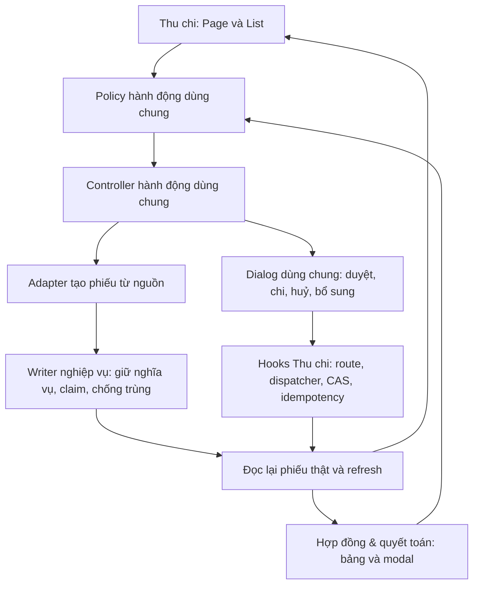

# Hợp đồng & quyết toán — Kế hoạch thi hành sau audit

> **Trạng thái:** thiết kế và kế hoạch, **chưa thi hành mã ứng dụng hoặc migration**; HTML prototype đã đổi một nhãn nút theo yêu cầu tại §0.
> Bản này thay toàn bộ bản plan trước; các đoạn mã mẫu và kết luận của bản cũ không còn là chỉ dẫn triển khai.
> Agent thi hành dùng `superpowers:executing-plans` hoặc `superpowers:subagent-driven-development`, đọc Project Contract trước khi sửa và thực hiện các checkbox theo phụ thuộc.

**Goal:** Thay ba mục Hoa hồng / Chi thanh lý (hoàn khách) / Thưởng sale tại Thanh toán bằng một khu **Hợp đồng & quyết toán**. Người vận hành rà soát nghĩa vụ, phiếu tồn qua nhiều kỳ, xem vòng đời hợp đồng và duyệt/chi ngay tại đây bằng **chính bộ máy của Thu chi**.

**Architecture:** Nguồn nghiệp vụ tạo phiếu qua adapter giữ ràng buộc riêng của nguồn; phiếu đã tồn tại đi qua policy, controller, dialog và các hooks ghi dùng chung với Thu chi. Một tầng đọc có phân trang cung cấp nguồn chưa có phiếu, phiếu thật, tổng và timeline; UI không tự chọn RPC hoặc suy quyền.

**Tech Stack:** React / TypeScript / Vite; TanStack Query; Supabase/PostgREST; các Finance V2 và domain RPC hiện có; Zod và form theo convention repo; Vitest; Playwright trong `.e2e-fleet`.

**Global Constraints:** Không tạo bộ máy duyệt/chi thứ hai; không tự chi khi lập phiếu; không ghi dữ liệu nghiệp vụ org THẬT; không xóa RPC toàn hệ thống chỉ vì bỏ giao diện Thanh toán; giữ Cọc đã thu; không suy dữ liệu thiếu thành 0, version 1 hoặc được phép ghi.

**Nguồn quy định:**

- [Project Contract](../../engineering/PROJECT_CONTRACT.md), AGENTS.md, risk-map và test-matrix hiện hành.
- [Spec thiết kế](../specs/2026-09-20-hop-dong-quyet-toan-design.md), đặc biệt **§7.4** về yêu cầu bỏ flow cũ và dùng chung máy Thu chi. Khi §4.5 hoặc đoạn cũ mâu thuẫn §7.4, dùng §7.4.
- Ý định đã xác nhận: gỡ cả ba flow Thanh toán; không mang nguyên modal cũ sang khu mới; vẫn phải xử lý dòng chưa có phiếu; có tồn kỳ cũ và modal vòng đời.
- **Chốt mới 21/09/2026:** người dùng yêu cầu thiết kế chính xác theo HTML Claude Design tại §0, gồm cả Khoản chi và Biến động. Chỉ dẫn hoãn Biến động trong spec/bản plan trước đã được thay thế. Phạm vi desktop vẫn giữ; các trang phí khác được mẫu ghi là ngoài phạm vi thiết kế mới.

## 0. Mẫu giao diện chuẩn đã được người dùng chọn

Nguồn chính: [HTML Claude Design — Bản thiết kế 03](<../../../thi-t-k-trang-thanh-to-n-h-p-ng/project/Thanh toan - Hop dong & quyet toan.dc.html>). File đi kèm: `thi-t-k-trang-thanh-to-n-h-p-ng/project/support.js`. Ảnh trong `project/ref/` là tham khảo của quá trình thiết kế, **HTML hiện hành mới là chuẩn dựng giao diện**.

Đã đọc HTML và mở bản chạy trong trình duyệt. SHA-256 bản bàn giao trước chỉnh nhãn: `59ea489e674a2cb80384797d76d614464b99b75dade079fb82fd85102494bf9a`. SHA-256 sau thay đổi nhãn do người dùng yêu cầu: `323634a1af7eee76730f6f2d864b071b1e6ebb60462f8749ce434ae427a9f875`.

**Thay đổi đã chốt so với bản export:** nút trong hồ sơ Cần rà soát có nhãn chính xác **“Chuyển chờ duyệt”**, thay “Lập phiếu · chuyển chờ duyệt”. Đã sửa một nhãn trong HTML và kiểm trên trình duyệt. Đây là tên action hiển thị, không phải chỉ dẫn bỏ kiểm nguồn hoặc tạo phiếu lần nữa.

### 0.1 Hợp đồng hình thức và tương tác

| Thành phần | Chuẩn phải bám từ HTML |
|---|---|
| Tổng thể | Nền kem `#e9e5dc`, khung `#f5f3ee`, surface trắng; khung rộng tối đa 1180px, bo 20px; màu chữ `#1b1813`, phụ `#8d8678`, viền `#e7e3da`, xanh chính `#1f7a52` |
| Typography | Be Vietnam Pro cho nội dung, Space Mono cho số tiền/mã/ngày; giữ cỡ, weight, line-height, spacing theo từng vùng HTML |
| Header | Nút về, dropdown chọn hạng mục có icon/subtitle/badge, kỳ bên phải, nút đóng; Tổng quan kỳ là điểm vào của bản mẫu |
| Điều hướng khu mới | Hai tab Khoản chi / Biến động đúng vị trí và hình thức; không thay thành navigation hoặc layout tự thiết kế |
| Thẻ Khoản chi | Checkbox **Gộp Chờ duyệt và Chi** mặc định bật: 3 thẻ Cần rà soát / Chờ Duyệt và Chi / Đã chi; bỏ chọn thành 4 thẻ, tách Chờ duyệt và Chờ chi. Đây chỉ là gộp trình bày và tập lọc, không gộp state/quyền backend |
| Bộ lọc | Search, Tất cả toà, Mọi kỳ · gồm tồn cũ, Bộ lọc; vùng nâng cao Nguồn Hợp đồng/Giữ chỗ, người nhận/phụ trách, trạng thái, vướng mắc; giữ dạng chọn đơn của mẫu |
| Dải loại khoản | Tất cả / Hoàn khách / Hoa hồng / Thưởng sale kèm số đếm; Cần xử lý / Đã chi phía phải; banner Tồn kỳ trước |
| Bảng | Đúng thứ tự và tỷ lệ cột phòng/khách/mã, khoản chi, người nhận/ngân hàng, số tiền, trạng thái, thao tác; giữ density comfortable/compact theo props mẫu nếu expose cấu hình |
| Modal | Cả hoàn, hoa hồng và thưởng đều mở modal lớn tối đa 1040px; timeline trên cùng; căn cứ/ghi chú bên trái, người nhận/chứng từ/lịch sử/action bên phải 320px; không thay thưởng bằng side panel cũ không có entrypoint |
| Timeline | Mỗi hợp đồng một lane, 4 mốc ký → cọc thực thu → tiền thuê/phí đã đóng → thanh lý/hiện tại; hợp đồng nguồn viền xanh; bên dưới ghi phòng hiện tại và phiếu đang xem |
| Action | Giữ vị trí và thứ bậc Chuyển chờ duyệt / Duyệt & Chi / Duyệt Chờ Chi / Cần bổ sung / Ghi nhận chi; enable/disable, lý do và tác động lấy từ máy dùng chung |
| Biến động | 5 thẻ Ký mới / Gia hạn / Thanh lý / Bỏ cọc / Giữ chỗ; bảng sự kiện, bộ lọc riêng, modal vòng đời và liên kết sang khoản chi liên quan |
| Trạng thái dữ liệu | Dựng loading, empty, error/retry, không quyền theo hình thức trong mẫu; trạng thái thật chưa được mẫu minh hoạ dùng cùng badge/vùng giải thích, không dựng thêm hệ giao diện khác |

Các tài khoản, số liệu, mốc ngày, bậc, CSV/nhãn nhóm nếu chỉ là text không có handler phải được phân biệt với chức năng thực có trong mẫu. Không tự thêm bốn chip lọc ngoài mẫu, màn tổng hợp khác hoặc side panel vì plan cũ từng đề xuất. Nút “Làm lại demo”, props demo và thông báo dữ liệu mẫu chỉ thuộc prototype/visual fixture, không thành thao tác reset dữ liệu production.

### 0.2 Phần phải hiện thực đúng hệ thống thật

HTML dùng `seed`, `events`, `C`, `cycles` và `setState`; không có API, auth, CAS hay posting thật. `support.js` là runtime xem prototype, không đưa runtime/Babel/CDN đó vào app production. Dùng component React hiện hữu với CSS/token theo mẫu.

- Chữ “Duyệt & Chi” trong HTML hiện đổi approval trước khi mở form; implementation phải gọi command thật đúng thời điểm xác nhận, giữ atomicity/guard của Thu chi.
- “Cần bổ sung” trong mẫu đưa phiếu về review rồi có thể lập lại; implementation giữ nhãn/vị trí nhưng dùng supplement đã chọn trong phạm vi, giữ voucherId và không tạo lại. Nếu cần review-state workflow chính thức phải bổ sung vào máy chung với maker/permission thật, không copy state mẫu.
- Checkbox rà soát không được tự sửa tiền hoa hồng về giá phòng × bậc như `submitReview` mẫu. Số tiền thay đổi phải được thể hiện, xác nhận và ghi qua capability đúng quyền.
- QR pattern, tên file ảnh và fallback dán ảnh mẫu không chứng minh có chứng từ thật. Giao diện khớp mẫu, chứng từ thực dùng pipeline Thu chi.
- Dữ liệu động, số đếm và trạng thái lấy backend; không sao chép “đã có phiếu duyệt” thành đã chi hoặc lời hứa khớp PNL khi chưa cùng cơ sở. Điều chỉnh phần dữ liệu/chú giải nghiệp vụ cần thiết trong đúng vùng mẫu.
- Mẫu có **hoàn tiền giữ chỗ chưa ký hợp đồng**; phải thêm nguồn riêng T6R. Không coi thưởng từ cọc hoặc hoàn thanh lý đã bao phủ nguồn này.

**Nghiệm thu giao diện:** dùng cùng viewport và cùng fixture để so ảnh HTML chuẩn với app; kiểm Tổng quan, Khoản chi gộp/tách thẻ, bộ lọc mở, ba loại modal, Biến động và modal biến động. Kiểm font đã tải, spacing, chiều rộng cột, wrap, màu, scrollbar và nút disabled. DOM có đúng chữ chưa đủ chứng minh giống thiết kế. Ghi diff hình và các khác biệt do dữ liệu/quyền thật, không tự nhận pixel-perfect khi chưa đối chiếu.

---

## 1. Kết quả audit và giới hạn bằng chứng

Audit đối chiếu bản plan cũ với source tại HEAD `c22adb2c1978eb5d2f5f799653dc4f8d54ef3c41`, spec §7, migration và một số định nghĩa hàm/policy trên database bằng truy vấn **READ ONLY**. Ba nhánh review độc lập đã kiểm tầng đọc, hành động/tạo phiếu và nghiệm thu/cutover. Đọc source hoặc định nghĩa SQL **không thay thế** thử role/JWT, PostgREST, concurrency, E2E hoặc đối chiếu số dư.

Các số 92 phiếu, 86 thiếu STK, 90 maker NULL trong spec là snapshot của lần đo được ghi tại §7.1; không phải số cố định của hệ thống. Không hardcode chúng vào UI, test hoặc điều kiện triển khai.

| Mã audit | Sai sót của plan cũ | Hướng sửa bắt buộc |
|---|---|---|
| A01 | Có hook mới nhưng không chuyển Thu chi sang dùng; policy làm mất legacy, reverse/unapprove, cancel decision | Characterization trước; chuyển cả Page/List và khu mới sang một policy/controller, kiểm parity |
| A02 | Huỷ truyền `id` thay vì `voucherId`, bỏ CAS; supplement thiếu attachments/idempotency; gọi boolean như function | Interface typed, tách `availability` và `commands`; không ép kiểu để lách |
| A03 | Không có phiếu nào thì query metadata tắt và danh sách nguồn cũng mất | Dựng nguồn và voucher độc lập, có ca source-only |
| A04 | Có voucherId nhưng thiếu detail bị đổi thành chưa lập phiếu; version mặc định 1 | Union riêng cho source / voucher sẵn sàng / voucher chưa đọc được; giữ identity, khóa lệnh phụ thuộc |
| A05 | Chỉ đọc trong tháng rồi đặt chip Tồn kỳ cũ; không lọc toà đủ ba loại | Query tồn xuyên kỳ thực sự, phân trang, scope org/toà cho mọi reader |
| A06 | Cộng tiền dự kiến, refund GENERATED, phiếu và noncash vào một tổng | Tách tiền trên phiếu, dự kiến, nghĩa vụ đã đối chiếu, thực chi và không ghi quỹ |
| A07 | Refund ghép theo contract rồi chọn một phiếu không có thứ tự; bonus suy nguồn từ notes/contract NULL | Dùng liên kết nghĩa vụ; phát hiện ambiguous; bổ sung read capability nguồn sale khi cần |
| A08 | Tạo hoa hồng có default sổ; kết luận refund/sale an toàn chỉ vì không thấy lệnh autopay trong thân hàm | Adapter create-only; xét trigger/dispatcher và đo posting/số dư theo voucherId trả về |
| A09 | Không có nhánh tạo Thưởng sale; success refund suy từ đóng modal | Đủ adapter nguồn; completion rõ; không suy thành công từ `onOpenChange(false)` |
| A10 | Modal không có task timeline; dữ liệu thiếu roomId; event “PAID” bị hiểu thành tiền thật | Timeline theo phòng + hợp đồng mục tiêu, phân biệt chronology với số tài chính đã đối chiếu |
| A11 | Metadata stale khi cùng danh sách ID; invalidate không await | Refresh contract chung, realtime keys đầy đủ, khóa hành động đến khi đọc lại hợp lệ |
| A12 | Thêm category làm Sheet trắng; shared modal/handler cũ còn sống | Desktop/Sheet có tập category hỗ trợ riêng, dọn cả import/state/caller, giữ persisted preference |
| A13 | Cho sửa STK bằng sparse patch nhưng bỏ qua freeze/ownership; supplement luôn bật | Kiểm capability thật ở tầng chung; dùng quyền và guard hiện hành |
| A14 | Test tìm chuỗi trong source, lệnh E2E sai thư mục/route, thiếu mutation/build/bundle/review | Test hành vi, đúng runner/URL, ma trận nghiệm thu và bằng chứng theo SHA |

### Những điều đã xác minh cần hiểu đúng

1. `create_commission_voucher` có nhánh broker tự duyệt/ghi chi khi đủ điều kiện nghiệp vụ và phiếu có sổ thật. `PeriodCommissionModal` lấy sổ mặc định và truyền vào writer. Khu mới **không dùng đường gọi đó**. Adapter tạo broker phải truyền NULL rõ ràng, chứng minh giữ NULL tới phiếu và không phát sinh posting.
2. Không thấy gọi autopay trực tiếp trong hai writer hoàn/thưởng **chưa đủ** chứng minh create-only: còn default, trigger, hàm được gọi và replay. T0/T6 phải đóng bằng chứng này.
3. `resubmit_income_expense_v2` yêu cầu đúng `maker_user_id`; maker NULL không gửi lại được theo RPC đó. Nhưng `CHANGES_REQUESTED` **không phải cửa cụt tuyệt đối**: approver vẫn có đường duyệt theo guard. Không dùng cụm “không ai xử lý được”.
4. `append_income_expense_supplement_v1` thêm lịch sử ghi chú/chứng từ, không đổi review state. Nó có quyền riêng và có thể dùng với phiếu CANCELLED khi actor đủ quyền. Đợt này giữ lựa chọn supplement của bản plan đưa vào audit; không tự nhận đó là một quyết định mới do người dùng vừa xác nhận.
5. `list_cashbooks_for_expense_v2` trả sổ của các membership đang hoạt động, không nhận org của phiếu. Cần scope lại bằng metadata sổ. Live policy **đã có** `accounts_select_possession`; không kết luận custodian bị RLS chặn chỉ từ comment E2E cũ. Vẫn phải thử role thật.
6. `ie_compat_update_pending_v2` coi tên người nhận và ngân hàng là money axis. “Không system-owned” theo predicate hẹp chưa đảm bảo không bị trigger freeze theo ownership rộng hơn. Không hardcode `systemOwned:false`.
7. `post_approved_income_expense_v2` cho đường `UNPOSTED` và `REVERSED` hợp lệ theo guard, cấm active posting còn sống. Không gộp REVERSED thành chưa chi thông thường hoặc cấm post lại bằng một rule tự đặt.
8. `confirmApprove` của Thu chi phân biệt canonical duyệt-only và legacy quick-update rồi approve có tác động ghi quỹ. Vì vậy không được gắn nhãn “chỉ duyệt, chưa chi” cho mọi route. Release khu mới yêu cầu các route workflow/posting của org mục tiêu hỗ trợ canonical; phải đo lại trước cutover, không hardcode theo snapshot 12/12 trước đây.

---

## 2. Phạm vi sản phẩm và các ràng buộc

### 2.1 Phải có trong release này

- Một entry desktop **Hợp đồng & quyết toán**, ba loại khoản: Hoàn khách, Hoa hồng, Thưởng sale.
- Cả hai tab **Khoản chi / Biến động**, đúng mẫu §0. Hoàn khách bao gồm thanh lý hợp đồng và hoàn giữ chỗ; phải phân biệt nguồn và máy xử lý của từng loại.
- Danh sách phiếu chờ xử lý xuyên kỳ và danh sách nguồn đủ điều kiện/chưa đủ điều kiện lập phiếu; không mất dòng chỉ vì chưa có voucher.
- Lọc kỳ, phạm vi tồn, toà, loại khoản, trạng thái, người nhận/người phụ trách khi có liên kết thật; tìm mã phiếu, hợp đồng, phòng và tên.
- Tổng và số đếm cùng phạm vi đang xem; drill-down vào nhóm tương ứng.
- Modal lớn: hợp đồng liền trước trong phòng → hợp đồng nguồn → diễn biến tới hiện tại; số tiền có nguồn/cơ sở rõ; nội dung ghi chú tương ứng loại phiếu ở phía dưới.
- Lập phiếu chờ duyệt từ nguồn, xem phiếu đã tồn tại, duyệt, duyệt & chi, chi, huỷ, bổ sung chứng từ; các thao tác bổ sung như hoàn tác/huỷ duyệt lấy theo capability chung của Thu chi.
- Sửa người nhận/STK cho **đúng tập phiếu mà máy chung và backend cho phép**. Trường hợp bị freeze phải có giải thích và đường xử lý có căn cứ, không mời sửa rồi luôn lỗi.
- Tự tải lại sau thao tác và khi người khác xử lý cùng phiếu; giữ selection đúng nguồn/phiếu.

### 2.2 Giới hạn release

- Khu mới chỉ desktop. Sheet bỏ ba điểm vào cũ, chưa có bản mobile của khu mới; vẫn dùng Thu chi hiện có để xử lý trên mobile.
- Tab **Biến động** thuộc release này theo yêu cầu mới; làm đủ ký mới, gia hạn, thanh lý, bỏ cọc và giữ chỗ. Không mở rộng thiết kế các hạng mục điện/nước/tiền nhà/bảo trì ngoài phần mẫu bàn giao.
- Không thêm hàng loạt thao tác tiền; thao tác từng phiếu với bằng chứng và xác nhận theo Thu chi.
- Không thêm UI `request_changes/resubmit` trong đợt này. Hiển thị trung thực các review state có sẵn, lý do và lịch sử; supplement không đóng vai yêu cầu gửi lại.
- Không đổi công thức hoa hồng, trần thưởng hoặc cách đối chiếu hoàn chỉ để giao diện dễ làm. Dự kiến khác số phiếu thì hiển thị lệch.
- Không tự sửa dữ liệu lịch sử, backfill maker, chuyển phiếu sổ ảo sang đã chi hoặc tạo phiếu thay thế để né guard.
- Không xóa `coc_da_thu`/`DepositLedgerSection`, không đổi các flow EN/GRID/bảo trì không thuộc yêu cầu.
- Không DROP RPC còn caller ngoài Thanh toán. Nếu cần sửa capability chung, đánh giá migration riêng trong T0; **không cam kết “chắc chắn không migration” trước khi kiểm**.

### 2.3 Bất biến tài chính và quyền

- Lập phiếu trong khu mới chỉ tạo hồ sơ chờ xử lý. **Duyệt-only canonical** không ghi số dư; Duyệt & Chi/Chi là lệnh riêng có tác động tiền. Controller vẫn bảo toàn hành vi legacy của Thu chi, nhưng đặt thành command có semantics riêng, không giả là approve-only.
- Điều kiện cutover khu mới là route canonical đáp ứng tách duyệt/chi cho các org mục tiêu. Nếu route runtime chưa tải/lỗi/chuyển về legacy, khóa các lệnh canonical phụ thuộc và báo lý do; không fallback âm thầm sang legacy. Legacy Thu chi ngoài phạm vi rollout được giữ bằng characterization tests; tiêu chí parity hai bề mặt áp dụng cùng capability canonical trong phạm vi release.
- Một nguồn không có hai phiếu sống trái với unique/claim hiện hành; retry không đổi người nhận/số tiền trong một yêu cầu đã hoàn tất.
- Source ID, voucher ID, contract ID là các identity khác nhau. Mã hiển thị, notes hoặc hợp đồng hiện tại của phòng không thay thế khóa thật.
- Guard server là quyết định cuối cùng. UI đọc không được/lỗi/thiếu version không được đổi thành được phép ghi.
- Quyền duyệt và quyền chi độc lập: người giữ sổ có thể chi phiếu đã duyệt dù không có quyền duyệt.
- Không gán sổ lúc tạo phiếu trong khu mới. Chọn sổ đúng org và chứng từ trong posting dialog dùng chung.
- Không gọi RPC trực tiếp trong component. Wrapper kiểm cả `error`, schema kết quả và outcome; không dùng `as never` hoặc cast mù JSON.
- Giữ CAS/idempotency và lifecycle dispatcher hiện có; stale version thì tải lại để người dùng xem, không tự đổi version rồi chi lại.

---

## 3. Kiến trúc và hợp đồng dữ liệu

### 3.1 Một bộ máy, hai bề mặt



Policy trả trạng thái nút và lý do. Controller thực hiện lệnh bằng hooks hiện hành. Source adapter chỉ giải quyết **cách lập phiếu đúng nguồn**; không có bộ máy duyệt/chi riêng cho hoa hồng/hoàn/thưởng.

Thu chi phải được chuyển sang controller này trong T4. Chỉ tạo một hook mới rồi để Thu chi dùng handler cũ không đạt yêu cầu.

### 3.2 Kiểu dữ liệu bắt buộc

Tên dưới đây là **kiểu và file dự kiến**, chưa phải API có sẵn.

- `SettlementSourceRef`: discriminated union:
  - broker theo `organizationId + contractId`;
  - refund thanh lý theo `organizationId + terminationId`, mang obligation ID/version nếu đã ghi;
  - refund giữ chỗ theo `organizationId + sourceVoucherId`, mang settlementId/refundVoucherId khi tồn tại; không dùng terminationId giả, xem T6R;
  - sale theo hợp đồng hoặc phiếu cọc, dùng discriminant riêng và đúng ID nguồn.
- `SettlementSourceRow`: sourceRef; org/toà/phòng/hợp đồng có kiểu nullable đúng thực tế; ngày nghiệp vụ; người nhận; căn cứ; eligibility có lý do; chưa có voucher **đã được kiểm trong phạm vi quyền tương ứng**.
- `SettlementVoucherRow`: voucherId thật; snapshot hoặc `unavailable`; source link có mức xác minh; không tự biến thành source row nếu detail mất.
- `VoucherSnapshot`: dữ liệu runtime-validated của phiếu dùng chung ở hai bề mặt; các phần action cần chưa tải thì mang readiness riêng.
- `SettlementBasis`: loại căn cứ, amount nullable, status, thời điểm đo, nguồn, fingerprint/version/warning khi có. Không thay thế amount phiếu.
- `SettlementSelection`: `sourceRef` hoặc `voucherId`; sau create chuyển sang ID trả về. Click một hợp đồng tham khảo trên timeline không đổi selection đang chi.

`VoucherSnapshot` cần giữ tối thiểu những cột có thật sau khi T0 kiểm schema:

| Nhóm | Nội dung |
|---|---|
| Identity và scope | id, code, organization_id, building_id, room_id, contract_id, tenant_id; tên hiển thị qua relation đúng |
| Tiền và người nhận | total_amount, type, payer_name, receive_bank_name, receive_bank_account, account_id; tiền không parse được giữ lỗi |
| State | approval_status, posting_status, posting_mode, review_state, review_reason; các mốc ngày tương ứng |
| Phiên bản | approval_version, posting_version, review_version theo tên/schema thật; không default 1 |
| Ràng buộc | system_source, active_posting_id_v2, ownership/capability có nguồn xác minh; không bịa một cột ownership public |
| Chứng từ | notes, attachments và dữ liệu posting/evidence mà dialog hiện hành yêu cầu |
| Readiness | snapshot đã đọc đủ chưa; permission/route/custody/eligibility đang tải, lỗi hay sẵn sàng |

Một field NULL hợp lệ không làm cả dòng biến mất. Khả năng hiển thị và khả năng thao tác là hai việc riêng. Những version không cần cho một action không được dùng làm cớ tự mở action khác; mỗi command kiểm bộ input của chính nó.

Không dùng nguyên mapper `useVoucherWithBatch` rồi tuyên bố strict: mapper hiện có default version và chưa mang đủ review metadata. T2 phải nâng boundary dùng chung hoặc thêm boundary action-detail trong domain income-expenses.

### 3.3 Phân loại trạng thái

Không viết một map chỉ xét `approval_status`.

| Điều kiện đã xác minh | Nhãn chính | Cách tính tiền/cảnh báo |
|---|---|---|
| Nguồn chưa có phiếu | Chưa lập phiếu | Đếm hồ sơ; tiền dự kiến/căn cứ riêng |
| UNAPPROVED và bộ state hợp lệ | Chờ duyệt | Review badge riêng: PENDING/CHANGES_REQUESTED |
| APPROVED + CASHBOOK + UNPOSTED, không active posting | Chờ chi | Không cộng đã chi |
| APPROVED + CASHBOOK + POSTED, posting hiện hành được đối chiếu | Đã chi | Theo số posting thực, cùng cơ sở kỳ |
| APPROVED + NON_CASH + NOT_APPLICABLE | Không ghi quỹ | Tách khỏi thực chi; hoàn khách có thể vẫn cần đối chiếu nghĩa vụ |
| CANCELLED | Đã huỷ | Lịch sử vẫn xem được; không lén chuyển sang chưa có phiếu |
| REVERSED | Đã hoàn tác | Tách khỏi chi còn hiệu lực; action tiếp theo theo máy chung |
| Tổ hợp lạ/thiếu dữ liệu/mâu thuẫn active posting | Cần đối chiếu / Chưa đọc được | Hiện nguyên trạng có giải thích; khóa lệnh phụ thuộc |

Đây là các nhóm tối thiểu, không ép thành “năm” hay “sáu” trạng thái để bỏ ngoại lệ. `CHANGES_REQUESTED` là review badge, không tự đổi thành chờ chi/đã huỷ. Không coi NULL posting như UNPOSTED.

Các cờ rà soát như thiếu STK, lệch căn cứ, tồn kỳ cũ và thiếu chứng từ không tự sinh quyền hay review state. “Thiếu STK” không mặc nhiên cấm mọi hình thức chi nếu Thu chi có đường tiền mặt hợp lệ.

### 3.4 Ngữ nghĩa phạm vi và thời gian

Có hai chế độ rõ:

1. **Cần xử lý — mặc định, Mọi kỳ · gồm tồn cũ:** nguồn/phiếu còn công việc ở mọi kỳ đã phát sinh, trạng thái hiện tại; không ngầm cắt theo tháng trên header. Khoản dự kiến tương lai chưa đủ điều kiện nguồn không bị tự coi là nghĩa vụ đến hạn. Tồn kỳ cũ so với tháng đang chọn trên header.
2. **Trong kỳ:** hồ sơ theo ngày nghiệp vụ hoặc lịch sử thực chi theo ngày ghi sổ, lựa chọn cơ sở ngày hiển thị rõ. Không dùng ngày ký để tính số đã chi trong tháng.

Tháng là khoảng nửa mở `[đầu tháng, đầu tháng kế tiếp)`, ngày nghiệp vụ theo múi giờ ứng dụng. Với timestamp posting, dùng chuyển đổi múi giờ nhất quán, kiểm mốc 00:00 và cuối tháng.

- Hoa hồng theo ngày ký thật; refund theo ngày thanh lý nghiệp vụ; sale theo ngày nguồn cọc/hợp đồng. Nếu nguồn legacy chưa xác định được, dùng ngày phiếu **có nhãn** cho hàng đợi phiếu, không bịa ngày nguồn.
- Banner **Tồn kỳ cũ** đếm nguồn/ngày đã xác định trước đầu kỳ trong tập Cần xử lý xuyên kỳ. Có query cho tập này, không chỉ lọc tập đã bị giới hạn trong tháng; không thêm chip mới ngoài bố cục mẫu.
- Phiếu đã duyệt chưa chi, REVERSED còn cần xử lý, review bị yêu cầu bổ sung, hoàn NON_CASH chưa đối chiếu nghĩa vụ đều không mất khỏi rà soát vì ngày cũ.
- Chế độ lịch sử có CANCELLED và posting đã đảo; tiền “đã chi” chỉ tính phần còn hiệu lực theo cơ sở báo cáo được ghi rõ. Muốn báo cáo số chi phát sinh và đảo trong kỳ thì trình bày gross/reversal/net riêng.
- Không chạy vòng lặp từng tháng từ vô hạn. T0 phải xác định query range/cursor hoặc reader có auth phù hợp.

### 3.5 Tổng và bộ lọc

Tổng tính trên **toàn bộ tập khớp bộ lọc**, không chỉ trang đang tải. Khi chỉ tải được một phần, ghi “Tạm tính trên … dòng đã tải” và không trình bày thành tổng cuối cùng. Để nghiệm thu release, tổng chính phải có query đầy đủ hoặc server aggregate cùng scope/RLS.

Các thước đo tách biệt:

- Số hồ sơ chưa lập phiếu; dự kiến/đã đối chiếu của nhóm này nếu có, kèm số hồ sơ chưa đủ căn cứ.
- Tiền trên phiếu chờ duyệt.
- Tiền trên phiếu đã duyệt chờ chi.
- Thực chi có posting còn hiệu lực, cùng cơ sở ngày.
- Không ghi quỹ, đã huỷ, đã hoàn tác: nhóm riêng; không lẫn vào cần chi/đã chi.
- Footer “Tổng trên các phiếu đang xem” gồm đúng các phiếu trong tập lọc, kể cả khi người dùng đang lọc Đã huỷ; ghi rõ đây là số trên phiếu. Không dùng footer này làm tổng phải trả.

Bộ lọc giữ chọn đơn như HTML: giữa toà, loại khoản, trạng thái, phạm vi ngày, nguồn, người nhận/phụ trách, vướng mắc và tìm kiếm áp dụng AND. Gộp Chờ duyệt và Chi là OR của đúng hai state ở tầng lọc; bật/tắt checkbox không thay state backend. Cờ thiếu STK, lệch căn cứ, tồn cũ và cần bổ sung dùng trong badge/vùng vướng mắc hiện hữu, không tự thêm bốn chip ngang. Lệch chỉ tính khi hai số có căn cứ so sánh; thiếu dữ liệu không phải lệch 0 đồng. Filter Khoản chi và Biến động có state riêng như mẫu; chuyển tab không đánh mất lựa chọn trước.

Tiền hoa hồng/thưởng và hoàn vốn không được gộp rồi hứa khớp Báo cáo Lợi Nhuận. Chỉ đối chiếu PNL khi cùng org, loại chi, kỳ và cơ sở ghi nhận; sale không bị loại bằng giả định “không vào PNL”.

---

## 4. Bản đồ file

Các đường dẫn dưới đây tính từ gốc repo. “Tạo” là đề xuất trong plan, không phải file đã tồn tại. Agent thi hành kiểm caller thực tế trước khi đổi/xóa.

| File / nhóm file | Hành động và trách nhiệm |
|---|---|
| `src/lib/contractSettlement.ts` | Tạo: unions, state, filter, money semantics, dedup/grouping thuần |
| `src/lib/__tests__/contractSettlement.test.ts` | Tạo: fixture state/identity/filter/tổng/nguồn |
| `src/lib/incomeExpenseActionPolicy.ts` | Tạo: trích policy chung, không I/O |
| `src/lib/__tests__/incomeExpenseActionPolicy.test.ts` | Tạo: bảng quyền/state/route và parity |
| `src/hooks/income-expenses/useIncomeExpenseActions.ts` | Tạo: controller chung, phân biệt availability/commands |
| `src/hooks/income-expenses/useIncomeExpenseActionSnapshot.ts` | Tạo nếu chưa có boundary đủ: detail được kiểm kiểu cho action |
| `src/hooks/income-expenses/usePostingCashbooks.ts` | Tạo: custody + metadata đúng org, có loading/error |
| `src/hooks/income-expenses/settlementSourceActions.ts` | Tạo: adapter create-only theo nguồn, không policy duyệt/chi riêng |
| `src/hooks/income-expenses/refreshIncomeExpenseContext.ts` | Tạo: hợp đồng refresh/invalidation có await, dùng query-key registry |
| `src/hooks/income-expenses/__tests__/` | Thêm test controller, snapshot, cashbooks, source adapters, refresh |
| `src/pages/payments/IncomeExpensePage.tsx` | Sửa bắt buộc: chuyển orchestration sang controller chung |
| `src/components/income-expenses/IncomeExpenseList.tsx` | Sửa: cùng policy, giữ income/expense, legacy và mobile hiện hữu |
| `src/components/income-expenses/IncomeExpenseActionDialogs.tsx` | Tạo nếu cần host dùng chung, trích wiring hiện hành; không copy dialog |
| `src/components/income-expenses/IncomeExpensePostingDialog.tsx` | Tái dùng; chỉ sửa khi contract/wiring cần thiết |
| `src/components/income-expenses/IncomeExpenseQuickEditDialog.tsx` | Tái dùng bổ sung ghi chú/chứng từ và retry behavior |
| `src/hooks/income-expenses/financeV2Mutations.ts`, `flexMutations.ts`, `statusMutations.ts`, `incomeVoucherCancel.ts`, `supplements.ts`, `mutations.ts` | Nguồn logic hiện hành; thay đổi tối thiểu ở boundary khi cần, không tái viết writer |
| `src/hooks/useContractSettlement.ts` | Tạo: read model có scope, phân trang, totals, refresh |
| `src/hooks/useContractSettlementTimeline.ts` | Tạo: kết hợp chronology và facts đúng hợp đồng, không tính tiền từ tên event |
| `src/hooks/useContractSettlementEvents.ts`, `src/lib/contractSettlementEvents.ts` | Tạo: reader sự kiện có identity ổn định, phân trang, scope và dedup theo T7B |
| `src/components/thu-tien/ContractSettlementMovements.tsx` | Tạo: tab Biến động theo HTML; dùng modal lớn chung, không writer tiền riêng |
| `src/hooks/useReservationSettlement.ts`, `src/lib/reservationSettlementRpc.ts`, `src/hooks/useReservationRefundEvidence.ts` | Tái dùng/đánh giá capability hoàn giữ chỗ và source legs ở T0/T6R; không generic-create phiếu để né source ownership |
| `src/hooks/__tests__/useContractSettlementEvents.test.tsx`, `src/lib/__tests__/contractSettlementEvents.test.ts` | Tạo: event history, gia hạn nhiều lần, đã chuyển hợp đồng, phân trang và scope |
| `src/hooks/__tests__/useContractSettlement.test.tsx`, `useContractSettlementTimeline.test.tsx` | Tạo: reader, cap, scope, timeline |
| `src/hooks/useThanhToanLedgers.ts`, `usePeriodFees.ts` | Chỉ sửa nếu tái dùng helper/reader có caller; không coi reader tháng hiện có đủ tồn xuyên kỳ |
| `src/hooks/useCommissionVoucher.ts`, `useTerminationRefund.ts`, `useSaleBonus.ts` | Tái dùng domain contract; bổ sung parse/completion/invalidation có kiểm caller |
| `src/hooks/useRoomCashLifecycle.ts`, `src/lib/roomLifecycle.ts` | Chronology hiện có; parse dữ liệu, không coi amounts mặc nhiên là tiền thật |
| `src/components/thu-tien/ContractSettlementSection.tsx` | Tạo: bảng, bộ lọc, tổng, chọn kỳ/phạm vi |
| `src/components/thu-tien/SettlementLifecycleModal.tsx` | Tạo: modal lớn, chỉ đọc và phát command chung |
| `src/components/thu-tien/SettlementContractTimeline.tsx` | Tạo: timeline gọn, chọn tham khảo không đổi target |
| `src/components/thu-tien/SettlementCreateForm.tsx` | Tạo: form nguồn typed, không gọi RPC trực tiếp |
| `src/components/thu-tien/__tests__/` | Thêm tests section/modal/form/cutover |
| `src/components/income-expenses/TerminationRefundNote.tsx`, `CommissionVoucherNote.tsx`; `src/lib/terminationRefundNote.ts`, `commissionVoucherNote.ts` | Tái dùng facts/render; sửa chỉ dẫn hoàn cũ “chọn sổ qua Sửa phiếu” cho đúng action hiện hành |
| `src/lib/feeCategories.ts`, `feeCategories.test.ts` | Sửa registry và test; không đồng nhất picker với công thức Tổng quan |
| `src/components/thu-tien/PeriodFeePanel.tsx`, `PeriodFeeSheet.tsx`, `PeriodFeeSharedModals.tsx` | Nối khu mới, gỡ entry/render/state/import/handler cũ |
| `src/components/thu-tien/SettlementPanels.tsx`, `PeriodCommissionModal.tsx` | Rà caller; xóa phần không còn dùng, giữ DepositLedgerSection nếu chung file |
| `src/hooks/realtime/finance.ts`, `src/hooks/realtime/contracts.ts` và query-key/descriptor owners liên quan | Đăng ký cache mới cho thay đổi phiếu, nguồn, nghĩa vụ, hoá đơn và timeline đúng cơ chế realtime của repo |
| `.e2e-fleet/specs/contract-settlement.spec.ts` | Tạo E2E mới trên DEMO |
| `.e2e-fleet/specs/thanh-toan-page.spec.ts`, `finance-v2.spec.ts`, `finance-v2-mobile-cancel.spec.ts`, `income-expense-supplements.spec.ts` | Cập nhật/chạy hồi quy đúng phạm vi |
| `scripts/test-contract-settlement-money.mjs` | Tạo harness DEMO create-only, idempotency/concurrency, scope; không log secret |
| `docs/audits/2026-09-20-hop-dong-quyet-toan-implementation-evidence.md` | Tạo ở đợt thi hành: bằng chứng theo SHA, capability matrix, kết quả gates và giới hạn |
| `supabase/migrations/<tên cấp bởi generator>.sql` và surface/types | **Có điều kiện**, chỉ nếu T0 chứng minh thiếu read/creation/edit capability chung; theo lane Contract |

---

## 5. Kế hoạch thi hành

### Đồ thị phụ thuộc

```text
T0: xác minh capability và bằng chứng
 └─ T1: hợp đồng dữ liệu + characterization
     ├─ T2: reader, scope, totals, snapshot
     └─ T3: policy hành động dùng chung
T2 + T3 → T4: controller + chuyển Thu chi
T4 → T5: sổ, chứng từ, sửa người nhận, supplement
T2 + T4 → T6: tạo phiếu theo nguồn
T0 + T2 + T4 → T6R: hoàn giữ chỗ và dispatcher dùng chung
T2 → T7: timeline + ghi chú
T2 + T7 → T7B: nguồn sự kiện và tab Biến động
T2 + T3 → T8: bảng, bộ lọc, tổng
T5 + T6 + T6R + T7 + T7B + T8 → T9: modal tích hợp
T9 → T10: cutover Panel/Sheet, dọn flow cũ
T10 → T11: kiểm tiền/quyền, hồi quy, review và bàn giao
```

Có thể chia agent T2/T3 sau khi T1 đã chốt interface; T7/T8 độc lập khi T2 ổn. T4/T5/T6 không sửa cùng hooks song song nếu chưa phân rõ chủ file. Không giao UI để tự vá các capability còn thiếu.

### T0 — Đóng các khoảng trống trước khi viết giao diện ghi tiền

**Inputs:** source hiện tại, spec §7, live catalog read-only, Project Contract.
**Outputs:** capability matrix có bằng chứng; quyết định read-only frontend đủ hay cần migration; fixture/harness plan. Chưa xóa UI cũ.

- [ ] Kiểm Git status, tạo worktree thực thi dưới `../codex-worktrees/hop-dong-quyet-toan` từ `origin/main`, nhánh `codex/hop-dong-quyet-toan`. Nếu đã tồn tại, xác minh worktree/branch thay vì xóa hoặc ghi đè. Mang tài liệu thiết kế được giao vào checkout đó bằng thay đổi docs có chủ đích.
- [ ] Ghi SHA source, project ref đã kiểm, org và thời điểm đọc. Không sao chép vault vào worktree.
- [ ] Lập bảng input/output/error/ACL/guard của approve, approve&post, post, reverse, unapprove, income cancel, flex cancel và fallback, supplement, edit; ghi route/owned dispatcher và cách lấy eligibility.
- [ ] Đối chiếu signature, `pg_get_functiondef`, volatility, search_path, ACL, trigger trên income_expenses và bảng nguồn. READ ONLY trên org THẬT; không gọi writer ghi dữ liệu org THẬT để “thử”. Fixture DEMO có thể nằm cùng database theo Contract.
- [ ] Tạo và review harness tối thiểu `scripts/test-contract-settlement-money.mjs` ngay trong T0 để đo **writer hiện có**, chưa phải adapter UI chưa viết. Đo create-only broker/refund/sale qua PostgREST với role thật và fixture DEMO. Ca broker phải đủ điều kiện autopay cũ. T6 mở rộng harness kiểm adapter mới; T11 chạy ma trận hoàn chỉnh, không có phụ thuộc ngược T0 → T11.
- [ ] Đo route workflow/posting của từng org mục tiêu, ghi điều kiện canonical cần cho cutover và hành vi khi route đổi lúc dialog mở. Phân biệt approve-only với legacy approve có ghi quỹ; không dùng route cũ để fallback lệnh mới.
- [ ] Lập ma trận quyền vào trang và quyền thao tác: `/thanh-toan` hiện gate `thu_tien.collect`, `/income-expense` gate module `income_expenses`. Không suy quyền collect thành quyền duyệt/chi, không nới toàn trang Thanh toán chỉ để thêm khu mới. Nếu vai trò cần dùng khu mới chưa có điểm vào hợp lệ, thiết kế entry có scope riêng và review quyền trong T0 trước khi nối UI.
- [ ] Kiểm reader còn thiếu: tồn xuyên kỳ; source sale từ cọc/contract và reverse lookup; source eligibility; ownership/action snapshot; actual deposit/thu khác/công nợ/timeline; posting date/net totals.
- [ ] Thêm capability cho events T7B và hoàn giữ chỗ T6R. Kiểm rõ `LATER` hiện là nghĩa vụ chưa có refund voucher, `NOW`/pay có thể tạo-duyệt-post cùng giao dịch; không gắn nút Chuyển chờ duyệt vào RPC đã chi tiền. Nếu muốn có bước pending voucher/duyệt riêng đúng mẫu cho nguồn này, chốt thiết kế backend chung và migration trước khi nối nút.
- [ ] Kiểm hai predicate ownership và trigger freeze của sửa người nhận. Xác định tập phiếu sparse patch hiện tại thực sự sửa được bằng role thật.
- [ ] Kiểm metadata sổ theo custody với actor nhiều org, custodian không owner/shared, sổ ảo, sổ đã xóa, loading/error.
- [ ] Ghi rõ ba phiếu hoàn NON_CASH nêu tại spec là ca rà soát lịch sử, không task tự chuyển tiền. Số mẫu này không hardcode vào logic.

**Nhánh quyết định khi thiếu capability:**

- Query public hiện có + RLS + pagination đủ → dùng reader typed, không thêm RPC.
- Thiếu range/aggregate/source linkage/facts/eligibility công khai → thiết kế **reader có auth** tối thiểu. Không đọc `app_private.sale_bonus_claims` từ browser, không dùng service role để lách scope.
- Writer tạo không bảo đảm create-only hoặc không giữ đủ thông tin người nhận → sửa capability tạo **ở tầng nghiệp vụ dùng chung**, giữ lock/claim/unique/force guard; tách khỏi refactor UI, review tiền và kiểm lại các caller bị ảnh hưởng. Không dùng generic create để né.
- Sparse bank edit bị freeze → ghi rõ phạm vi sửa hiện có; nếu yêu cầu vận hành cần sửa nhóm bị freeze, bổ sung command được backend cho phép vào **máy chung cho cả hai trang**, kiểm quyền/ownership/CAS/audit và review riêng. Không mở guard chung hoặc bỏ freeze chỉ để nút chạy.
- Migration nếu cần dùng generator tên, forward lane, provenance, generated types và kiểm role/PostgREST theo Contract. Không tự chọn timestamp hoặc replay lịch sử.

**Điều kiện ra:** mỗi chức năng bắt buộc có đường dữ liệu/action khả thi và test tương ứng. Không đánh dấu đạt bằng “có lẽ dùng hook cũ”, “NULL chắc an toàn” hoặc tự bỏ thưởng/tồn/timeline.

### T1 — Chốt data contract và khóa hành vi hiện hành bằng test

**Inputs:** capability matrix T0.
**Outputs:** `contractSettlement.ts`, fixtures, characterization tests Thu chi; interface chia cho các task sau.

- [ ] Định nghĩa unions ở §3.2 và parser biên; dùng literal enum đã kiểm, không `string` tùy ý rồi default state.
- [ ] Tách display state, readiness, review badge, issues và action eligibility.
- [ ] Viết tests cho source-only, voucher-only, mixed, unavailable; không dùng contractId làm voucherId.
- [ ] Viết tests tiền: refund GENERATED âm, căn cứ không có, dự kiến khác phiếu, NON_CASH, POSTED thiếu active posting, REVERSED, CANCELLED; không cộng sai nhóm.
- [ ] Characterization các action Thu chi đang có: expense/income, canonical/legacy, approve-only/post-only, reverse/unapprove, cancel eligibility/fallback, owned dispatcher, bổ sung phiếu đã huỷ, mobile.
- [ ] Chụp fixture có ý nghĩa cho Tổng quan Panel/Sheet trước cutover: dueSum/draftCount/paidSum theo tập hiện hành. Không lấy các con số live thay fixture.
- [ ] Khi phát hiện UI hiện hành lệch guard server, ghi ca riêng “thay đổi hành vi có chủ đích ở cả hai bề mặt”; không âm thầm cố định lỗi rồi gọi là refactor không đổi.

**Verify:** Vitest cho domain thuần và characterization. Test gọi mapper/policy/render hoặc hook, không chỉ tìm chuỗi trong source. Ghi ca fail trước khi triển khai invariant.

### T2 — Reader xuyên kỳ, snapshot, liên kết nguồn và tổng

**Inputs:** T0 capability; T1 types/semantics.
**Outputs:** `useContractSettlement`, action snapshot, query keys, tests dữ liệu.

- [ ] Đọc **phiếu trước** theo loại nghiệp vụ, org/toà và trạng thái; độc lập với việc reader nguồn tháng có thấy hợp đồng hay không. Bao gồm pending kỳ cũ, phiếu không có contract và các state lịch sử được chọn.
- [ ] Đọc source candidates riêng với cùng scope. “Chưa có phiếu” chỉ khi query liên kết hoàn tất; detail mất do quyền/lỗi không chứng minh nguồn chưa có phiếu.
- [ ] Không xem mọi hợp đồng ký mới hoặc mọi phiếu cọc là một khoản thưởng phải trả. Candidate cần eligibility/rule hoặc yêu cầu thưởng được nhập rõ; chưa công bố số thì hiển thị chưa xác định, không tự tính một mức.
- [ ] Ưu tiên refund `termination_refund_obligations` theo org/termination/voucher/version; join termination → contract → room → building. `contract_terminations` không có room_id/building_id trực tiếp.
- [ ] Legacy refund thiếu obligation link: fallback theo contract chỉ khi duy nhất, đúng scope và có nguồn xác minh; nhiều kết quả thì giữ nhóm conflict, khóa tạo/ghi phụ thuộc. Không tùy ý chọn POSTED hoặc “phiếu đầu tiên”.
- [ ] Hoa hồng giữ buildingId/roomId vốn có; lấy org nguồn thật. Sale từ cọc có thể contract_id NULL hợp lệ; đọc linkage qua capability đã chốt ở T0, không parse notes.
- [ ] Lấy snapshot tiền/state/version nhất quán từ phiếu thật; không ghép amount cũ từ source với version mới từ detail rồi cho chi.
- [ ] Lấy ID/code/tên khách/người nhận đúng relation; không điền mã hợp đồng vào cột tên khách.
- [ ] Pagination ổn định, có tie-break ID. Chunk `.in` không thay pagination: một contract có thể trả nhiều phiếu. Kiểm hơn 1.000 kết quả, trang cuối, lỗi trang sau, duplicate giữa trang.
- [ ] Tổng server-side có auth hoặc đầy đủ tất cả trang của cùng tập lọc; query tổng và list cùng predicate. Nếu cập nhật đồng thời làm lệch, invalidation/read revision và thông báo cần tải lại, không khẳng định snapshot transaction từ nhiều request rời.
- [ ] Key chứa org, actor/scope revision thích hợp, buildingIds đã chuẩn hóa, period, mode, filters/cursor. Không dùng key toàn cục chỉ có voucherIds; đăng xuất/đổi org/quyền phải xóa hoặc invalidation đúng.
- [ ] Lập bảng dependency **bảng dữ liệu → query cần refresh** cho nguồn, eligibility, snapshot, tổng, facts và timeline. Bao gồm contracts, contract_terminations, contract_transfers, income_expenses, items, hoá đơn, nghĩa vụ và posting thực sự được reader dùng; với bảng chưa có realtime/publication, ghi rõ cơ chế refresh thay thế có kiểm chứng hoặc capability cần bổ sung.
- [ ] Nguồn không có voucherIds vẫn render; voucher đã biết nhưng detail thiếu trả `unavailable`.
- [ ] Reader trả contract rõ: rows, totals, loading/error/partial, pagination, selection detail readiness và `refresh(): Promise<void>`.
- [ ] Giữ lịch sử phiếu huỷ khi source có thể lập lại theo guard. Không tự tạo mới sau huỷ; trả existing/blocked hoặc cho thao tác có chủ đích theo domain rule.

**Verify:** fixtures boundary tháng/múi giờ; org/toà cho cả ba loại; source-only; denied detail; multiple voucher/contract; bonus NULL contract; cancelled/noncash/reversed; cap >1.000; lỗi trang sau không sinh tổng giả. Đối chiếu tập ID và tổng qua read-only SQL cùng scope tại thời điểm kiểm.

### T3 — Policy dùng chung, bảo toàn đầy đủ Thu chi

**Inputs:** characterization T1, snapshot T2 đã chốt interface.
**Outputs:** `incomeExpenseActionPolicy.ts`; List/consumers dùng cùng quyết định.

- [ ] Trích các điều kiện thật từ `IncomeExpenseList`, Page, `voucherCancelDecision`, `flexCancelGate`, `voucherAnnotate` và route/permission hooks.
- [ ] Policy nhận actor, scope, route, voucher, posting mode, ownership có readiness, quyền đã tải, cashbook context, cancellation decision và handler availability.
- [ ] Mỗi action trả visible/enabled/reason/loading hoặc kết cấu tương đương typed. Kết quả là `availability`, không mang tên trùng commands.
- [ ] Giữ các command canonical/legacy của Thu chi với semantics riêng; unapprove/reverse hiện hữu; income và expense chọn cancel khác nhau. `approveOnly` chỉ sẵn sàng khi route hỗ trợ duyệt không ghi quỹ; legacy approve không đội tên command đó. Khu mới dùng capability canonical từ policy chung, không tự tạo policy con theo kind.
- [ ] Duyệt & Chi không bật cho NON_CASH. Post-only không đòi quyền approve. REVERSED theo guard và active posting, không xem như UNPOSTED bằng fallback.
- [ ] Supplement không mặc định true, cũng không mặc định cấm CANCELLED. Ghi chênh lệch UI gate hiện hành và ACL server nếu có; đồng bộ có chủ đích, không mở rộng quyền bằng client.
- [ ] Loading/error route/quyền/custody/eligibility có trạng thái riêng; không hiểu chưa tải sổ là actor không giữ sổ.
- [ ] Nếu siết nhánh eligibility cũ đang optimistic, thêm ca hồi quy và sửa cả Thu chi/khu mới cùng lúc; không chỉ siết một bề mặt.

**Verify:** bảng cùng actor + cùng snapshot → cùng action, reason và route. Các tests phải có denial chứ không chỉ owner-all-permissions. Giữ xử lý các loại Thu chi ngoài ba khoản mới.

### T4 — Controller chung và chuyển chính Thu chi sang dùng

**Inputs:** T2 snapshot/refresh; T3 policy.
**Outputs:** `useIncomeExpenseActions`, action-dialog host nếu cần, Page dùng cùng commands với khu mới.

- [ ] Trích handler ở `IncomeExpensePage.tsx`, dùng hooks đang có và giữ dispatcher owned/canonical/legacy.
- [ ] Controller trả hai phần `availability` và `commands`; command kiểm readiness/input của action trước khi chạy. Không gọi một boolean như hàm.
- [ ] Chuyển Page và wiring List sang lớp chung trong task này; xóa handler trùng đã được thay, không giữ hai implementation cùng chức năng.
- [ ] Duyệt dùng route/hook hiện hành; approve owned giữ fallback trong `financeV2Mutations`. Không gọi raw approve để bỏ dispatcher. Tách command legacy có ghi quỹ khỏi approve-only canonical; canonical lỗi/route đổi không được gọi legacy để “cứu” request. Giữ legacy trên Thu chi bằng test đúng hành vi, không kéo legacy dialog chọn sổ vào khu mới.
- [ ] Huỷ dùng decision hiện hành: income door, expense flex khi được phép và fallback hợp lệ. Flex input dùng **voucherId, reason, expectedApprovalVersion, expectedPostingVersion**.
- [ ] Giữ reverse/unapprove qua hooks hiện hành, lý do/CAS/guard theo action; không đổi status trực tiếp từ client.
- [ ] Posting dialog dùng đủ props hiện hành, gồm `expectedExecutionRevision`. Với voucher path, giữ giá trị/ý nghĩa đang dùng ở Page đã kiểm; không coi thiếu revision là tùy chọn rồi ép kiểu.
- [ ] Chuyển đầy đủ callbacks upload/adopt/attach/remove evidence và idempotency behavior, không dựng dialog chỉ có nút xác nhận.
- [ ] Mutation busy gồm write + refresh/revalidate. Chặn double-click ở controller, không chỉ disable nút.
- [ ] Sau lỗi version/quyền/khoá kỳ, tải lại dữ liệu cần thiết, giữ thông báo và draft phù hợp; không tự đổi version và retry thao tác tiền.
- [ ] Nếu request timeout chưa rõ kết quả, giữ cùng key theo contract idempotency của action. Với create RPC không nhận key, lookup nguồn/unique để phục hồi; không tự bịa tham số key server không hỗ trợ.
- [ ] Nếu write thành công nhưng refresh lỗi, thông báo “Đã xử lý, chưa tải lại được”, khóa lệnh cần snapshot; không báo write thất bại rồi mời tạo/chi lại.
- [ ] Refresh/invalidate list, detail, totals, facts, history, supplements, source eligibility, cashbook balances và cancellation eligibility theo tác động. Await các query cần để mở lại thao tác; các query chưa mount được invalidate cho lần mở sau.
- [ ] Đăng ký namespace mới theo bảng dependency T2 ở descriptors finance **và contracts** cùng các owner liên quan; thêm `room-cash-lifecycle` khi đó là key thực đang dùng. Update từ máy khác với cùng ID vẫn tải state/version mới. Đổi ngày ký, duyệt thanh lý hoặc chuyển phòng không phát income_expenses vẫn phải refresh nguồn/eligibility/timeline.

**Verify:** hook tests caller/writer/args/error/CAS; parity Page và khu mới; pending tới hết refresh; timeout replay; success-refresh-failure; remote update giữ voucherId nhưng đổi version; dialog close không bị coi là success.

### T5 — Sổ, chứng từ, bổ sung và sửa người nhận

**Inputs:** T0 capability, T4 controller.
**Outputs:** trải nghiệm dùng chung hoàn chỉnh; không có picker sổ riêng ở khu mới.

- [ ] Dùng `usePostingCashbooks`: custody IDs từ RPC hiện có, metadata phân trang/chunk có `organization_id` và `is_virtual` qua public/RLS; scope theo org phiếu, loại sổ không phù hợp.
- [ ] Không giao thẳng `useAccounts()` toàn cục rồi coi là đã đủ: hook hiện tại có cap/filter email DEMO và query key chưa chứa scope. Có thể nâng boundary dùng chung với caller tests hoặc dùng dedicated shared hook nêu trên.
- [ ] Loading/error được hiển thị và retry; không có sổ hợp lệ là trạng thái khác lỗi tải sổ. Revalidate khi membership/custody đổi hoặc server từ chối.
- [ ] Giữ luồng evidence Thu chi: ảnh hiện có, adopt, thêm, loại khỏi lần chi, upload thất bại và evidence đã được dùng; không tự coi ảnh upload là tiền đã chi.
- [ ] Supplement tái dùng form/hook: `{ voucherId, note, attachments, idempotencyKey }`. Ghi chú-only truyền `attachments: []`; giữ limit hiện hành và key theo payload để retry.
- [ ] Supplement append-only, không thay notes gốc/amount/review; hiển thị actor và thời gian từ server. Same key/same payload một bản ghi; khác payload bị từ chối theo contract.
- [ ] Form người nhận lấy dữ liệu thật trước; chỉ gửi field thay đổi. Không gửi p_items, amount, account, source hoặc các bank field người dùng không sửa.
- [ ] Đi đúng sparse writer/capability được T0 chứng minh; không dùng full `useUpdateIncomeExpense` nếu nó gửi lại money/items.
- [ ] Frozen/source-owned bị chặn có reason. Nếu capability sửa chung cần bổ sung theo nhánh T0, chỉ nối UI khi role/CAS/freeze invariants và history đã được kiểm; không lách bằng huỷ-tạo lại.
- [ ] Sau sửa ngân hàng hoặc supplement, hai bề mặt cùng đọc dữ liệu mới. Sửa STK không tự duyệt và không tự chọn sổ.

**Verify:** actor approve-only, custodian-only, cả hai, không quyền; nhiều org; mất custody khi dialog đang mở; phiếu cancelled bổ sung đúng quyền; sparse edit giữ items/amount/source/account và version/audit theo writer; evidence lỗi không tạo posting.

### T6 — Tạo phiếu đúng nguồn, chỉ chờ duyệt, đủ cả ba loại

**Inputs:** T0 create-only proof/capability; T2 source union; T4 controller.
**Outputs:** source adapter và form tạo phiếu; results phân biệt created/existing/blocked/error.

Cách hiểu nghiệp vụ: hồ sơ thanh lý nói “công ty còn phải hoàn khách bao nhiêu”, còn phiếu chi là giấy để duyệt và trả khoản đó. Khi lập giấy phải gắn về đúng hồ sơ, kiểm giấy trước đã có chưa. Phần gắn nguồn/chống trùng này giữ ở adapter nghiệp vụ; sau khi có phiếu, mọi bước duyệt/chi dùng máy Thu chi.

- [ ] Form phát lệnh `createFromSource` qua controller; không gọi domain RPC trực tiếp trong component hoặc gọi lại nguyên flow/modal Thanh toán cũ.
- [ ] Lấy nguồn và eligibility mới trước tạo; form có số tiền/căn cứ/người nhận/ngân hàng và warning hợp lệ. Không hardcode người nhận/STK NULL để tránh làm form; dữ liệu không có phải thể hiện rõ.
- [ ] Không có picker/default sổ ở bước tạo. Truyền `p_account_id = NULL` rõ ràng qua typed nullable helper đúng convention; phân biệt NULL với bỏ tham số default.
- [ ] Broker theo hợp đồng: reuse `create_commission_voucher` qua adapter, giữ kind, amount, source, điều kiện tạo thật và duplicate; không dùng `default_account_id` từ prefill. Bậc hoa hồng là căn cứ rà soát và điều kiện autopay hiện hữu; verdict autopay khác VALID không mặc nhiên cấm lập phiếu. Không biến điều kiện tự chi thành điều kiện tạo mới do UI tự đặt.
- [ ] Refund giữ chuỗi `preview_termination_refund_v1 → record_termination_refund_obligation_v1 → create_termination_refund_voucher_v1`. Parser giữ requested amount, realHeld, recognizedOnly, basis/fingerprint, obligation status/version/warning.
- [ ] Refund dựa **status APPROVED/COMPLETED của hồ sơ thanh lý**, requested_amount > 0; không lấy GENERATED refund_amount để chi. Giữ force chỉ owner/super-admin đúng guard, reason tối thiểu 8 ký tự và xác nhận có nội dung.
- [ ] Kiểm phiếu sống qua các version nghĩa vụ. Cọc ghi nhận không đồng nghĩa cọc thực thu; mismatch/recognizedOnly được trình bày trước quyết định force.
- [ ] Completion refund trả rõ voucherId/outcome hoặc callback `onCreated`; đóng dialog không là success. Có thể trích logic dùng chung từ dialog nguồn, không mang nguyên component cũ với callback mơ hồ sang.
- [ ] Sale theo hợp đồng: dùng writer kind sale đã xác minh; status/claim xét cả nhánh contract và deposit.
- [ ] Sale theo phiếu cọc: dùng `create_sale_bonus_from_deposit_v1` với depositVoucherId thật, amount và người nhận; giữ cap/claim/guard. Không suy depositVoucherId từ contractId hoặc notes.
- [ ] Cùng thương vụ từ cọc rồi ký hợp đồng không thưởng hai lần. `alreadyPaid` của hook cũ chỉ biểu thị có claim/phiếu theo contract của RPC, không hiển thị “đã trả tiền” nếu chưa có posting.
- [ ] Khi đã có phiếu, mở đúng voucherId và máy chung; không tạo lại để né review/ownership/thiếu metadata.
- [ ] Sau create mới, đọc phiếu trả về và kiểm trạng thái create-only theo capability đã chứng minh: UNAPPROVED/UNPOSTED, account NULL, không active posting; giữ review/version thật. Nếu trả existing đã có state khác, hiển thị state thật và outcome existing, không gọi đó là mới chuyển chờ duyệt.
- [ ] Nếu không đạt hậu điều kiện, báo kết quả bất thường và khóa thao tác phụ thuộc; không tự reverse hoặc sửa dữ liệu. Hậu kiểm không thay thế chốt ngăn autopost ở trước INSERT.

**Verify tài chính trên DEMO:** mỗi loại nguồn có fixture ID riêng; đo trước/sau số dư và postings; assert qua **voucherId trả về**, không dùng “phiếu mới nhất”. Test double-click, retry timeout, hai request đồng thời, contract+deposit cùng thương vụ, cancelled history, nguồn hết điều kiện, force đúng/sai quyền. Đột biến đổi account NULL thành sổ thật ở ca broker đủ điều kiện phải bị suite bắt.

### T6R — Hoàn giữ chỗ: giữ nguồn, bổ sung quy trình chờ duyệt có căn cứ

**Inputs:** T0 capability thật; T2 source union; T4 controller; mẫu p07/GC-M0121.
**Outputs:** hoàn giữ chỗ được quản lý đầy đủ trong khu mới và qua dispatcher chung; không sinh phiếu hoàn thanh lý giả.

- [ ] Đọc `useReservationSettlement.ts`, `reservationSettlementRpc.ts`, `useReservationRefundEvidence.ts` và các dialog deposits hiện hành. Liên kết theo `reservation_deposit_settlements.source_voucher_id` và `reservation_settlement_vouchers`, giữ source unique, settlement ID, tất cả refund legs.
- [ ] Phân biệt `preview_reservation_settlement_v1`, `settle_reservation_deposit_v1` và `pay_reservation_refund_v1`. `LATER` hiện ghi nghĩa vụ chưa sinh refund voucher; `NOW` và pay có tác động tiền. `refundState=PENDING` không đồng nghĩa `approval_status=UNAPPROVED` của một voucher đã tồn tại.
- [ ] Controller/policy dùng chung dispatch theo ownership nguồn; Thu chi hiện chặn generic monetary actions với reservation legs. Không bỏ chặn để gọi approve/post thường; không đưa máy độc lập vào component khu mới.
- [ ] Để đạt UX nguồn → **Chuyển chờ duyệt** → Duyệt Chờ Chi / Duyệt & Chi như mẫu, T0 phải xác minh hoặc thiết kế capability chờ duyệt cho reservation ở tầng chung. Nếu cần bổ sung, thực hiện nhánh backend/migration được review với pending identity, version, permission, source claim và posting hợp lệ. Không dùng nhãn chờ duyệt giả cho nghĩa vụ đã quyết toán hoặc RPC đã thực chi, và không âm thầm bỏ nguồn này khỏi release.
- [ ] Giữ kiểm cọc thực nhận, basis fingerprint, nguồn đã dùng để ký hợp đồng, trần hoàn/số giữ lại, lý do, thứ tự lock, phòng có nguồn giữ chỗ/hợp đồng khác, ngày/kỳ và custody đúng org. Quyền xử lý nguồn/duyệt/chi không suy từ quyền xem trang.
- [ ] Không hứa chi từng phần bằng `PayReservationRefundInput` hiện tại: RPC chi toàn bộ remaining, không có amount input. Reverse phải cập nhật lại nghĩa vụ; retry key cũ không thành lệnh chi mới.
- [ ] Timeline giữ chỗ có nhận cọc, kết thúc/chuyển hợp đồng, nghĩa vụ hoàn/thưởng và phòng hiện tại. Hợp đồng mới chỉ tham khảo; refundAmount/refundedAmount/refundRemaining lấy từ source ledger, không suy từ một phiếu.
- [ ] Bổ sung refresh settlement, settlement legs, evidence, postings/reversal và liên kết ký hợp đồng; nhiều refund legs sau reverse không làm đếm/hoàn trùng.

**Verify:** LATER chưa có phiếu vẫn hiện; không chi khi Chuyển chờ duyệt; settle cạnh tranh ký hợp đồng; pay hai cửa sổ; reverse rồi retry key cũ/key mới; source unique; role/custody/cross-org/khoá kỳ; evidence. Tái dùng và mở rộng tests `ReservationSettlementDialogs.test.tsx`, `reservationDetailActions.test.tsx`, `reservationSettlementRpc.test.ts`; E2E reservation ở §6.

### T7 — Timeline hợp đồng và nội dung ghi chú có căn cứ

**Inputs:** T2 identity và facts capability; T0 ngữ nghĩa tiền.
**Outputs:** hook timeline, component timeline, notes dùng chung và tests.

- [ ] Query theo roomId và contractId **của phiếu/nguồn đang xử lý**. Với sale chưa có hợp đồng, thể hiện nguồn cọc; không tự gán hợp đồng hiện tại vào phiếu.
- [ ] Tái dùng `useRoomCashLifecycle`/`get_room_cash_lifecycle_v1` cho contracts/segments/events, bổ sung runtime validation và dependency refresh T2/T4; không chỉ tải lại khi có thay đổi phiếu.
- [ ] Xác định hợp đồng liền trước theo thứ tự cư trú/segment trong phòng. Không bịa parent-contract relation. Trùng thời gian, chuyển phòng, segment đảo hoặc chronology untrusted thì hiển thị cảnh báo, không chọn bừa.
- [ ] Khung mặc định gọn: hợp đồng liền trước; hợp đồng mục tiêu được nhấn rõ; các hợp đồng kế tiếp/diễn biến tới hiện tại. Có mở rộng khi nhiều giai đoạn.
- [ ] Mốc ngày ký lấy `contracts.signed_date` qua reader đã kiểm; start_date không thay ngày ký. Thanh lý lấy đúng hồ sơ/ngày nghiệp vụ; không dùng ngày cập nhật phiếu.
- [ ] Đối với hợp đồng mục tiêu, hiển thị: ngày ký, thời gian thuê, cọc phải đóng, cọc thực thu, tiền khác đã thực thu, công nợ theo thời điểm ghi rõ, ngày thanh lý, nghĩa vụ hoàn, thực hoàn và phần còn cần xử lý.
- [ ] Không cộng cọc vào “tiền khác đã thu”; phiếu thu gộp cọc + tiền phòng phải tách theo item/ledger có nguồn.
- [ ] Không coi `DEPOSIT_RECEIVED.amount` của room RPC là cọc thực thu: bản hiện tại dùng total_amount của phiếu. Không coi `invoice.paid_amount` là tiền mặt vì có thể bao gồm cấn trừ.
- [ ] Event `COMMISSION_PAID` có thể được tạo từ approval; chỉ gắn nhãn thực chi khi đối chiếu posting còn hiệu lực. `trusted` hữu ích nhưng không thay parser/ngữ nghĩa từng số tiền.
- [ ] “Công nợ hiện tại” và “công nợ tại thanh lý” là hai mốc khác nhau. Nếu không có snapshot/ledger để dựng lịch sử, hiển thị đúng mốc đọc được và “chưa xác minh” cho mốc thiếu; không lấp bằng 0.
- [ ] Đặt facts/ghi chú hoa hồng hoặc thanh lý phía dưới timeline; reuse `useCommissionVoucherFacts`, `useTerminationRefundFacts`, `CommissionVoucherNote`, `TerminationRefundNote`.
- [ ] Sửa chỉ dẫn cũ trong ghi chú hoàn về “chọn sổ qua Sửa phiếu” sang chỉ dẫn phù hợp action đang có; dùng chung renderer để Thu chi và khu mới không mâu thuẫn.
- [ ] Ghi chú nghiệp vụ, notes gốc, supplement và lịch sử phiếu là các phần có nhãn riêng. Dùng `useIncomeExpenseHistory`, `useVoucherCancellation`, `useVoucherChangeLog`, `useIncomeExpenseSupplements`; không dùng voucher history thay timeline phòng.
- [ ] Thiếu quyền facts/room history không làm đổi target hoặc mặc định “không nợ”. Actions chỉ phụ thuộc các dữ liệu cần thiết cho action đó; timeline tham khảo lỗi không tự trao hay tước quyền máy chung.

**Verify:** fixture phòng có ba hợp đồng; thanh lý hợp đồng giữa rồi hợp đồng mới đã active; bonus trước ký; chuyển phòng/segment overlap; phiếu gộp cọc+phòng; cấn trừ; APPROVED chưa POSTED; tiền đã đảo; thiếu snapshot lịch sử. Cửa sổ khác đổi ngày ký/duyệt thanh lý/chuyển phòng mà không ghi phiếu vẫn cập nhật màn hình. Click hợp đồng tham khảo không đổi voucherId được duyệt/chi.

### T7B — Tab Biến động đúng HTML, dữ liệu theo sự kiện thật

**Inputs:** §0; T0 read capability; T2 scope/identity; T7 modal context.
**Outputs:** reader events, 5 thẻ loại biến động, bảng/modal/đường liên kết khoản chi đúng mẫu.

- [ ] Event có `sourceKind:sourceId` ổn định, org/toà/phòng, hợp đồng hoặc source voucher, ngày nghiệp vụ, khách/phụ trách, description có căn cứ và linked source/voucher IDs. Không lấy vị trí dòng hoặc notes làm ID.
- [ ] Ký mới: `contracts.id + signed_date`; giữ lịch sử hợp đồng đã thanh lý. Gia hạn: từng `contract_extensions.id + extension_date`, status APPROVED/COMPLETED. Hook `useRenewedContractIds` chỉ trả Set nên không đủ làm reader events.
- [ ] Renewal CREATE_NEW có `new_contract_id`/`parent_contract_id`: xác định cùng nghiệp vụ gia hạn, không đếm thành một lượt ký mới độc lập ngoài định nghĩa. Một hợp đồng gia hạn hai lần phải có hai event; không chỉ map status EXTENDED.
- [ ] Thanh lý/bỏ cọc hợp đồng: `contract_terminations.id`, `termination_type` và ngày nghiệp vụ; phân biệt termination_date với actual_move_out_date. Phiếu hoàn phát sinh không nhân đôi sự kiện thanh lý.
- [ ] Giữ chỗ: cần source receipt/nghiệp vụ và liên kết lịch sử đáng tin. `useReservationDeposits` lọc contract_id NULL hiện tại sẽ mất receipt đã gắn hợp đồng, nên không đủ làm báo cáo lịch sử. T0 chốt reader/projection có auth và bằng chứng nguồn sau chuyển hợp đồng; không suy lịch sử bằng trạng thái hiện tại.
- [ ] Kết thúc/bỏ cọc giữ chỗ: settlement ID/date, nguồn cọc và phần giữ/hoàn; không đếm revenue/offset/refund legs thành nhiều event. Quá hạn ký hoặc thiếu deadline không tự chứng minh bỏ cọc.
- [ ] Phân trang và tổng cùng scope; thẻ đếm **lượt biến động**, không số hợp đồng distinct hoặc số phiếu. Bộ lọc/tab state theo mẫu. Event không có chi vẫn phải hiện “Không phát sinh chi”.
- [ ] Dòng sự kiện mở modal lớn ở chế độ đối chiếu, dùng timeline T7 và ghi chú biến động; liên kết khoản chi chuyển selection theo source/voucher ID thật. Không đặt nút chi trực tiếp trên event rồi tự chọn một voucher.
- [ ] Realtime gồm contract_extensions, contract_terminations, chuyển phòng, settlement và thay đổi liên kết receipt; refresh đúng event/facts/timeline khi không có income_expenses event.

**Verify:** một HĐ nhiều lần gia hạn; renewal CREATE_NEW; ký/giữ chỗ vẫn có lịch sử sau thanh lý/chuyển HĐ; không nhân event theo mixed receipt items hoặc settlement legs; >1.000 events, org/toà/RLS, mốc tháng/múi giờ; 5 thẻ, lọc và modal liên kết đúng phiếu. So giao diện trực tiếp với tab Biến động của HTML.

### T8 — Bảng vận hành, bộ lọc và tổng

**Inputs:** T2 reader/totals; T3 availability.
**Outputs:** `ContractSettlementSection`, tests UI; chưa cắt đường cũ trước tích hợp T9.

- [ ] Props rõ: period, onPeriodChange, building scope và khả năng chọn scope; mode/filter state được quản lý nhất quán với header Panel.
- [ ] Mặc định “Cần xử lý” và “Mọi kỳ · gồm tồn cũ” như mẫu/§3.4; banner Tồn kỳ cũ có kết quả thực từ query. Thêm checkbox Gộp Chờ duyệt và Chi đúng vị trí, chuyển 3↔4 thẻ mà không đổi dữ liệu phiếu.
- [ ] Ba loại khoản có phân biệt bằng chữ, không chỉ màu. Cột tối thiểu: phòng/hợp đồng/khách, loại khoản, người nhận, ngày nguồn, số trên phiếu hoặc căn cứ, trạng thái, vướng mắc, xử lý.
- [ ] Giữ bộ lọc chọn đơn và vùng nâng cao Nguồn/người nhận/trạng thái/vướng mắc theo mẫu; search và các filter kết hợp đúng §3.5. Không thêm bốn chip ngang từ bản plan trước. Chuẩn hóa tiếng Việt/tìm kiếm theo convention hiện có, không làm query vô hạn.
- [ ] Thẻ số lượng/tiền có nhãn cơ sở; bấm thẻ lọc tương ứng và thể hiện filter đang áp dụng. Footer cùng tập, không cộng cả trang ẩn ngoài scope.
- [ ] Nguồn chưa có phiếu hiển thị căn cứ/eligibility, nút lập phiếu phù hợp. Phiếu unavailable có ID/lý do/tải lại; không có nút tạo phiếu.
- [ ] Hiển thị mã phiếu và dữ liệu còn thiếu bằng ký hiệu có giải thích; không tráo tên khách bằng số hợp đồng.
- [ ] Có loading ban đầu, fetching khi đổi filter, empty thật, lỗi, partial và lỗi tổng. Giữ dữ liệu cũ có nhãn trong lúc fetch, không cho thao tác trên snapshot chưa hợp lệ.
- [ ] Bảng giữ kích thước/màu/font/spacing §0; phân trang/virtualization không đổi cấu trúc hình ảnh mẫu. Chỉ load timeline selected row, không query mọi dòng. “Danh sách chi tiết” nếu không có handler trong HTML không tự biến thành một chế độ nhóm mới.
- [ ] Đổi kỳ cập nhật header, query/tổng và scope; giữ filter có ý nghĩa, tránh giữ selection trỏ nhầm dòng cùng vị trí.
- [ ] Mọi nút Xem chi tiết/Xử lý/Duyệt/Chi mở cùng modal target; chưa gọi writer ở T8.

**Verify:** component tests cho source-only, state bất thường, loading/error/partial, đủ tổ hợp lọc, totals toàn tập, đổi kỳ, click thẻ, selection theo ID. Không chấp nhận test chỉ assert có chữ “Hợp đồng”.

### T9 — Modal lớn và thao tác hoàn chỉnh qua máy chung

**Inputs:** T5 actions/dialogs; T6/T6R source creation; T7 timeline; T7B events; T8 selection.
**Outputs:** modal hoạt động hoàn chỉnh trên bản local/Preview.

- [ ] Component wrapper xử lý selection nullable; child chỉ mount hooks khi identity hợp lệ, giữ quy tắc hook order.
- [ ] Header: phòng, hợp đồng nguồn, loại khoản, mã phiếu, state thật. Mốc “đang xử lý phiếu …” luôn nhìn thấy khi cuộn timeline.
- [ ] Timeline ở trên; đối chiếu và ghi chú nghiệp vụ bên dưới; người nhận, chứng từ, supplement và history bố trí theo thứ tự ra quyết định.
- [ ] Footer lấy `availability` từ cùng policy, gọi `commands` từ controller. Không switch loại khoản để tự chọn approve/post RPC.
- [ ] Action nguồn dùng nhãn **“Chuyển chờ duyệt”** theo yêu cầu mới. Form/checkbox đúng mẫu; kết quả created/existing chuyển selection theo ID trả về và refresh thật. Phiếu đã tồn tại giữ ID, không lập lại khi supplement.
- [ ] Duyệt/Chi dùng action dialogs chung và đầy đủ evidence callbacks. Người chỉ có quyền chi không bị yêu cầu quyền duyệt.
- [ ] STK/supplement hiển thị đúng capability; form lỗi giữ dữ liệu. Không đóng modal và báo thành công nếu mutation trả `error`.
- [ ] Khi huỷ/đảo thành công, vẫn xem phiếu và lịch sử vừa xử lý; danh sách thay đổi theo filter nhưng không biến selection thành một source khác.
- [ ] Đóng modal không cancel âm thầm mutation tiền. Khi request còn chạy hoặc kết quả chưa rõ, dùng hành vi chống submit lại theo máy chung.
- [ ] Bàn phím/focus, Esc, cuộn nội dung, footer không che ghi chú; modal tối đa 1040px, cột phải 320px, 4 mốc/lane và token §0. Dùng primitives hiện có với styling khớp HTML, không thay bằng side panel thưởng cũ. Event modal chỉ đối chiếu và liên kết tới khoản chi.

**Verify:** cùng actor/phiếu thao tác từ Thu chi và khu mới cho cùng writer, payload, guard và outcome; đổi dữ liệu ở cửa sổ thứ hai khi modal mở; không nhầm hợp đồng đang chi khi phòng đã có hợp đồng mới.

### T10 — Cắt flow Thanh toán cũ và tích hợp desktop/Sheet

**Inputs:** T9 đã qua integration; fixture Tổng quan T1.
**Outputs:** một điểm vào mới, hết caller cũ trong Thanh toán, Sheet không trắng.

- [ ] Gỡ ba registry entry `hoa_hong`, `chi_thanh_ly`, `thuong_sale`; thêm category `hop_dong`/family theo registry convention.
- [ ] Panel render khu mới, truyền period/onPeriodChange/building scope; chỉ cutover khi các org mục tiêu đạt capability canonical và quyền entry ở T0. Gỡ render, handler tạo/duyệt/chi và các effect riêng ba flow cũ.
- [ ] Rà `PeriodFeeSharedModals.tsx`: bỏ `PeriodCommissionModal`, commRow/setCommRow và wiring tương ứng từ cả Panel/Sheet.
- [ ] Rà `TerminationRefundQueueSection`, `SaleBonusSection` và các trigger cũ; chỉ xóa component/hook khi hết caller. Nếu `SettlementPanels.tsx` chứa DepositLedgerSection thì giữ phần đó.
- [ ] Sheet có tập categories **được hỗ trợ** riêng; loại family khu mới khỏi picker, không coi category có trong registry là render được.
- [ ] Persisted key `flt:thu-tien:fee-cat`: desktop map ba key cũ → hop_dong; Sheet tính effective category Tổng quan cho key cũ/new không hỗ trợ. Không viết effect Sheet ghi đè saved preference desktop vì hai bề mặt cùng mount.
- [ ] Unknown key fallback an toàn; không sửa toàn app `usePersistedState` để giải riêng Thanh toán.
- [ ] Tách picker eligibility, đóng góp Tổng quan và badge công việc; không dùng một family flag suy cả ba. Giữ ngữ nghĩa Tổng quan đã ghi ở T1, loại phần trùng do registry mới; thay đổi nghiệp vụ tổng nếu có phải nêu rõ.
- [ ] Giữ `coc_da_thu`, EN/GRID, bảo trì và shared modal còn dùng. Không cần đổi cấu trúc mount Page Thanh toán chỉ để thực hiện cutover này.
- [ ] Dùng `rg` kiểm caller/import/handler sau cut; source scan chỉ hỗ trợ inventory, không thay E2E và behavioral tests.
- [ ] Kiểm không có flow cũ còn chạy ngầm khi key cũ được restore, deep link hoặc resize.

**Verify:** desktop F5 với key cũ/new/unknown; resize desktop↔Sheet không trắng/đè lựa chọn; picker Sheet không hiện khu chưa hỗ trợ; Tổng quan fixture trước/sau; mở được Cọc đã thu và modal không thuộc scope.

### T11 — Kiểm chứng tiền/quyền, review độc lập và bàn giao

**Inputs:** T0–T10, bản build cùng SHA, fixtures DEMO có danh sách ID.
**Outputs:** evidence report, review độc lập, draft PR khi được giao thi hành; chưa đạt thì ghi đúng phần chưa kiểm.

- [ ] Kiểm unit/integration và type baseline, build, bundle trước E2E; không thêm fingerprint baseline để né lỗi.
- [ ] Chạy E2E headless đúng bản local/Preview đang review, explicit base URL. Không để default production rồi tưởng đã kiểm code worktree.
- [ ] Chạy harness tiền trên DEMO: no-autopost, approval-only, posting, reverse, cancel, idempotency/concurrency, source dedup và scope; thu bằng chứng ID/state/postings/balance trước/sau.
- [ ] Ca role: owner/approver-only/custodian-only/cả hai/người lập/sale không quyền/multi-org; allow và deny; quyền bị thu hồi sau khi mở dialog; restricted/sandbox; kỳ khoá/bàn giao/source-owned.
- [ ] Đối chiếu cả reconcile v1 đọc JWT/RLS và v2 posting; không chỉ đo balance bằng elevated SQL rồi kết luận frontend đọc đúng.
- [ ] Chạy đột biến invariants tiền/quyền/org và các gate quan trọng theo §6.3.
- [ ] Review độc lập diff domain tiền/quyền + frontend; reviewer không chỉ đọc ảnh hoặc plan. Resolve phát hiện P1/P2 tác động đúng scope trước tích hợp.
- [ ] Stage file source/test cụ thể trước gate trước push; kiểm generated diff do gate stage thêm. Không `git add .` hoặc `git add -A`.
- [ ] Nếu có migration: provenance/types/surface/ACL/PostgREST/role đúng forward lane. Thiếu credential hoặc live gate không chạy ghi “chưa kiểm”, không dùng exit 0 có warning như chứng minh catalog khớp.
- [ ] Draft PR có problem/result, ảnh/video demo có dữ liệu an toàn, bằng chứng theo SHA, test/gate pass/fail/unverified, migration/rollback nếu có.
- [ ] Fetch/rebase origin/main và kiểm lại phần bị ảnh hưởng trước tích hợp. Nhánh `codex/...`; commit trailer `Co-Authored-By: Codex <noreply@openai.com>`.
- [ ] Phát hành nếu thuộc yêu cầu thi hành về sau theo Contract §3: main là Preview, production qua promote của đúng SHA; không push production trực tiếp hoặc xem PR xanh là đã chạy đủ security gates.
- [ ] Dọn fixture theo IDs tạo ra, giữ bằng chứng audit; không xoá dữ liệu theo tên phòng hoặc truy vấn broad. Bàn giao các trường hợp lịch sử cần người vận hành xem, không tự “sửa hộ”.

---

## 6. Ma trận nghiệm thu và lệnh kiểm

### 6.1 Những ca không được thiếu

| Nhóm | Ca / bằng chứng cần có | Task |
|---|---|---|
| Một bộ máy | Trong phạm vi canonical: cùng actor/phiếu/capability → cùng nút, reason, writer, args, outcome; Thu chi legacy/income/mobile không mất hành vi; không fallback canonical sang legacy | T1, T3–T5, T9 |
| Tạo broker | Nguồn đủ điều kiện autopay cũ + NULL account → chờ duyệt, không posting, balance không đổi | T0, T6, T11 |
| Hoàn khách | Nghĩa vụ có link; GENERATED âm; recognized-only; force đủ/sai quyền; retry qua obligation versions | T2, T6 |
| Sale đầy đủ | Tạo theo contract và deposit; contract NULL; cọc rồi hợp đồng không thưởng hai lần; cap; không suy nguồn từ notes | T0, T2, T6 |
| Hoàn giữ chỗ | Nghĩa vụ LATER chưa có voucher vẫn hiện; pending workflow thật nếu thêm; không chi ở bước Chuyển chờ duyệt; settlement/contract concurrency, reverse/retry | T0, T6R |
| Biến động | 5 loại sự kiện; gia hạn nhiều lần/CREATE_NEW; giữ chỗ đã gắn HĐ còn lịch sử; không nhân event theo phiếu; modal liên kết đúng | T7B, T9 |
| Giống mẫu Claude | Tổng quan, 3↔4 thẻ, filters, modal 1040px/cột320px, typography/palette/spacing, Khoản chi/Biến động; nhãn Chuyển chờ duyệt | §0, T8–T11 |
| Reader | Source-only, voucher-only, missing metadata, denied detail, >1.000 dòng, lỗi trang sau, nhiều phiếu/contract, org/toà đủ ba loại | T2 |
| State/tiền | APPROVED+UNPOSTED; NON_CASH; active posting mismatch; REVERSED; CANCELLED; review yêu cầu bổ sung; totals đúng cơ sở | T1, T2, T8 |
| Tồn kỳ cũ | Nguồn và phiếu nhiều tháng; tồn xuất hiện khi chọn kỳ mới; không lặp tháng vô hạn hoặc đếm trang đầu | T2, T8 |
| Timeline | Hợp đồng mục tiêu đã thanh lý giữa chuỗi; ký khác bắt đầu; thu gộp; cấn trừ; current vs as-of debt; không đổi target | T7, T9 |
| Tiền/quyền | Post-only không cần approve; multi-org; mất custody; khoá kỳ; handover; ownership; stale CAS; double-submit | T4–T6, T11 |
| Supplement/edit | Append-only, key retry, cancelled đúng quyền, sparse edit không đổi amount/items/source/account, freeze rõ | T5 |
| Refresh | Mutation thành công/refetch lỗi; remote update cùng IDs; thay nguồn không phát phiếu; list/detail/totals/history/timeline cùng được invalidation; busy tới snapshot mới | T2, T4, T7 |
| Cutover | Key cũ/new/unknown; resize/F5; Sheet không trắng; không modal/action cũ; DepositLedgerSection/EN/GRID còn hoạt động | T10 |
| Chứng từ | Upload lỗi, adopt ảnh cũ, bỏ ảnh, evidence đã dùng; không ghi tiền khi thiếu điều kiện | T5, T9 |
| Migration nếu có | Forward lane, provenance, JWT/RLS, cross-tenant, sandbox, PostgREST locks, surface/types, không mở quyền ngoài scope | T0, T11 |

### 6.2 Lệnh và cách chạy

Lệnh dưới đây là **cho đợt thi hành**, không phải các kiểm thử đã chạy trong lần sửa plan. Trước chạy kiểm manifest hiện hành và path test thực tế sau triển khai. Mỗi lệnh phải được ghi exit code và phần skip/warning.

Tại gốc worktree, kiểm các file mới và cả Thu chi bị refactor:

```powershell
npm run typecheck:baseline
npx vitest run src/lib/__tests__/contractSettlement.test.ts src/lib/__tests__/incomeExpenseActionPolicy.test.ts src/lib/feeCategories.test.ts
npx vitest run src/hooks/income-expenses/__tests__ src/components/income-expenses src/components/thu-tien/__tests__ src/hooks/__tests__/useContractSettlement.test.tsx src/hooks/__tests__/useContractSettlementTimeline.test.tsx src/hooks/__tests__/useContractSettlementEvents.test.tsx src/lib/__tests__/contractSettlementEvents.test.ts src/components/deposits/__tests__/ReservationSettlementDialogs.test.tsx src/lib/__tests__/reservationSettlementRpc.test.ts
npm run build
npm run gate:bundle
```

Gate theo phần thay đổi, đối chiếu thêm risk-map/surface owners để không bỏ sót:

```powershell
npm run gate:test-matrix
npm run gate:rpc-in-view
npm run gate:rpc-cast
npm run gate:rpc-arg-names
npm run gate:rpc-layer
npm run gate:rpc-name-literal
npm run gate:realtime-query-keys
npm run gate:realtime-descriptors
npm run gate:realtime-key-ownership
npm run gate:realtime-surface
npm run gate:rpc-surface
npm run gate:reconcile-money
npm run gate:reconcile-money-v2
npm run gate:sandbox-leak
```

Không sao chép số lượng gate thành tiêu chuẩn cố định. CI security-gates có điều kiện trigger/credential riêng; kiểm log/job của đúng SHA, không suy PR xanh đồng nghĩa mọi live gate đã chạy.

E2E chạy từ `.e2e-fleet`. Nạp FLEET_PASS_* vào process từ vault chính theo credential contract, không ghi secret trong lệnh/artifact. Đặt FLEET_BASE_URL bằng URL server local/Preview đã xác minh của đúng build; ví dụ sau **chỉ dùng khi đã có server worktree thật tại cổng 5173**:

```powershell
$env:FLEET_BASE_URL = 'http://127.0.0.1:5173'
$env:FLEET_WORKERS = '1'
npx playwright test specs/contract-settlement.spec.ts specs/thanh-toan-page.spec.ts specs/finance-v2.spec.ts specs/finance-v2-mobile-cancel.spec.ts specs/income-expense-supplements.spec.ts specs/reservation-deposit-settlement.spec.ts specs/reservation-settlement-evidence.spec.ts specs/reservation-contract-recovery.spec.ts
```

Route Thu chi hiện tại là `/income-expense`, Thanh toán là `/thanh-toan`, theo `src/app/routes/financeWorkRoutes.tsx`; không suy URL từ tên tiếng Việt của trang. Assertion origin trong test phải dùng baseURL, không hardcode regex chỉ chấp nhận production/localhost nếu đang chạy Preview. Kiểm console errors. `finance-writers-scope.spec.ts` và các fixture thay custody cần đọc harness/cleanup trước khi tái dùng; không chạy rộng tùy tiện.

Harness tạo tối thiểu ở T0, mở rộng ở T6 và chạy đủ ma trận tại T11; chạy tại gốc worktree sau khi đã xác minh target và nạp credential đúng org DEMO:

```powershell
node scripts/test-contract-settlement-money.mjs
```

Harness phải tự từ chối ghi khi org khác DEMO, ghi danh sách IDs của mình, dùng role/JWT thật theo ca và kiểm cleanup. Không đọc “latest voucher” để xác nhận kết quả.

Sau khi stage **danh sách file cụ thể đã review**, chạy:

```powershell
npm run gate:truoc-push
git diff --cached --stat
git diff --cached --check
```

Không coi lỗi DOM là “đỏ giả” nếu chưa tái hiện và tìm nguyên nhân. Suite skip/thiếu runner/credential là chưa kiểm; lỗi baseline có sẵn phải có bằng chứng phân biệt lỗi mới.

### 6.3 Kiểm đột biến

Dùng `scripts/dot-bien.mjs` với các tham số thật `--file`, `--tim` hoặc `--regex`, `--thay`, `--suite`, `--mong-doi-chua`. Chọn neo cụ thể sau khi source tồn tại; plan không bịa một neo chưa có để tạo phép thử xanh rỗng.

Các mutation tối thiểu:

- Account broker NULL → sổ thật ở adapter: suite bắt autopost/vi phạm payload.
- Bỏ scope org/toà ở reader: suite có fixture hai org/toà phải bắt rò hoặc tổng sai.
- APPROVED+UNPOSTED hoặc NON_CASH bị tính đã chi: test tổng phải đỏ.
- Missing snapshot/version bị đổi thành ready/version 1: action test phải đỏ.
- Bỏ CAS/đổi cancel writer hoặc require approve cho post-only: parity/command test phải đỏ.
- Bỏ chống trùng/replay trong kiểm hợp đồng adapter: retry/concurrency test phải bắt số phiếu/posting tăng sai.
- Nếu thêm reader/migration/gate: mutation phạm vi auth/provenance theo Contract và harness tương ứng.

Ghi digest trước/sau, neo, output đỏ đúng lỗi, digest khôi phục. Mã 0 của helper là đạt; 1 là suite bỏ lọt/đỏ sai lý do; 3 là không kiểm được. Không sửa trực tiếp hàm production để thử đột biến.

---

## 7. Bàn giao và điều kiện hoàn tất

Agent thi hành bàn giao một evidence report có:

1. SHA, scope thực tế và capability matrix sau T0; đường nào dùng nguyên writer, đường nào sửa chung, migration nào thực sự cần.
2. Bảng A01–A14 đã đóng bằng commit/file/test tương ứng; phần chưa đóng không biến mất khỏi báo cáo.
3. Kết quả chức năng ở §6.1; screenshot/modal/timeline không chứa credential hoặc dữ liệu cá nhân ngoài phạm vi demo.
4. Kết quả từng nhóm test/gate, target E2E và SHA; pass/fail/unverified riêng, không lấy audit đọc code làm bằng chứng chạy.
5. Bằng chứng không có posting/số dư đổi khi tạo; chỉ duyệt không chi; chống trùng; parity quyền và tác động giữa Thu chi và khu mới.
6. Inventory đường cũ đã gỡ và caller domain RPC còn giữ; không bỏ Cọc đã thu hoặc workflow khác.
7. Review độc lập, draft PR và kế hoạch rollback app theo deployment đã xác minh. Nếu có schema, ưu tiên sửa tiến tới/reader tương thích; không rollback phá dữ liệu hoặc khôi phục nhánh autopay cũ chỉ để cứu UI.

**Hoàn tất về sản phẩm** khi giao diện khớp HTML đã chọn và nhãn đã sửa; có đủ Khoản chi, Biến động, nguồn chưa có phiếu, hoàn giữ chỗ, phiếu tồn xuyên kỳ, timeline và thao tác qua máy chung; Sheet không trắng; các invariant tiền/quyền đạt. Không được tuyên bố hoàn tất chỉ vì bảng render hoặc test source-string xanh.

**Giới hạn cập nhật:** audit trước đã đọc source/spec và một phần live definitions/policies. Lần đối chiếu HTML ngày 21/09/2026 đã đọc bundle, mở prototype, sửa nhãn nút theo yêu cầu và kiểm trên trình duyệt; đã cập nhật scope/UX của kế hoạch. Chưa triển khai file ứng dụng, chưa chạy harness ghi DEMO, E2E, build hay migration cho tính năng mới. Các checkbox là công việc của đợt thi hành, không phải chứng nhận đã thực hiện.
