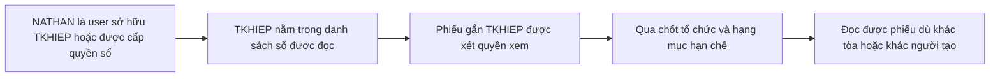
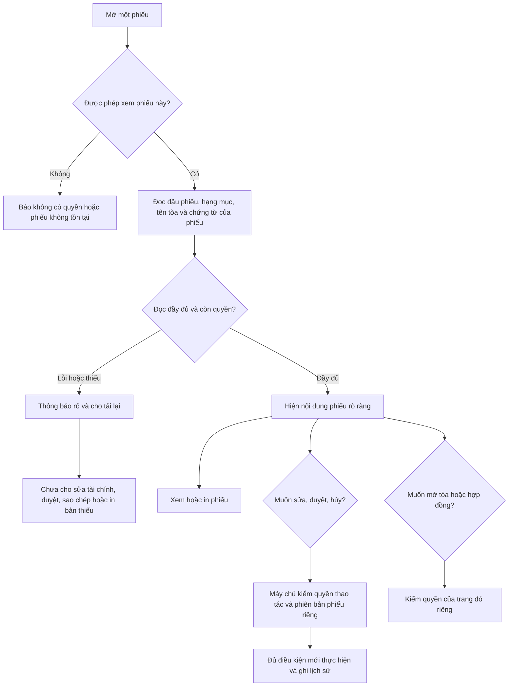

# Kế hoạch sửa quyền đọc đầy đủ phiếu thu chi

> **For agentic workers:** REQUIRED SUB-SKILL: Use superpowers:subagent-driven-development (recommended) or superpowers:executing-plans to implement this plan task-by-task. Steps use checkbox (`- [ ]`) syntax for tracking.

**Goal:** Người có quyền xem một phiếu đọc được nội dung đầy đủ của phiếu, không bị hiểu nhầm là mất hạng mục và không thao tác tài chính từ dữ liệu tải thiếu.

**Architecture:** Lấy quyền đọc phiếu cha làm căn cứ cho nội dung con; giữ chốt tổ chức và hạng mục nhạy cảm. Một đường đọc chi tiết có kiểu rõ ràng trả dữ liệu và trạng thái đầy đủ cho các màn hình; nhãn tòa chỉ được trả trong ngữ cảnh phiếu đã được phép xem. Quyền sửa, duyệt, hủy, chi tiền và mở dữ liệu khác của tòa tiếp tục được kiểm riêng.

**Tech Stack:** React, TanStack Query, Zod, Supabase/PostgreSQL RLS, Vitest, Playwright fleet.

**Trạng thái:** Kế hoạch ngày 28/09/2026; chưa triển khai. Người dùng đã chốt hai quy tắc: (1) thấy đủ hạng mục và tên tòa trên phiếu, không mở dữ liệu khác của tòa; (2) giữ quyền thấy mọi phiếu thuộc sổ được cấp, kể cả do người khác tạo. Không còn câu hỏi nghiệp vụ chặn việc hoàn thiện plan.

## Global Constraints

- Tuân thủ [Project Contract](../../engineering/PROJECT_CONTRACT.md); đọc lại source đúng khu vực khi bắt đầu triển khai.
- Org THẬT chỉ đọc dữ liệu nghiệp vụ. Fixture/E2E ghi tại project TEST hoặc org DEMO và tự dọn.
- Không tự cấp quyền xem toàn tòa, admin, hoặc quyền ghi để sửa lỗi đọc.
- Không backfill hạng mục, đổi số tiền, ngày, trạng thái duyệt, posting, ngưỡng chi hoặc phân bổ KQKD trong hạng mục này.
- Không sửa migration đã merge/deploy. Sinh migration bằng `node scripts/tao-ten-migration.mjs align_voucher_detail_read`.
- Phạm vi money + authorization + migration: review độc lập, draft PR, gate bắt buộc và lane migration có backup.
- Triển khai trong worktree riêng từ `origin/main`, dưới `../codex-worktrees/quyen-doc-chi-tiet-phieu`; dùng công cụ worktree của phiên trước, xử lý khác biệt đường dẫn nếu công cụ không hỗ trợ. Giữ nguyên công việc khác trong checkout hiện tại.
- Trailer commit: `Co-Authored-By: Codex <noreply@openai.com>`.

## 1. Vấn đề và kết quả cần đạt

[Báo cáo kiểm tra](../../audits/2026-09-28-quyen-doc-chi-tiet-phieu.md) ghi bằng chứng, số đo và giới hạn. Phiếu PC2609103 trong ảnh có hạng mục Thu chi khác 941.040 đ. Dưới quyền NATHAN, đầu phiếu hiện nhưng item và tòa bị chặn; đã xác nhận 769 phiếu cùng dạng ở tài khoản này.

Giải thích bình dân: quyền xem sổ cho phép đọc “đầu tờ phiếu”, nhưng quyền xem tòa đang khóa “dòng mua gì”. Cần làm cho một phiếu được đọc nhất quán, đồng thời không biến việc đọc phiếu thành quyền mở mọi phòng, khách, hợp đồng hay báo cáo của tòa đó.

Kết quả nghiệm thu của ca gốc: cùng ID phiếu, NATHAN thấy **Thu chi khác — 941.040 đ**, tên **950NK** nếu chọn A; quyền truy cập danh sách khách/hợp đồng/tòa khác và quyền thao tác tài chính không tăng ngoài phạm vi đã chốt.

## 2. Quyết định hiển thị đã chốt

**Người xem được phiếu qua sổ quỹ nhưng không quản lý tòa thì được thấy gì?**

| Phương án | Hành vi | Đánh giá |
|---|---|---|
| **A — đề xuất** | Đủ nội dung phiếu, tên hạng mục và tên tòa trên phiếu; link mở dữ liệu khác vẫn theo quyền riêng | Dễ hiểu và kiểm chứng; cần trả tên tòa qua ngữ cảnh phiếu |
| B | Đủ hạng mục, tên tòa vẫn ẩn và ghi rõ lý do | Nhỏ hơn A nhưng chứng từ vẫn thiếu bối cảnh |
| C | Chỉ tổng tiền, phần chi tiết ghi rõ “không có quyền xem” | Giữ chủ ý chia quyền nếu đó là yêu cầu nghiệp vụ; không đạt mục tiêu nhìn đủ phiếu |

Người dùng đã chọn **A**. “Đủ nội dung” trong đề xuất kỹ thuật gồm các dòng thu/chi, tên loại trên dòng, kỳ, ghi chú/chứng từ thuộc phiếu, lịch sử phiếu. Quyền hạn chế đã áp ở phiếu cha vẫn phải thỏa: phiếu nhạy cảm bị từ chối thì toàn bộ nội dung cũng bị từ chối. Không mở toàn bộ danh mục hạng mục hoặc toàn bộ thư viện file.

Nếu chọn B: bỏ nhánh trả tên tòa, dùng trạng thái nhãn bị giới hạn. Nếu chọn C: giữ hạn chế đọc có chủ ý, bỏ mục mở item RLS và đổi tiêu chí thành thông báo rõ + chặn thao tác từ chi tiết thiếu; các kiểm thử lỗi tải/cache vẫn cần.

Tên tài khoản trong ảnh ban đầu còn cần xác nhận để kiểm lại đúng phiên; việc này không cản xây plan hoặc ca hồi quy đã tái hiện với NATHAN.

### 2.1 Phạm vi xem phiếu qua sổ — đã chốt giữ hiện trạng

User hỏi: quản lý thấy phiếu chi của tòa khác là theo rule nào, có phải do chính người đó tạo?

**Hiện trạng đã kiểm:** `income_expenses_select_fund_member` cho đọc phiếu gắn sổ được cấp, không bắt người xem là người tạo. Riêng NATHAN vừa có `accounts.user_id` của TKHIEP, vừa có phân công CUSTODIAN còn hiệu lực. Do đó phiếu của người khác cũng có thể được thấy qua sổ này; vẫn chịu chốt tổ chức/hạng mục hạn chế.



Người dùng đã chọn **giữ tất cả phiếu thuộc sổ được cấp như hiện tại, kể cả người khác tạo**. Hai lựa chọn giới hạn theo tòa/người tạo hoặc chỉ phiếu tự tạo không được áp dụng. **A quyết định nội dung được đọc; lựa chọn ở mục này quyết định tập phiếu được đọc.**

Các đợt kỹ thuật dưới đây giữ policy cha. Không thêm `user_id = auth.uid()` để giới hạn phiếu về người tạo, không thay chủ sổ TKHIEP và không tự thu hồi binding của NATHAN. Các policy permissive hiện OR với nhau; không áp restrictive toàn cục làm mất quyền kế toán/admin/người nhận ngoài yêu cầu.

## 3. Flow sau khi sửa, đọc theo nghiệp vụ



Quy trình tạo phiếu vẫn là: nhập thông tin → kiểm quyền tạo và quyền dùng sổ → lưu phiếu cùng các dòng → áp quy tắc duyệt tại thời điểm tạo → ghi sổ theo trạng thái hợp lệ. Thay đổi này sửa việc đọc và sự đầy đủ của dữ liệu trước thao tác; không duyệt lại các phiếu cũ.

## 4. Thiết kế kỹ thuật được đề xuất

### 4.1 Một nguồn xác định ai thấy phiếu

Giữ quyền đọc `income_expenses` đang vận hành làm nguồn quyết định. Đổi policy SELECT của item theo mẫu lịch sử đã có: tồn tại phiếu cha người gọi đọc được; kiểm tổ chức item khớp phiếu. Giữ các policy RESTRICTIVE tổ chức, demo/sandbox, hạng mục hạn chế. Không thêm đường admin bypass mới.

Trước apply phải thống kê item có org null/lệch cha. Nếu có, tách bằng chứng và quyết định xử lý; không tự nới phép so hoặc backfill để gate xanh.

Mẫu ý định của policy, sau khi đã chứng minh dữ liệu org tương thích:

```sql
USING (EXISTS (
  SELECT 1 FROM public.income_expenses v
  WHERE v.id = income_expense_items.income_expense_id
    AND v.organization_id IS NOT DISTINCT FROM income_expense_items.organization_id
));
```

Cùng quy tắc đọc áp cho supplements/revisions và file bổ sung thuộc phiếu. **Tách helper đọc khỏi điều kiện ghi**: `ie_supplement_can_read_v1` hiện được cả append RPC dùng làm guard. Không đổi helper rồi vô tình mở rộng quyền bổ sung; giữ nguyên ma trận ghi trước/sau bằng test, hoặc tách hàm kiểm append với các điều kiện ghi hiện hành.

Header policies hiện không đọc lại bảng item; client `items!inner` không tự tạo vòng đệ quy RLS. Vẫn cần test query có filter item và kiểm dependency SQL để không đưa một policy cha→con mới tạo vòng.

### 4.2 Trả tên tòa trong phạm vi phiếu, không mở bảng tòa

Thêm public reader `read_income_expense_details_v1(p_organization_id uuid, p_voucher_ids uuid[]) RETURNS jsonb`.

- Giới hạn 200 ID không null, loại trùng; bắt buộc đăng nhập, org đầu vào không null và khớp phiếu đọc được qua RLS. Không tự thêm điều kiện thời hạn membership chặt hơn nguồn quyền cha trong reader con.
- Owner là role đọc mới chuyên dụng `NOLOGIN`, `NOBYPASSRLS`, kế thừa authenticated; áp `row_security=on`. Mẫu action snapshot reader tháng 9 chỉ là tham khảo lịch sử: migration `20260921085952_restore_before_contract_settlement.sql` đã gỡ mẫu này. Tạo role/RPC mới, kiểm catalog/ACL riêng, không giả định role/helper mẫu đang chạy.
- Lọc ID qua RLS thật của `income_expenses` trước khi trả chi tiết. ID không thấy không được trả nhãn, count, sự tồn tại hay nội dung.
- Helper private đặc quyền chỉ nhận tập ID đã lọc; kiểm org và quan hệ ID thật. Chỉ grant EXECUTE cho role đọc chuyên dụng, không cho authenticated/anon/service_role. Helper chỉ trả tên tòa và tên loại gắn trực tiếp với các dòng của phiếu được phép xem; không trả hồ sơ tòa/phòng/khách/hợp đồng.
- Đối với hạng mục nhạy cảm, chỉ trả tên trong ngữ cảnh phiếu mà chốt nhạy cảm ở phiếu cha cho phép. Không đổi quyền picker danh mục. Room/tenant/invoice links tiếp tục dùng quyền riêng hiện hành; không tự mở rộng metadata các đối tượng này.
- Items vẫn đọc dưới RLS. So số dòng thật trong phạm vi cha hợp lệ với số dòng trả ra; không che bất nhất bằng dữ liệu rỗng. Không dùng reader V2 cũ nếu chưa chứng minh nó cùng semantics quyền với header hiện tại.
- Header, items và thông tin đầy đủ được đọc trong cùng snapshot. Giữ số tiền dạng decimal/string tại boundary; mapping hiện hành được kiểm riêng trước khi đổi kiểu toàn ứng dụng.

Hợp đồng phía TypeScript dự kiến:

```ts
type VoucherReadIssue =
  | 'ITEMS_INCOMPLETE'
  | 'RELATED_DATA_UNAVAILABLE'
  | 'SCOPE_MISMATCH';

type VoucherDetailRead = {
  voucher: IncomeExpenseWithRelations;
  expectedItemCount: number;
  itemsComplete: boolean;
  issues: VoucherReadIssue[];
  displayContext: {
    buildingName: string | null;
    buildingLabelState: 'AVAILABLE' | 'NOT_ASSIGNED' | 'UNAVAILABLE';
  };
};

type VoucherDetailReadResponse = {
  schemaVersion: 1;
  actorId: string;
  organizationId: string;
  authorizationVersion: number;
  rows: VoucherDetailRead[];
};
```

Các kiểu này đặt trong module mới ở mục 5; `IncomeExpenseWithRelations` lấy từ types hiện hữu. Zod phải validate output tại boundary. Error HTTP/permission/database được ném ra cho query state; không biến thành response thành công với `rows=[]`.

**Đủ dữ liệu khác với đúng số tiền.** `itemsComplete` so count thật với count đã đọc trong cùng snapshot; actual zero là đọc đủ zero, không phải lỗi tải. Phiếu thường có zero dòng phải hiện “Phiếu chưa có dòng hạng mục”; phiếu hệ thống được nhận diện bằng nguồn đã xác minh hiện “Bút toán hệ thống không có dòng hạng mục”. Không giả tên loại hoặc lấy total làm một item. Cả hai trường hợp không tự mở quyền sửa/duyệt: vẫn kiểm loại phiếu và writer hiện hành.

### 4.3 Giao diện và thao tác

- Dùng chung một loader cho list enrichment, popup, mobile, trang riêng, phiếu tổng và trang in. Danh sách vẫn lấy ID/count/filter bằng query hiện hữu, sau đó enrich theo ID bằng reader mới. Loader chia nhóm tối đa 200 ID, gộp theo ID và thứ tự đầu vào; một nhóm lỗi hoặc thiếu không được đánh dấu cả batch đầy đủ.
- Loading: “Đang tải chi tiết phiếu…”. Error: “Không tải được hạng mục. Thử lại”. Incomplete: “Chi tiết phiếu chưa đầy đủ. Vui lòng tải lại trước khi thao tác”. Không ẩn hẳn phần Hạng mục trong các trạng thái này.
- Nút sửa tài chính/duyệt/copy/print cần bản chi tiết đầy đủ vừa tải; quyền hành động vẫn theo máy chủ. Chặn tự `window.print()` khi lỗi hoặc thiếu. Không tính đây là bằng chứng thay thế ACL/guard của writer.
- Lưu ID phiếu đang chọn; khi query cập nhật, popup lấy dữ liệu mới theo ID. Thu hồi quyền phải đóng/ẩn nội dung không còn được phép, không giữ object cũ.
- Sửa bản nháp: giữ CAS hiện có. Mảng item thay thế chỉ được dựng từ bản đọc đầy đủ; nếu reload/phiên bản đổi thì bắt tải lại. Không dùng việc thêm một item để “chữa” form đang thiếu dữ liệu gốc.
- Bổ sung ghi chú/chứng từ giữ guard ghi riêng và xử lý permission denial rõ ràng. Mở được nội dung không tự sinh quyền append.
- Mọi key list/batch/standalone/print/detail mới được invalidate theo mutation và realtime liên quan. Tôn trọng cơ chế xóa cache khi đổi người dùng/tổ chức đang có; không bỏ cơ chế đó để tối ưu.

### 4.4 Bộ lọc và báo cáo

Kiểm list không lọc, lọc loại hạng mục, lọc kỳ, lọc tòa, phiếu tổng và báo cáo cùng actor. Sau sửa policy, một phiếu đã được xem không được biến mất chỉ vì hạng mục của nó không đọc được.

Đường báo cáo cash/accrual phải phân biệt “thật sự không có item” và “item không đọc đủ”; không fallback total vào kỳ/ngành mục mặc định ở ca thiếu. Giữ nguyên scope quyền của báo cáo; việc thấy một phiếu qua sổ không tự cấp báo cáo toàn tòa. Chỉ sửa nhánh chứng minh chịu lỗi này; các giới hạn 1.000 phiếu khác được đo và ghi thành việc riêng nếu độc lập.

## 5. Các đợt triển khai và kiểm chứng

### Đợt 1 — Khóa ca hồi quy và chuẩn bị số đo

**Files:** tạo `scripts/test-voucher-detail-read-authz.mjs`, `.e2e-fleet/specs/voucher-detail-read-scope.spec.ts`; cập nhật `tooling/test-matrix.json` và lệnh `gate:voucher-detail-read` trong `package.json`.

**Consumes:** actor/org/fixture TEST hoặc DEMO từ vault chính theo credential contract. **Produces:** harness chạy bằng JWT thật, kết quả cho từng ca có/không được phép; không có secret trong artifact.

- [ ] Tạo fixture có một phiếu chi, hai item, hai tòa và hai tổ chức; actor chỉ có sổ, actor chỉ có tòa, actor không có quyền, actor người nhận chuyên biệt. Dọn fixture trong finally.
- [ ] Viết assertion số dòng và ID cụ thể; baseline ca có sổ/không tòa phải tái hiện thiếu item, không chấp nhận test skip hoặc zero fixture.
- [ ] Chạy `node scripts/test-voucher-detail-read-authz.mjs --env test`; chế độ production nếu bổ sung về sau chỉ đọc, không tạo fixture.
- [ ] Ghi số phiếu visible, thiếu item, nhãn thiếu theo từng actor bằng aggregate hoặc phân trang ổn định; đo p95 của query đại diện làm baseline.
- [ ] Đăng ký suite vào CI/test-matrix bằng lệnh runner thực tế, không chỉ tạo test file.

### Đợt 2 — Đồng nhất RLS đọc và reader chi tiết

**Files:** tạo migration bằng generator ở mục Global Constraints; tạo `src/lib/incomeExpenseDetailRead.ts`, `src/lib/incomeExpenseDetailReadRpc.ts`, `src/lib/__tests__/incomeExpenseDetailRead.test.ts`; cập nhật generated types/surfaces bằng generator.

**Consumes:** quyền đọc header hiện hành và ma trận đợt 1. **Produces:** RPC/hợp đồng mục 4.2, helper đọc bổ sung tách khỏi ghi, policy item kế thừa cha.

- [ ] Viết test JWT chứng minh đúng ca fund-only, special recipient, restricted denied, org khác, membership inactive, thu hồi possession. Phân biệt owner-only, possession-only, owner+possession: thu hồi binding không được kỳ vọng xóa đường owner còn hợp lệ. Với membership ACTIVE nhưng timestamp hết hạn/revoked, đo parity cha-con và ghi gap riêng nếu header còn thấy; không tự siết riêng reader con.
- [ ] Kiểm catalog/owner/ACL và dữ liệu org null/lệch trước khi viết migration; dừng nếu không khớp căn cứ review.
- [ ] Đổi policy SELECT item, bổ sung/revision/file theo cha; giữ nguyên bảng quyền tòa, category picker và ma trận mutation trước/sau.
- [ ] Thêm reader + private label/count bridge theo mục 4.2; test gọi helper trực tiếp bị từ chối và ID trộn nhiều org không rò nhãn/count.
- [ ] Test định lượng: item 0 thật; item bị chặn; type join bị ẩn; nhiều hơn 1.000 item; concurrent revision; query `items!inner`; không vòng RLS và không timeout.
- [ ] Chạy `npm run test-env:thu-sql --` với đường dẫn migration vừa sinh, rồi harness JWT qua PostgREST; không lấy SQL role postgres làm pass phân quyền.

### Đợt 3 — Dùng cùng dữ liệu trên các màn hình

**Files:** tạo `src/hooks/income-expenses/detailRead.ts`, `src/components/income-expenses/VoucherItemsSection.tsx`, test tương ứng `src/components/income-expenses/__tests__/VoucherItemsSection.test.tsx`; sửa `src/hooks/income-expenses/queries.ts`, `src/hooks/useVoucherDetail.ts`, `src/components/income-expenses/IncomeExpenseDetailDialog.tsx`, `src/components/income-expenses/IncomeExpenseDetailMobile.tsx`, `src/pages/payments/VoucherDetailPage.tsx` và `src/pages/payments/IncomeExpensePrintPage.tsx`.

**Consumes:** `VoucherDetailReadResponse`. **Produces:** một trạng thái đọc thống nhất, lỗi hiển thị rõ, bản in chỉ dùng chi tiết đủ.

- [ ] Viết test component theo 4 tình huống: loading, error với retry, thiếu item, complete với actual zero; test complete một dòng 941.040 đ hiển thị tên loại và kỳ.
- [ ] Đưa wrapper RPC vào hook; component không gọi RPC trực tiếp. Bỏ catch/log rồi map lỗi thành `[]` ở các đường thay thế. Test loader với 201 và 401 ID, một nhóm lỗi/thiếu, ID trùng, thứ tự kết quả khác đầu vào; đảm bảo không báo batch complete khi một nhóm chưa đủ.
- [ ] Đồng bộ popup/mobile/standalone/print và child trong batch; giữ thứ tự list, tổng count, filter và phạm vi người dùng.
- [ ] Đảm bảo code+UUID được giữ đúng; hai phiếu có cùng code không bị tráo dữ liệu.
- [ ] Chạy `npx vitest run src/lib/__tests__/incomeExpenseDetailRead.test.ts src/components/income-expenses/__tests__/VoucherItemsSection.test.tsx`.

Mẫu assertion nghiệp vụ cần có trong test component (dữ liệu mock phải tự tạo trong file test):

```ts
expect(screen.getByText('Thu chi khác')).toBeVisible();
expect(screen.getByText('941.040 đ')).toBeVisible();
expect(screen.queryByText('Không tải được hạng mục. Thử lại')).toBeNull();
```

### Đợt 4 — Ngăn thao tác từ dữ liệu thiếu và làm mới popup

**Files:** sửa `src/components/income-expenses/IncomeExpenseForm.tsx`, `src/components/income-expenses/IncomeExpenseDetailDialog.tsx`, `src/components/income-expenses/IncomeExpenseDetailMobile.tsx`, `src/components/income-expenses/IncomeExpenseBatchDetailDialog.tsx`, `src/pages/payments/IncomeExpensePage.tsx`, `src/pages/payments/IncomeExpenseMobilePage.tsx` và `src/hooks/realtime/finance.ts`. Thêm `src/lib/__tests__/voucherDetailCompleteness.test.ts`.

**Consumes:** trạng thái đầy đủ + phiên bản phiếu từ reader. **Produces:** guard giao diện, cache cập nhật, ma trận quyền ghi giữ nguyên.

- [ ] Test items không đủ thì không submit full replacement, không duyệt, không copy và không tự in; retry đủ thì xét lại quyền hành động bình thường.
- [ ] Test người chỉ được đọc không thể sửa/duyệt/hủy/append bằng gọi RPC trực tiếp. Kiểm cả route legacy và V2 cùng trạng thái feature đang dùng; ghi khác biệt thành kết quả riêng nếu đã tồn tại từ trước.
- [ ] Test đổi notes giữ item; sửa hợp lệ hai dòng bảo toàn các dòng không sửa; CAS conflict bắt reload. Test nháp zero item không bị tự thêm dòng.
- [ ] Thay selected object bằng selected ID ở nơi bị stale; invalidate đủ key list/batch/detail/print. Form đang gõ giữ baseline từ lần tải đầy đủ đầu tiên, không reset mỗi lần realtime; nếu phiên bản server đổi, báo conflict và bắt tải lại khi lưu.
- [ ] Mở popup, đổi item qua phiên fixture khác, xác nhận popup cập nhật; thu hồi quyền xem và xác nhận dữ liệu hết quyền không còn hiện sau refetch.
- [ ] Chạy `npx vitest run src/lib/__tests__/voucherDetailCompleteness.test.ts` và E2E đợt 6.

### Đợt 5 — Bộ lọc, báo cáo và ngoại lệ dữ liệu cũ

**Files:** sửa đúng nhánh đã chứng minh trong `src/hooks/useAccrualReport.ts` và component báo cáo phân bổ lợi nhuận desktop/mobile; thêm `src/lib/__tests__/voucherDetailReportScope.test.ts`.

**Consumes:** ca đọc thiếu và ca zero item thật đã tách riêng. **Produces:** báo cáo không tự gán sai kỳ/nhóm vì đọc thiếu, không mở rộng quyền báo cáo.

- [ ] Viết fixture kỳ item khác ngày phiếu; cùng actor so list/filter/print/report. Thiếu item phải báo không đủ dữ liệu thay vì fallback sang ngày phiếu.
- [ ] Kiểm phiếu có nhiều loại, loại cọc, ghi nhận KQKD một phần và phiếu hủy/chờ duyệt theo semantics hiện hành.
- [ ] Kiểm system source `adjustment.close_coc` và legacy zero item riêng; chỉ hiển thị đúng trạng thái, không backfill.
- [ ] So tổng/nhóm/kỳ trước-sau bằng query đối chứng cùng quyền. Nếu phát hiện lỗi phân trang độc lập, ghi thành việc riêng và không tuyên bố đã sửa toàn bộ báo cáo.
- [ ] Chạy `npx vitest run src/lib/__tests__/voucherDetailReportScope.test.ts`, cả hai gate reconcile tiền và ca cap-1000 theo Contract.

### Đợt 6 — Review, phát hành và đo lại

**Files:** migration/provenance/surfaces sinh tự động, test-matrix, tài liệu nghiệp vụ nếu cần và báo cáo kết quả triển khai mới. Không sửa báo cáo audit thành “đã hết lỗi” khi chưa có số đo sau phát hành.

- [ ] Typecheck, build, bundle, test liên quan; kiểm mutation làm hỏng chốt org/parent/incomplete và xác nhận suite đỏ đúng lý do, khôi phục hash.
- [ ] E2E headless tại `.e2e-fleet`: `npx playwright test specs/voucher-detail-read-scope.spec.ts`; đăng nhập JWT thật từng vai TEST/DEMO, kiểm console errors, in và mobile.
- [ ] Test boundary bổ sung: không quyền, khác org, restricted, possession hết hiệu lực và không còn owner/đường khác, membership inactive, null/mismatched org, ID không tồn tại, request RPC 201 ID, helper private không gọi trực tiếp được. Kiểm cả CUSTODIAN/OPERATOR/KNOWER và ba chân sổ nguồn/tiền thối/làm tròn.
- [ ] Review độc lập tập trung RLS/read-vs-write/storage; tạo draft PR vì chạm tiền/quyền/migration. Fetch/rebase; chỉ stage file thuộc hạng mục, chạy `npm run gate:truoc-push`.
- [ ] Migration: stage trước provenance generator; chạy gate provenance, view-invoker nếu có view, stable-fn-locks, catalog/surfaces và generated types. Lưu bằng chứng backup/rollback theo lane.
- [ ] Phát hành theo thứ tự tương thích: schema đọc bổ sung trên TEST → UI TEST → xác nhận gate → migration production bằng lane → promote app đúng SHA. Không làm đứt frontend cũ trong khoảng chuyển tiếp.
- [ ] Production smoke chỉ đọc: đúng UUID phiếu gốc hiển thị đủ với vai đã chốt; phép đo cùng actor/scope cho số thiếu item = 0 hoặc danh sách ngoại lệ được giải thích, không nuốt lỗi.
- [ ] Nếu lỗi, rollback app về deployment đã xác minh; policy/RPC rollback bằng migration forward đã review, không replay/sửa migration cũ hoặc xóa dữ liệu.

Các lệnh gate chính được dùng theo phạm vi thay đổi:

```text
npm run typecheck:baseline
npm run build
npm run gate:bundle
npm run gate:reconcile-money
npm run gate:reconcile-money-v2
npm run gen:types
npm run types:normalize
npm run types:check
npm run gate:rpc-cast
npm run gate:test-matrix
npm run gate:migration-provenance
npm run docs:check
```

Lệnh có credential/runtime thiếu phải báo “chưa xác minh”; không ghi pass. Với bất biến quyền/tiền, ghi riêng bằng chứng idempotency, concurrency và mutation theo Contract, không chỉ nói “unit tests xanh”.

## 6. Ma trận nghiệm thu tối thiểu

| Người / tình huống | Phiếu | Hạng mục / tên tòa theo A | Sửa, duyệt, dữ liệu khác |
|---|---|---|---|
| Được đọc sổ, không quản lý tòa | Theo header RLS | Đủ trong ngữ cảnh phiếu | Kiểm riêng; không tự cấp |
| Có quyền tòa | Theo header RLS | Đủ | Theo quyền hiện hữu |
| Chỉ là người tạo, không còn đường đọc nào | Không tự suy quyền từ creator | Không trả nội dung khi cha bị chặn | Writer hiện hành tự kiểm |
| Người nhận lương / lợi nhuận / cổ đông | Chỉ phiếu của đường được cấp | Đủ nội dung phiếu được cấp | Không mở các phiếu khác của sổ |
| Phiếu hạn chế, thiếu quyền | Bị chốt nhạy cảm từ chối | Không lộ dòng, tên, count, file | Từ chối |
| Khác org / membership inactive, không còn đường cha hợp lệ | Từ chối | Không lộ | Từ chối |
| Membership ACTIVE nhưng timestamp hết hạn | Đo quyền cha hiện hành | Phải cùng semantics cha | Ghi gap hardening riêng; không tự đổi quyền |
| Thu hồi hết các đường xem trong lúc đang mở | Refetch phải loại phiếu | Không giữ object cũ | Không thao tác bằng cache cũ |
| Chỉ thu hồi binding, user vẫn là chủ sổ | Còn đường owner hợp lệ theo hiện trạng | Đủ theo quyền còn lại | Không nhầm là lỗi cache |
| Lỗi mạng / item thiếu / quan hệ org sai | Báo lỗi rõ | Không giả dữ liệu | Chặn thao tác phụ thuộc |
| Phiếu hệ thống zero item | Hiện đúng loại chứng từ | Nêu không có dòng, không dựng giả | Giữ guard system-source |
| Hơn 1.000 dòng / batch lớn | Đúng count và toàn bộ trang | Không cắt âm thầm | Dữ liệu đầy đủ trước thao tác |

## 7. Điểm kết thúc của hạng mục

Hoàn tất khi ca gốc và các đường đọc nêu trên nhất quán; không rò khác tổ chức/phiếu nhạy cảm; không mở rộng quyền ghi; lỗi tải được báo rõ; test JWT, E2E, đối chiếu tiền và review độc lập đạt; có số đo sau phát hành.

Trong lần lập plan này đã hoàn thành điều tra chỉ đọc và viết kế hoạch. Người dùng đã chốt cả nội dung hiển thị và phạm vi xem theo sổ. Chưa triển khai migration/UI, chưa chạy bộ E2E hồi quy của giải pháp, chưa áp dụng/push/promote thay đổi ứng dụng. Tài khoản trong ảnh ban đầu chưa được xác nhận nhưng đã có ca tái hiện NATHAN và ca đối chứng trình duyệt NG TÂM.

## 8. Kiểm tra tài liệu của lần lập plan

- Đã có review độc lập về policy cha/con, tách quyền đọc/ghi, ownership khi thu hồi, membership parity và chia batch 200 ID; đã sửa các phát hiện trong plan.
- Đã đối chiếu live rằng các reader mẫu tháng 9 không còn tồn tại; chỉ dùng chúng làm tham khảo lịch sử.
- `npm run docs:check` chưa đạt do 28 lỗi link/nội dung trùng trong các tài liệu audit/plan khác đã có trước. Không có lỗi được báo tại hai tài liệu mới của hạng mục này; bước images của lệnh tổng chưa chạy do link gate dừng trước.
- Việc kiểm riêng link nội bộ và khoảng trắng của hai file mới được thực hiện trước bàn giao. Đây là kiểm chứng tài liệu, không phải kiểm chứng giải pháp phần mềm.
