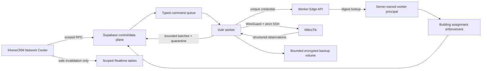

# MikroTik Network Center Security Hardening And Production Rollout Design

## Mục tiêu

Đưa Network Center hiện có lên production trên iHomeCRM và Vultr theo kiến trúc
Hybrid A+, giữ nguyên giao diện đã làm, nhưng đóng toàn bộ 14 finding của scan
`f159d30d-46a1-4fcd-b1cf-b939007ae3e1` trước khi bật thao tác trên router thật.
Hệ thống phải vận hành ổn định trên VPS 2 vCPU, 4 GB RAM, 80 GB disk, quản lý
khoảng 15 tòa nhà, mỗi tòa tối đa một MikroTik đang hoạt động và không đặt hạn
mức tổng cho Aruba display-only.

## Bằng chứng và phạm vi

- Baseline đã quét là range
  `22a85f7224a4869e20ad8739d23ec9ddfff6a8c1..46d890093a1b9016a4461b7007ea8af0b3acd2d5`.
- Scan ghi nhận 14 finding: 1 High, 10 Medium, 3 Low.
- Thiết kế production gốc nằm tại
  `docs/superpowers/specs/2026-07-28-mikrotik-center-production-design.md`.
- Tài liệu này bổ sung và thay thế các phần không còn an toàn của thiết kế gốc,
  đặc biệt là fleet-global worker bearer, heartbeat toàn cục, resource lifecycle,
  định danh interface/router user, command reconciliation và shadow migration.
- Không redesign UI. Các thay đổi UI chỉ nhằm giữ đúng idempotency, trạng thái
  `UNCERTAIN`, phân trang và loại bỏ subscription heartbeat không an toàn.

## Quyết định đã khóa

1. Quyền người dùng vẫn chỉ gồm `network_center.view` và
   `network_center.execute`. Người có quyền execute chạy ngay, không có approval.
2. Browser không bao giờ nhận router secret, worker secret, WireGuard private
   key, raw RouterOS export hoặc service-role key.
3. Worker đầu tiên có key ổn định `vultr-network-center-01`. Khi provision lần
   đầu, script gán worker này cho tất cả tòa nhà Network Center đang enabled.
   Tòa nhà tạo sau đó và worker tạo sau đó phải có assignment rõ ràng; không có
   fleet-wide wildcard.
4. Aruba hợp lệ không có quota tổng. Hệ thống giới hạn tốc độ tạo identity mới,
   tuổi thọ discovery-only, kích thước batch và kích thước trang hiển thị, chứ
   không từ chối inventory chỉ vì tổng số lớn.
5. Mọi thay đổi schema được thêm bằng migration mới; không sửa migration đã có
   thể đã được apply.
6. Rollback không được khôi phục caller-controlled `workerId`, bearer dùng chung,
   heartbeat global, hay thực thi trên interface chỉ dựa vào display name.
7. Frontend có ba runtime mode rõ ràng `off|demo|production`; production build
   fail closed về `off` nếu Vercel chưa cấu hình. Mỗi building có rollout state
   `OFF|READ_ONLY|EXECUTE`, mặc định `OFF`, để canary không phụ thuộc UI.
8. Không apply SQL production bằng helper một-file không có receipt. Mọi migration
   rollout dùng reviewed SHA, content hash manifest, catalog preflight/readback và
   forward-fix procedure.

## Các hướng đã cân nhắc

### 1. Credential và assignment registry theo worker — chọn

Mỗi worker có principal riêng, nhiều credential version có thể overlap khi
rotate, và assignment theo `(organization_id, building_id)`. Edge xác thực
credential rồi tự suy ra worker principal; JSON do worker gửi không còn quyền
chọn identity. Đây là ranh giới hoàn chỉnh với chi phí nhỏ nhất trên VPS hiện có.

### 2. Short-lived signed capabilities — chưa chọn

Token ngắn hạn giảm thời gian replay nhưng cần issuer, signing-key lifecycle,
clock discipline và thêm failure mode. Hướng này chỉ bổ sung sau registry nếu
thực tế yêu cầu thời gian thu hồi ngắn hơn khả năng rotate credential trực tiếp.

### 3. Worker pool tách theo tenant/building group — chưa chọn

Process/network isolation cho blast-radius tốt hơn nhưng tăng RAM, deployment,
volume và on-call burden. Với 15 tòa nhà trên VPS 4 GB, chưa có số liệu chứng minh
chi phí này cần thiết; logical assignment vẫn bắt buộc dù có tách pool.

Đối với resource lifecycle, thiết kế chọn enforcement ngay tại boundary sở hữu.
Đối với router identity/command state, thiết kế chọn managed-resource registry và
typed postcondition, đồng thời triển khai các local guard ngay từ wave đầu. Test
migration dùng database disposable và production denylist; rollback-only trên
production bị loại bỏ hoàn toàn.

## Kiến trúc sau hardening

## 1. Worker identity, credential và assignment

### Schema authoritative

Migration hardening tạo các bảng sau:

- `network_workers`: UUID principal, `worker_key` duy nhất, display name, status
  `ACTIVE|DRAINING|DISABLED`, capability set, version và timestamps.
- `network_worker_credentials`: worker UUID, SHA-256 digest duy nhất của secret
  random 32 bytes, safe fingerprint, `not_before`, `expires_at`, `revoked_at`,
  `last_used_at`. Plaintext secret không vào database.
- `network_worker_building_assignments`: worker UUID, organization UUID,
  building UUID, active interval và audit actor. Primary/unique key ngăn duplicate
  assignment và composite FK ngăn cross-tenant building.

Credential mặc định rotate mỗi 90 ngày. Hai credential được overlap tối đa 24
giờ để rollout không gián đoạn. Revoke có hiệu lực ở request tiếp theo; Edge
không cache kết quả auth lâu hơn một request trong bản đầu tiên.

### Request flow

1. Worker gửi `x-network-worker-secret`; body không chứa authoritative
   `workerId`.
2. Edge kiểm tra chiều dài, băm SHA-256 và gọi RPC service-role-only
   `network_center_authenticate_worker_v2`.
3. Database chỉ trả về một principal đang active có credential đúng thời gian và
   chưa revoke. Không khớp hoặc khớp mơ hồ đều fail closed.
4. Edge inject UUID principal đã xác thực khi gọi worker RPC v2.
5. Mọi list, claim, renew, stage, complete, telemetry, discovery, incident,
   snapshot, rollup và heartbeat RPC đều join assignment trước khi đọc/ghi.
6. Một `workerId` cũ có thể được nhận tạm như non-authoritative compatibility
   hint trong đúng một rollout; mismatch bị 401 và được audit. Sau cutover, field
   này bị xóa khỏi client và Edge schema.

### Heartbeat và browser scope

- `network_worker_heartbeats` trở thành internal-only: revoke authenticated
  SELECT và bỏ khỏi Supabase Realtime publication.
- Fleet/building RPC tổng hợp heartbeat bằng assignment và chỉ trả safe fields:
  status, version, capability, last seen, queue age và assigned building health.
- UI không subscribe trực tiếp heartbeat. Nó dùng Realtime từ current projection,
  incidents và command events để invalidate; heartbeat được refetch theo query
  interval khi trang đang mở.

### Provision, rotate và revoke

Script admin duy nhất:

- sinh secret bằng CSPRNG;
- ghi atomic vào file caller chọn với quyền owner-only;
- chỉ gửi digest/fingerprint vào RPC service-role-only;
- không in plaintext, request header, service key hoặc file content;
- hỗ trợ `provision`, `rotate`, `revoke`, `assign`, `unassign`, `status`;
- readback principal, credential version và assignment count sau mỗi thao tác.

Lần đầu provision `vultr-network-center-01`, script snapshot danh sách building
enabled và tạo assignment tường minh cho từng dòng. Không có trigger tự gán
building tương lai.

Script admin riêng provision `network_device_connections` bằng opaque
`credential_ref`, management address và pinned host-key fingerprint. Nó chỉ nhận
building/device đã assignment, không nhận plaintext router password vào database,
và readback row đã redact sau insert/update.

## 2. Resource budgets và lifecycle

### SFTP và RouterOS reads

- Text export: tối đa 8 MiB, deadline 30 giây.
- Binary backup: tối đa 64 MiB, deadline 60 giây.
- Reader dùng bounded stream; dừng trước khi allocation vượt limit, abort khi
  deadline hết và luôn đóng handle/SFTP session ở mọi terminal path.
- Post-read size check vẫn giữ như defense-in-depth nhưng không phải control chính.
- Timeout/oversize tạo typed worker error, không được giữ lease vô thời hạn.

### Queue admission và retention

Admission nằm trong cùng transaction/advisory lock với enqueue:

- tối đa 1 disruptive command non-terminal cho mỗi device;
- tối đa 10 command non-terminal cho mỗi actor;
- tối đa 50 command non-terminal cho mỗi organization;
- semantic duplicate cooldown 5 phút cho reboot/cycle, 60 giây cho DNS flush,
  DHCP renew và snapshot;
- idempotency key của một user intent ổn định qua close/reopen/reconnect.

Khi chạm limit, RPC trả typed conflict/rate-limit và không tạo command/event/audit
orphan. Đây là admission control, không phải approval. Command, attempts và
command events giữ 36 tháng; audit giữ 84 tháng; cleanup theo batch và tenant.

### Backup volume

- Mỗi router giữ tối đa 20 encrypted backups và tối đa 60 ngày.
- Toàn volume giữ tối đa 16 GiB và luôn dự trữ ít nhất 16 GiB filesystem free.
- Rotation theo trạng thái terminal và oldest-safe-first; không xóa artifact đang
  được command sử dụng hoặc artifact gần nhất đã verify cho từng router.
- Trước disruptive mutation, worker phải chứng minh pre-backup đã được ghi,
  checksum/readback đúng và vẫn đáp ứng reserve. Không đáp ứng thì command fail
  trước mutation.
- Metrics gồm used bytes, free reserve, oldest artifact, cleanup lag và rejection.

### Aruba inventory không quota tổng

- Batch API vẫn tối đa 256 rows và có thể gọi lặp không giới hạn.
- Stable identity ưu tiên serial; nếu thiếu dùng normalized hardware MAC. Display
  name/IP/neighbor key chỉ là alias, không tạo identity mới khi stable key trùng.
- Record không có stable hardware key bị quarantine, không thành durable device.
- Mỗi MikroTik được tạo tối đa 64 discovery identities mới trong 60 phút; existing
  identities vẫn refresh bình thường. Phần vượt ngưỡng bị quarantine và tạo
  incident `INVENTORY_DEGRADED`, không làm router offline.
- Discovery-only device chuyển `STALE` sau 7 ngày không thấy và purge sau 30 ngày.
  Device đã pin/enroll không bị purge tự động.
- UI luôn dùng keyset pagination; page mặc định 100, tối đa 250. Tổng inventory
  hợp lệ không bị giới hạn.

### Malformed inventory isolation

- Validate từng item. Valid device/interface/client rows vẫn được ingest.
- Invalid item được ghi vào tenant-scoped quarantine chứa reason code và dữ liệu
  đã redact, giữ tối đa 7 ngày và tối đa 1,000 rows/building bằng oldest-first.
- Poll result phân biệt `TELEMETRY_OK_INVENTORY_DEGRADED` với router unreachable.
- Quarantine hoặc inventory error không được mở critical router-outage incident.

### Client history

- `network_client_sessions` giữ 90 ngày kể từ `last_seen_at`.
- `address_history` chỉ giữ 16 địa chỉ distinct gần nhất theo thứ tự quan sát.
- Cleanup chạy batch, tenant scoped, idempotent; current presence TTL không đổi.
- Không xóa `network_client_links` đang còn hiệu lực; expired link theo retention
  policy audit 36 tháng.

## 3. Managed router identity và typed command state

### Managed-resource identity

Migration tạo `network_managed_resources` làm registry authoritative với:

- device UUID và resource kind;
- immutable RouterOS key (`default-name` cho physical interface);
- current display name chỉ để trình bày;
- enrolled role/protected flag do worker sở hữu;
- ownership source, enrollment state và last verified time.

Khóa duy nhất `(device_id, resource_kind, stable_key)` ngăn cùng một physical
resource có hai identity. `network_interfaces` tham chiếu
`managed_resource_id`; display name tiếp tục nằm ở interface row nhưng không
tham gia quyết định authorization. Managed RouterOS user cũng có resource kind
riêng để lưu ownership marker readback.

Cycle port chỉ được phép khi interface UUID resolve đến resource enrolled,
`default-name` thuộc physical access-port allowlist, role là `ACCESS`, protected
là false và worker readback khớp cả current name lẫn default-name. Interface
không có immutable physical key fail closed. Rename không thay đổi protection.

### Bootstrap principal và recovery network

- Managed RouterOS username cố định `ihome-netops`; không nhận arbitrary username.
- User phải có exact ownership comment marker do generator tạo. Nếu username đã
  tồn tại nhưng marker không khớp, bootstrap dừng trước mutation.
- Rollback chỉ disable/remove user khi exact marker khớp; không đụng unmanaged
  principal.
- Recovery IPv4 CIDR chỉ nhận RFC1918 `/24` đến `/32` và phải gắn với explicit
  non-WAN recovery interface. Public, CGNAT, multicast, loopback, link-local,
  `/0` đến `/23`, hoặc thiếu interface đều bị từ chối.
- Management firewall rule ràng buộc đồng thời `src-address` và `in-interface`.
  Recovery access chỉ được thu hẹp sau khi WireGuard handshake và SSH host-key
  verification đã pass.

### Stable user intent và server duplicate suppression

- Idempotency UUID được tạo khi mở một intent và lưu ở hook/store cao hơn dialog.
- Close dialog không clear token khi mutation đang pending hoặc command chưa có
  authoritative terminal state.
- Reopen cùng target/action dùng lại token; tạo token mới chỉ sau terminal result
  hoặc explicit reset được phép.
- Database tính semantic fingerprint từ organization, building, device,
  interface, action và canonical parameters; cooldown không phụ thuộc UUID do
  browser chọn.

### Typed postcondition và reconciliation

Migration bổ sung `intent_type`, canonical managed-resource target,
`pre_observation`, `expected_postcondition`, observation deadline và transition
version vào `network_commands`, đồng thời tạo append-only
`network_command_observations` cho worker readback.

- DNS flush: ACK từ exact command là success; ambiguous transport được retry an
  toàn bằng cùng intent vì action idempotent.
- DHCP renew: success khi lease target `bound` và freshness/expiry tăng sau intent;
  không applicable trả terminal typed result, không giả success.
- Access-port cycle: success khi exact immutable interface đã quan sát transition
  và trở lại enabled; chỉ thấy router reachable không đủ.
- Reboot: success khi router reconnect và boot/uptime observation chứng minh boot
  mới sau intent; reachable với uptime cũ không đủ.
- Nếu deadline hết mà postcondition chưa chứng minh, trạng thái là `UNCERTAIN`,
  không `SUCCEEDED` và không blind replay disruptive action.

Database kiểm tra legal transition bằng version/fencing token. Worker gửi typed
observation; không được tự chọn terminal success ngoài state machine.

## 4. Migration test isolation

- `scripts/test-cross-tenant.mjs` không bao giờ apply migration lên project được
  nhận dạng production hoặc project không có disposable marker.
- Thiếu runtime test RPC trên production là setup failure, không kích hoạt shadow
  migration fallback.
- Full migration/cross-tenant test mặc định chạy trên một local Supabase stack
  được Supabase CLI + Docker tạo mới cho từng run, với random project/DB identity
  và immutable run marker. Stack bị hủy sau khi export evidence.
- PR code chỉ nhận ephemeral least-privilege credential; production PAT/service
  key không hiện diện trong job.
- Controller đặt concurrency cap 2, timeout 12 phút, luôn export bounded evidence
  và cleanup; janitor xóa orphan trong 30 phút.
- Production verification sau migration chỉ dùng read-only catalog/readback RPC
  đã deploy, không chạy schema DDL trong transaction test.

Production denylist không có rollback. Khi disposable environment không sẵn,
test fail rõ ràng và production deployment dừng.

## 5. Delivery controls và host lifecycle

### Database rollout artifact

Repository giữ một manifest machine-readable chứa reviewed Git SHA, ordered
migration paths, SHA-256 từng file, expected preconditions và expected catalog
fingerprint sau apply. Deployer:

1. xác nhận target project ref đúng allowlist production và Git worktree sạch;
2. đối chiếu local content hash với manifest;
3. chạy read-only catalog preflight và dừng khi trạng thái không khớp;
4. apply theo thứ tự, ghi receipt từng migration;
5. readback table/constraint/index/policy/grant/function/publication sau mỗi bước;
6. lưu bounded receipt không chứa PAT/service key;
7. dùng additive forward-fix migration nếu một bước đã commit nhưng bước sau lỗi.

CI/shadow test không được dùng production allowlist hoặc production credential.

### Edge lifecycle

- Edge function worker dùng custom worker credential nên deploy rõ
  `--no-verify-jwt`; database credential registry vẫn là authentication authority.
- Deploy script ghi deployed source digest/version, kiểm missing/wrong credential
  denial và assigned heartbeat success.
- Rollback redeploy exact previous source digest; credential/assignment boundary
  không bị rollback. Không dùng old fleet bearer làm rollback mechanism.

### Vultr lifecycle

Deployment script tạo/check:

- WireGuard package/config, firewall, IP forwarding và boot enablement;
- root-owned secret directory, worker UID/GID `10001`, file mode `0600` và backup
  directory writable chỉ bởi worker;
- immutable image tag theo Git SHA và digest, previous-image pointer;
- systemd unit phụ thuộc `network-online.target` và `wg-quick@wg0.service`;
- Docker healthcheck, CPU/RAM/PID limits, read-only root filesystem và restart
  policy;
- blue-green start ở emergency-stop/read-only, health/readback rồi atomic switch;
- rollback về exact previous image nếu health/readback không đạt.

Script không restart, mount hoặc đọc volume/secret của 9Router hay Zalo worker.

### Frontend off/canary

- `off`: route/menu/launcher không cho mở Network Center và không tạo Supabase
  query/subscription.
- `demo`: chỉ dùng demo repository trong development/test; production Vercel
  không được cấu hình mode này.
- `production`: RPC vẫn lọc theo building rollout state. `OFF` trả unavailable,
  `READ_ONLY` cho view/polling nhưng server từ chối enqueue, `EXECUTE` cho phép
  hai quyền hiện có hoạt động bình thường.
- Global environment mode và server-side building state đều phải cho phép; UI
  không phải enforcement boundary.

## Error handling và observability

Mọi rejection có stable machine code, safe operator message, worker/building
scope và correlation ID. Log không chứa secret, raw config, full backup, private
key hoặc customer-linked identity.

Các saturation signal bắt buộc:

- auth failure/revoked credential/assignment denial;
- queue depth và admission rejection theo scope;
- SFTP bytes/deadline abort;
- backup bytes/free reserve/cleanup lag;
- Aruba identity churn/quarantine/stale cleanup;
- client retention cleanup lag;
- command `UNCERTAIN` age và typed postcondition failures.

Alert grouping theo building; worker-global infrastructure alert chỉ hiện cho
system owner, không phát qua tenant heartbeat row.

## Rollout production

### Wave 0 — Guard và baseline

1. Rebase branch lên `origin/main`, giữ worktree sạch và chạy baseline tests.
2. Land production denylist cho migration test trước mọi database write.
3. Thêm frontend `off` mode và building rollout state mặc định `OFF`.
4. Ghi nhận baseline memory, disk, queue, polling và current production schema.
5. Tạo reviewed migration hash manifest và dry-run catalog preflight.

### Wave 1 — Inert schema và tactical guards

1. Apply additive hardening migration qua manifest/receipt deployer: worker registry/assignments, lifecycle
   fields/indexes, immutable resource fields và typed command metadata.
2. Regenerate Supabase types, chạy definer ACL và view-invoker gates.
3. Deploy worker/Edge code vẫn ở read-only/emergency-stop mode.
4. Bật local guards: bounded streams, CIDR/user protection, interface immutable
   checks, duplicate suppression và typed reconciliation.

### Wave 2 — Worker cutover

1. Provision `vultr-network-center-01` và explicit assignments cho enabled sites.
2. Issue unique credential vào VPS secret file; verify owner-only permissions.
3. Provision redacted connection metadata và pinned host key bằng admin script.
4. Deploy immutable worker image bằng blue-green/systemd ở emergency-stop.
5. Chạy 7 polling cycles ở read-only, so principal/assignment/telemetry readback.
6. Xóa global bearer khỏi Edge/VPS và chứng minh old bearer bị 401.
7. Revoke browser heartbeat access và chuyển UI sang scoped aggregate.

### Wave 3 — Demo router

1. Backup/read-only inventory và xác nhận recovery path.
2. Apply bootstrap ownership marker và narrow recovery rule.
3. Verify WireGuard, strict SSH host key, polling, snapshots và redaction.
4. Chạy DNS flush; DHCP renew nếu applicable; cycle đúng access port; reboot cuối
   cùng. Mỗi action phải có pre-backup, typed postcondition và audit hoàn chỉnh.
5. Replay 14 PoC/verifier trên candidate; không mở rộng sang router thật khác.

### Wave 4 — iHomeCRM và fleet rollout

1. Enable DEMO org, sau đó một building thật ở read-only.
2. Bật execute cho building đó chỉ khi backup reserve và postcondition smoke pass.
3. Mở dần các assignment còn lại; Aruba vẫn display-only.
4. Push verified commit lên `origin/main`; đợi Vercel serve đúng revision.
5. Chạy headless production E2E ở `https://ptcrm.vercel.app/network-center`.

## Rollback

- Global emergency stop dừng claim command; `changes_paused` dừng từng building.
- Worker credential có thể rotate/revoke độc lập; assignment có thể drain nhưng
  không được fallback wildcard.
- Có thể tắt frontend route/repository hoặc roll back worker image mà giữ schema,
  audit, stable intent và immutable identity.
- Có thể pause destructive purge nhưng giữ byte/deadline/admission/disk guards.
- Không rollback bằng cách xóa evidence hoặc re-enable global heartbeat/bearer.
- Router rollback phục hồi exact management-service state đã capture trước
  bootstrap; không chỉ bật lại SSH rồi bỏ qua các service bị lockdown thay đổi.

## Verification contract

### Automated

- TDD red/green cho từng finding và legitimate control tương ứng.
- Worker unit/integration tests cho bounded stream, timeout, cleanup, backup
  rotation/reserve, item quarantine và typed reconciliation.
- Edge tests cho missing/wrong/revoked/expired credential, body workerId spoof,
  assignment denial và authorized route success.
- SQL/static/runtime tests cho credential uniqueness, RLS/grants, assignment ở
  mọi worker RPC, atomic admission, retention, stable resource, legal transition
  và heartbeat scoping.
- Cross-tenant matrix trên disposable DB: owner/view/execute/wrong building/wrong
  org/offboarded/anonymous và hai worker có assignment khác nhau.
- UI tests cho stable intent qua close/reopen, duplicate conflict, `UNCERTAIN`,
  pagination và không subscribe global heartbeat.
- Chạy `npm run typecheck:baseline`, focused Vitest, worker tests/typecheck,
  Deno tests, build, `check-definer-acl`, `check-view-invoker`, migration/type
  drift, migration deployer dry-run/readback, `git diff --check` và Playwright
  fleet headless. CI bắt buộc chạy cả nested worker package, Edge tests, queue và
  retention verifiers.

### Security closure

Mỗi finding phải có test hoặc verifier chứng minh vulnerable path cũ thất bại và
legitimate behavior vẫn chạy. Một finding không được coi là fixed chỉ vì code đã
đổi hoặc static scan không còn match.

### Production readback

Hoàn tất chỉ khi có bằng chứng mới cho tất cả điều sau:

- production revision, migrations, generated types và Edge revision đồng bộ;
- migration hashes/receipts và live catalog fingerprint khớp reviewed manifest;
- Vultr chạy immutable image digest đúng revision, systemd/WireGuard boot order
  và previous-image rollback đã rehearsal;
- old fleet bearer và spoofed worker ID bị từ chối;
- unassigned worker không đọc/claim/write được building khác;
- browser không đọc/subscription heartbeat ngoài scope;
- worker heartbeat mới, WireGuard handshake và demo telemetry đều fresh;
- encrypted backup volume nằm dưới cap và trên free-space reserve;
- một safe command và reboot demo có đầy đủ pre-backup, stages, typed
  postcondition và audit;
- production UI load live data, xử lý offline/uncertain trung thực và không có
  unexpected console/network error;
- không có regression mới trong auth, finance hoặc route hiện có.

## Không nằm trong đợt này

- UI redesign hoặc visual polish.
- Approval workflow cho nhân viên.
- Arbitrary RouterOS CLI hoặc Aruba write operations.
- Một VPS/worker process riêng cho mỗi building.
- Short-lived token issuer hoặc dedicated router-controller service.
