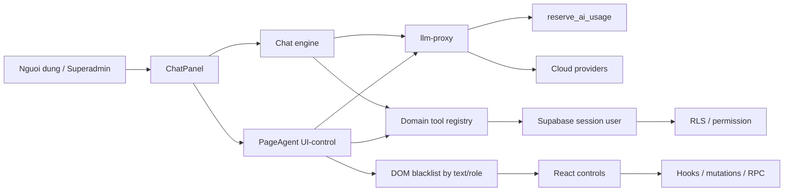
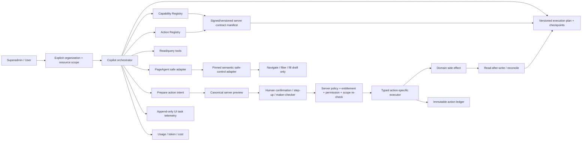

# AI Copilot Superadmin Full-Site Control - Audit And Target Design

**Ngay:** 2026-08-13

**Cap nhat:** 2026-08-28 - doi chieu evaluation, remediation source, rerun test va bang chung release

**Trang thai:** Audit hien hanh; implementation da remediation mot phan, chua dat full-site/release gate

**Source snapshots:** audit baseline tai `main@931eb9e78cee`; local readonly harness tai
`main@2584f23ab54375432ec3346244419f36c5f99b2d`; worktree moi nhat duoc doi chieu tren
`main@485577a2da063aa9c27f26b9bbad883479b05d7d`. Cac commit sau `2584f23a` khong doi cac path
Copilot lien quan, nhung worktree hien co thay doi Copilot chua commit/deploy. Gate hien bao 14 tool
(12 doc, 1 ghi, 1 dieu huong), 3 route navigation pilot va 146 route toan app. Cac finding baseline
o muc 4-6 phai doc cung Addendum 27; nhan lich su khong thay the artifact release hien hanh.

**Live evaluation supplement:** `docs/ai-copilot/COPILOT-EVALUATION-2026-08-13.md`
(SHA-256 `65450dca3cbe3926f2ec0bddc4eed62498fcd5d0ab3325e35965cc41a9152980`) ghi nhan
browser headless authenticated tren `https://ptcrm.vercel.app`, 40 case va read-only oracle tren org
THAT. Bao cao da duoc luu nhu snapshot bat bien; harness goc la local artifact da don. Run khong ghi
deployment source SHA, contract/tool manifest digest hay snapshot entitlement/permission, va chua
duoc audit nay tai chay doc lap. Vi vay no la bang chung live one-off de cap nhat finding, khong phai
CI/release attestation.

**Pham vi danh gia:** Chat nghiep vu, tra cuu tai lieu, domain tools, UI-control/PageAgent,
provider/quota, phan quyen, tenant scope, confirmation, audit, test va van hanh.

## 1. Ket luan dieu hanh

AI Copilot hien tai **chua du manh va chua du an toan de dieu khien toan bo website theo
quyen superadmin**.

He thong da co mot nen tang tot cho chat va tra cuu co kiem quyen: JWT qua proxy, entitlement,
kill switch, quota, tool registry loc quyen hai lan, truy van chay duoi session user va RLS lam
lop chan cuoi. Tuy nhien, kha nang dieu khien giao dien moi chi la pilot tren ba route, trong khi
toan app co 146 route declaration. Source hien hanh da tat cac primitive mang chi so va them
semantic safe-control, nhung chua co day du control marker va browser/release proof de khang dinh
rang cac control autosave khong tao side effect ngoai hop dong.

Verdict theo tung muc dich:

> **Trang thai hien hanh (28/08):** bang nay da reconciliation theo Addendum 27. Cac so lieu live
> C01-C40 van la baseline 13/08; cac remediation source khong duoc tinh la PASS neu chua co rerun
> deployment dung SHA va artifact release bat buoc.

| Muc dich | Verdict |
| --- | --- |
| Chat hoi dap, tra cuu nghiep vu co kiem quyen | **Mot phan - headline snapshot ghi 15 PASS, 7 PARTIAL, 8 FAIL; bang case cu the dem duoc 16 PASS, 7 PARTIAL, 7 FAIL (can reconcile)** |
| Doc so lieu qua domain tool/RLS | **Chua dat pilot release gate - query da remediation source nhung chua live rerun; multi-org con union scope** |
| Mo trang, loc danh sach tren pilot | **Worktree co 4 Copilot E2E spec (1 tracked + 3 spec moi); 3 spec moi chua git-track/live-run attested dung SHA** |
| Dien form nhap nhung khong commit | **Source co semantic safe-control va tat index primitive; chua dat browser/release proof** |
| Ghi du lieu co xac nhan | **Chua dat release gate - nonce server da co; prompt/store va negative E2E con thieu** |
| Duyet, vao so, xoa, doi quyen | **Khong duoc mo** |
| Dieu khien toan site | **Chua dat** |
| Tuyen bo production-ready cho full-site control | **Khong du co so** |

Khuyen nghi la chon kien truc **hybrid contract-first**:

1. PageAgent chi duoc navigation; filter va fill draft qua semantic safe-control adapter duoc pin,
   traversal-complete va verify tren browser.
2. Moi side effect phai di qua typed server action, khong commit bang click DOM.
3. Capability Registry hien huu la nguon so huu page surface; bo sung Action Registry tham chieu
   capability thay vi tao mot danh sach route/action song song.
4. Moi action co organization/resource scope, risk, permission, confirmation, idempotency,
   executor, audit va rollback contract.
5. Superadmin co quyen yeu cau rong, nhung van phai chot organization va tai nguyen cu the;
   quyen toan he khong duoc bien thanh scope ngam dinh toan he.
6. Yeu cau nhieu page/action phai co execution plan server-persisted, checkpoint va resume; history
   cua model/PageAgent khong duoc dung lam workflow state hay bang chung consent.
7. Page/Action Registry phai sinh immutable server manifest; runtime rollout chi co mot authority
   server va khong duoc vuot static ceiling cua manifest.

## 2. Objective, scope va Definition of Done

### 2.1 Objective

Thiet ke mot Copilot co the tiep can toan bo be mat san pham va ho tro superadmin dieu phoi
cong viec, nhung khong trao cho model quyen tu do click/ghi tuong duong mot nguoi dung dac quyen.

### 2.2 Trong pham vi

- Inventory page, route, permission, domain tool va knowledge hien tai.
- Read, navigate, filter, fill draft, write, approve va destructive action.
- Organization/building/resource scope cho superadmin va multi-organization user.
- Confirmation, maker-checker, idempotency, audit, rollback va kill switch.
- Orchestration nhieu page/action, checkpoint, resume, cancel va compensation.
- Provider/model readiness, quota, usage va knowledge freshness.
- Rollout theo domain va role-real verification.

### 2.3 Ngoai pham vi

- Khong sua code, migration, RLS, production config hoac entitlement trong tai lieu nay.
- Khong tu mo them route/action trong pilot hien tai.
- Khong cho product Copilot thao tac migration, secret, production infrastructure hoac terminal.
- Khong coi de xuat kien truc la bang chung finding da duoc khac phuc.
- Khong dung graph stale lam nguon ket luan.

### 2.4 Definition of Done cho chuong trinh nang cap

Full-site control chi duoc coi la dat khi:

1. Moi page renderable duoc map vao Capability Registry hoac co exemption ro ly do. Snapshot audit
   co 146 route declaration, gom 113 non-redirect va 33 redirect; gate implementation phai dem lai
   tu source thay vi hard-code con so nay lau dai.
2. Moi action Copilot co Action Contract va default-deny neu chua khai.
3. PageAgent khong the cham control ngoai semantic safe-control tool sinh tu contract. Voi
   PageAgent 1.11.0, `interactiveWhitelist` chi ep control duoc liet ke thanh interactive, complement
   tao bang `document.querySelectorAll('*')` bo sot open shadow root/same-origin iframe, va public API
   khong cho wrapper resolve lai private selector-map. Vi vay UI-control rollout phai disabled cho
   den khi dung pinned patch/fork/upgrade expose traversal-complete collector + pre-action validator,
   hoac thay index primitives bang semantic tool khong phu thuoc selector-map cua dependency.
4. Moi side effect duoc server re-check actor, organization, resource, permission va intent.
5. Model khong the tu tao bang chung consent bang boolean/text.
6. Moi side effect co authoritative append-only audit trong cung transaction khi co the.
7. E2E headless tren DEMO xanh cho superadmin, manager, staff, wrong-org va revoked-mid-task.
8. Autosave, icon-only action, prompt injection, replay va concurrency co negative test.
9. Model/provider chi duoc enable khi capability va pricing mode da duoc xac minh.
10. Canary co so lieu, rollback da dien tap va khong con blocker trong risk tier dang rollout. Phase
    L3 reversible write la optional cho baseline full-site read/navigation/draft; neu chua co business
    action duoc duyet thi bang chung bat buoc la moi `reversible_write` van disabled, khong phai mot
    positive canary gia dinh.
11. Request nhieu buoc co execution plan versioned, moi write step co consent rieng, resume re-check
    toan bo authority va downstream dung khi external effect chua biet ket qua.
12. Moi readonly action dang expose co query contract hop le voi deployed schema, production-like
    integration test cho positive/empty-state/wrong-org, va zero runtime query failure trong golden eval.
13. Golden eval tracked danh gia functional outcome, tool discoverability, multi-intent, relative date
    va latency; moi run bind exact source SHA, provider/model, contract/tool manifest digest,
    organization, entitlement va permission snapshot. Moi proxy-dependent run con phai bind deployed
    `llm-proxy` version, bundle digest va reviewed source SHA; missing/mismatched frontend hoac Edge
    attestation khong duoc tinh la release pass.
14. C36 rate-limit va C38 multimodal co tracked deployment E2E: controlled burst chung minh 429
    server-side truoc upstream, con upload fixture DEMO di qua file control -> proxy -> vision model;
    chi thay control hoac dung one-off result khong duoc tinh la pass.

Ma tran coverage DoD -> implementation/evidence:

| DoD | Task | Gate/evidence bat buoc |
| --- | --- | --- |
| 1. Tat ca page/route accounted | 3, 13 | `gate:copilot-pages`, rollout matrix counts |
| 2. Tat ca action contracted/default-deny | 4 | `gate:copilot-actions`, exact inventory |
| 3. PageAgent chi cham safe control | 5, 14 | dependency adapter proof + traversal/browser zero-mutation |
| 4. Server re-check actor/org/resource/permission | 2, 8, 11, 12 | wrong-org/revoke DB + E2E negatives |
| 5. Consent khong do model tu tao | 8, 12 | first-turn/payload-change/replay negatives |
| 6. Authoritative append-only audit | 6, 7 | privilege/trigger + effect-ledger parity |
| 7-8. Role-real va adversarial E2E | 5, 12-14, 16-18; 15 neu duoc chon | tracked headless matrix tren DEMO |
| 9. Provider/pricing/data readiness | 9 | `gate:copilot-providers`, proxy denial |
| 10. Canary/rollback khong blocker | 11, 16-18; 15 neu duoc chon | immutable rollout events, disabled-L3 negative hoac drill evidence |
| 11. Durable multi-step orchestration | 12, 18 | `gate:copilot-execution-plans`, resume/unknown-effect proof |
| 12. Read query correctness | 1, 2, 13, 18 | production-like query integration + zero runtime query failure |
| 13. Reproducible behavioral quality | 4, 12, 13, 18 | tracked golden eval + source/model/manifest/authz attestation |
| 14. Proxy/multimodal deployment regression | 9, 18 | Edge version/digest readback + rate-limit/multimodal live E2E |

## 3. Evidence basis va gioi han

### 3.1 Thu tu nguon su that

1. Route/guard va caller hien hanh trong `src/`.
2. Migration, live catalog va ACL production chi doc.
3. Contract manifests, generated inventories va SQL harness cua repo.
4. Gate/test output tai source snapshot.
5. Tai lieu he thong va tai lieu ke hoach hien huu.

### 3.2 Gioi han graph

`npm run gate:graph-freshness -- --nhiem-vu architecture` tai `main@32370bda942d` bao:

- UA graph stale 223 commit;
- 602 file da doi, 203 file moi;
- thieu 43 migration;
- thieu `services/openclaw-media-gateway`.

Do do tai lieu nay **khong doc hoac dung UA graph de ket luan**. Gate bao GitNexus van fresh voi
6 commit/2 file moi chua index, nhung phien audit khong co GitNexus query tool callable. Contract
manifest, source va live catalog van co do uu tien cao hon graph theo Project Contract.

### 3.3 Khoang trong runtime/browser

- Evaluation supplement da chay browser headless authenticated tren deployment that. Headline
  snapshot ghi C01-C30 la 15 `PASS`, 7 `PARTIAL`, 8 `FAIL`, nhung 30 dong case cu the dem duoc
  16 `PASS`, 7 `PARTIAL`, 7 `FAIL`; C31-C40 co 5 live pass, 4 static-only va 1 deployment fail.
- C36 la bang chung live tich cuc cho 429/rate gate va C38 la deployment fail multimodal, nhung ca hai
  van la one-off: chua co tracked burst test hay upload -> proxy -> vision-model smoke de lam release gate.
- Bang chung nay dong khoang trong "chua tung quan sat browser authenticated" o muc one-off, nhung
  khong dong release-evidence gap: harness da don, khong git-track, khong co golden dataset/CI suite,
  khong ghi exact deployment source SHA, contract/tool manifest digest, entitlement hay permission
  snapshot, va chua co independent rerun.
- Production khong hien upload anh/UI-control trong fixture da test, trong khi source co
  `data-testid="copilot-file"` va UI-control con phu thuoc entitlement + `ai_copilot.ui_control`.
  Khong co build/authz attestation nen chi ket luan deployment/fixture mismatch chua duoc giai thich;
  chua du bang chung de gan nhan source regression.
- Production 30 ngay co 29 chat request `ok`, 7 `upstream_error`, va 0 request
  `ui_control`. Vi vay khong co bang chung van hanh UI-control thuc te.

### 3.4 Snapshot production chi doc

Snapshot luc `2026-08-13T10:45:35.678983+00:00`:

| Chi so | Gia tri |
| --- | ---: |
| Global chat enabled | `true` |
| Global UI-control enabled | `true` |
| Entitlement | 4 user chat, 1 user UI-control |
| Provider enabled | 4 |
| Cloud model enabled | 70 |
| Model co input hoac output price bang 0/thieu | 69 |
| `ai_write_audit` table privilege cho authenticated | INSERT/UPDATE/DELETE |
| Non-internal trigger tren `ai_write_audit` | 0 |

Luu y: `DELETE` table privilege khong tu dong vuot RLS khi khong co DELETE policy. Blocker
immutability da duoc chung minh rieng boi UPDATE-own policy cho phep sua noi dung dong audit,
khong can dua vao gia dinh delete thanh cong.

Evaluation supplement cung cho thay cac RPC read-only tren org THAT nhan explicit organization va
building scope; count truoc/sau giu nguyen 520 customer, 1.121 invoice, 333 contract va 18 building.
Day la bang chung tich cuc ve read-only isolation cua cac RPC da test. Khong co reusable digest oracle
nen khong tuyen bo digest parity; no cung khong chung minh cac query Copilot truc tiep deu dung scope.

## 4. Ma tran muc do san sang

> **Cach doc:** cac dong khong lien quan remediation Copilot giu verdict audit goc. Cac dong query,
> organization, route, write confirmation/audit va deployment evidence duoi day da duoc reconciliation
> voi source snapshot 28/08; chi live/release artifact moi duoc phep dong finding.

| Boundary | Trang thai | Bang chung | Ket luan |
| --- | --- | --- | --- |
| JWT va cloud proxy | Dat | `llm-proxy` xac thuc bearer, provider/model allowlist | Nen tang tot |
| Kill switch, entitlement, rate, quota | Dat mot phan | `reserve_ai_usage` re-check server-side | USD cap sai neu pricing sai |
| Permission tool | Dat mot phan | Loc khi build va execute; session user + RLS | Chua co final object/scope contract cho moi tool |
| Organization scope | Chua dat | Selected org/fail-closed va directory RPC da co; 9 tool scoped hien gom 7 tool qua 8 RPC wrapper server-side, con `tim_khach_hang` va `hop_dong_sap_het_han` van query PostgREST bang bo loc `organization_id` do client cung cap; live catalog/readback, server-side selected-org authorization va role-real proof chua co | Blocker cho multi-org/superadmin |
| Knowledge allowlist | Dat mot phan | 25/29 docs, 7 permission-gated | Chi 5 review con hieu luc; 20 debt |
| Capability inventory | Dat mot phan | 27 capability, 146 route declaration | Chua dai dien toan site |
| Route navigation Copilot | Source da dong bo cho pilot 3 route; release chua xac minh | Tool va PageAgent guard cung 3 route; gate doi chieu 146 route; chua co E2E tracked | Chua phai full-site rollout |
| UI safe boundary | Blocker | Index primitive da tat, semantic adapter da co; production chua gan marker va chua co browser mutation proof | Chua chung minh autosave/portal control an toan |
| DOM action audit | Chua dat | Usage log chi request/model/token/cost/status | Khong truy vet click/input/navigation |
| Typed action catalog | Chua dat | Registry hien tai chi mo ta page surface | Khong co risk/consent/executor/rollback |
| Write confirmation | Chua dat release gate | Nonce preview/execute va canonical intent da co; E2E van thieu expiry/payload/replay/concurrency | Consent boundary co source remediation, behavioral proof chua du |
| Write audit integrity | Dat mot phan | Migration hardening/static tests da co trong source; chua co bang chung migration da apply tren runtime moi va chua co authenticated ACL/effect-ledger harness | Chua du release proof cho authoritative ledger |
| Idempotency | Dat mot phan | Unique key cho mot write tool | Client-derived, chi mot action |
| Financial safety | Dat mot phan | Tao `UNAPPROVED/PENDING`, account null | Van co side effect va consent yeu |
| Provider governance | Chua dat | 69/70 cloud model co price zero/thieu | USD cap khong dang tin |
| Local provider governance | Chua dat | Ollama browser -> localhost | Bypass reserve/finalize/log/revocation |
| Data egress governance | Blocker | DOM co mask nhung tool output/history vao model request | Chua bind data class voi provider |
| Multi-step orchestration | Blocker | Chat toi da 6 tool round; PageAgent reset task/history moi `execute()` | Khong co durable plan/checkpoint/resume/compensation |
| Read query correctness | Source remediated, live chua xac minh | FK-qualified chain + local production-like harness pass; thieu PostgREST/deployment rerun dung SHA | Chua dong 5 case live baseline |
| Tool routing/answer quality | Chua dat | Baseline live bo/sai tool, bo multi-intent, mat relative date; golden schema da co nhung chua co behavioral runner | Chua co golden functional gate |
| Copilot behavioral tests | Co artifact/schema trong worktree, chua co verdict | 4 E2E spec (1 tracked + 3 spec moi chua git-track); readonly/golden/page-agent moi chi la smoke/schema toi thieu; chua co live run attested/aggregate verdict | Khong the dung lam CI/release proof |
| Deployment/source attestation | Dat mot phan | Frontend build-SHA/helper da co; thieu readonly/golden E2E va Edge/authz attestation | Chua phan biet day du web/proxy drift voi fixture drift |
| Multimodal deployment path | Chua dat | C38 khong chay duoc vi thieu upload control tren fixture | Chua co upload -> proxy -> vision-model smoke |
| Proxy rate-limit regression | Dat one-off, chua reproducible | C36 burst live tra 429 dung mot lan | Chua co tracked policy-derived burst E2E |
| Full-site rollout | Chua dat | UI allowlist 3 route | Khong du coverage va safety gate |

### 4.1 Verdict theo quyen superadmin va nhom nghiep vu

`Superadmin` hien tai lam rong tap du lieu ma actor co the doc/ghi qua policy hien co; no khong tao
them execution semantics cho Copilot. Vi vay verdict phai tach theo cap kha nang:

| Nhom nghiep vu | Hien tai Copilot lam duoc | Boundary con thieu | Muc rollout toi da truoc nang cap |
| --- | --- | --- | --- |
| Dashboard/bao cao | Hoi dap va 4 typed query tool hien huu | Chua phu tat ca report, data egress/provider class | Read shadow/canary tung report |
| Toa nha/phong/khach/hop dong | Source hien chi cong bo pilot 3 route; query mot so so lieu | Full-site page/action contract, final org/resource binding, E2E | Read/navigation chi mo theo batch sau khi co proof |
| Hoa don/cong no/so quy | Read tool va finance draft client-side | Consent, ledger, pricing, maker-checker proof | Read; draft server-action sau Tasks 7-12 |
| Cau hinh/phan quyen/user | Co the huong dan tu docs | Authz/session/control nhay cam, khong co action contract | Guidance/read; final action khong autonomous |
| Van hanh noi bo/nhan su | Mot so doc/query co permission | Coverage/action inventory va separation of duties | Read theo permission |
| Zalo/network/infrastructure | Chat/doc mot phan | Credential, external effect, infrastructure boundary | Chat/read; infrastructure forbidden |
| Public/auth/self-service | Route co trong app inventory | Khong co permission representative, credential/session risk | `none` tru explicit public-read |

Do do "tiep can toan bo website" trong target design nghia la **100% page/action duoc accounted va
co policy**, khong nghia la model duoc thao tac moi control. Ket qua cuoi cung cho superadmin la:

- L0-L2: read, navigate, filter, fill draft co the tu dong khi contract va evidence xanh;
- L3-L4: chi typed server action, preview/consent tung effect, audit/readback bat buoc;
- L5: chi lap evidence/approval request, nguoi duyet doc lap thuc hien final effect;
- L6: migration, secret, terminal, deploy va production infrastructure luon ngoai product Copilot.

## 5. Diem manh can giu

Khong nen viet lai toan bo Copilot. Nhung lop sau dang dung huong va nen duoc tai su dung:

- `llm-proxy` giu cloud key server-side, xac thuc JWT va tu choi provider/model ngoai allowlist.
- `reserve_ai_usage` gom kill switch, entitlement, permission, rate va quota trong server transaction.
- RPC noi bo reserve/finalize/perms khong cap execute cho `authenticated`.
- Tool registry loc quyen truoc khi dua cho model va re-check luc execute.
- Tool truy van bang Supabase session user, de RLS lam lop phong thu cuoi.
- Live evaluation xac nhan JWT/entitlement/permission/provider/rate gates tu choi dung cac fixture
  khong du authority; burst 21 request tao 20 HTTP 200 va 1 HTTP 429 `rate_limited`.
- Read-only oracle tren org THAT dung explicit org/building scope va khong lam doi cac count business
  chinh; day la nen tang tot de mo rong typed read contract.
- UI-control vo hieu `execute_javascript`, mask PII va tu choi local provider.
- Write tool tai chinh chi tao draft cho duyet, khong vao so va khong gan cashbook.
- Capability Registry da co ownership route/nav/permission/docs/risk o muc page surface.
- PageAgent 1.11.0 co san `interactiveBlacklist`, `interactiveWhitelist`, `onBeforeStep`,
  `onAfterStep` va history event. Tuy nhien, whitelist la additive chu khong exclusive, traversal
  vao open shadow/same-origin iframe rong hon collector DOM thong thuong, va selector-map private;
  phai pin dependency adapter/semantic tools thay vi xem complement light-DOM la authority.

## 6. Findings theo muc do uu tien

> **Luu y ve lich su:** cac mo ta trong muc nay giu nguyen finding tai snapshot baseline 13/08 de
> truy vet nguyen nhan. Trang thai source va bang chung release hien hanh phai doc Addendum 27; khong
> dien giai cac cau mo dau nhu "hien" trong finding lich su thanh claim code da xac minh ngay nay.

### B1 - Blocker: UI-control co the ghi gian tiep qua control autosave

`src/copilot/safetyGuard.ts` chi blacklist `button`, `a`, role button/menuitem,
`type=submit`, text nguy hiem va `data-ai-risk`. Khong co component production nao gan
`data-ai-risk` hoac `data-ai-safe`.

Tren `/invoices`, route dang nam trong `PILOT_ROUTE_ALLOWLIST`,
`PaymentsSummaryDialog` goi `updateMethod.mutate` ngay khi chon mot
`DropdownMenuItem`. Khong can nut Luu/Submit.

**He qua:** khong cap write tool cho PageAgent khong dong nghia voi read-only. Blacklist theo
text khong the chung minh absence of side effect.

**Control bat buoc:** khong dung complement collector o app nhu boundary authority. PageAgent 1.11.0
traverse open shadow root va same-origin iframe, nhung `document.querySelectorAll('*')`/`root.querySelectorAll('*')`
khong bao phu hai surface nay; `selectorMap` va `flatTree` lai private nen app khong the resolve lai
index mot cach supported ngay truoc click/input/select.

Task dependency-adapter phai chon va pin mot trong hai duong co the verify:

- patch/fork/upgrade PageController de expose traversal-complete safe-control policy va mot
  `resolveElementForAction(index)`/pre-action hook public; hoac
- disable toan bo index-bearing primitives va thay bang semantic safe-control tools nhan stable
  `controlId`, resolve DOM fresh tren tat ca document/open-shadow/same-origin-iframe roots, validate
  route/page/contract revision/kind ngay truoc interaction, roi dispatch mot lan.

Cross-origin iframe khong duoc interactive trong product Copilot. `execute_javascript` absent;
indexed scroll absent neu khong co cung pre-action validator. UI-control/entitlement giu disabled
neu spike khong chung minh duoc boundary nay. Test phai dung runtime/browser that voi light DOM,
portal, open shadow root, same-origin iframe, stale/replaced node va network-write assertion; helper
unit hoac whitelist don le khong phai bang chung default-deny. Moi commit du lieu di typed server action.

### B2 - Blocker: Chua co authoritative action audit

`ai_usage_logs` ghi request, provider, model, token, cost, latency va status; no khong ghi
navigation, input, click, control ID, entity, before/after, consent hoac rollback reference.

`ai_write_audit` cho user UPDATE dong cua minh de gan `entity_id`, nhung policy khong gioi han
cot duoc sua. Khong co trigger cam UPDATE/DELETE.

**He qua:** khong the tra loi dang tin cay "AI da lam gi, duoi scope nao, user da dong y gi,
va side effect nao da xay ra".

**Control bat buoc:** tach hai lop:

- UI task telemetry append-only de dieu tra tung PageAgent step.
- Server action ledger authoritative, duoc ghi cung transaction voi side effect; correction
  bang compensating event, khong UPDATE dong cu.

### B3 - Blocker tai baseline 13/08: Write confirmation do model tu khai

Tai snapshot evaluation 13/08, `tao_phieu_thu_chi_nhap` nhan `xac_nhan:boolean`. Prompt yeu cau model preview truoc, nhung
server khong co nonce/intent chung minh preview da hien va user da dong y o turn khac.

**He qua:** model, prompt injection hoac conversation reconstruction co the gui
`xac_nhan=true` ma khong co consent proof doc lap.

**Control bat buoc:** server issue short-lived intent/nonce gan actor, organization, action,
canonical payload hash, permission snapshot va expiry. Execute consume nonce mot lan va
re-check permission/scope.

### B4 - Blocker tai baseline 13/08: Organization scope chua duoc chot ro cho superadmin

`OrganizationContext` tra `organization: organizations[0]`. `ChatPanel` luu thread voi org do,
nhung `ToolCtx` hien chi co `perms` va `navigate`; domain tool khong nhan selected org canonical.
`get_my_organizations` la membership-scoped, nen mot superadmin khong co membership cung chua co
typed directory de chon tenant can dieu phoi.

**He qua:** khi co nhieu org, "quyen toan he" co the bi nham thanh "org dau tien" hoac query
gom scope khong ro. Day la loi nghiep vu va audit, ngay ca khi RLS ngan leak.

**Control bat buoc:** selected organization explicit, persisted va validate trong ACTIVE set;
multi-org chua chon thi fail closed. Normal user lay tap chon tu ACTIVE membership; superadmin can
typed server organization directory de chon mot tenant ACTIVE ngay ca khi khong co membership, khong
doc bang truc tiep hoac nhan org ID tu model. Quyen liet ke/chon nay khong thay final-resource
permission/deny va organization lifecycle re-check. Moi action bind final organization va resource.

### F1 - Fix-now tai baseline: Hai whitelist route dang lech nhau

`MO_TRANG_ROUTES` cong bo nam route:

- `/apartments`
- `/invoices`
- `/customers`
- `/contracts`
- `/buildings`

`PILOT_ROUTE_ALLOWLIST` chi co ba route dau. Agent co the goi `mo_trang` toi contracts/buildings,
sau do `onBeforeStep` dung task o buoc ke tiep.

Gate `check-copilot-routes.mjs` chi kiem route va permission ton tai, chua kiem
`MO_TRANG_ROUTES subset PILOT_ROUTE_ALLOWLIST`.

Tai baseline 13/08, source verification minh hoa khoang trong nay: `gate:copilot-routes` van xanh
va bao 5 trang duoc cong bo tren 146 route, du hai route `/contracts` va `/buildings` van khong nam
trong guard 3 route. Source snapshot 28/08 da thu hep publication con 3 route va gate hien hanh bao
3/3; day la remediation source, chua phai bang chung full-site rollout vi van thieu E2E tracked.

### F2 - Fix-now: Khong co Action Registry

`CapabilityDefinition` co y chi mo ta be mat cap trang. No khong co action, risk, confirmation,
executor, idempotency, rollback, data class hoac E2E contract.

**He qua:** moi tool/action la mot tieu he quy uoc rieng; khong co default-deny va khong sinh
duoc policy/admin/test tu mot contract chung.

### F3 - Fix-now: Knowledge freshness chua du cho control rong

Gate hien tai cho thay:

- 25/29 tai lieu duoc ingest;
- 7 tai lieu gao quyen;
- 5 tai lieu co dau review con hieu luc;
- 20 tai lieu nam trong debt baseline;
- 12 tai lieu chua tung review.

`19-sop-tien-va-so-quy.md` la tai lieu nhay cam, co permission gate nhung chua tung review.

Final gate van xanh theo ratchet, khong phai theo readiness tuyet doi: `gate:copilot-docs` bao
25/29 file va 7 file gao quyen; `gate:doc-freshness` bao 5 dau review con hieu luc, 20 debt va 12 file
chua tung review. Trang thai nay chap nhan khong tang debt, nhung khong du de mo action tai chinh/rui ro.

**He qua:** Copilot co the thuc thi dung contract ky thuat nhung dua tren SOP cu.

### F4 - Fix-now: Pricing/quota khong phan biet free, metered va unknown

Production co 70 cloud model enabled; 69 model co input hoac output price bang 0/thieu. USD
quota van chay, nhung phan lon khong phan anh chi phi thuc.

**Control bat buoc:** moi model khai `pricing_mode = metered|free|self_hosted|unknown`.
`unknown` khong duoc enable; `metered` can gia duong; rate/token cap luon ap dung doc lap USD.

### F5 - Fix-now: Local provider bypass server control plane

Ollama duoc browser goi thang `localhost`; admin UI cung ghi ro quota/usage log khong ap dung.

**He qua:** revoke entitlement, kill switch va audit khong co hieu luc cho chat local dang chay.

**Control bat buoc:** production Copilot chi dung server proxy. Local mode la dev-only, khong
co action tool, hoac phai di qua signed local bridge co reserve/finalize va revocation.

### B5 - Blocker cho full-site read: Tool output va chat history chua co data-egress contract

`maskPii` hien duoc goi cho DOM `transformPageContent` va mot so formatter rieng, nhung chat loop
dua output cua domain tool thanh `role:'tool'` vao request model ke tiep. Tool khach hang/hop dong co
the tra ten that, phong, link entity va so dien thoai da che mot phan; history cu cung duoc nap lai.
`llm-proxy` chi doc provider `data_class = cloud|local_only`, chua nhan required data class cua request
hoac tool output de enforce provider policy.

**He qua:** mo read toan site co the day PII, financial detail hoac security metadata ra provider
khong duoc phep, du user co quyen doc trong app. Authorization doc DB khong dong nghia authorization
xuat du lieu cho ben thu ba.

**Control bat buoc:** moi action khai `dataClass`, field-level egress allowlist va retention policy.
Chat orchestrator sanitize/structure tool result truoc khi no thanh model message; proxy nhan server-
verifiable request classification, doi chieu provider/model data policy va deny downgrade/forged
header. History/tool outputs sensitive co TTL/redaction/version, khong replay vo han sang model moi.
Anh multimodal cung theo policy nay: size/MIME khong du de suy ra an toan; vision model/provider class,
user disclosure, request byte/count cap va hash-only audit la bat buoc, raw base64 khong duoc luu.

### F6 - Fix-now truoc rollout rong: Dependency PageAgent dung `eval`, production chua co CSP

Production build canh bao `@page-agent/page-controller` dung `eval`. UI-control da vo hieu tool
execute-JS, va runtime 1.11.0 chi goi `eval` ben trong `executeJavascript`; day khong phai bang chung
khai thac truc tiep. Tuy nhien, `vercel.json` hien chua co Content-Security-Policy, nen full-site
rollout phai them `script-src` khong co `'unsafe-eval'`, dua inline PWA watchdog ra file self-hosted,
dua inline watchdog CSS va Google-font `onload` handler ra khoi inline policy, pin tool
`execute_javascript` absent va chay browser smoke duoi header that. CSP can inventory app-wide cho
Supabase, fonts, images/media, geocode va iframe; khong mo wildcard chi de lam test xanh. Neu PageAgent
khong chay duoi CSP nay, UI-control giu disabled cho toi khi dependency duoc nang cap, patch/fork co
pin hoac thay the.

### B6 - Blocker cho yeu cau nhieu buoc: Khong co durable execution plan

`chatEngine` gioi han mot turn o `MAX_TOOL_ROUNDS = 6`; day chi la loop model/tool trong bo nho.
UI-control tao mot PageAgent moi cho moi lenh, con PageAgent 1.11.0 tu tao `taskId`, xoa `history` va
state trong moi `execute(task)`, sau do dung o `maxSteps = 25`. Tim kiem trong Copilot source,
migration va Edge Function khong thay plan/workflow/checkpoint store danh rieng cho Copilot.

**He qua:** yeu cau superadmin nhu "kiem tra cong no, tao draft, chuyen sang trang hop dong va bao
nguoi duyet" co the bi cat giua chung, lap lai action sau reload, tiep tuc tren org/permission/rollout
da doi, hoac bao thanh cong chi dua vao chat/PageAgent history. Action-level idempotency va ledger
khong du de biet toan request dang o buoc nao, buoc nao duoc phep tiep tuc, va external effect nao
chua xac dinh.

**Control bat buoc:** tao execution-plan control plane server-persisted. Snapshot versioned phai gan
actor, selected organization/resource, page/action ID, dependency, risk, data class, expected effect,
readback va compensation reference cho tung step. Read-only step co the tu tiep tuc; moi write step
phai preview va consent rieng, khong co "dong y mot lan cho ca plan". Resume/cancel/retry phai dung
CAS/checkpoint va re-check actor, organization, permission, rollout, provider, knowledge, action
version va resource version. External effect `UNKNOWN` chan downstream cho toi khi reconcile; cancel
chi dung step chua chay, khong xoa effect da hoan thanh, compensation la action/audit rieng.

### B7 - Blocker tai baseline 13/08 cho readonly pilot: Query relation khong khop deployed schema

Live evaluation co 5 runtime failure: `tim_khach_hang` tai C02/C14/C27 va
`hop_dong_sap_het_han` tai C04/C16. Source dang embed truc tiep
`customers -> rooms`, `customers -> buildings`, `contracts -> buildings` va
`contracts -> customers`. Generated Supabase relationships chi chung minh:

- `customers -> organizations`;
- `contracts -> rooms`, `contracts -> tenants`, `contracts -> organizations`;
- `rooms -> buildings`;
- customer hien hanh cua contract nam qua `contract_customers`.

Loi `contracts -> buildings` co the dang che loi `contracts -> customers` ke tiep, nen sua rieng chuoi
bao loi dau tien khong du. Unit mock hien tai khong bat duoc relation path that.

**Control bat buoc:** moi read action dung typed read RPC/view hoac explicit FK-qualified relation chain
hop generated/deployed schema. Query bind organization/resource theo Task 2, chi tra field allowlist,
va co production-like integration test bang authenticated role cho positive row, empty-state,
wrong-org/permission va schema-cache execution. Exposed readonly pilot phai co zero runtime query
failure; action chua co proof bi disabled thay vi de model goi roi moi loi.

### F7 - Fix-now, blocker truoc Phase 3: Tool routing va orchestration chua dat functional quality

Live C01-C30 co headline 15 `PASS`; cac dong case cu the dem duoc 16 `PASS`; model tuyen bo khong co capability dang expose cho
`coc_dang_giu`, `so_quy` va bo/sai `ty_le_lap_day`, `cong_no_tong_quan`. C06 suy occupancy sai tu
`phong_trong`; C25 bo mot nua multi-intent; C27 khong tiep tuc nhanh `phong_trong` doc lap sau khi
nhanh customer fail; C28 khong su dung ngay hien tai. Median latency la 17.448 giay, mean 21.105 giay,
p95 42.057 giay va max 55.913 giay.

**Control bat buoc:** model-visible tool inventory sinh tu ACTIVE Action/contract manifest; prompt va
planner phan ra cac intent doc lap, tiep tuc nhanh khong phu thuoc sau loi, va tra partial result co
status tung nhanh. Current date/timezone la structured request context, khong chi la prose de model co
the bo qua. Golden eval danh gia functional outcome thay vi exact tool name khi duong khac van dung,
nhung fail neu model bia thieu capability, tra sai nghiep vu, bo intent, hoac runtime query loi. Moi run
bao latency va chi GO khi dat numeric SLA duoc product owner phe duyet; chua co SLA thi khong duoc goi
latency pass.

## 7. Kien truc hien tai



Ranh gioi yeu nam o canh `DOM -> UI -> MUT`: policy dang suy ra side effect tu hinh dang/text
cua control, trong khi React control co the commit ngay tren `onSelect`/`onValueChange`.

## 8. Cac phuong an kien truc

### Option 1 - Giu PageAgent tu do, tang blacklist

Them regex, gan `data-ai-risk` cho nhieu component va mo rong test DOM.

**Uu diem:** nhanh, it thay doi tool/runtime.

**Nhuoc diem:** khong the chung minh read-only; moi autosave/control moi tao mot duong bypass.
Audit va confirmation van phan tan. Phuong an nay chi phu hop containment ngan han.

### Option 2 - Hybrid contract-first (khuyen nghi)

- PageAgent: hieu trang va dieu phoi navigation; filter/fill draft chi qua semantic safe-control
  adapter co dependency contract duoc pin va verify.
- Typed server action: moi side effect.
- Capability Registry: page ownership va static rollout ceiling.
- Action Registry: permission/risk/scope/consent/executor/audit/rollback.
- Build sinh mot immutable server contract manifest de RPC verify ID/version/policy; browser registry
  khong phai server authority.
- Server intent + policy engine: authority tai thoi diem execute.

**Uu diem:** giu duoc loi the "hieu trang" cua PageAgent, nhung chuyen authority ra khoi DOM.
Co the rollout theo domain va tao gate may doc duoc.

**Nhuoc diem:** can gan contract cho page/control/action va xay action adapter; khong mo toan site
chi bang mot allowlist lon.

### Option 3 - Chi typed tools, bo PageAgent

Moi filter, draft va write thanh domain tool/API; UI chi hien preview/result.

**Uu diem:** boundary ro nhat, test de nhat, khong phu thuoc DOM.

**Nhuoc diem:** chi phi bao phu toan site cao; mat kha nang xu ly UI long-tail; moi thay doi UI
co the doi tool rieng.

### Quyet dinh de xuat

Chon **Option 2**. Option 3 nen duoc dung rieng cho tai chinh, approval, authz va infrastructure;
Option 1 chi ton tai trong Phase containment va phai bi loai khoi Definition of Done.

## 9. Desired invariants

1. Model khong bao gio tu quyet dinh authority; server quyet dinh tren final resource identity.
2. Superadmin phai chon organization khi request co side effect hoac bao cao tenant-scoped.
3. Route/control/action chua khai contract la khong kha dung voi Copilot.
4. PageAgent khong nhin thay control commit du lieu.
5. Fill draft khong kich hoat autosave, submit, mutation hoac network write.
6. Moi execute dung intent one-time, co TTL va payload hash; replay fail truoc side effect.
7. Permission va entitlement duoc re-check sau lock, ngay truoc side effect.
8. Moi side effect co idempotency key va authoritative audit trong cung transaction.
9. High-risk action khong duoc coi superadmin click mot lan la maker-checker.
10. Usage, action audit va provider readiness la ba control rieng, khong thay the nhau.
11. Correction audit bang event moi; khong UPDATE/DELETE history.
12. Route rollout, action rollout va model rollout deu default-off va co kill switch rieng.
13. Chat/PageAgent history khong phai workflow state; multi-step plan va checkpoint nam tren server.
14. Consent chi cap authority cho mot canonical write step, khong cap authority blanket cho ca plan.
15. Resume phai revalidate moi authority va version; external effect `UNKNOWN` chan downstream.
16. Contract revision va policy ma RPC su dung phai den tu immutable server manifest cung build;
    client khong duoc tu khai ID/revision/risk/permission.
17. Static page/action state chi la `rolloutCeiling`; runtime rollout duy nhat nam trong server
    control plane va moi thay doi deu co append-only transition event.

## 10. Kien truc muc tieu



## 11. Contract model

Dung chung cac union sau de page, action, rollout va provider policy khong drift:

```ts
type CopilotDataClass = 'normal' | 'pii' | 'financial' | 'security' | 'infrastructure';
type CopilotResourceType = string;
type CopilotRolloutState =
  | 'blocked_prerequisite'
  | 'disabled'
  | 'shadow'
  | 'canary'
  | 'enabled';

type CopilotAuthorizationContract =
  | { kind: 'permission'; permission: { module: string; action: ActionKey } }
  | { kind: 'per_result'; resolver: string; failClosedWhenPermissionsUnknown: true }
  | { kind: 'public_read'; reason: string };

interface CopilotExecutionCorrelation {
  taskId: string | null;
  requestId: string | null;
  usageReservationId: string | null;
  provider: string | null;
  model: string | null;
  planId: string | null;
  planVersion: number | null;
  stepId: string | null;
  stepVersion: number | null;
}
```

### 11.1 Capability extension

Khong tao mot route truth moi. Mo rong `CapabilityDefinition` de capability so huu cac page
pattern Copilot va static rollout ceiling:

```ts
type CopilotPageMode = 'none' | 'read' | 'navigate' | 'filter' | 'draft';

interface CopilotPageContract {
  key: string;
  route: string;
  mode: readonly CopilotPageMode[];
  authorization: CopilotAuthorizationContract;
  dataClass: CopilotDataClass;
  safeControlIds: readonly string[];
  rolloutCeiling: CopilotRolloutState;
  e2eSpec: string | null;
  exemption?: string;
}
```

`primaryRoute`, route groups va Copilot page contract phai duoc gate doi chieu. Redirect khong
thanh page rieng; no map ve canonical page.

### 11.2 Action Registry

Action Registry tham chieu capability/page, khong lap lai route/nav/permission catalog:

```ts
type CopilotActionRisk =
  | 'read'
  | 'navigate'
  | 'draft'
  | 'reversible_write'
  | 'financial_draft'
  | 'approve_post_delete_authz'
  | 'forbidden_product_copilot';

type CopilotRollbackContract =
  | { strategy: 'not_needed' }
  | { strategy: 'compensating_action'; actionId: string }
  | { strategy: 'manual_runbook'; runbook: string };

interface CopilotRequestContext {
  currentDate: string;
  timeZone: string;
  locale: string;
}

type CopilotResolvedPeriod = {
  kind: 'month';
  month: string;
  startDate: string;
  endDate: string;
} | null;

interface CopilotActionDefinition<Input = unknown, Output = unknown> {
  id: string;
  version: number;
  capabilityId: string;
  pageKey: string;
  authorization: CopilotAuthorizationContract;
  scope: {
    organization: 'required' | 'none';
    resource: { type: CopilotResourceType; required: boolean; resolve: 'server' } | null;
  };
  risk: CopilotActionRisk;
  confirmation: 'none' | 'preview_click' | 'step_up' | 'maker_checker' | 'forbidden';
  executor: { previewRpc?: string; executeRpc?: string };
  idempotency: 'none' | 'required';
  audit: 'usage_only' | 'ui_task' | 'action_ledger';
  rollback: CopilotRollbackContract;
  verification: {
    kind: 'none' | 'entity_readback' | 'domain_reconcile' | 'external_receipt';
    reference: string | null;
  };
  dataClass: CopilotDataClass;
  egress: {
    allowedFields: readonly string[];
    historyTtlSeconds: number;
    redactionVersion: string;
  };
  knowledge: {
    doc: string;
    section: string;
    maxReviewAgeDays: number;
    requiredForExecution: boolean;
  } | null;
  e2eSpec: string;
  inputSchema: z.ZodType<Input>;
  rolloutCeiling: CopilotRolloutState;
  exposeTo: readonly ('chat' | 'page_agent')[];
  queryEvidence?: {
    focusedTest: string;
    integrationCase: string;
    emptyStateCase: string;
  };
  execute?: (ctx: ToolCtx, input: Input) => Promise<Output>;
}
```

Gate phai tu choi action neu:

- capability/page khong ton tai;
- fixed permission khong co trong catalog, hoac `per_result` resolver khong nam trong inventory;
- write khong co organization scope;
- risk yeu cau confirmation nhung executor khong co preview/execute;
- write khong co idempotency, `action_ledger`, verifier, rollback va E2E;
- output field/TTL/redaction contract bi thieu;
- resource type khong nam trong canonical Action Registry inventory;
- action version khong la so nguyen duong hoac bi doi payload/RPC ma khong tang version;
- action `forbidden` van duoc expose cho model;
- manifest server va authoring registry khac canonical digest/revision;
- runtime rollout vuot `rolloutCeiling`.

`per_result` chi hop le cho read/guide action ma current implementation loc tung document/page/result
theo permission; resolver phai la server/client adapter duoc gate pin, output chi chua result da loc,
va `perms === undefined` fail closed. No khong duoc dung cho navigate, draft hoac side effect.

Page contract `public_read` chi duoc dung cho noi dung cong khai khong credential/token/PII, phai co
reason va negative E2E. Route auth/invite/reset/session khong the dung exemption nay de tro thanh
interactive; action van luon can authorization contract rieng.

### 11.3 Server contract manifest va rollout authority

TypeScript registries la authoring source, nhung build phai canonicalize cac field server-enforced
thanh immutable manifest: page/action ID + version, authorization, scope, risk, confirmation,
executor RPC, idempotency, audit, rollback, verifier, data class, egress/knowledge metadata va
`rolloutCeiling`. Manifest dung deterministic canonical JSON + SHA-256 `contractRevision`, duoc
apply bang forward migration/seed co reviewed source SHA va digest. Browser khong duoc ghi manifest;
server RPC chi derive policy tu revision ACTIVE da publish va fail closed neu build/browser revision
khong khop.

`rolloutCeiling` khong phai runtime state. No la gioi han toi da ma code/manifest cho phep, vi du
`blocked_prerequisite` hoac `disabled` khong the duoc admin nang len `canary|enabled`. Runtime page/
action rollout chi co mot authority trong server control plane; moi transition bi chan neu vuot
ceiling va ghi append-only event. Task rollout domain chi publish contract/coverage moi, sau do dung
typed transition RPC de shadow/canary/enable; khong sua registry de thay the transition.

### 11.4 Rollout authority va lifecycle

Model khong duoc doc mot boolean global roi tu suy ra quyen. Effective availability la deny-wins:

```text
global kill switch
AND user entitlement
AND provider/model readiness
AND page rollout
AND action rollout
AND selected organization/resource policy
AND required knowledge freshness
```

Chi typed server admin command/RPC moi duoc doi rollout state. Moi transition ghi append-only event:
actor, old/new state, page/action, organization/user canary scope, reason, evidence link, expiry va
rollback reference. `canary` phai co scope huu han; `enabled` khong duoc thua ke wildcard tu capability
cha. Revoke/kill switch co hieu luc lai o `onBeforeStep` va ngay truoc typed execute, khong chi luc
tao agent/tool list.

Quyen doi rollout dung authority server-derived `public.is_super_admin()` hien co. Authority nay chi
cho phep quan tri state/evidence; no khong lam mot business action executable va khong thay the selected
organization, permission/deny, resource scope, consent, maker-checker hay verifier cua action do.

### 11.5 Multi-step execution plan

Yeu cau co hon mot page/action khong duoc chay nhu mot chuoi tool call tu do. Orchestrator tao mot
snapshot server-persisted truoc khi execute:

```ts
type CopilotPlanStepKind = 'read' | 'page' | 'preview' | 'execute' | 'verify' | 'compensate';
type CopilotPlanStepStatus =
  | 'pending'
  | 'ready'
  | 'waiting_consent'
  | 'running'
  | 'succeeded'
  | 'failed'
  | 'unknown_effect'
  | 'cancelled'
  | 'blocked';

type CopilotPlanStepReportedOutcome = 'succeeded' | 'failed' | 'unknown_effect';

interface CreateCopilotExecutionPlanStepRequest {
  stepId: string;
  dependsOn: readonly string[];
  kind: CopilotPlanStepKind;
  pageKey: string;
  actionId: string;
  actionVersion: number;
  input: unknown;
  expectedEffect: string;
  compensationActionId: string | null;
}

interface CreateCopilotExecutionPlanRequest {
  clientRequestId: string;
  organizationId: string | null;
  expectedContractRevision: string;
  expectedRolloutRevision: string;
  steps: readonly CreateCopilotExecutionPlanStepRequest[];
}

interface CopilotExecutionPlanStep {
  stepId: string;
  stepVersion: number;
  dependsOn: readonly string[];
  kind: CopilotPlanStepKind;
  pageKey: string;
  actionId: string;
  actionVersion: number;
  organizationId: string | null;
  resourceType: CopilotResourceType | null;
  resourceId: string | null;
  resourceVersion: string | null;
  risk: CopilotActionRisk;
  dataClass: CopilotDataClass;
  payloadHash: string;
  expectedEffect: string;
  verifyBy: string;
  compensationActionId: string | null;
  intentId: string | null;
  status: CopilotPlanStepStatus;
}

interface CopilotExecutionPlan {
  planId: string;
  clientRequestId: string;
  version: number;
  actorId: string;
  organizationId: string | null;
  contractRevision: string;
  rolloutRevision: string;
  status: 'draft' | 'running' | 'waiting_consent' | 'blocked' | 'completed' | 'cancelled';
  steps: readonly CopilotExecutionPlanStep[];
}

interface ClaimCopilotPlanStepRequest {
  planId: string;
  stepId: string;
  expectedPlanVersion: number;
  expectedStepVersion: number;
  intentId: string | null;
}

interface CopilotPlanStepClaim {
  plan: CopilotExecutionPlan;
  step: CopilotExecutionPlanStep;
  claimToken: string;
  claimExpiresAt: string;
}

type CopilotPlanStepEvidence =
  | { kind: 'ui_task_event'; eventId: string }
  | { kind: 'usage_request'; requestId: string; resultDigest: string }
  | { kind: 'action_ledger'; actionEventId: string; verificationReceipt: string }
  | { kind: 'external_request'; actionEventId: string; externalReceipt: string | null };

interface CompleteCopilotPlanStepRequest {
  planId: string;
  stepId: string;
  expectedPlanVersion: number;
  expectedStepVersion: number;
  claimToken: string;
  reportedOutcome: CopilotPlanStepReportedOutcome;
  evidence: CopilotPlanStepEvidence | null;
  errorCode: string | null;
}

interface CancelCopilotExecutionPlanRequest {
  planId: string;
  expectedPlanVersion: number;
  reason: string;
}

interface ReconcileCopilotPlanStepRequest {
  planId: string;
  stepId: string;
  expectedPlanVersion: number;
  expectedStepVersion: number;
  resolution: 'confirmed_succeeded' | 'confirmed_failed' | 'compensation_required';
  evidence: CopilotPlanStepEvidence;
  reason: string;
}
```

RPC ABI cua control plane duoc pin, khong de executor tu dat ten/doi shape:

```text
public.create_copilot_execution_plan_v1(p_client_request_id uuid,p_organization_id uuid,p_expected_contract_revision text,p_expected_rollout_revision text,p_steps jsonb) RETURNS jsonb
public.get_my_copilot_execution_plan_v1(p_plan_id uuid) RETURNS jsonb
public.claim_copilot_plan_step_v1(p_plan_id uuid,p_step_id text,p_expected_plan_version bigint,p_expected_step_version bigint,p_intent_id uuid) RETURNS jsonb
public.complete_copilot_plan_step_v1(p_plan_id uuid,p_step_id text,p_expected_plan_version bigint,p_expected_step_version bigint,p_claim_token text,p_reported_outcome text,p_evidence jsonb,p_error_code text) RETURNS jsonb
public.cancel_copilot_execution_plan_v1(p_plan_id uuid,p_expected_plan_version bigint,p_reason text) RETURNS jsonb
public.reconcile_copilot_plan_step_v1(p_plan_id uuid,p_step_id text,p_expected_plan_version bigint,p_expected_step_version bigint,p_resolution text,p_evidence jsonb,p_reason text) RETURNS jsonb
```

`p_expected_contract_revision` chi la compare-and-bind vao exact immutable ACTIVE server manifest,
khong phai noi client khai policy. `p_expected_rollout_revision` phai khop effective server rollout
snapshot cua actor/organization truoc khi bat ky step nao runnable.

`create` derive actor tu JWT, require `expectedContractRevision` khop immutable ACTIVE server
manifest, validate page/action/version trong manifest, canonicalize `input`, tinh `payloadHash`,
derive authorization/scope/risk/data class/resource/verifier/rollback tu server row va khong tra raw
input khi `get`. Client `p_steps` khong the khai policy. `(actor_id, client_request_id)`
la idempotency key: cung request hash tra plan cu, khac hash bi tu choi. Mot plan chi bind mot selected
organization; request cross-org phai tach thanh plan rieng. `organizationId = null` chi hop le khi moi
step deu co scope `none`/public-read. Payload snapshot duoc ma hoa at-rest hoac luu trong private
server store tuong duong, khong chua credential/secret, chi executor/owner duoc doc khi step chua
terminal. Sau khi plan terminal va het thoi han resume/reconciliation, job retention xoa raw payload,
claim digest va nonce/intent material; event/ledger chi giu hash, canonical IDs, status va redacted
evidence theo retention policy cua Action Contract.

`claim` chi nhan exact step duoc client chon tu snapshot, re-check dependencies va authority, roi tra
raw claim token 32 byte mot lan voi TTL 5 phut. Server chi luu digest va bind token vao actor, org,
plan/step ID + version, action/version, payload hash va intent ID. Token chi nam trong memory cua typed
runner/adapter, khong vao model context, telemetry metadata, URL hay log. Execute step bat buoc co
intent ID cua preview/consent rieng. Action-specific plan-aware executor phai validate cung claim token
va ghi `planId/planVersion/stepId/stepVersion` vao ledger; neu ABI V1 hien co khong mang duoc plan
context thi them V2 forward RPC, khong nhet orchestration metadata vao business `p_payload`.

`complete` consume claim bang CAS, khong tin `reportedOutcome` nhu bang chung. `succeeded` chi hop le
khi server doc duoc UI event/usage receipt/action-ledger event dung actor, plan, step, payload va
verifier; `unknown_effect` can requested ledger event nhung chua co terminal receipt; `failed` can
error code. Crash sau side effect nhung truoc complete duoc reconcile tu ledger/evidence, khong retry
an. Claim het han cua write/external step khong duoc auto-claim lai cho toi khi reconcile xong.

`reconcile` la loi ra duy nhat cua `unknown_effect`: typed operator RPC dung authority server-derived
`public.is_super_admin()`, exact plan/step CAS va ledger/provider receipt. `confirmed_succeeded` can
verifier evidence truoc khi mo dependent; `confirmed_failed` phai chung minh khong co effect truoc
retry/re-plan; `compensation_required` tao contracted compensation step moi. Transition append actor,
reason/evidence va khong UPDATE/xoa event cu.

Server la authority cho transition va checkpoint. Moi transition dung expected plan/step version
(CAS) va append event; client/model khong UPDATE status truc tiep. Truoc moi step, server re-check
actor, selected org, permission/deny, page/action rollout, provider/data class, knowledge va resource
version. Payload hoac action contract doi thi step cu bi stale va phai re-plan/preview; khong map lai
mot consent cu sang payload moi.

Quy tac orchestration:

- read/page step co the chay tu dong chi khi dependencies da `succeeded`;
- moi execute step co intent/consent rieng va readback rieng;
- khong co global consent cho ca plan, ke ca superadmin;
- process/browser restart chi resume tu checkpoint server sau revalidation;
- permission/rollout/provider/doc bi revoke thi pending step thanh `blocked` truoc khi chay;
- `unknown_effect` dung moi dependent step va vao operator reconciliation queue;
- cancel chi danh dau pending/ready step `cancelled`; effect da xay ra van giu ledger;
- compensation la contracted action moi voi consent, permission, idempotency va audit rieng.

## 12. Risk ladder va quyen tu dong

| Level | Vi du | Tu dong | Confirmation | Executor |
| --- | --- | --- | --- | --- |
| L0 Read | doc, KPI, danh sach | Co | Khong | Typed read tool/RLS |
| L1 Navigate/filter | mo page, loc thang/toa | Co | Khong | PageAgent safe control/tool |
| L2 Fill draft | dien form nhung chua save | Co | User thay draft | PageAgent safe input |
| L3 Reversible write | gan tag, cap nhat ghi chu | Khong | Preview + explicit click | Typed server action |
| L4 Financial draft | tao phieu cho duyet | Khong | Preview + intent nonce | Typed server action |
| L5 Approve/post/delete/authz | duyet, vao so, xoa, cap quyen | Khong | Step-up + maker-checker | Workflow engine |
| L6 Infra/secrets/migration | deploy, key, SQL prod | Cam | Khong ap dung | Ngoai product Copilot |

Superadmin khong bo qua risk ladder. Vai tro nay co the co permission rong hon, nhung confirmation,
scope, separation of duties va audit van ap dung.

## 13. Quy trinh nghiep vu chuan cho mot yeu cau

### Buoc 1 - Tiep nhan va phan loai

Copilot tach request thanh muc tieu, page/action, scope, du lieu can doc va side effect du kien.
Neu khong xac dinh duoc action contract, no hoi lai hoac tu choi, khong thu click.

### Buoc 2 - Chot organization va resource

- Mot ACTIVE organization: co the auto-select va hien ro.
- Nhieu organization: bat buoc user chon; khong lay phan tu dau.
- Global report: contract phai khai `organization:none` va co permission global rieng.
- Action tai nguyen: resolve final building/room/customer/invoice/cashbook ID tren server.

### Buoc 3 - Lap ke hoach va preview

Copilot tao snapshot execution plan neu request co nhieu buoc, sau do hien:

- plan ID/version, thu tu/dependency va checkpoint hien tai;
- se doc/doi truong nao;
- organization/resource nao;
- permission va risk level;
- side effect, approval state va rollback;
- du lieu nhay cam se gui provider nao.

### Buoc 4 - Policy decision

Server kiem entitlement, kill switch, provider readiness, permission, deny override, org lifecycle,
membership va exact resource scope. Decision co TTL ngan va khong cache qua consent boundary.

### Buoc 5 - Consent theo risk

- L0-L1: khong can consent them.
- L2: user kiem tra draft; Copilot dung truoc commit.
- L3-L4: server preview + button xac nhan tao intent one-time.
- L5: step-up va maker-checker; nguoi request khong the dong thoi la approver neu policy cam.
- L6: Copilot giai thich/runbook, khong execute.

### Buoc 6 - Execute va audit

Action-specific RPC consume intent, re-check permission/scope, acquire lock theo domain, enforce
idempotency, tao effect va insert audit trong cung transaction. External effect ghi outbox truoc,
worker thuc thi, receipt/reconciliation cap nhat bang event moi. Plan checkpoint chi chuyen sau khi
expected effect da duoc verify; action ledger va plan event lien ket bang `planId/stepId`.

### Buoc 7 - Verify outcome

Khong tin response "success" don thuan. Executor doc lai entity/status/version hoac chay domain
reconciliation. Copilot tra ve link, entity code, approval state va viec user con phai lam.

### Buoc 8 - Failure va rollback

- Truoc side effect: mark failed, khong audit success.
- Sau internal effect: transaction rollback.
- External effect uncertain: mark `UNKNOWN`, stop retry tu dong, reconcile theo receipt.
- Reversible action: chay compensating action co action ID/audit rieng.
- Restart/resume: nap checkpoint server va revalidate; khong replay PageAgent/chat history nhu state.
- Cancel: dung step chua chay, giu effect da hoan thanh va hien compensation neu co.
- Khong xoa/sua audit cu de "lam sach".

## 14. Audit model

### 14.1 UI task telemetry

Muc dich la dieu tra PageAgent, khong phai bang chung tai chinh duy nhat:

- task ID, actor, org, provider/model;
- plan ID/version va step ID neu UI task thuoc multi-step request;
- step sequence, route before/after;
- tool/action name va stable safe control ID;
- redacted input hash, output/status, duration;
- usage reservation ID;
- task result/stop reason.

Browser gui append event qua authenticated endpoint. Event khong update/delete; co the bi actor
gia mao input, vi vay side effect van can authoritative server ledger.

### 14.2 Authoritative action ledger

Moi side effect record:

- action ID/version;
- actor, organization, final resource IDs;
- permission/deny snapshot va policy version;
- intent/consent ID, confirmation method, approver neu co;
- canonical redacted args hash;
- idempotency key;
- before/after digest hoac version;
- result, entity, external receipt, rollback/compensation reference;
- provider/model/task correlation;
- execution plan/step correlation;
- server timestamp.

Ledger khong luu raw prompt, raw DOM/page text, raw action payload, claim token hay confirmation nonce;
chi luu canonical IDs, hash/digest va redacted evidence can de doi soat.

Authenticated khong co INSERT/UPDATE/DELETE truc tiep. Trigger cam UPDATE/DELETE; correction bang
append event. Side effect va audit cung transaction khi la Postgres effect.

## 15. Provider va knowledge governance

### Provider readiness

Moi model phai co:

- tool calling pass;
- structured output pass;
- vision flag neu can;
- max context/output;
- `pricing_mode` ro rang;
- data class va region;
- redaction compatibility;
- one-time server egress grant bind actor/org/provider/model/content hash/data class/contract revision;
- provider contract eval date;
- rollout status `blocked_prerequisite|disabled|shadow|canary|enabled`.

USD cap chi ap dung dung cho `metered`; request/token cap ap dung cho moi mode. Local provider
khong duoc co write/action tool trong production.

### Knowledge readiness

Moi capability/action can:

- system doc va section cu the;
- `reviewed` con han;
- permission gate;
- source code/RPC owner;
- confidence/status;
- negative instruction cho SOP khong con dung.

Tai lieu financial/security chua review khong duoc dung de thuc thi action; co the van dung de
tra loi voi canh bao neu product owner chap nhan.

### 15.1 Governance nghiep vu va RACI

| Quyet dinh | Superadmin/Product owner | Domain owner | Security/Authz | Engineering | Operator/Support | Finance approver |
| --- | --- | --- | --- | --- | --- | --- |
| De xuat page/action | A | R | C | C | C | C neu finance |
| Chot permission/scope/risk | C | R | A | C | I | C neu finance |
| Review SOP/knowledge | I | A/R | C | I | C | A/R neu finance |
| Ky contract/test evidence | I | C | C | A/R | C | C |
| Mo shadow/canary | A | C | C | R | R | C neu finance |
| Theo doi va stop canary | I | C | C | C | A/R | C |
| Approve/post tai chinh | I | C | C | I | I | A/R, doc lap maker |
| Rollback/compensation | A | R | C | R | R | C neu finance |

`A` la accountable, `R` la responsible, `C` la consulted, `I` la informed. Mot nguoi co the giu
nhieu vai o repo mot nguoi, nhung ledger van phai ghi ro actor dang ky vai nao; maker-checker tai
chinh khong duoc gom vao cung actor chi vi actor la superadmin.

### 15.2 Vong doi onboarding mot page/action

1. **Intake:** mo ta user outcome, canonical page/action ID, org/resource scope, data class va
   expected side effect; request chi "cho AI dieu khien trang X" bi tu choi la chua du contract.
2. **Classify:** domain owner + security chot permission, risk L0-L6, confirmation, maker-checker,
   provider/data residency va knowledge section.
3. **Contract:** them page/action registry entry o `disabled`, E2E path, idempotency/audit/rollback;
   static gate xanh nhung chua expose cho model.
4. **Shadow:** model lap plan/preview va telemetry nhung khong tuong tac/execute; so voi operator.
5. **Canary:** scope exact org/user, TTL, metric threshold, stop rule va rollback evidence.
6. **Enable:** chi sau readback evidence; enable theo page/action cu the, khong wildcard domain.
7. **Operate:** review provider, permission, doc freshness, cost, correction va incident dinh ky.
8. **Change:** payload/RPC/permission/risk/SOP thay doi tang contract version va quay lai shadow.
9. **Suspend/decommission:** disable truoc, thu hoi model exposure/intent, giu ledger va append reason;
   khong xoa history de lam sach dashboard.

Service objective van hanh toi thieu:

- unintended write, wrong-org success, duplicate effect va audit/effect mismatch: `0`;
- canary/entitlement revoke: co hieu luc truoc PageAgent step hoac execute ke tiep;
- external effect `UNKNOWN`: operator queue, khong automatic retry;
- financial/security SOP qua han: action execute bi chan ngay, read answer phai canh bao;
- moi incident P1/P2 tu dong disable action lien quan cho toi khi co evidence re-enable.

## 16. Rollout theo phase

### 16.1 Baseline full-site theo nhom nghiep vu

Snapshot route inventory co 113 route non-redirect. Day la route declaration, khong phai 113 page
UX doc lap; Task page-contract phai canonicalize dynamic/detail patterns va bao cao ca hai so:
`routeDeclarationsAccounted` va `canonicalPagesAccounted`.

| Batch nghiep vu | Route declaration | Co permission representative | Co system doc | Co E2E tham chieu | Chinh sach khoi dau |
| --- | ---: | ---: | ---: | ---: | --- |
| Administration and configuration | 25 | 11 | 21 | 0 | `read` theo permission; authz/settings nhay cam chi huong dan |
| Billing and finance operations | 14 | 6 | 7 | 2 | `read`; draft/write sau ledger + intent + maker-checker |
| Communications and infrastructure | 3 | 3 | 3 | 2 | Chat read co scope; infrastructure action forbidden |
| CRM and tenancy lifecycle | 11 | 6 | 7 | 0 | Batch read/navigation som; draft sau safe-control proof |
| Dashboards and reports | 26 | 5 | 21 | 3 | Read/query typed, organization explicit, export theo contract |
| Property, service, asset and inventory | 11 | 6 | 9 | 0 | Batch read/navigation som; inventory write typed-only |
| Public, auth and self-service | 17 | 0 | 2 | 2 | Mac dinh `none`; chi public read khong PII co exemption ro |
| Workforce and internal work | 6 | 2 | 5 | 3 | Read/self-service; salary/admin action theo separation-of-duties |
| **Tong** | **113** | **39** | **75** | **12** | Khong batch nao duoc enable bang wildcard |

`Co permission representative` chi la du lieu inventory hien tai, khong co nghia route thieu field
la public. Route detail/internal-guard phai tham chieu permission cua canonical page hoac khai exemption
co ly do. Public/auth route (`login`, reset, invite, public token/link, lucky draw) mac dinh khong cho
product Copilot tu dien credential/token, quay thuong hoac tiep quan session.

Moi batch co mot release record bat buoc:

- route declaration va canonical page count;
- permission/doc/E2E coverage;
- enabled/exempted/blocked page va action IDs;
- provider/model version, prompt/contract version;
- canary organization/user set, start/end time;
- metric threshold, stop reason, rollback owner va evidence link.

### 16.2 Phase implementation

#### Phase 0 - Containment

- Tat global UI-control hoac thu hoi UI entitlement cho toi khi B1-B4 duoc dong; B5-B6 van chan
  full-site/data-sensitive va multi-step rollout o cac phase sau.
- Khong mo rong allowlist.
- Dong bo route tool va UI guard; them subset gate.
- Tam khong expose write tool hien tai cho model cho toi khi server intent hoan tat.
- Ghi ro local provider la dev-only/read-only.
- Them dependency/CSP spike: `script-src` khong `'unsafe-eval'`, `execute_javascript` absent, va
  browser smoke tren deployment header that. Neu spike fail, UI-control tiep tuc disabled.

**Exit gate:** Task 1 focused tests, production-like readonly query harness va `gate:copilot-routes`
xanh; global UI-control/entitlement van disabled, route exposure khong vuot pilot boundary, current
model tool khong con write exposure, local provider chi read/dev, va `tim_khach_hang`/
`hop_dong_sap_het_han` chi duoc expose khi zero relation/schema-cache failure. Day la containment gate,
chua phai bang chung dong B1-B4.

#### Phase 1 - Contract va scope foundation

- Selected organization explicit.
- Mo rong Capability Registry voi Copilot page contract.
- Tao Action Registry + schema/gates.
- Sinh route allowlist/tool exposure/admin inventory va immutable server manifest tu contract.

**Exit gate:** `gate:copilot-pages`, `gate:copilot-actions`, `gate:copilot-contract-manifest` va Task 2
multi-org tests xanh; 100% page renderable accounted hoac exemption, moi exposed action co contract,
registry digest khop server manifest ACTIVE. Task 5-8 focused/runtime/DB/E2E
proof phai dong B1-B4 truoc khi bat lai UI-control cho bat ky canary nao: safe DOM boundary, immutable
telemetry/ledger, selected organization va server consent deu fail closed.

#### Phase 2 - Durable orchestration va rollout authority

- Page/action rollout state machine deny-wins va append-only transition audit.
- Versioned execution plan, DAG dependency, CAS checkpoint, cancel/resume va compensation link.
- Re-check organization, permission, rollout, provider, knowledge va resource version truoc moi step.

**Exit gate:** Task 9-12 readiness/rollout DB tests, `gate:copilot-providers`,
`gate:copilot-edge-release`,
`gate:copilot-action-knowledge`, `gate:copilot-execution-plans` va tracked multi-step E2E cho partial
completion/restart/resume/payload-change/revoke/unknown-effect xanh; khong dependent step nao chay tu
plan stale, provider/doc khong san sang hoac external effect chua xac dinh.

#### Phase 3 - Read va navigation toan site

- Read/query tools theo domain.
- Navigation canonical route.
- Filter/draft dung semantic safe-control adapter da pin; khong click arbitrary DOM hay private
  selector-map index.
- Knowledge review theo domain.
- Rollout theo tam batch trong bang 16.1; public/auth/self-service mac dinh `none`.

**Exit gate:** Task 13 chay `gate:copilot-pages`, `gate:copilot-actions`,
`gate:copilot-action-knowledge` va read-navigation/golden readonly E2E; ca
`routeDeclarationsAccounted` va `canonicalPagesAccounted` dat 100%, wrong-org/permission/revocation
fail closed, zero runtime query failure, zero false missing-capability claim, relative date va moi
multi-intent branch dung, moi exemption co reason va owner. Golden corpus/real-model lane phai ton tai
va xanh o Task 13 truoc khi bat ky batch nao chuyen `canary -> enabled`; Task 18 tai chay full corpus
cho program-level GO, khong phai behavioral gate dau tien sau khi action da enabled.

#### Phase 4 - Draft-only

- Safe form inputs co stable control ID.
- Mutation/autosave controls khong nam trong whitelist.
- User nhan draft va tu commit.

**Exit gate:** Task 14 draft/PageAgent E2E co network write assertion bang 0; autosave/icon-only
negative xanh.

#### Phase 5 - Reversible non-financial writes

Phase nay optional cho baseline full-site read/navigation/draft va chi bat dau sau khi product owner
chon mot action L3 cu the. Neu chua co quyet dinh, tat ca action `reversible_write` giu `disabled`; phase
6/7 khong duoc ke thua quyen L3, va final E2E chi can chung minh negative boundary nay.

- Typed action-specific RPC.
- Intent/preview/idempotency/audit/compensation.
- Canary tren mot domain it rui ro.

**Exit gate neu duoc chon:** Task 15 reversible-write E2E/DB tests cho replay, concurrency,
revoked-mid-task, audit immutability va compensation xanh. **Neu chua duoc chon:** registry/gate/final
matrix xac nhan so `reversible_write` executable bang 0 va khong co positive canary spec gia dinh.

#### Phase 6 - Financial draft

- Chi tao draft/cho duyet.
- Exact org/building/cashbook scope.
- Maker-checker giu nguyen; Copilot khong auto-approve.
- Reconcile money sau canary.

**Exit gate:** Task 16 finance role matrix, idempotency, concurrency, audit/effect atomic,
`reconcile-money` va `reconcile-money-v2` xanh.

#### Phase 7 - High-risk workflow assistance

- Copilot lap preview, thu thap bang chung va tao approval request.
- Approve/post/delete/authz can step-up va nguoi duyet doc lap.
- Infrastructure/migration/secrets van forbidden.

**Exit gate:** Task 17 forbidden-action unit/E2E xanh; Task 18 separation-of-duties va incident drill
co operator evidence.

#### Phase 8 - Continuous operations

- Model eval, prompt injection corpus, cost anomaly, doc freshness.
- Canary theo action/domain, khong global enable mot lan.
- Kill switch drill va rollback evidence dinh ky.
- Contract manifest registry/server digest va deployment source-SHA drift.

**Exit gate:** Task 18 full verification harness, static/DB/type/build gates, tracked headless E2E va
stop/rollback/readback drill deu xanh tren source snapshot duoc ghi lai; frontend SHA va deployed
`llm-proxy` version/bundle digest cung bind dung reviewed revision, C36 controlled burst va C38 real
multimodal smoke deu xanh tren chinh runtime do.

## 17. Test va verification matrix

| Boundary | Positive | Negative bat buoc |
| --- | --- | --- |
| Contract authority | build registry digest = ACTIVE server manifest | forged/stale/unknown revision, unpublished action version |
| Scope | superadmin chon ACTIVE org A du khong co membership | multi-org chua chon, normal user forge org B, org unknown/suspended |
| Authorization | exact allow hoac per-result filter | missing, deny override, perms unknown, revoke giua task |
| UI safe controls | semantic filter/draft tool co stable ID | autosave dropdown, icon-only, submit, alert dialog |
| PageAgent dependency boundary | light DOM + portal + open shadow + same-origin iframe | stale/replaced node, cross-origin iframe, unwrapped index primitive |
| Intent | preview -> confirm -> execute | first-turn execute, payload/org/user doi, expired, replay |
| Idempotency | retry tra entity cu | concurrent duplicate, key collision khac payload |
| Audit | event/effect khop | UPDATE/DELETE, missing event, forged entity link |
| Prompt injection | data text vo hai | noi dung trang yeu cau bo qua policy/click nguy hiem |
| Provider | tool/price/eval pass | unknown model, unknown price, local write mode |
| Edge runtime attestation | frontend SHA + `llm-proxy` version/bundle digest cung reviewed revision | stale proxy, wrong project/version/digest, client-forged metadata |
| Read query | schema-valid typed RPC/FK chain, positive + empty-state | invalid relation, wrong-org/permission, schema-cache error converted to empty |
| Tool discoverability | actor-visible ACTIVE capability duoc dung hoac co ly do deny that | model bia "khong co tool", prompt/docs lech manifest |
| Relative date | structured current date/timezone normalize dung period | prose date bi bo qua, timezone/period ambiguity |
| Multi-intent | moi nhanh doc lap co outcome rieng | sibling fail huy nhanh khac, model bo intent/che failure |
| Citation | permission-compatible href mo dung heading | 404, sai heading, system doc leak qua public route |
| Multimodal | bounded DEMO image di file control -> proxy -> vision model | control-only check, wrong model/provider, raw base64 persisted |
| Rate limit | policy-derived controlled burst tra 429 truoc upstream | ordinal-dependent test, upstream called after deny, usage finalize lech |
| Finance | draft cho duyet | auto-approve, vao so, sai cashbook, wrong-org |
| Rollback | compensation success | external effect unknown, retry khong receipt |
| Multi-step plan | read -> preview -> execute -> verify | restart/resume, stale plan/action/resource, claim replay/expiry/intent mismatch, forged evidence, dependency fail, cancel, unknown effect/reconcile |

E2E dung mock model deterministic qua proxy, headless, chi ghi org DEMO, va phai assert deployment
full source SHA khop reviewed HEAD. Khong dung production default cu lam gate cho source moi. Khong
dung unit test adapter de suy ra browser safety; phai kiem DOM va network write thuc te.

## 18. Chi so rollout

Khong dung "task success" tu model lam chi so duy nhat. Theo doi:

- completion rate co verify outcome;
- denied/blocked action theo ly do;
- human correction rate sau preview;
- unintended-write count (muc tieu 0);
- audit/effect mismatch (muc tieu 0);
- replay/concurrency duplicate (muc tieu 0);
- wrong-org attempt bi chan;
- upstream error va p95 latency;
- readonly functional pass/partial/fail va runtime-query-failure count;
- false missing-capability, omitted-intent va relative-date error rate;
- token/request/USD theo pricing mode;
- doc citation stale/broken/unauthorized rate;
- kill switch time-to-effect;
- plan resume/cancel rate, stale-plan denial va unknown-effect queue age;
- contract manifest drift va deployment source-SHA mismatch.

## 19. Quan he voi plan bao mat hien co

Khong tao co che trung lap voi
`docs/superpowers/plans/2026-08-12-security-remediation.md`:

- Task 9 cua plan do da dinh nghia selected organization explicit va them `organizationId`
  vao `ToolCtx`. Day la prerequisite truc tiep cho B4.
- Task 16 da dinh nghia server confirmation nonce cho write tool thu/chi. Day la action dau tien
  cua pattern Action Registry; khong tao confirmation store/nonce thu hai.

Tai snapshot audit, file prerequisite nay dang untracked va khong the la authority cua mot branch
implementation doc lap. Vi vay plan Copilot lap lai exact interface/ABI can thiet trong Task 2/8 de
self-contained: neu plan bao mat chua commit/trien khai, hai task do land contract truoc rollout;
neu da trien khai, chuong trinh Copilot re-use interface hien hanh va chi mo rong bang forward migration.

## 20. Traceability finding -> control -> implementation

| Finding | Control ket thuc | Plan task | Bang chung dong finding |
| --- | --- | --- | --- |
| B1 autosave/UI write | Pinned semantic safe-control adapter; typed action-only side effect | 5, 13 | Traversal/TOCTOU runtime negative + E2E zero mutation |
| B2 audit khong authoritative | UI telemetry tach biet va immutable action ledger | 6, 7 | DB privilege/trigger negative, effect-ledger parity |
| B3 model tu xac nhan | Server preview/execute nonce one-time | 8 | First-turn/payload-change/replay/revoke negative |
| B4 organization ngam dinh | Selected ACTIVE org explicit, typed superadmin directory, final-resource server binding | 2, 8 | Multi-org null, superadmin no-membership select, wrong/suspended org va revoked-mid-task negative |
| F26.11 client-supplied org filter | Typed server RPC cho customer/contract search; server re-check actor, ACTIVE org, permission, lifecycle va selected-org contract | A4 | Forged org/wrong-org superadmin, revoked org, foreign-row = 0 truoc formatter, live catalog/readback |
| F1 route whitelist drift | Route exposure sinh tu page contract va subset gate | 1, 3 | `gate:copilot-routes`, `gate:copilot-pages` |
| F2 thieu Action Registry | Contract/default-deny cho tat ca 14 tool hien huu | 4 | Inventory exact va uncontracted action denied |
| F3 knowledge stale | Action-level doc/section/review gate | 10 | Financial/security stale action blocked |
| F4 pricing unknown | Pricing mode + model readiness | 9 | Admin/proxy cung deny unknown/unpriced model |
| F5 local provider bypass | Production proxy-only hoac signed bridge; no local action tool | 1, 9 | Local write/action exposure bang 0 |
| B5 data egress | Field-level output policy + server-verifiable request/provider class | 9, 10, 12, 13 | Sensitive fixtures redacted/denied, forged downgrade blocked |
| F6 dependency/CSP | CSP khong `'unsafe-eval'`, execute-JS absent, compatibility proof | 5, 18 | Header readback + browser smoke; fail thi UI-control disabled |
| B6 orchestration nhieu buoc | Durable versioned plan, CAS checkpoint, per-write consent, resume/reconcile | 12, 18 | `gate:copilot-execution-plans` + restart/resume/stale/revoke/dependency/unknown-effect E2E/DB proof |
| B7 readonly query relation sai | Typed RPC/FK-qualified chain + production-like integration | 1, 2, 13, 18 | Positive/empty/wrong-org + zero runtime query failure |
| F7 routing/orchestration quality | Manifest-derived tools, independent branches, structured date, golden eval | 4, 12, 13, 18 | Zero false missing-tool/omitted-intent/date error + approved latency verdict |
| Deployment/proxy attestation gap | Frontend SHA + `llm-proxy` reviewed SHA/version/bundle digest | 9, 18 | Web meta + Edge response/receipt/readback parity |
| C36/C38 regression gap | Policy-derived burst E2E + real multimodal upload/proxy/model smoke | 18 | 429-before-upstream + bounded DEMO image oracle |
| Rollout governance gap | Deny-wins page/action state machine + immutable transition audit | 11 | Concurrent transition, expiry va revoked-next-step proof |
| Server contract authority gap | Immutable generated server manifest + digest/revision gate | 3, 4, 11, 12 | Registry/server digest parity, forged/stale revision negative |

Traceability nay la gate quan ly scope: khong finding nao duoc danh dau dong chi boi unit test hep;
cot bang chung phai co output moi tu source/runtime/database tuong ung.

## 21. Quy dinh stop/go

### GO cho phase ke tiep khi

- Tat ca exit gate cua phase hien tai xanh.
- Khong con blocker trong action/domain sap mo.
- Co tracked E2E va role-real proof.
- Readonly golden eval co full provenance, zero runtime query failure va dat functional/latency gate.
- C36 controlled burst va C38 real multimodal smoke xanh tren cung attested `llm-proxy` runtime.
- Audit/readback cho thay effect va ledger khop.
- Kill switch va rollback da dien tap.

### STOP ngay khi

- Co unintended write, wrong-org data/effect hoac audit mismatch.
- Permission revoke khong co hieu luc trong task dang chay.
- Model/provider contract drift.
- Pricing mode unknown nhung model van duoc enable.
- Knowledge financial/security qua han ma action van dua tren noi dung do.
- External side effect o trang thai unknown ma agent tu retry.
- Plan stale, checkpoint conflict hoac external effect `UNKNOWN` ma dependent step van chay.
- Registry/server manifest digest lech, revision khong ACTIVE hoac runtime rollout vuot ceiling.
- E2E deployment source SHA khong khop reviewed snapshot.
- `llm-proxy` deployed version/bundle digest/reviewed SHA khong khop Edge release manifest hoac frontend
  reviewed snapshot.
- Exposed readonly action gap PostgREST/schema-cache, model bia thieu capability ACTIVE, bo mot intent
  doc lap, hoac dung sai relative date.
- Rate-limit denial van goi upstream, hoac multimodal release chi chung minh control hien dien ma khong
  chay upload -> proxy -> vision-model oracle.
- Golden eval thieu source/model/manifest/authz attestation, citation 404/unauthorized, hoac latency
  chua co SLA duoc phe duyet ma van bi danh PASS.
- CSP/header readback lech contract, `execute_javascript` xuat hien hoac dependency can
  `'unsafe-eval'` de PageAgent chay.

## 22. Ket luan

Copilot hien tai co **loi chat va server control plane kha tot**, nhung full-site control khong the
dat bang cach tang route allowlist va regex blacklist. Khoang cach chinh khong nam o "model co thong
minh hay khong", ma nam o contract authority, organization scope, side-effect boundary, consent,
audit va browser verification.

Kien truc hybrid contract-first cho phep mo rong that su den toan site ma van giu default-deny:
PageAgent lam phan giao dien an toan; typed server action lam phan co authority; execution-plan control
plane giu state nghiep vu nhieu buoc. Cho toi khi B1-B7 duoc dong, F7 dat golden gate va E2E tracked xanh, UI-control nen
duoc coi la experimental/contained, khong production-
ready cho yeu cau dieu khien toan bo website cua superadmin.

## 23. Addendum 2026-08-14 — doi chieu code/database va quyet dinh LEAN

Ngay 2026-08-14 da doi chieu toan bo gia dinh cua spec/plan voi HEAD `0ea9aa22` (khong co drift
trong `src/copilot`, `src/app/capabilities`, `src/contexts`, `llm-proxy`, E2E specs tu snapshot
`931eb9e78cee`). Ket qua:

- **Xac nhan dung**: 14 tool, page-agent 1.11.0, MO_TRANG 5 vs allowlist 3, `organizations[0]`,
  113/146 route, `ai_write_audit` cho browser INSERT/UPDATE (policy `ai_write_audit_insert` +
  `ai_write_audit_update_own`), chua co CSP, chua co doi tuong `copilot_*` nao trong migrations,
  17 gate script plan tham chieu deu ton tai, 3 FK-qualified path dung ten trong generated types.
- **13 diem lech** duoc liet ke va sua trong Phu luc A cua plan moi (cung file path plan cu).
  Dang chu y: prerequisite security-remediation Task 9/16 chua implement 0% va harness
  `scripts/test-security-remediation.mjs` khong ton tai; khong co bang `ai_usage_reservations`;
  entitlement la 3 tang (`ai_copilot_settings` + `ai_copilot_entitlements` + permission).

**Quyet dinh product owner (2026-08-14):** chon muc can bang **LEAN (Op1)** — giu nguyen cac rao
chan co bang chung loi that (org scope, nonce server, audit bat bien, safe-control whitelist,
route sync); cat/hoan governance nang (execution-plan engine muc 11.5, immutable manifest muc
11.3, attestation day du, egress grant token) sang phu luc Deferred cua plan. Cac muc 11.3, 11.5
va phan attestation cua spec nay vi the la **thiet ke tham chieu cho giai doan sau (Op3)**, khong
phai yeu cau cua dot trien khai hien tai. Plan thuc thi hien hanh:
`docs/superpowers/plans/2026-08-13-ai-copilot-superadmin-full-site-control.md` (ban LEAN).

## 24. Addendum 2026-08-28 - doi chieu lai evaluation voi source va bang chung release

Addendum nay doc lai nguyen ven snapshot `docs/ai-copilot/COPILOT-EVALUATION-2026-08-13.md`
(khong sua noi dung hay verdict lich su), sau do doi chieu voi source Copilot hien hanh. Ket luan
khong duoc suy ra tu nhan trang thai trong plan; chi artifact va lenh kiem tra thuc te moi duoc tinh
la bang chung.

### 24.1. Nhung diem cua evaluation da co remediation trong source

- Hai duong query gay loi C02/C04/C14/C16 da chuyen sang quan he FK-qualified trong
  `src/copilot/tools/registry.ts`; unit contract test hien bao phu duong select moi.
- Registry/route va inventory tai lieu da duoc dong bo o muc source: inventory hien la **14 tool**
  (12 doc, 1 ghi, 1 dieu huong), con pilot navigation chu yeu la 3 route.
- Luong ghi da chuyen sang preview/execute voi server nonce; browser khong con duong client
  `INSERT/UPDATE` audit trong source hien hanh. Build SHA va guard khong chay spec ghi tren production
  cung da co trong E2E harness.
- Context thoi gian tuong doi, chan organization chua chon o dau tool, va mot so negative test
  da duoc bo sung.

Nhung diem tren chi chung minh **source/static remediation**. Chung chua tu dong dong verdict live cua
C02/C04/C14/C16/C27, C38 hoac C40 khi chua co rerun tren deployment dung SHA.

### 24.2. Finding phai giu nguyen hoac nang muc vi thieu bang chung

1. **A1/B7 - query correctness: local contract da xanh, live chua dong.** Da co FK-qualified
   implementation va `scripts/test-copilot-readonly-queries.mjs` pass 7/7 tren PostgreSQL disposable
   cluster (positive/empty/wrong-org, rollback/teardown). Vi vay 5/30 loi runtime trong snapshot van
   duoc danh dau *remediated in source, unverified live*, khong duoc doi thanh PASS khi chua co
   PostgREST production-like/deployment rerun.
2. **A4/B4 - organization scope: source da remediation, release blocker van mo.**
   `OrganizationContext` hien goi `list_my_copilot_organizations_v1()`. Trong 9 tool scoped,
   7 tool di qua 8 RPC wrapper server-side nhan organization (occupancy dung hai RPC), con
   `tim_khach_hang` va `hop_dong_sap_het_han` van la PostgREST query co loc `organization_id`.
   Tuy nhien, evaluation
   snapshot khong duoc tu dong nang PASS: live catalog/provenance chua khop, chua co role-real
   wrong-org/revocation E2E va chua co PostgREST readback tren dung SHA. Pham vi theo doi hien tai
   gom **9 tool scoped** (`phong_trong`, `tim_khach_hang`, `tim_hoa_don`, `hop_dong_sap_het_han`,
   `doanh_thu_thang`, `ty_le_lap_day`, `cong_no_tong_quan`, `coc_dang_giu`, `so_quy`). Chon org la
   can thiet nhung chua du; moi wrapper phai chung minh foreign row = 0 truoc formatter va revoke
   co hieu luc ngay truoc khi coi superadmin multi-org an toan.
3. **A5/F7 - prompt va orchestration drift.** `src/copilot/systemPromptVi.ts` van yeu cau
   `xac_nhan=false/true` du schema write hien dung nonce server. Day la drift co the lam model goi
   sai/lap preview. Fallback chat van co the chi hien thi event tool cuoi, che mat nhanh thanh cong
   hoac loi trong cau hoi nhieu y.
4. **B1/B2 - write safety: source da chat hon nhung proof chua du.** `confirmationStore.ts` hien
   chi co mot khe global, khong key theo conversation/action/payload-hash nhu contract plan; E2E
   hien chi co ba ca (no-write-before-cancel, mot execute, prompt-injection), thieu expiry, payload
   change, replay va concurrency. Khong duoc dung nhan "Phase B hoan tat" thay cho cac ca nay.
5. **B3 - E2E/release gate: chua dat.** Chi ton tai
   `.e2e-fleet/specs/copilot-confirmation.spec.ts`; thieu
   `copilot-readonly-smoke.spec.ts`, golden readonly spec va harness mock-provider tuong ung.
   Quan trong hon, confirmation spec hien khong cau hinh `page.route`/mock upstream; mo ta
   "mock provider qua proxy" trong plan chua duoc chung minh boi artifact. `tooling/test-matrix.json`
   xep e2e-fleet la local-only; lenh Playwright goi ca file co that va file thieu co the van exit 0
   nhung am tham chi chay file co that. Vi vay claim "B3/Phase B da len production" khong du bang chung.
6. **C36/C38 - regression chua thanh release gate.** Burst 429 va loi multimodal trong evaluation
   van la one-off. Chua co tracked rate-limit E2E va chua co upload -> proxy -> vision-model smoke
   tren fixture DEMO cung source/Edge attestation.
7. **C2-C5 va D1-D3 - nang luc mo rong con thieu artifact.** Chua co page-contract gate, feature
   flag rollout, golden corpus hai lane, pricing/egress gate, draft matrix hoac forbidden-action
   validator. Day la cac hang muc chua trien khai, khong phai finding da dong.
8. **Hieu nang - chua co release verdict.** Evaluation ghi median 17,448 ms, mean 21,105 ms,
   p95 42,057 ms va max 55,913 ms; spec/plan chua co SLA so duoc product owner phe duyet. Cac so do
   phai duoc giu trong golden eval va chi duoc goi PASS sau khi co nguong SLA, khong duoc suy ra
   "dat" tu viec request tra HTTP 200.

### 24.3. Bang chung duong tinh can giu, nhung khong duoc dien giai qua muc

Evaluation da goi truc tiep cac RPC read-only cua org THAT bang explicit organization/building scope;
count truoc/sau van la 520 khach hang, 1.121 hoa don, 333 hop dong va 18 toa. Day la bang chung tot
cho isolation cua **cac RPC da test**, khong phai bang chung Copilot da bind dung org cho moi tool.
Khong co reusable digest oracle nen audit khong tuyen bo digest parity 17/17.

### 24.4. Quyet dinh audit va dieu kien cap nhat verdict

| Hang muc | Trang thai sau doi chieu 28/08 | Dieu kien doi sang PASS/closed |
| --- | --- | --- |
| Read query (C02/C04/C14/C16/C27) | Source remediated, live **chua xac minh** | Harness production-like + rerun deployment dung SHA, zero schema-cache error |
| Selected organization | **Blocker** cho multi-org | Server-derived/authorized scope cho ca 9 tool scoped (8 wrapper RPC cho 7 tool + typed RPC cho customer/contract search), khong client-only filter + wrong-org/revocation E2E |
| Preview/execute write | Static/unit **co**, behavioral **thieu** | Negative expiry/payload/replay/concurrency + audit/effect parity |
| B3 build/E2E | **Chua dat** | Du confirmation va readonly smoke, file-existence gate, run DEMO voi SHA 40 ky tu |
| C36 rate limit | One-off live | Tracked policy-derived burst, chung minh deny truoc upstream |
| C38 multimodal | Deployment fail/khong co oracle | Upload fixture DEMO qua proxy toi vision model, readback attestation |
| Latency | Co so do one-off, **chua co SLA** | Golden eval ghi p50/p95/max va SLA duoc phe duyet |
| Full-site control | **Chua dat** | 100% page/action accounted, default-deny contract, golden + role-real E2E xanh |

**Ket luan cap nhat:** evaluation 13/08 van la baseline hop le va da chi ra remediation dung huong,
nhung khong co co so nang Copilot len production-ready hoac full-site control. Audit hien hanh phai
ghi trang thai trung gian la **source da sua mot phan, bang chung release chua du**; moi nhan
Phase A/B "hoan tat + production" trong plan duoc coi la claim lich su cho den khi artifact/run o
bang tren ton tai va pass.

### 24.5. Verification source/static ngay 2026-08-28

Các lệnh dưới đây đã chạy lại trên `main@2584f23ab54375432ec3346244419f36c5f99b2d`. Chúng xác nhận
source, tài liệu, unit/static contract và local production-like query harness; **không thay thế**
live rerun PostgREST trên deployment, golden/release attestation hay role-real E2E được yêu cầu ở bảng 24.4.

| Lệnh | Kết quả |
| --- | --- |
| `npx vitest run src/copilot/__tests__` | 14 file, 220/220 test pass |
| `npm run gate:copilot-docs` | 25/29 tài liệu ingest, 7 file gác quyền |
| `npm run gate:doc-freshness` | 0 vi phạm mới, 20 baseline debt |
| `npm run gate:copilot-tools` | 14 tool (12 đọc, 1 ghi, 1 điều hướng) |
| `npm run gate:copilot-routes` | 3 route pilot, đối chiếu 146 route/231 permission feature |
| `node scripts/test-copilot-readonly-queries.mjs --local-cluster` | 7/7 assertion pass; FK-qualified source, positive/empty/wrong-org; rollback và disposable-cluster teardown |
| `git diff --check` | Không có lỗi nội dung; chỉ cảnh báo chuyển line-ending của Git |

Artifact bắt buộc vẫn chưa tồn tại tại thời điểm kiểm tra: `.e2e-fleet/specs/copilot-readonly-smoke.spec.ts`,
`.e2e-fleet/specs/copilot-golden-readonly.spec.ts` và `tooling/copilot-golden-eval.json`.
Harness `scripts/test-copilot-readonly-queries.mjs` đã tồn tại trong snapshot hiện hành và pass local
7/7; nó chỉ chứng minh contract FK/schema/tenant ở cluster disposable, chưa đóng verdict live của
C02/C04/C14/C16/C27.

### 24.6. Traceability bo sung tu ma tran evaluation

Bang duoi bo sung cac ket qua ma Addendum 24.1-24.5 moi nhac gian tiep. No khong doi verdict lich
su cua C01-C40; muc dich la chan viec mot source/unit fix hep bi dien giai thanh behavioral PASS.

**Data-quality note:** audit dem lai 30 dong verdict C01-C30 va thay 16 PASS / 7 PARTIAL / 7 FAIL,
trong khi headline cua snapshot ghi 15 PASS / 7 PARTIAL / 8 FAIL. Day la sai lech noi bo cua bao cao;
giu nguyen headline lich su de truy vet, nhung khong dung ca headline lan case-row count lam KPI release
cho den khi dataset/golden runner tu sinh aggregate va reconcile.

| Bang chung evaluation | Cach audit dien giai hien hanh | Release proof con thieu |
| --- | --- | --- |
| C06 suy occupancy tu danh sach phong trong | Loi ngu nghia du lieu, khong chi la chon nham tool | Golden case bat buoc dung `ty_le_lap_day`/oracle occupancy va chan suy dien "khong trong = 100%" |
| C07/C08/C09/C18/C20 bo hoac phu nhan tool dang ton tai | Tool inventory source khong chung minh model discover/routing on dinh | Golden eval theo role, actor-visible tool manifest va false-missing-capability = 0 |
| C23 chi huong dan tren trang hoa don | Runtime contract chua chot giua UI-control va chat/deep-link readonly | Moi page intent phai co ket qua xac dinh: semantic control thuc thi, hoac typed read + deep-link; khong fallback mo ho |
| C25/C27 bo mot nhanh; C26 dat ket qua nhung chi goi mot tool | Functional answer va orchestration proof la hai gate rieng | Multi-intent oracle ghi outcome tung nhanh, sibling failure khong huy nhanh doc lap, khong che loi |
| C28 khong dung duoc "thang truoc" | Co prose current-date trong prompt chua du | Structured date/timezone trong request + live/golden relative-date cases |
| C32/C37/C39/C40 la `STATIC-ONLY` | Khong duoc dem vao behavioral hoac release PASS | Role-real revoke/tool-filter E2E; UI-control network zero-mutation; confirmation expiry/payload/replay/concurrency |

**UI-control source hien hanh can doc dung muc:** `src/copilot/safeControls.ts` da co bo giai semantic
va `src/copilot/createAgent.ts` da wire bo giai nay thanh custom tool; ba primitive mang chi so
`click_element_by_index`, `input_text`, `select_dropdown_option` dang bi tat. Tuy nhien, production
chua co day du `data-ai-safe` marker va chua co browser E2E traversal/mutation proof. Vi vay cac mo ta
"loc/dien form" moi la source capability co dieu kien, chua phai runtime PASS. C39 chi xac nhan
PageAgent khong cam write tool va co blacklist source; no khong chung minh moi control autosave,
shadow-root/iframe hoac mutation request deu bi chan.

**Citation chua dong:** `src/copilot/docs/docSearch.ts` co chu y tra citation text
`(nguon: <doc> § <heading>)` vi `docs/he-thong` chua co route publish. Audit khong yeu cau tao link
gia hoac link 404. Gate dung la mot href permission-compatible den noi dung duoc publish, mo dung
heading, va co negative test cho 404, stale review va unauthorized actor.

**Cleanup la bang chung bounded:** inventory UUID/email exact, xoa fixture co kiem soat va cac count
520 khach/1.121 hoa don/333 hop dong/18 toa khong doi la bang chung tot rang dot evaluation khong
lam thay doi cac aggregate da do. No khong thay the network-write assertion cua UI-control, digest
oracle tai tao duoc, wrong-org/role-real E2E, hay effect-ledger parity cua write confirmation.

### 24.7. Cap nhat A1 sau khi bo sung harness local (2026-08-28)

Commit `2584f23ab54375432ec3346244419f36c5f99b2d` them
`scripts/test-copilot-readonly-queries.mjs`. Lenh `node scripts/test-copilot-readonly-queries.mjs
--local-cluster` da pass **7/7 assertion**, bao gom source FK-qualified, positive/empty,
schema FK/direct-relation, wrong-org exclusion, rollback va disposable-cluster teardown.
Vitest contract lien quan pass **55/55** va ESLint/node syntax check cua harness pass.

Day la production-like **local contract proof** cho A1, khong phai PostgREST/deployment rerun; do do
verdict C02/C04/C14/C16/C27 van la *source remediated, live chua xac minh* cho den khi chay lai
trên deployment đúng SHA với readonly smoke/golden artifact. A1 trong plan được nâng từ “thiếu harness”
thành “local harness xanh; live gate còn mở”.

### 24.8. Provenance va gioi han cua evaluation snapshot

De tranh nham lan giua bang chung live va release evidence, audit ghi lai provenance toi thieu cua
lan test goc:

- Model `9router:cx/gpt-5.6-sol(max)` duoc dung cho toan bo C01-C30.
- Browser headless chay theo **3 wave, moi wave 10 Playwright worker/browser doc lap**.
- Chat fixture chi o org DEMO, gom 10 user tam; cleanup sau test da duoc doi chieu trong bao cao.
- Oracle org THAT dung tai khoan owner goi truc tiep RPC/REST read-only; khong gui cau hoi Copilot va
  khong cap entitlement moi cho tai khoan nay.
- C31-C40 la ma tran tron live, static-only va deployment-blocked; rieng C38 khong co duong upload
  tren fixture deployment nen khong duoc dien giai la multimodal PASS.

Nhung chi tiet tren lam ro pham vi va kha nang tai lap cua snapshot, nhung khong bo sung nhung artifact
ma run goc thieu: exact deployed frontend/Edge SHA, contract/tool-manifest digest, entitlement/
permission snapshot, golden dataset va harness tracked. Vi vay provenance nay chi ho tro truy vet; no
khong thay the cac dieu kien release trong Addendum 24.4.

### 24.9. Bo sung finding ve P&L scope va danh ba to chuc (2026-08-28)

Doi chieu call-flow chi ra hai chi tiet ma evaluation snapshot khong the hien het:

- `src/contexts/OrganizationContext.tsx:137` van goi `get_my_organizations`, trong khi migration
  `supabase/migrations/20260814032500_copilot_superadmin_organization_directory.sql:45-91` da
  tao `list_my_copilot_organizations_v1()` va generated type da co tai
  `src/integrations/supabase/types.ts:25799`. Day la **runtime call-site drift**, khong phai thieu
  migration: superadmin co the khong nhan duoc danh ba org moi (vi khong co membership) va cac quy
  tac ACTIVE/sandbox cua RPC moi chua duoc ap dung vao context.
- `src/copilot/tools/registry.ts:470-476` goi `fa_monthly_pnl`/`fa_monthly_pnl_accrual` chi voi
  ngay bat dau/ket thuc, khong truyen `p_building_ids`. Chu ky RPC trong
  `supabase/migrations/20260611140000_financial_analysis_rpcs.sql:23-45` va
  `supabase/migrations/20260626000000_fa_accrual_pnl.sql:170-197` dat `p_building_ids uuid[]
  DEFAULT NULL` va loc qua `can_access_building`; voi `is_super_admin()` dieu nay la tap building
  rong hon org dang chon. Vi vay finding A4 phai theo doi **7 tool chua bind selected org**, khong
  phai 6 tool trong known-gap list hien tai.

Day la scope/data-isolation finding, khong duoc ha muc chi vi cac RPC P&L van tra ket qua hop le voi
nguoi dung mot org. Can bo sung positive/negative org-binding assertion cho P&L, thay call-site
danh ba sang RPC Copilot moi, va chay lai wrong-org voi actor superadmin truoc khi dong A4.

**Snapshot test-count note:** evaluation 13/08 ghi `140/140` Copilot tests; source snapshot 28/08
da chay `14 file, 220/220`. Hai so nay thuoc hai lan do khac nhau va khong duoc tron thanh mot KPI;
chi golden runner co provenance moi duoc dung lam release baseline.

## 25. Addendum 2026-08-28 - doi chieu test Copilot bo sung va chot blocker release (lich su)

Addendum nay doi chieu lai toan bo evaluation bat bien
`docs/ai-copilot/COPILOT-EVALUATION-2026-08-13.md` (SHA-256
`65450dca3cbe3926f2ec0bddc4eed62498fcd5d0ab3325e35965cc41a9152980`) voi HEAD
`main@2584f23ab54375432ec3346244419f36c5f99b2d` **va cac thay doi source dang co trong working
tree**. Snapshot evaluation khong bi sua va van la baseline live 13/08; unit/static test sau do
chi la bang chung remediation source neu chua co deployment SHA, catalog, entitlement va role-real
E2E trung khop. Khong duoc doc Addendum nay nhu mot release commit da duoc deploy.
Neu co mau thuan voi Addendum 26 ben duoi, Addendum 27 la ban ghi hien hanh.

### 25.1. Ket luan dieu hanh

**Can cap nhat audit. Copilot chua production-ready va chua du full-site control.** Mot so finding
cua Addendum 24 da duoc sua trong source, nhung cac blocker sau phai giu mo cho den khi co bang
chung runtime/release:

| Finding | Trang thai hien hanh | Muc do | Dieu kien dong |
| --- | --- | --- | --- |
| Chat history khong bind selected organization | `loadLatestThread()` va `loadThreadMessages()` van doc theo user/thread, khong loc org; `ChatPanel` chi load mot lan khi mount | Blocker bao mat context | Org-scoped load/create/save, parent-thread check, reset khi doi org, wrong-org/revocation E2E |
| Organization scope | Source da them server-bound wrapper cho 7 tool; 2 tool customer/contract van client-only PostgREST filter; live catalog/readback va role-real proof chua co | Blocker multi-org | Server-boundary derive/validate scope cho ca 9 tool, khong de foreign rows vao browser, role-real wrong-org E2E |
| So quy | `copilot_cashbook_settlement_v2` da co trong source nhung live catalog/provenance/parity chua xac minh | Blocker runtime + semantic parity | Catalog refresh, semantic parity voi report goc, ACL/provenance test |
| Rollout authority | Feature-flag adapter da co nhung khong co runtime loader; `ChatPanel` khong truyen snapshot | Chua dat | Snapshot server-authoritative theo actor/org, fail-closed khi thieu/stale, revoke E2E |
| Full-site/release proof | 113 non-redirect route da duoc account, chi 3 page contract pilot; phan con lai la exemption; golden moi pass schema | Chua dat | 100% page/action contract, golden runner hai lane, role-real E2E, C36/C38 va attestation xanh |

### 25.2. Finding moi - lich su chat co the cheo to chuc

Call-flow hien hanh cho thay:

- `src/copilot/chatEngine.ts:328-337` dinh nghia `loadLatestThread()` khong nhan
  `organizationId` va khong co filter `organization_id`.
- `src/copilot/ChatPanel.tsx:174-187` goi ham nay trong effect co dependency rong (`[]`), nen
  lich su nap mot lan theo thread moi nhat cua user, khong nap lai khi selected organization thay
  doi.
- Tao/luu tin nhan o `src/copilot/ChatPanel.tsx:239-265` dung `organization?.id`, trong khi
  tool context o cung luot dung `selectedOrganizationId`; hai gia tri co the lech trong luc doi
  org hoac khi request bat dong bo.
- `src/copilot/chatEngine.ts:417-426` nap message theo `thread_id` ma khong verify org cua
  thread cha. RLS chat da co restrictive org policy, nhung policy chi cho phep cac org ma actor
  duoc cap (va superadmin bypass), khong bind voi selected organization cua UI; do do no khong
  thay the cho selected-org boundary.

He qua: user chon org B nhung model co the nhan context lich su cua org A, sau do goi tool voi
`organizationId = B`. Day la loi phan tach context va du lieu, khong phai chi la loi UX; khong duoc
dong A4/B4 hoac mo multi-org chat cho den khi co test am tinh.

Trigger `app_private.autofill_org_chat()` van kiem tra membership ACTIVE khi client khai org, nen
day khong phai ket luan rang moi actor co the ghi tuy y vao org la. Khoang trong nam o cho doc/nap
context cua superadmin hoac actor thuoc nhieu org chua bi rang buoc boi selected-org cua phien UI.

**Quy trinh sua bat buoc:**

1. Doi API persistence thanh org-scoped: `loadLatestThread(organizationId)`,
   `loadThreadMessages(threadId, organizationId)` va `saveMessages(..., organizationId)`; server
   phai kiem tra thread cha co cung `user_id` va `organization_id`.
2. Tao thread moi luon dung `selectedOrganizationId`; neu user thuoc nhieu org ma chua chon thi
   tu choi ca chat va ghi.
3. Khi doi org, huy request dang chay, xoa history/thread hien tai va nap lai thread cua org moi;
   khong cho async response cua org cu ghi de state org moi.
4. Them E2E DEMO: tao message chi co o org A, chuyen sang B khong thay context; thu hoi membership
   A thi thread cu khong con duoc load; wrong-org thread ID phai tra empty/403.

### 25.3. Finding moi - organization remediation chua phai server-boundary

`OrganizationContext` da doi sang `list_my_copilot_organizations_v1()` (`src/contexts/OrganizationContext.tsx:131-169`)
va source da them boundary `copilot_org_scope_buildings_v1()` cung cac wrapper nhan
`p_organization_id`. Day la huong remediation dung, nhung chua la release proof: live catalog,
provenance, PostgREST readback va role-real revoke/forged-building E2E van thieu. Khong dong A4 chi
bang client/unit scoping; harness bat buoc phai co positive, empty, wrong-org, revoked-membership
va forged-building cases, foreign row = 0 truoc formatter. So tool theo doi hien tai la 9, khong phai
7, va phai bao gom ca P&L/cashbook.

### 25.4. Finding moi - so quy dang la blocker runtime va co nguy co mat semantic

Migration `supabase/migrations/20260828140000_copilot_org_scope_v1.sql` tao wrapper
`copilot_cashbook_settlement_v1`, nhung:

- `npm run gate:rpc-surface` hien bao `copilot_cashbook_settlement_v1` **missing from live
  catalog**. Vi vay `so_quy` o `src/copilot/tools/nghiepVuTools.ts:220-233` compile duoc nhung
  co the fail ngay khi chay tren deployment chua apply migration.
- Wrapper goi report global `cashbook_settlement_report()` roi chi loc mang `accounts` theo
  `organization_id`/`quick_default_building_id` (`supabase/migrations/20260828140000_copilot_org_scope_v1.sql:33-44`). Day la post-filter, khong phai
  server-derived input scope cho toan bo report.
- Wrapper tra co dinh `sessions: []` va `reconciliations: []` (`supabase/migrations/20260828140000_copilot_org_scope_v1.sql:45-46`), trong khi
  evaluation org THAT da xac nhan report goc co ca ba phan. Neu coi wrapper la scoped report da
  hoan tat, day la semantic regression va mat kha nang doi soat.

**Dieu kien release rieng cho so quy:** giu nguyen shape va y nghia cua report goc (accounts,
sessions, reconciliations), co provenance cho tung dong, ACL server-side theo org/building,
test idempotent/read-only va catalog snapshot sau migration. Khong deploy migration vao production
chi de lam xanh gate; phai co backup, migration evidence va live readback theo Contract.

### 25.5. Cac remediation source da supersede finding lich su, nhung chua dong behavioral gate

Cac doan trong Addendum 24 can duoc doc la lich su tai thoi diem truoc remediation; source hien
hanh da thay doi nhu sau:

- `src/copilot/systemPromptVi.ts:13-26` khong con yeu cau contract boolean `xac_nhan`; baseline mo ta drift
  ve boolean duoc giu o muc lich su de truy vet, khong phai trang thai source hien hanh.
- `src/copilot/confirmationStore.ts:37-90` da dung map theo `intentKey`, giu accessor tuong
  thich UI; `src/copilot/tools/writeTools.ts:49-156` tao intent key tu org + canonical payload.
- `src/copilot/createAgent.ts:41-99` da wire semantic safe-control theo page contract; primitive
  PageAgent co chi so van bi tat.
- `node scripts/check-copilot-page-contracts.mjs` da account 3 page pilot va 113 non-redirect
  route; day la inventory/exemption proof, khong phai 113 route da duoc mo.
- `node scripts/check-copilot-provider-policy.mjs` va `node scripts/check-copilot-golden-eval.mjs`
  da pass policy/schema static; golden co 30 case nhung chua co runner tao verdict hanh vi.

Vi vay cac mo ta cu ve `xac_nhan` trong 24.2/24.6 duoc **supersede o muc source**, nhung expiry,
payload-change, replay, concurrency, consent, audit-effect parity va live deployment van la gate mo.
Khong dung unit pass de ha muc C40 thanh PASS.

### 25.6. Feature flag chua co runtime authority

`src/copilot/featureFlags.ts:9-34` fail-closed khi nhan snapshot hop le va het han, nhung audit
khong tim thay hook/RPC/Edge response nao nap `CopilotAvailabilitySnapshot`. `ChatPanel` cung
khong truyen `availability` vao `runChatTurn()` hay `createUiControlAgent()`; khi gia tri la
`undefined`, `buildRegistry()` giu legacy tools enabled (`src/copilot/tools/registry.ts:613-619`).
Do do day la plumbing static, khong phai kill-switch/rollout authority server-side.

**Quy trinh rollout:** server phat snapshot co `revision`, `fetchedAt`, actor/org scope va digest;
client phai fail-closed neu snapshot thieu/stale; moi tool/page/action phai bi loc o ca expose va
execute; revoke test phai chung minh request tiep theo bi chan truoc upstream. Evidence cua run phai
ghi snapshot revision cung build/proxy SHA.

### 25.7. Full-site control va release proof van chua dat

Page contract hien chi co 3 route pilot (`/apartments`, `/invoices`, `/customers`); cac route con
lai trong tong so 113 non-redirect route duoc account bang exemption co ly do trong
`src/app/capabilities/registry.ts`. Gate account route la dieu kien inventory, khong phai bang chung
Copilot co the dieu khien 113 route.

Golden `tooling/copilot-golden-eval.json` hien chi duoc validate schema (30 case);
`latencySlaMs.status = pending-owner-approval`, nen cac so do baseline 17,448 ms median,
42,057 ms p95 va 55,913 ms max chua the goi la latency PASS. C36 burst 429 van la one-off;
C38 chua co upload -> proxy -> vision-model oracle; chua co role-real E2E, Edge attestation,
tracked forbidden-action validator hoac run aggregate tu dong.

### 25.8. Plan nghiep vu nang cap va thu tu GO/STOP

| Phase | Muc tieu nghiep vu | Deliverable bat buoc | STOP neu |
| --- | --- | --- | --- |
| P0 - Containment | Khong de Copilot doc nham org va khong goi surface chua co runtime | Tam khoa multi-org history, giu UI control/rollout o default-deny, tat `so_quy` cho den khi catalog live va semantic parity | Co foreign context/row, RPC missing catalog, hoac stale snapshot van expose tool |
| P1 - Context isolation | Moi hoi dap gan dung org, actor va thread | Org-scoped persistence API, parent-thread check, org-switch reset, wrong-org/revocation E2E | Mot test A->B thay message/context cua A |
| P2 - Server scope | Server la nguon duy nhat cua tenant boundary | 9 tool scoped co server-side org/building validation (8 wrapper RPC cho 7 tool + typed RPC cho customer/contract search), khong client-only PostgREST filter/union post-filter, SQL harness + role-real E2E | Client-only org filter con expose, forged org/building ID hoac role revoke van tra row |
| P3 - Cashbook parity | So quy dung so lieu va du shape de doi soat | RPC live catalog, accounts/sessions/reconciliations parity, provenance, ACL, readback sau migration | Bat ky phan nao bi [] do wrapper, hoac catalog drift |
| P4 - Behavioral release | Chuyen source fix thanh kha nang co the phat hanh | Golden runner 2 lane, provider snapshot authority, page/action contract, C36/C38, latency SLA duyet, attestation | Chi co unit/static pass, thieu SHA/catalog/role-real evidence |

Chi duoc GO pilot tiep neu P0 xanh va P1-P3 khong con blocker bao mat/runtime. Chi duoc mo
full-site khi P4 co verdict tu dong va tat ca route/action la `enabled` hoac exemption duoc phe
duyet; exemption khong duoc dem la capability.

### 25.9. Verification tai moc doi chieu 28/08/2026

| Lenh | Ket qua | Cach dien giai |
| --- | --- | --- |
| `npx vitest run src/copilot/__tests__ src/contexts/__tests__` | 17 file, 240 test pass | Source/unit xanh; khong thay live proof |
| `node scripts/check-copilot-page-contracts.mjs` | Pass: 3 page explicit, 113 non-redirect route accounted | Inventory/exemption only |
| `node scripts/check-copilot-provider-policy.mjs` | Pass: 3 provider | Static policy only |
| `node scripts/check-copilot-golden-eval.mjs` | Pass schema: 30 case; latency SLA `pending-owner-approval` | Chua co behavioral runner |
| `npm run gate:copilot-docs` | Pass: 25/29 docs, 7 permission-gated | Ingest gate only |
| `npm run gate:copilot-tools` | Pass: 14 tool, 12 read | Registry inventory only |
| `npm run gate:copilot-routes` | Pass: 3 Copilot route, 146 app route, 231 permission feature | Khong phai full-site enablement |
| `npm run docs:check:links` | Pass: 247 Markdown, 0 error | Link integrity |
| `git diff --check` | Khong co loi noi dung; chi canh bao CRLF | Khong phai release attestation |
| `npm run gate:rpc-surface` | **Fail:** thieu `copilot_cashbook_settlement_v1` trong live catalog | Blocker runtime (ket qua lich su cua Addendum 25) |
| `npm run gate:graph-freshness -- --nhiem-vu domain-review` | **Fail:** UA stale 338 commit, 983 file changed, thieu 76 migration; GitNexus fresh | Khong dung `.ua` lam bang chung duy nhat (ket qua lich su cua Addendum 25) |

**Quyet dinh audit sau Addendum 25:** giu verdict tong the **CHUA PRODUCTION-READY / CHUA
FULL-SITE CONTROL**. Evaluation snapshot 13/08 van dung de truy vet cac C01-C40; source remediation
28/08 duoc ghi nhan la tien bo co kiem soat; cac blocker context/org-boundary/cashbook va moi
release gate neu tren van mo cho den khi co behavioral evidence tren deployment dung SHA.

## 26. Addendum 2026-08-28 - doi chieu evaluation voi worktree hien hanh

Addendum nay la lan doi chieu moi nhat voi snapshot test do nguoi dung cung cap. File snapshot
`docs/ai-copilot/COPILOT-EVALUATION-2026-08-13.md` duoc giu bat bien; SHA-256 da kiem tra lai:

`65450dca3cbe3926f2ec0bddc4eed62498fcd5d0ab3325e35965cc41a9152980`

Tai thoi diem audit, HEAD quan sat duoc la `485577a2da063aa9c27f26b9bbad883479b05d7d` va
working tree dang co nhieu thay doi Copilot chua commit/deploy. Vi vay moi ket qua unit, static,
SQL migration va inventory duoi day chi la **source/local evidence**, khong phai live PASS. Bien moi
truong `SUPABASE_PAT` khong duoc nap; mot so gate co the dung credential fallback local de doc catalog,
nhung van chua co bang chung migration da apply, entitlement/deployment SHA moi de chung minh runtime
production.

### 26.1. Ket luan dieu hanh

**Can cap nhat audit, nhung verdict khong doi: Copilot CHUA PRODUCTION-READY va CHUA DU
FULL-SITE CONTROL.** Snapshot 13/08 van giu headline C01-C30 la `15 PASS / 7 PARTIAL / 8 FAIL`
va C31-C40 la `5 live pass / 4 static-only / 1 deployment fail`. Khi dem lai 30 dong C01-C30,
audit van thay `16 PASS / 7 PARTIAL / 7 FAIL`; day la discrepancy noi bo cua snapshot va phai giu
nguyen trong provenance, khong duoc tu y sua snapshot hoac tron voi KPI unit sau remediation.

Latencies baseline van la min `8,822 ms`, median `17,448 ms`, mean `21,105 ms`, p95 `42,057 ms`,
max `55,913 ms`; burst van la 21 request, 20 HTTP 200 va 1 HTTP 429. Cac so do nay khong duoc
goi la release SLA cho den khi owner phe duyet nguong va co run co provenance moi.

### 26.2. Remediation source da xac nhan, nhung chua la live PASS

- Chat persistence da nhan `organizationId`; load thread/message, save message va parent-thread
  check deu bind user + selected organization. `ChatPanel` reset khi doi org, huy request cu va
  chan stale generation. Focused context suite moi nhat pass `15/15`.
- Bay nhom nghiep vu (rooms, invoice search, P&L, occupancy/upcoming, invoice stats, deposits va
  cashbook) duoc phuc vu boi **8 RPC wrapper server-side** nhan organization va tu resolve scope;
  occupancy/upcoming la hai RPC trong cung mot nhom. Hai tool scoped con lai,
  `tim_khach_hang` va `hop_dong_sap_het_han`, van dung PostgREST query loc `organization_id`.
  Migration wrapper source hien co la
  `supabase/migrations/20260828160000_copilot_server_scope_v2.sql`.
- Confirmation write da chuyen khoi boolean model-supplied sang `confirmationStore` + canonical
  intent key; safe-control semantic da duoc wire, con primitive index-based van disabled.
- Availability adapter, E2E file gate, page-contract inventory, provider policy va golden schema
  artifact da co trong worktree. Day la plumbing va static guard; mot so file van chua git-track,
  chua co server RPC live, role-real rerun hay behavioral golden verdict.

### 26.3. Findings moi can bo sung/giu mo

#### F26.1 - Release blocker: room semantic parity chua co live proof (source da remediation)

Finding semantic ban dau da duoc **supersede mot phan trong source**. Ban hien hanh cua
`copilot_available_rooms_v1` trong `supabase/migrations/20260828160000_copilot_server_scope_v2.sql:27-121`
da bo sung cac diem quan trong cua `get_my_available_rooms()` (`supabase/baseline/schema.sql:64744-64920`):

- trang thai `free`, `soon`, `rented`, `pass`;
- overlay `room_pass_listings`, `pass_avail_date` va `pass_contact_manager`;
- holding deposit va hop dong dang/ sap ket thuc;
- loai tru building virtual;
- `org_today_v1`, `avail_date` va output allowlist khong tra contact rieng tu.

Focused contract suite hien pass `28/28`, nen khong con co so ghi wrapper hien tai dang chac chan chi
tra `AVAILABLE` hoac bo qua virtual building. Tuy nhien chua co PostgREST/deployment readback dung SHA,
parity oracle theo tung room/building va role-real wrong-org/revocation E2E. Cac khac biet con co the
nam o owner/settings resolution, area/contact metadata, duplicate settings row hoac serialization.
Vi vay giu gate P2/P4 mo duoi dang **source remediated, live parity unverified**, khong mo ta day la
semantic regression da xac nhan.

#### F26.2 - Release blocker: `so_quy` v2 parity chua co live proof (source da remediation mot phan)

Ban v2 hien tai trong `supabase/migrations/20260828160000_copilot_server_scope_v2.sql:167-181` da tra
du ba nhom `accounts/sessions/reconciliations`, loc scope cashbook tu server, bo sổ ao/sandbox/demo,
ap dung ACL participant/owner/team va chi xuat explicit fields. Vi vay cac mo ta cu rang wrapper
thieu toan bo guard, dung `to_jsonb(ch)` hoac bo qua participant ACL la **lich su truoc remediation**,
khong phai trang thai source hien hanh.

Rui ro con lai la chua co parity oracle/readback tren deployment voi report goc
`cashbook_settlement_report()` (`supabase/baseline/schema.sql:52007-52104`): can doi chieu count/total,
session visibility ca hai phia account, reconciliation metadata, virtual/sandbox guards va output
allowlist tren cung fixture. Focused source contract pass khong thay the catalog/provenance/live ACL
evidence; do do P3 van **chua dat** cho den khi parity va role-real negative test xanh.

#### F26.3 - Risk authorization: mapping `cashbooks.view` sang building scope co the tu choi nham

`invoices.view` trong permission definition co the chap nhan dimension `CASHBOOK`, trong khi
`copilot_org_scope_buildings_v1()` chu yeu resolve building IDs. Mot actor co quyen cashbook hop le
nhung khong co building scope co the bi wrapper tra `not_permitted`, hoac mot wrapper co the vo tinh
mo rong scope neu tu suy building tu client. Can chot mot quy tac duy nhat (cashbook -> building
mapping tren server, hoac cashbook-only contract) va them test positive, empty, wrong-org, revoked
va forged-scope cho moi permission lien quan. Khong coi day la loi UX; day la authorization
compatibility gate truoc release.

#### F26.4 - Blocker rollout authority: availability moi co local adapter

`src/copilot/featureFlags.ts:81-94` goi `get_my_copilot_availability_v1`. Generated Supabase type
file da normalize va `npm run types:check` pass, nhung chinh RPC availability nay van chua co trong
live catalog (va chua co typed admin transition RPC);
`npm run gate:migration-provenance` cung fail vi ba migration Copilot `20260828140000`,
`20260828160000`, `20260828170000` chua co entry provenance. `ChatPanel` hien da nap snapshot va
truyen no vao chat/UI-control, nhung chua the chung minh snapshot co revision, timestamp, actor/org
scope va digest duoc server phat hanh; cung chua co revoke E2E chung minh request tiep theo bi chan
truoc upstream. Quan trong hon,
`buildRegistry`/adapter van giu cac tool khong co `rolloutKey` khi snapshot la `null` (va giu toan bo
registry neu caller bo qua tham so), nen thieu snapshot chua phai deny-all that su. Phai chot danh
sach tool/page nao bat buoc rollout-gated va test missing/stale/revoked snapshot truoc khi cho execute.

#### F26.5 - (Da dong o lop unit; finding lich su)

Tai moc doi chieu truoc, `16/17` test files pass va `237/238` tests pass do assertion
`src/copilot/__tests__/featureFlags.test.ts:27` chua theo contract milliseconds. Finding nay da
duoc dong sau khi chot parser/test cung don vi; rerun fresh ghi o Addendum 27 dat `17/17` file va
`238/238` test pass. Ket qua nay chi dong blocker unit/source, khong thay the behavioral E2E,
live catalog hay release attestation.

#### F26.6 - Fix-now documentation/release hygiene (da remediation source, can giu gate)

Tai lan doi chieu truoc, `npm run gate:copilot-tools` do vi inventory trong
`docs/ai-copilot/README.md` lech registry 14 tool (12 doc). Lan chay lai cuoi phien da **pass**
va xac nhan tai lieu khop registry. Finding chi con la quy tac duy tri: moi thay doi registry phai
chay lai gate, khong sua tay de che lech. Day van la gate release that vi inventory la nguon de nguoi
van hanh biet tool nao duoc expose.

#### F26.7 - Coverage gap: evaluation chua dai dien da-provider va positive-data quality

Snapshot C01-C30 chi chay mot cau hinh model/provider (`9router:cx/gpt-5.6-sol(max)`) va phan lon
case du lieu la empty-state/khong co du lieu. Vi vay snapshot co the phat hien loi routing/schema
tren cau hinh do, nhung chua chung minh cac provider/model duoc phep khac cho ra cung ket qua, cung
chua do duoc do chinh xac cua so lieu duong (positive rows), format tien, timezone va citation tren
tung lane. Day la khoang trong coverage, khong phai ket luan rang provider khac dang loi.

**Dieu kien bo sung:** golden runner phai chay toi thieu mot mock lane deterministic va mot real-model
lane cho moi provider/model duoc phep (hoac ghi ro exemption co phe duyet), bind source SHA, provider,
model, tool/contract digest va authz snapshot; moi nhom domain phai co ca positive, empty, wrong-org,
permission-denied va malformed-input oracle. Khong dung ket qua cua mot provider de tuyen bo da bao phu
toan bo provider policy.

#### F26.8 - Blocker chuc nang: semantic safe-control chua co marker tren production page

`giaiSafeControl()` chi tra ve phan tu co thuoc tinh `data-ai-safe` dung voi `safeControlIds` cua
page contract. Kiem tra source hien tai chi thay hang so thuoc tinh trong
`src/copilot/safeControls.ts`, khong thay marker tren component cua ba page pilot
(`/apartments`, `/invoices`, `/customers`). Vi vay viec wire `safe_click`/`safe_input`/`safe_select`
la plumbing, nhung control thuc te se roi vao loi `khong_thay`; khong the coi C23 hoac kha nang loc/
dien form la da hoat dong. Day la blocker chuc nang rieng, khong chi la thieu E2E.

**Dieu kien bo sung:** gan marker cho dung control an toan tren moi page pilot; gate phai bat trung lap,
unknown marker va marker nam ngoai contract; E2E phai co positive input/select/filter, stale/replaced
node, alert/submit negative va assertion khong co network write.

#### F26.9 - Blocker rollout control-plane: migration flag chua dap ung contract C3.1

Migration `supabase/migrations/20260828170000_copilot_feature_flags_v1.sql` moi co read RPC
`get_my_copilot_availability_v1`; khong co typed admin transition RPC trong khi C3.1 yeu cau admin
toggle qua RPC va browser khong duoc ghi bang `.from().update()`. Do table privilege da revoke cho
`authenticated`, rollout hien khong co duong van hanh da khai bao de chuyen `disabled -> shadow ->
enabled` hoac rollback co kiem toan.

Ngoai viec thieu command boundary, payload snapshot va so audit con bon loi contract:

- `states` duoc tao bang `jsonb_object_agg(contract_id, state)`, bo mat `scope`; neu mot page va mot
  action trung `contract_id`, mot state co the de len state kia. Key runtime phai la composite
  `scope:contract_id` hoac object long theo scope, va client/parser phai tu choi key mo ho.
- `revision` snapshot la `max(revision)` cua cac row, trong khi moi row tu tang rieng. Hai transition
  tren hai flag khac nhau co the cung de snapshot revision o cung mot gia tri; day khong phai global
  monotonic rollout revision de CAS/read-after-write hay `expected_rollout_revision` dua vao.
- `copilot_feature_flag_audit` chua duoc khoa append-only bang trigger/ACL cho moi server writer va
  thieu metadata van hanh bat buoc: reason, evidence/reference, expiry/canary window va rollback ref.
- Bang metadata khong bat RLS trong migration; revoke grant cho `authenticated` la mot lop giam lo,
  nhung chua thay the bang chung ACL cho moi server/privileged role chi duoc thay doi qua transition RPC.
- Khong co transition test cho actor unauthorized, stale expected revision, hai update dong thoi,
  rollback va audit immutability. Migration idempotency `23/23` chi chung minh double-run rollback,
  khong chung minh rollout authority dung nghiep vu.

**Dieu kien bo sung:** them mot typed admin transition RPC re-check superadmin/permission va current
revision, lock row/control revision, validate state machine/canary, ghi audit append-only trong cung
transaction va tra snapshot revision/digest moi. Snapshot key phai giu `scope`; revision phai tang
toan cuc cho moi transition. Chi sau khi co unauthorized/concurrency/rollback/immutability test va
live catalog/provenance evidence moi duoc coi C3.1 dat.

#### F26.10 - Blocker release hygiene: migration provenance chua duoc dang ky

Run fresh `npm run gate:migration-provenance` fail cho ba migration Copilot:

- `20260828140000_copilot_org_scope_v1.sql`;
- `20260828160000_copilot_server_scope_v2.sql`;
- `20260828170000_copilot_feature_flags_v1.sql`.

Gate cung bao mot migration Network Center ngoai pham vi Copilot chua co entry; khong duoc sua/gom
file ngoai ownership chi de lam gate xanh. `gate:ledger-frozen` pass chi xac nhan baseline ledger cu
khong bi sua, khong thay the provenance cua forward migration moi. Vi vay migration Copilot khong
duoc apply/promote cho den khi chay generator theo quy trinh, review state/digest, bo sung
unknown-review/forward-lane expectation neu ap dung va chay lai toan bo gate migration lien quan.

#### F26.11 - Authorization/release blocker: hai tool PostgREST tin vao organization do client cung cap

`chotToChuc()` trong `src/copilot/tools/registry.ts` chi kiem tra `organizationId` khac `null`.
Hai tool `tim_khach_hang` (`src/copilot/tools/registry.ts:349-378`) va
`hop_dong_sap_het_han` (`src/copilot/tools/registry.ts:427-458`) sau do query truc tiep
`customers`/`contracts` bang `.eq('organization_id', orgId)`. Khong co typed server RPC nao
re-check actor, selected organization, permission, lifecycle hay resource scope cho hai duong nay.

Baseline RLS co policy `customers_org_boundary`/`contracts_org_boundary` va policy
`customers_super_admin_all`/`contracts_super_admin_all` voi nhanh `is_super_admin()`. Vi vay RLS
khong phai la selected-organization boundary cho superadmin: mot client bi gia mao hoac request bi
forge co the thay `organizationId` khac va nhan rows cua org khac neu org do nam trong tap duoc phep
doc. Day la rui ro cau truc co co so va la vi pham invariant selected-org; audit **chua** chay live
exploit tren deployment dung SHA, nen khong ghi nhan day la data leak da xac nhan.

Test `src/copilot/__tests__/toolOrgScope.test.ts` hien chi assert `.eq('organization_id', ORG)`;
no khong chung minh forged organization ID bi tu choi, role-real wrong-org hay foreign-row = 0.
Khong gop finding nay mot cach mu quang vao B4 scope/provenance: B4 la thieu context va release
evidence; F26.11 la thieu server authorization tren hai query truc tiep.

**Dieu kien bo sung:**

1. Chuyen ca hai tool sang typed server-side RPC/view co output field allowlist; RPC phai xac thuc
   actor, org ACTIVE, sandbox/lifecycle, permission va selected-org contract truoc khi doc.
2. Khong coi `.eq('organization_id', ...)` o browser la authority. Server phai derive/re-check scope
   va cam foreign rows truoc formatter, ke ca voi superadmin.
3. Them role-real E2E positive, empty, forged org, wrong org, revoked membership va malformed input;
   assert foreign-row count bang 0 truoc formatter va capture catalog/provenance/readback tren dung
   SHA.

### 26.4. Verification fresh tai moc 2026-08-28

Bang duoi phan tach ket qua chay cuoi phien voi ket qua lich su o cac addendum truoc. Khi co mau
thuan, ket qua chay cuoi phien duoc uu tien cho trang thai hien hanh; cac so lieu cu van giu lai de
truy vet provenance. Luu y: `gate:rpc-surface` van duoc chay lai va van fail voi 8 RPC missing
catalog; day la blocker live hien hanh, khong chi la ket qua lich su.

| Lenh | Ket qua fresh | Dien giai |
| --- | --- | --- |
| `npx vitest run src/copilot/__tests__` | **17 file, 238/238 pass** | F26.5 closed at unit/source layer; see Addendum 27 |
| `npx vitest run src/copilot/__tests__/featureFlags.test.ts src/copilot/__tests__/chatPersistenceOrgScope.test.ts src/copilot/__tests__/availabilityAdapters.test.ts src/copilot/__tests__/toolOrgScope.test.ts src/lib/__tests__/copilotAvailabilityMigration.test.ts src/lib/__tests__/copilotOrgScopeBoundaryMigration.test.ts src/app/capabilities/__tests__/copilotPageContracts.test.ts src/contexts/__tests__/OrganizationContext.test.ts` | **8 file, 48/48 pass** | Focused source contract evidence only |
| `npx vitest run src/contexts/__tests__/OrganizationContext.test.ts src/copilot/__tests__/chatPersistenceOrgScope.test.ts` | **15/15** | Context isolation source evidence |
| `node scripts/check-copilot-e2e-files.mjs` | Pass, 3 spec | File/schema gate, chua la live E2E |
| `node scripts/check-copilot-golden-eval.mjs` | Pass, 30 case schema; SLA `pending-owner-approval` | Chua tao behavioral verdict |
| `node scripts/check-copilot-provider-policy.mjs` | Pass, 3 provider | Static provider policy |
| `node scripts/check-copilot-page-contracts.mjs` | Pass, 3 page; 113 route accounted | Inventory/exemption, khong phai 113 route enabled |
| `npm run gate:copilot-routes` | Pass, 3 Copilot route / 146 app route / 231 feature | Whitelist gate |
| `npm run gate:copilot-docs` | Pass, 25/29 doc; 7 permission-gated | Ingest gate; con 12 review debt canh bao |
| `npm run docs:check:links` | Pass, 247 Markdown, 0 loi | Link integrity |
| `npm run gate:rpc-surface` | **Fail, 8 RPC missing live catalog** | F26.4/runtime blocker; gom 7 wrapper v1 + `copilot_cashbook_settlement_v2`; chay lai cuoi phien van fail |
| `npm run gate:migration-provenance` | **Fail:** 3 migration Copilot + 1 migration Network Center thieu entry | F26.10; khong apply/promote migration Copilot |
| `npm run gate:ledger-frozen` | Pass, baseline ledger 372 row khong doi | Khong thay the forward-migration provenance |
| `npm run types:check` | Pass | Generated type normalized; khong chung minh RPC live |
| `npm run gate:copilot-tools` | **Pass: 14 tool, 12 read** | Inventory gate xanh; van can giu dong bo khi registry thay doi |
| `toolOrgScope.test.ts` | **Pass static** | Chi chung minh `.eq('organization_id', ...)`; khong thay the forged-org/role-real server authorization proof cua F26.11 |
| `tooling/copilot-golden-eval.json` provenance | **Chua dat coverage**: chi pin mot real-model baseline, chua co matrix provider/model va positive-data oracle | F26.7 |
| `data-ai-safe` page markers | **Chua dat chuc nang**: contract co ID nhung source khong gan marker tren ba page pilot | F26.8 |
| `npx tsc --noEmit -p tsconfig.app.json --pretty false` | **Fail: 3 errors** | 1 Copilot generated-type gap + 2 errors outside scope; `types:check` khong thay the app typecheck |
| `npm run gate:graph-freshness -- --nhiem-vu domain-review` | **Fail, UA stale** (345 commit, 1007 file doi, 314 file moi, 78 migration thieu, 1 subsystem vang) | Khong dung UA lam bang chung duy nhat |
| `git diff --check` | Pass noi dung; chi canh bao CRLF | Khong phai deployment attestation |

Khong co live rerun tren SHA moi, role-real wrong-org/revocation E2E, tracked C36 burst, C38
upload -> proxy -> vision oracle, hay production catalog snapshot. Khoang trong nay la ly do truc tiep
de giu STOP, khong phai chi tiet hanh chinh.

### 26.5. Cap nhat P0-P4 va plan nghiep vu GO/STOP

| Phase | Trang thai sau doi chieu 26 | Viec bat buoc tiep theo | STOP neu |
| --- | --- | --- | --- |
| P0 - Containment | Source da co org guard va chat reset; live catalog/availability van chua xac nhan | Khong deploy; tam khoa tool wrapper chua co catalog, dac biet `so_quy`; khi thieu snapshot phai default-deny rollout-gated capability | Foreign context/row, RPC missing van duoc expose, snapshot stale van cho execute, hoac flag co the transition ngoai typed RPC/audit |
| P1 - Context isolation | **Source remediated; live E2E mo** | Chay DEMO A -> B, wrong-thread, revoked-membership va stale-request E2E tren dung build SHA | Mot message/context cua A xuat hien o B |
| P2 - Server scope | **Chua dong**: source wrapper/parity da remediation mot phan, nhung 2 query PostgREST con client-only org filter; catalog/live readback va permission mapping chua chot | Mirror room legacy; thay 2 query customer/contract bang typed RPC; test forged org/building/role revoke; catalog/type/provenance sau apply TEST/DEMO | Client-only org filter con expose, foreign row khong bang 0 truoc formatter, room output lech legacy, hoac actor cashbook hop le bi tu choi sai |
| P3 - Cashbook parity | **Chua dat** | Viet parity oracle cho accounts/sessions/reconciliations, participant ACL, virtual/sandbox/demo guard, safe output shape; readback live | Bat ky nhom nao bi `[]` do wrapper, payload vuot contract, hoac count/total lech report goc |
| P4 - Behavioral release | **Chua dat** | Hoan tat rollout transition RPC/global revision/audit; deploy attested SHA; golden mock + real-model matrix theo provider/exemption, positive-data oracle; role-real E2E; C36/C38; latency SLA owner-approved | Chi co unit/static pass, mot-provider baseline hoac thieu SHA/catalog/entitlement/snapshot/revoke/rollout-transition evidence |

Trinh tu nghiep vu khuyen nghi:

1. **Containment:** giu Copilot o pilot allowlist, readonly/DEMO; khong apply migration production khi
   RPC catalog va typecheck con do.
2. **Chot nghia du lieu:** so sanh wrapper voi report/UI legacy tren cung fixture; chot mapping
   permission cashbook-building bang policy duoc owner phe duyet; chuyen hai query customer/contract
   khoi client-only PostgREST sang typed server boundary.
3. **Hoan tat server contract:** apply availability read RPC dung quy trinh; them typed admin
   transition RPC, composite scoped key, global monotonic revision va append-only audit; sua
   room/cashbook parity, ACL va output minimization; capture catalog revision/digest.
4. **Chung minh hanh vi:** chay golden functional + forbidden-action lane tren mock va cac real-model
   provider duoc phep/duoc mien tru; bo sung positive-data oracle, wrong-org/revoke/forged scope
   role-real E2E; controlled burst phai chung minh 429 truoc upstream; multimodal phai co upload ->
   proxy -> vision readback tren DEMO.
5. **Release gate:** build preview tu dung SHA, ghi migration/catalog/entitlement/provider snapshot,
   rerun C01-C40 va latency; chi promote khi tat ca blocker P0-P4 xanh. Neu mot gate do thi giu SHA
   production cu va mo incident/remediation ticket co owner, expiry va exit condition.

### 26.6. Quyet dinh ket thuc audit

Evaluation snapshot 13/08 van la baseline bat bien de truy vet. Worktree 28/08 cho thay tien bo
thuc te o chat persistence, server-scope scaffold, confirmation va static safety, nhung cung phat
hien room/cashbook parity chua co live proof, permission mapping risk, availability
catalog/provenance gap, rollout transition/revision/audit contract chua dat, thieu marker cho
semantic control, coverage chi co mot provider/chu yeu empty-state va F26.11 tren hai query
PostgREST chua co server authorization. Full Copilot unit suite da rerun xanh 17 file/238 test
(F26.5 da dong o lop unit), nhung app typecheck van fail o RPC availability (chua co trong generated type) va hai loi ngoai
pham vi. Cac diem nay du de ket luan:

**CHUA PRODUCTION-READY / CHUA FULL-SITE CONTROL.**

Pham vi an toan hien tai la pilot noi bo co kiem soat, uu tien readonly va DEMO; khong coi source
remediation la kha nang da deploy cho den khi co live evidence trung khop SHA, catalog, entitlement,
provider/availability snapshot va role-real E2E.

## 27. Addendum 2026-08-28 - cap nhat sau rerun full Copilot suite

Addendum nay cap nhat **chi trang thai verification source/local** sau khi sua hop dong don vi thoi
gian cua availability snapshot. Snapshot live goc tai `docs/ai-copilot/COPILOT-EVALUATION-2026-08-13.md`
khong bi sua; SHA-256 van la
`65450dca3cbe3926f2ec0bddc4eed62498fcd5d0ab3325e35965cc41a9152980`. Khong co deployment, migration,
catalog hay production data write nao duoc suy ra tu rerun nay.

### 27.1. Finding duoc dong o lop unit

**F26.5 - full Copilot suite:** da dong o lop unit/source. Lenh fresh
`npx vitest run src/copilot/__tests__` cho ket qua **17 test files passed, 238 tests passed, 0 failed**.
Nguyen nhan truoc do la parser chuan hoa numeric epoch giay `1234` thanh `1,234,000` ms; assertion
da duoc chot cung contract milliseconds. Day khong phai la bang chung behavioral, live E2E hay
release readiness, nen khong dong P4 va khong ha verdict tong the.

Focused rerun lien quan cung xanh: 8 file, 48 test pass (feature flags, chat org scope, availability,
customer/contract scope, migration contracts, page contracts va organization context).

### 27.2. Blocker van mo sau rerun

- **Build/typecheck:** `npx tsc --noEmit -p tsconfig.app.json --pretty false` van fail. Loi trong
  Copilot: `src/copilot/featureFlags.ts` goi `get_my_copilot_availability_v1` nhung RPC chua co trong
  generated Supabase type. Hai loi con lai o `src/components/invoices/GenerateInvoiceDialog.tsx` va
  `src/pages/customers/CT01FormPage.tsx` la ngoai pham vi nhung van chan completion gate cua build.
- **RPC/live catalog:** `npm run gate:rpc-surface` van fail voi 8 RPC Copilot khong co trong live catalog:
  `copilot_available_rooms_v1`, `copilot_cashbook_settlement_v2`, `copilot_deposit_summary_v1`,
  `copilot_financial_pnl_v1`, `copilot_invoice_search_v1`, `copilot_invoice_stats_v1`,
  `copilot_occupancy_upcoming_v1`, `copilot_occupancy_v1`.
- **Migration provenance:** `npm run gate:migration-provenance` van fail voi ba migration Copilot
  `20260828140000`, `20260828160000`, `20260828170000` va mot migration Network Center ngoai ownership.
- **Authorization boundary:** `tim_khach_hang` va `hop_dong_sap_het_han` van dung PostgREST browser
  voi `.eq('organization_id', orgId)`; chua co typed server RPC re-check actor, selected org, permission
  va revoked membership. Static test khong thay the forged-org/wrong-org role-real proof.
- **Rollout authority:** migration feature flags van chi co read RPC; chua co typed admin transition,
  global monotonic revision, composite scope-preserving snapshot va append-only immutable audit theo C3.1.
- **Semantic control/release:** page contract moi pass inventory (3 page, 113 route accounted) nhung
  chua co marker `data-ai-safe` tren control pilot va chua co browser mutation proof; golden schema/provider
  gate pass static nhung chua co behavioral verdict; C36 burst va C38 upload -> proxy -> vision chua co
  tracked live evidence.
- **E2E tracking/scope:** Worktree hien co 4 Copilot spec: `copilot-confirmation.spec.ts` da
  tracked, con ba spec moi `copilot-readonly-smoke.spec.ts`, `copilot-golden-readonly.spec.ts` va
  `copilot-pageagent-safety.spec.ts` dang untracked. File gate chi xac nhan 3 spec moi ton tai va co
  test Playwright; khong xac nhan da commit, da chay hay da attested. Ba spec moi cung chua phai
  behavioral proof day du: readonly smoke chi chay mot prompt, golden spec chi kiem tra schema 30
  case + launcher, con page-agent safety chi gui mot yeu cau tong quat va dem request ghi trong 3
  giay; chua traversal control autosave/portal/shadow/iframe, stale-node hay golden result aggregate.
- **Gate enforcement:** `check-copilot-page-contracts.mjs` va `check-copilot-provider-policy.mjs` deu
  pass khi goi truc tiep, nhung chua co npm gate tuong ung va chua duoc dua vao tap pre-push/CI; vi vay
  ket qua static nay chua phai enforcement gate cua release.

### 27.3. Gate status fresh

| Lenh | Ket qua | Cach dien giai |
| --- | --- | --- |
| `npx vitest run src/copilot/__tests__` | **17 file, 238/238 pass** | F26.5 closed at unit/source layer |
| Focused Copilot/context/migration suite | **8 file, 48/48 pass** | Source contract evidence only |
| `node scripts/test-copilot-readonly-queries.mjs --local-cluster` | **7/7 pass** | Disposable PostgreSQL contract; khong phai live PostgREST |
| `npm run gate:copilot-tools` | **Pass: 14 tool, 12 read** | Inventory synchronized |
| `npm run gate:copilot-routes` | **Pass: 3 pilot / 146 app / 231 feature** | Whitelist, khong phai full-site enablement |
| `npm run gate:copilot-e2e-files` | **Pass: 3 required spec present** | Gate chi kiem tra readonly/golden/page-agent; khong gom confirmation, khong kiem tra git tracking/run/attestation |
| `npm run gate:copilot-golden-eval` | **Pass: 30 case schema** | SLA `pending-owner-approval`, chua co behavioral result |
| `npm run build` | **Pass: 4,977 modules, Vite build 1m17s** | Build artifact tao duoc; khong thay the app typecheck; Vite van canh bao `eval` trong dependency PageAgent va mot so dynamic-import/browserslist warning |
| `node scripts/check-copilot-page-contracts.mjs` | **Pass: 3 page / 113 route accounted** | Inventory/exemption only |
| `node scripts/check-copilot-provider-policy.mjs` | **Pass: 3 provider** | Static policy only |
| `npm run gate:definer-acl` | **Pass** | Khong co SECURITY DEFINER ACL regression moi |
| `npm run gate:rpc-arg-names` | **Pass** | Khong thay mismatch o call co the doc |
| `npm run gate:rpc-surface` | **Fail: 8 RPC missing live catalog** | Release blocker |
| `npm run gate:migration-provenance` | **Fail: 4 migration entries missing** | Release blocker; 3 Copilot + 1 outside scope |
| `npx tsc --noEmit -p tsconfig.app.json --pretty false` | **Fail: 3 errors** | 1 Copilot generated-type gap + 2 pre-existing outside scope |
| `npm run typecheck:e2e` | **Pass** | Chi kiem tra TypeScript cua spec; khong thay the viec execute live, git tracking hay attestation |

### 27.4. Cap nhat quyet dinh

F26.5 duoc danh dau **closed (unit/source)**, khong con la blocker doc lap. Cac blocker release
F26.1-F26.4, F26.7-F26.11 van mo; them mot gate build ro rang cho generated RPC type va live catalog.
Vi vay ket luan van giu nguyen:

**CHUA PRODUCTION-READY / CHUA FULL-SITE CONTROL.**

Dieu kien de xem xet lai khong doi: deploy dung SHA; catalog/provenance/typecheck xanh; server-bound
org authorization cho 9 tool scoped; rollout transition RPC + revision/audit; semantic marker/browser
zero-mutation; role-real wrong-org/revocation; golden mock + real-provider positive-data; C36/C38 live
E2E; va latency SLA duoc owner phe duyet.
